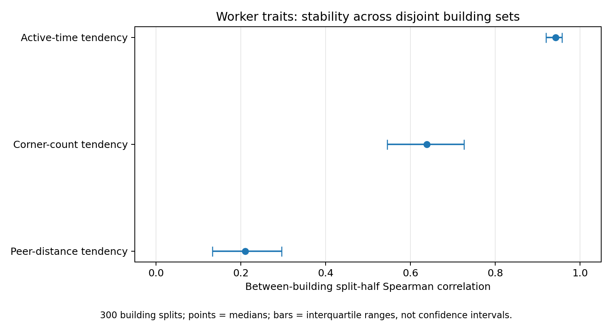

# 历史标注数据复核、工人分层与候选建模：技术交付

日期：2026-09-05。状态：探索性分析，不是最终论文方向、预注册方案或确认性结果。

## 1. 本次实际做了什么

直接读取 main 最新提交 `11a72ff323317203a56b024701620f03c9fc86c8` 的数据审计报告、源清查代码、Manual 分层代码与结果，以及本次导师交流附件。对部分当前保留的逐行表做了新的独立计算，而不是仅转述既有报告。

新计算使用3份文件的原始字节。它们通过 GitHub Actions 既有产物取得，再以 Git blob SHA 验证和本次 pinned main 完全相同；见 `input_sha_verification.json`。下载包产生于8月26日并不意味着使用的是与9月5日 main 不同的文件：本次已实际验证字节相同。但这仍是 main 当前保留的 RQ1 逐行表，不等于把9月5日全量2501条原始几何重新跑了一遍。

完整2501条原始导出→几何→所有回放链，本次没有整体复跑。仓库最新全量统计在本文明确标为“仓库结果”；新模型和计算标为“本次复算”。没有新增真人标注，没有远程修改仓库。

## 2. 导师原话所支持的边界

导师明确提出：多轮标注的瓶颈/上限、不同场景中的含义、某个人群子类的收敛、独立结果A+B混合复用；最终提纲由导师列，研究问题和步骤共同决定。语音段中的算法模拟、分心、纯机器/人工/机标人校比较是用户的回忆，且原记录明确写有不确定性，不能写成导师已确定方案。

“20人比较合适”是基于当时曲线的判断，不是已证明的最优样本量。“12–15人稳定吗”是一个待回答问题。“先不开发自动化”不是取消一切Semi研究。受控模拟是对系统或行为机制的模拟，必须与自然人类观测分开标记。

## 3. 仓库全量结果应怎样理解

仓库统计：2501 canonical、2513版本、214图、26历史工人、22 building。Manual1693、Semi574、P1 OOS234。源扫描的10956个snapshot包含参考、开发、重复/修订；不能全部作为独立标签。

| 层 | 图单元 | canonical | 观察到至少20名工人的单元 |
|---|---:|---:|---:|
| P1 Manual | 30 | 779 | 30 |
| P1 Semi | 18 | 468 | 18 |
| P1 OOS | 9 | 234 | 9 |
| C1 Manual | 87 | 674 | 12 |
| C1 Semi | 25 | 106 | 0 |
| C2-B Manual | 46 | 160 | 4 |
| C2-A-RP Manual | 42（55 contexts） | 80 | 0 |

因此至少20人支持的阶段×条件×图单元合计73，不是73张互不重复的图。旧42只是P1 Manual30+C1 Manual12。C2-B的4个单元中，严格几何同时支持k20的仅1个；不能把“有人提交”和“当前某指标有20个可计算值”混同。

旧排除的工人/图应保留在新研究总底座中，并由指标决定使用方式：不能评分完整GT的图仍可研究分歧、范围解释、过程及局部边界；已接触外部候选的响应仍可研究辅助行为，但不能冒充独立初次Manual；同一人的重复版本不能算成多个新工人。

P1的Manual30图与Semi18图不重叠，不能把两组均值差解释为Semi处理效果。C1的25张同图Manual/Semi可用于描述性配对，但条件没有因此自动随机化。当前只有20人可用，不应追溯删除历史26人的观测。

## 4. 本次复算：工人特征与分类

### 4.1 输入、估计量与验证

主子集：C1 Manual逐行表658条、84图、13 building、23历史工人；12个anchor共276条，core382条。保留当前20人名单外的历史W14、W18、W27。时间有594条、22人；时间缺失不置零，不删除该人的几何。这里是给定逐行表的可计算子集，不是全部674条C1 Manual的全纳入结果。

设同图n份标注的平均成对距离为D，去掉w后的成对平均距离为D_-w。可从已有表精确恢复该人到其他人的平均距离：

    a_w = [n D - (n-2) D_-w] / 2.

该恒等式在全部84图中验证成功，平均恢复误差最大约5.55e-16。a_w是同行距离，绝不是GT质量。

分别拟合 `观测 = task固定效应 + worker固定效应 + 剩余项`，输出同行距离、角点对数量、log(1+active_seconds)三种连续特征。每次留一个building，worker效应只能用其他building估计；测试对象是留出building内的同图相对差异，不是没有任何标签时对新图绝对结果的预测。

300次按building分成互不重叠两半，比较worker排序与分组；所有分半的设计矩阵秩检查通过。括号是重复分半结果的四分位范围，不是95%置信区间。

| metric             |   median_rho |   q25 |   q75 |   lobo_within_task_r2 |
|:-------------------|-------------:|------:|------:|----------------------:|
| corner_pair_count  |        0.639 | 0.545 | 0.726 |                 0.087 |
| log_active_time    |        0.942 | 0.920 | 0.957 |                 0.605 |
| peer_distance_mean |        0.210 | 0.133 | 0.296 |                -0.025 |

耗时特征跨building最稳定；角点数量偏好有一定可重复性但预测增量有限；同行偏离不能稳定外推。这不说明“工人没有区别”，也不说明“速度就是认真程度”。

两张图有确定性孤立点修复。把这两张图整体移除，剩648条/82图，三种相对预测R²依次为-0.028、0.086、0.605，结论未实质改变。整体移除是为了保留与既有同行距离相符的比较人群，而不是只删一行后继续使用原同行距离。

时间另做三种敏感性：仅eligible日志559条，R²=0.606；移除最快的W6后566条，R²=0.557；只留10–1800秒570条，R²=0.539。这些是事后稳健性检查，不是新的正式排除规则。

### 4.2 换分类算法是否解决问题

Ward对三轴硬分3类的building分半ARI中位数约0.094；仅几何两轴分3类约0.066。进一步尝试对角协方差高斯混合，以及按单轴排名强制分层（200次分半）：

| method                    | features          |   k |   median_ari |    q25 |   q75 |
|:--------------------------|:------------------|----:|-------------:|-------:|------:|
| diagonal_Gaussian_mixture | peer_corner_time  |   2 |        0.018 | -0.044 | 0.104 |
| diagonal_Gaussian_mixture | peer_corner_time  |   3 |        0.030 | -0.016 | 0.086 |
| imposed_rank_strata       | corner_pair_count |   2 |        0.192 |  0.192 | 0.398 |
| imposed_rank_strata       | corner_pair_count |   3 |        0.169 |  0.104 | 0.202 |
| imposed_rank_strata       | log_active_time   |   2 |        1.000 |  0.653 | 1.000 |
| imposed_rank_strata       | log_active_time   |   3 |        0.508 |  0.359 | 0.590 |

确实可以稳定分出快/慢两层，但这是耗时分层，不是认真/粗心类型。角点数量虽然连续排序具有稳定性，硬切组后的稳定性仍明显下降。高斯混合也没有解决三轴自然类型不稳定的问题。这里不进行算法优胜的显著性宣称。

### 4.3 一个跨条件线索

将其他building的Manual角点数量worker效应不缩放地迁移到C1 Semi，检验同图相对角点数量：按当前保留的RQ1 calculation-valid定义有104条Semi、25图、23人、9 building，相对预测R²=0.1182。仅原始合法的103条为0.1182；剔除存在同worker同图Manual记录的2条后，102条为0.1200。

这是复杂度倾向可能跨Manual/Semi延续的线索，不是Semi因果效应，不是质量优势，也不是已证明enclosed/extended偏好。RQ1的104条口径与9月5日全量审计的geometry-processable口径不同，不能互换分母。

### 4.4 图像与元标签的联系

在84图上，图级平均成对mask距离与以下变量的Spearman相关为：角点数量均值0.336、角点数量标准差0.405、occlusion报告比例-0.064、trivial比例-0.153、中位active time0.244。

这些变量多数来自标注之后，只能作解释性关联，不能用于宣称标注前预测效果。多个变量来自同一批标签，也存在共同测量来源。结果只提示“遮挡报告多”不能直接等同“人际几何分歧高”；它不证明遮挡没有作用。

## 5. 现有H/L/U与混合复用的审查

仓库现有H/L/U使用当前20人的C1 Core旧GT资格行，对相对当前均值的worker效应作building→task bootstrap。0.80/0.20是重采样符号比例阈值，不是“某人认真概率”，也没有直接规定实际可接受质量。授权版3/2/15，W34 original-only变5/3/12。W1、W34、W37稳定落入实质H/L，不代表只有三人的数据可以复用。

现有k3的2H+1L对1H+2L回放，把旧质量/独立性资格之外的票记为该回放不可用。因此其eligibility-adjusted quality同时反映观测覆盖和几何质量。它可以描述原旧工作流下的结果，但不能原样回答新研究的自然人群组成效应。k3也无法让两个模式都获得至少2票；supported-multimodal恒零是定义结果，不是没多峰。

更合适的候选表示是：相对参考质量q、范围/复杂度的有方向偏好b、同策略内的残差分散s、辅助条件下的识别/修订倾向r、时间t。数据支持多少维就保留多少维，不把这些维度强制写成心理人格。

粗类有两种不同含义：自然潜在类型（必须外部验证）与操作性分层（预先按连续分数/规则分组）。后者即使不是自然类型，也能用于测试特定人群组成的收敛；必须明确声明分组是研究设计，而不是数据发现。细类只在粗层中继续验证范围选择或辅助行为等机制。

类型不确定的人仍能参与混合复用。采用参数/分类不确定性的多次重放时，同一轮模拟中一名工人的参数应对所有图保持一致；不能每张图随机换一次“人格”。少量同人重复不能作为很多个独立新工人。

## 6. 收敛到底是什么

至少分开：聚合参考质量Q(k)、经验分布估计误差、少数模式覆盖、同人多轮修订R(t)。随机增加独立人的k不是同一个人多轮迭代的t。

仓库固定支持集的k15→20 status recovery：P1 Manual0.747→0.874；C1 Manual0.700→0.874；P1 Semi0.752→0.884；P1 OOS0.833→0.930。status恢复可以包括恢复“不可评价”状态，不能叫质量提高。当前20人对自己完整结果的恢复在k20达到1是构造性结果，对历史全roster目标的恢复不同。

**一个直接的数学检查：**固定N份真实标签，在无放回等概率抽样下，k人平均成对距离D_k满足E[D_k]=D_N。增加人数会让对分歧的估计更稳定，但不会自动降低实际分歧。`pairwise_unbiasedness_math_check.csv`是枚举全部子集的合成数学验证，明确不是实测数据。

若N=25，其中两人代表某少数模式，则k15抽到两人的概率是C(15,2)/C(25,2)=35%；k20为63.3%。这是固定人群中的捕获概率，不是聚类识别成功率，更不是专家认可率。若未来独立新工人某模式概率假设为0.10（并非本项目估计），k20至少两人出现该模式的概率约60.8%。因此20人不是任意低频模式的可靠恢复保证。

对于同图两种群体，若内部平均距离为D_AA、D_BB，跨群体距离为D_AB，固定抽n_A、n_B人时，总成对距离期望为：

    [C(n_A,2)D_AA + C(n_B,2)D_BB + n_A n_B D_AB] / C(n_A+n_B,2).

这指出一个可研究机制：两个群体可能各自稳定，但混合时分歧高。它无需把某群自动解释为“坏工人”，且与导师的A+B复用直接对应。质量需另用可信参考或盲审检验，不能由D反推。

## 7. 候选建模队列（尚未选为最终方向）

**候选A：组成条件下的经验回放。** 在每图共同支持中无放回抽取真实worker ID，分开类内D与类间D、模式覆盖和质量。组定义来自不重叠的校准图；每图只有该组3名实际工人时不能画该组15人实证曲线。适合现在做，目标是有限已观测人群。

**候选B：场景→不确定性需求预测。** 用标注前可得的图像/模型变量预测低k后的残余分歧或所需人数，building用于分层及留出检验。比较风险、Bi双输出差异、结构复杂度与早期k人分歧的增量。214图/22building并不等于全部图都有足够高k目标；高密度42图仅12building。当前50张候选均来自历史building，不能称新建筑外部验证。模型应先低维，不应从每个building自由拟合一个精确收敛点。

**候选C：先模式、后几何的生成模型。** 先生成范围/结构模式，再在该模式内生成有方向的偏移与相关几何残差。Bi-Layout可以提供候选，但两支网络输出不能作为两名人类。局部墙段、可见边界与参考版本应分开；角点数量只是粗特征，不是完整拓扑。当前只是候选模型，本交付没有拟合其全部参数。

**候选D：条件性噪声下限。** 在某个固定模式的标量几何量上，设X_w=θ+B+b_w+ε_w。在独立、零均值随机残差等假设下，平均估计的均方误差含共享偏差平方与随n下降的随机项。它说明共享偏差不会靠加人自动消失，但并不能从有限曲线直接证明θ已知或上限已达。用可信参考、真实重复以及受控刺激区分偏差和随机噪声，优于仅拟合一条饱和曲线。

**候选E：交互转移。** 研究独立初版→自查/参考候选→修订的结构转移，或比较同一建议下不同纠错负担。建议呈现、操作代价、复核信息均是候选HCI变量，不必须预先锁定正确/错误三臂。把检测、行动和成功修正分开；事后Model Issue不能自动当编辑前认知状态。

**候选F：时间状态/注意波动。** 若要拟合隐状态或变化点，需要可靠任务顺序、会话事件和同人重复。当前总active秒不足以识别“多久后分心”。现阶段只能作明示的假设敏感性模拟，不能写成已估计的真实疲劳规律。

这些候选的共同评价标准是留出图像/建筑/工人的预测或复现能力，而不是训练集拟合优度、好看的分组比例、重复搜索出来的显著性。

## 8. 新人、场景与最少需要澄清的研究目标

新旧人可以同时或分别用于验证。若新图和新工人全部同时更换，则差异无法归因给图像变化还是人员变化；应保留共同桥接图或一个交叉子集。工人应在独立校准图上确定分层，新图只能检验，不再倒回改类型。

建筑ID、房间实例、房间语义和视觉困难机制不是同一变量。相似场景需要在看新标签前定义。若目标是跨building预测，才必须真的留出新building；若只在旧building新图验证，应如实命名。

等待导师提纲期间需要共同明确：目标是质量到达容差还是分布/模式覆盖；多轮指新增人还是同人修订；场景指哪个层级；研究有限20人还是可招募工人总体；有哪些可信参考或独立盲审。它们决定模型目标和新数据构成，不应先把它们替用户定死。

## 9. 文件与复现

运行 `python run_reanalysis.py`。输入固定为随包3份已核验字节文件；输出表均保留明确分母。模型结果采用当前软件环境，其他线性代数环境可能出现极小浮点差别。

主输出：`profile_lobo_cv.csv`、`profile_stability_summary.csv`、`cluster_stability_summary.csv`、`grouping_method_summary.csv`、`manual_to_semi_corner_transport.csv`、`task_associations.csv`、`time_sensitivity.csv`、`minority_capture_scenarios.csv`。更细的逐行和逐重放结果也随包提供。

## 仓库原始依据

- [最新研究数据决策说明](https://github.com/Sparkling-Flames/3D_Manhattan_label/blob/11a72ff323317203a56b024701620f03c9fc86c8/analysis_results/annotation_research_decision_audit_20260905_v1/研究方向与数据决策说明.md)
- [最新全量数据审计](https://github.com/Sparkling-Flames/3D_Manhattan_label/blob/11a72ff323317203a56b024701620f03c9fc86c8/analysis_results/annotation_research_decision_audit_20260905_v1/data_audit/REPORT_ZH.md)
- [Manual分层原报告](https://github.com/Sparkling-Flames/3D_Manhattan_label/blob/11a72ff323317203a56b024701620f03c9fc86c8/analysis_results/worker_manual_strata_audit_20260904_v1/REPORT_ZH.md)
- [Manual分层代码](https://github.com/Sparkling-Flames/3D_Manhattan_label/blob/11a72ff323317203a56b024701620f03c9fc86c8/tools/thesis_main/analysis/audit_worker_manual_strata_exploratory.py)
- [新全量清查代码](https://github.com/Sparkling-Flames/3D_Manhattan_label/blob/11a72ff323317203a56b024701620f03c9fc86c8/tools/thesis_main/analysis/audit_annotation_research_data_20260905.py)
- [本次使用的逐行时间/距离表](https://github.com/Sparkling-Flames/3D_Manhattan_label/blob/11a72ff323317203a56b024701620f03c9fc86c8/analysis_results/rq1_corrections_20260826/formal_time_worker_task_rows.csv)
- [本次使用的原始点数及修复审计](https://github.com/Sparkling-Flames/3D_Manhattan_label/blob/11a72ff323317203a56b024701620f03c9fc86c8/analysis_results/rq1_corrections_20260826/c1_geometry_repair_audit.csv)

## 文献与可复用思想

以下是外部研究，不是本项目已验证的结论。PDF 链接注明版本；不能把模拟研究写成人类实测，也不能把高一致性写成更准确。

1. Peter Welinder, Steve Branson, Serge Belongie, Pietro Perona. (2010). **The Multidimensional Wisdom of Crowds.** *Advances in Neural Information Processing Systems 23*, 2424–2432. [会议PDF](https://papers.nips.cc/paper/4074-the-multidimensional-wisdom-of-crowds.pdf)。借鉴：能力、偏好、噪声不必压成单一能力分数；模型可以表现不同标注策略。边界：原工作并不保证本项目存在可辨认的自然人群类型，二值任务的潜变量模型也不能直接用于多边形。

2. Anne Chao, Lou Jost. (2012). **Coverage-based rarefaction and extrapolation: standardizing samples by completeness rather than size.** *Ecology*, 93(12), 2533–2547. DOI: 10.1890/11-1952.1. [出版社原文](https://esajournals.onlinelibrary.wiley.com/doi/abs/10.1890/11-1952.1)。借鉴：比较相同覆盖完整度，而不仅是相同人数；估计新增标注还会发现多少未覆盖模式。边界：必须先定义稳定模式；错误和聚类碎片不能机械当作新“物种”。本次未确认稳定可直达的官方全文PDF地址，不编造链接。

3. Jan Lorenz, Heiko Rauhut, Frank Schweitzer, Dirk Helbing. (2011). **How social influence can undermine the wisdom of crowd effect.** *Proceedings of the National Academy of Sciences*, 108(22), 9020–9025. DOI: 10.1073/pnas.1008636108. [作者机构PDF](https://www.sg.ethz.ch/publications/2011/lorenz2011how-social-influence/PNAS-2011-Lorenz-9020-5.pdf)。借鉴：独立新增证据、重复自查、接触他人答案，是三种不同的信息条件；分歧收缩不自动表示准确率提升。边界：数值估计实验，不是室内布局，不能预设同样方向。

4. Edward Vul, Harold Pashler. (2008). **Measuring the Crowd Within: Probabilistic Representations Within Individuals.** *Psychological Science*, 19(7), 645–647. DOI: 10.1111/j.1467-9280.2008.02136.x. [作者大学开放仓储](https://escholarship.org/uc/item/7x1799rm)。借鉴：同一个人也有重复判断变异；增加不同人和同人重复不等价。此轮只核查出处与研究框架，未将其效应量用于本项目规划。

5. Jacob Beck, Stephanie Eckman, Christoph Kern, Frauke Kreuter. (2026). **Bias in the Loop: How Humans Evaluate AI-Generated Suggestions.** *Harvard Data Science Review*, 8(2). DOI: 10.1162/99608f92.0e98898d. [已发表全文](https://hdsr.mitpress.mit.edu/pub/nrcn4h7d/release/2)；[2025作者预印本PDF，非最终发表版](https://arxiv.org/pdf/2509.08514)。借鉴：纠错负担、AI态度和错误性质可以分开研究；Wizard-of-Oz 可用于受控模拟系统而非先开发完整自动化。边界：发表版指出多项效果小；不能承诺本项目会有大效果，也不能由短任务推断疲劳阈值。

6. Hope Schroeder, Deb Roy, Jad Kabbara. (2025). **Just Put a Human in the Loop? Investigating LLM-Assisted Annotation for Subjective Tasks.** *Findings of the Association for Computational Linguistics: ACL 2025*, 25771–25795. DOI: 10.18653/v1/2025.findings-acl.1323. [官方PDF](https://aclanthology.org/2025.findings-acl.1323.pdf)。借鉴：建议呈现方式可以改变标签分布，机标人校的数据再用于评价同类模型可能带来评价偏移。版本核查：网页摘要的350人与本次打开的官方PDF摘要410人不一致，因此本说明不把网页人数直接当论文最终人数。边界：主观文本任务，不意味着几何分歧都合理。

7. Yin-Chun Lu. (2026). **Framing the Crowd: How Task Design Shapes Collective Expectation in Crowdsourcing Pedestrian Behavior Change.** *Proceedings of the Extended Abstracts of the 2026 CHI Conference on Human Factors in Computing Systems*, Article 997, 1–6. DOI: 10.1145/3772363.3799172. [ACM原文](https://doi.org/10.1145/3772363.3799172)。借鉴：相同任务目标下，说明的提问框架也可改变判断；HCI变量不只限于正确/错误模型初始化。边界：这是扩展摘要而不是CHI完整长文；原文部分分析把响应当独立观测，不应照搬其显著性分析到本项目的重复worker/task数据。

8. Miguel Monteiro, Loïc Le Folgoc, Daniel Coelho de Castro, Nick Pawlowski, Bernardo Marques, Konstantinos Kamnitsas, Mark van der Wilk, Ben Glocker. (2020). **Stochastic Segmentation Networks: Modelling Spatially Correlated Aleatoric Uncertainty.** *Advances in Neural Information Processing Systems 33*, 12756–12767. [会议PDF](https://papers.nips.cc/paper_files/paper/2020/file/95f8d9901ca8878e291552f001f67692-Paper.pdf)。借鉴：模拟完整且空间一致的几何解，而不是独立抖动每个角点。边界：概率分割网络不是经过验证的人类行为模拟器；本项目当前无需立即训练同等规模网络。

9. Yu-Ju Tsai, Jin-Cheng Jhang, Jingjing Zheng, Wei Wang, Albert Y. C. Chen, Min Sun, Cheng-Hao Kuo, Ming-Hsuan Yang. (2024). **No More Ambiguity in 360° Room Layout via Bi-Layout Estimation.** *Proceedings of the IEEE/CVF Conference on Computer Vision and Pattern Recognition*, 28056–28065. [作者预印本PDF](https://arxiv.org/pdf/2404.09993)；[会议条目](https://openaccess.thecvf.com/content/CVPR2024/html/Tsai_No_More_Ambiguity_in_360deg_Room_Layout_via_Bi-Layout_Estimation_CVPR_2024_paper.html)。借鉴：enclosed/extended 输出用于候选解释和局部歧义定位。边界：两种输出不是两名独立工人，也不是各自天然正确/错误的真值。
