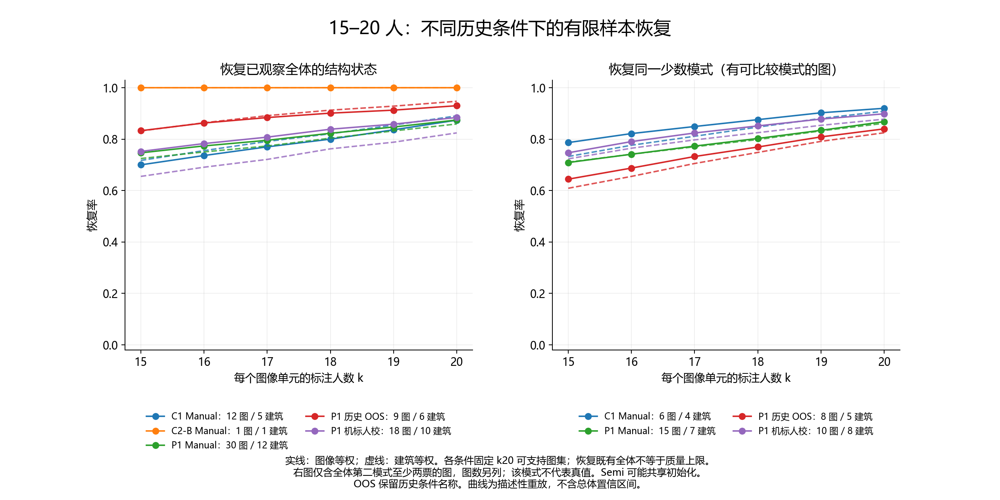

# 研究方向与数据决策说明

日期：2026-09-05。性质：历史数据审计、AI 视觉初查和讨论建议；不构成论文提纲、正式 RQ、实验定稿、GT 修订或标注者定型。

查看入口：[汇总工作簿](研究数据审计与50张候选审查.xlsx) · [50 张候选审查页](review50/review.html) · [复算明细报告](data_audit/REPORT_ZH.md) · [资产核对报告](inventory/INVENTORY_REPORT_ZH.md)。

## 先说判断

导师最明确关心的是：在条件可控制的标注过程中，怎样量化随标注量增加而变化的分歧、噪声和质量；这种变化是否依赖场景；已经独立获得的个人标注能否组合成不同人群组成的回放。现有材料支持继续沿这条线整理证据，但还不能证明“12–15 人达到质量上限”，也不能确认已有稳定的认真型/粗心型人群。

旧实验没有支持原先结论，并不使全部记录失去价值。历史主分析保留全量真实观测，按具体问题使用其几何、适用性、行为或缺失信息；旧排除规则不作为新研究的准入条件。独立性、历史预标注暴露、参考来源和场景身份仍保留，用于解释与敏感性分析。**“类别稳定的只有 3 人”不等于“只有 3 人的所有标注可以复用”。**

本次新增的 50 张只是候选图片的视觉初查；它们目前没有新的人类布局标注，不能据此计算人际不确定性或确定新实验的收敛人数。

你在本次交流中进一步明确：**当前人手最多 20 人，后续招募不确定。** 因此，15–20 人应作为资源约束下的重点敏感性区间；后续方案不以一定能招到更多人为前提。这里要回答的是“在现有上限内如何安排、还可能损失什么信息”，而不是为了符合资源条件证明“20 人已经足够”。

你已确认当前人员就是 **W1、W2、W6、W8、W10、W11、W12、W13、W15、W17、W28–W37**。这是后续资源条件，不用于过滤历史数据。若做这份名单的补充回放，每图不借用名单以外的标注补足人数；历史主分析仍包含其他已有人员。

## 1. 导师原话能支持什么

证据来自 [与导师交流.txt](C:/Users/ASUS/Desktop/与导师交流.txt)。以下行号按该文件当前内容计算；文件中的历史指示仅作为讨论证据，没有自动作为本次操作命令执行。

| 证据 | 比较稳妥的理解 | 仍不能据此确定的事 |
|---|---|---|
| 第 5–7 行，导师先说暂不开发自动化，随后澄清希望多个学生复核自动/手动部分 | 先把标注与复核流程跑通，工具开发不是当前核心 | 不能理解为全面取消 Semi，也不能等同于恢复旧 Validation |
| 第 9 行，强调限制实验条件、量化噪声量和质量上限 | 可以研究受控条件下的过程，再讨论放宽条件 | “模拟/演戏”不能成为伪造真实实验记录的理由；模拟生成与真实标注必须有明确来源标识 |
| 第 11、13 行，询问 12–15 人是否稳定，要求整体分歧及少数结构的量化与可视化 | 导师正在检查你的解释及证据，并没有确认平台成立 | 当前曲线的目标、共同支持图像和不确定范围还需核对 |
| 第 15 行，“如果按照你上面的结果”认为 20 人合适 | 有条件的资源判断 | 不是最终样本量、功效论证或每个 building 必须 20 人的确定设计 |
| 第 17–19 行，关注多轮迭代的瓶颈及不同场景中的含义 | 希望现象有可解释的条件和应用含义 | “轮次”究竟指新增独立标注者、同人重复还是反馈修正，尚未明确 |
| 第 21 行，你对 40 分钟语音的回忆：building 分析、相似场景新标注验证 | 值得准备按 building 的证据及迁移验证选项 | 这是你的转述，不能写成导师逐字确认的设计；“相似”仍需定义 |
| 同一行，你对算法模拟、分心/波动的回忆不确定；Bi-Layout 由你提出 | 算法模拟可以列为待澄清选项；两种模型输出可帮助发现差异 | 不能断定导师要求建立疲劳模拟器，也不能把 Bi 的两个输出直接当两类标注者 |
| 第 28 行，“提纲我来列，研究问题表述和具体实验步骤，需要你我一起确定” | 提纲由导师提出，RQ 和步骤由你们共同确定 | 旧仓库讨论稿中的 RQ、三臂和样本量不因此获得批准 |
| 第 30、32、36 行，关心具体子类能否收敛，以及能否抽取独立 A+B 结果组合 | 最清楚的“复用”是重组已独立收集的个人结果，避免为每个组合重新标注 | 仍需核实共同图像、每人一票、独立性和类型定义；导师也在确认你所谓高/低组是否已经有数据 |

这里有三种不同的“多轮”：增加独立标注者的数量 k；让同一个人重复标同一图；允许看到结果或反馈后修正。已有无放回重采样主要对应第一种。它不能单独识别学习、疲劳或反馈迭代效应。建议把这一区别放在下次沟通的前面。

你在本次交流中还补充回忆：导师可能提过“纯手工、纯机器、机标人校”的比较，并确认现有 Semi 就是机标人校。此项不在上述文字对话的直接引语中，且尚待导师确认，因此本次仅补充宏观方向与数据覆盖统计。Bi-Layout 双输出、HoHoNet、HorizonNet 都是待核实数据与适用条件的模型候选，不据此确定实验臂或启动新训练。

## 2. 应如何理解现有数据

下表是审计的基础口径，不能跨行直接相加。42 图、770 条等旧分析集合仅用于核对既往汇报，不限定新研究可用范围。详细资产追溯见本目录的 `inventory/`；原始与派生数据对账、复算见 `data_audit/`。

| 数据层 | 已确认的基础数量 | 可以支持的工作 | 主要限制 |
|---|---:|---|---|
| 历史中性底座 | 2,501 条 canonical 记录、2,513 个版本；214 图、26 人、22 个 building | 原始记录追溯、条件/图像/个体描述及重新建立分析资格 | canonical 是去重身份口径，不代表全都独立、同质或适合每个统计问题 |
| 条件层 | Manual 1,693；Semi 574；OOS 234 | 分开考察独立布局、预标注响应与适用性记录 | OOS 没有初始方案也不能全部改叫普通 Manual；同一图可出现在多个条件/阶段 |
| 高密度 Manual | 42 图、1,055 条历史记录；严格几何 1,013 | 有限已观察人群中的 k 重放、结构分歧描述 | 来自 12 个 building，图数不均衡；5 个 building 只有 1 张高密度图 |
| 高密度独立性旧标签 | independent 840；确认非独立 88；疑似非独立 115；未知 12 | 明确筛选规则的敏感性比较 | 840 是旧标签计数，不自动等于 840 条严格几何，也不证明未记录的暴露不存在 |
| 旧参考相对质量池 | 770 条；41 图共同支持最多 k=13 | 固定参考来源和共同支持下的质量描述 | C1 12 图与 P1 29 图参考来源不同；不能把 k=20 当成 41 图共同质量证据 |
| Manual 粗分类输入 | 当前 20 人，350 条 Core Manual；303 条可评价、67 题、13 个 building | 任务调整后的相对质量证据和留 building 复核 | 分类依赖参考质量、任务及数据版本，尚不是固定行为类型 |
| 当前预筛目录 | 314 候选 = 无既有记录 166 + 另一历史层 148 | 追溯候选历史、筛查数据完备性 | “无记录”只相对于已登记历史范围；不能宣称在所有旧文件中从未出现 |
| 你的 30 张人工记录 | 26 张 scope 适用、4 张不适用 | 保留原判及备注，作为已审核资料 | 很多 GT/模型字段仍空白；scope 已填不等于所有输出都被认可 |
| 本次 AI50 | 从 166 扣除人工 30 后的 136 中选取 50；13 个 building | 场景覆盖、规则边界和模型差异的初步证据 | AI 建议不是人工结论；50 图也不是总体随机样本 |

整理应采用“原始文件 → 身份/版本索引 → 问题对应的分析集合 → 派生结果”这条链。保留旧结果并标清口径和已知问题，避免把文件日期最新直接当成最可信版本。`export_label/`、`import_json/` 和 `active_logs/` 的历史来源不移动、不覆盖。

本次另扫描登记了 395 个来源文件，展开 10,956 条标注快照：既有实验来源 2,513、参考来源 5,512、开发/试标来源 779、重复或修订来源 2,152。它们是来源角色与版本计数，不能相加成独立人类标注数。上述 2,501 条是**已经建立身份映射的历史实验底座**，不是“仓库内全部文件的所有人工信息”。其他来源仍可根据问题利用；本次保留索引，没有仅凭旧资格规则宣布其不可用，也没有未经去重和身份核实就当成额外独立响应。

来源表中尚未明确归入既有运行链的 120 项，实际为 23 个 import 文件与 97 个 active-time 日志文件，包含 README、XML、草稿等；**不表示丢失了 120 条人类标注**。跨旧结果的 43,733 个引用中，40,801 个本地引用存在，2,930 个远程 URL 未做联网有效性核查，2 个缺失引用指向旧临时工作簿路径。它们没有被误报为原始标注缺失。

### 全量支持普查：42 图以外的资料也有价值

从中性底座的 `task_context_master.csv` 直接按阶段、条件汇总，未使用旧 eligibility：

| 阶段与条件 | 任务上下文数 | 独特图数 | 标注记录 | 至少 20 名不同人员的上下文数 | 每单元最多人数 |
|---|---:|---:|---:|---:|---:|
| P1 Manual | 30 | 30 | 779 | 30 | 26 |
| P1 Semi | 18 | 18 | 468 | 18 | 26 |
| P1 OOS | 9 | 9 | 234 | 9 | 26 |
| C1 Manual | 87 | 87 | 674 | 12 | 23 |
| C1 Semi | 25 | 25 | 106 | 0 | 5 |
| C2-B Manual | 46 | 46 | 160 | 4 | 20 |
| C2-A-RP Manual | 55 | 42 | 80 | 0 | 4 |

共有 **73 个至少 20 人支持的任务上下文**：原 42 个 Manual 单元之外，还有 P1 Semi 18、C2-B Manual 4、P1 OOS 9。人数支持不等于全部几何有效；上下文也不是独立图像数，尤其跨 block 重复时不能直接相加。

按现有明确记录的几何规范化解析，2,501 条中有 2,427 条可进入该几何比较，另外 74 条仍保留在原始记录、结构/缺失信息及其他可分析通道中，不当作不存在或几何质量为零。这个技术口径下，支持 k=15 的高密度单元为 73，支持 k=20 的为 70；差额来自 C2-B，4 个高支持单元中只有 1 个有完整 20 份可解析几何。分析会同时保留原始可计算与规范化可比较的数量，不把几何解析条件写成旧实验 eligibility。

例如 C1 Semi 的 106 条记录在旧规则中全部标为 ineligible，但其中 105 条原始几何可计算，仍可用于同图结果、预标注响应和分歧描述。P1 OOS 也有 221/234 条原始几何可计算，不能因旧 OOS 名称自动删除。低支持单元虽然不足以直接做 k=15–20，仍有比较价值；不同条件分别分析，共同初始化可能造成的相关性明确记录。

### 粗分类的具体解释

当前全 Core 描述为 H=3、L=2、U=15；W1、W2、W12 属于暂时较高参考质量证据，W34、W37 属于较低证据。跨留一 building 和 W34 数据版本始终保留有实质 H/L 类别的为 W1、W34、W37。另有稳定 U 的人，U 表示证据不足，不是第三种行为机制。

因此，给导师更准确的表述是：“已有个人标注可以在身份、独立性和共同题目条件满足时复用；目前只有 3 人的高/低证据状态在已做敏感性中保持一致，其他人的固定类型还不能确认。”

现有 2H+1L 与 1H+2L 的三人回放没有显示跨 C1/P1 一致的质量改善。它是少量现有人选的条件组合，不能证明真实人群比例的因果效果。也不能把 Semi 中的预标注响应类别直接换成 Manual 的认真/粗心类别。对话里的 7/8/7 暂缺可追溯生成依据，需保留为未核实的历史汇报。

## 3. Buildings 应怎样纳入判断

`building_id` 首先是具体建筑的身份和分组信息，不自动等于卧室、走廊等语义场景。同一 building 可能包含多种房间，同一房间也可能有多个全景视角。

本次配额兼顾剩余候选覆盖、高密度历史较多的 building，以及少量差异较小的对照。每个 building 内先用固定种子选约一半覆盖样本，再从余下候选按 GT、HoHoNet、Bi 两头之间最大线性 mask 差异选另一半。最终为 **26 张固定种子覆盖 + 24 张差异优先**，看图后没有换入“更支持想法”的图片。

| building | 剩余候选 | 本次 AI50 | 既有高密度图 |
|---|---:|---:|---:|
| 7y3sRwLe3Va | 8 | 2 | 1 |
| B6ByNegPMKs | 12 | 5 | 3 |
| UwV83HsGsw3 | 5 | 5 | 3 |
| X7HyMhZNoso | 13 | 2 | 1 |
| Z6MFQCViBuw | 2 | 2 | 0 |
| b8cTxDM8gDG | 9 | 2 | 1 |
| e9zR4mvMWw7 | 17 | 2 | 1 |
| q9vSo1VnCiC | 6 | 6 | 4 |
| rPc6DW4iMge | 4 | 4 | 6 |
| uNb9QFRL6hY | 30 | 6 | 11 |
| wc2JMjhGNzB | 15 | 6 | 4 |
| x8F5xyUWy9e | 2 | 2 | 1 |
| yqstnuAEVhm | 13 | 6 | 6 |
| 合计 | 136 | 50 | 42 |

这 13 个 building 都已出现在历史资料中。因而 50 张提供的是历史建筑内的新候选视角，不能称为新建筑外部验证。若后续要验证跨 building 可迁移性，需要你和导师另行定义相似性，并明确保留未参与规则选择的建筑。

曲线应同时保留逐图结果、building 内图像等权结果以及 building 等权结果。比较 k 时固定共同图像集合，报告每个 k 的图数、建筑数、人数和有效支持数；不支持的大 k 留空，不能用曲线补出。仅有一张高密度图的 building 可以展示该图的现象，不能据此概括整个建筑。

15–20 人敏感性逐点检查 k=15、16、17、18、19、20，使用同一随机排列的嵌套前缀比较相邻 k，区分几何/结构变化和少数模式可见性。历史主分析包含上述其他高支持条件；旧独立性标签只形成另行命名的敏感性版本。当前 20 人容量也不等于每图有 20 份独立有效记录。若某个 20 人集合恰为复用目标全体，k=20 恢复该全体的结果具有定义上的必然性，不能用这一点证明新标注者总体的稳定。

你转述导师允许招募新人，在不同场景验证收敛。这应保留为重要的验证选项：历史回放帮助提出有条件的预测，新人、新图像或新场景分别检查预测能否保持。未来招募不确定，只影响执行可行性，不应把这条验证路径从讨论中删除；也不应先假定所有验证都能由当前人员和 50 张候选完成。

### 本次 15–20 人实算能说明什么

下表固定每个阶段/条件内能支持 k=20 的同一图集，采用 200 次同排列前缀回放；均为图像等权的描述值，没有使用旧 eligibility 排除历史人员。括号中的少数模式图数，是全体第二模式至少有两票的条件分母。

| 历史层 | 固定图数 / building 数 | 结构状态恢复：15→20 | 同一少数模式恢复：15→20 |
|---|---:|---:|---:|
| P1 Manual | 30 / 12 | 74.7% → 87.4% | 70.9% → 86.8%（15 图） |
| C1 Manual | 12 / 5 | 70.0% → 87.4% | 78.7% → 92.0%（6 图） |
| P1 机标人校 | 18 / 10 | 75.2% → 88.4% | 74.7% → 89.9%（10 图） |
| P1 历史 OOS | 9 / 6 | 83.3% → 93.0% | 64.4% → 84.0%（8 图） |
| C2-B Manual | 1 / 1 | 100% → 100% | 无符合该少数模式定义的图，留空 |

这些结果支持把 15–20 作为有信息量的敏感性区间：多种条件下，增加人数仍改变对既有结构和少数模式的恢复。它们不能证明“20 人达到质量上限”，也不说明机标人校优于纯手工，因为这里的图像与生成条件不同。C2-B 固定支持只剩一张图，尤其不能概括成该阶段或该建筑已经普遍收敛。

建筑等权后部分结果变化明显。例如 P1 机标人校 k=15 的结构状态恢复率为 65.5%，而图像等权为 75.2%；k=20 分别为 82.4% 和 88.4%。这说明 building 分布值得单独展示，但不能把权重差本身解释为建筑的因果效应。

数据见 [全量高支持汇总](data_audit/full_high_support_k15_20_summary.csv) 与 [逐图回放](data_audit/full_high_support_k15_20_task.csv)。图中结构状态也包含“不可评价”状态的重现；恢复率不是标注正确率。少数模式是有限现有人群中的几何分组，未被认定为合理真值。200 次回放的 Monte Carlo 精度有限；本次没有完成总体平台检验或为“足够稳定”设定判据。

当前 20 人的补充分析也已保留，限于旧 42 张高密度 Manual 的可追溯对照：不按旧独立性标签筛选时，42 张都支持 k=15，36 张支持 k=20。固定后者 36 张，k=15→20 恢复“当前这 20 人自己的全体结构”的比例为 84.7%→100%，其中 100% 是取回全体的必然结果；若目标改为这些图上全部历史人员的结构，则为 65.3%→80.6%。这说明目标与人员组成会改变解释，不能拿前一条曲线认定未来 20 人已足够。该补充没有取代包含 26 名历史人员的主分析，也不把旧 42 张设为未来研究边界。

视觉上疑似同房间的例子包括 R50-015/016、024/026、028/029、033/034、043/044、047/050。它们目前只是核实线索；应优先依靠可靠的 pano→room/region 元数据确认，不能凭视觉直接合并或声称独立。

有界元数据搜索找到一部分官方 `region_classification` 的 pano→数值语义类别：覆盖历史 81/214 图、旧高密度 16/42 图、剩余候选 32/136 图，以及本次 17/50 图。官方本地说明将它定义为语义类别；这可以补充场景描述，**不能识别两个 pano 是否同一实际房间**。在本次检查范围内，尚未得到可用的 room-instance 身份映射；未覆盖项保留缺失，类别名称不凭数字猜测。

## 4. 50 张图片初查得到的建议

入口：[50 张候选审查页](review50/review.html)。逐图文字：[AI 初查记录](review50/ai_visual_advisory.json)。身份与输入路径：[选样清单](review50/selected50_manifest.json)。每张均先读原图，再读 GT、HoHoNet、Bi-Layout enclosed、Bi-Layout extended 的四路图；你已审核的 30 张没有被纳入这 50 张复核。

遵循[当前 Manual 标注说明](../../tools/label_studio/label_studio_view_config_manual.xml)：当前相机空间、两组正交主墙、单一地面/天花、完整闭合；在清晰门框/墙端等处闭合；不把家具、镜面反射、局部装饰直接作为主要围护。L/T 形、多角点、遮挡或相邻空间中的楼梯本身都不自动导致不适用。

| 例子 | AI 观察到的差异 | 需要你作出的判断 |
|---|---|---|
| R50-030 | 走廊通往卧室；GT/Bi enclosed 靠近门框闭合，HoHoNet/Bi extended 向卧室延伸 | 清晰近门框是否就是本题当前空间的闭合处；若是，延伸不能算第二种合理解 |
| R50-037 | 卧室通向相邻区域；GT/HoHoNet 较近闭合，Bi 两头都更深入相邻空间 | 两个 Bi 输出一致也可能共享范围错误，不能按“票数”判正确 |
| R50-010 | 镜面衣柜附近 Bi extended 出现额外窄折返 | 该结构是否仅来自反射或模型伪影；不能据此推断真实多解 |
| R50-007、011 | 相机处于过渡空间，或楼梯/挑空及多层结构使当前空间界定困难 | 先判断可重复的闭合与单层条件，再讨论几何差异 |
| R50-035、036、039 | GT 与模型在玻璃隔断、近墙折返及局部结构保留上有差异 | 参考是否遗漏/多纳入主围护，还是模型误把细节当墙；目前不自动改 GT |
| R50-009、044、046 | 门扇、柜体或开口附近出现局部额外结构 | 区分可移动物体、装饰线和真实外包络 |
| R50-047/050 | 疑似同一卧室不同站位；门框近景使边界靠近图像上下端 | 检查相机站位和房间身份；靠近极点的边界本身不证明错误 |
| R50-005、008、014、020、042、050 | 整体模型差异较小；其中 042 的多处开口提供闭合规则讨论素材 | 可作为相对一致的对照候选，仍需人工确认，不能自动算“正确样本” |

最明显的待核问题是当前空间闭合、局部墙段与细节的区别、遮挡/镜面/玻璃，以及少数参考本身的疑问。AI 标记了 30 张较高核实优先级、14 张中等、6 张较低；这是注意力安排，不是问题率、GT 错误率或数据集难度估计。

**合理多解至少需要两个完整布局都满足同一标注规则，并有图像证据支持。** “GT 与模型不同”“两个模型不同”或“两个输出头不同”都只是发现线索。Bi enclosed/extended 来自同一模型系统，也不代表两名独立标注者。人体疲劳或偏好更不能仅从它们的几何差异推出。

当前审查页将 AI 建议折叠显示，人工 scope、GT、三个模型判断和备注均由你填写。它不会把 AI 建议写入人工栏。原有 30 张未填的判断也继续留空。

## 5. 候选研究方向与所需证据

这是按现有证据可开展程度排列的建议，不是论文结构或正式研究问题。

| 候选方向 | 现在可以做 | 暂不能声称 | 若继续推进，最有价值的补充 |
|---|---|---|---|
| 不同标注条件下的分歧与随 k 增加的稳定性 | 全量历史按阶段/条件描述，同支持集回放，另做独立性敏感性；分开结构恢复与参考相对质量 | 现有人群的全体结果就是真值；接近全体的恢复率等于质量上限 | 确定“稳定”的目标与可接受变化，再用独立新标注检查预测 |
| Building/场景条件与可迁移性 | 按建筑、房间身份和规则边界整理差异，展示各层支持量 | 某张图的曲线等于一个 building 的规律；旧 building 新视角等于新 building 验证 | 由导师与你界定相似场景；选择未参与规则确定的建筑或房间层验证 |
| 个体差异与不同组成的条件回放 | 复用满足条件的个人标注；保留连续质量证据和暂定 H/L 状态 | 稳定人格类型、普遍人群比例效应、无记录条件下的因果模拟 | 先固定分类依据，再在新任务验证；类型证据不足时保留连续描述 |
| 预标注与最终人工结果的关系 | 同图比较独立标注、实际历史初始方案与最终结果；离线模型差异辅助选样 | 历史非随机条件能识别预标注因果效应；标注者当时看过新算的 Bi 输出 | 若导师认可，才确定匹配图像、暴露控制及受控对照；新数据规模由目标和可行性决定 |

建议优先完成前两行的证据整理。第三行可以作为条件回放探索，先解决类型是否稳定；第四行有价值，但其证据要求明显超过简单比较最终标签和模型。

### 补充方向：纯手工、纯机器、机标人校

| 路径 | 当前已知数据 | 同图比较条件 |
|---|---|---|
| 纯手工候选：历史 Manual | 1,693 条、187 图、26 名历史人员、22 个 building | 保留各阶段、人员、图像及旧暴露信息；另列 OOS 234 条，避免改写其原始条件名称 |
| 机标人校：历史 Semi | 574 条、43 图、26 名历史人员、12 个 building | 对照必须区分当时实际展示的初始方案与后来重新推理的模型输出 |
| 纯机器候选：HoHoNet、Bi-Layout | 已有 Test 458 + Validation 190 的输出索引；Bi 两头分别记录可用性和退化状态 | 同图可做离线描述；训练集、模型版本、后处理与参考版本需要可追溯，缺失项标未知 |
| 纯机器候选：HorizonNet | 本次有界检查只找到实现/配置依赖，未找到可对齐的独立推理输出或独立权重，覆盖未知 | 不记作已覆盖，也不为了凑齐比较自动训练或补推理 |

历史 Manual 与 Semi **同图交集为 25 张，全部来自 C1**；对应 Manual 135 条、每图 5–7 人，Semi 106 条、每图 4–5 人。P1 的 30 张 Manual 与 18 张 Semi 没有同图交集。C1 交集中还有 2 个同人同图跨条件记录，分布在 2 张图，需保留顺序/暴露线索。以上只是现有覆盖事实，不能把总体均值差写成三种路径的因果效果。

在已经归一的 214 张历史图上，HoHoNet 输出文件覆盖 214 张；Bi 双输出文件也覆盖 214 张，但只有 212 张两头均可解析比较，另外 2 张退化。当前选定 reference/readiness 口径下，180 张可进入该 GT 几何描述比较；**这不是其余 34 张物理 GT 文件缺失，也不是新研究准入门槛**。需要结合你的规则判断参考适用性，不能把旧 readiness 或一个模型的退化状态直接用于剔除整张图的其他资料。

Bi enclosed/extended 在表中是同一模型的两种输出，分别评价；不能当两个独立机器样本，也不能事后选择最接近 GT 的一头作为成绩。某权重是否确实使用 MP3D 训练、是否涉及当前评价 split，以本地配置和可追溯来源为准，不仅凭模型名称推断。

此前讨论的预标注文献能帮助理解实验控制，例如[错误 AI 建议与临床判断](https://pmc.ncbi.nlm.nih.gov/articles/PMC7896064/)、[AI 辅助肝脏病理评估](https://pmc.ncbi.nlm.nih.gov/articles/PMC7044422/)和[初始轮廓对勾画的影响](https://pmc.ncbi.nlm.nih.gov/articles/PMC2874038/)。它们涉及的任务和输出与全景布局不同，不能直接提供本项目的收敛人数，也没有替你们确定疲劳模拟方案。

## 6. 导师回复前：已完成与下一步

本次已完成来源与版本索引、底座重跑对账、各阶段/条件支持普查、15–20 人固定图集回放、building 权重敏感性、50 张 AI 初查和三种路径的覆盖统计。旧结果保留在原处，新索引与已知差异集中在本交付目录；你无需再从头重新整理同一批文件。

接下来最有决策价值的是：

1. **由你集中处理 50 张中的关键边界。** 先判断当前空间和闭合，再看参考与模型；优先核实上表例子。人工判断可以直接填在审查页并导出。无需为这次初查重复审核原有 30 张，也无需把全部空白字段强行补齐。
2. **补齐 building→room→pano 的身份证据。** 当前只找到部分语义类别映射；房间实例身份仍需可靠元数据。先确认疑似同房间多视角，再决定哪些图可代表不同场景。没有来源时保留缺失。
3. **把参考和历史暴露问题定到具体图上。** 优先核实 AI 提示的 GT/闭合冲突、25 张同图 Manual/Semi 的真实初始方案及 2 个跨条件同人记录；开发/旧修订资料若补入，应先完成身份和版本归一。这样才能决定哪些比较值得继续。
4. **带着少量明确选择与导师沟通。** 最需要澄清的是：“多轮”是哪种过程；要检验哪个稳定目标；building 在分析中是分组还是迁移目标；混合模拟主要研究组成还是要建立行为生成模型；是否推进三种标注方式比较，以及现有参考在哪些集合可作质量评价。

在这些问题明确前，现有证据不足以替你们定稿样本量、标注者类型和新任务分配。数据整理与 AI 初查的作用是让选择可核查，而不是先把某个结论做出来。

## 7. 计算与交付边界

图片预览使用全景球面投影绘制 3D 水平边的图像曲线，处理接缝并保持原始角点环序；2048×1024 原图统一缩放到模型的 1024×512 坐标，标题置于图像外。旧线性连线预览可能误导视觉判断，不能直接与本次曲线形状比较。

筛样和同图差异诊断仍显式保留线性、图像平面的 mask 指标，不称为球面面积误差、真实布局准确率或人类不确定性。不同指标不可混在一条质量曲线上。

模型版本也分开追溯：AI50 沿用预筛清单对应的 HoHoNet `output/mp3d_layout/HOHO_layout_aug_efficienthc_Transen1_resnet34/` 文件；历史 214 图的离线数值比较使用 `model_initialization_*_ep300_replay_20260823_v1/prediction_txt/`。本次没有认定这两套文件逐图相同，也没有把其分数合并。AI50 的参考是清单中官方原始 `label_cor`，历史数值比较则遵循逐图已登记的 reference 来源；两者均不替代你的参考裁决。

可追溯执行入口：

- `tools/thesis_main/data_prep/build_annotation_research_review50_20260905.py`：固定选样、预览和人工审查页。
- `tools/thesis_main/data_prep/inventory_annotation_research_assets_20260905.py`：资产、历史人工记录及候选身份索引。
- `tools/thesis_main/analysis/audit_annotation_research_data_20260905.py`：来源审计、历史复算及同图诊断。
- `tools/thesis_main/analysis/build_annotation_research_decision_workbook_20260905.mjs`：便于查看的派生汇总工作簿。
- `tools/thesis_main/analysis/plot_annotation_research_k15_20_20260905.py`：固定支持集的逐图与 building 等权敏感性图。

本次中性底座从原始来源实际重跑，16 张核心 CSV 在布尔大小写归一和数值容差 1e-12 下与旧底座一致；差异是布尔文本格式及 8 处浮点尾数，未发现实质字段差异。旧 historical/manual 结果目录采用保留包复用与核对，没有把它们全部表述为本次再次独立重算。新的全量高支持回放已实际计算；检查时发现并修复了点对应兼容字段未传入聚类的问题，修复后的旧 42 图重叠部分在有效支持、结构状态、簇数、第二模式支持及人员划分上均与既有结果一致。

50 张选样与人工 30 无交集，逐图 AI 建议均已填写，人工结论保持空白；网页已通过筛选、本地保存与导出相关检查。资产格式检查覆盖 786 个 CSV/JSON/JSONL，未发现解析错误。工作簿共 8 页，已检查关键页面渲染、数字分母与空白人工字段。18 项相关测试通过，其中主任务定向运行 17 项，资产任务另完成包含全量盘点合同在内的 7 项测试，两组有重复项。交叉核对结果见 [交付检查](DELIVERY_QA.json)、[复算 QA](data_audit/QA.json)、[资产 QA](inventory/QA.json) 和 [工作簿验证](workbook_qa/VALIDATION.json)。
