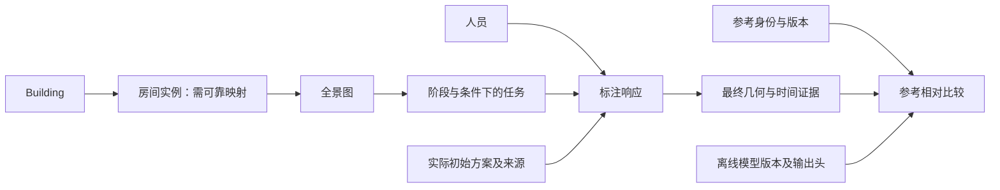

# 三轴建模：解释、文献对照与数据可行性

本材料供研究讨论，不确认导师的轴定义，不拟合场景难度或人数预测模型。依据包括桌面交流记录、用户对语音讨论的回忆及六篇原文；三者不能互相替代。旧实验的三轴不在本次候选解释中。

## 1. 先区分三个不同的问题

“三个轴”可能只是图的三个坐标，例如人数、场景难度和分歧；“建模”则需要明确观测单位、输入、结果和误差；“人员的三个特征”是对人的描述，例如参考相对质量、时间、修改倾向。这三件事可以关联，但并非同一套定义。

以一张图为例，横轴放参与人数 k，纵轴放独立确定的场景难度，竖轴放标注分歧，意思是问“不同难度下，增加标注能否减少分歧”。图中每个点仍需交代人员如何选择、参考版本、是否共享初始化、属于哪栋建筑。同图的 200 次重采样不是 200 张独立图。三维曲面很容易制造确定性的印象，本轮只解释坐标与可观测量，不画拟合曲面。

## 2. 三种待确认解释

| 候选 | 坐标示例与研究问题 | 目前可以观测 | 缺口与不能识别的关系 |
|---|---|---|---|
| A：标注量—场景难度—结果 | x=k；y=独立场景难度；z=一个分歧或参考相对误差。不同场景增加人数的表现是否不同？ | 高支持历史单元的嵌套抽样、几何分歧、参考相对差异；图像与 building 信息 | 缺少已确认且独立的难度定义；共享初始方案会影响分歧。历史剩余人员不能代表新招募总体。 |
| B：数据条件—标注难度—收益 | x=独立图像供应量等单一数据条件；y=难度；z=增加标注带来的一个收益。资源应补更多图还是更多人？ | 独立图像数、每图有效人数、可靠活动时间分别统计；历史增加 k 的有限变化 | 当前观察不是随机分配资源的实验；图像数、每图人数、总工时不能揉成一个“数据量”。未标图像的收益不可由现有图直接确定。 |
| C：人员组成—场景条件—结果 | x=固定总人数下某候选倾向的比例；y=场景条件；z=分歧或质量。混合组成是否更适合某些场景？ | 任务留出后的人员连续特征、候选描述、共同任务上的真实人员组内/混合回放 | 候选类型可能不稳定；稀疏人员—任务网络与场景分配混杂；缺少共同支持的组合不能计算。不得用评价任务先定义“好人”，再证明该组更好。 |

导师文字中“数据受限且难标、数据不受限标注但难标”等表述，与 B 的资源问题相容；用户回忆的不同场景、building 和新人收敛验证，与 A 或 C 相容。这仅说明解释可讨论，不能据此认定原意。building 首先是相关性和外推的分组单位，不天然等于难度；房间语义类别也不等于房间实例。

结果轴一次只选一个量：人员间一致性、对参考的差异、留出人员与代表标注的差异、或增加标注的收益。它们回答不同问题。靠近参考不必然正确，一致也可能来自共同错误；应并列展示而非合成未验证的总分。

## 3. “数据建模”可以从数据关系开始

这是可追溯的数据关系图，不是因果图。统计上同人、多图、同建筑、同初始化会引入相关性，不能把所有行当作独立证据。先明确这些关系，才能讨论应使用什么统计模型；无需先选“三轴公式”。

难度候选需另行确认：可在独立审查中记录遮挡、可见边界、几何复杂性或标注规则歧义；当前人工审查只提供有限支持。若将同批标注分歧定义为难度，再用难度解释该分歧，会产生循环。用独立人员/图集定义并留出评价可减少循环，但本轮不额外审图或实施难度拟合。

## 4. 六篇文献的实验设计对照

| 文献 | 主要比较/操纵 | 评价对象 | 对本项目的直接价值 |
|---|---|---|---|
| Gaube 2021 | 建议正确性 × 宣称来源；医生专长 | 诊断准确性、建议评价 | 建议质量、来源标签与人员差异分开 |
| Kiani 2020 | 有/无辅助的交叉比较 | 诊断准确性；人和切片差异 | 正确和错误建议分开；控制历史暴露 |
| Sensakovic 2010 | 从零画轮廓、编辑不同人的初始轮廓 | 观察者内/间一致性、修改幅度 | 共享初始化会改变一致性，不能替代正确性 |
| Mikulová 2022 | 从零/预解析 × 工具支持条件 | 参考相对准确性、时间 | 质量—时间并列；同人不重复同题；参考裁决来源 |
| Berzak 2016 | 从零、审阅人/机器标注、盲评 | 一致性、质量及参考偏倚 | 检查初始化锚定和参考对模型的偏向 |
| Whitehill 2009 | 潜在能力/难度模型与多数票等比较 | 潜在类别估计 | 人员和题目差异的建模思路；需检查独立性与任务适配 |

### 1）Gaube 等，2021

**Do as AI say: susceptibility in deployment of clinical decision-aids**。原文方法与结果：胸片诊断中操纵建议正确性与宣称来源，比较不同专长的医生。建议实际由人类专家制作，一部分被标为 AI。错误建议可能降低诊断准确性，来源标签与真实建议质量必须分开。其“critical/susceptible”行为描述不能直接转成跨场景稳定的人格类别。适合支持初始化/建议影响与独立正确性评价，不证明疲劳，也不是纯人工、纯机器、机标人校的完整三臂比较。[原文与摘要](https://pubmed.ncbi.nlm.nih.gov/33608629/)

### 2）Kiani 等，2020

**Impact of a deep learning assistant on the histopathologic classification of liver cancer**。原文第 1、3–5 页：11 位病理医生、80 张独立测试全切片，随机交叉设计并设置两周间隔。总体平均准确率提高未达统计显著（p=.184），特定九人子集敏感性分析不同；正确模型建议有帮助，错误建议有害。模型评价输入也涉及医生选择的图块，不能直接当作完全自主的机器流程。研究区分医生专长、切片和肿瘤分级；可借鉴独立难度代理及人/题交叉处理，不可概括为“机辅一定更好”。[原文](https://doi.org/10.1038/s41746-020-0232-8)

### 3）Sensakovic 等，2010

**The influence of initial outlines on manual segmentation**。原文方法与讨论：3 位观察者先独立描绘胸膜间皮瘤，一月后编辑匿名的初始轮廓，初始轮廓来自这三位人类观察者。设计使用 30 位患者的 150 张 CT 切片，最终比较集因无肿瘤/不共同支持缩为 118 张；不能混用两个分母。共享初始轮廓能影响观察者间一致性，但一致性不等于准确性，也不能把初始轮廓称为机器输出。对本项目最直接的启发是追溯历史初始化、分别报告一致性与参考相对质量。[原文](https://pmc.ncbi.nlm.nih.gov/articles/PMC2874038/)

### 4）Mikulová 等，2022

**Quality and Efficiency of Manual Annotation: Pre-annotation Bias**。原文第 5–6 页：4 位标注者，在从零开始/预解析两个模式下，比较不同支持条件；同一标注者不重复标相同数据。同时评价时间和参考相对准确性，参考通过汇集标注分歧并由规则制定者裁决获得。它支持将质量与时间并列，并审计参考产生过程；其依存句法任务和辅助工具条件不能直接搬成全景布局的人员分类阈值。[原文](https://aclanthology.org/2022.lrec-1.312/)

### 5）Berzak 等，2016

**Anchoring and Agreement in Syntactic Annotations**。原文方法与结果：比较从零标注、审阅人类/解析器标注及盲评排序，审阅者/排序者不知道标注来源。解析器初始化可能形成锚定，并使基于该过程构建的参考偏向模型。可借鉴隐藏来源的独立评价、检查参考是否受初始化影响。不能据此断言所有机辅都降低质量，或把多数一致自动当作真值。[原文](https://aclanthology.org/D16-1239/)

### 6）Whitehill 等，2009（补充文献）

**Whose Vote Should Count More: Optimal Integration of Labels from Labelers of Unknown Expertise**，GLAD。原文第 2–3 页：对二元类别标注联合推断真实标签、人员能力和图像难度，给定潜变量后假设响应条件独立。它展示了人员与题目差异如何进入概率模型；共享初始化可能挑战独立性，连续布局还需要另行定义观测与误差。三个待推断对象不是导师已确认的三个坐标，也不是本轮要拟合的模型。[原文](https://papers.nips.cc/paper_files/paper/2009/file/f899139df5e1059396431415e770c6dd-Paper.pdf)

## 5. 对三种标注方式的准备价值

纯手工、纯机器、机标人校目前是用户补充的宏观方向，尚未获导师确认。历史 Semi 是机标人校的候选证据，但必须确认实际初始方案；离线 HoHoNet 与 Bi 两头可以形成机器输出比较列，不能自动当作当时的初始化。两头分别报告，不根据参考挑选较优头。纯机器流程还需明确输入、预处理、后处理和训练/评价划分，不能仅凭模型名字成立。

C1 的 25 张同图交集可以支持描述性对照：同图参考、内部一致性、初始到最终修改及离线模型差异。分配机制、人员差异、历史暴露和参考来源未被控制时，不能把组间差异解释为标注方式的因果效应。P1 人工构造初始化应单列，其效果不代表自然模型错误。

本轮实查进一步发现，C1 导入程序从 `export_label/groudTruth.json` 的预览字段构造预测载荷；24/25 张的初始化与所选参考 D_mask 为零。这个来源关系尤其需要先解释清楚，见[本轮报告](研究前置工作报告.md)。

## 6. 导师回复前可完成的决策准备

本轮证据表、分类留出结果和历史人数诊断分别回答“哪些可比较”“人员描述是否迁移”“已有人员中的剩余分歧”。讨论时可据此选择更值得验证的问题，并携带明确的支持缺口；不需先确定论文结构或新实验样本量。

需要导师确认的核心内容是：最关心一致性还是正确性/收益；“三轴”指图形表达还是统计关系；building 是外部验证分组还是场景设计因素；是否将三种标注方式作为正式比较方向。当前数据不能替导师回答这些选择。

原文核读来源：前五篇使用用户提供的本地 PDF（桌面交流文档已保留对应书目信息），第六篇使用 NeurIPS 原始 PDF。这里的借鉴是本次分析建议，不表示导师已采纳补充文献。
