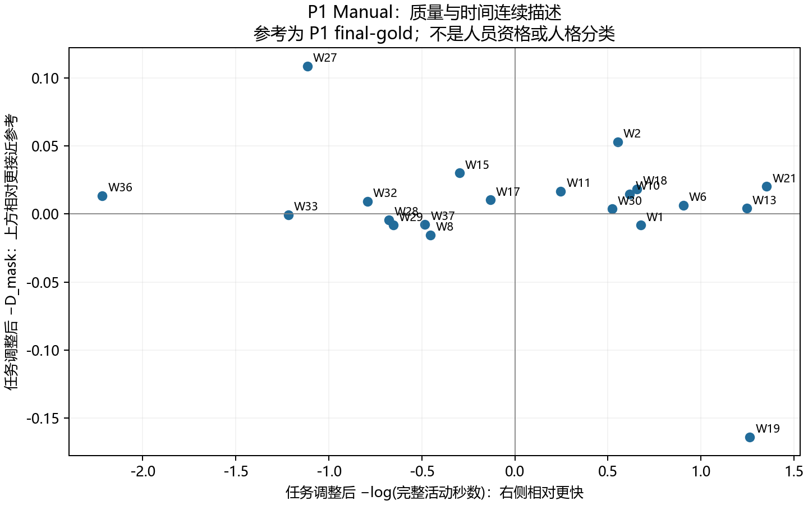
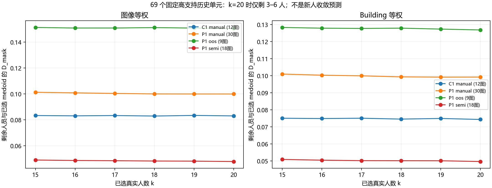

# 第二轮研究前置工作报告

本轮完成历史来源核对、25 张同图比较、质量/时间/习惯连续描述与候选分层、任务和 building 留出诊断、人数与结构敏感性，以及三轴和六篇文献对照。所有结论用于辅助研究决策，不确认人员类型、导师原意、论文提纲、新实验步骤或人数。

## 1. 最值得带给导师的发现

**第一，C1 初始化已找回，但参考独立性需要特别核实。** 25 张 Semi 的 106 条响应均可连接到导入预测；574 条全历史 Semi 的初始坐标与对应导入一致，最终坐标与原始响应一致。旧“初始化缺失”来自导出只保存预测 ID、旧程序只接收完整预测对象的通道差异。这不等于精确模型 checkpoint 已找回。

C1 生成程序实际从 `export_label/groudTruth.json` 的 `data.vis_3d` 提取坐标、转成预标注，并写入 `HoHoNet_C1_v3_1_smoke` 标签；全部 106 条响应的初始坐标与此来源一致。模型标签本身不能证明推理版本。25 张同图中，24 张初始方案与本轮选用参考的 **D_mask 为 0**。因此，Semi 与参考更接近，可能受到共同初始内容或参考来源关系影响；不能将其直接作为 Semi 提高正确性的证据。这里核实的是几何与来源关系，没有替用户判定参考对错。

**第二，质量、时间和修改倾向确实可以分别描述，但不支持把人固定成少数永久类别。** 在 P1 Manual 的 final-gold 参考层，0.80 探索阈值下出现 6 个正向质量描述、4 个负向描述，其余 16 人未稳定分层。不同任务留出后成员仍会变化。描述必须随阶段、条件、参考与支持量一起阅读。

**第三，历史 k=15–20 的剩余人员差异变化较小，但这不是“新标注者已收敛”的证明。** 本轮在 69 个严格几何人数大于 20 的固定单元中，完成 82,800 次回放；k=20 时仅余 3–6 人。该结果能界定现有历史诊断的范围，不能消除招募新人和新场景的不确定性。

## 2. 数据底座和补齐的证据

| 项目 | 本轮结果 | 可使用范围 |
|---|---:|---|
| Canonical 历史响应 | 2,501 条、26 人、214 图、22 个 building | 不按旧排除名单或当前 20 人过滤 |
| 原始版本链 | 2,513 条版本记录 | 快照/修订不增加独立人数 |
| 原始任务与标注身份 | 2,501 条均唯一匹配 | 逐条保留导出、导入、人员、任务身份 |
| Semi 初始坐标追溯 | 574/574 与导入一致 | 可比较历史初始到最终的变化 |
| Semi 导出表示 | 574 条均只保存 prediction ID | 不能要求导出 ID 自带完整模型载荷 |
| C1 同图 | 25 图；Manual 135 条，Semi 106 条 | 9 个 building；只有 2 个同人跨条件图对，非配对因果实验 |
| 开发/旧资料 | 779 个快照行、379 个 runtime 身份 | 674 行无条件字段；105 行有条件仍未核实人员、流程与历史暴露，新增独立响应为 0 |

开发资料保存在单独候选表，未因旧资格规则删除。账号数字相同不必然证明历史人身份和执行条件相同，不能据此自动补进新响应。全部历史响应仍可按具备的字段进入相应通道；几何缺失、时间缺失不会导致整条记录消失。

证据入口：[记录级证据](evidence/record_evidence.csv)、[初始化连接](evidence/initialization_trace.csv)、[版本链](evidence/version_lineage.csv)、[重复暴露](evidence/historical_exposure.csv)、[额外资料候选](evidence/additional_response_candidates.csv)。没有覆盖原始标注或人工判断。

### 活动时间

| 时间证据 | 条数 | 本轮用途 |
|---|---:|---|
| 完整、归属可核对 | 2,032 | 正值活动时间取 log，按任务调整 |
| 完整、但带旧协议偏差标记 | 17 | 纳入描述并保留偏差状态，不宣称无偏 |
| 部分会话覆盖 | 20 | 单列，不参加快慢分类 |
| 仅 lead time | 353 | 不代替活动时间 |
| 活动时间缺失 | 79 | 仍保留几何等其他通道 |

人员时间特征共使用 2,049 条记录。这里“完整”沿用可核对的日志累计/冻结证据含义，不表示观察到了标注者所有现实活动。旧时间资格标记曾把 20 条部分覆盖记为 eligible，本轮依据覆盖状态单列，而非直接继承该资格。

### P1 初始化条件

18 张 P1 Semi 分为自然 trap 6 张、自然 control 6 张、人工构造且来源分离的 synthetic 6 张，各 156 条响应。前两类使用对应 final-gold，后者使用 synthetic-source 参考，分别统计。C1 25 张另列。修改幅度、原样保留、结构变化和参考相对变化可同时阅读；模型问题选项的时间均未锁定，不能推断其发生在修改之前。[分条件统计](evidence/initialization_condition_summary.csv)

## 3. 25 张同图材料能说明什么

[逐图汇总](evidence/matched25_image_summary.csv)连接人员数、严格几何数、完整时间数、内部两两分歧、同一参考差异、初始到最终的变化，以及 HoHoNet / Bi enclosed / Bi extended 离线输出。完整比较明细另存 CSV，没有选择更接近参考的一头。

这 25 张图的图像等权参考相对 D_mask 均值：Manual 约 **0.11670**，Semi 约 **0.06058**；但 24 张初始化与选用参考的 D_mask 为 0，33 条 Semi 原样保留初始化。该差异需与参考关系、不同人员组成和共同初始化一起解释。内部比较有 Manual 288 个、Semi 164 个可用人员对；这些人员对不是独立图像样本，不用两两对数冒充有效样本量。

D_mask 是周期插值后的图像平面掩膜代理量，并非球面或 3D 布局误差。角点不兼容时只使用可定义的通道，点对点对应和有符号偏移留空，不以 0 填补。Manhattan 规则仍是用户的人工判断约束，数学解析成功不自动证明图像符合规则或参考正确。

历史 `Manual` 是任务条件标签，不自动证明整个操作过程从未接触任何预览。C1 生成程序也为 Manual 数据保留了 `vis_3d` 字段；字段存在不等于标注者实际查看过内容，但尚无完整可见性/查看事件证据时，不能将这些记录无条件升级为未来“纯手工、完全无初始化暴露”的实验臂。

## 4. Building、房间和模型来源

22 个 building 均可连接到本地官方场景列表；pano 到房间实例仍缺可靠结构化映射。已有 region class 仅是语义类别，不能把同类别图像归为同一个房间。人员—building—条件覆盖已输出，单 building 人员只报告描述，不能称跨建筑稳定。[覆盖表](evidence/worker_building_condition_coverage.csv)

模型来源核对区分三个层次：当前离线结果、实际历史初始化、训练数据谱系。Bi 的本地运行元数据记录了 checkpoint 路径、MP3D 配置、Manhattan 后处理，以及 enclosed=`new_depth`、extended=`depth` 的双头映射。HoHoNet ep300 离线目录与旧 output 目录分别保留，默认脚本参数不等于完整运行证明。HorizonNet 未核实独立预测/权重，不能只凭实现或配置文件把它算成已比较模型。

本地 HoHoNet 训练图片目录和 Bi 训练 split 各有 1,647 图，与 214 张历史图未发现同图交集；HoHoNet 本地训练图的 building 与历史 building 亦未发现交集。**这些本地文件不是已用 checkpoint 的完整训练谱系，实际训练泄漏状态仍为未知。** 另一个官方 benchmark 的训练 building 与历史有 11 个交集，反映任务划分标准不同；不可把这个官方任务 split 混作布局训练 split，然后宣称有或无模型泄漏。[模型来源](evidence/model_provenance.csv)、[QA](evidence/QA.json)

## 5. 粗分类探索：连续特征比固定标签更有用

本轮物化 12,023 条“响应—特征”长表，按阶段、条件、参考来源/版本、特征分层。108 个连通部分中，69 个支持任务调整及重采样；在连通部分内拟合人员与任务的加性效应，人员效应中心化，不输出跨部分统一排名。

每个可估计部分固定 1,000 次 building→task 重采样，共 69,000 次：46,828 次可估计，18,409 次缺人员，3,763 次网络断开。未重抽来替换失败样本。方向概率同时报告可用样本条件值、以全部 1,000 次为分母的保守上下界；标签采用后者，0.70/0.80/0.90 均给出。数值近零的并列方向分配半权，避免“全无差异”被归成稳定负向。

| 方案 | 已有支持 | 当前建议与限制 |
|---|---|---|
| 质量 | D_mask、参考质量、角点差异、解析状态、跨题波动 | 保留参考相对的连续表现；跨建筑有反例，不命名为永久“好/差标注者” |
| 质量＋时间 | 调整后的质量与 −log(完整活动秒数)二维描述 | 值得继续作为资源与表现讨论；时间不能推断态度，多个条件不合成统一人分数 |
| 标注习惯 | 角点对数差、兼容横向偏移、Semi 修改/原样保留与结构变化 | 多个倾向可并存；角点多不等于过度标注，不修改不等于依赖机器 |
| 稳定性/场景依赖 | 原始波动、building 分组描述、任务留出与逐 building 留出 | 可识别条件差异和反例；不据此解释学习、疲劳或分心 |

例如 P1 Manual 的 final-gold 质量层在 0.80 下：正向 W2、W11、W15、W18、W27、W31；负向 W12、W19、W34、W35；其余 16 人未稳定分层。这是一个明确参考层的描述，其中包含当前 20 人以外的历史人员，不是新的资格名单，也不替代用户对图片的判断。

### 换任务/建筑以后还成立吗

采用确定性的任务五折及逐 building 留出，只用训练任务形成描述，留出任务评价；同一训练连通部分内，某个评价任务没有第二位可比较人员时不评价。25977 个阈值×人员×折条目中，23973 可评价、1389 人员未在相应训练部分出现、615 无同部分同题比较者。它们不是 25977 位独立人员。

以下是 0.80 阈值、逐 building 留出的示例。连续相关为描述性相关，训练效应和评价值按同一留出任务的可比较人员中心化；各折反复使用同一历史人员，未将这些行当独立样本计算推断显著性。

| 条件与通道 | 可评价人员×折条目 | 连续相关 | 有方向标签的条目 | 反例 |
|---|---:|---:|---:|---:|
| P1 Manual，final-gold 相对质量 | 274 | 约 0.554 | 75 | 22 |
| P1 Manual，完整活动时间 | 240 | 约 0.894 | 230 | 10 |
| P1 Semi，final-gold 相对质量 | 180 | 约 0.385 | 102 | 23 |
| P1 Semi，完整活动时间 | 196 | 约 0.877 | 187 | 19 |
| P1 Semi，final-gold 通道兼容修改幅度 | 107 | 约 0.437 | 47 | 13 |

时间连续描述在这些条件下比质量标签显示更强的可迁移关联，但不能从几个相关系数直接决定最佳分类。部分小支持特征会出现较高相关却没有任何稳定类别，例如 synthetic 修改幅度；必须同时看分母、bootstrap 和参考通道。成员变化与反例逐条保留：[留出结果](statistics/holdout_evaluation.csv)、[成员变化](statistics/classification_membership_changes.csv)、[连续/类别摘要](statistics/continuous_vs_classified_summary.csv)。

### 组内与混合回放

组标签来自未包含评价图的训练折，真实人员每人一票。较小 k 的共同支持可以用于有限对照；k=15–18 部分单个方案有支持，但 **k=15–20 没有同时支持 H 组、L 组和均衡混合组的共同图集**。k=19、20 连单个候选组方案也不支持。不能把不同图集的单方案结果拼成“混合更好”。这说明后续“20 人总资源”和“每个组都能抽 20 人”是两件不同的事。[支持缺口](statistics/group_common_support_summary.csv)

## 6. 历史剩余诊断和结构规则敏感性

本轮保留第一轮“恢复历史全体”的曲线，新增“已选 k 人的 medoid 对剩余人员”的诊断。每个单元的 200 个排列在 k=15–20 使用嵌套前缀；medoid 只由已选人员确定，未利用剩余标注挑选代表。固定共同集为 C1 Manual 12、P1 Manual 30、P1 OOS 9、P1 Semi 18，共 69 个单元。

| 条件 | 图像数 | k15 D_mask | k20 D_mask | k20 剩余人数 |
|---|---:|---:|---:|---:|
| C1 Manual | 12 | 0.08325 | 0.08297 | 3 |
| P1 Manual | 30 | 0.10123 | 0.09991 | 3–6 |
| P1 OOS | 9 | 0.15132 | 0.15049 | 3–6 |
| P1 Semi | 18 | 0.04886 | 0.04771 | 4–6 |

以上为图像等权；building 等权单独输出。条件间图集、人员和初始化不同，不将这些均值解释为标注方式的效应。观察到变化小也不是平台检验；它只是剩余人员的有限历史诊断。逐图 200 次抽样分位数是蒙特卡洛分布摘要，不是新人总体置信区间。

结构阈值扩展到全部严格人数≥15 的 73 个单元，0.93/0.95/0.97 固定同一批响应。以图像等权多模态结构率为例：P1 Manual 为 46.7% / 50.0% / 26.7%，P1 Semi 为 61.1% / 55.6% / 50.0%。阈值更严格可将某些簇拆为支持不足片段，因此结构状态不必单调变化；这些是规则敏感性，不是真实多解场景率。building 等权结果另列，不挑较有利设置。旧 42 图在 0.95 的人数、结构状态、簇数、第二簇支持和人员分区全部回归一致。

## 7. 三轴解释与下一步讨论材料

[三轴建模与六篇文献对照](三轴建模与文献对照.md)解释了三种待确认坐标：人数—独立场景难度—结果；数据条件—难度—收益；固定总人数下的人员组成—场景条件—结果。明确区分图形坐标、模型输入/结果和人员特征。没有沿用旧实验三轴，也没有拟合场景难度或收敛人数预测模型。

值得继续的方向是：参考来源独立性核实、不同初始化下的一致性与参考质量分开评价、质量与时间的连续描述、特定场景/建筑下的人群差异与历史剩余分歧。三种标注方式可以保留为宏观讨论候选，但本轮数据不能给出其因果排序。

目前不支持的是：统一永久人员类别、把共享初始化的一致性当作正确性、把 20 人历史曲线当作新人总体收敛保证、用缺少共同任务的 15–20 人组比较证明混合优势，以及从同批分歧循环定义“难度”再解释该分歧。

仍需核实的缺口包括：房间实例映射；精确 checkpoint 的训练谱系及历史推理配置；初始化/参考的独立构建关系；开发资料的人员与条件身份；未来招募能否提供新 building 和真正独立的重复测量。这些缺口是本轮交付结果，不以猜测填满。

## 8. 复现与交付

- [中文工作簿](研究前置证据与分类探索.xlsx)：轻量记录索引、同图25、候选描述、质量时间、留出、人数、阈值、建筑覆盖及三轴文献摘要。
- `evidence/` 为本轮来源连接，`statistics/` 为连续特征、分类与验证明细；大表保留 CSV，有效分母、来源和未知状态不因工作簿摘要而删除。
- [交付核验](DELIVERY_QA.json)与[运行清单](RUN_MANIFEST.json)记录实际检查、入口和输出。
- 本轮不新增图片审查、不训练、不补推理、不招募；复用第一轮人工30、AI50及原恢复曲线。正式协议和运行时真源未修改。

Sol 完成统计草稿后与 Luna 一起因用量限制中断；主任务接手证据构建、修正统计、实算和交叉核验。最终交付以落盘结果与检查为准，不把委派状态当作完成证据。
