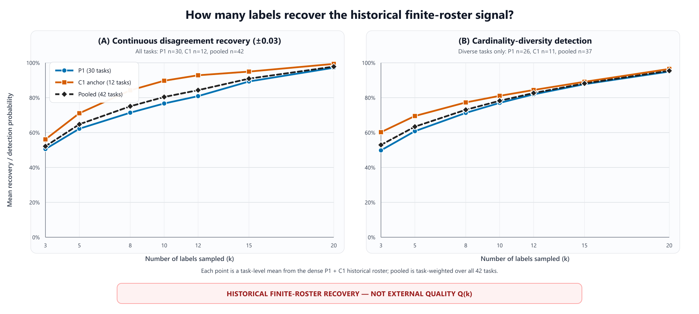

# 标注不确定性：现有数据证据简报

> **状态：数据简报 / 非规范文件 / 非实验方案**  
> **日期：2026-08-29**  
> 本简报只整理现有数据、可支持的结论和缺口，不预设最终研究问题、实验条件或样本量，也不修改正式合同、统计分析计划或既有实验。

## 1. 最重要的五个结论

1. **现有高密度手工标注数据比此前口头口径更清楚**：共有42个互不重复的高密度图片单元，由 P1 手工标注30图和 C1 锚点手工标注12图组成；26名标注者，1055条规范选定标注，其中1013条结构严格有效。每图规范选定标注数 `K=23–26`，中位数为26。
2. **“30题 / 420条标注”不能再加到42图上**：它只是上述 P1 30图的中文项目28切片。英文项目39与之合并后仍是同30图，不是新增图片。
3. **现有 `k` 曲线证明的是噪声统计恢复，不是外部质量上限**：连续分歧量在 `k=5` 时落入±0.03误差范围的概率约为0.648，到 `k=15` 时约为0.909；角点数量多样性的检出率分别约为0.634和0.882。
4. **42图中有41图具备可计算几何质量的参考真值，但独立性强度不一致**：C1的12图具有机器可审计的冻结公开参考真值；P1有29图采用经人工确认的参考真值，另有1图尚不能计算几何质量。P1缺少与C1同等级的“是否依据被分析提交而修订”字段，因此不能把42图无差别描述成同一种独立参考真值。
5. **当前最缺的不是新工具，而是补齐数据合同**：36图候选身份和官方参考真值路径可以机器重建，但“18张通过 / 6张修订 / 12张拒绝”和“14张干净候选 + 4张待复核”没有落入机器审核字段；本次前瞻实验的允许答案集合也尚未冻结。

## 2. 数据资产清单

| 数据池 | 已核实规模 | 正确用途 | 不能怎样使用 |
|---|---:|---|---|
| 高密度手工标注42图 | P1 30图 + C1 12图；26名标注者；1055条规范选定标注；1013条结构严格有效；`K=23–26` | 历史人际噪声、稀释重采样、阶段分层 | 不能与其底层语言项目重复相加 |
| P1 中文项目28 | 30图；420条原始标注；14名标注者；每图 K=14 | 核对中文切片或语言/项目来源 | 不是额外30图，不可加到42图 |
| P1 中英文原始数据并集 | 同30图；782条原始标注；26名标注者；每图原始 `K=25–27` | 规范标注筛选的底层来源 | 原始标注数不能直接替代规范有效标注数 |
| C1 锚点中英文数据并集 | 12图；279条原始标注；23名标注者；每图原始 `K=23–25` | 高密度42图中的 C1 部分 | 不可与项目66、69再相加 |
| C1 核心手工标注 | 75图；401条原始标注；23名标注者；`K=5–7`，中位数5 | 低密度分层或外部广度检查 | 不可当作高密度重复数据 |
| P1 半自动中英文数据并集 | 18图；469条原始标注；26名标注者；每图原始 `K=26–27` | 后续研究辅助标注或预标注的历史线索 | 与手工标注协议不同，不能直接混池解释 |
| 开发测试5图×8人 | 40条计划分配；当前新增导出记录为0 | 导入、日志、绑定和分析流程排演 | 不能把40条计划当作40条观察；全部不得进入正式分析 |
| 全量标注主表 | 214图；2501条标注；26名标注者 | 全局描述与跨阶段审计 | 包含多个阶段和条件，不能当作单一同质实验 |

### 口径关系

```text
高密度手工标注42图
├─ P1手工标注30图
│  ├─ 项目28（中文）：420条原始标注
│  └─ 项目39（英文）：362条原始标注
└─ C1锚点手工标注12图
   ├─ 项目66（英文）：135条原始标注
   └─ 项目69（中文）：144条原始标注

开发测试5图×8人：不属于42图；是 P1半自动18图中的5图重用计划，尚无新观察。
```

## 3. 已有定量结果及其真实分母

### 3.1 方差组成

| 结果变量 | 任务 | 标注者 | 剩余项 | 分母与限制 |
|---|---:|---:|---:|---|
| 几何分歧 | 65.252% | 2.754% | 31.995% | 2168行、205个任务单元、26名标注者；不是只来自42图 |
| 布局质量交并比（IoU） | 55.990% | 2.913% | 41.097% | 717条可评估记录、79个任务、23名标注者；1784条无效或缺失记录被排除 |
| `log1p(active_time)` | 11.556% | 51.718% | 36.726% | 2069行、214个任务、24名标注者；432行被排除 |

可支持的描述：几何分歧和质量差异更受任务影响，有效操作时间更受标注者影响。  
不能支持的描述：标注者对几何质量不重要，或这些占比就是严格42图的专属因果分解。三个模型的结果变量与有效分母不同。

### 3.2 经任务校正的有效操作时间

- 具备完整统计量的标注者：22人；
- 中位数：122.998 秒；
- 四分位距：65.395–165.083秒；
- 范围：11.049–401.787 秒。

有效操作时间方差模型有24名行级有效标注者，而完整个体统计只有22人；两者估计对象不同，不是数字冲突。

### 3.3 高密度42图的 `k`—恢复曲线



| k | 连续分歧量落在全体标注结果±0.03范围内 | 检出全体标注中的角点数量多样性 |
|---:|---:|---:|
| 3 | 0.522 | 0.529 |
| 5 | 0.648 | 0.634 |
| 8 | 0.751 | 0.731 |
| 10 | 0.804 | 0.782 |
| 12 | 0.843 | 0.827 |
| 15 | 0.909 | 0.882 |
| 20 | 0.978 | 0.954 |

每图每个 `k` 使用1000次无放回重采样。连续曲线分母是42图；角点数量曲线只包含全体标注中确实存在多种角点数量的37图。

**解释边界：**这里的“全体标注结果”只是当前有限的历史标注者集合，不是绝对真值；曲线衡量小样本能否恢复多人统计量，不能写成相对于外部参考真值的质量 `Q(k)` 或人类质量上限。

### 3.4 P1/C1 分层

| 阶段 | 图片数 | 角点数量存在差异的图片数 | k=5：连续量 / 角点数量 | k=15：连续量 / 角点数量 |
|---|---:|---:|---:|---:|
| P1 | 30 | 26 | 0.622 / 0.608 | 0.893 / 0.878 |
| C1锚点 | 12 | 11 | 0.711 / 0.695 | 0.950 / 0.891 |
| 合并结果 | 42 | 37 | 0.648 / 0.634 | 0.909 / 0.882 |

C1在这些描述性恢复率上高于P1，但两阶段的任务构成、流程和参考真值制度不同；不能把差异解释成阶段处理的因果效果。

### 3.5 稳定的标注者类型目前没有可靠证据

- 最佳轮廓系数：0.2005（Ward聚类，`k=3`，20名标注者，10项特征；三组人数为9/9/2）；
- 分半稳定性ARI中位数：0.1202；四分位距为0.0110–0.2655；
- 300次重复中只有154次可评估，146次不可评估。

因此不应围绕固定的“高质量型/低质量型/犹豫型标注者”设计当前主研究。

## 4. 参考真值与候选池审计

### 4.1 当前42图

| 部分 | 参考真值状态 | 目前可支持 |
|---|---|---|
| C1锚点12图 | 冻结公开参考真值；依据被分析提交而修订的次数为0；已声明修正次数为0 | 可做具有程序性独立性的相对参考真值分析 |
| P1 30图 | 29图采用可计算几何质量、经人工确认的参考真值；1图尚未就绪 | 可在显式标记 `reference_regime` 后做敏感性分析；不能与C1无差别合并 |

在计算真正的质量曲线前，至少需要一张42行的“任务—参考真值”映射表，包含：

- `reference_regime`；
- `reference_sha256`；
- `independence_basis`；
- `geometry_ready`；
- 允许答案集合及其版本；
- 排除理由。

### 4.2 当前36图预标注候选池

机器可核实：

- 原始清单28图 + 补充清单8图；
- 两者重叠为0，合计36个唯一图片；
- 36个 `correct_path` 均指向官方MP3D `label_cor`；
- 测试集33张、验证集3张。

尚不能机器重建：

- 18张通过、6张修订、12张拒绝；
- 14张干净候选、4张待复核；
- 4个待复核编号虽然都能在36图中找到，但结构和材料审核字段不存在；
- 面向本次实验的允许答案集合冻结文件不存在。

因此，这些人工审核数字当前只能称为“人工记录口径”，不能称为可重放的最终实验材料清单。

## 5. 工具与证据边界

| 项目 | 状态 | 结论 |
|---|---|---|
| 历史多人手工标注 | 已核实 | Label Studio已经能采集多人结果；无需先开发自动标注工具 |
| 历史有效操作时间 | 部分核实 | 历史文件哈希与594条观测记录可核；本次前向配置尚未部署验证 |
| 最终可见角点顺序 | 当前不可用 | 只保存在浏览器本地存储中；不能与服务器导出逐条绑定 |
| 编辑前技术锁 | 当前不可用 | 当前 `technical_time_lock=false`，没有阶段事件持久化记录 |
| 开发数据排除 | 已核实 | 40行均为 `future_formal_analysis_eligible=false`，且样本已被看过 |
| 排演数据排除 | 尚未解决 | 目前没有独立的排演数据机器标签；正式排演前必须补充 |

当前严格手工标注数据整理不依赖编辑前技术锁或最终可见角点顺序。只有未来要研究“编辑前识别”或角点顺序行为时，这两项才成为开发前提。

## 6. 现有数据现在能回答什么

### 已经比较有把握

- 严格多人标注中，小 `k` 对总体分歧量和角点数量多样性的恢复并不稳定；
- 从 `k=5` 增至 `k=15`，两类恢复率均明显提高；
- 任务差异是几何分歧和质量变异的主要来源之一；
- 标注者的主要差异更突出地体现在时间，而不是稳定的几何“类型”；
- 现有数据足够先做一次不新增标注的严谨重采样复算。

### 目前还不能回答

- 独立标注数增加后，外部质量 `Q(k)` 的真实曲线；
- 普适“标注质量上限”；
- 正确或错误预标注对最终标注的因果影响；
- 自评问卷或残差能否可靠预测“还需不需要再标”；
- 36图中的14张干净候选是否已经可正式启动；
- 排演数据是否能被当前分析入口自动排除。

## 7. 建议先补齐的数据工作，不预设最终方案

### 优先级 A：当前即可完成

1. 把人工36图审核结果落成机器表，保留原始决定、机械合同检查、最终裁决三列，解决 `18/6/12` 与 `14+4` 的关系。
2. 形成42行“任务—参考真值”映射，明确P1与C1的参考真值制度，并暂时排除1个几何质量尚不可计算的任务。
3. 分别计算：
   - 不依赖参考真值的可复现性曲线；
   - 只对参考真值合格子集计算的相对参考真值质量 `Q(k)`；
   - P1、C1分层结果和合并敏感性结果。
4. 为排演数据和合成数据增加明确的机器排除字段后，才做任何流程排演。

### 优先级 B：后续决定是否需要新数据

在看到历史重采样复算后再选择：

- 只写历史高密度测量研究；
- 增加一个严格、未暴露图片的前瞻微型复现；
- 再增加自动输出与手工输出的多学生盲复核；
- 或把正确/错误预标注留作后续单因素实验。

这里不预先固定 `8×12`、三臂或其他正式样本量。现有数据应先用于确定需要估计的量、现实精度和真正缺口。

## 8. 后续需要裁决的四件事

1. 论文主目标是否优先转为“严格条件下的标注噪声与经验饱和测量”？
2. 是否接受：没有独立参考真值时只报告可复现性，不使用“质量上限”措辞？
3. P1经人工确认的参考真值是否足够，还是必须重新制作独立参考真值和允许答案集合？
4. 在历史重采样复算之后，优先补充前瞻独立标注、多人盲复核，还是预标注因果实验？

## 9. 证据文件

- `DATA_ASSET_INVENTORY.json/.csv`：17条数据资产记录；说明42图、30题/420条和开发测试5×8之间的关系。
- `HISTORICAL_QUANTITATIVE_EVIDENCE.json/.csv`：35条重新计算的定量证据，含分母、定义、来源和限制。
- `HISTORICAL_RAREFACTION_BY_STAGE.json/.csv`：P1、C1和合并结果的21行分层曲线。
- `REFERENCE_FEASIBILITY_AUDIT.json/.csv`：12项参考真值、候选池和技术边界审计。
- `EVIDENCE_PACK_AUDIT.json`：主审核的结构、来源和数值一致性检查。

以上均为 `analysis_results` 下的派生证据，不回写导入、导出和有效操作时间日志真源。
