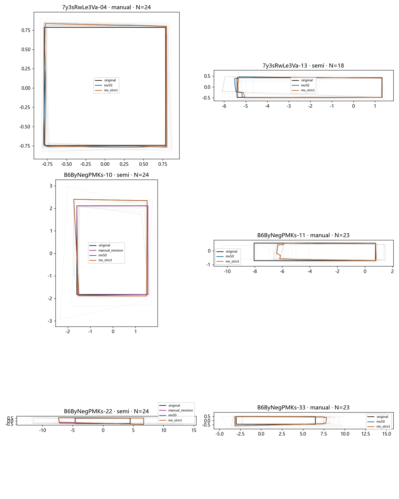
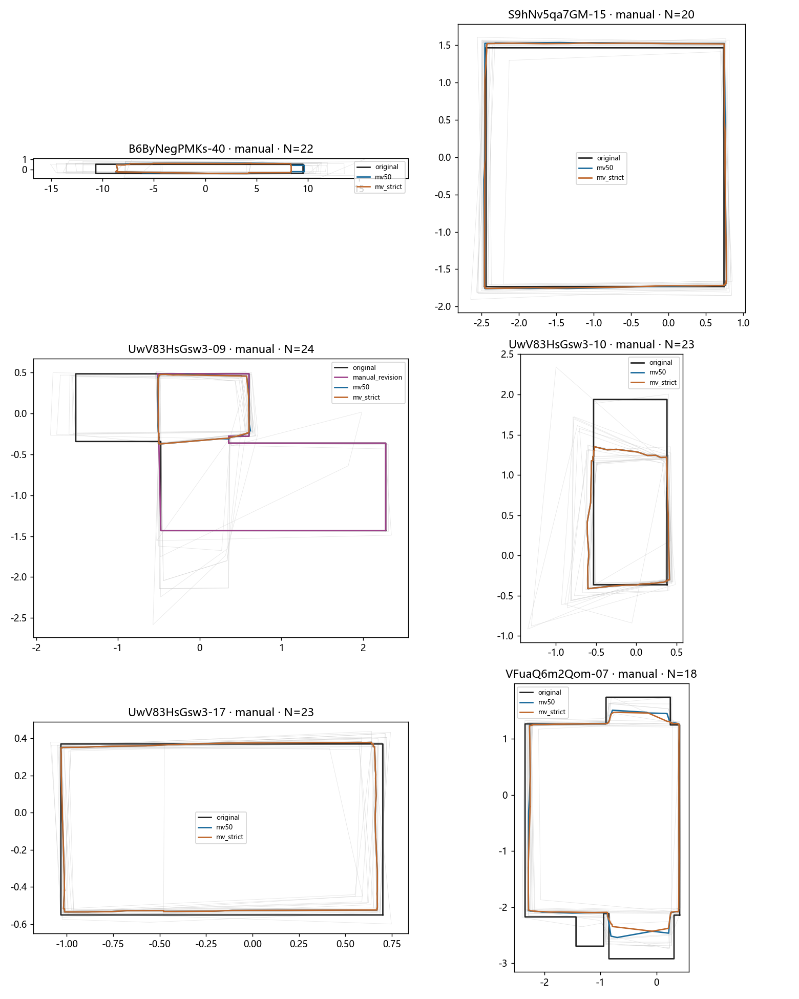
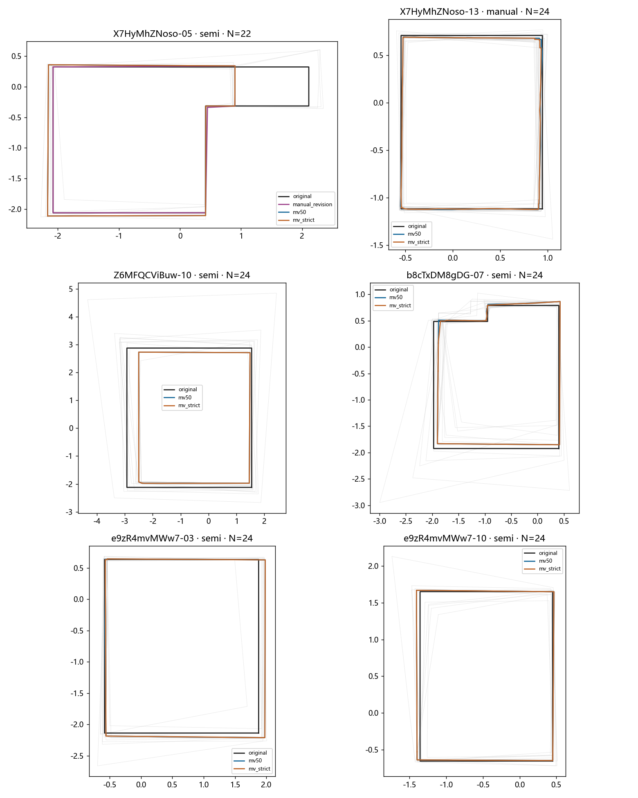
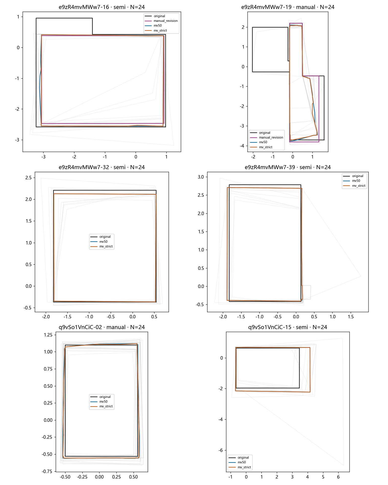
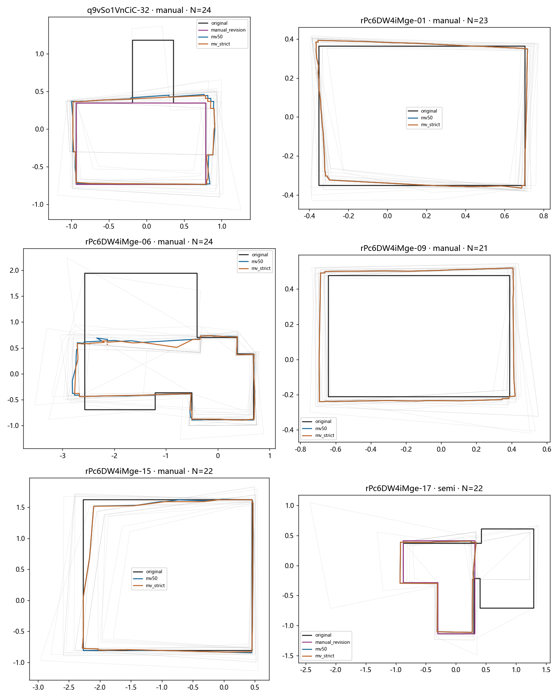
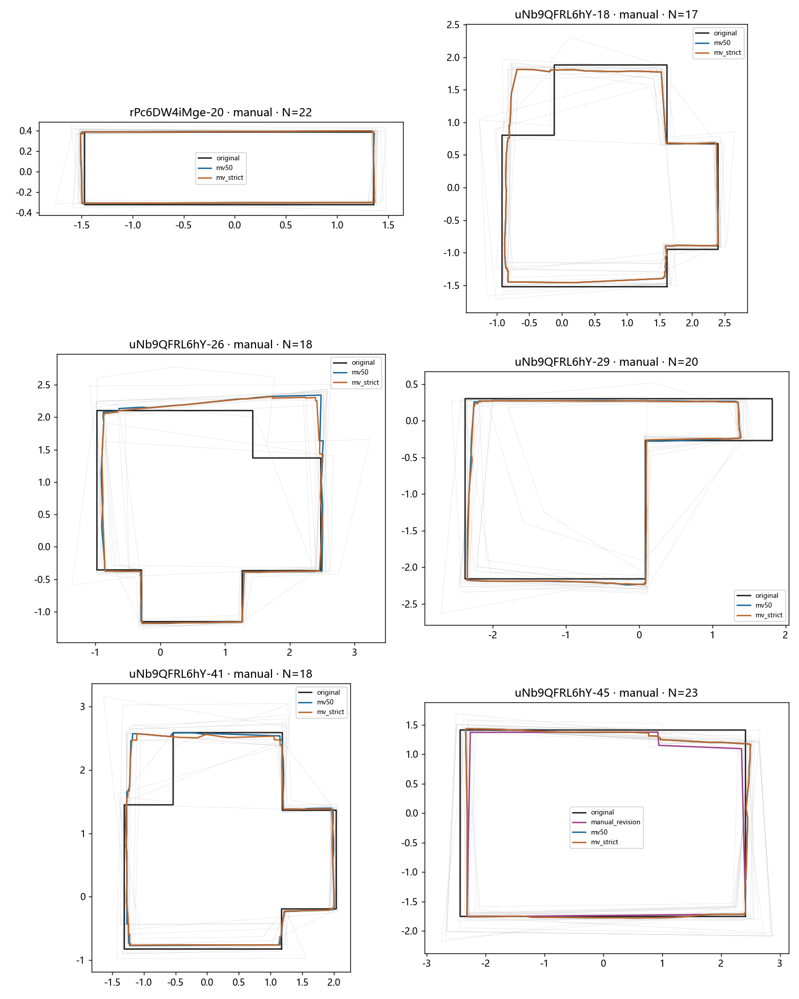
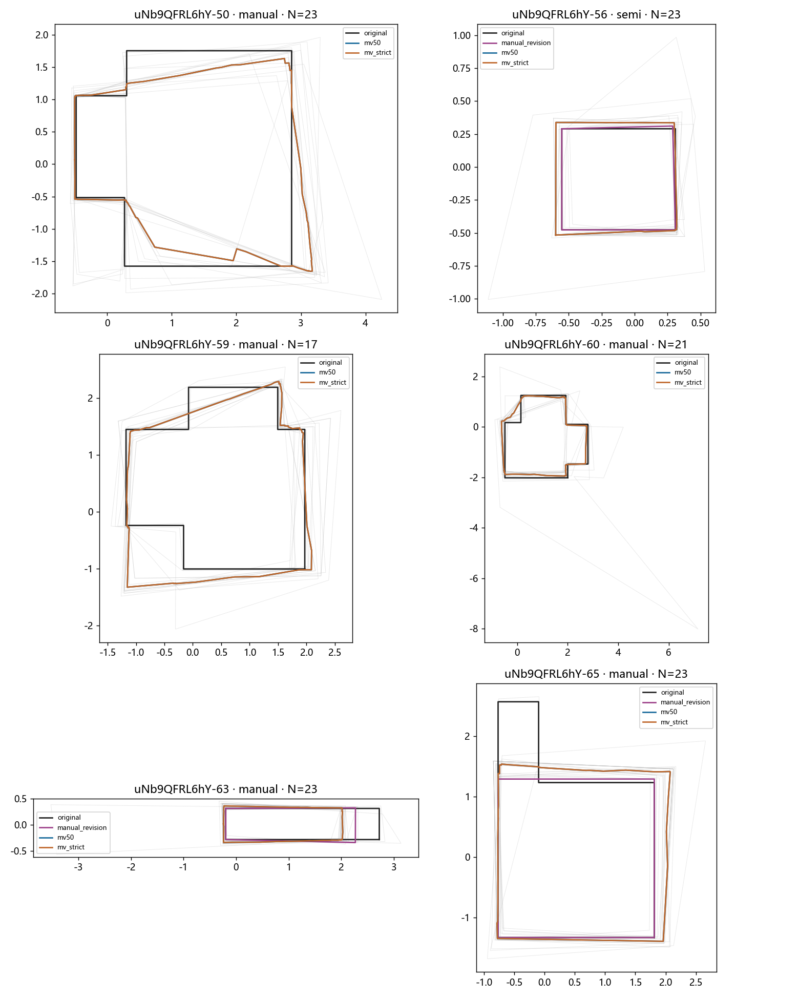
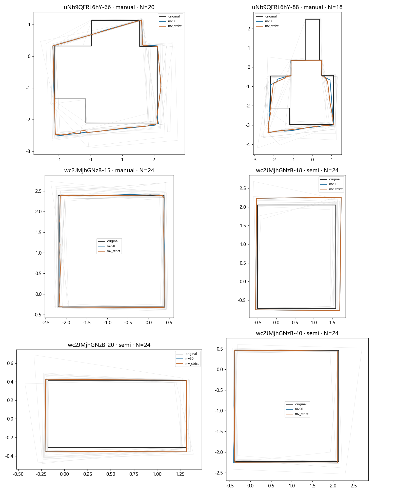
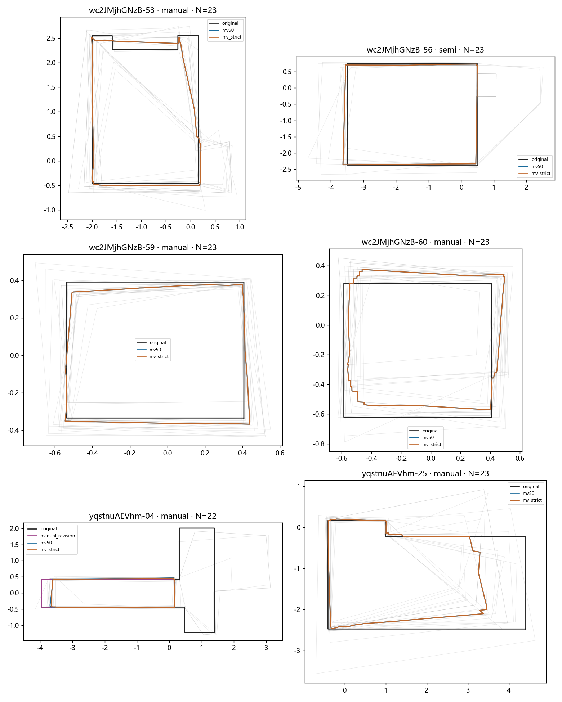
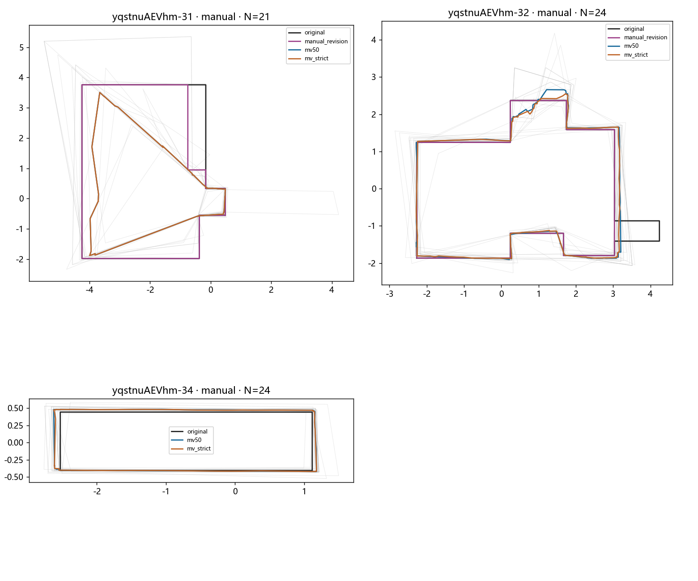

# 57个人员池：实际全员范围图集

灰线为当前完整池原作答；黑色原GT、紫色已有修订GT；蓝／橙为两投票规则。每图坐标单位h，各自轴范围不同；仅底面，不含上界。

7y3sRwLe3Va-04 (manual), 7y3sRwLe3Va-13 (semi), B6ByNegPMKs-10 (semi), B6ByNegPMKs-11 (manual), B6ByNegPMKs-22 (semi), B6ByNegPMKs-33 (manual)

B6ByNegPMKs-40 (manual), S9hNv5qa7GM-15 (manual), UwV83HsGsw3-09 (manual), UwV83HsGsw3-10 (manual), UwV83HsGsw3-17 (manual), VFuaQ6m2Qom-07 (manual)

X7HyMhZNoso-05 (semi), X7HyMhZNoso-13 (manual), Z6MFQCViBuw-10 (semi), b8cTxDM8gDG-07 (semi), e9zR4mvMWw7-03 (semi), e9zR4mvMWw7-10 (semi)

e9zR4mvMWw7-16 (semi), e9zR4mvMWw7-19 (manual), e9zR4mvMWw7-32 (semi), e9zR4mvMWw7-39 (semi), q9vSo1VnCiC-02 (manual), q9vSo1VnCiC-15 (semi)

q9vSo1VnCiC-32 (manual), rPc6DW4iMge-01 (manual), rPc6DW4iMge-06 (manual), rPc6DW4iMge-09 (manual), rPc6DW4iMge-15 (manual), rPc6DW4iMge-17 (semi)

rPc6DW4iMge-20 (manual), uNb9QFRL6hY-18 (manual), uNb9QFRL6hY-26 (manual), uNb9QFRL6hY-29 (manual), uNb9QFRL6hY-41 (manual), uNb9QFRL6hY-45 (manual)

uNb9QFRL6hY-50 (manual), uNb9QFRL6hY-56 (semi), uNb9QFRL6hY-59 (manual), uNb9QFRL6hY-60 (manual), uNb9QFRL6hY-63 (manual), uNb9QFRL6hY-65 (manual)

uNb9QFRL6hY-66 (manual), uNb9QFRL6hY-88 (manual), wc2JMjhGNzB-15 (manual), wc2JMjhGNzB-18 (semi), wc2JMjhGNzB-20 (semi), wc2JMjhGNzB-40 (semi)

wc2JMjhGNzB-53 (manual), wc2JMjhGNzB-56 (semi), wc2JMjhGNzB-59 (manual), wc2JMjhGNzB-60 (manual), yqstnuAEVhm-04 (manual), yqstnuAEVhm-25 (manual)

yqstnuAEVhm-31 (manual), yqstnuAEVhm-32 (manual), yqstnuAEVhm-34 (manual)

