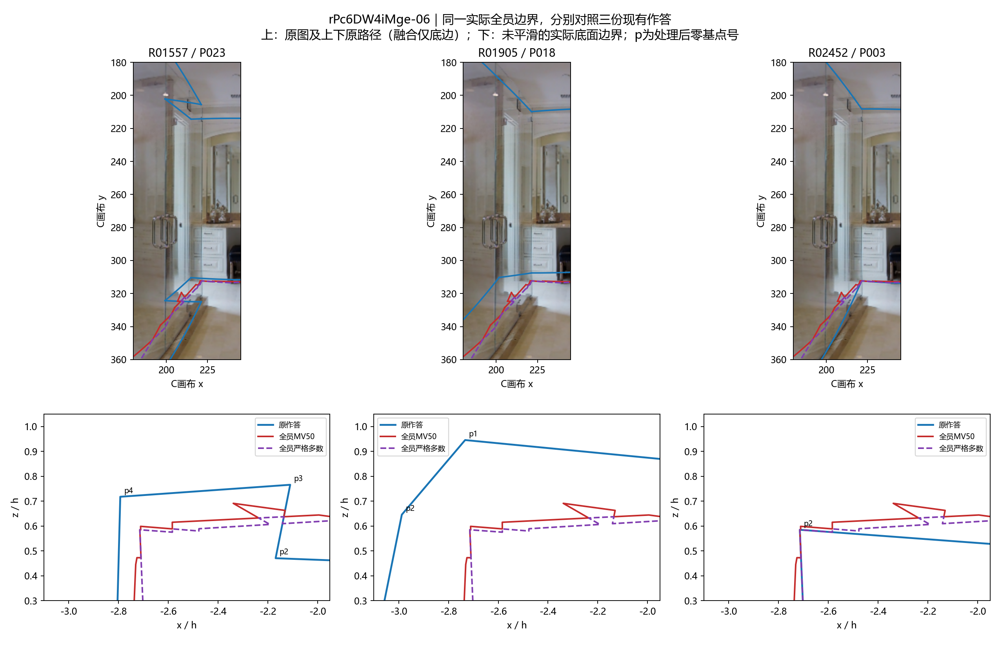
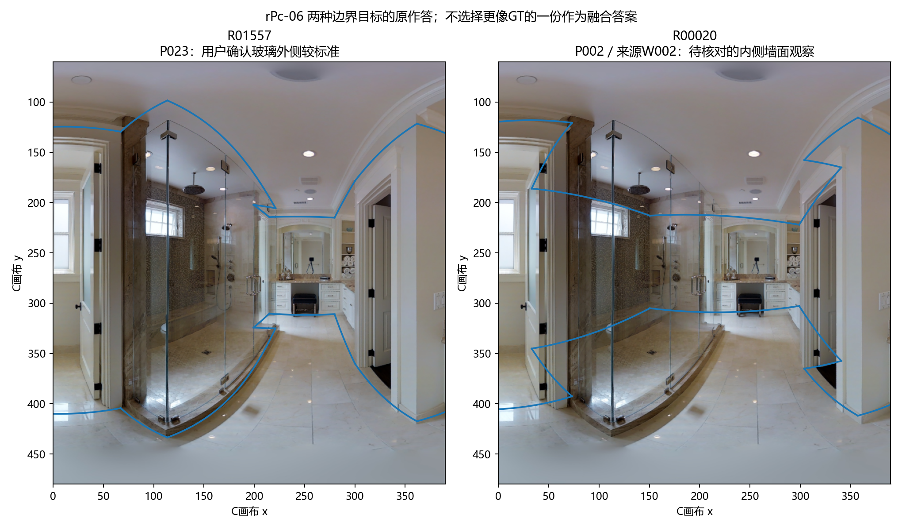
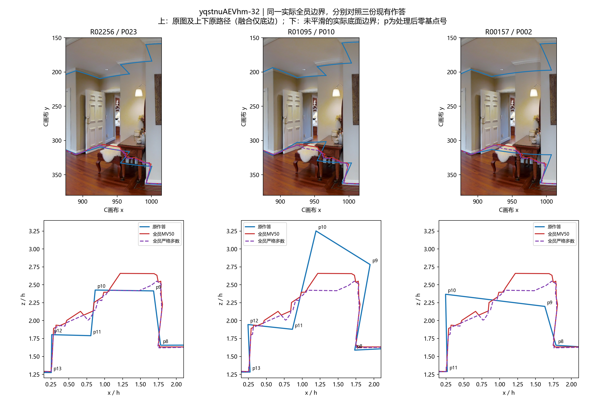

# 两个局部边界对照与参考方位追踪

2026-10-06。已完成几何层面的有限对照，并收到用户对两处局部的直接判断，原话与记录绑定保存于[user_review.json](user_review.json)。人员×图片主分析已连接，见[共同面板结果](../worker_image/README.md)。

**融合的任务是反映纳入人员的观察共识，不是保证输出像GT或像一份精细标法。** 下述结构差异用于解释共识保留了什么、弱化了什么；不能据此强补角点、改变票数或把所有偏离判为算法失败。

## 局部对照发现

沿Pro已经列示的作答，各图展示三种观察与同一份实际全员MV50／严格多数边界。范围图扩大到能容纳这些路径，原有片区定义和人数计算没有改变；蓝线为原作答，红／紫为全员融合。

rPc的R01557／P023有明确短折返，R01905／P018的连接在另一深度，R02452／P003较简单。实际融合保留了一些小折线，却没有复现P023的原折返；它也不是完整采用另外两条路径。这里既有位置差，也有连接方式差，不能全归为“同一角点定位抖动”。图中p号为各自处理后的零基点号，跨人员相同编号不表示同一个实体。

**用户判断：**P023是玻璃外侧相对标准的标法；P018、P003省略了细节。玻璃内侧墙面也是另一种标准标法，所以不能要求所有人统一靠向P023。这一判断只涉及所展示局部，不认证整份精确坐标。

用户回忆内侧标法可能来自W002。来源已绑定到P002／R00020（原任务3078、作答4735），扩大窗口叠图确实显示其沿玻璃内侧墙面选择范围。人员绑定是确定的，用户没有逐点复审这份整环；现有几何状态及用途保持。

yq的R02256／P023与R01095／P010均有门前回折，但底部位置差明显；R00157／P002在该处更简化。实际融合有多个小转折和斜段，没有复现前两份列示路径的连续折返。上界视觉线索较清楚，底部被家具遮挡；Lee仅提供底边，不能用上界观察直接认证融合底边位置。

Pro同时列出的R01029／P014与R01095整份坐标完全相同，因此本图只展示后者。这是“补充几何证据不是两种路径”的事实，不从坐标相同推出抄袭，也没有修改既有独立票资格。yq壁炉的大轮廓已保留，仍是既有正例。

**用户判断：**P023与P010是同一结构，但细节有偏差；P002把它简化了。因此这三份记录在本局部已有“同结构位置差异／结构简化”的语义区分。未判定P023或P010哪份坐标更准确，也未扩展到其它21人的身份对应。

片区覆盖与结构恢复分开：一个平滑的大区域可完全包含凸出片区，却没有在边界上形成对应转折。本轮直接对照未平滑边界，因此没有再用覆盖率替代结构判断，也没有增加新的通用“转折恢复率”。

现有24人共识仍忠实按原规则输出。若完整保留的局部观察未成为多数区域边界，应报告其支持和融合后的形态，不因为用户确认它合理就将它强塞进主共识。合理内外空间候选仍属另一条研究路线。

## uNb47来源追踪

已取得的链条如下，数值见[source_trace.json](source_trace.json)：

1. 原GT R02705直接来自`data/mp3d_layout/test/label_cor/uNb9QFRL6hY_978d7a8eb0794936bd8fd092306e1dc5.txt`。16个二维点与当前输入逐项完全相同；本轮分析没有引入平移、旋转或重排。
2. 修订GT R02706对应`export_label/groudTruth.json`任务3558、作答5107。导出标明`image_rotation=0`；按百分比坐标及既有点序映射，和当前输入最大差约0.000025像素，只是精度尾差。原始与修订GT差异在这一步之前已经存在。
3. 标注任务引用`img_v`的JPG；本地JPG与Pro使用的原PNG在相同方位匹配。PNG缩至1024×512后，RGB像素MAE为1.43（0—255）；将PNG向两侧平移四分之一圈，MAE分别34.25／34.26。这是检查图像版本，未用GT分数选取最佳旋转。
4. 旧导入与修订导入记录都已经包含修订后的点，而`vis_3d`链接参数仍装着原TXT点。这说明历史记录中两个显示入口的数据不同；不证明两者被执行了哪一个旋转。本轮没有操作旧展示台或变更运营配置。

**结论：当前坐标读取和本地图像版本未产生90°错位；更上游的原GT生成／对齐原因尚未定位。** Pro的90°诊断仍是线索，不能据此修改参考或把旋转后IoU计入主结果。本轮未访问当前云端图片，以上图像比较仅指现存本地副本。uNb本来就单列特殊场景，不阻塞39图人员主分析；停止继续扩展来源审核。

## 对复审意见的独立决策

**保留（Retain）。** 保留推进方向，明确三点解释。

- 有效性：实际边界比较确有必要；覆盖比例不足以判结构恢复。共同人员矩阵可以进一步解释人图差异，R/D/V本身仍不能完成来源分离。
- 简单性：已有边界、原图和人员矩阵足够完成本轮，不增加聚类、统一结构分数或全库复核。独立子任务未能运行完成，来源结论由本地主线程完成，不算额外独立复算。
- 后果：混合与纯类团队的共享成员数不同。共同池上／下各12人，纯类8人两次抽组期望共享`8²/12=5.33`人，4＋4混合期望共享`4²/12+4²/12=2.67`人。V可比较策略的实际输出敏感性，不能单独归因类型冲突。当前无须为此加新实验。

## 实现与检查

工具为`tools/thesis_main/analysis/local_boundary_followup_20261006.py`，命令`python -m tools.thesis_main.analysis.local_boundary_followup_20261006`。输出[边界片段](boundary_windows.geojson)、两张图、来源检查与[field_contract.json](field_contract.json)。运行内检查原底点回投一致、所选路径非空、原GT与TXT相同；图件已查看，保留为研究产物，本轮未生成临时截图。

未重跑全部概率或几何；未改原始数据、人工裁决、GT、独立票规则或投票阈值。复用代码与新增分解的4项相关测试通过。
