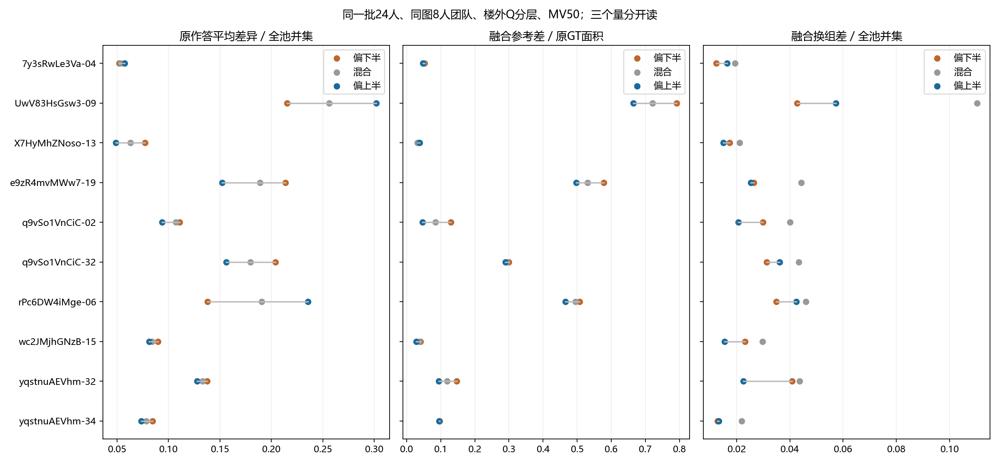

# 人员构成、原作答一致性与融合表现

2026-10-06。本轮完成39张Manual图k=4／8／12的构成连接，复用既有目标建筑外Q分层与融合结果，新增固定构成的原作答分歧期望R；未重新分层或调投票门槛。57个人员池的114份实际全员底面同时补齐，见上级[全员图集](../ATLAS.md)。

## 1. 核心发现：更接近参考不意味着更统一

以下均为k=8、原GT校准、原GT评价、MV50，“偏上半”减“偏下半”；两组人数相同。原作答R和换组V以固定全池并集为分母，参考差D以GT面积为分母，不能比较它们差值的绝对大小。

| 固定面板 | R平均差 | D平均差 | V平均差 | R降低图数 | D降低图数 | V降低图数 |
|---|---:|---:|---:|---:|---:|---:|
| 39图Manual | −0.006070 | −0.035326 | −0.003731 | 23/39 | 30/39 | 23/39 |
| 共同24人十图 | +0.000677 | −0.040459 | −0.000736 | 7/10 | 9/10 | 5/10 |
| 固定33张N≥20图 | +0.001807 | −0.038629 | −0.000557 | 18/33 | 26/33 | 17/33 |

上半组的参考收益较广泛，但一致性不随之统一改善；十图虽然7图R降低，少数图的大幅增加仍使平均R略升。R随换池和加权方式的变化不能被“多数图改善”一句话覆盖。

39图偏上半8人中，上半人员平均比例约0.9936，下半策略比例为0。共同十图及33图对应比较都是纯上半8人对纯下半8人。全库策略按每图实际可行构成取值，未删除人员凑比例。

## 2. 两个明确反例与一个同向例

| 图与构成（8人） | 原作答R | 融合参考差D | 融合换组差V |
|---|---:|---:|---:|
| Uw-09 下半 | 0.215337 | 0.791810 | 0.042751 |
| Uw-09 上半 | 0.302001 | 0.665068 | 0.057207 |
| rPc-06 下半 | 0.137993 | 0.507625 | 0.034944 |
| rPc-06 上半 | 0.235451 | 0.465888 | 0.042414 |
| yq-32 下半 | 0.137319 | 0.146230 | 0.040834 |
| yq-32 上半 | 0.127825 | 0.094551 | 0.022553 |

Uw-09与rPc-06中，上半组原作答更分散、换组结果更敏感，但融合更接近该版GT。yq-32三个量同向下降。这些是原作答一致性与参考质量不能互相替代的真实例证；并不能仅凭数字断言低组共同标错或高组保留了真实细节，语义解释交由原图与Pro局部研究。

## 3. 混合构成和全员结果提供了什么

在39图MV50的k=8对照中，38图的均衡混合组换组差异高于两端构成中的较大者；共同十图为10/10。严格多数对应36/39、8/10。混合策略不是自动最稳定；这描述固定分层和池规模下的策略结果，不据此建议清除某类人员或宣布“多样性有害”。两端策略和混合策略允许的成员组合不同，保留此设计条件。

同日解释补充：共同池上／下各12人，纯类8人的两次抽组期望共享`8²/12=5.33`人；4上＋4下期望共享`4²/12+4²/12=2.67`人。混合策略允许更大的成员变化，V差异不能单独解释为“类型冲突”。当前比较策略实际输出有效，无需为此前有限结论增加换人控制实验。

偏上半8人与实际全员比较，39图中21图参考差更小，18图更大；平均差−0.012155。共同十图为5图更小、5图更大，平均差−0.019277。全员本身不是可舍弃的对照，也不能由均值推导通用最佳8人。

k=4／8／12两规则和原／修参考的完整结果均保留。共同十图纯上半或纯下半到k=12时恰好耗尽该子池，换组V为零；不把它写成最优人数或消除了原作答分歧。

## 4. 人数与难度：现成数据实际支持什么

完全相同24人×10图，最新人工标签5简单／2中等／3困难，MV50、原GT、图片等权：

| 难度 | 原作答R | D(8) | D(16) | 实际全员D(24) | V(8) | V(16) |
|---|---:|---:|---:|---:|---:|---:|
| 简单5图 | 0.077177 | 0.060089 | 0.053617 | 0.050965 | 0.026619 | 0.013210 |
| 中等2图 | 0.184150 | 0.412619 | 0.405206 | 0.401524 | 0.044766 | 0.020413 |
| 困难3图 | 0.193204 | 0.444581 | 0.448677 | 0.467918 | 0.066282 | 0.036975 |

这十图8→16人的V均下降，包括三张困难图；困难组D均值却升高，主要由Uw-09推动，rPc-06和yq-32在该区间D下降。因此当前更直接的结果是“换组更稳定但参考表现未必改善”，不是“难图增人必然越来越不一致”。R为原作答水平，不是随k下降的一条曲线。

这些普通主质量图不能代表OOS或门洞子类。特殊场景另由Pro四图研究承担；原人工难度没有按这里的数值重新改写。

## 5. 建筑影响值得保留，但不加复杂模型

39图改用建筑等权后，R／D／V差分别约−0.000889／−0.034399／−0.004363，参考收益仍同向。

既有校准建筑外17图（4栋，其中uNb占12图）中，图片等权R差为−0.024660，建筑等权却为+0.006741；D差则分别为−0.024103、−0.018641。这说明“原作答更一致”的迁移解释受图片构成影响较大，不能从这17图宣布稳定人员类型。它们仍是已用过的开发数据、原有人群，不包装为新人员盲测。

## 数据、计算与验证

`per_image.csv`共1728行，绑定图片、实际构成、校准policy、评价version、规则与k；`contrasts.csv`为576个同图对照，`summary.csv`为192个固定面板／加权汇总；这些行不是独立样本。`count_response.csv`连接全部57池的144个规则／参考终点及指定人数D/V。字段详见`field_contract.json`。

新R按每对人员进入固定构成团队的概率加权：组内对概率为C(抽取人数,2)/C(该类总人数,2)，跨类为两类抽取比例的乘积，最后除C(k,2)。一个五人不平衡池穷举检验纯类、混合及满员边界通过；另保留两人共享／独占面积测试，共2项通过。没有重算概率大表、重审全库或修改资格。

后续已接[Pro特殊场景／细节](../../../research/pro_parallel_return_20261006/README.md)、[局部人工判断](../boundary_followup/README.md)和[共同人员图片矩阵](../worker_image/README.md)。共识反映现有观察，不以强行像GT作为成功定义；暂不新增Q/T/S/B分类器或强行把响应划成快／慢／不收敛三档。
