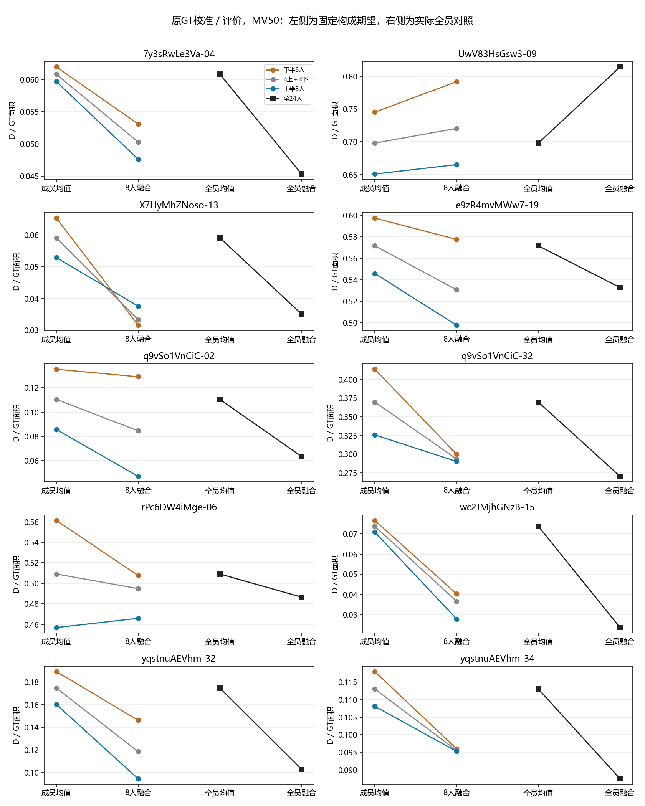

# 成员起点、8人融合与全员结果

2026-10-07。复用共同24人十图、楼外Q分组、两投票规则；无新抽样或几何计算。每个具体组仍只输出一个共识。

M为成员平均参考误差的期望，F为融合参考误差的期望，B=M−F是误差减少量。全部按同版GT面积归一化；越小越近，负B表示相对成员均值变差。B大不代表输出更好或融合更有效。

## 主对照：原GT校准、原GT评价、MV50

| 图片 | 上半 M→F | 下半 M→F | 混合 M→F | 全24人 M→F |
|---|---:|---:|---:|---:|
| 7y3sRwLe3Va-04 | 0.0597→0.0476 | 0.0620→0.0531 | 0.0608→0.0503 | 0.0608→0.0453 |
| UwV83HsGsw3-09 | 0.6508→0.6651 | 0.7452→0.7918 | 0.6980→0.7204 | 0.6980→0.8144 |
| X7HyMhZNoso-13 | 0.0528→0.0376 | 0.0653→0.0316 | 0.0590→0.0333 | 0.0590→0.0351 |
| e9zR4mvMWw7-19 | 0.5460→0.4978 | 0.5976→0.5777 | 0.5718→0.5308 | 0.5718→0.5329 |
| q9vSo1VnCiC-02 | 0.0857→0.0470 | 0.1353→0.1292 | 0.1105→0.0846 | 0.1105→0.0634 |
| q9vSo1VnCiC-32 | 0.3258→0.2902 | 0.4137→0.3000 | 0.3697→0.2936 | 0.3697→0.2702 |
| rPc6DW4iMge-06 | 0.4568→0.4659 | 0.5613→0.5076 | 0.5091→0.4949 | 0.5091→0.4865 |
| wc2JMjhGNzB-15 | 0.0708→0.0278 | 0.0766→0.0403 | 0.0737→0.0366 | 0.0737→0.0235 |
| yqstnuAEVhm-32 | 0.1602→0.0946 | 0.1891→0.1462 | 0.1746→0.1185 | 0.1746→0.1028 |
| yqstnuAEVhm-34 | 0.1081→0.0953 | 0.1180→0.0960 | 0.1130→0.0955 | 0.1130→0.0875 |

## 原GT／MV50的遗漏与外扩变化

下表为M−F：正数减少，负数增加。全员列为全24人均值减实际全员结果。

| 图片 | 上半 Δ遗漏／Δ外扩 | 下半 Δ遗漏／Δ外扩 | 全员 Δ遗漏／Δ外扩 |
|---|---:|---:|---:|
| 7y3sRwLe3Va-04 | +0.0075／+0.0046 | +0.0072／+0.0017 | +0.0076／+0.0079 |
| UwV83HsGsw3-09 | -0.0482／+0.0339 | -0.0829／+0.0363 | -0.1604／+0.0440 |
| X7HyMhZNoso-13 | +0.0100／+0.0052 | +0.0204／+0.0132 | +0.0116／+0.0124 |
| e9zR4mvMWw7-19 | +0.0362／+0.0120 | +0.0076／+0.0122 | +0.0244／+0.0145 |
| q9vSo1VnCiC-02 | +0.0275／+0.0112 | +0.0220／-0.0158 | +0.0262／+0.0209 |
| q9vSo1VnCiC-32 | +0.0254／+0.0102 | +0.0849／+0.0288 | +0.0619／+0.0376 |
| rPc6DW4iMge-06 | -0.0337／+0.0247 | +0.0372／+0.0165 | -0.0095／+0.0320 |
| wc2JMjhGNzB-15 | +0.0230／+0.0200 | +0.0225／+0.0139 | +0.0207／+0.0295 |
| yqstnuAEVhm-32 | +0.0347／+0.0310 | +0.0271／+0.0158 | +0.0273／+0.0445 |
| yqstnuAEVhm-34 | +0.0124／+0.0004 | +0.0065／+0.0154 | +0.0095／+0.0161 |

## 本轮解释

1. **输入较好通常保留终点优势，但并非必然。** 原GT／MV50下，上半组十图M都更低，九图F更低；X7-13反转。X7上组融合遗漏0.0359大于下组0.0230，外扩虽更小（0.0016对0.0086），不足以抵消遗漏差。此处只定位到面积分项，没有自动裁定哪个具体边界错了。
2. **rPc的选人优势来自更好的起点，融合缩小了这项优势。** 上组M低于下组0.1045，F只低0.0417。上组遗漏增加0.0337，外扩减少0.0247，总D略升；下组两项都减少。不能把上组终点较好说成融合获得更多改善。已有人审允许玻璃内／外侧不同目标，本轮不强制恢复某个精细个体。
3. **Uw全员结果的偏离由遗漏增加主导。** 原GT下全员M→F为0.6980→0.8144，遗漏增加0.1604、外扩减少0.0440。修订参考下全员仍从约0.7259升至0.7753；但两类8人组在修订参考下均相对成员均值改善，不能把原GT下的负B固定成人员属性。
4. **yq-32全局两项都改善，仍不能推翻局部简化的人审。** 上组遗漏减少0.0347、外扩减少0.0310；全员也两项减少。已有门前结构简化结论继续保留，面积改善不能直接称为细节恢复。
这些结果完成了成员起点与融合终点的连接；不新增不确定性来源比例。配对图各小图使用自身纵轴，跨图差异读数值，不比较线条倾斜角度。

## 固定十图敏感性

每行始终同十图，修订优先使用4图修订＋6图原GT。上／下指楼外Q分层。各列为图片数，非独立检验。

| 校准 | 评价 | 规则 | 上组M更低 | 上组F更低 | M上低但F上高 | 上组B<0 | 下组B<0 |
|---|---|---|---:|---:|---:|---:|---:|
| original | original | mv50 | 10 | 9 | 1 | 2 | 1 |
| original | original | mv_strict | 10 | 8 | 2 | 2 | 2 |
| original | revised_where_available | mv50 | 10 | 9 | 1 | 1 | 0 |
| original | revised_where_available | mv_strict | 10 | 8 | 2 | 2 | 1 |
| revised_where_available | original | mv50 | 10 | 9 | 1 | 2 | 1 |
| revised_where_available | original | mv_strict | 10 | 8 | 2 | 2 | 1 |
| revised_where_available | revised_where_available | mv50 | 10 | 9 | 1 | 1 | 0 |
| revised_where_available | revised_where_available | mv_strict | 10 | 8 | 2 | 2 | 1 |

## 数据和解释边界

- `per_image.csv`：240行，逐图两校准×两评价×两规则×三构成，包含O/E/D的M、F、B和全员M/F，以及原R/V。六张没有修订GT的图在两评价政策中重复，不能当新证据。
- `contrasts.csv`：80行高减低对照，保存各分项ΔF=ΔM−ΔB；`field_contract.json`定义字段。
- 8人是固定构成下所有可行团队的期望，全24人是实际唯一输出。全员结果重复列示用于参照，8人到全员同时改变人数和构成，不能叫纯增人收益。
- 原表来自既定预处理输入及积分结果；本轮仅连接派生表，不替换原标注、参考或纳入规则。
- O/E拆分用于解释参考范围变化，不识别空间互补、人员能力或局部结构正确性。共识应体现纳入人员观察，不强制像GT。
- 本轮到十图解释表为止；不新增分类器、收益率或审核任务。复算：`python -m tools.thesis_main.analysis.member_fusion_response_20261006`。
