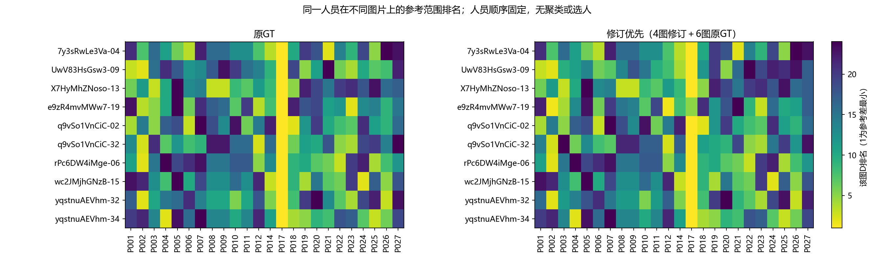

# 共同人员图片面板的分项差异

2026-10-06。同样24人、10张Manual图片，240份既有作答；两种参考政策是同一批作答的重评，不是480个独立样本。最新难度为5简单／2中等／3困难。范围分项读取已有`individual_reference.csv`，没有重建几何或修改Q分组。

**主要发现：存在跨图稳定的优秀个体，同时人员排序随图片变化；在GT面积归一化下，遗漏与外扩呈现不同的变化形态。** 因而先分项控制图片影响，再连接既有楼外选人收益，比把所有变化归为一种人员噪声更合适。总体排序关联受P017影响明显，外扩的平方和分配依赖尺度，见下方敏感性补充。

## 同一个人是否总排在相近位置

每图按单人D＝遗漏／GT面积＋外扩／GT面积排序，1为该图参考差最小；并列取平均名次。固定人员顺序，不聚类、不调阈值。

| 观察 | 原GT | 修订优先 4图修订加6图原GT |
|---|---:|---:|
| 45对图片的人员排名相关中位数 | 0.198 | 0.160 |
| 排名相关最小／最大 | −0.205／0.716 | −0.223／0.716 |
| 负相关的图片对 | 6／45 | 7／45 |
| 有的图优于同图均值、有的图劣于均值的人员 | 22／24 | 23／24 |

这些图对共享图片和人员，不是45次独立验证。39／45（原GT）为正相关只是描述，未检验随机排序假设；不能用一个统一名次解释每张图。

P017是稳定表现的具体例子：原GT下十图D均排第1，修订优先下在第1到第5之间。P002在两种参考政策下平均D都排第2，但具体图片排名可到21.5。**跨图平均参考表现较好，与每张图都领先是不同命题。** 这既不支持“所有人员类型都不稳定”，也不足以从十图冻结天然能力类型。

这里用D作描述；现有Q分层仍按楼外平均IoU，未被本次D排序替换。已有IoU楼外排名检验在[人员画像报告](../../worker_profiles_20261003/REPORT.md)，无需重新执行。

## 控制图片平均水平后还剩什么

对该平衡面板的一项误差e，计算

`e_ij = 总均值 + (该图均值−总均值) + (该人均值−总均值) + 剩余人图差异`。

这是描述性行列中心化，剩余项的每行、每列均值为零。下表是三个正交部分占**当前误差矩阵离均差平方和**的比例；不称为图片、人员和随机噪声的方差来源比例，也不进行显著性检验。

| 参考政策／分项 | 图片平均差 | 人员平均差 | 剩余人图差异 |
|---|---:|---:|---:|
| 原GT／遗漏 | 87.8% | 2.6% | 9.6% |
| 原GT／外扩 | 27.8% | 17.9% | 54.3% |
| 原GT／总D | 86.7% | 4.3% | 9.0% |
| 修订优先／遗漏 | 75.5% | 4.8% | 19.6% |
| 修订优先／外扩 | 24.2% | 11.3% | 64.5% |
| 修订优先／总D | 69.1% | 6.5% | 24.4% |

**用途是判断下一步应在哪里比较。** 在当前GT面积归一化、图片等权的面板中，遗漏的图片平均差项最大，外扩的剩余项最大；这不是外扩天然来自人员因素的证据。图片项可含范围目标和GT问题；剩余项可含交互、定位、目标选择和单次误差。数据没有同一人重复标同一图，不能再把剩余项拆成可靠的个体随机波动。

改变参考后，D中的剩余比例从9.0%变为24.4%，但原始作答、人员池和R完全未变。例如e9z-19的平均单人D由0.572降至0.311，R仍为0.189。**参考的改变会改变我们看到的人图关系，不能解释为人员或图片本身突然变了。**

完全相同人员与图片的平衡面板中，减去图片均值不会改变人员按平均D排序：每人的总分都减去同一个常数。因此不能把“中心化后排名”再包装成一次新的选人改善。它的增量是显示在哪些图上偏离自己的跨图平均，及遗漏／外扩差异来自哪些单元。

## 与融合研究如何连接

本结果解释原作答层面，已有[构成实验](../composition/REPORT.md)检验楼外画像是否改善团队实际输出，两者分别承担描述和预测检验。下一项有限实验（尚未执行）：固定共同十图、k=8、既有楼外Q分组及两投票规则，按校准参考与评价参考分别记录，连接成员期望O／E／D与融合期望O／E／D，并列现有R/V及全员终点。不因此增加新Q切点、人员类别或统一质量总分。

记成员平均误差为M，融合误差为F，融合收益B=M−F，负数表示该分项融合后更差。上、下组满足`F上−F下=(M上−M下)−(B上−B下)`。这区分输入起点差异与融合后误差减少量；纯组的M为该组全体成员均值，4上＋4下按两类均值各半计算。该恒等分解不识别因果机制，O/E数值也不保留误差位置，不能仅凭B就宣布人员空间互补。D=O+E，收益也按O/E拆开。目标GT仅作事后评价，不反向改变选人。

局部结构的人工问题仅影响两处细节解释；不阻塞这里的范围研究。模型特征未来可预测指定响应，但不能直接把图片平均D当人工难度真值。

## 同日dot审核的独立取舍

[审核原件](../../../research/pro_parallel_return_20261006/dot_original/独立判断_最新研究进度_20261006.md)及其脚本、输入和结果完整保留。本地仅针对两项新增敏感性，用当前`individual_reference.csv`与既有`integration_bases.npz`中的参考面积复算；未重跑57池几何或六图审核。dot传录的两政策O/E/D及参考面积与本地相应480行最大差为2.22×10⁻¹⁶。

| 针对性结果 | 原GT | 修订优先 |
|---|---:|---:|
| 全24人D跨图排名相关中位数 | 0.197649 | 0.160236 |
| 仅敏感性中暂去P017后的中位数 | 0.088075 | 0.050843 |
| 暂去P017后的负相关图对 | 14／45 | 16／45 |
| 相对外扩E：图片项／剩余项 | 27.78%／54.29% | 24.17%／64.51% |
| 原始h²外扩E：图片项／剩余项 | 63.85%／30.02% | 54.73%／40.00% |

两项结果成立，需要收紧原解释。P017提供了较强的共同排名信号，不能推广为其余人员已形成稳定排序或天然类别；所有主实验继续包含P017。原始面积与相对面积回答不同问题，不因结果不同改换主指标，h²也不是实测平方米。正的逐图面积缩放不改变该图人员名次、构成优劣的方向或跨图Spearman，但会改变跨图平均值、总体收益权重及平方和分配。因此，原有逐图选人收益结论无需据此撤回。

dot另报告逐一删图／删建筑后总D图片项仍最大；这是审核包的补充敏感性，本地本轮未重复运行。已复算的原始h²全十图D图片项为91.51%／71.59%，同样不应被叫作图片固有难度的占比。采用下一步成员—融合收益对照，是因为现有表即可连接两层研究；不把代数分解升级为来源识别。

## 文件与复算

- `cells.csv`：两参考政策的480个人图单元，包含D、同图中心化值、行列平均差、剩余和同图名次。
- `workers.csv`：每人O／E／D均值、同图中心化均值、剩余RMS及名次跨度。
- `images.csv`：逐图单人D均值／SD、现行难度与原作答R。
- `image_pairs.csv`：两参考政策共90个图对排名相关。
- `decomposition.csv`：六行描述性平方和结果；[field_contract.json](field_contract.json)固定单位、公式和用途。

命令`python -m tools.thesis_main.analysis.worker_image_response_20261006`。已有数值直接汇总，运行检查行列残差零均值和平方和恒等式；新增手工可知加性均值＋棋盘交互测试，相关测试合计4项通过。未拟合新预测器，未进行全仓或几何复算；规范合同、数据纳入、GT和Q校准保持。
