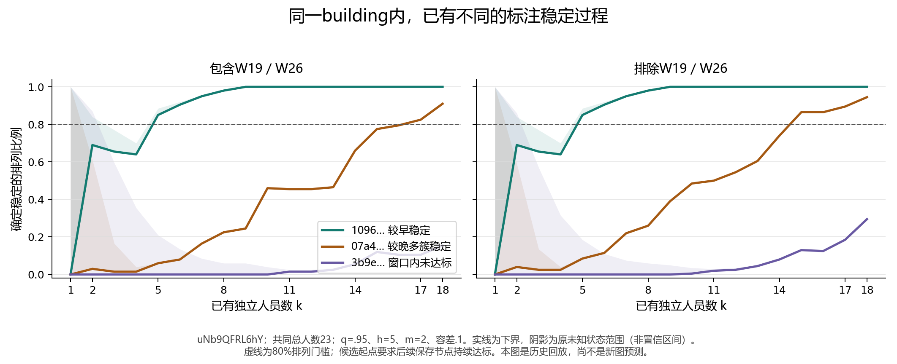

# 收敛假说、人员分档与HoHoNet特征：现有数据核对

日期：2026-09-09。性质：探索性证据整理。本次直接读取仓库CSV、保存窗口、分区表、NPZ和实现，新增下述汇总与图；没有借第二轮AI粘贴报告的未核验数值补结论，没有重新拟合人员模型、重跑几何聚类或HoHoNet推理。

**结论：现有数据已经支持同楼内存在不同的标注稳定过程，也有较早单簇稳定和较晚多受支持簇稳定的具体例子。它尚未证明这些情形能提前识别。人员方面可构建操作性分档，但不存在已验证的认真／粗心分类。HoHoNet原向量事实上覆盖全部214张历史图，是可用的候选预测输入；两套缓存存在数值差异，不能静默合并。**

## 1. 现有数据是否支持收敛假说

沿用当前SOP展示配置：q=.95、后续窗口h=5、支持m=2、变化容差.1、200个人员排列中80%持续达标。以下为历史回放中的候选人数，不是线上停止保证。q不可评价、分区不唯一和窗口内确实变化分别保留。

### 较早形成单簇：有直接例子

`S9hNv5qa7GM_bd9faec23bb3462c94a5fbc6c0a3d5cf`：

- 两个人员口径均有20人，完整q分区均为一个20人簇。
- k=2开始，之后全部保存节点的200个排列都稳定；没有多簇稳定排列。
- OSPA对照的保守起点同样是2。
- 旧摘要记作[1,2]，是k=1不满足m=2却被记unknown造成的上界宽松；确定稳定的起点是2，不应宣称1份即可停止。

`wc2JMjhGNzB_2195c5a9b9fd451b927b0050f23fac31`也有两口径一致、24人完整单簇、保守起点2的例子。因此“人数很少就有持续共识”在当前度量和已有人员中确有数据支持，并非只看到前两人相同就作判断。

### 同building内早、晚及未达标并存：uNb是最清楚的例子

固定`uNb9QFRL6hY`整栋楼、两种人员口径的共同总人数N=23，最多评价k=18，以相同h=5检查：

| 图像后缀 | 包含W19／W26 | 排除W19／W26 | 解释 |
|---|---:|---:|---|
| `1096f195d3294cefa462add5ab0c342e` | 5 | 5 | 较早候选；OSPA也为5 |
| `d02f87bbb0414146a7a15070110a0384` | 7 | 5 | 可识别，人数受人员口径影响；OSPA也可识别 |
| `bcce4f23c12744c782c0b49b24a0331a` | 8 | 8 | q结果一致，OSPA未达标 |
| `c1ebb8b34eb846ba9b5ce23b30b299a7` | 9 | 8 | q可识别，OSPA未知 |
| `07a43087f1e54e3f828851d8e457a283` | 17 | 15 | 较晚多受支持簇稳定；OSPA未知 |
| `3b9e548b46af4410b97e1d12781ec3c9` | 未达标 | 未达标 | k=18时31／59个排列稳定，169／141变化，unknown均0 |
| `8b6f1b0b025848b482e747ab6a027b97` | 未达标 | 未达标 | k=18时均99稳定、101变化、0 unknown |
| `9f199750b00c4f5484a546d79e06a0f8` | 未达标 | 未达标 | k=18时均57稳定、143变化、0 unknown |
| `5948424345f541b9a570b48f1cfcf622` | 未知 | 未知 | k=18时200个均unknown；不能归入不收敛 |

图中实线为确定稳定比例，阴影为原unknown编码的范围，不是置信区间。起点需此后所有保存节点持续达标。k=1的阴影包含已知支持不足，不能解释为该点可能符合m=2条件。

`07a430…`在候选k=17／15处，分别有165／173个排列稳定，**这些稳定排列全部已经有至少两个m=2支持的簇**。完整池唯一q分区分别是[16,6,1,1,1]与[16,6,1,1]；完整池N=25／24与上述统一回放N=23是不同字段。这是多受支持答案仍可稳定的直接证据，不是把一个主簇旁的单人标法当成两个受支持类型。

另一个跨度量支持更好的晚稳定例子是`rPc6DW4iMge_1f14902595544e389c9c910c444e79e7`：**逐图共同N=24**下，q和OSPA均为18／17，候选点各165个稳定排列中，164／163个已有至少两个m2支持簇。但该楼统一N=22，不能容纳k18+h5，包含口径改为未达标。它只能按逐图预算引用，不能和uNb整楼预算混用。

### 这些证据支持到哪一步

- 支持：图像间确有不同稳定形态和速度；同一building内部可以并存较早、较晚以及当前窗口未达标的图。
- 尚不支持：事先知道一张新图属于哪种情形、据此准确预测人数；也不能从uNb外推所有楼都有相同混合结构。
- “未达标”不自动等于“不断发现新语义标法”。例如`3b9e…`在逐图N=24的末节点k=19，份额变化失败分别143／117次，支持跨越失败47／38次，成员关系失败0次；原因可重叠。这说明占比变化也会阻止稳定，不能把全部失败解释为新标法出现。
- 不能由有限人数证明永久不收敛；也不能因部分图几何未知就称它们难以收敛。

这次结果支持将问题继续推进为“图像自身信息＋同楼历史，能否预测稳定状态／人数”，但还没有完成预测性能验证。现有楼内留图支持仍是10楼50图，全部高人数图为15楼55图。

用户进一步澄清，同楼假说关注的是“大概人数／范围”。楼内候选人数不同不能否定这个假说。统一整楼预算下，uNb的12图在两口径中均为5图候选确定、3图未达标、4图unknown；5个候选分别为[5,7,8,9,17]与[5,5,8,8,15]。已识别子集有4图集中在较低人数区间，是继续检验的线索，但这4图仅占全楼4／12，不能据此宣布全楼多数图集中。应比较源图预测范围的宽度、留出覆盖及通用基线；已有同楼预测尚无可确认的整体增量，也不等于已否定所有大致范围模型。研究与新人验证职责见[研究逻辑说明](../../docs/thesis_main/研究主线与新增标注验证说明_20260909.md)。

## 2. 人员数据支持怎样分、每类是什么意思

人员表仍来自原20260909分析的早版计算视图；本次核对原成员与验证表，没有重拟合为reviewed点集版本。第二轮AI声称的更新分类及41图组合结果未作为本次证据。

### 可用于后续组合的操作性候选：Manual参考偏差两档

控制图像差异后，学习每人的Manual相对参考点集偏差；以训练人员效应的中位数切成两档。当前20人、OSPA30、全量拟合示例为：

| 档位 | 操作含义 | 成员 |
|---|---|---|
| 1 | 这套参考和度量下，Manual相对偏差较低的半组 | W1、W2、W6、W8、W11、W15、W17、W28、W31、W33 |
| 2 | Manual相对偏差较高的半组 | W10、W12、W13、W29、W30、W32、W34、W35、W36、W37 |

两档各10人是中位数规则的结果，**不是已经发现两个自然人群**。OSPA60下W10进入低档、W31进入高档。全量成员仅供解释和计划，验证必须使用每个训练折自己的成员，不能把全量标签直接当独立验证标签。

选择它作候选的理由是定义明确、人数较均衡、能安排真实人员组合；不是两档预测最优。第一轮独立Manual-only留楼验证中，两档相对不分人员基线的楼等权MSE改善仅0.42%／−0.77%，连续效应则为3.41%／0.10%。因此底层应保留连续值。

“较低／较高”都是参考相对表现，不能直接称认真／粗心、可靠／不可靠。OSPA不包含完整墙面连接规则，参考也不是每条规则的盲审真值。

### Semi可增加修改行为维度，但目前的四细档还不稳定

先从Semi修改中估计人员效应，再减去Manual连续表现所预测的修改效应；得到“额外修改倾向”。在每个Manual粗档内按该残余继续分两档，当前20人、OSPA30、全部初始化为：

| 细档 | 含义 | 人员 |
|---|---|---|
| 1.1 | Manual偏差较低；本粗档内修改残余较低 | W6、W11 |
| 1.2 | Manual偏差较低；本粗档内修改残余较高 | W1、W2、W8、W15、W17、W28、W31、W33 |
| 2.1 | Manual偏差较高；本粗档内修改残余较低 | W10、W13、W32、W36、W37 |
| 2.2 | Manual偏差较高；本粗档内修改残余较高 | W12、W29、W30、W34、W35 |

这里的低／高仅相对于本粗档；不是所有低档都残余为负，也不是所有高档都残余为正，更不等于绝对少改／多改。修改幅度不能直接命名为保守、激进、认真或粗心；需要另接具体行为证据。

第一轮互斥建筑分半检验中，细档ARI为0.158／0.135，连续修改残余排序相关为0.755／0.660。删除单楼的稳定性也在去合成初始化后变弱。1.1只有2人，无法再留出2人验证自身人数增长。现阶段更适合保留连续Semi行为轴，四细档作探索性描述。

### 仓库的另一套三档不能与上述两层分类混用

`worker_reference_feasibility.../pooled/groups/`把Manual和Semi等全部可评分历史条件合并，再用Ward切指定组数。当前20人、OSPA30三档是：

| 混合条件参考偏差档 | 人数 | 成员 |
|---|---:|---|
| 较低 | 6 | W2、W8、W15、W17、W28、W33 |
| 中间 | 12 | W1、W6、W10、W11、W12、W13、W29、W30、W31、W32、W35、W36 |
| 较高 | 2 | W34、W37 |

OSPA60下W8转到中间档。删除一楼后始终同档者只有7／20或14／20。全26人Ward二档则最明显地区分24人与W19／W26，并不能证明当前20人也有相同两类结构。

这套三档可描述混合历史条件下的参考偏差，不能叫纯Manual粗类；指定Ward切成三组本身不证明天然存在三类。两人尾组也不足以支持该类增加到很多人的曲线。不同方案中同一个人换档，说明指标与信息条件不同，不能据此给人贴稳定人格标签。

## 3. HoHoNet倒数第二层能否与假说连接

### 用户的记忆有实际实现，但需要区分两代特征规则

模型`extract_feat`返回布局任务输出头之前的共享水平特征，配置通道数256。“倒数第二层”可以作为通俗说法，精确名称是任务输出头前的共享水平特征。

| 已有实现 | 实际含义 | 不代表什么 |
|---|---|---|
| 旧`d_t` | 水平平均得到256维并L2归一化，到Calibration参考池第10近邻的距离 | 不是已学习的人类困难概率 |
| 后来LHFeat全局描述 | 每通道水平均值＋标准差，合计512维；四个旋转相位平均 | 与旧256维L2向量不能混用 |
| LHFeat局部描述 | 每通道水平最大值，256维；四相位平均 | 名字虽含local，不是已经标好房间语义的类别 |
| `d_model_feat`及局部距离 | 固定训练参考PCA／白化后，最近5邻居平均距离 | 主要是模型特征偏离程度 |
| `g_model_struct` | 模型布局输出的结构异常分数 | 不是倒数第二层本身，也不是人类难度标签 |
| `risk_design_score_A` | 特征距离、结构风险及C1支持距离组成的缩放向量范数 | 不是已经训练验证的稳定人数预测器 |

旧数据确有风险与人类质量的探索关联模型，覆盖225响应、67任务、9楼；其产物明确禁止升级为科学结论。它评价的是旧质量关联，不能代替本轮稳定形态／人数预测。

### 数据实际可连接，旧总表低估了底层覆盖

使用精确`image_id`连接，图像纳入完全由当前`image_support_comparison.csv`决定，不按q是否可评价筛选：

| 资料范围 | 图数 | 旧214图汇总有风险值 | C2向量缓存覆盖 | Stage3向量缓存覆盖 | 两缓存并集 |
|---|---:|---:|---:|---:|---:|
| 所有历史图 | 214 | 70 | 157 | 144 | 214 |
| 可用无辅助图 | 196 | 70 | 157 | 126 | 196 |
| 高人数图 | 55 | 4 | 16 | 51 | 55 |

两个缓存分别有290／458个图像条目，均保存512维全局、256维局部向量及路径。不同路径stem并集648，已覆盖全部历史图。三个源风险表的非空数值并集也覆盖214图，但有值不等于状态可评价或正式可用；本次逐来源保留状态，没有选一个分数静默覆盖其余来源。

**发现需要先解决的数值一致性问题：** 同时出现在两缓存中的87张历史图，其原描述向量全部有差异。全局逐元素最大绝对差0.325424，局部最大绝对差1.048693；对应两表风险分数最大差1.411028。两份缓存声明相同模型及特征定义，但图像路径涉及不同JPEG／PNG来源；本次尚未定位差异原因，不能把这些差值直接归因为图像压缩，也不能宣称两缓存可无条件互换。

C1参考表与C2候选表的87个重叠风险分数也有差异，最大绝对差0.990207；其参考内留一和候选计算角色不同。下一步须确定统一图像来源、提取设置及参考规则，验证兼容性或重建一致特征后再建模。

现有特征参考集合是1647图、48个scene；按清单与当前历史图ID及building匹配，与214图、22楼均无交集。这是参考集合隔离证据，不是对模型checkpoint全部训练过程的无泄漏认证。

### 可以怎样对应新假说

可以将固定图像特征、模型特征距离作为**标注前可见输入**，把历史标注的稳定状态、候选人数及多簇形态作为待预测结果，检验这些输入能否区分同楼的不同图像。

应分别比较一般历史规律、同楼历史、图像特征、图像特征＋同楼历史。若图像特征有用而building没有额外改善，支持的是图像特征预测，不能称同楼信息已有效。若使用前几人的标注，需要另称早期响应辅助预测，并公平计入所用人员预算。

现阶段没有验证“风险越高越不收敛”，也不应把稳定多簇自动列为高风险。困难可能来自模型分布偏离、人类范围选择、点集表示限制等不同原因。仅55张高人数图，不宜直接用768维拟合复杂三分类并汇报同图训练准确率；应先确定结局和评价切分，用少数预先指定的特征作简单基线。

## 4. 输出字段合同与验证

| 文件 | 粒度／唯一键 | 字段解释及缺失约定 |
|---|---|---|
| [building_evidence.csv](building_evidence.csv) | 55图×2口径；`image_id,mode` | `q95_*`为展示q结果，`ospa_*`为对照；`possible/conservative`为持续80%起点，空值表示该端未定；`status`区分identified、finite_interval、unknown、not_reached；计数以200排列为分母，不是独立样本数 |
| 同上：预算和多簇列 | 同一行保留两种预算 | `common_n`是逐图两口径共同N，`building_common_n`是整楼所有高人数图共同N；`*_building_budget_*`只对应后者；`full_pool_n/cluster_sizes`属于各口径完整池，不能替代共同预算；`multi_stable_n`至少两个簇，`m2_multi_stable_n`才要求至少两个各获m2支持簇 |
| 同上：失败原因列 | 逐图共同预算的末节点 | `terminal_member/share/promotion_failure_n`可重叠；不相加当独立失败数，不全称新语义类别；`source_*`路径相对`analysis_results/` |
| [worker_group_evidence.csv](worker_group_evidence.csv) | 460行、20配置；`scheme,cohort,metric,initialization_pool,worker_id` | `scheme`区分混合条件Ward、Manual两档和Semi细档；效应单位是相应OSPA角度；低/高为相对档位，`semi_residual_deg`是相对Manual预测的残余；`same_as_full_fraction`只是删楼敏感性，来源行号1基并含表头 |
| [risk_feature_coverage.csv](risk_feature_coverage.csv) | 214图；`image_id` | `common_n>0`为196可用图，`>=16`为55高人数图；缓存覆盖为0/1；各源risk与status分别保留；空值不填0；重叠向量差仅在两缓存都有该图时有值，不代表误差或风险预测性能 |
| [risk_feature_coverage_QA.json](risk_feature_coverage_QA.json) | 覆盖及重叠来源检查 | 214／196／55分母，缓存覆盖、风险状态、同图不同来源的最大数值差 |
| [same_building_examples.png](same_building_examples.png) | uNb三图、两口径 | 108个原曲线节点，统一整楼N=23；范围阴影不是置信区间；示例按展示早／晚／未达标现象选择，不用于估计总体预测性能 |

本次检查实际执行：

- 从保存窗口独立重建811200个窗口、4056个节点，覆盖55图×两口径×q／OSPA、h5/m2/.1；三状态及stable_multi与保存曲线一致，独立计算持续80%起点。
- 核对79份唯一完整q分区的成员身份、点数硬条件和支持人数；确认晚稳定例子有至少两个m2支持簇。
- 人员CSV460行的配置人数、唯一键、来源成员与中文编码检查通过；未重新拟合模型。
- 风险覆盖精确连接214个唯一image_id，核对196／55层级、NPZ向量存在性及87个重叠图的数值差，未做SHA。
- 图像生成回读108个节点，并检查图中文字、图例和边界；绘图使用仓库已有matplotlib，未安装依赖。
- 新文件已在仓库地图和README索引登记为探索支撑，原始导出、用户裁决、SOP、正式合同、routing及分析schema均未修改；以上新汇总schema仅由本节定义，不改旧表。

交付回读结果见[DELIVERY_CHECKS.json](DELIVERY_CHECKS.json)。未重跑无关pytest、GPU推理、全量聚类或其他AI的分析；本轮是既有结果的独立核对和派生整理。仍未完成特征来源统一、收敛状态预测模型、新人员验证和正式阈值选择。

## 5. 关键源码与输入

- [当前SOP](../../docs/thesis_main/相似场景标注稳定性分析SOP.md)、[原场景报告](../multibuilding_threshold_stability_20260909_v1/分析结果.md)、其`revised/comparison/image_support_comparison.csv`与`revised/{with_workers,without_workers}/`窗口、曲线及分区。
- [混合条件分组](../worker_reference_feasibility_20260909_v1/pooled/groups/README_ZH.md)、[Manual＋Semi层级分析](../semi_subtype_exploration_20260909_v1/README_ZH.md)；第一轮离线包中的Manual-only验证及互斥建筑分半表作为补充。
- [HoHoNet模型](../../lib/model/hohonet.py)、[旧d_t实现](../../tools/thesis_main/registry/compute_dt_score.py)、[LHFeat提取](../../tools/thesis_main/registry/hohonet_feature_backend.py)、[风险通道实现](../../tools/thesis_main/analysis/materialize_c2_task_risk.py)。
- `analysis_results/c2b_validation_static_20260802_v16/static/c2_candidate_lhfeat_cache.npz`、`c2_feature_reference_cache.npz`、`c2b_reference_image_file_listing.csv`。
- `analysis_results/stage3_test_preparation_20260804_v1/stage3_test_candidate_lhfeat_cache.npz`、`test_task_risk_candidate.csv`。
- `analysis_results/c2b_validation_design_20260802_v17/output/c2_task_risk_inventory.csv`、`c1_task_risk_reference.csv`。

这些文件是输入／核验来源，现有Stage3候选或C2字段在此只作研究输入审计，不授权正式实验派发或改变原协议用途。
