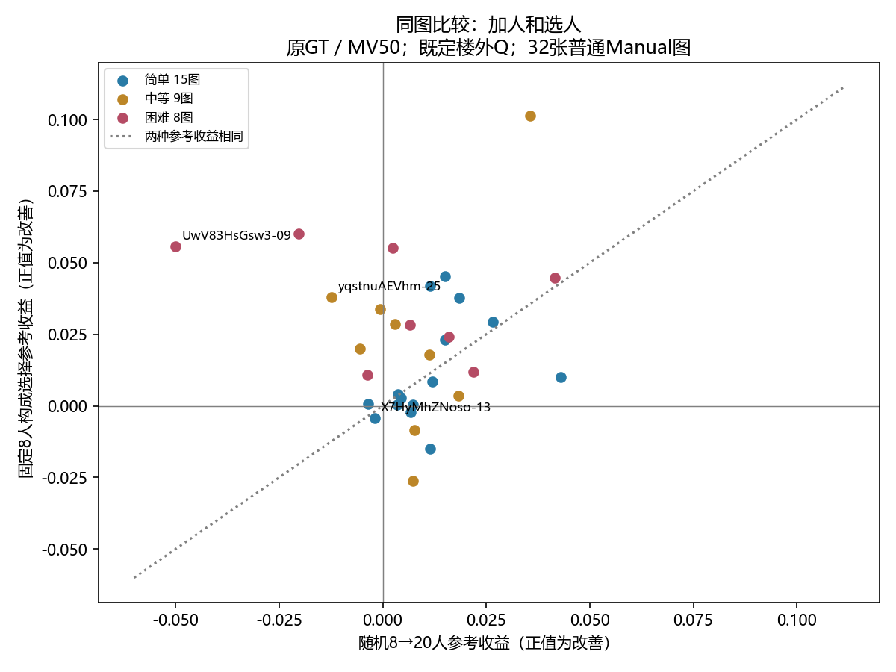

# 加人和选人：连接难度、人数响应与全员结果

2026-10-07。复用既有39图构成和全量曲线，按图片／方法／参考连接，接入最新人工标签。39图中1图uNb-63现确认为OOS，单列；N≥20固定普通面板为32图（15简单、9中等、8困难）。这与含可标门洞的33图面板不同：本轮没有门洞构成实验，不补造。

## 主结果：原GT校准与评价、MV50、随机8→20人

|难度|图数|加人平均收益|选人平均收益|加人改善图数|选人改善图数|选择8人优于随机20人|
|---|---:|---:|---:|---:|---:|---:|
|全部|32|0.00786|0.02131|24|27|20|
|中等|9|0.00714|0.02316|6|7|6|
|困难|8|0.00178|0.03635|5|8|7|
|简单|15|0.01153|0.01218|13|12|7|

共同基线均为随机8人期望D；加人收益=D8−D20，选择收益=D8−既定偏上半8人D。比较的是策略期望，不是某次挑出的最好8人；校准成本未计入，不是预算最优结论。

## 新连接得到什么

- 32图中24图增人改善、27图选择改善；20图选择8人低于随机20人。平均选择收益0.02131，高于增人0.00786；建筑等权的两者差仍为正（0.01188）。这是已有人员池上的参考收益，不是人员类型或未来人群保证。
- 8张增人不改善图中，7张选择仍改善；另1张X7-13两者均未改善。Uw-17的选择收益仅0.00067，计数只是数值正负，不能把这些7图都称为实质性修复。
- 困难8图的平均增人收益仅0.00178，但5图改善、3图变差，不能将组均值套到每图。8图既定选择均降低参考误差，7图选择8人优于随机20人。较差的增人曲线并不意味着换构成也无帮助。
- 简单图同样存在反例：X7-13两策略误差都略升，但绝对D仍较小。停滞与离GT很远是不同现象，不能单凭收益正负分难度。

## 实际全员结果与反例

|图片|难度|随机8人D|随机20人D|选择8人D|实际全员D|
|---|---|---:|---:|---:|---:|
|UwV83HsGsw3-09|困难|0.72088|0.77093|0.66507|0.81438|
|UwV83HsGsw3-17|简单|0.05147|0.05509|0.05080|0.05890|
|X7HyMhZNoso-13|简单|0.03338|0.03536|0.03758|0.03507|
|e9zR4mvMWw7-19|中等|0.53154|0.53227|0.49778|0.53285|
|uNb9QFRL6hY-60|困难|0.10798|0.11177|0.09707|0.11716|
|yqstnuAEVhm-04|中等|0.53901|0.54447|0.51903|0.54363|
|yqstnuAEVhm-25|中等|0.27645|0.28875|0.23839|0.29862|
|yqstnuAEVhm-31|困难|0.42325|0.44352|0.36319|0.47643|

全员按每图实际N形成唯一输出，N不同，不能把这列当固定人数对照。Uw-09原GT全员遗漏增加已有解释；rPc内／外侧目标已有合理性判断，选择靠近参考不能推翻另一合理目标。本轮不新增语义裁决。

## 规则与参考敏感性

|校准|评价|规则|加人改善/32|选择改善/32|选择8人优于随机20人/32|加人未改善但选择改善|
|---|---|---|---:|---:|---:|---:|
|original|original|mv50|24|27|20|7|
|original|original|mv_strict|26|24|23|4|
|original|revised_where_available|mv50|25|27|18|6|
|original|revised_where_available|mv_strict|26|24|24|4|
|revised_where_available|original|mv50|24|25|19|5|
|revised_where_available|original|mv_strict|26|23|21|3|
|revised_where_available|revised_where_available|mv50|25|24|17|4|
|revised_where_available|revised_where_available|mv_strict|26|23|23|3|

修订优先只替换确有修订参考的图片，不挑分数高的GT。严格多数下困难组加人改善可比简单更大，因此“困难始终加人更慢”仍不成立。选择参考收益在不同设置下的总体方向应与逐图反例同时报告。

## 文件及下一步

- per_image.csv保留39图全部可用规则／校准／参考组合，含实际构成比例、R/V、选择的遗漏／外扩收益及全员O/E；OOS不混入普通汇总。summary.csv包含固定16/20人上限、均值、中位数、建筑等权和实际图名。
- 本轮复用现有计算，未重算几何、拟合新Q、改变投票或修改参考。9项相关测试通过，连接检查同N及随机8人／全员D一致。
- 这完成了“困难曲线后段收益较小”与“人员选择能否改变参考表现”的有限连接。下一步仅针对现有无法解释的空间差异看实际布局；待定门洞先看作答，不将其审核当作主线前置。模型特征预测人工难度仍为后续工作。
