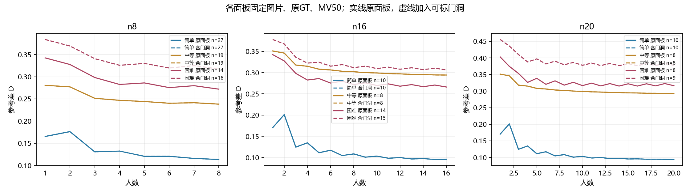
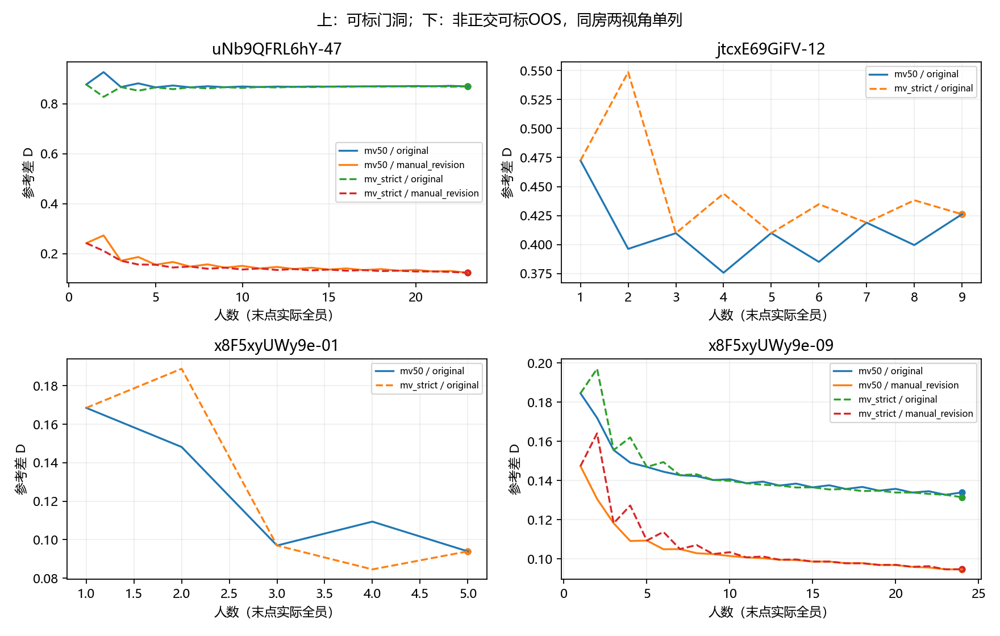

# 难度与人数：起点、改善过程、全员残留

2026-10-07。**当前证据部分支持“困难图在较大残余误差处改善缓慢”，但不支持所有困难图都如此，也不支持从单一下降幅度定义难度。** 比较对象是固定人员池中随机k人形成的单一Lee融合结果；D为期望对称差／同版GT面积，不是1−IoU。

本轮复用既有普通图曲线，仅为两张可标门洞和两个非正交可标OOS视角补人数计算。原／修参考、MV50／严格多数分别保留。没有重跑全库、修改人工难度、选人或参考。

## 1. 在相同面板中比较起点与过程

以下为原GT、MV50、图片等权。第一面板固定32张至16人，第二面板固定26张至20人；两者不能拼成一条曲线。暂不含门洞，便于与旧结果连接。

| 固定面板／难度 | 图数 | 1人D | 4人D | 8人D | 16人D | 20人D |
|---|---:|---:|---:|---:|---:|---:|
| 32图／简单 | 10 | 0.17029 | 0.13466 | 0.10846 | 0.09578 | — |
| 32图／中等 | 8 | 0.35110 | 0.31507 | 0.30212 | 0.29439 | — |
| 32图／困难 | 14 | 0.34255 | 0.28260 | 0.27198 | 0.26614 | — |
| 26图／简单 | 10 | 0.17029 | 0.13466 | 0.10846 | 0.09578 | 0.09381 |
| 26图／中等 | 8 | 0.35110 | 0.31507 | 0.30212 | 0.29439 | 0.29255 |
| 26图／困难 | 8 | 0.40297 | 0.32622 | 0.31798 | 0.31517 | 0.31620 |

**改善主要出现在前段，困难图并不是从一开始就下降更少。** 60张固定8人面板中，简单／中等／困难从1到8人的D分别下降0.05192／0.04243／0.07056；困难组下降最多，8人残留却仍最高。这是“起点较远、已有改善、仍然较远”，不能只按斜率叫快或慢。

到较大人数段，MV50下困难组平均改善更小：32图的8→16人，简单／中等／困难改善0.01269／0.00773／0.00584；26图中的困难组8→16仅改善0.00281，16→20反而增加约0.00104。这是对用户假设的具体支持，但属于当前池、指标与规则下的描述，不是图片难度的因果估计。

简单、中等、困难的终点并不处处单调。32图中中等组终点比困难组更远，且建筑等权时部分排序也改变。不能用这一点单独否定“改善慢”，也不能把它隐藏在总均值后。

## 2. 门洞已实际接入，不再被旧场景过滤排除

使用已有判断：jtcx-12和uNb-47均为困难、可标门洞。二者人员池沿Pro六图输入中既定Manual、独立、可用于共识、main_candidate名单，分别9人／23人。没有将其加入旧人员主质量评分或改资格。

- 8人面板由60扩展为62图，困难14→16图。
- 16人面板由32扩展为33图，困难14→15图。
- 20人面板由26扩展为27图，困难8→9图。
- 共同24人十图保持不变，不把门洞混称为同一人员池。

| 门洞／参考，MV50 | 1人D | 4人D | 8人D | 16人D | 实际全员D |
|---|---:|---:|---:|---:|---:|
| jtcx-12／原GT | 0.47246 | 0.37577 | 0.39961 | — | 0.42618（9人） |
| uNb-47／原GT | 0.87670 | 0.88114 | 0.86968 | 0.86899 | 0.86885（23人） |
| uNb-47／修订GT | 0.24186 | 0.18630 | 0.15692 | 0.14081 | 0.12342（23人） |

jtcx在前段改善，随后有奇偶门槛起伏，4→8反向；9人终点仍好于单人均值。uNb对原参考看起来几乎停滞，对修订参考则持续改善。**门洞能进入困难图分析，但“困难门洞必然不接近GT”不成立；参考版本会实质改变解释。** uNb方位上游原因仍未定，纳入原GT困难均值只作条件性比较，不能把由它抬高的误差全部归因于难度。

加入门洞后，原GT／MV50／33图的8→16人改善为简单0.01269、中等0.00773、困难0.00550；困难15图中10图改善、5图变差，中位改善0.00405。27图对应困难组改善0.00257，9图中6改善、3变差，中位改善0.00069。**均值改善很小不等于每张困难图都不改善。** 不含门洞结果同时保留，避免结果只由uNb的参考问题推动。

## 3. 规则和参考影响“速度”，不能只报告有利一条

以下均为固定27图（包括uNb门洞），8→16人的平均D减少量，正数为改善。

| 规则／评价 | 简单10图 | 中等8图 | 困难9图 |
|---|---:|---:|---:|
| MV50／原GT | 0.01269 | 0.00773 | 0.00257 |
| 严格多数／原GT | 0.00594 | 0.00964 | 0.01262 |
| MV50／修订优先 | 0.01269 | 0.01185 | 0.00634 |
| 严格多数／修订优先 | 0.00594 | 0.01057 | 0.01451 |

因此，“困难组每增加同样人数，绝对误差下降必然最少”没有跨规则成立。作为已有曲线的奇数端点对照，两规则在9与17人阈值相同，原GT27图简单／中等／困难改善分别0.00623／0.00657／0.00363；这支持MV50后段观察，却不取代预先报告的8→16结果。完整逐人数曲线保留，不平滑掉奇偶起伏。

更稳妥的本轮结论是：**困难组常有较高残留，部分图片及面板在后段改善很有限；简单组通常已处于较低误差。改善幅度的难度排序还依赖融合规则和参考，不冻结为统一快慢类别。** 原/修政策仅在确有修订的图变化，六张共同面板图仍沿原参考，不是全新验证集。

## 4. 同人员面板与实际全员结果

共同24人十图继续控制人员名单。原GT／MV50下：

- X7简单图：8→16→24为0.0334→0.0349→0.0351，已经较近，平坦不应称难图式停滞。
- yq-32困难图：0.1186→0.1041→0.1028，仍改善，面积残留相对较低；已有易漏细节判断不因此被推翻。
- rPc困难图：0.4942→0.4902→0.4865，在较远处改善很小。
- Uw困难图：0.7209→0.7521→0.8144，反向变化；范围解释和参考需一起读。

原作答R、融合V保持独立观察。人员构成对照继续使用[已完成的成员—融合结果](../../consensus_response_20261006/member_fusion/REPORT.md)：原GT8人上组通常更近，rPc起点优势在融合后缩小、X7反转。这提供具体解释线索，不把不同名单的全员终点与8人策略比较冒充纯人数效应。本轮没有重选Q类别。

每张可计算图的全员N和D_all在`per_image.csv`保留；固定16／20人不是所有图的全员终点。没有合并不同N的终点来估计人数速度。

## 5. OOS单独看

仅补两张非正交但清晰可标的既有视角，来自同一房间，不代表全部OOS，更不能把5人图和24人图作人数对照。

- x8-01：原GT／MV50，1人0.16854→全5人0.09392。
- x8-09：原GT1人0.18453→8人0.14226→全24人0.13394；修订GT对应0.14736→0.10291→0.09465。

这两个输入下，非正交没有阻止融合接近参考。多层顶面、曲线墙或其他表示不适配OOS没有由本轮覆盖。

## 文件、复算与结束条件

- `curves.csv`：复用普通图与新增四特殊场景逐人数O/E/D，实际参考版本保留；原表没有V时留空。
- `per_image.csv`：逐图起点、4/8/16/20/24人、全员D及固定区间改善；缺人数留空。
- `summary.csv`：固定面板三档均值、中位数、建筑等权均值及具体名单，包含两规则、两参考政策、门洞纳入前后。
- `intervals.csv`：同批图的区间改善、逐图改善／变差数量及中位数；均值曲线不能代替逐图分布。
- `field_contract.json`：来源、四图具体纳入名单、公式、面板口径与端点检查。

复算：`python -m tools.thesis_main.analysis.difficulty_trajectory_20261007`。相关6项测试通过；新增四场景的k=1与实际单人均值、k=N与已保存全员区域一致，最大误差3.89×10⁻¹⁶。未重跑全库，不改正式协议、GT、源标注或历史输出。图为保留的研究产物，不是临时截图。

本轮已完成有限描述性比较，没有证明难度独立导致某种速度，也没有拟合预测器。两张门洞已有困难／可标记录，本轮无需新增人工判断。若后续扩展到尚无难度或可标性裁决的门洞，再集中提供具体图片，不把本次成果拖成全库补标任务。
