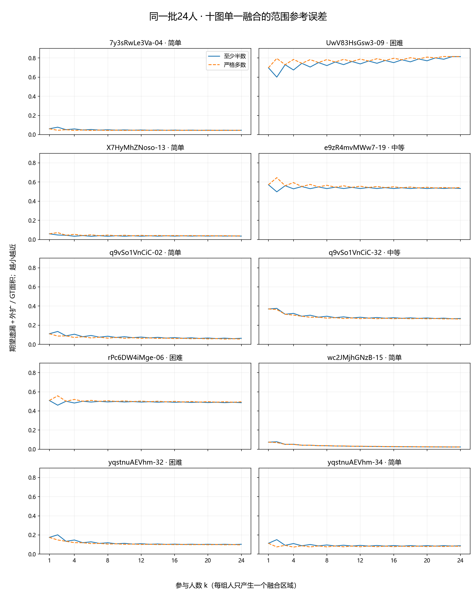

# 接收8图难度后：同一24人面板的结果

2026-10-06。用户导出已原样保留为 [user_review.json](../user_review.json)，原8图身份匹配；本轮只连接标签和重汇总既有融合结果，没有重跑几何，也没有修改以前的难度报告。

## 接收的人工判断

| 图片 | 难度 | 用户原备注 |
|---|---|---|
| 7y3sRwLe3Va-04 | 简单 | |
| UwV83HsGsw3-09 | 困难 | 比较难,有多种空间的标注范围 |
| q9vSo1VnCiC-02 | 简单 | |
| q9vSo1VnCiC-32 | 中等 | 存在多种空间的标注范围 |
| rPc6DW4iMge-06 | 困难 | 很难,很多人会漏标细节 |
| yqstnuAEVhm-32 | 困难 | 很难,很多人会漏标细节 |
| yqstnuAEVhm-34 | 简单 | 也存在不同的标注范围(较少) |
| wc2JMjhGNzB-59 | 简单 | |

8图的OOS、门洞交界均为“否”。明确否定作为本次新证据保存，不用“未记录”替代。范围有多种解释不自动变成OOS／门洞，也不自动等于困难：yq-34就是用户判断为简单且有少量范围差异的例子。原备注保留，不自动生成范围／细节的全库正式分类。

这些8图此前均无有效三档标签；纳入后全259图的有效难度为简单57、中等32、困难20，共109图，未定6、未记录144。当前几何输入包保持原状；新人工判断作为明确的补充层，由更新脚本读取，不能只读旧包后声称已用本轮标签。

## 相同人员，逐图看人数响应

共同十图的24人名单完全相同，现已全部有难度：简单5、中等2、困难3。每个抽组产生一个Lee融合区域，以原GT为参照。D为期望遗漏面积加外扩面积，再除以GT面积，越小越近；这仍只衡量BEV范围。

下表为MV50。两规则和完整1—24人数据均保留在 [逐图表](common10_per_image.csv)。

| 图片 | 难度 | 4人D | 8人D | 16人D | 24人D |
|---|---|---:|---:|---:|---:|
| 7y-04 | 简单 | 0.059 | 0.050 | 0.047 | 0.045 |
| X7-13 | 简单 | 0.034 | 0.033 | 0.035 | 0.035 |
| q9-02 | 简单 | 0.106 | 0.085 | 0.071 | 0.063 |
| wc2-15 | 简单 | 0.052 | 0.036 | 0.027 | 0.023 |
| yq-34 | 简单 | 0.110 | 0.096 | 0.089 | 0.088 |
| e9z-19 | 中等 | 0.529 | 0.532 | 0.532 | 0.533 |
| q9-32 | 中等 | 0.323 | 0.294 | 0.278 | 0.270 |
| Uw-09 | 困难 | 0.675 | 0.721 | 0.752 | 0.814 |
| rPc-06 | 困难 | 0.483 | 0.494 | 0.490 | 0.487 |
| yq-32 | 困难 | 0.147 | 0.119 | 0.104 | 0.103 |

图中连线只是人数—误差统计摘要，不是全景边界曲线。奇偶人数的跳动受多数门槛影响，因此同时保留“至少半数”和“严格多数”，不将跳动直接判为不收敛。

**三点值得进入后续研究：**

1. 简单图在这个面板上整体较近，但人数作用不同。X7-13在4人时已处于较低误差，随后基本不降；q9-02、wc2-15则继续改善。没有事先规定“多近算接近”的阈值，所以这里不宣布达标人数。
2. 增加人数不能保证向GT移动。Uw-09从8人的0.721升至24人的0.814；严格多数也是0.784升至0.816。rPc-06和e9z-19则在较大残余误差处变化很小。这些现象不能单凭面积误差判定是人员错误、范围选择还是参考偏差。
3. 难标细节与范围误差不同。你把rPc-06、yq-32都标为容易漏细节，但24人的D分别约0.487和0.103。yq-32的范围误差相对较小，不能反证它不难，也不能证明细节已保留。局部质量需要接上Pro正在研究的测量。

换组不确定性与参考偏差确实可以分开变化：Uw-09在8→16人时，按全员并集归一化的两次抽组区域差异从0.109降至0.066，但D从0.721升至0.752。rPc-06换组差异0.046→0.025，D仅0.494→0.490。这是同一有限人员池内“结果更一致，不等于更接近参考”的直接实例；不使用全24人必然零换组差异作为稳定性的证据。

按三档汇总，MV50的8→24人D为简单0.060→0.051、中等0.413→0.402、困难0.445→0.468。困难组仅3张，均值上升主要受Uw-09影响，不应把这概括为所有困难图都会变差。同一24人池减少了人员池差异，仍没有使图片条件成为随机实验，也不是独立验证集。

## 更大面板同步更新

| 固定面板 | 有难度图数 | 简单／中等／困难图数 | 末点D：简单／中等／困难 |
|---|---:|---|---|
| 可比较至8人 | 60 | 27／19／14 | 0.113／0.238／0.272 |
| 可比较至16人 | 32 | 10／8／14 | 0.096／0.294／0.266 |
| 可比较至20人 | 26 | 10／8／8 | 0.094／0.293／0.316 |

每个面板内图片固定，面板之间不同，末点不能拼成一条总体曲线。这轮新增判断后，8人面板的均值呈现简单→中等→困难递增，但16人面板仍不满足这一排序。因此不把“难度越高必然越慢”写成结论，也不再要求补更多审核来凑出排序。

## 接下来使用哪些证据

本轮补标已经足够继续推进，不追加审核清单。人员／人数线保留单一融合输出：在共同十图上比较同图的人员构成收益与加人收益，并与本轮难度和原备注一起解释。质量线可直接取Uw-09的范围歧义、rPc-06／yq-32的细节差异，检验面积指标之外还有什么信息；不因三个标签而先建立复杂分类器。

本目录保存更新汇总、67图有效标签及原标签、逐图人数表和图表；原始8图JSON单独保留。`field_contract.json`列出补充来源、共同24人名单和字段解释。复现：`python -B -m tools.thesis_main.analysis.update_difficulty_review_20261006`。三个针对性测试通过；只核对本次图片身份及共同人员池，没有重复全库基线。原资格、投票规则、GT及源坐标未改。图表为研究交付图，不是临时截图。
