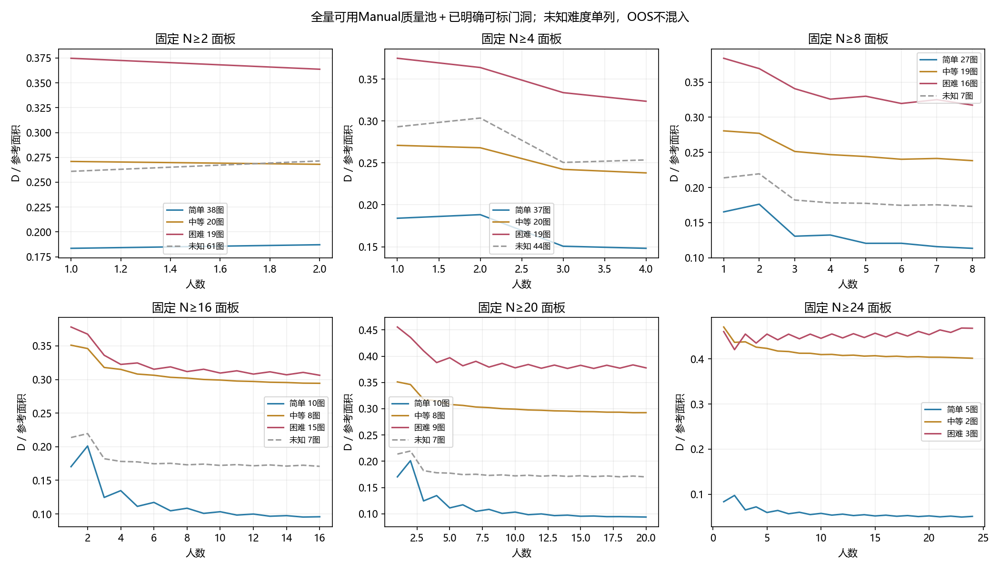

# 全量图片的难度与人数研究

2026-10-07。**已按当前输入覆盖全259张研究图片，不再只使用高人数小面板。扩展后的主要增量是少人数图片、未知难度图片，以及门洞／OOS／Semi的独立覆盖；有标签的高人数普通图此前已经基本覆盖，不能把重复出现的曲线算成新验证。**

## 实际覆盖

当前统一包含259张人员作答研究图及2张仅GT参考图；后两张没有人员作答，不作为人数实验。按既有独立性、共识资格、Manual／Semi／OOS采集条件与共识gate分池，没有将同图不同条件混成一组。

- 249张图具有可计算结果，共274个人员池：Manual 222池、Semi 43池、OOS采集9池。这不是274张图片，也不是274名人员。
- 20个人员池仅1人，保留实际结果，不把它当作增人实验。
- 6张图没有当前规则下可纳入的人员池；4张图的整池含不可计算人员几何，保留失败：S9-01、S9-07、pRb-11、rPc-22。没有删除失败人员以凑可算结果。
- 保存6782条规则／参考／人数结果，以及548份实际全员区域。所有数量均为派生状态，未新增采集。
- 场景按现行记录保留：普通235池、OOS场景22池、难标门洞15池、明确可标门洞2池；这些池跨采集条件，不能直接当独立图片数。

全量可算不等于全部可作人员质量评分。普通Manual主质量兼容为153池，其中136池至少2人；普通Semi主质量兼容36池。其他可算池仍保存原用途及gate，未修改资格。OOS表示适用范围按当前declared footprint解释，几何可算不认证语义正确。

## 1. 全量少人数图补充了什么

普通Manual主质量兼容、原GT、MV50，固定N≥4、有人工难度的74图：

| 难度 | 图数 | 单人均值D | 4人D | 减少量 |
|---|---:|---:|---:|---:|
| 简单 | 37 | 0.1840 | 0.1482 | 0.0358 |
| 中等 | 20 | 0.2709 | 0.2381 | 0.0328 |
| 困难 | 17 | 0.3394 | 0.2876 | 0.0518 |

困难组前段减少量最大，却仍离参考最远。因此，“困难”不能简单等同于每个阶段斜率都更平。这与上一轮前段发现一致。加入两张已明确困难、可标门洞后为76张有标签图，困难组19图的1→4人D为0.3747→0.3235；门洞另有标记。

未知难度没有被删除：N≥4普通Manual另44图，1→4人D为0.2931→0.2535。但它们只能作为未知组描述，不能自动填为中等或困难。

## 2. 高人数结论并没有因“全量”自动获得更多带标签样本

普通Manual有标签面板仍为：至8人60图、至16人32图、至20人26图；加入已明确可标门洞为62／33／27图。原因是新增的大量图片人数少或难度未知，不是没有计算它们。

上一轮[后段比较](../difficulty_consensus_20261006/trajectory/REPORT.md)继续成立：MV50困难组在8人以后改善较小、残留较高；严格多数下改善幅度排序不同；uNb门洞原／修参考会改变停滞判断。OOS始终单列。不同人数上限的面板不拼接为同一曲线，未知难度曲线不当成某一难度的证据。

本图为Manual普通主质量兼容＋明确可标门洞、原GT、MV50。两规则、原／修订优先、建筑等权和未知组均保存在`summary.csv`；图中纵轴各自缩放，不能比较斜线角度来判断跨面板速度。

## 3. 全员结果的覆盖扩大

原GT／MV50，普通主质量兼容且N≥2：

| 条件 | 可比较池 | 全员D低于单人均值 | 更高 | 相同 |
|---|---:|---:|---:|---:|
| Manual | 136 | 116 | 19 | 1 |
| Semi | 36 | 33 | 3 | 0 |

Manual已标难度部分，简单38图全部全员优于单人均值，中等20图中18图、困难17图中16图改善。**困难图依然可能从融合获益，这不等于已接近GT或后段继续有效。** 各图全员N不同，以上是实际终点对比，不是控制人数后的因果效应；也不是超过每一个人。Semi与Manual图片／初始化不同，不比较这两行百分比来判断辅助标注优劣。

这轮将更多门洞与OOS的可算过程单独保存：15池难标门洞的“难标”不自动解释为不可标，亦不自动赋值为三档困难。未知三档时不混入难度均值；OOS采集条件与图片OOS场景是不同字段，均保留。

## 4. 现在有价值的人工补充

全量计算后仍有7张普通主质量兼容图人数≥20、缺少确定难度；另3张高人数门洞缺少三档和明确可标性判断。按这些覆盖条件选出10图，**未使用融合误差或曲线方向挑图**。

[打开复用的图片审查台](review.html)。只展示原图和人数，无共识分数／GT叠图。难度可填简单／中等／困难／暂不能判断；门洞请在备注说明可标或不可标及原因。原先暂定的图允许继续暂不能判断，不为扩大面板而强制分类。

| 图片 | 人数 | 本次用途 |
|---|---:|---|
| B6By-11 | 23 | 普通图难度待定 |
| Uw-17 | 23 | 普通图难度待定 |
| rPc-01 | 23 | 普通图缺难度 |
| rPc-09 | 21 | 普通图缺难度 |
| rPc-20 | 22 | 普通图缺难度 |
| uNb-63 | 23 | 普通图缺难度 |
| yq-25 | 23 | 普通图缺难度 |
| q9-13 | 24 | 门洞难度／可标性 |
| uNb-21 | 24 | 门洞难度／可标性 |
| uNb-25 | 22 | 门洞难度／可标性 |

本轮不需要用户再确认已有rPc／yq局部判断、uNb-47或jtcx-12的可标判断。几何失败整池也没有混入这份难度补标清单。收到补标后只更新标签及汇总，无需重算几何；当前未知结果完整保留。

## 文件与验证

- `coverage.csv`：全259图入口及池状态、人数、场景、难度、质量资格；失败原因明确。
- `roster.csv`：每池实际记录与人员；`issues.json`保存几何／参考警告。
- `curves.csv`：两规则、各实际参考、逐人数O/E/D/V。
- `per_image.csv`：起点、固定区间改善和实际全员误差；人数不足留空。
- `endpoints.csv`、`all_consensus.geojson`：实际全员数值与底面，按pool与method连接；多参考是同一输出的重复评价。
- `summary.csv`：固定池容量、采集条件、场景用途、难度、参考及规则的汇总，保留完整图片名单、图片等权／中位数／建筑等权。
- `field_contract.json`固定上述口径。没有把后验困难标签或目标GT用于选择人员、修改票权。
- `review_roster.json`保存10图选择依据，`review.html`沿用旧展示台，新schema／暂存键／导出文件名，不覆盖上次8图记录。

复算：`python -m tools.thesis_main.analysis.difficulty_full_20261007`。全量使用现行预处理输入、固定环序和已验证积分／有限池概率函数；全员数值逐池与导出区域一致。相关7项测试通过，新增测试覆盖固定人数面板、未知难度与OOS不混组。审查台沿用原交互模板，10张图片路径和内嵌数据已检查；未重新做浏览器交互测试。图是研究交付物，没有留下临时截图。

当前完成的是全库可用范围下的描述性人数研究，不是新的独立人群验证，也未建立普遍难度定律或难度预测器。下一步先接收这10图的必要人工信息，更新高人数难度结果；不以继续添加派生分数替代标签缺口。
