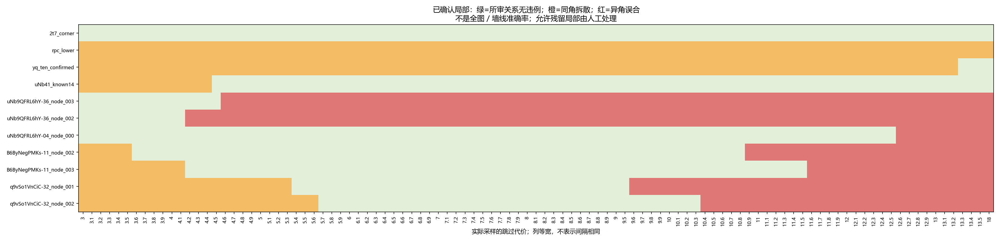

# 细化调参与少量人工辅助

2026-10-07。目标是多数墙线自动归类，少量疑难由人工处理；不要求全部开发案例自动无误。用户希望超过90%可自动正确归类，这是目标，本轮没有测得全库对应准确率。

## 实际推进

- 10张开发图、155份现有作答：先9—13.5按0.5采样，再在分组变化的区间按0.1加密；较好结果在低值端，连续扩展至6、3，所有新增变化区间也按0.1细化。含18参照，共103个实际采样值、1030状态。3处错误多于较好区间，本轮停止外扩。
- 六张未参与本轮选参的图片来自六个开发案例之外的建筑，87份作答，比较6／9／13.5，共18状态。名单在检查前按人数与原始点对数量固定，不按GT或实验效果筛图；都是已有研究图片，不称全新盲测。
- 本次在旧450个开发状态上增加540状态；六图18个检查状态保持原结果，没有重跑或用于调整参数。随后补齐11.1—11.4的40状态，累计1030个开发状态及18个检查状态。原始来源、全池MV50、位置中位数及环序处理不变。

## 找到了哪些切换位置

下表只描述相邻**已采样值**之间的变化，不声称这些数就是精确临界点。

| 已确认局部 | 较小值 | 较大值 |
|---|---|---|
| q9-32 第一处转折 | 9.5仍分开 | 9.6开始误合 |
| q9-32 第二处转折 | 10.3仍分开 | 10.4开始误合 |
| B6-11 第一处停止点 | 10.8仍分开 | 10.9开始误合 |
| B6-11 第二处停止点 | 11.5仍分开 | 11.6开始误合 |
| uNb-04 前后两角 | 12.5仍分开 | 12.6开始误合 |
| yq-25 遮挡角已审来源 | 13.2仍被拆散 | 13.3归到同组 |

在已采样的6—9.5范围，11个明确人审局部中4个仍有问题：rPc一处同角拆散、yq一处同角拆散、uNb-36两处前后误合。13.5下是8个局部有问题。**4/11不是错误墙线比例**：这些是特意选出的疑难局部，两个局部还可能属于同一次空间范围选择。它只帮助比较已知问题需要处理多少处。

2t7三份、41十四份明确同角在这些参数下保持同组。jtc暂定同角、新增rPc第一份A解释分别列示，不参与上表硬计数；第二份rPc可能表达梳妆台，允许保持人工未定，不要求算法替人工给出确定答案。

## 试用选择：9保留候选，不是唯一最优

**补完低值端后，9仍可作为试用代表，13.5保留默认和对照。** 9已能自动重现uNb-04、B6-11、q9-32的人工辅助成员及中心，且位于本轮较好采样范围内、离9.5—9.6的已知转换有余量。这是实用候选，不是证明9为唯一最优值。

在9这一候选下，yq和uNb-36仍需人工介入；rPc明确拆散也如实计入。它们不再作为否决整个候选参数的硬条件。暂不增加新的对应算法，先看这个候选配合少量人工能否覆盖大多数情况。

## 低值端补扫：新增发现与停止依据

| 设置 | 同角拆散案例 | 异角误合案例 | 有问题的明确局部总数 |
|---|---:|---:|---:|
| 3 | 7 | 0 | 7 |
| 4.1 | 6 | 0 | 6 |
| 4.5 | 4 | 1 | 5 |
| 5.6 | 3 | 2 | 5 |
| 5.7、6、9、9.5 | 2 | 2 | 4 |
| 13.5 | 1 | 7 | 8 |

最低局部案例错误数为4，出现在5.7—9.0内全部0.1采样值以及9.5。9.0—9.5原粗扫端点全分区相同，按约定没有再加密；因此不能声称已证明这段连续区间内没有变化。下界3处为7，已不满足继续外扩条件；不据此宣称3以下绝无更好值或全局最优。

**uNb-36不是只能人工拆分。** 3—4.1的全部已采样结果均自动产生六个保留节点，其成员和中心与既有人审辅助结果完全相同。4.2开始左侧误合，4.6开始右侧也误合，见[节点对照](lower_edge_assisted_comparison.json)。这里只验证节点对应与位置，不升级为顺序或三维几何认证。

与此同时，41的14份已确认同角直到4.5才保持同组；B6两处分别在3.6、4.2消除拆散；q9两处分别在5.4、5.7消除拆散。以上均为相邻已采样值的切换界限。**uNb-36所需较小代价与q9所需较大代价存在冲突，单一全局参数在这些已审关系上没有全部通过。** yq仍要到13.3才合回已审同角，却会带来其它误合。

局部错误数并列不代表完整分组或位置完全相同：5.7—9之间，rPc、yq、41、q9、jtc仍有其它成员变化。这些未逐一审核，不能靠4个案例的平坦计数决定全图最优。先保留9试用；接下来比较较好区间代表值在更多图片上的差异，仅把影响身份／保留节点的疑难变化交给人工。是否值得做局部自适应，由这些差异决定，不立即增加一个复杂选择器。

## 9.5—13完整0.1网格补充

本段共36档×10图＝360状态，其中320状态已有，本次补算11.1、11.2、11.3、11.4共40状态。此前11与11.5分组相同，按变化区间规则没有细化；本次完整检查确认十图在11—11.5每个0.1采样点的全分区均相同。人员池、全池MV50、位置中位数及人审口径固定。[逐档表](upper_range_scores.csv)

| 已采样参数范围（0.1步长） | 存在问题的明确局部数 | 相对上一段的变化 |
|---|---:|---|
| 9.5 | 4 | rPc、yq拆散；uNb-36两处误合 |
| 9.6—10.3 | 5 | q9第一处新增误合 |
| 10.4—10.8 | 6 | q9第二处新增误合 |
| 10.9—11.5 | 7 | B6第一处新增误合 |
| 11.6—12.5 | 8 | B6第二处新增误合 |
| 12.6—13.0 | 9 | uNb-04新增误合 |

本段所有设置下，rPc和yq明确同角的拆散仍在；没有已审同角修复抵消新增误合。yq要到范围外的13.3才合回，原参照结果保留。由此，本开发面板的已审关系不支持把全局试用参数从9提高至10—13；这不宣称较大参数对所有未审墙线都无益。更大的代价鼓励匹配更多观察，增加的支持人数可能来自误合，不能凭票变多判为改进。

## 六张未参与选参图片

| 图片 | 人数／原始点对数范围 | 三档结果 | 原异常提示 | 完整图 |
|---|---|---|---|---|
| 7y-04 | 24人／4对 | 分区和融合坐标相同 | 0 | [查看](check/7y3sRwLe3Va-04_comparison.png) |
| S9-06 | 10人／4对 | 相同 | 0 | [查看](check/S9hNv5qa7GM-06_comparison.png) |
| VFua-07 | 18人／4—12对 | 相同 | 1处相邻提示 | [查看](check/VFuaQ6m2Qom-07_comparison.png) |
| wc2-26 | 6人／5—10对 | 相同 | 1处相邻提示 | [查看](check/wc2JMjhGNzB-26_comparison.png) |
| X7-13 | 24人／4对 | 相同 | 0 | [查看](check/X7HyMhZNoso-13_comparison.png) |
| pa4-14 | 5人／4—9对 | 成员与坐标变化 | 0 | [查看](check/pa4otMbVnkk-14_comparison.png) |

六张完整图均已查看。7y／S9／X7的原作答均四对，融合对应四处主要转折，图上未见明显跨角混合；这不是逐份来源身份认证。VFua／wc2有较多细节和不同作答范围，单凭完整图不能把12／9节点或异常提示判成错误。

pa4-14在9下将R02041的两对观察分别从5人组拆为4＋1，两个4/5仍达票，但定位来源改变；原相邻提示没有报警。用户看[两处来源](check/pa4_sources.png)后先对位置1不确定，随后结合位置2判断其范围截止在柜子前，两处均属于不同停止／转折。采用最终范围判断并保留原话，见[人审](check/user_review.json)。

按这一新判断作辅助重算，9°的全部保留成员及中心与辅助结果完全一致，见[验证](check/review_effect.json)。两份1/5来源保留，只是未达3票，不因质量意见删除。**这是一个未参与本轮选参的新局部正结果**，不是整图完全正确认证。旧13.5此处误合但没有报警，也说明未报警不等于自动正确。没有用这次反馈反向改参数。

## 接下来怎样接近90%的目标

继续用9试用及少量人工纠正，不再以rPc第二份必须定性为前提。人工工作记录区分检查与实际修改；墙线成功率需要在核查过的墙线单元上统计，并检查没有报警的部分。当前只给局部错误数和六图观察，不把几何可用、参数不变或未报警包装成90%。

pa4两处问题已回答，没有新的待答题。下一步使用9作为自动试用候选，把yq／uNb-36／rPc的已知局部保留为人工辅助，逐步记录“直接接受／需局部修正／仍不确定”的实际工作量。已确认问题复用已有判断，不重问yq／B6／q9，不要求重新认证全部图。只对反复影响普通图片的失败考虑新的对应机制。

## 数据、复算与验证

- [采样计划](PLAN.json)、[实际参数](refinement.json)、[各档计数](scores.csv)、[来源关系](relations.json)、[字段说明](field_contract.json)。同一图的不同参数不是独立样本。
- `python -c "from tools.thesis_main.analysis.correspondence_gap_20261007 import fine_run,fine_figures,verify_fine_scan; fine_run(); fine_figures(); print(verify_fine_scan())"`。
- 相关18项测试通过，包含暂定目标不成为硬错误的新增检查。另以`verify_fine_scan()`检查1030开发状态的覆盖、变化区间细化、局部计数和停止条件。未运行无关全库测试。
- 未修改生产默认、原始作答、GT或资格规则；代码复用既有分析文件，无新依赖。图件是交付结果，没有遗留临时截图。
