# 全量参数对照图

## UwV83HsGsw3-10

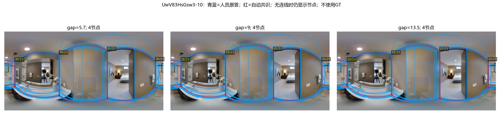

## uNb9QFRL6hY-47

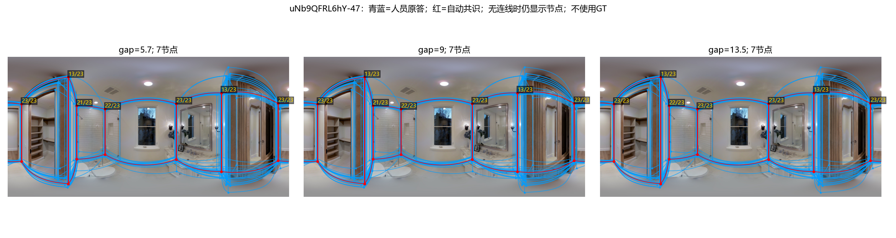

## VFuaQ6m2Qom-07

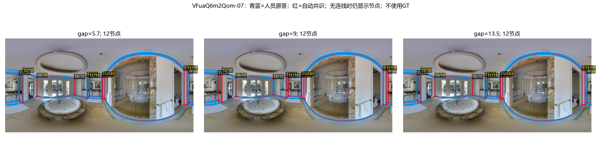

## uNb9QFRL6hY-08

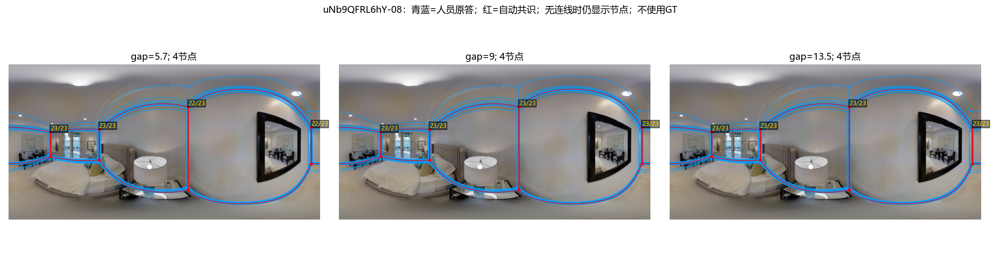

## wc2JMjhGNzB-60

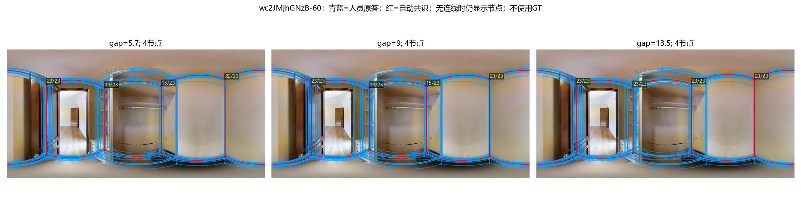

## e9zR4mvMWw7-19

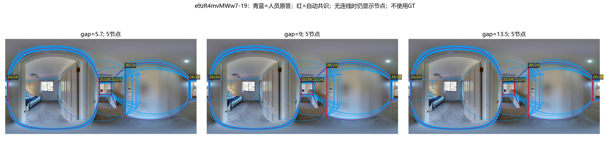

## yqstnuAEVhm-32

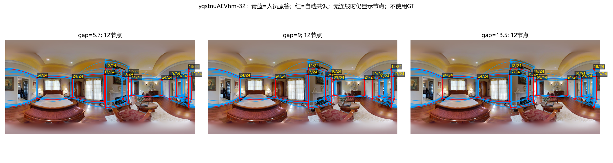

## yqstnuAEVhm-31

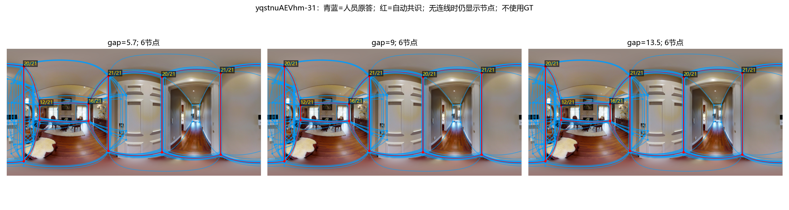

## wc2JMjhGNzB-53

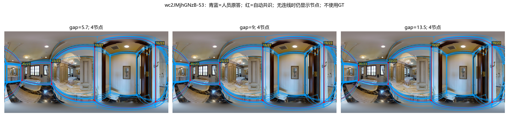

## UwV83HsGsw3-09

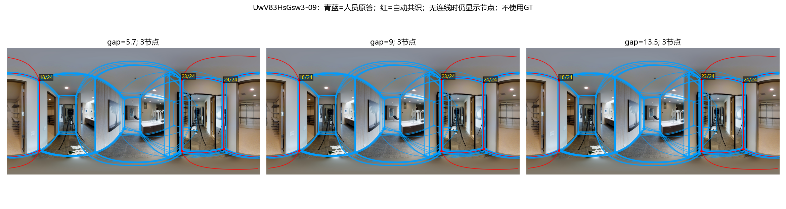

## q9vSo1VnCiC-23

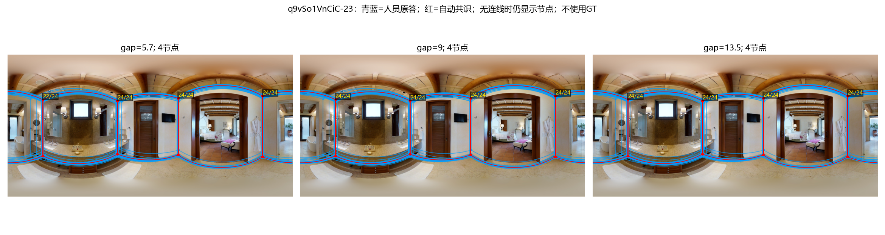

## rPc6DW4iMge-01

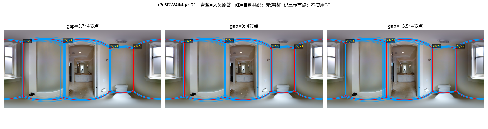

## 2t7WUuJeko7-09

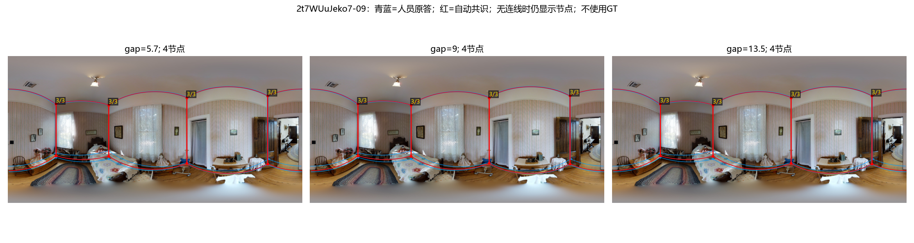

## 7y3sRwLe3Va-03

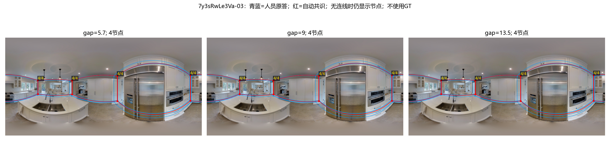

## B6ByNegPMKs-18

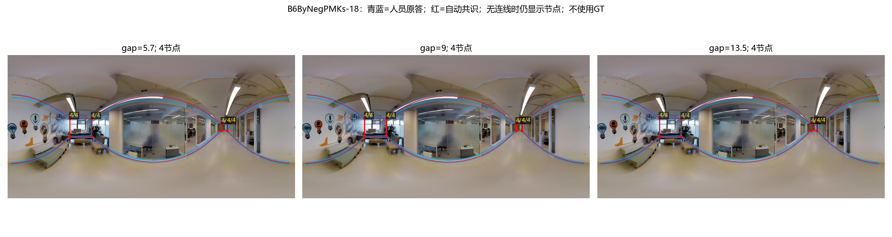

## S9hNv5qa7GM-06

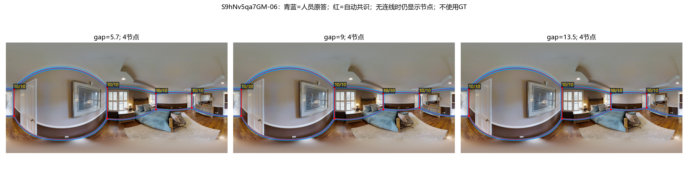
