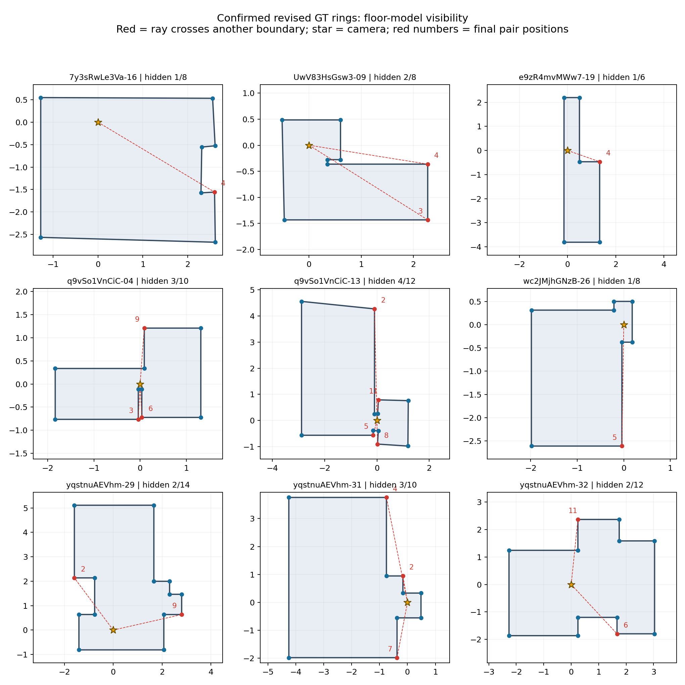

# GT环序与结构自遮挡核验

2026-10-09。用户要求检查修改并排好序的GT，排除仅改变环起点的情况；同时明确研究重点是数据与人员不确定性的区分，不以人员主观难度判断作为图片条件的定义。本次计算不使用人员作答、主观难度档或融合结果。

## 输入与判断

从统一包`load_current_bundle()`读取259份原GT及30份人工修订GT，使用`points_1024x512`中的最终上下点对环序。30份修订GT均已有人工环确认；259份原GT沿用声明源环，不能称为本轮逐份人工认证。30份中28份属于研究图，另2份为仅GT参考图。

- 任意环起点允许；完整反向单列但不当作局部交错。相同x另列，不强制打破平局。x比较容差为1e-6像素，仅处理数值精度，不是难度阈值。
- 例如`702.49,842.93,197.17,307.08`为循环递增；不因842.93→197.17跨接缝就判为回退。
- “发生过改序”不等于“最终环不同于x循环排序”。源数组可能按点的创建次序储存；本次直接检查最终物理环，而非点击历史。
- 以连续1024×512坐标、相机高度h=1恢复声明底面；检查多边形有效且相机严格在内部。289份均通过，不做x排序修补或几何修补。
- 相机到各底面顶点的线段，若在到达顶点之前横穿另一条非相邻边的内部，记录该点为`occluded_by_boundary`。擦角、沿墙与同射线情况另列。保存阻挡边、交点和距离比例，可逐点复核。
- 进一步用GT上端点恢复各墙角顶部高度。相机z=0、地面z=-1；对底面射线交点的距离比例t及该处墙顶H，目标竖直角线上z≤H/t的部分被该墙阻挡。合并各阻挡墙的高度区间，解析检查从下端到上端整条角线，不仅抽查几个高度。

## 实算结果

|查看口径|图／版本数|循环递增|真正局部回退|含横穿遮挡顶点|
|---|---:|---:|---:|---:|
|原GT|259|156|103|103|
|人工修订GT|30|21|9|9|
|研究259图：有修订取修订，否则取原GT|259|166|93|93|
|仅GT参考图，单列|2|1|1|1|

“修订优先”只是本次查看口径，不更改项目的正式GT评价政策。两个版本及对应关系完整保留。研究图中10张从原GT的局部回退变成修订GT的循环递增，说明指标依赖目标范围、细节及参考版本；没有把这种变化宣称为真实房间改变。

原GT中156份循环递增的起点都不是最小x；修订优先研究视图中也有146份这种情况，均未误计为回退。同x退化关系另列，不将同射线接触本身计为横穿遮挡。7y3sRwLe3Va-08的点对2／3同x，点对2为退化接触，整图没有横穿遮挡；uNb9QFRL6hY-83的点对6／7同x、点对6为退化接触，但点对3另有真实横穿阻挡，整图仍计入93图。此前“不加入93图”的整图措辞不准确，本次仅更正说明，数值、源GT及判定代码未改。

全高度检查也得到原GT103图、修订GT9图、修订优先研究93图。本次每个横穿遮挡的底面顶点，其对应角线在GT实心墙模型中均从底到顶被遮挡，没有仅下部遮挡的顶点。下表的编号均为最终环中的点对位置，从1开始，不是源点编号。`audit.json`保留到源点对的零基映射。角度是沿环反向走过的方位角总和，仅为回退幅度诊断，不是遮挡面积或难度总分。

|修订GT图片|点对数|GT实心墙模型中全高度被遮挡的点对位置|回退边数|反向角度总和|
|---|---:|---|---:|---:|
|7y3sRwLe3Va-16（仅GT参考）|8|4|1|3.50°|
|UwV83HsGsw3-09|8|3、4|1|36.60°|
|e9zR4mvMWw7-19|6|4|1|24.12°|
|q9vSo1VnCiC-04|10|3、6、9|3|42.71°|
|q9vSo1VnCiC-13|12|2、5、8、11|4|34.07°|
|wc2JMjhGNzB-26|8|5|1|5.15°|
|yqstnuAEVhm-29|14|2、9|2|21.36°|
|yqstnuAEVhm-31|10|2、4、7|3|66.71°|
|yqstnuAEVhm-32|12|6、11|2|16.65°|

例如Uw-09只有一条回退边，但有两个被挡的底面顶点，因此不能用交换次数或回退边数代替遮挡角点数。



## 几何证据支持什么

这批实际结果支持：正确环序相对x循环排序出现局部回退，是结构自遮挡的有效线索；本次射线核验进一步给出了具体遮挡点和挡住它的边。在边界确为不透明竖直墙且高度覆盖视线的条件下，它有直接物理含义。

本次已检查GT上下端点所定义角线的全高度遮挡，但未完成门洞／玻璃材质或全部原图可见性审核。“整条角线被完全遮挡”在本GT实心不透明墙模型中成立；实际玻璃、开口或错误的目标边界可破坏此前提。家具遮挡、弱纹理与照明也不在此指标中；循环单调并不证明无这些困难。

[Shape-Net（CVPR Workshop 2023）第4.4节](https://arxiv.org/html/2304.12624v1#S4.SS4)将至少一个GT角点不可见定义为其遮挡子集条件，并在Matterport测试集中选出132图。它支持按结构可见性作场景条件的做法，但不是本次计数或人类难度效度的验证，也没有证明增人曲线必然变慢。

## 研究定位与避免循环论证

用户文件《与导师交流.txt》最后“导师提议的尝试方向”第1、2、5点，以及本次直接澄清，指向人员质量参照、共识人数过程和图片条件的分离研究。旧主观三档校准保留为历史探索，后续不将更贴合该标签作为主要优化目标。本轮只建立几何条件，未拟合人员／图片不确定性模型。

可先固定图片条件X：GT点对数、是否结构自遮挡、被遮挡底面顶点数／比例；非正交和表达适配另行可靠测量。随后用人员质量与人员组合控制下的实际作答、融合人数过程观察响应Y。X不由同一批Y倒推，能够避免“先用人员分歧定义难，再证明难图分歧大”的循环。

GT参与几何特征和质量评价本身并不等于循环论证；但目标版本必须预先固定，GT修订若曾参考人员作答，不能宣称整个参考制作过程独立。本次没有重新审计所有GT修订来源。93图是几何特征计数，不是数据不确定性的百分比，不是纯数据噪声的估计。

现有24人×10图的共同面板与行列描述分解可继续复用。GT偏差、人员×图片交互与一次作答变化不能直接分配为纯图片或纯人员噪声；困难组、非困难组及全体结果须各自保留，不以排除难图产生的改善代替噪声分离。

## 复算与验证

```powershell
D:\anaconda\python.exe -m tools.thesis_main.analysis.gt_order_visibility_20261009
D:\anaconda\python.exe -m pytest tests/test_gt_order_visibility_20261009.py -q -p no:cacheprovider
```

8项关键测试通过：环起点、整体反向、真正回退、相同x、凸与凹布局射线、无效／外部相机、退化接触，以及底面被挡但高处可越过矮墙的反例。另用Shapely线段减多边形的独立方法核验1858个非退化顶点，底面遮挡判断零不一致，记录于`verification.json`。图已视觉检查；没有临时截图。

- `all_gt.csv`、`audit.json`：全部289份GT版本，含x序列、映射、逐点遮挡证据。
- `revised_gt.csv`：30份修订GT。
- `research_revised_preferred.csv`：259张研究图的修订优先查看表。
- `summary.json`、`field_contract.json`：计数、坐标／索引及解释合同。

原GT、人工GT、源顺序、人员标签、融合规则和规范合同未改；未运行模型推理、人员表现或人数曲线分析。索引与项目地图登记本审计，现有代理评分入口说明最新研究定位。
