# 25张分歧图逐张复核（v2）

2026-10-10。已实际逐张查看25张既有照片＋GT卡片。本轮修订的是Codex视觉建议，不是用户最终裁决；原工作分类、GT、人员标注、第三方原始审核均保留。复核已知此前建议和第三方意见，不是盲审。卡片显示人员底面对照，但未用人员一致程度、误差或融合结果定难度。

**结果：10张中等改简单；4张保留中等、4张保留困难；7张转待复核。** 全259图当前建议：115简单、18中等、24困难、60待复核、42特殊单列。旧105/30/29/53/42为v1历史快照。

## 判读约束

逐张先检查：必要墙角有哪些图像定位线索？竖线被挡后，上角、相邻墙顶线、底边是否仍能约束位置？是否必须恢复图像没有提供定位证据的空间分支？目标/参考对应能否确认？GT红线是待评价目标，不能拿它本身当图像定位证据；柜体、门扇与帘边也不能自动当墙边。

这次细化了V的操作解释，属于看过分歧后的探索性修订，不伪称预注册。N/H阈值未变：没有采用H=1自动简单、四角自动简单或多数评分决定档位。limited指剩余定位线索足够，不能机械按被挡竖线长度决定；substantial要求指出哪处必要定位仍缺线索。保持全部GT分支时，主房间清楚并不消除分支负担；目标不明先待核。

简单判读只支持粗定位负担较低，不宣称被挡底点可以无误恢复。精确坐标仍可能不确定。

## 需要用户优先确认的7张

jtcxE69GiFV-05、pa4otMbVnkk-14、uNb9QFRL6hY-44、uNb9QFRL6hY-55、uNb9QFRL6hY-68、uNb9QFRL6hY-81、wc2JMjhGNzB-26。具体问题见各图。

### S9hNv5qa7GM-04：中等 → 简单

第三方：简单；范围意见：目标基本一致。N=4，H=0，V=limited。

点3/4的竖线被高柜挡住，但柜上方墙顶转折仍能对应；点1/2上角清楚，底端可沿墙面关系补足。没有因柜体增加额外隐藏转折。

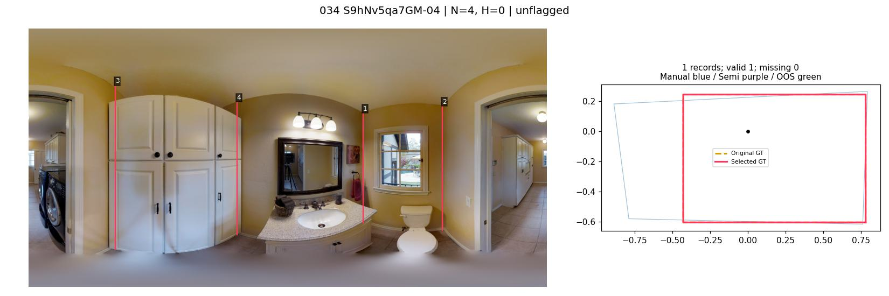

### S9hNv5qa7GM-18：中等 → 中等

第三方：简单；范围意见：目标基本一致。N=4，H=0，V=substantial。

点3/4上角清楚；点1邻高柜、点2邻打开门扇，上端与竖线证据同时受阻。四点数量少，但这两角位置仍需越过遮挡补全，不能仅凭矩形外观判简单。

**待确认：** 请核点1/2是否有我漏看的真实墙顶交点；柜边、门扇边不能直接当墙角。

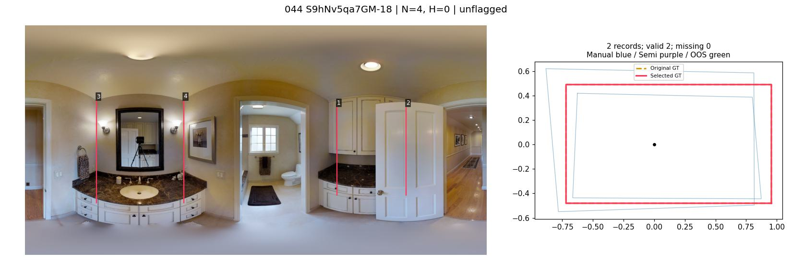

### jtcxE69GiFV-03：中等 → 中等

第三方：简单；范围意见：目标基本一致。N=4，H=0，V=substantial。

点1/4所在窗侧厚帘遮住竖线并干扰上方交点，下方又被帘和椅子挡住。能识别四边主体，但准确角点比直接延伸一条可见角线需要更多推断。

**待确认：** 请核帘后点1/4的上下位置是否有充分直接线索，而非默认帘边就是墙角。

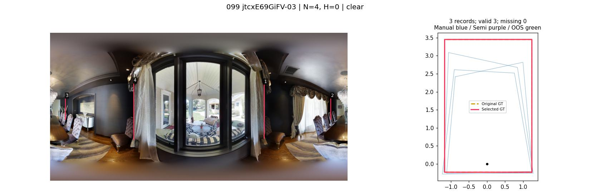

### jtcxE69GiFV-05：中等 → 待复核

第三方：简单；范围意见：目标基本一致。N=4，H=0，V=uncertain。

点1落在厚帘附近；点2落在床头板区域，点3/4与远端开口和镜面关系在本图中不够明确。不能把GT红线位置当作图像已提供的定位线索。

**待确认：** 请确认四个GT角对应真实墙角还是矩形化参考；确认后再区分简单或中等。

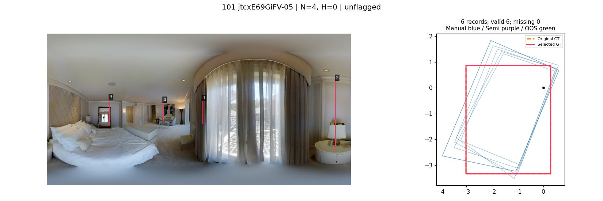

### jtcxE69GiFV-10：中等 → 简单

第三方：简单；范围意见：目标基本一致。N=4，H=0，V=limited。

点1/4竖线被深色柜遮挡，但柜顶上方墙顶转折可辨，点2/3及底部邻墙关系清楚。主要是下部补全，并无新增拓扑选择。

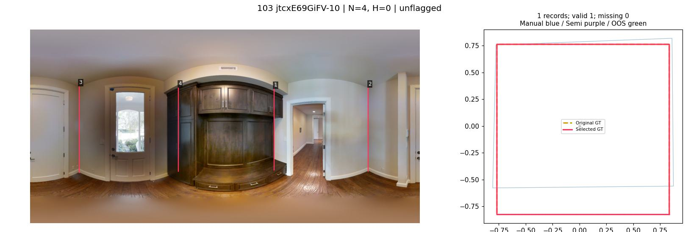

### pa4otMbVnkk-14：中等 → 待复核

第三方：简单；范围意见：范围明显不同。N=4，H=0，V=uncertain。

相机附近大门洞连通两侧区域，点1/2邻厨房柜，点3/4在另一侧；四角参考跨开口的目标含义需先明确。不能只按厨房家具遮挡给中等，也不能直接按四点给简单。

**待确认：** 请确认应标厨房、相机所在区域还是跨门合并空间，并核是否属于门洞交界；未直接新增特殊标签。

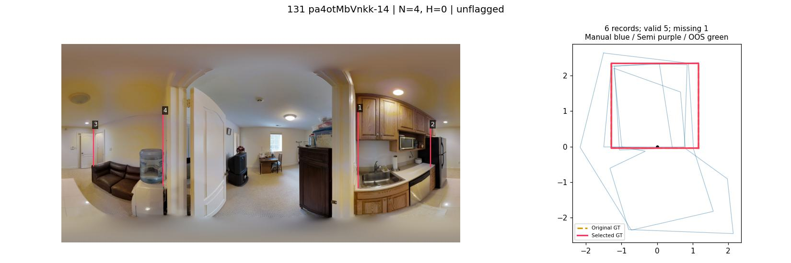

### q9vSo1VnCiC-11：困难 → 困难

第三方：中等；范围意见：目标基本一致。N=10，H=2，V=substantial。

主体墙顶清楚，但点1至7附近包含入口墙垛及GT延伸分支；入口可见不等于背向端点与深度可见。按当前十点目标恢复该部分仍需要结构补全。

**待确认：** 若任务允许停在入口，须先修订目标；不能在保留十点GT时按主体房间降档。

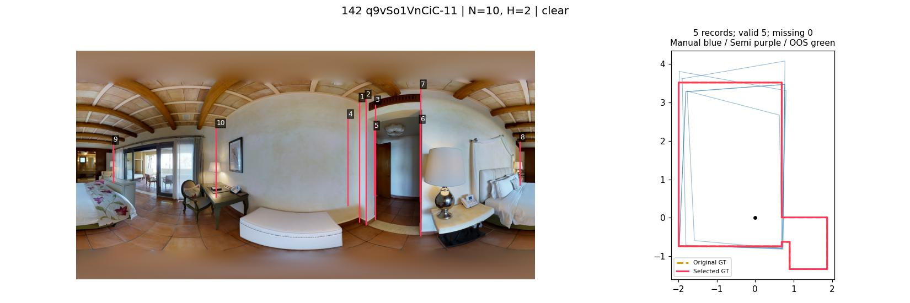

### q9vSo1VnCiC-12：困难 → 困难

第三方：中等；范围意见：目标基本一致。N=8，H=3，V=substantial。

点1至6分别集中在两侧凹入/开口附近，主体床区清楚，但所选八点目标包含多个背向转折；无法仅凭无遮挡主体读出完整分支。

**待确认：** 请核这些凹入是否属于必须表达的空间；在当前目标下保留困难。

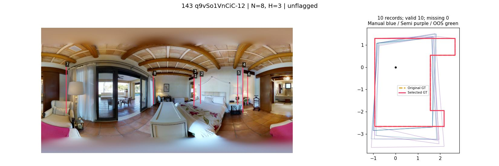

### uNb9QFRL6hY-07：中等 → 简单

第三方：简单；范围意见：目标基本一致。N=4，H=0，V=limited。

书柜覆盖竖线，但两端柜上方与邻墙的顶边仍提供四角位置，非柜面轮廓替代墙角；桌椅主要影响底端，拓扑明确。

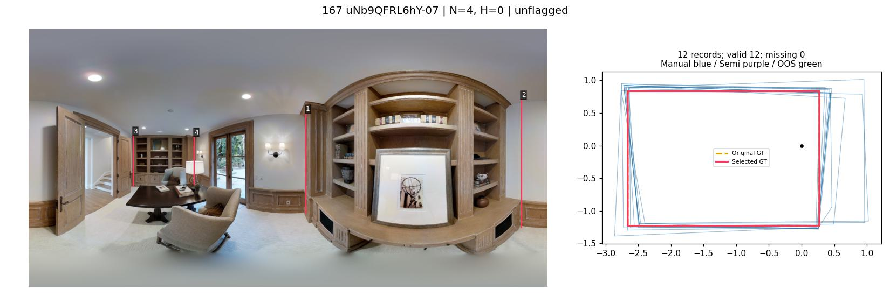

### uNb9QFRL6hY-14：中等 → 中等

第三方：简单；范围意见：目标基本一致。N=4，H=0，V=substantial。

点3/4的墙顶转折可辨；点1/2靠打开的高门扇，上端关键部分也被遮住，相比同房间其它视角更依赖补全。不能用其它视角替本张提供线索。

**待确认：** 请核门扇上方是否仍能可靠定出点1/2的真实墙角；若可，应再降简单。

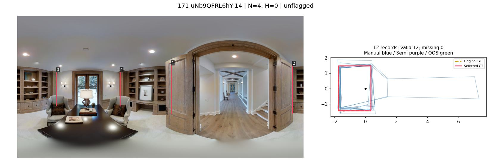

### uNb9QFRL6hY-44：困难 → 待复核

第三方：简单；范围意见：目标基本一致。N=6，H=1，V=uncertain。

主体卧室上角清楚；右端点2/3/4密集，GT伸出一段窄分支。当前照片不能确认分支终止边及隐藏角的定位约束；不能把主体简单当作全GT简单。

**待确认：** 请确认窄入口分支是否必须纳入，及点2/3/4对应哪几面真实墙；若必须且缺线索则困难。

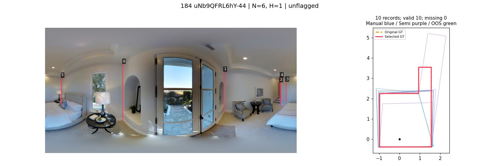

### uNb9QFRL6hY-48：中等 → 简单

第三方：简单；范围意见：目标基本一致。N=4，H=0，V=limited。

点1至4顶端附近有墙顶转折与邻墙线索，书柜、台灯主要挡住竖线或下端。四点目标无需借用别张图便可粗定位。

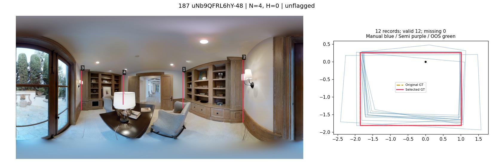

### uNb9QFRL6hY-55：困难 → 待复核

第三方：简单；范围意见：目标基本一致。N=6，H=1，V=uncertain。

主体四角区域明晰，左端点3/4/5的入口分支密集，GT的延伸深度不能从主卧的清楚程度推出。照片不足以确认隐藏终止边。

**待确认：** 请核点3/4/5及停止边；不能因H只有1自动归简单。

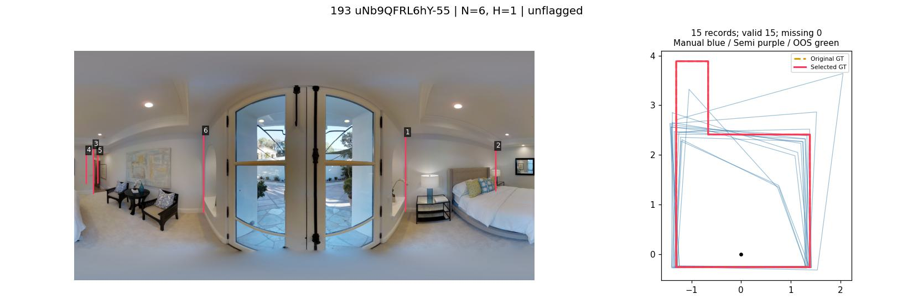

### uNb9QFRL6hY-56：中等 → 简单

第三方：简单；范围意见：目标基本一致。N=4，H=0，V=limited。

衣帽架遮挡竖线，但点1/2的上墙角、点3上方邻墙和点4门框上缘附近的墙顶关系仍可辨；空层架也留下墙面线索。四点定位不等于猜柜后新空间。

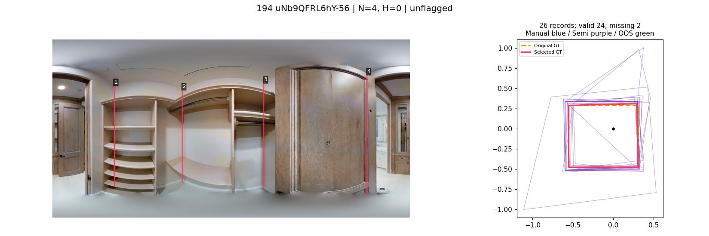

### uNb9QFRL6hY-68：困难 → 待复核

第三方：简单；范围意见：目标基本一致。N=6，H=1，V=uncertain。

床区、窗侧主要转折清楚；左边点3/4/5对应窄入口，隐藏分支终止位置缺少可辨依据。入口局部图像过窄，不能证实完整六点容易定位。

**待确认：** 请确认入口分支目标和隐藏端点，不按主房间视觉印象直接降档。

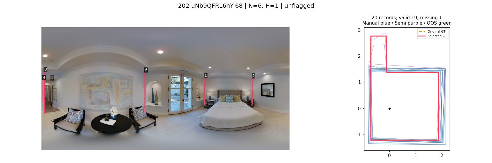

### uNb9QFRL6hY-72：中等 → 简单

第三方：简单；范围意见：目标基本一致。N=4，H=0，V=limited。

近柜点1/2及远端点3/4上方仍有顶边转折与邻墙约束；柜体高不等于定位线索全失，底端虽遮挡但主要结构可恢复。

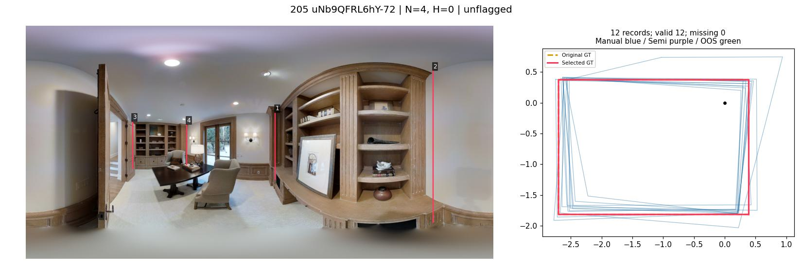

### uNb9QFRL6hY-78：中等 → 简单

第三方：简单；范围意见：目标基本一致。N=4，H=0，V=limited。

近侧两柜遮住竖线，点2/3上方墙顶转折仍在，远端点1/4也可对应；无需选择新的连接关系。

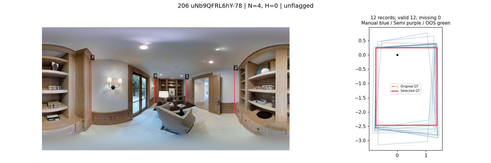

### uNb9QFRL6hY-79：中等 → 简单

第三方：简单；范围意见：目标基本一致。N=4，H=0，V=limited。

点2/3柜体旁的上墙角与远端点1/4上缘可辨，竖线受柜遮挡但四角方向与高度有图像约束。粗分类不应仅因高柜升档。

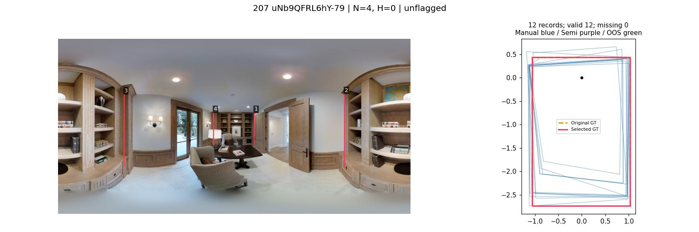

### uNb9QFRL6hY-81：困难 → 待复核

第三方：简单；范围意见：目标基本一致。N=6，H=1，V=uncertain。

近处壁龛外主墙角清楚，远端点3/4/5几乎重叠；GT入口分支的隐藏终止边不能据此直接定位。主体简单不构成完整六点目标简单的证据。

**待确认：** 请确认远端分支的标注必要性和停止边；保留待核而非默认接受简单。

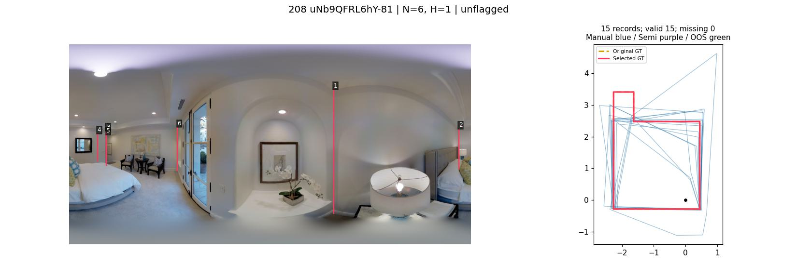

### uNb9QFRL6hY-87：中等 → 简单

第三方：简单；范围意见：目标基本一致。N=4，H=0，V=limited。

点1/2窗侧及点3/4远端书柜上方保留墙顶线索；灯、椅子主要遮下端，四边目标清楚，没有必须猜测的额外分支。

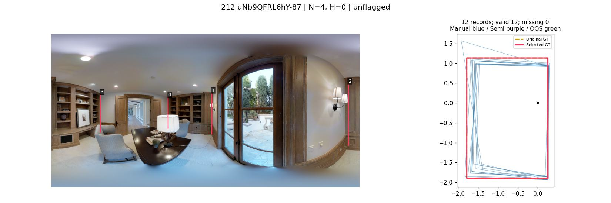

### wc2JMjhGNzB-22：困难 → 困难

第三方：中等；范围意见：目标基本一致。N=8，H=1，V=substantial。

远端入口点5至8密集，当前八点GT包含向外延伸的分支，入口两侧可见仍不足以定位背向角与分支底端。主体卧室清楚不能替代完整目标。

**待确认：** 若允许在门口停止需先确认目标变化；当前八点目标下不采纳中等。

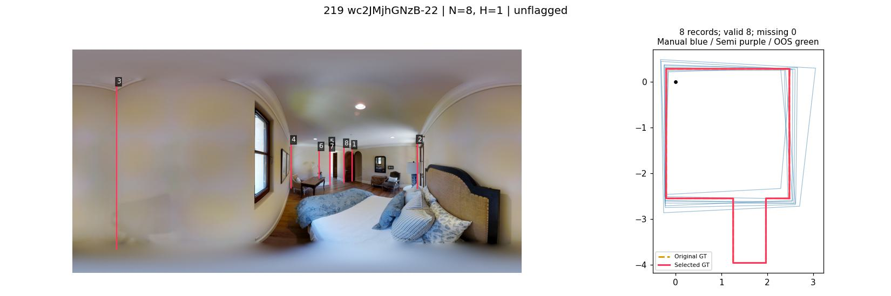

### wc2JMjhGNzB-26：困难 → 待复核

第三方：中等；范围意见：范围明显不同。N=8，H=1，V=uncertain。

相机邻浴室与走道开口，GT停止位置、淋浴玻璃和柜侧转折的含义交织。实心墙H可能不能充分解释玻璃；范围/表示适用性应先核，不能直接用H判困难。

**待确认：** 请确认走道是否纳入、玻璃边是否算墙、相机是否属于门洞交界；特殊属性暂不擅改。

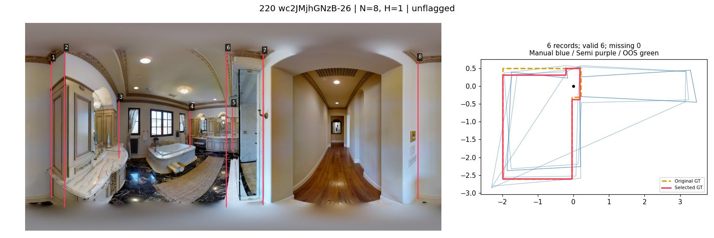

### wc2JMjhGNzB-29：困难 → 困难

第三方：中等；范围意见：范围明显不同。N=8，H=2，V=substantial。

点1/7/8邻桌侧与入口集中，八点GT仍纳入背向窄分支，照片可见门口但未给出分支全部定位证据。审核者另标范围不同，这不自动取消固定GT中的隐藏负担。

**待确认：** 请另核目标范围；本档只针对当前完整GT，若目标改为主卧须重评。

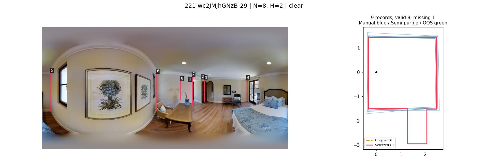

### yqstnuAEVhm-07：中等 → 简单

第三方：简单；范围意见：目标基本一致。N=4，H=0，V=limited。

窗帘遮部分竖线，但四处上方檐线/墙顶转折及窗侧邻墙仍可对应；桌柜遮底端。四点主轮廓有足够粗定位线索，无需因帘面积大升档。

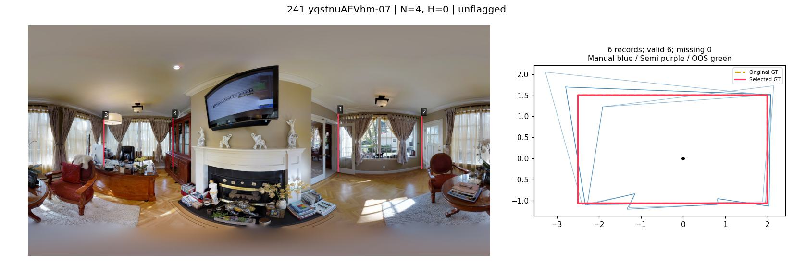

### zsNo4HB9uLZ-09：中等 → 中等

第三方：简单；范围意见：目标基本一致。N=4，H=0，V=substantial。

点2/3上部清楚，点1落在高柜内部投影处、点4邻开门扇，上角与下角不能都直接读取。仅沿柜前缘会把柜深当成墙位置，保留补全负担。

**待确认：** 请核点1真实墙角是否能由柜上方独立定位；当前不直接认可简单。

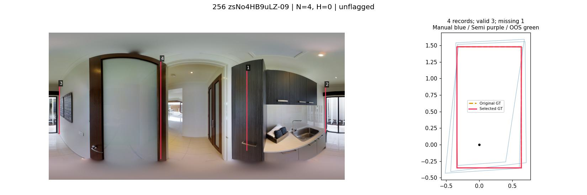

## 使用与验证

`adjudication.json`绑定25张image_id/gt_object_id及上轮建议，构建脚本在原视觉记录之上应用本轮建议并保留旧记录。主页面增加25张分歧筛选，展示前后建议与第三方意见。v2使用新草稿键，保留v1键但不自动迁移，避免旧“认可建议”被解释成认可新建议。尚未改动旧工作表与正式分析分层。

其它234图未按此次细化标准重审，因此不能宣称全库已经统一重标。八张保留原档的分歧仍可由用户复核；保留并非认证GT或认定第三方错误。
