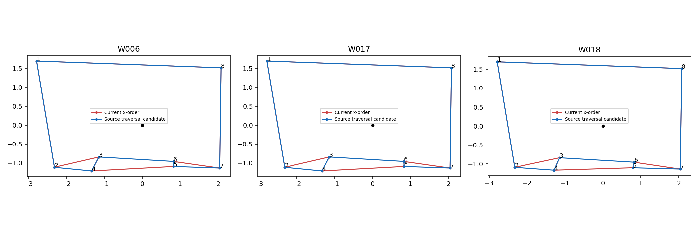

# 用户复审接收：范围待裁定清单

**顺序回执已采用（2026-10-10）：** 用户返回的三份顺序均为1→2→4→3→6→5→7→8，已写入主数据preprocessed_source.json、research_tables.json与final_review确认环表。原始回执为confirmed_orders.json；排序台sources.json和原审核图保留发放快照，不改写为新输入。只改3份作答环序及其审核/几何状态，其余3438对象逐对象一致；坐标、点对、GT、人员资格和范围判断不变。主包基础确认数1298；应用既有14份质量审核层后有效确认数1312。下文“待确认/未写回”描述发放阶段历史状态，现以本段为准。历史融合、面积筛查和全量复核卡片未重算，后续分析须经load_current_bundle读取新环序，不拿旧输出当新结果。

已接收26条v2审核，原文件按字节保存在source_review.json，全部图片/GT/当时建议绑定核对一致。第三方143图审核与本次用户26图审核分别保存，不混作同一审核者。用户评分保留，但涉及范围的难度暂不采纳为固定分析分层。

按最新指示，yqstnuAEVhm-07暂时接受GT，不讨论壁炉取舍，已从范围清单移除。其3份八点对人员作答的排序另用工作台确认，不改变GT。

**当前11图：8张明确选择范围不同，另3张备注提示范围/局部边界差异。** 另有jtcxE69GiFV-05的GT错误意见、jtcxE69GiFV-10的疑似OOS，单独保存，未冒称已确认范围不同。

[逐图图片清单](scope_review.html) · [3份人员作答排序台](order_workbench/index.html) · [排序核查证据](order_audit.json)

## 待裁定表

|图片|用户范围选择|用户难度|原始备注|纳入原因|
|---|---|---|---|---|
|S9hNv5qa7GM-04|目标基本一致|简单|gt的范围肯呢个略有不同,有些人可能会标的里面一点.gt是把柜边、门扇边当墙角|局部边界取舍：柜边/门扇边与更内侧墙面|
|pa4otMbVnkk-14|未审|中等|这个是靠近门洞,所以出现了不同范围的标注,同时遮挡较多|备注明确指出靠近门洞导致不同范围|
|q9vSo1VnCiC-11|范围明显不同|简单|标注范围不同|范围选项明确不同|
|q9vSo1VnCiC-12|范围明显不同|简单|标注范围不同|范围选项明确不同|
|uNb9QFRL6hY-44|范围明显不同|简单|gt范围不同|范围选项明确不同|
|uNb9QFRL6hY-55|范围明显不同|简单|gt范围不同|范围选项明确不同|
|uNb9QFRL6hY-68|范围明显不同|简单|标注范围不同|范围选项明确不同|
|uNb9QFRL6hY-81|范围明显不同|简单|和gt的标注范围不同|范围选项明确不同|
|wc2JMjhGNzB-22|范围明显不同|简单|标注范围不同|范围选项明确不同|
|wc2JMjhGNzB-26|目标基本一致|困难|这图细节难,而且存在有标注者标注了不同的标注范围|总体基本一致，但备注指出部分人员标不同范围|
|wc2JMjhGNzB-29|范围明显不同|简单|gt范围不同|范围选项明确不同|

## 裁定后再做什么

每图先确认标注对象：纳入哪些相连空间、门口在哪里停止、柜面/墙面等采用哪条边界。记录目标文本和对应参考版本；原GT与原作答保留。确定后再重算N/H、复核必要定位线索，形成独立二次审查版本，并保留旧目标分层对照。未裁定前，主页面旧建议不作为这11图的最终结论。

## 机器筛查与论文表述

已有可复算筛查：同图片/条件/资格组至少3份，D=人员与GT底面对称差面积/GT面积，D≥0.30的份数至少一半，另看0.20/0.40敏感性。分母包含不可计算记录并报告上下界。当前11图中仅3图触发该0.30筛查；它是候选发现器，不是范围语义裁定器。小面积窄分支、局部边界差异、少样本会漏报；深度定位误差也会误报。

下一步候选方法（尚未实现/验证）：保留上述规则，增加局部边界距离或GT分支覆盖诊断，以及人员轮廓间的稳定空间模式；分别记录是否机器触发及触发原因。不在这11张上调到全命中后宣称泛化，应固定判据并在其它建筑/留出图核验。人员作答用于发现目标不一致，不进入图片难度的定义。

可如实写“规则驱动的几何筛查提出候选，结合图像证据人工裁定目标范围，再按固定结构与可见性标准分层”。本轮11图来源是用户审核，不能事后描述为机器独立自动筛出。

## 顺序核查

yqstnuAEVhm-07有三份八对点：W006/R01877、W017/R01653、W018/R02249，分别比GT多四对点。当前load_current_bundle()与页面输入一致，均default_unreviewed、ring_confirmed=false；在列出的本地改序回执中未找到这三对象的人工确认。不能由此断言用户在所有历史版本都没操作过。

当前点对x递增；原始点对遍历（统一上下后）对应当前一基点对号1,2,4,3,6,5,7,8，改变壁炉两端连接，并非仅环起点平移。两种底面都可能几何有效，不能用有效性认证顺序。该排列只是诊断对照，未写回。排序台初始仍用当前顺序，用户自行拖动并确认；不预填候选为已确认。

## 验证与边界

26条唯一绑定、11图队列、3份排序坐标与当前包一致已检查。GT、源导出、正式分类、旧排序台回执均未改。机器筛查补充算法尚未实现；等待目标裁定后开展二次难度复审。
