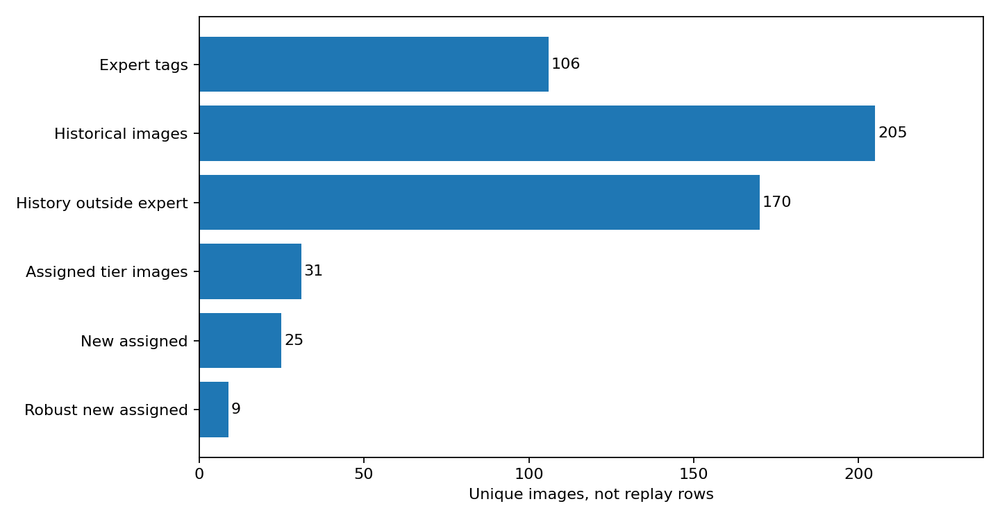
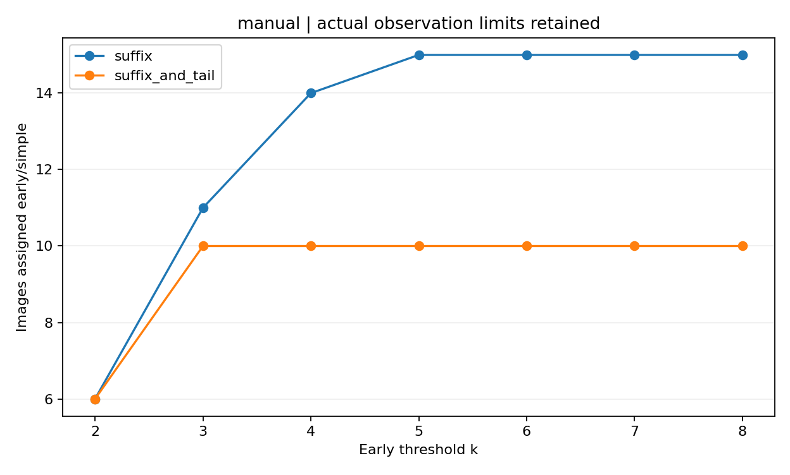
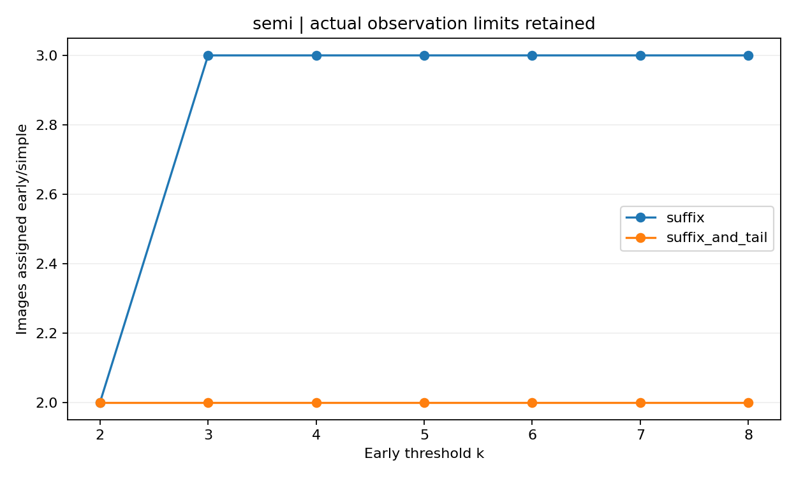
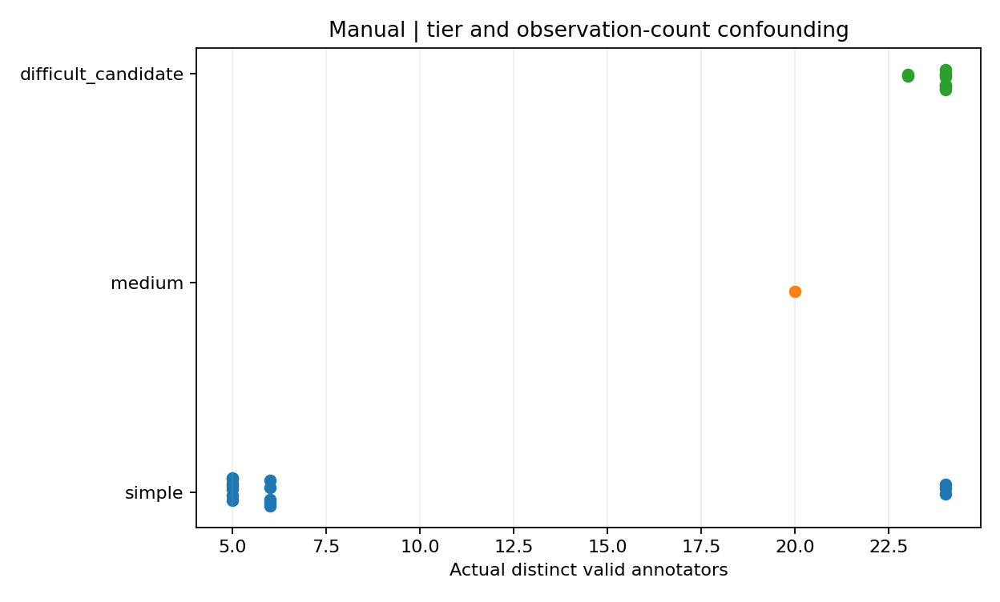
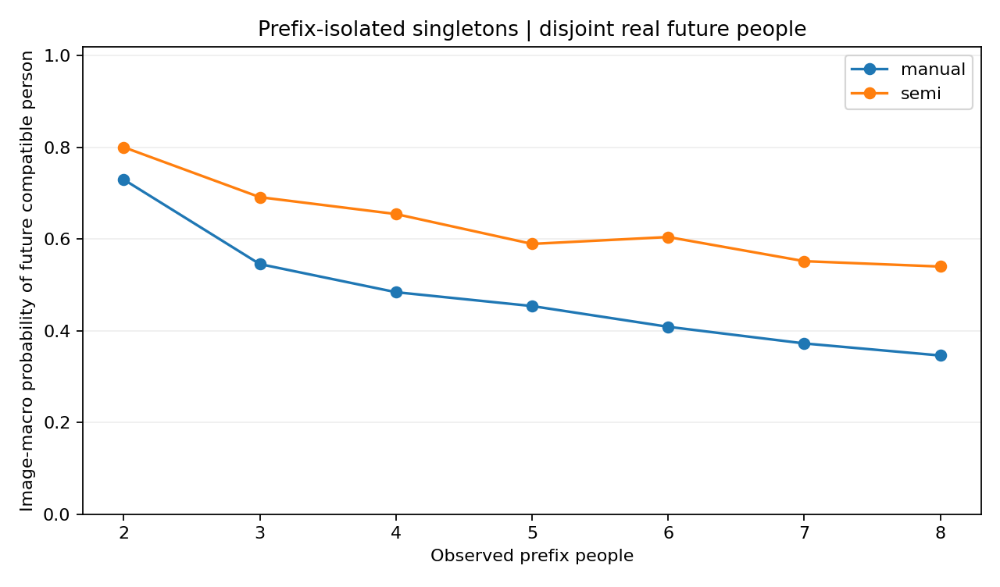
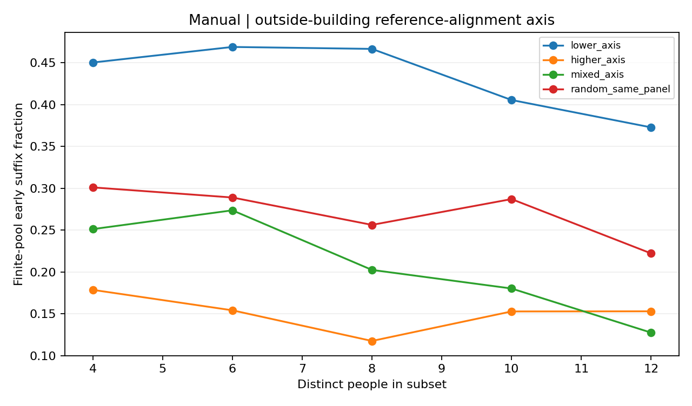

# 历史真实作答难度粗分类与图片特质：主空间研究续篇

输入基线：`13859d591acb1bac7790fb0762f2c53282f65748`。结果版本：`history_difficulty_20260915_v1/run_13859d59`。性质：在已经查看同批历史留出结果之后开展的后续探索；不是新的独立确认性试验。

## 1. 先回答真正扩展了多少图片

本轮实际完成三档派生、A—E数值分析和独立人工tag对照。历史几何作答覆盖**205张**，其中**170张**不在106张人工tag内；这是扩展的过程研究覆盖，不是新增同口径人工真值。

展示定义得到**31张**粗类，其中**25张**在106张之外，所以“人工tag或当前历史粗类”的并集是**131张**。在声明的敏感性家族中达到至少80%相同粗类的有**11张**，其中新增**9张**。这里的80%是定义一致性摘要，绝不是未来标注者的置信概率。

源表：`targets/coverage.json`、`targets/primary_with_robustness.csv`、`targets/robust_assigned_images.csv`。未能归类的图保留连续过程、人数、失败状态；没有强行变成困难。

## 2. 三类资料必须严格分开

旧实验difficulty及其同义难度分组不进入新目标、特征、分组或调参。原始文件保持不可变，但分析投影采用白名单。106张用户tag仅从确认的`latest_selection_record`命名空间取出，连同逐图及组级评论独立保存，绝不成为历史粗类的标签真值或图片预测特征。OOS按钮原因合并为统一`oos`方向，仍区分几何任务中的Scope回答和独立OOS规则任务。

| condition   |   responses |   images |   workers |   valid_responses |   valid_images |
|:------------|------------:|---------:|----------:|------------------:|---------------:|
| manual      |        1634 |      187 |        24 |              1620 |            187 |
| oos         |         216 |        9 |        24 |               212 |              9 |
| semi        |         538 |       43 |        24 |               532 |             43 |

人工、AI主空间描述、可见特质与物理同房关系分别保存。AI关键词构成的主空间功能不是用户逐图精确复核的空间掩膜。旧的“主空间改善106tag预测”结果不能直接替代本轮历史过程检验。

## 3. 粗类与连续过程如何定义

每图保留实际不同人员数；Manual/Semi分开，保留W011、排除W019/W026。按有效点数分别聚类，支持模式至少两名不同人员；单人标法不自动认定错误。几何距离采用已审计二维布局区域d_mask。完整链接簇是数值候选，不自动代表离散合理标法。

早期k逐一比较2—8；晚期窗口10、12、15、18、19；支持模式数上限x=2、3、4；单人比例0或10%；顺序达标比例80%或90%；几何阈值0.05/0.10/0.20；并列P、D10、D20、G10和后缀/后缀加尾段确认。所有版本完整保存，未按预测成绩择阈值。

展示定义使用k=7、h=19、x上限3、单人比例≤10%、G10、至少80%顺序稳定后缀。简单要求1—2个支持模式且较早达标；中等要求早期未达标，但到实际可观察的晚期窗口累计达标。困难候选要求n≥10、较多模式和单人记录，以及观察后半程仍有结构/几何变化。稳定多簇、证据不足、无效和顺序敏感另记。

**x在主实现中是上限，允许较晚稳定的单主簇。** 用户更窄的2..x和恰好x语义另存`targets/medium_mode_semantics.csv`，不能把三者混写。k=8来自本轮最新指令，覆盖仓库旧任务的k<8。

G10的“簇内几何检查”、模式分区检查与模式比例检查分别保留；较晚达标不必由几何项造成。`targets/stability_rule_increment_per_image.csv`检验实际增加了哪个限制。特别是S9旧案例G10/D10同起点，撤回此前“因为追加几何检查才较晚”的归因。

完整网格只是敏感性输入，不是研究终点，更不是新增独立样本。预测目标另保留早期累计比例、观察上限内累计比例、后半程新几何、半程模式比例偏差、单人比例、簇内几何波动。

## 4. 实际粗类与稳健程度

| condition   | grade               |   images |   n_min |   n_median |   n_max |
|:------------|:--------------------|---------:|--------:|-----------:|--------:|
| manual      | difficult_candidate |       10 |      23 |    24.0000 |      24 |
| manual      | medium              |        1 |      20 |    20.0000 |      20 |
| manual      | simple              |       15 |       5 |     6.0000 |      24 |
| semi        | difficult_candidate |        1 |      24 |    24.0000 |      24 |
| semi        | medium              |        1 |      24 |    24.0000 |      24 |
| semi        | simple              |        3 |       4 |     4.0000 |       4 |

| condition   | robust_assigned_grade   |   images |
|:------------|:------------------------|---------:|
| manual      | difficult_candidate     |        4 |
| manual      | simple                  |        5 |
| semi        | simple                  |        2 |

每个条件仅一个中等图，不能建立有代表性的三分类泛化结论。早期简单图有多少仅观察5—6人、多少已经观察20多人，见`targets/early_tier_actual_horizon.csv`。短后缀达标不是长时稳定证明，也不机械要求再招人。

“观察到19以内”的累计量在n<19时只截止到实际n−1，不预测从未发生的第19人。短尾段模式比例差还会受到(n−k)/n的算术上界约束，因此“尾段变化小”不能独立证明分布稳定。

## 5. A：类别、主空间与可见特质

主要类别内存在不同过程类型，而不是“卫浴全困难、卧室全简单”。但简单候选与困难候选的实际人数构成也明显不同；类别内配对必须连同人数和人员证据解释。

| value          |   images |   buildings |   median_people |   simple |   medium |   difficult_candidate |   unassigned |   late_new_geometry_mean |   singleton_mass_mean |
|:---------------|---------:|------------:|----------------:|---------:|---------:|----------------------:|-------------:|-------------------------:|----------------------:|
| 储藏与家务辅助        |        8 |           5 |          4.0000 |        0 |        0 |                     0 |            8 |                   0.2833 |                0.2392 |
| 卧室             |       44 |          16 |          5.0000 |        5 |        1 |                     1 |           37 |                   0.1787 |                0.2293 |
| 卫浴             |       49 |          14 |          5.0000 |        2 |        0 |                     5 |           42 |                   0.2721 |                0.3650 |
| 厨房与用餐          |       13 |          10 |          5.0000 |        0 |        0 |                     0 |           13 |                   0.1829 |                0.1675 |
| 复合／待定          |        7 |           6 |          5.0000 |        2 |        0 |                     0 |            5 |                   0.2919 |                0.3228 |
| 复合／待定  , 厨房 客厅 |        1 |           1 |          6.0000 |        0 |        0 |                     0 |            1 |                   1.0000 |                1.0000 |
| 工作与学习          |        3 |           2 |          5.0000 |        0 |        0 |                     0 |            3 |                   0.2589 |                0.2435 |
| 开放复合空间         |        3 |           1 |          6.0000 |        0 |        0 |                     0 |            3 |                   0.4200 |                0.4000 |
| 无法判断           |        1 |           1 |          7.0000 |        0 |        0 |                     0 |            1 |                   0.0600 |                0.0000 |
| 特殊用途           |        2 |           1 |          5.0000 |        0 |        0 |                     0 |            2 |                   0.0667 |                0.1000 |
| 起居与休闲          |       20 |          12 |          5.0000 |        1 |        0 |                     0 |           19 |                   0.3492 |                0.3705 |
| 通行与连接          |       36 |          17 |          5.0000 |        5 |        0 |                     4 |           27 |                   0.3361 |                0.3101 |

功能细类、主呈现空间、门洞、边界、遮挡、反射及其共现均已分别统计；完整来源和值覆盖见`A/coverage_and_trait_values.csv`。未知不是“没有”，近常量和高度共线的AI字段也不支持独立机理判定。

观测人数、楼宇与类别的诊断控制见`A_B/associations_verified.csv`和`A/category_process_adjusted_diagnostics.csv`。它们可以揭示关联是否明显减弱，但不能把未测量的人员、协议、视角和采集选择差异完全消除。未经调整的关系不能写成因果。42项类别内粗类差异配对全部保存，不只挑成功案例。

## 6. B/C：图片反馈和表征能预测什么

205张历史目标图均实际读取五模型导出，构成70种固定候选/数值汇聚。不是用旧106图缓存伪装覆盖扩展。Bi extended两张后处理角点不可计算，因此含双头的反馈覆盖为203张；对应影像、失败和原值保留，未补零。DINO不同层、全景/六面、局部16/96区与CLS均实际比较；DA3仅已有单图表征，不把错误联合相机当物理对应。

本轮为控制高维数值与复算体量采用新增的**逐图L2归一化精确Gram表示**，随后只在当前训练侧中心化、按训练总方差缩放、PCA及调参。它不是上一轮逐通道标准化的同一个预处理，不能把分数变化全归因于新增图。Ridge与kNN使用固定候选参数；外层留楼，内层留楼选参数及层。全部固定层和训练选层结果、失败、同覆盖和native覆盖均保存。

“selected_all_deep”表示训练侧在全部候选中选择，不是把五模型融合成一个新模型；真正联合输入另列counts_plus或main_plus。

Manual展示结果（RPS为序数概率误差，其他为各目标MAE，不能跨列当总难度）：

| target             | feature                     |   target_images |   predicted_images |   image_loss |   building_macro_loss |   accuracy |
|:-------------------|:----------------------------|----------------:|-------------------:|-------------:|----------------------:|-----------:|
| cdf_early7         | constant                    |              42 |                 42 |       0.4226 |                0.3968 |   nan      |
| cdf_observed_by19  | constant                    |              42 |                 42 |       0.2593 |                0.2673 |   nan      |
| half_tv            | constant                    |             133 |                133 |       0.1131 |                0.1093 |   nan      |
| late_new_geometry  | constant                    |             133 |                133 |       0.2077 |                0.2133 |   nan      |
| singleton_mass     | constant                    |             166 |                166 |       0.2403 |                0.2366 |   nan      |
| tier_primary       | constant                    |              26 |                 26 |       0.2518 |                0.2602 |     0.5769 |
| within_mode_median | constant                    |             126 |                126 |       0.0148 |                0.0153 |   nan      |
| cdf_early7         | feedback_all                |              42 |                 42 |       0.4435 |                0.4159 |   nan      |
| cdf_observed_by19  | feedback_all                |              42 |                 42 |       0.2711 |                0.2777 |   nan      |
| half_tv            | feedback_all                |             133 |                131 |       0.1038 |                0.0966 |   nan      |
| late_new_geometry  | feedback_all                |             133 |                131 |       0.1592 |                0.1700 |   nan      |
| singleton_mass     | feedback_all                |             166 |                164 |       0.2178 |                0.2162 |   nan      |
| tier_primary       | feedback_all                |              26 |                 26 |       0.1360 |                0.1770 |     0.8077 |
| within_mode_median | feedback_all                |             126 |                124 |       0.0145 |                0.0148 |   nan      |
| cdf_early7         | feedback_counts             |              42 |                 42 |       0.4440 |                0.4144 |   nan      |
| cdf_observed_by19  | feedback_counts             |              42 |                 42 |       0.2650 |                0.2652 |   nan      |
| half_tv            | feedback_counts             |             133 |                131 |       0.1055 |                0.1078 |   nan      |
| late_new_geometry  | feedback_counts             |             133 |                131 |       0.1847 |                0.1989 |   nan      |
| singleton_mass     | feedback_counts             |             166 |                164 |       0.2272 |                0.2258 |   nan      |
| tier_primary       | feedback_counts             |              26 |                 26 |       0.1382 |                0.1752 |     0.8077 |
| within_mode_median | feedback_counts             |             126 |                124 |       0.0145 |                0.0149 |   nan      |
| cdf_early7         | main_frequency              |              42 |                 42 |       0.3477 |                0.3065 |   nan      |
| cdf_observed_by19  | main_frequency              |              42 |                 42 |       0.2948 |                0.3044 |   nan      |
| half_tv            | main_frequency              |             133 |                133 |       0.1244 |                0.1216 |   nan      |
| late_new_geometry  | main_frequency              |             133 |                133 |       0.2205 |                0.2242 |   nan      |
| singleton_mass     | main_frequency              |             166 |                166 |       0.2512 |                0.2522 |   nan      |
| tier_primary       | main_frequency              |              26 |                 26 |       0.2367 |                0.2412 |     0.6538 |
| within_mode_median | main_frequency              |             126 |                126 |       0.0152 |                0.0152 |   nan      |
| cdf_early7         | scene_frequency             |              42 |                 42 |       0.3969 |                0.3814 |   nan      |
| cdf_observed_by19  | scene_frequency             |              42 |                 42 |       0.3013 |                0.3063 |   nan      |
| half_tv            | scene_frequency             |             133 |                133 |       0.1210 |                0.1171 |   nan      |
| late_new_geometry  | scene_frequency             |             133 |                133 |       0.2290 |                0.2352 |   nan      |
| singleton_mass     | scene_frequency             |             166 |                166 |       0.2535 |                0.2540 |   nan      |
| tier_primary       | scene_frequency             |              26 |                 26 |       0.2395 |                0.2409 |     0.6154 |
| within_mode_median | scene_frequency             |             126 |                126 |       0.0152 |                0.0154 |   nan      |
| cdf_early7         | selected_counts_plus_dino   |              42 |                 42 |       0.3721 |                0.3549 |   nan      |
| cdf_observed_by19  | selected_counts_plus_dino   |              42 |                 42 |       0.3245 |                0.3274 |   nan      |
| half_tv            | selected_counts_plus_dino   |             133 |                131 |       0.1025 |                0.0969 |   nan      |
| late_new_geometry  | selected_counts_plus_dino   |             133 |                131 |       0.2006 |                0.2010 |   nan      |
| singleton_mass     | selected_counts_plus_dino   |             166 |                164 |       0.2434 |                0.2299 |   nan      |
| tier_primary       | selected_counts_plus_dino   |              26 |                 26 |       0.2061 |                0.1929 |     0.7308 |
| within_mode_median | selected_counts_plus_dino   |             126 |                124 |       0.0147 |                0.0149 |   nan      |
| cdf_early7         | selected_dino               |              42 |                 42 |       0.3977 |                0.3967 |   nan      |
| cdf_observed_by19  | selected_dino               |              42 |                 42 |       0.3191 |                0.3498 |   nan      |
| half_tv            | selected_dino               |             133 |                133 |       0.1083 |                0.1012 |   nan      |
| late_new_geometry  | selected_dino               |             133 |                133 |       0.1958 |                0.1957 |   nan      |
| singleton_mass     | selected_dino               |             166 |                166 |       0.2604 |                0.2418 |   nan      |
| tier_primary       | selected_dino               |              26 |                 26 |       0.3034 |                0.2656 |     0.5769 |
| within_mode_median | selected_dino               |             126 |                126 |       0.0153 |                0.0150 |   nan      |
| cdf_early7         | selected_existing_deep      |              42 |                 42 |       0.4594 |                0.4376 |   nan      |
| cdf_observed_by19  | selected_existing_deep      |              42 |                 42 |       0.2330 |                0.2458 |   nan      |
| half_tv            | selected_existing_deep      |             133 |                133 |       0.0950 |                0.0925 |   nan      |
| late_new_geometry  | selected_existing_deep      |             133 |                133 |       0.1962 |                0.2160 |   nan      |
| singleton_mass     | selected_existing_deep      |             166 |                166 |       0.2488 |                0.2397 |   nan      |
| tier_primary       | selected_existing_deep      |              26 |                 26 |       0.1637 |                0.1739 |     0.8077 |
| within_mode_median | selected_existing_deep      |             126 |                126 |       0.0132 |                0.0132 |   nan      |
| cdf_early7         | selected_main_plus_existing |              42 |                 42 |       0.3509 |                0.3379 |   nan      |
| cdf_observed_by19  | selected_main_plus_existing |              42 |                 42 |       0.2328 |                0.2377 |   nan      |
| half_tv            | selected_main_plus_existing |             133 |                133 |       0.1079 |                0.1133 |   nan      |
| late_new_geometry  | selected_main_plus_existing |             133 |                133 |       0.2107 |                0.2221 |   nan      |
| singleton_mass     | selected_main_plus_existing |             166 |                166 |       0.2322 |                0.2357 |   nan      |
| tier_primary       | selected_main_plus_existing |              26 |                 26 |       0.2623 |                0.2684 |     0.6154 |
| within_mode_median | selected_main_plus_existing |             126 |                126 |       0.0136 |                0.0134 |   nan      |

配对增量见`prediction/paired_increment.csv`。不能因某层在一个目标成功就称其“最好地解释收敛”；预测后期新几何、早期稳定后缀、模式比例和簇内波动的结果分别裁决。稀少中等档和条件化可判断子集限制三分类外推。所有原留出已在之前探索中查看，本轮仅是内部留出检查，不是全新独立验证。

## 7. D：同房、同类跨楼的迁移

已实际执行同房留视角、同类跨building、同主空间跨building以及同building诊断。后者不叫相似场景，也不自动叫不同物理房间。所有条件迁移读取的是来源图片的历史结果，目标图结果留出；与完全不看目标标注的纯图片预测分开。

**当前同房粗类迁移覆盖为0。** 原因是关系合格的同条件视角没有同时获得主展示三档粗类，不是D没有运行，更不是同房规律不存在。具体目标与潜在邻居的缺失原因见`D/assigned_tier_room_source_coverage.csv`。连续过程量的迁移已经完成；实际邻居ID、来源人类结果、各层失效、同覆盖配对都在`D/conditional_predictions_with_neighbors.csv.gz`。不存在可用于主粗类检验的混合标签房间，因此不能从均质房间高分宣称跨视角难度解释。

| condition   | target             | method                           |   images |   rooms |   image_loss |   room_macro_loss |
|:------------|:-------------------|:---------------------------------|---------:|--------:|-------------:|------------------:|
| manual      | cdf_early7         | dinov3__block12__panorama_global |        4 |       2 |       1.0000 |            1.0000 |
| manual      | cdf_early7         | source_frequency                 |        4 |       2 |       1.0000 |            1.0000 |
| manual      | cdf_observed_by19  | dinov3__block12__panorama_global |        4 |       2 |       0.5700 |            0.5700 |
| manual      | cdf_observed_by19  | source_frequency                 |        4 |       2 |       0.5700 |            0.5700 |
| manual      | half_tv            | dinov3__block12__panorama_global |       24 |      10 |       0.0978 |            0.1000 |
| manual      | half_tv            | source_frequency                 |       24 |      10 |       0.0959 |            0.0988 |
| manual      | late_new_geometry  | dinov3__block12__panorama_global |       24 |      10 |       0.2778 |            0.2703 |
| manual      | late_new_geometry  | source_frequency                 |       24 |      10 |       0.2464 |            0.2464 |
| manual      | singleton_mass     | dinov3__block12__panorama_global |       33 |      14 |       0.3208 |            0.3165 |
| manual      | singleton_mass     | source_frequency                 |       33 |      14 |       0.3177 |            0.3144 |
| manual      | within_mode_median | dinov3__block12__panorama_global |       23 |      10 |       0.0290 |            0.0273 |
| manual      | within_mode_median | source_frequency                 |       23 |      10 |       0.0232 |            0.0239 |

同房过程量只有小规模重叠；模型邻近只是检索工具，不提供可靠DA3物理对应，也不自动代表相同收敛规律。

## 8. E：人数和构成会不会改变结果

共同人员同房比较使用完全相同的真实worker名单；相同人数的构成实验另用Q和T连续轴，在**目标楼之外、且Manual/Semi各自内部**估计，未知人员不构成类型。Q是相对当前参考的对齐残差，不是无误能力真值；T是有效时间残差，不是认真程度。

{
  "status": "executed",
  "real_subset_rows": 8130,
  "target_images": 64,
  "profiles_source_condition_separated": true,
  "outside_target_building": true,
  "qualified_condition_worker_scores": 1550,
  "orders_per_subset": 30,
  "unknown_is_not_type": true,
  "main_use": "condition-specific scores and contrasts here; E/ pooled Q/T scores are superseded for primary reporting",
  "valid_main_E_common_people_file": "E/same_room_exact_common_people.csv",
  "limits": [
    "Observed panel, not independently randomized worker assignment.",
    "Time never interpreted as care.",
    "Reference-alignment scores do not adjudicate semantic legitimacy.",
    "Subset observations are not independent samples; intervals resample buildings."
  ],
  "common_people_pairs": 13,
  "common_people_pairs_atleast4": 12
}

`E_conditioned/`为主分析。先执行的`E/`混合条件Q/T画像保留作历史运算记录，不用作主结论；其中不依赖画像的共同人员和原始几何复核仍有效。每图比较lower/higher/mixed与同池随机真实子集；人数4/6/8/10/12只在实际人数足以形成对应不重叠轴端时使用，没有复制人员。

|   n_people | composition_a   | composition_b     | measure                  |   n |   delta |      lo |      hi |
|-----------:|:----------------|:------------------|:-------------------------|----:|--------:|--------:|--------:|
|          4 | lower_axis      | higher_axis       | point_count_disagreement |  46 | -0.1812 | -0.3161 | -0.0850 |
|          4 | lower_axis      | higher_axis       | singleton_mass           |  46 | -0.2047 | -0.2951 | -0.1076 |
|          4 | lower_axis      | higher_axis       | p_early7                 |  42 |  0.2698 |  0.1656 |  0.3781 |
|          4 | lower_axis      | higher_axis       | late_new                 |  42 | -0.2238 | -0.3288 | -0.1287 |
|          4 | mixed_axis      | lower_axis        | point_count_disagreement |  46 |  0.1775 |  0.1088 |  0.2816 |
|          4 | mixed_axis      | lower_axis        | singleton_mass           |  46 |  0.1413 |  0.0370 |  0.2257 |
|          4 | mixed_axis      | lower_axis        | p_early7                 |  43 | -0.1992 | -0.2823 | -0.1171 |
|          4 | mixed_axis      | lower_axis        | late_new                 |  43 |  0.1725 |  0.1111 |  0.2422 |
|          4 | mixed_axis      | random_same_panel | point_count_disagreement |  46 |  0.0876 | -0.0011 |  0.1541 |
|          4 | mixed_axis      | random_same_panel | singleton_mass           |  46 |  0.0308 | -0.0625 |  0.0976 |
|          4 | mixed_axis      | random_same_panel | p_early7                 |  43 | -0.0553 | -0.1054 |  0.0061 |
|          4 | mixed_axis      | random_same_panel | late_new                 |  43 |  0.0421 | -0.0376 |  0.0944 |
|          8 | lower_axis      | higher_axis       | point_count_disagreement |  46 | -0.0866 | -0.1649 | -0.0246 |
|          8 | lower_axis      | higher_axis       | singleton_mass           |  46 | -0.1498 | -0.2143 | -0.0803 |
|          8 | lower_axis      | higher_axis       | p_early7                 |  40 |  0.3608 |  0.2444 |  0.5012 |
|          8 | lower_axis      | higher_axis       | late_new                 |  40 | -0.1450 | -0.2083 | -0.0734 |
|          8 | mixed_axis      | lower_axis        | point_count_disagreement |  46 |  0.0856 |  0.0168 |  0.1370 |
|          8 | mixed_axis      | lower_axis        | singleton_mass           |  46 |  0.1258 |  0.0399 |  0.1793 |
|          8 | mixed_axis      | lower_axis        | p_early7                 |  41 | -0.2707 | -0.3696 | -0.1444 |
|          8 | mixed_axis      | lower_axis        | late_new                 |  41 |  0.1207 |  0.0478 |  0.1732 |
|          8 | mixed_axis      | random_same_panel | point_count_disagreement |  46 |  0.0429 | -0.0191 |  0.0808 |
|          8 | mixed_axis      | random_same_panel | singleton_mass           |  46 |  0.0576 | -0.0098 |  0.1030 |
|          8 | mixed_axis      | random_same_panel | p_early7                 |  42 | -0.0639 | -0.1013 | -0.0121 |
|          8 | mixed_axis      | random_same_panel | late_new                 |  42 |  0.0578 | -0.0003 |  0.0947 |

构成改变模式比例、结构与有限池后缀稳定，并不自动表示哪类人更正确。两三人不用于完整收敛宣称。同一图片在相同人数下随真实名单改变，可直接反驳“全部粗类差别都由图片造成”，但观察性选择不能估计随机派工的因果效应。

## 9. 与106张人工tag及评论的独立对照

| condition   | expert_tag   | grade               | comparison_status                |   images |   median_people |
|:------------|:-------------|:--------------------|:---------------------------------|---------:|----------------:|
| manual      | 中等           | nan                 | historical_tier_unassigned       |       11 |          6.0000 |
| manual      | 困难           | nan                 | historical_tier_unassigned       |       10 |          5.5000 |
| manual      | 困难           | difficult_candidate | same_display_order               |        1 |         23.0000 |
| manual      | 简单           | nan                 | historical_tier_unassigned       |        8 |         14.5000 |
| manual      | 简单           | medium              | different_construct_or_condition |        1 |         20.0000 |
| manual      | 简单           | simple              | same_display_order               |        2 |         14.5000 |
| semi        | 中等           | nan                 | historical_tier_unassigned       |        1 |          4.0000 |
| semi        | 中等           | simple              | different_construct_or_condition |        1 |          4.0000 |
| semi        | 简单           | nan                 | historical_tier_unassigned       |        5 |          5.0000 |
| semi        | 简单           | simple              | same_display_order               |        1 |          4.0000 |

{
  "total_tag_images": 106,
  "actual_nonempty_image_comments": 26,
  "images_with_nonempty_group_comment": 96,
  "unique_groups_with_nonempty_comment": 19,
  "supersedes": "A_B/executed_summary.json comments_nonempty counted JSON containers, not actual text",
  "old_value_not_used_for_any_model": true
}

35张重叠图有41个条件记录，大多数暂不能给三档粗类。中等预期而Semi较早稳定的实例、简单预期而Manual较晚稳定的实例均保留。当前主定义没有足够的“专家困难而历史早期简单”支持实例，不能为了叙事补造。每条原评论的逐图/组级身份均保留；一句组评论应用到多张图，不等于多次独立专家证据。`expert/independent_tag_comment_process_comparison.csv`记录差异而不纠正任一标签。

## 10. 自由探索：单人模式可能只是尚未获得支持

直接以逐前缀聚类中的单人模式为对象，再检查**未进入前缀的真实不同人员**是否出现几何兼容作答。特别分开真正与全部已观察人员不兼容的单人模式，以及完整链接分区造成、其实已有近邻的单人簇。

| condition   |    cut |   k | isolated_from_all_observed   |   images |   image_macro_future_support |   median_future_people |
|:------------|-------:|----:|:-----------------------------|---------:|-----------------------------:|-----------------------:|
| manual      | 0.1000 |   4 | False                        |       22 |                       0.9378 |                     20 |
| manual      | 0.1000 |   4 | True                         |       34 |                       0.4843 |                     20 |
| manual      | 0.1000 |   6 | False                        |       25 |                       0.8660 |                     18 |
| manual      | 0.1000 |   6 | True                         |       33 |                       0.4088 |                     18 |
| manual      | 0.1000 |   8 | False                        |       28 |                       0.8671 |                     16 |
| manual      | 0.1000 |   8 | True                         |       32 |                       0.3462 |                     16 |
| semi        | 0.1000 |   4 | False                        |        6 |                       0.9722 |                     20 |
| semi        | 0.1000 |   4 | True                         |       13 |                       0.6548 |                     20 |
| semi        | 0.1000 |   6 | False                        |       11 |                       0.8909 |                     18 |
| semi        | 0.1000 |   6 | True                         |       13 |                       0.6047 |                     18 |
| semi        | 0.1000 |   8 | False                        |       11 |                       0.8909 |                     16 |
| semi        | 0.1000 |   8 | True                         |       12 |                       0.5403 |                     16 |

后续兼容支持能检验“把所有单人簇都当噪声”是否错误，但不能裁决模式的物理合理性。剩余人数和当前k不同；平均率不能直接充当新的独立人员总体概率。另将真实六人子集与其后续全池比较，保留后续覆盖及变类结果于`extra/six_person_vs_full_history.csv`，没有用同一成员的自覆盖当未来检验。

人数本身的留楼诊断（**禁止作为纯图片输入**）：

| condition   | model                   |   images |    RPS |   accuracy |
|:------------|:------------------------|---------:|-------:|-----------:|
| manual      | actual_n_1NN_diagnostic |       26 | 0.1248 |     0.8462 |
| manual      | overall_frequency       |       26 | 0.2518 |     0.5769 |
| semi        | actual_n_1NN_diagnostic |        5 | 0.2000 |     0.6000 |
| semi        | overall_frequency       |        5 | 0.2646 |     0.6000 |

这项对照用于揭示粗类被观察上限和历史人员分配影响的程度，不是建议把人数当图片难度特征。

## 11. 本地审图与尚不能支持的结论

审图清单共77项，连同配对成员覆盖33个image_id。逐项含原评论、真实worker/canonical/mode记录、数值触发和受影响结论。优先判断：少数模式是否合理；弱分离同点数簇是否只是连续定位；相同功能空间的视角差异是否改变边界/门洞可见性；Bi extended失败图的后处理几何。

当前不能支持：普适稳定人数、永久无法收敛、全部模式语义真实、粗类等同本体难度、某人员轴等同认真程度、主空间导致收敛的因果解释、DINO视觉相似等同收敛、未完成新标注的未来验证结果。也不能把无参考、无效、观察不足全并为困难。

## 12. 怎样组织不确定性论文，而不等待虚构的完整结果

**建议主问题：在结构化全景布局标注中，增加独立作答究竟消除了不确定性，还是逐步揭示了需要保留的稳定解释？这种过程如何随图像证据与真实人员构成变化？**

现有证据足以组织四段，而不预先决定所有后续结果必须为正。第一段建立可审计的观测对象，分开点数、数值模式、比例、定位、Scope和无效记录。第二段展示人数增长的不同过程：早期主体统一、较晚稳定、稳定多簇、观察内碎片化、无法判断；强调短观察和罕见模式。第三段检验条件解释：类别/主空间只提供部分信息，简单布局反馈与DINO各自有目标相关的增量和失败；不把表征排行榜作为贡献。第四段展示人员构成与同房关系的复现/不复现边界，避免把一切差异归到图片或标注者之一。

三档粗类是便于检索与分层的**接口**，不是替代完整分布的理论贡献。最值得写成实质发现的是“何种未稳定”：模式未发现、已有模式未获支持、分区不可识别、比例未稳定、簇内几何仍变、或者只是观察上限太低。这种区分决定后续该如何验证，而不是机械增加人数。

仍未回来的新作答不能算入当前结果。可在其结果未查看前固定本轮候选分析、图像/房间隔离和局部审图编码，让新作答检验：早期单人候选是否获支持；既有支持多模式是否保留；同房不同视角过程是否一致；同一人员子群的行为是否复现。不改变既定采集安排，也不根据新结果改旧标签阈值。

相关论文提供边界而不是代替本次证据：Tsai等(2024)证明布局范围策略歧义，但没有证明本研究每个数值簇都合理；Pavlick和Kwiatkowski(2019)的原论文摘要讨论增加判断后分歧可持续，本报告仅将其作为跨任务背景，不借此推断本数据的永久不收敛。

- Yu-Ju Tsai, Jin-Cheng Jhang, Jingjing Zheng, Wei Wang, Albert Y. C. Chen, Min Sun, Cheng-Hao Kuo, Ming-Hsuan Yang. 2024. *No More Ambiguity in 360° Room Layout via Bi-Layout Estimation*. Proceedings of the IEEE/CVF Conference on Computer Vision and Pattern Recognition, 28056–28065. 官方PDF：https://openaccess.thecvf.com/content/CVPR2024/papers/Tsai_No_More_Ambiguity_in_360deg_Room_Layout_via_Bi-Layout_Estimation_CVPR_2024_paper.pdf 。本轮阅读官方记录及arXiv全文HTML，未调用原图。
- Ellie Pavlick, Tom Kwiatkowski. 2019. *Inherent Disagreements in Human Textual Inferences*. Transactions of the Association for Computational Linguistics, 7:677–694. DOI:10.1162/tacl_a_00293。官方PDF：https://aclanthology.org/Q19-1043.pdf 。本轮核对ACL官方元数据/摘要；全文页面访问失败，未冒称完成全文阅读。

## 13. 实际交付、失败与复算

全部新代码、逐图目标、70种精确数值核、每折预测及内层选择、真实组合、定义网格、源哈希、失败日志、审图队列均在新目录保存；旧mainspace_history与v2报告未覆盖。

首次本地运行器不可用，改在GitHub Actions实际执行。首次prepare遇无效响应缺失点数，修正缺失处理后成功；Bi依赖缺件补齐后剩两张真实后处理无效，明确203/205反馈覆盖。评论“非空”计数与未调整诊断标志的实现错误已独立复核，修正表与原计算记录并存；不影响已隔离的纯图片训练。

完整重拟合使用工作包固定划分及kernel缓存；kernel由实际205图每模型数组生成，支持本轮声明的L2/训练中心化方案，不声称可由Gram恢复原始空间张量。复算命令与缺失原NPZ时的明确行为见`REPRODUCE.md`。ZIP通过逐文件hash和独立解压测试后另给交付核验。

## 数值图

真实覆盖分层：有历史作答、能够粗分类、跨定义一致不是同一个分母。

逐一保留k=2至8；达到实际观察上限后曲线平台不能解释成未来永远稳定。

逐一保留k=2至8；达到实际观察上限后曲线平台不能解释成未来永远稳定。

类别与实际观察人数共变。每点是一张图；位置轻微错开只用于显示重叠，不增加样本。

前缀单人模式是否得到未观察人员的几何兼容支持。各k剩余人员数不同；兼容不等于语义真值。

人员轴在目标楼宇之外、且按Manual/Semi分别计算。曲线是历史池条件过程，不是随机分配因果效应。

## 补充来源审计：独立保存不等于历史结果盲评

106张用户tag中，12张的逐图或组级原评论明确引用历史作答、稳定簇或Semi表现，涉及4个展示组；另有11张带人员数字的评论。人数文字可能是计划，不自动解释成已经观察的结果。

例如G027的“这是形成了稳定2簇”、G109的“这图semi标的不好”，以及VFua案例的“这张图历史的分歧都有点大”，都不能一概包装成看图前的盲评预期。G002的“这个视角下难标”则是具体的视角判断线索，但仅凭文字没有历史词也不能证明盲评。

因此本文的“独立对照”仅表示**独立来源/字段保存，不互相重写或用于拟合**，不表示两套判断在统计上独立、或用户对历史作答全程盲化。标签一致不能作为独立验证成功；不一致也不证明用户标签错误。进一步对照应分别展示明确历史知情、含计划人数、以及盲化状态未知的记录。

原评论和逐图触发保存在`expert/comment_outcome_reference_audit.csv`。本项只改变解释，不改变任何历史粗类、预测输入、参数或结果。
