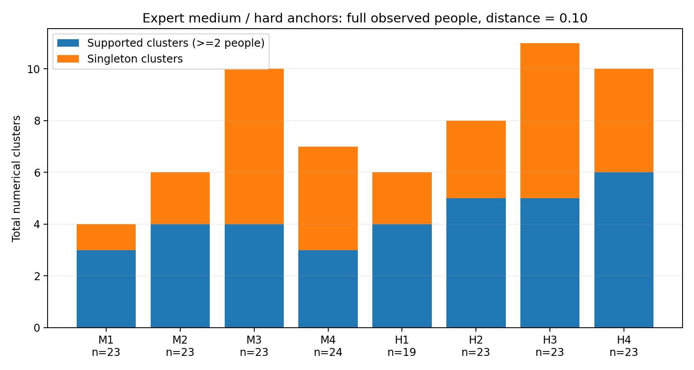
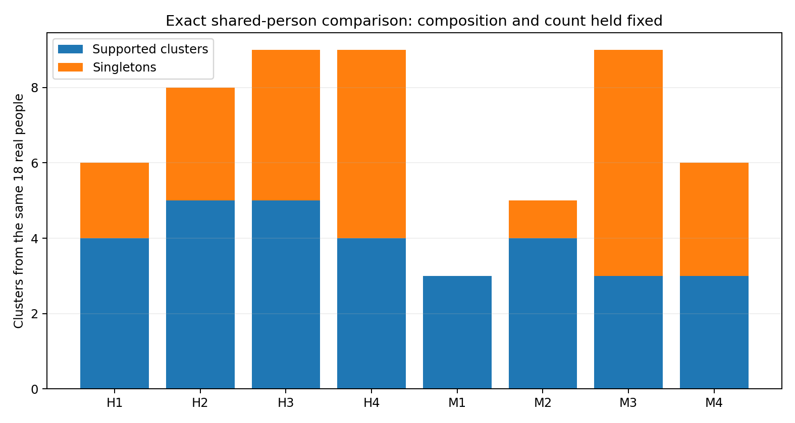
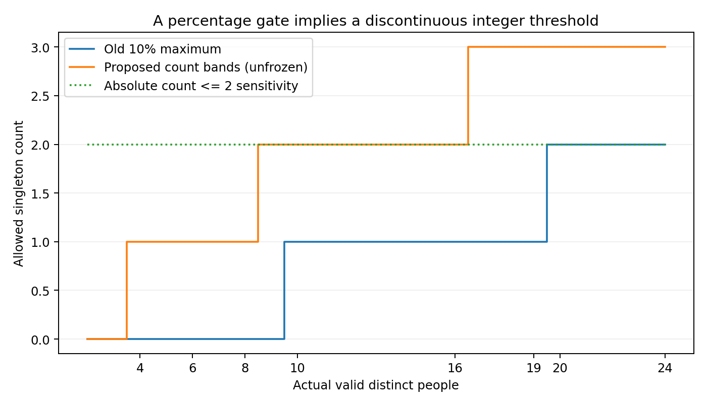
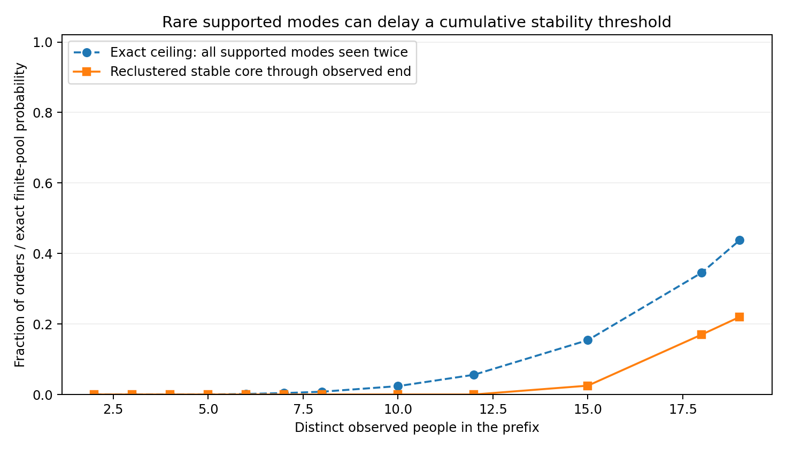
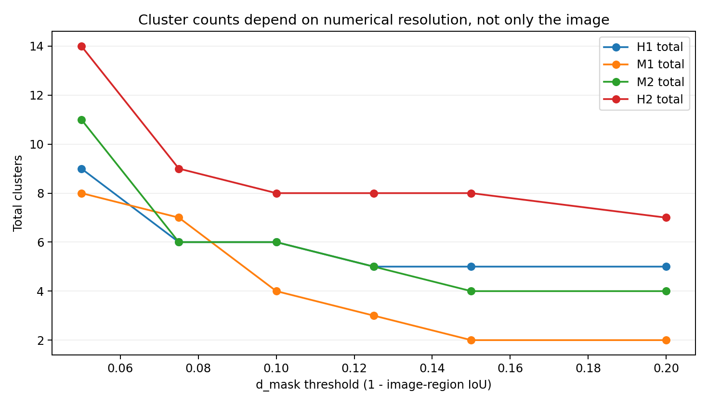

# 中等与困难候选重审：稳定类、单人模式与观察人数

研究主线仍是不确定性及其随真实人员增加的收敛。本文是接续 mainspace_history / history_difficulty 的定向重算；不是新独立验证，所有粗类都等待用户裁决。输入核对至 c0069628141dd078626c42ba574fd699c7661f55；新结果独立保存，旧报告和用户106张tag均不改写。本轮不重拟合图片模型。

## 1. 结论先行

旧规则确实不适合直接承担当前“中等”的含义。具体问题是：①把支持簇自身的复现与全体模式比例稳定绑成同一门；②单人比例超过10%时，旧程序直接跳过稳定起点计算；③一条无效作答使整图失去粗分类资格；④稀有双人模式的发现等待被计入“较晚才能稳定”。但核查发现，旧表并没有将用户11张有Manual历史的中等图直接判为困难；主要是漏分到未分类。

本次从真实有效几何重新聚类和逐前缀回放。总簇数必须保留，但中等与困难仍有重叠。最终建议是：先用总簇数、支持簇数、单人数量及逐簇恢复筛出结构候选，再把模式份额/几何的时间稳定作为独立证据级别。不能把“30个中等结构初筛候选”写成“30图整体已收敛”。

## 2. 人员排除、奇数点与输入核对

2501条canonical中，排除W019/W026后有Manual 1634条、Semi 538条、统一OOS规则任务216条。W011历史保留。几何有效作答为Manual 1620、Semi 532；其余20条单列，涉及12个Manual和4个Semi图×条件单元。OOS规则任务不混入几何难度分层，Manual/Semi中的Scope意见也不等于最终难度或GT。

主Manual/Semi有17条原始奇数点：5条有明确用户修正来源（3条确认删点、2条确认补点）继续使用；其余12条未获可用修正而排除。还存在8条其他无效几何。没有自动补删点。含无效作答的图片继续计算有效子集过程，并保留原人数/无效人数；这不是宣称整张图所有作答有效。

敏感性只额外移除2条已确认补点，主分析仍保留：q9v…9c9图24→23人，总簇17→17，支持簇5→4，单人12→13；uNb9…978图23→22人，总簇10→9，支持簇4→4，单人6→5。关键碎片化现象不能只归因于保留这两条修正。详见audit/与extra/confirmed_addition_sensitivity.csv。

## 3. 用户中等、困难锚点的真实结构

| 代码 | image_id | 用户tag | 有效人数 | 各簇人数 | 总簇 | 支持簇 | 单人簇 |
| --- | --- | --- | --- | --- | --- | --- | --- |
| M1 | uNb9QFRL6hY_1096f195d3294cefa462add5ab0c342e | 中等 | 23 | 18;2;2;1 | 4 | 3 | 1 |
| M2 | uNb9QFRL6hY_8b6f1b0b025848b482e747ab6a027b97 | 中等 | 23 | 9;7;3;2;1;1 | 6 | 4 | 2 |
| M3 | uNb9QFRL6hY_978d7a8eb0794936bd8fd092306e1dc5 | 中等 | 23 | 7;6;2;2;1;1;1;1;1;1 | 10 | 4 | 6 |
| M4 | uNb9QFRL6hY_c1ebb8b34eb846ba9b5ce23b30b299a7 | 中等 | 24 | 15;3;2;1;1;1;1 | 7 | 3 | 4 |
| H1 | VFuaQ6m2Qom_ad4c387f8175498491966703c8441e0d | 困难 | 19 | 8;5;2;2;1;1 | 6 | 4 | 2 |
| H2 | uNb9QFRL6hY_9f199750b00c4f5484a546d79e06a0f8 | 困难 | 23 | 5;4;4;4;3;1;1;1 | 8 | 5 | 3 |
| H3 | uNb9QFRL6hY_ba24e5a57ef34c6dbc0458ed4c1e701d | 困难 | 23 | 5;4;3;3;2;1;1;1;1;1;1 | 11 | 5 | 6 |
| H4 | wc2JMjhGNzB_b41b10699d614f24851b56a9a0e743c6 | 困难 | 23 | 5;4;3;3;2;2;1;1;1;1 | 10 | 6 | 4 |

16张用户困难图有11张具有Manual历史，其中仅4张达到至少10名有效人员；41张用户中等图有11张Manual历史及2个Semi条件记录，中等高人数Manual同样仅4张。8张高人数锚点只来自3个楼宇，4张中等全来自uNb9QFRL6hY。它们适合制定待裁决初稿，不足以校准全648图的通用阈值。

M2与H1都有6个总簇、4个支持簇、2个单人簇，故无法仅凭这三个终点计数分开。M3的用户tag为中等，组评论却写“这场景较难”；这两层表述都原样保留，不擅自纠正。H1评论“这张图历史的分歧都有点大”、H2“这个标注出现不收敛了”、H3“这可能不太收敛”是重要预期/历史知情记录，而非独立盲评真值。

## 4. 相同人数与相同人员后，差异是否还在

8张高人数图有完全相同的18名有效人员交集：W001、W006、W008、W010、W011、W012、W013、W015、W017、W029、W030、W031、W032、W033、W034、W035、W036、W037。使用该同一名单重算，并让8图使用相同的人员进入顺序。中等4图总簇数为3、5、9、6，困难4图为6、8、9、9；中位数分别5.5与8.5，单人簇中位数2与3.5。

这支持用户判断包含部分真实差异，而不是完全由观察人数或名单造成。但楼宇、房间、阶段与选图混杂仍在；中等M3依然较碎片化，困难H1仍能形成四个重复支持簇。不能利用总簇数把这8图无误地排成两类。

## 5. 10%不是数学错误，但作为唯一硬门不合适

固定比例有时可表示允许的尾部质量，因此并非“所有统一比例都错误”。这里的问题是，经验单人簇比例受到有限人数、稀有模式、几何阈值和聚类分区共同影响，并没有被校准为真实错误率。旧代码还将它用作不计算稳定性的前置门。19人出现2个单人簇为10.53%而被拒，20人同样2个为10%却通过；5–8人只出现1个单人簇就一律超过10%。

本次并列保留固定10%、绝对至多2个、分段计数、较宽松分段计数。建议先用4–8人≤1个、9–16人≤2个、17–24人≤3个作为“少量单人”的审阅起点，并同时显示f1/n和真实人数。中间人数区间缺少用户高支持中等锚点，≤2只是插值式工作规则，尚未校准。宽松边界另报17–24人≤4个。任何超过门的图片都不能因此自动归困难。

## 6. 一个更深的限制：稀有模式的发现上界

M1有23人，簇人数为18/2/2/1。在以最终模式作为回顾性参照的定义中，前19人必须恰好包含两个双人簇的全部4人，才能称两种少数模式都获重复支持；其上限为 C(19,4)/C(23,4)=0.437719。即使这两簇本身完全可复现，也不可能有80%的重排在前19人都看齐这4人。因此，“19人前80%稳定”同时惩罚模式发现等待，并不等价于模式本身不稳。

H1有19名有效人员及两个双人簇。在n−1=18人时，全部支持模式出现两次的上限为15/19=78.95%，同样低于80%。本轮其实际对应比例为77%，而在已看齐各模式两人的那批相同顺序中，支持核心的份额/几何后缀通过率为100%。后者是有条件稳定，不能抹去未看齐模式的顺序，也不是整体未来保证。

## 7. 稳定类、稳定比例、稳定整体：分别给证据

逐簇恢复首先逐一移除真实人员，比较簇成员Jaccard；再进行200次80%不同人员子集检查，分别报告“还保留至少2个该簇成员的比例”和有资格时的Jaccard。不能把因抽样只剩1人而不可评价，解释为簇消失或工人错误。全体比例的回放不再预筛10%，支持核心则单独匹配已支持簇、条件比例和簇内几何。

M1在LOO中最弱支持簇Jaccard仍有0.915，但80%子集检查有一个双人簇降至0.672；跨某两个支持簇97.22%的几何配对仍处于0.10兼容范围内。故它可以是用户中等预期，但当前数字分区还不能证明三种清晰自然模式。M2的80%子集最小Jaccard为0.907，较支持重复模式，但0.10下跨簇兼容比例仍达70.37%；分离含义应审图。

H2的5个支持簇在80%子集、保留双人支持的条件下均为Jaccard=1；这些簇对应不同点数，恢复率的一部分由按点数强制分层保证，不能单凭Jaccard=1当作独立的几何或语义有效性证据。额外过程证据是：支持核心尾段通过率89%，到19人的累计核心通过率81%。因此它不支持“什么模式都形成不了”的解释。它仍有3个单人模式，整体分布/未来新解释未被证明稳定；原困难tag继续保留，供用户裁决“不收敛”的具体含义。

H3和H4则同时有较多总簇、单人模式及明显后段新标法：H3为11总簇/5支持/6单人，最后四分段新标法率15.08%；H4为10/6/4，对应21.08%。这些更符合当前观察内的困难候选，但仍不等于永不收敛。

## 8. 供用户裁决的初步规则与实际名单

| 档位 | 工作规则 | 不能声称 |
| --- | --- | --- |
| 简单候选 | 支持簇1–2、总簇≤3、少量单人；按2…8人分别计算完整模式后缀，当前展示80%门；实际n和剩余观察保留 | 4–6人范围内稳定不等于24人或未来仍稳定 |
| 中等结构候选 | 2–4支持簇、总簇≤6、分段单人数量门；最弱支持簇LOO J≥.85，并要求80%子集条件J≥.75 | 类可复现不等于其出现概率/整体分布已收敛；小n与分离问题另标 |
| 困难候选 | 至少10有效人、总簇≥10、单人≥4、最后四分段新几何≥.15、核心尾段通过率<.8 | 数量多本身不够；≥5支持模式且核心稳定的图保持单独状态，不写永不收敛 |
| 暂不分档 | 无效全缺、人数/模式支持不足、分区敏感、边界或三档不适配；用户决定是否调整 | 不得默认困难，也不修改人工tag |

这些阈值是本次在历史数据与用户概念对照后拟议的筛查表，不是先验预注册标准。总簇≤7、17–24人单人≤4等宽松边界以及严格累计过程版均已执行；不能因为哪个方案填满中等或更好预测而选它。

| 条件 | 复核后初步建议 | 图片条件数 |
| --- | --- | --- |
| manual |  | 126 |
| manual | difficult_candidate | 12 |
| manual | medium_candidate | 27 |
| manual | simple_candidate | 22 |
| semi |  | 29 |
| semi | medium_candidate | 9 |
| semi | simple_candidate | 5 |

先用LOO筛查得到Manual 30张、Semi 11张中等结构候选；80%子集复核进一步将3张Manual和2张Semi退回分区待审，最终是27/9。这些不是36张“整体已收敛”。如果额外坚持“19人内无条件累计核心通过率≥80%”，仍只有Manual 2张、Semi 1张；而先看齐重复模式再评价稳定，则对应另一种有条件结论，不能替换无条件量。全部版本和分母都保留。

旧11个困难候选中，8个仍在新困难候选内；2个Manual与1个Semi退回单人尾部/数量边界，不自动改成中等。新规则另纳入4个此前未分类的Manual图，其中包含过去被整图无效门阻断者，因此新困难候选总数12，不是为了让困难总量单调减少。9张在0.075/0.10/0.125三尺度下均保留困难候选，3张阈值敏感。没有把这些规则当作最终难度真值。

## 9. 文献实际怎么做，与本项目的差别

Hennig的逐簇稳定性思想是检查“哪些具体簇能在扰动中恢复”，而非要求整张分区都同样稳定。作者fpc手册给出平均Jaccard约0.75、0.85等解释指引，同时强调稳定并不保证簇有效；这些数主要面向bootstrap。本轮用不放回真实人员子集，0.75/0.85仅作为可审阅的对应尺度，不能称为文献认证的中等难度阈值。

Pavlick与Kwiatkowski的NLI研究把每题10个真实判断留出，比较训练侧单高斯和混合分布对未参与拟合判断的预测似然；他们并非“几个簇以上就困难”。该研究支持检查多模式能否在其他判断上复现，但任务是标量文本判断，不能直接套其高斯模型到不同点数的布局。我们此次没有假装已经拟合这些模型。

Chao与Jost讨论按样本完整度而非只按样本量比较物种丰富度。其启发是把稀有模式及未发现质量放进解释；生态固定物种/抽样假设不等于异质人群和数据依赖的几何簇。本轮只计算精确有限池稀释、发现上界及描述性覆盖代理，没有从f1/n直接推断“未来错误率”或无法收敛概率。核对的这些文献没有给出“总簇≥x且单人超过10%便属困难”的统一标准。

Christian Hennig (2007). Cluster-wise assessment of cluster stability. Computational Statistics & Data Analysis 52(1):258–271. DOI: 10.1016/j.csda.2006.11.025. https://www.sciencedirect.com/science/article/pii/S0167947306004622 阅读范围：核对出版社摘要；出版社正文403，未声称通读全文。具体算法说明另读作者官方手册。

Christian Hennig (2026). fpc: Flexible Procedures for Clustering, version 2.2-14; clusterboot section. CRAN official package reference manual, pp.41–46. DOI: 官方软件手册. https://cran.r-project.org/web/packages/fpc/fpc.pdf 阅读范围：已读相关段落并核看PDF第44页；0.75/0.85指引针对bootstrap，不能不经校准照搬为本项目LOO或子集的有效性定理。

Ellie Pavlick and Tom Kwiatkowski (2019). Inherent Disagreements in Human Textual Inferences. Transactions of the Association for Computational Linguistics 7:677–694. DOI: 10.1162/tacl_a_00293. https://aclanthology.org/Q19-1043.pdf 阅读范围：已读官方PDF解析原文§4.1：留出10个真实判断、比较单高斯与训练侧选择混合成分的模型；截图服务Cache miss，未依赖图表像素读取结果。

Anne Chao and Lou Jost (2012). Coverage-based rarefaction and extrapolation: standardizing samples by completeness rather than size. Ecology 93(12):2533–2547. DOI: 10.1890/11-1952.1. https://esajournals.onlinelibrary.wiley.com/doi/10.1890/11-1952.1 阅读范围：核对出版社索引文本及官方补充材料目录；正文直连403，未声称取得完整PDF。仅借鉴按样本完整度考虑稀有模式的方向，不照搬生态推断。

## 10. 用户最终裁决应具体落在哪里

先看8个高人数锚点及旧困难候选的代表作答：确认同点数簇是否真是不同空间解释、单人记录是否合理、是否因遮挡/凸起/门洞改变了目标范围。再确定“中等”的主含义是有限个稳定解释类，还是连模式比例也必须已稳定。前者有数据基础；后者需要同时处理稀有模式发现上限，不能继续把两个问题藏在同一门里。

USER_DECISION_TABLE.csv含全部230个图×条件单元，最后四列留给用户填写。ALL_CANDIDATE_LOCAL_REVIEW_QUEUE.csv绑定image_id、真实worker、canonical作答与各簇代表，聚焦队列另保留。原图留本地，本轮没有阅读、下载或调用模型；所有关于哪种标法合理的判断仍是待裁决，而非多数票、公共参考或模型输出能替代的事实。

## 11. 复算、边界与未执行事项

实际执行：源字段/修正审计、230个图条件的六尺度终点聚类、逐簇LOO、焦点及候选的80%不放回子集复核、逐前缀重聚类、完整与支持核心两类后缀、精确支持发现上界、固定同一18人比较、两条确认补点敏感性、旧/新候选变类和审图清单。所有曲线均为有限历史人员池重排，不还原真实日历顺序。主版本200顺序，其他指定尺度100顺序；55,300条主/补充顺序结果不是独立数据样本。

旧实验difficulty及同义risk分组没有参与新几何、阈值计算或分型；106专家tag/评论只在分析后作对照并用于明确此次概念修订的背景。许多评论已知晓历史表现，因此不是新的盲化验证。本轮没有重拟合图片/模型预测，没有修改采集安排或Paper A正式合同；新的粗类须经用户确定含义后才适合继续作为后续探索目标。

测试、输入哈希、参数与源代码随包提供。独立解压测试验证代码约束和关键数值；不得把它说成在新人员/新图片上再次实验。Jaccard、距离、比例、数量和重排门均未正式冻结。边界附近的200次Monte Carlo比例还有数值误差，review表专门标出接近80%的记录；不能将它们解释成经验人数增加后的总体收敛概率。
