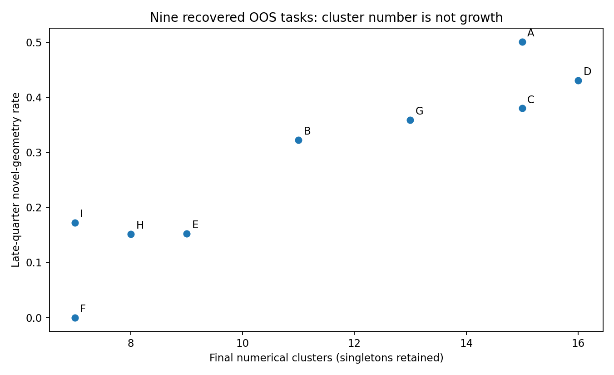
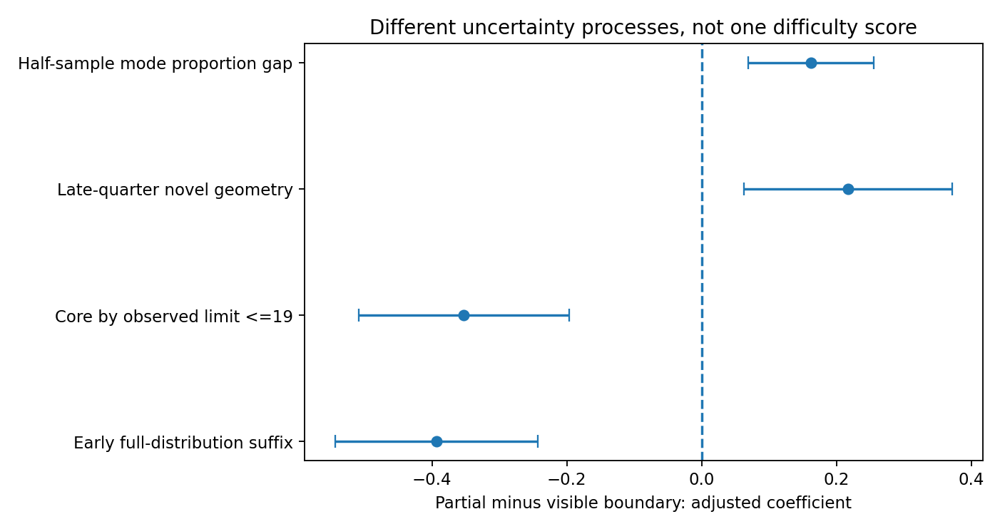
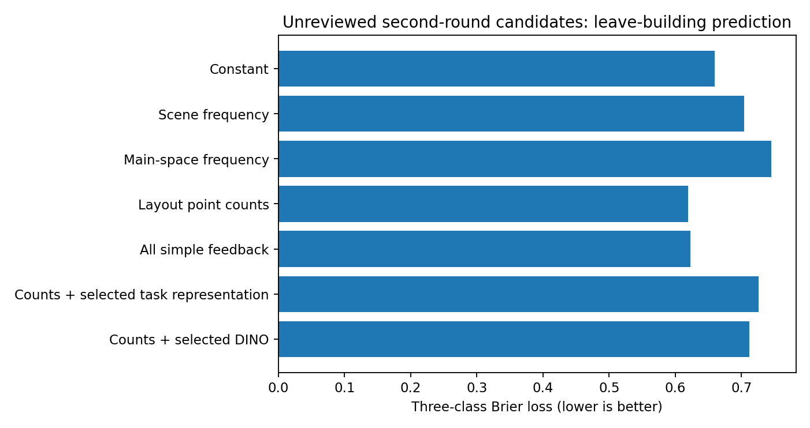
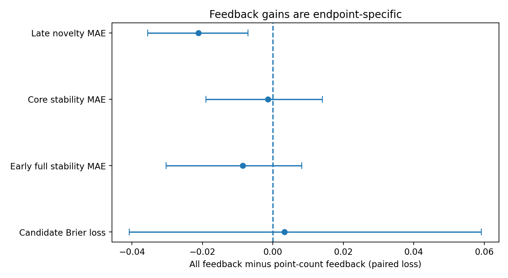
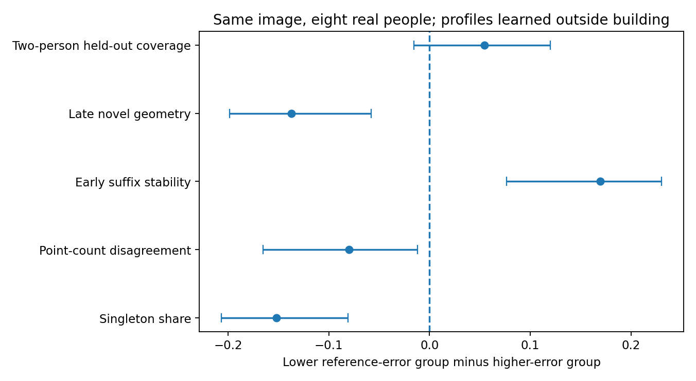
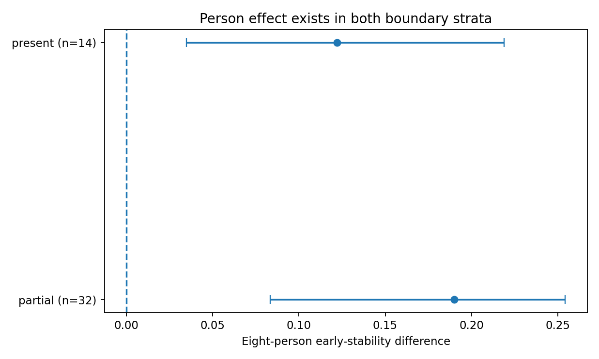

# 待审核历史候选与图片联系：不确定性、人数增长与人员构成

研究版本：`image_links_after_review_20260915_v1/run_b02a97e2`。输入研究分支提交：`b02a97e215bf5759fec1d512cffc333d7833779d`。本报告是已多次查看历史数据后的后续探索，不是新增人员的独立确认试验。标题中的“待审核”是实质限制：本轮没有收到新的用户审核JSON，也没有收到新的逐图高清视觉描述。

## 核心判断

本轮完成了新提示词要求的A—E数值工作，首先补回此前被错误略去的9张OOS任务几何，再以第二轮候选和连续过程量重新拟合图片关系。主要发现并非“新模型成绩更好”，而是：

1. **Scope方向、点数、数值分区与增长过程确实是不同维度。**补回的OOS图中，同点数、7个数值簇且末段新几何率为0可以同时出现；不能按OOS任务名取消几何，也不能按数值稳定改成in-scope。
2. **第二轮“中等结构候选”的可预测性弱于上一轮两端较分离的粗类。**简单反馈仍包含一定信息，但高维表征没有稳定地超过点数基线。旧模型成绩不能换一个类别名称继续使用。
3. **边界初筛与人数增长过程有关，但目前无法从其与遮挡的重合中识别独立机制。**完整可见与部分可见之间的关系，在调整人数、类别和楼宇后仍存在；该观察不等于因果。
4. **同房迁移失败需要先检查信息条件。**第二轮候选的10个同房目标实际上每图只有一个合格来源；其中4对类别不同的视角又全部是5—6人对23—24人。这个结果不能作为DINO检索能力的干净检验。
5. **相同人数、相同图片，换真实人员仍会改变不确定性过程。**参考对齐历史的连续人员轴提供可复现的条件差别，但更窄的分布并不自动更正确，未来覆盖也没有相应的普遍增量。

本轮不冻结任何新的最终粗类，不替用户填写审核结论，不把“受支持的结构类”称为完整分布已收敛。

## 1. 输入版本、实际覆盖与纠错

最新分支入口和`review_workflow_20260915/PRO_PROMPT.md`均已通过GitHub读取。根目录`AGENTS.md`返回404。此前v1和v2返回包保留；新代码只写新结果目录。原始响应Git blob为`6261c30d1abf2d7ad0e71702348fc81819e783ad`，与最新分支完全相同；`build_bundle --check`通过。

|条件|真实响应|图片|有效几何|无效或明确排除|
|---|---:|---:|---:|---:|
|Manual|1634|187|1620|14|
|Semi|538|43|532|6|
|旧raw_condition=oos、无辅助几何|216|9|212|4|

总原始canonical仍为2501；主人员24人，W011保留、W019/W026排除。9张旧OOS任务的216份主分析响应，逐份核对`assistance_exposure=none`与`unassisted_manual_included=true`。它们属于应保留的无辅助几何证据，**不因此获得in-scope资格**。

旧205张历史图扩大为214张，旧230个图×条件单元扩大为239个。与106张专家tag仍重叠35张，并集由276扩大到285。这是补回既有证据，不是新增9张采集图片。Manual的`unassisted_manual_included`共有1627条，与OOS216合计1843；这一资格库存不能与最后几何有效数1832混称。

原始奇数点和人工修正再次核对：Manual/Semi中有来源明确的5条修正继续使用；未修正奇数点和其他无效记录不进入几何分簇，但保留在响应审计表。一条无效作答不再自动抹去整图其他有效人员的结果。原230单元的人员列表、点数和距离矩阵重新计算后与第二轮输入逐项一致，最大差小于1e-8。

第二轮候选原样保留：Manual简单22、中等结构27、困难候选12；Semi简单5、中等结构9、困难0。合计75个单元、74张不同图片，其中59张不在106tag内。它们依旧是算法候选。OOS9图另列，不强行分为这套in-scope工作难度。

证据：[覆盖](audit/coverage.csv)、[逐份响应审计](inputs/response_audit.csv.gz)、[旧矩阵对齐](audit/old_pairwise_parity.csv)、[版本与审核状态](targets/version_and_review_changes.csv)。

### 实际取得的模型数值

主体重用已核验205图的70种L2 Gram矩阵，而不是旧拟合预测。再次读取原数值传输包，补回9张OOS的HoHoNet、Bi、uLayout、DA3输出，得到33种对应层／汇聚表示和三个布局模型的反馈。

为了不把旧快照冒充更新，本轮通过GitHub分别查询e086旧提交与b02最新提交的四个模型目录：**四个目录的Git tree SHA完全相同**，即目录下全部文件内容相同。DINO目录则明确发生变化；主体使用后DINO版本的205图矩阵，没有用旧空目录或其他模型替代DINO。

运行环境目前没有取回9张OOS的DINO数组；这9个完整ID单列缺失。四模型OOS补充使用固定alpha=10、无PCA，不作9图最佳层选择。主体的155个候选／组合则采用完整训练内选择。DA3联合相机几何没有作为物理匹配输入。

[版本证据](audit/remote_input_version_verification.json)、[OOS实际数组清单](audit/oos_inherited_model_sources.csv)、[全部缺失与限制](audit/failures_and_missing.csv)。

## 2. 不确定性过程：主体稳定不等于分布稳定

本轮沿用第二轮明确的方法，不再改阈值寻求更好的预测。点数不同先分开；同点数用d_mask与完整链接聚类。支持簇至少两个不同真实人员；单人簇保留。总簇数、支持簇、单人占比、成员恢复、核心稳定、全体稳定、几何变化和质量不是一个指标。

`full_p_by_8`为历史真实人员池中，在实际可观察范围内、不晚于8人的完整分布稳定后缀比例；`core10_p_by_19`是支持核心在不晚于19人且不超过实际观察上限的对应比例。后缀与尾段同时保留。低人数图片没有被复制到8／19人，因此这些名称**不是观察了统一8／19人的标签**。`full_requested8_exceeds_n`和`core_requested19_exceeds_n`明确记录截尾信息。

旧230单元复用第二轮已执行的几何和过程结果，其中175个至少4人的单元在主阈值0.10下各有200个顺序；其他阈值敏感性中的100顺序结果保持原名。补充OOS9图本轮各执行200个顺序。共同人员视角使用80个相同人员顺序，人员子群使用24个顺序。这些是有限池敏感性，不增加独立人员或图像，不是原始日历到达顺序，也不覆盖新人员总体的抽样不确定性。

### 中等结构候选的识别边界

Manual的27张中等结构候选中，14张的支持模式恰好与点数分层一一对应，9张仍有一对同点数支持簇的跨簇几何兼容比例超过50%。Semi的9张中等候选对应3张和5张。成员复现有时部分来自“不同点数不许合簇”的结构约束，不能据此证明多个语义解释。

Manual这27图的完整尾段稳定比例平均为0.2757，支持核心尾段平均为0.3472；Semi9图分别为0.6139和0.7122。这些平均值只描述当前观察池，不否定结构重复支持的价值，但明确反对把中等结构候选统一称为完整分布已稳定。

[逐图可识别性](extra/medium_identifiability.csv)保留点数分层、弱分离与来源；没有自动合簇或删去单人记录。

### 补回OOS的具体反例

`b8cTxDM8gDG_f63819c407e64c2897b703080766cb60`：24条响应中23份几何有效，点数完全相同，却有7个数值簇，大小为6／5／4／3／2／2／1。最后四分之一新不兼容几何率为0，支持核心尾段通过比例却只有0.16；最大跨簇兼容比例为0.80。Scope方向仍有10人in-scope、14人oos（包含无效几何响应）。

这不是“7种合理物理解释已经证实”。它说明，没有出现新的不兼容点集，与分区或比例没有变化是两件事；数值簇、点数和范围判断也不等价。

相反，`7y3sRwLe3Va_4291cbfde1024467b1548934653f07ce`的24份有效几何形成15簇、12个单人簇，末四分之一新几何率0.5008；`UwV83HsGsw3_fcd79f4b6a6642e99227caffb51bf407`为24人9簇、5个单人簇，末段新几何率0.1525。三者不能统一称作“没有几何可研究”或“完全无法收敛”。



证据：[逐图OOS几何、范围与过程](oos/geometry_scope_and_process.csv)、[逐人员簇成员](oos/mode_memberships.csv)、[OOS逐顺序结果](oos/per_order_onsets.csv.gz)。

## 3. A：类别、主空间和可见特质提供了什么信息

类别和主空间维持原记录与来源；主空间功能重编码不等于空间范围掩膜，也不等于已确认的门侧／淋浴内部定位。当前没有新高清描述，不能将旧粗筛扩写成新目视事实。

Manual的墙地边界部分可见与遮挡存在仍是同一初筛模式；连接字段在187张Manual中为常量；低对比度仅一张present；反射大量unknown。联合特质模型只保留边界字段，不将高度重合的遮挡再算一份独立证据。

在133张可计算过程的Manual图上，一次一个特质、调整log有效人数、场景类别和楼宇后，“部分可见”相对“可见”的描述性系数如下：

|过程量|系数|楼宇聚类95%区间|
|---|---:|---:|
|早期完整后缀比例|−0.3932|[−0.5433，−0.2430]|
|观察内≤19人核心后缀比例|−0.3526|[−0.5088，−0.1964]|
|末四分之一新几何率|+0.2173|[+0.0633，+0.3712]|
|半程模式比例偏差|+0.1623|[+0.0691，+0.2555]|

删除图片最多的uNb楼后，前两项系数分别约−0.4060、−0.3455，末段新几何约+0.2088，方向保留。未调整的早期边界系数只有−0.0773且区间跨0；控制后的差异提示采样／人数／场景构成存在明显混杂，不能将原始均值与调整值混写。

门洞“确认”相对“否”的记录也与较多末段新几何有关，但样本少且与类别、可见性有共现。当前回归逐特质拟合，**不证明门洞独立于遮挡起作用**。反射present对unknown的差异不稳定，且该对照本来就是可判断性差异，不是“有反射vs无反射”的实验。

这些区间没有纳入历史反复探索、特质误测和多重筛查的选择不确定性，不作为确认性p值结论。最值得本地细化的是实际边界不可追踪的位置、开口与遮挡的空间关系，而不是把“门洞多”直接编码成难。



[全部分层表](A/stratified_picture_process_links.csv)、[调整与删楼分析](A/adjusted_picture_associations.csv)、[字段覆盖](A/trait_coverage.csv)。

## 4. B/C：第二轮候选重新拟合后，没有通用优胜表征

固定留楼主比较；每个外层训练内部再留楼选择参数和层。主体70种候选保留HoHoNet各阶段、Bi三分支、uLayout两层、DINO五层／全景六面／CLS／局部汇聚及DA3四层。另有简单反馈、类别、具体特质和点数＋每种表示，共155个拟合输入方案。Ridge与近邻均实际运行；内层同分按保存的CONFIGS候选顺序处理，选层同分按稳定名称顺序处理，没有使用外层标签破平局。分类使用三类Brier作为主损失，RPS和准确率附列。未归档／未审核不是第四个难度等级。

这里是L2表示后训练侧中心化、总方差尺度、PCA和调参，与早期逐通道z-score方案不是完全相同的方法。V1与V2均以各自原标签重新拟合，不能把第一轮旧RPS直接与本轮Brier横比。

|Manual第二轮候选输入|可预测图数|Brier（低为好）|准确率|
|---|---:|---:|---:|
|总体训练频数|61|0.6599|36.1%|
|场景频数|61|0.7037|50.8%|
|主空间频数|61|0.7452|37.7%|
|布局点数|60|0.6196|35.0%|
|全部简单模型反馈|60|0.6229|41.7%|
|主空间＋简单反馈|60|0.6051|46.7%|
|点数＋训练内选既有非DINO表征|60|0.7255|40.0%|
|点数＋训练内选DINO|60|0.7119|40.0%|

Brier与准确率排序不同，不能只挑有利指标。两张原始Bi后处理异常导致完整反馈库存203/205，分类当前落在其中一张，因此对应60/61；逐图失败保留。

同60图配对，点数对总体基线的Brier差为−0.0345，区间[−0.0836，+0.0144]；主空间＋反馈对总体为−0.0489，[−0.0883，−0.0093]。相对点数，加入训练内选择DINO反而+0.0923，[+0.0459，+0.1633]；加入非DINO高维表示+0.1059，[+0.0420，+0.1913]。这不证明表征没有信息，而是本批候选、覆盖和所声明数值方法没有显示相应预测增量。

Semi只有14张已分候选、没有困难候选。点数＋非DINO表示的Brier为0.5351，低于点数0.6636，但差值区间跨0。不能将只有简单／中等的子集包装成完整三档分类已经成立。



### 连续过程比一个类别更清楚

Manual末四分之一新几何率，常数基线133图MAE0.1996；相同131图反馈覆盖上，点数0.1753，全部简单反馈0.1541。全部反馈相对点数的配对差为−0.0212，区间[−0.0355，−0.0070]。但单独双头、旋转和跨模型差异分别约0.1982、0.1979、0.1946，并非每个反馈字段单独都有优势。

同一全部反馈方案，对早期完整后缀及晚期核心后缀的增量区间都跨0。点数＋DINO对早期后缀的差为+0.0007，[−0.0375，+0.0472]，没有把此前某个覆盖受限版本上的收益普遍复现。

所以当前比较支持的是：某些简单结构反馈帮助识别**末段仍可能出现新标法的图片**，而不是已经能够准确预测完整收敛；高维层的增量必须按具体目标说明。



### 保留模型—人工反例

相对模型差异的高低由目标楼之外的四分位定义，不是绝对“一致／不一致”。例如`yqstnuAEVhm_e650c19e3eb34cc0b98374e5a23d1f65`有24名Manual人员，点数分歧0.8333，模型差异0.1249落在外楼低区。`B6ByNegPMKs_e52609aae11f42a79f6cf50360180fd5`有6人、点数一致，但模型差异0.5782在高区；点数一致并不保证其几何一致。

[全部候选分数与原覆盖](prediction/score_summary.csv)、[逐图预测](prediction/all_predictions.csv.gz)、[同覆盖配对](prediction/paired_increment.csv)、[额外配对](extra/paired_common_coverage_comparisons.csv)、[训练侧选层](C/training_only_layer_selection.csv)、[全部反例象限](B/outside_building_quadrants.csv)。

## 5. D：同房信息为什么没有直接迁移

第二轮候选产生10个Manual同房目标，来自5个支持组件、3个楼宇。只有2图所属组件类别一致；8图来自4对类别不同的视角。

**每张目标恰好只有一个有候选类别的来源图。**因此DINO最近邻没有任何选择余地，所得2/10正确并不能解释为DINO排序失败；频数、随机来源和任何近邻在此退化为同一个预测。

4对类别不一致的视角，实际人数全部是5或6对23或24。它们不构成干净的“同房相同信息规模却难度不同”检验。例如：

- `uNb9QFRL6hY_6c4fa6dfddc1499db228854454bfc61d`，6人简单候选；
- `uNb9QFRL6hY_bcce4f23c12744c782c0b49b24a0331a`，24人中等结构候选。

固定共同6名真实人员后，前者2簇、2个支持簇、无单人；后者3簇、1个支持簇、2个单人。仍有视角差别，但不能把全体6对24的等级差全部解释成视角，也不能全归人数。

全体12对有至少4名共同人员的Manual视角，点数分歧绝对差平均0.1732，10对非零；早期完整后缀差平均0.1938，5对非零；末段新几何差平均0.2017，10对非零。共同人员只控制名单和人数，不控制阶段、学习、信息历史及全部视觉因素。

连续过程同房迁移有24张Manual目标、10组件、7楼。DINO第12层相对其他同房视角历史中位数，末段新几何MAE从0.2646变为0.2986，早期后缀从0.3631变为0.3767，没有普遍增量。同类跨房采用同语义类别且在其他楼的来源；同楼仅为诊断基线，不作为相似场景或不同物理房间的证明。

[实际邻居与失败](D/conditional_predictions_with_neighbors.csv.gz)、[单一来源与人数不等审查](D/candidate_transfer_identifiability.csv)、[共同人员逐对结果](D/exact_common_people_across_views.csv)、[全部条件迁移](D/conditional_summary.csv)。纯图片预测与允许来源历史的迁移分开，不把两种信息条件的分数直接叫“视角信息因果增益”。

## 6. E：人员组成与图片条件

在目标楼之外分别建立质量Q、有效时间T、范围方向S、历史Semi编辑／收益B，保留15种非空Q/T/S/B信息组合和“质量＋时间＋修改幅度”。每个轴要求至少6条源响应、3个源楼宇；信息块等权，未知者不分型。

Q为相对给定参考的几何偏差，不是无条件正确性；T不是认真程度。S本轮是实际in-scope/oos选择方向的task-adjusted倾向，**不是独立真值验证的规则正确性**，不能把它当成完全复现旧规则正确性轴。B使用核实的历史初始化；532条有效Semi编辑与初始参考收益均实际计算，没有使用当前视觉模型替代当时载荷。C1等共享参考初始化与自然模型初始化的来源表保留，B不是纯自然AI建议效应。

组数2到floor(合格人数/2)均形成能力覆盖记录；只对预声明2组、4组做实际组合和增长回放，没有声称3—12组均已做增长验证。

产生585554条“家族×分型×组合”分析记录，但仅对应**20692个不重复的图×条件×真实人员子集**，175个目标条件、151张不同图片。另有6617条实际子类／全体池增长记录，对应3082个不同增长子集；重复家族不增加独立样本。

### 同图同人数的连续人员差别

先固定两名真实人员作为所有组合共用的未来观察，任何受测组合均不包含他们。Manual46图、每组8人，Q偏差较低端减去较高端：

|指标|配对差|楼宇重采样95%区间|
|---|---:|---:|
|单人模式比例|−0.1522|[−0.2067，−0.0812]|
|点数分歧|−0.0800|[−0.1652，−0.0122]|
|早期稳定后缀比例|+0.1694|[+0.0766，+0.2306]|
|末段新几何率|−0.1372|[−0.1987，−0.0579]|
|同两名未来人员覆盖|+0.0543|[−0.0156，+0.1200]|

这说明历史参考对齐倾向与分布收缩／过程有关；没有同样证明对未来人员标法的普遍覆盖，也没有证明较集中一方语义更正确。两人的覆盖只是一项观察量，不替代收敛。



Q两端早期差异在边界部分可见32图为+0.1901，可见14图为+0.1220；两层差异的区间跨0，不能据此认定存在稳定的图片专长交互。时间两端在可见图和部分可见图不同是一个后续探索线索，但多项交互检验没有新的独立验证。



### 组合与稳定多模式

AA、AB、AAB、ACD、AABC、ABCD均有真实可形成的例子，保留实际人员。Q二分的同人数、类型边际匹配AB对(AA+BB)/2：42图点数分歧差+0.0324，区间跨0；未来覆盖差−0.0042，区间也跨0。QTSB组合中AB增加点数分歧，但覆盖没有相应稳定增益。没有“异质组合总更好”的结论。

实际子类成长分析中，发现“两个核心分别达到尾段门，合并后未达到”的家族×图片候选，Manual涉及9张图，Semi涉及3张；这些计数跨家族重叠，不能相加成独立实验。没有找到两类都统一而合并后变成稳定多簇的正例。另有少量原本已有多簇的子类在合并后继续多簇，保留为不同机制。

[完整信息家族覆盖](E/information_family_group_capacity.csv)、[真实组合与共用未来人员](E/real_combinations_fixed_future2.csv.gz)、[实际子类增长](E/actual_type_growth.csv.gz)、[同人数比较](E/continuous_axis_paired_differences.csv)、[图片条件交互](E/picture_person_interaction_exploratory.csv)、[子类与合并池](E/subtypes_to_pooled_growth.csv)。这些类别未通过本轮独立名单重现验证，不能宣布稳定人员本体类型；这里只检验训练侧定义的候选在目标图片上的行为。

## 7. 106tag、评论与新的用户审核不是同一层

原106tag完整保留，旧实验difficulty及其同义重编码未用于任何新目标／特征／分组／调参。历史图片与原tag重叠35张不同图片，41个条件单元；其中实际获得第二轮粗类的为15张不同图片、15个条件单元，不能把35张都说成已分类对照。评论用于解释对照，不进入纯图片特征，也不反向选阈值。

已有评论涉及历史簇和Semi表现，独立保存不等于独立盲评；本轮不重复宣称人工tag是未见历史结果的预期。原“中等”且有历史的图片，在第二轮候选中仍有很多待定；原困难中已有中等结构候选，这种不一致正是需要审图的对象。

本轮没有新的`status=已审核`记录，所以“审核后结论改变了多少”的答案是：**尚无已审核版本，不能计算这个差值**。`targets/version_and_review_changes.csv`保存第一轮、第二轮及空审核列。后续更新必须绑定image_id、condition、原候选、审核状态、决定和理由，不将暂缓或未审核转成困难，也不修改原始标注。

证据：[独立对照](expert/contrasts_unchanged_user_tags.csv)、[交叉表](expert/candidate_tag_cross_tab.csv)。

## 8. 研究叙事与当前结论边界

本轮最有依据的叙事不是“我们发现了万能困难分类器”，而是：

**图片证据不足与标注者不同解释共同产生多层不确定性；人数增长会改变发现、重复支持和分布认识，但这些变化不必通向唯一共识。**

可用的证据链为：OOS不等于没有几何 → 结构候选与完整稳定不同 → 边界信息与具体增长量有关 → 固定名单后仍有视角差别，固定图片人数后仍有人员差别 → 模型反馈只能部分预测某些过程。

仍不能支持：所有数值簇语义合理；中等候选均完整收敛；低人数简单候选对新人员永久稳定；DINO普遍改善收敛预测；同房关系足以转移难度；人员速度等于认真；较低参考偏差一组总更正确；DA3联合几何已经可靠补足物理信息。

本地应优先核查44项问题、39张图片，尤其是弱分离中等簇、模型反馈与人工过程相反的高人数图、OOS同点数碎片化、人数不匹配的同房配对。队列提供真实worker/canonical/代表簇ID，但没有从数字臆造局部视觉判断。

[本地审图队列](local_image_review_queue.csv)。与已有空间标本配合，不要求上传原图。

## 9. 可复算交付

新增代码前缀`image_links_followup_`，报告及入口单独保存。未改原合同、采集安排、原始导出或旧报告。本轮没有创建GitHub Actions任务，没有将结果推送远端；压缩包是本会话下载交付，不上传Git。

按仓库根目录执行：

```bash
export OPENBLAS_NUM_THREADS=1
export OMP_NUM_THREADS=1
M=tools.thesis_main.analysis.image_portrait
python -m $M.image_links_followup_prepare
python -m $M.image_links_followup_predict --workers 3
python -m $M.image_links_followup_associations
python -m $M.image_links_followup_people
python -m $M.image_links_followup_oos_feedback
python -m $M.image_links_followup_transfer
python -m $M.image_links_followup_synthesis
python -m $M.image_links_followup_figures
python -m $M.image_links_followup_report
python -m pytest tests/test_image_links_followup.py -q
```

主体预测存在当前版本结果缓存；直接执行会复用相同方法已有候选。如需完整重新拟合，只删除新目录的`prediction/candidates/`、`prediction/inner/`，不要删除输入或旧版本结果。OOS模型导出文件已包含，复算不需要最初几个大ZIP，也不需要重新视觉推理。模型核保存的是未监督的L2点积，不是旧拟合预测。

33项必要测试通过，涵盖原始身份、人员排除、修正奇数点、OOS实际资格、旧矩阵一致、训练侧变换与标签隔离、明确候选缺失、同房邻居、真实人员去重及未来人员排除。独立解压测试另记录。它验证代码与输入约束，不验证模式语义，也不等于对全部方法做了新的人员重复实验。
