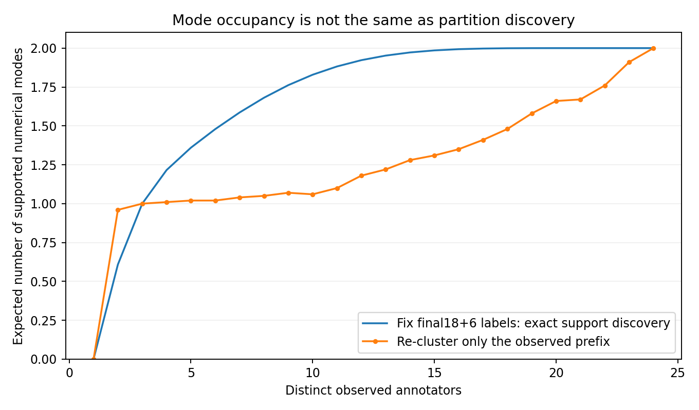
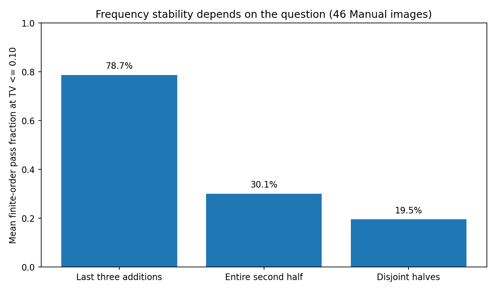
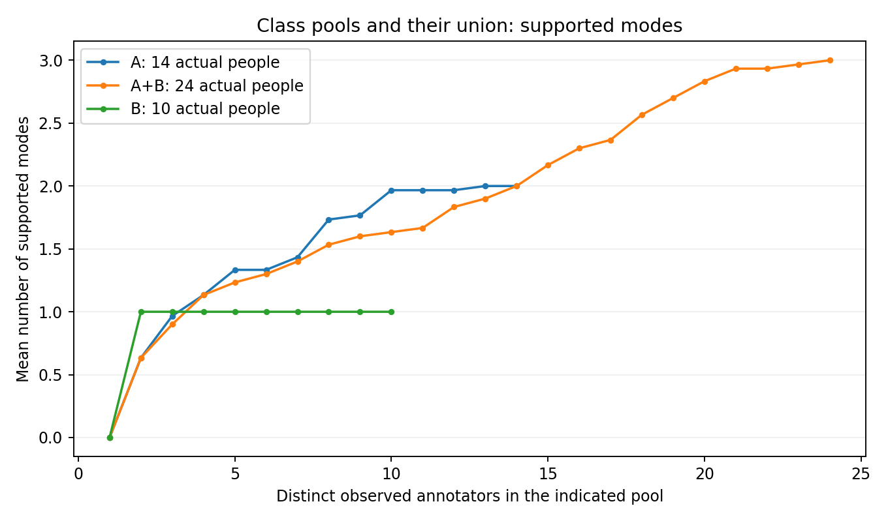

# 标注不确定性及其随真实人数增长的收敛：后续数值研究

版本：`v2_convergence_e086b2b9`。输入提交：`e086b2b94d60b8a858a71f0326f12930538fe4fe`。本报告是上一轮结果已被查看后的后续探索，不是新独立确认研究。研究主线始终是**不确定性为何存在、怎样随人数变化、何种意义上稳定、能否跨图片与人员构成复现**。模型比较、人员速度、后续覆盖和成本信息只提供辅助解释；本轮不以节省成本为目标。

## 核心结论

第一，数值上确实存在不同的不确定性结构，但“最终存在两个簇”不等于“两个自然标法已经稳定”。本轮把结构差异、同结构几何波动、范围选择、无效记录，以及**分区自身的可识别性**分开。一个重要旧案例被实质降级：18＋6人的同点数分区中，94.4%的跨簇人员对仍满足同一个兼容阈值，不能把它直接当作自然分离的双峰。

第二，多种收敛定义会给出明显不同结论。一部分差异是科学问题不同，另一部分是统计量的机械性质：固定短尾与完整池比较的比例差必然随n增大被压小。模式出现、获得支持、模式比例、簇内波动和独立后续人员覆盖必须并列，不能相互替代。

第三，**确有部分名单和行为可复现的局部人员子类**，无需要求所有人同时分型成功。但“名单复现”“行为复现”“内部收敛复现”不是同一层证据。一个只在训练楼宇形成的名单，其相同八名成员在两个不同楼宇图片上都出现观察内统一；该名单在别的图上仍有大量反例，故不能称为普适收敛子类。

第四，图片模型对后期新几何出现和部分比例变化有预测信息；在简单预测点数之外，多数增量并不明确。纯图片输入尚不能稳定区分完整收敛状态。观察真实前k人后，对后续分布变化的判断通常更直接；这仍只是收敛的一组维度。

第五，组合会改变结构分歧、熵和模式构成；没有必要预设哪种组合更好。实际计算了96,756个真实人员子集、1,395个实际类群/合并池过程，以及396项至少每类4人的合并比较。没有发现两个已统一子类混合后形成稳定多簇的有力实例；发现的是一类本已多模式、另一类统一，合并后仍多模式。不能编造更整齐的故事。

## 1. 上一轮发现应当怎样重新解释

|上一轮结果|它为本主线提供的证据|不能推出的结论|
|---|---|---|
|模型反馈/特征可预测最终结构分歧|人工分布的某些离散结构具有可被图片侧代理信息捕捉的规律|没有由此证明已预测稳定起点或最终会统一|
|固定十人窗口覆盖|有限观察可能漏掉后续真实人员的标法；支持出现有延迟|不是质量上限，不是模式比例稳定，更不是未来永不变化|
|连续人员差异较稳定、全体聚类ARI较低|某些行为轴可复现；全局硬分区可能不合适|不能否定一个局部子类，更不能用速度定义认真程度|
|混合组合没有普遍优势|平均优势不是必要前提，应比较组合改变了哪些模式|不能推断构成无作用；也不能把成员质量中位数叫融合质量|
|AI特质信息弱，同房耗时迁移失败|对应的是特质测量覆盖和某个耗时迁移实验的限制|不能否定人工场景类别、图片效应或同房收敛规律|

因此，本轮重排的是**解释优先级**，不是研究主线。旧报告保留在[上一轮报告](../v1_e086b2b9/REPORT_ZH.md)，没有覆盖。与旧报告不同处均以本报告和审计记录为准。

## 2. 实际数据、来源层次与可回答范围

| 条件   |   真实响应 |   图片 |   人员 | 几何有效           |
|:-------|-----------:|-------:|-------:|:-------------------|
| manual |       1634 |    187 |     24 | 1620               |
| semi   |        538 |     43 |     24 | 532                |
| oos    |        216 |      9 |     24 | 不用于普通几何收敛 |

648图仅为画像覆盖。历史为214个image_id、26人、2501条canonical响应；当前主分析保留24人、2388条响应，其中Manual/Semi共有230个图×条件单元，不能当作230个独立物理房间。Manual有效几何1620条/1634条；Semi532条/538条。OOS的216条主分析记录属于规则选择任务，不合并为普通布局几何。

Manual中24图横跨多个历史context，其余163图为单context；Semi43图均为单context。已保存分context与不使用imputed_point的敏感性。参考偏差只对来源允许且可计算的参考计算，坏/缺失参考不补值。**这些记录不等于同一新协议下的一次前瞻采集。**

三层图片证据严格分开：648图都有早期人工场景分类的来源标记；采用字段607图来自早期user_type、41图来自后续亲审coarse_type。原文中两条带附注的类别字符串原样保留，没有默默改成标准类。新增可见特质仍是AI初筛及21图AI高清复核，不是人工精确真值。物理同房关系使用独立关系审查和固定component隔离规则；同楼、展示组和支持图组件都不自动等同于独立物理房间。见[来源分层](images/evidence_layers.csv)。

**没有导出的真实提交到达时间序列。** 本报告的增长曲线是固定历史人员池中、不复制人员的顺序重排：改变看到真实人员的顺序，而不是声称还原了日历时间上的学习过程。全部曲线保留各图自身实际n；十人窗口不再是准入门槛。几何曲线横轴为有效几何人数，同时保留实际作答人数与无效数；无效记录不能被静默当作“没有标注”。

原图、权重和视觉推理均未使用。DA3的联合几何仍有已知六面相机不一致，未被用于证明物理对应或补足。DINOv3和旧d_t没有补造。冻结提交不存在可读取的AGENTS.md；沿用已核实工作包、指标及划分，不以其缺件阻止数值分析。

## 3. 不确定性结构：离散模式、连续波动与分区识别

### 3.1 先报告观测结构，不预先决定模式是否正确

在d_mask距离阈值0.10下，Manual187图中58图有至少两个支持模式，38图含同点数多簇，34图包含人数不超过20%的受支持少数模式。Semi对应为16/43、11/43和15/43。点数不同严格分开；单人模式保留，不被归为错误。

同点数分歧也不全是随机位置噪声：例如`e9zR4mvMWw7_1daae4b7becc43949516096170ce2a76`的Semi24人全部同点数，几何中位差仅0.0297，仍有两个人数受支持的数值簇。另一方面，数值簇存在不自动意味着其语义解释合理。

### 3.2 对“18＋6”旧代表案例的实质修正

`X7HyMhZNoso_987fd31155514f6facb131bd5c14881d`的Manual24人全部8点，在0.10完整链接规则下得到18＋6。但两个medoid的距离只有0.03873；102/108，即94.44%的跨簇人员对距离仍≤0.10，跨簇最小距离0.01710。该分区可能是直径约束把连续变化切成两块，不能直接作为两种自然解释的证明。

逐前缀重新聚类后，该图G10的多簇稳定顺序比例为0.67，另0.33仍在变化；条件起点中位数19，10–90%范围15–23。这里的“起点”仅是事后观察内范围。与旧固定全池分区重排的较早起点，不是同一个估计对象。

如果先固定最终18＋6标签，k=8时期望已有1.681个支持簇；只聚类真正已看到的8个人，则本轮均值仅1.05。差异说明：**知道最终模式以后回放人数，会遗漏模式分区本身尚未可识别的困难。**

这不是单例：0.10下Manual38张同点数多簇图共有86对支持模式，其中28对、涉及22图，超过一半跨簇人员对仍兼容；Semi为8/21对、涉及8图。另一方面，多数模式的删除一人恢复率较高，故也不能把全部几何多簇一概否定。完整的[分离程度](structure/same_point_mode_separation.csv)、[逐人删除恢复](structure/leave_one_person_mode_recovery.csv.gz)、[medoid空间变化](structure/mode_medoid_spatial_bias.csv)供复核。分离、恢复、语义合理性是三个不同问题。

### 3.3 少数模式的出现和获得支持不是一回事

对全池N人中恰有m人支持的一个已定义模式，固定池不放回观察k人时：未发现概率为C(N−m,k)/C(N,k)；恰好一人概率为m·C(N−m,k−1)/C(N,k)。期望首次出现为(N+1)/(m+1)，期望获得两人支持为2(N+1)/(m+1)，后者仅对m≥2成立。

真实数据中存在2/24模式。在这个固定池内，观察8人时发现至少一人的比例56.52%，获得双人支持仅10.14%；期望首次出现8.33人、双人支持16.67人。它解释了少数模式为何可能晚出现，但不是新人员总体中的概率，更不是要求所有图标16或24人的采集建议。

点数相同或不同，本身不会改变给定模式人数向量下的精确占位曲线。例如两张图同为22＋2，虽然一张同点数分簇、另一张跨点数分簇，固定模式的发现曲线完全相同。实际前缀重聚类可能不同，区别来自几何分区识别而非单纯人数占位。见[2485个模式的发现/支持延迟](process/exact_mode_discovery_support_delay.csv)。

同为20人以上的Manual图，粗分模式类型后的描述如下，不能据此声称类别有因果作用或已经控制人员构成：

| kind                                |   images |   median_n |   late_new_geometry |   late_support_promotions |   half_future_coverage |
|:------------------------------------|---------:|-----------:|--------------------:|--------------------------:|-----------------------:|
| different_point_only_multimodal     |        7 |    24.0000 |              0.1808 |                    0.0920 |                 0.6355 |
| mixed_point_and_geometry_multimodal |       13 |    23.0000 |              0.2663 |                    0.2087 |                 0.4559 |
| not_supported_multimodal            |        7 |    24.0000 |              0.1215 |                    0.0052 |                 0.8742 |
| same_point_only_multimodal          |       16 |    24.0000 |              0.0927 |                    0.0910 |                 0.8574 |

## 4. 人数增长与收敛：没有一个指标可以包办

### 4.1 本轮实际比较的定义

P：最后min(3,n−2)次加入期间，模式数/支持模式数不变，已有人的分区共归属变化≤0.05。D10/D20：P加该尾段比例对完整观察池分区的TV≤0.10/0.20。G10：D10再要求受支持模式中最大的簇内中位几何距离，在尾段变动≤0.02。

这些定义均为探索版本。n≥4只用于提供至少两次实际观察内变化检查；不会机械要求n≥10或再收额外人员。无效响应、支持质量不足90%的单人模式、低人数分别作为无法判断原因。所有原始维度和数值曲线仍报告，不能让状态标签吞掉变化细节。

特别注意：90%版本的“统一”严格说是**受支持主体统一**，可能仍保留≤10%的未确认个体模式，并不意味着所有人一致。另给出零单人模式敏感性，绝不自动删掉这些人。

在0.10、G10版本下的顺序概率合计如下。表中非整数是各图顺序比例的和，不是新的独立图片数：

| condition   |   cannot_judge_invalid |   cannot_judge_low_n |   cannot_judge_singletons |   current_changes |   observed_unified |   stable_multicluster |
|:------------|-----------------------:|---------------------:|--------------------------:|------------------:|-------------------:|----------------------:|
| manual      |                 9.0000 |              54.0000 |                   82.0000 |           20.0500 |            13.4600 |                8.4900 |
| semi        |                 3.0000 |               1.0000 |                   23.0000 |            5.9600 |             5.1000 |                4.9400 |

Manual42图、Semi16图满足该版本的可判断前提；其余145/27图分别保留无法判断原因。不能拿42图的结果替代187图整体。把单人模式容忍由10%改为0%，Manual可判断降至29图、Semi降至11图；这改变的是允许的未确认尾部质量，不代表更严格版本是最终正确判据。

### 4.2 短尾比例稳定可能具有机械性

若完整观察分布p_n=(k/n)p_k+((n−k)/n)p_剩余，则TV(p_k,p_n)≤(n−k)/n。n≥15时，最后三人的TV≤0.20检查无论实际模式是什么，都可能被这个上界自动满足。因此短尾通过不能独立证明整条分布已稳定。

在46张n≥10的Manual图上、0.10聚类与TV≤0.10下，平均顺序通过比例：最后三次加入78.7%，完整后半程30.1%，不重叠两半19.5%。Semi18图对应96.7%、37.7%、24.3%。这是三个不同问题的答案，不能挑通过率最高的那个作为正式收敛定义。

零单人模式版本、三种几何阈值、分context以及排除imputed记录均另存于`sensitivity/`。低人数、单人模式或无效记录导致无法判断，不等于在观察内持续变化；持续变化也不等于永不稳定。

### 4.3 质量、支持、比例、内部波动和后续覆盖必须并列

参考质量只使用**由当前前缀选择的真实最大簇medoid**，不查看GT选人、不平均角点、不是自动融合输出。由半程到全程，Manual124图的期望参考偏差0.11466→0.11297，配对差−0.00169，95%楼级区间[−0.00954,0.00662]；Semi42图0.04625→0.04309，差−0.00316，区间[−0.00813,0.00102]。均不足以证明普遍质量改善，更不是质量上限。

后续覆盖只对未进入前缀的真实人员计算，最后一个人以后没有后续观察，记NA而不是100%。过去固定十人窗口仍可作补充，不能替代全n过程。对更多人的质量期望、模式占比和后续覆盖没有单一必然方向。

[逐图全人数曲线](process/image_growth_curves.csv.gz)、[逐顺序状态与起点](process/replay_states.csv.gz)、[质量边际变化](process/quality_and_marginal_change.csv)可复算。重复顺序只表示观察次序敏感性。

## 5. 图片画像能否解释或预测过程

### 5.1 先纠正“冷预测”的信息条件

已保留三种不同信息条件：严格图片输入，不使用任何目标图标注、有效人数或人员得分；条件于已声明有效人数窗口的画像预测；允许看到真实前2/3/5人的后续过程更新。有效人数本身在实际系统中不一定事前已知，故条件窗口分析不能自动称为完全不看目标标注的预测。

严格图片输入使用固定25个留楼划分，内部按楼拟合标准化/PCA与21项Ridge/KNN配置；比较人工场景类别、类别＋AI、模型点数、模型反馈、HoHoNet共享层、DA3第11层及点数＋共享层。0.10下Manual的部分图级MAE如下；越低越好。三个目标含义不同，不计算总分。

| feature                 | algorithm   |   half_TV |   late_novel_geometry_rate |   stable_G10 |
|:------------------------|:------------|----------:|---------------------------:|-------------:|
| C_da3_layer11_global    | ridge       |    0.0897 |                     0.2275 |       0.3102 |
| C_hohonet_shared_global | ridge       |    0.0822 |                     0.1944 |       0.3916 |
| model_feedback          | ridge       |    0.0764 |                     0.1889 |       0.3423 |
| model_points            | ridge       |    0.0802 |                     0.1887 |       0.3296 |
| points_plus_shared      | ridge       |    0.0813 |                     0.1892 |       0.3497 |
| scene                   | constant    |    0.0956 |                     0.2064 |       0.3460 |
| scene                   | ridge       |    0.0952 |                     0.2177 |       0.2919 |
| scene_AI                | ridge       |    0.0990 |                     0.2220 |       0.3051 |

模型反馈相对常数，对后期新几何出现率MAE降低0.01755，区间[−0.03303,−0.00106]；对半程比例TV降低0.01918，区间[−0.02796,−0.01086]。但对这两项超越简单模型点数的增量区间都跨零。对G10稳定概率，反馈0.34225、常数0.34595，差值区间跨零；对稳定多簇概率，反馈反而比常数更差。不能写成已经可靠预测了收敛状态。

已有N条件分析还比较了13个固定层/汇聚候选及训练侧选层，全部留存；对D10曾出现相对N基线的增量，但在简单点数基线之外不确定，且D10本身受窗口定义限制。模型层结果只能服务于理解过程量，不能变成研究主线。[严格图片输入逐例与增量](strict_cold/paired_increments.csv)，[已知窗口全部候选](prediction/cold_score_summary.csv)。

### 5.2 同样的最终分歧，可以有不同增长过程

例如Semi的`Z6MFQCViBuw_fbef2c9afec642c88d01cf09c90aec12`与`b8cTxDM8gDG_51c90ec9afc4495ab3788c6badc303df`均24人、3个支持模式；点数分歧0.2899/0.3007、同点数中位差0.0570/0.0497很接近，而后半程平均新几何出现率0.0183/0.1775明显不同。这是相近终点摘要不确定性与不同过程并存的实例，不是受控图片因果实验。

完整[终点相近而过程不同的例子](structure/comparable_final_geometry_different_growth.csv)保留各自n、几何、结构和模式数，不只挑成功预测的案例。

### 5.3 看过真实前k人后，能够更新哪些东西

在相同历史评价窗口、固定划分和相同后续真实人员下，Manual k=3的后续比例TV预测：画像MAE0.2436，前缀人员信息0.2007，差−0.0429，区间[−0.0656,−0.0147]；再加入画像变为0.2072，没有相应增量。对后续新几何率，前缀＋画像相对只看画像改善0.0250，但相对只看前缀的增量区间跨零。

Semi中，k=3的前缀TV预测0.2262，画像＋前缀0.3111，后者显著更差。这再次反对“堆更多特征必然提高收敛预测”的解释。前缀模式只由前缀重新形成，未来人员不参与特征或分型；未知范围比例单列。[前缀更新结果](prefix/paired_increments.csv)。

### 5.4 同房、多视角、同类不同楼和同楼基线

同房直接迁移的是不依赖配准的历史过程量，而不是DA3物理重建。对有同房历史的Manual目标，半程TV24图的迁移MAE0.1007，楼外基线0.0992；后期新几何率0.2526对0.2623，增量区间均跨零。匹配n±2后有效覆盖更小，也没有稳健优势。稳定G10直接迁移只有4图、2楼，不能据此裁决“同房收敛规律不存在”。

人工同类、不同楼的图作为不同物理地点的场景迁移；同楼其他支持组件仅是building基线，不声称一定是不同物理房间。共同人员视角比较另存，记录人员差异和模式差异，不把耗时迁移失败推广到收敛。见[逐图迁移](transfer/room_scene_process_predictions.csv)、[配对比较](transfer/paired_process_transfer.csv)、[共同人员视角](transfer/common_worker_view_processes.csv)。

## 6. 局部人员子类：名单、行为和收敛分别复现

### 6.1 本轮没有要求所有人同时分型成功

保留16种信息组合：Q/T/S/B的15种非空组合，以及质量＋时间＋修改幅度。对每一外层楼宇排除目标楼，在训练侧拟合任务调整轴，比较k=2至floor(合格人数/2)。共28,100个候选子群记录；用20次不重叠训练楼宇两半、共40次半数据拟合检查子群Jaccard恢复，不以全体ARI代替局部恢复。

探索性“局部可恢复”门为至少3人、≤75%合格人群、半资料中位Jaccard≥0.75且至少80%半资料覆盖其80%成员；只按训练恢复选择详细回放对象。共169个折×信息家族选择，未达门的全部保留。多组数、连续轴尾部和不分型真实同图等人数对照均已计算。

| information       |   留楼折数 |   所选人数中位数 |   训练恢复率中位数 |
|:------------------|-----------:|-----------------:|-------------------:|
| B                 |         22 |          13.0000 |             0.8262 |
| Q                 |         20 |          18.0000 |             0.8295 |
| QB                |         22 |           8.0000 |             0.8854 |
| QT                |         24 |           7.0000 |             0.8571 |
| QTB               |         18 |           5.0000 |             0.8000 |
| T                 |         25 |           9.0000 |             1.0000 |
| TB                |         24 |           8.0000 |             0.8693 |
| quality_time_edit |         14 |           3.0000 |             0.7786 |

含S的组合没有通过主门，并不能写成“不存在规则子类”。scope_accept只有9图，要求每个不重叠半资料各有6响应，本身不可满足。另实际执行3响应/2楼的支持敏感性：例如某些S三组可出现条件Jaccard约0.82，但只有12/20半资料可拟合。它是支持变化后的诊断，不升格为主结论，也不根据目标收敛挑选它。

### 6.2 有具体子类，但三人类不能证明完整收敛

B轴常出现`W006;W011;W021`三人组，部分训练划分中局部恢复为1；其历史编辑与收益行为有方向性。目标楼外B子群在18张Semi图上的编辑、收益方向复现比例均为16/18。它证明局部名单/行为结构可以存在，**不证明三人足以形成完整收敛**，也不能把少编辑叫认真或不认真。历史B还受natural/synthetic及计划初始化来源约束，不作锚定因果解释。

另一个QT候选常为`W001;W006;W010;W012;W013;W021;W030`，训练恢复中位数约0.857；其中时间行为更易复现，质量与目标收敛并不同时稳定。必须分别解释，而不是给组贴上“可靠工人”的单一标签。

### 6.3 同一固定名单跨未参与训练的楼宇：确有局部正例与大量反例

为避免每个目标各自换名单造成错觉，新增一个明确标注为补充的12/13楼宇固定分割：一次训练后名单固定，目标全部来自另一半，原25折主评价不被替换。在一个方向形成9人名单`W001;W002;W006;W010;W012;W013;W017;W021;W030`。

其中相同八人`W001;W002;W006;W010;W012;W013;W017;W030`在两个不同楼宇的图`S9hNv5qa7GM_bd9faec23bb3462c94a5fbc6c0a3d5cf`与`UwV83HsGsw3_bc29294428a647038f70e0ea31ea8972`上，均在30个真实顺序中表现为G10观察内统一。这是**八人子类**证据；两张图的全体历史人数不是8，不能混写。

同一方向的T名单在62张Manual目标图上，中位实际子群人数4，平均无法判断比例90.3%，平均统一比例7.9%。高比例主要由实际人数/单人模式等资格限制构成，并不是90.3%“永不收敛”。一个方向只有T/QT局部组通过，另一个只有T；这比全体ARI低更具体，也远不到发现普适稳定工人类型的程度。

局部组与相同人数不分型对照没有普遍优势。例如Q-Manual可配对56图，稳定比例差−0.0509；T-Manual27图差+0.0648，区间跨零。某些子群稳定并不要求它平均优于所有组合，但反例必须保留。[固定名单补充](subgroups/fixed_disjoint_split_target_processes.csv)、[名单恢复](subgroups/training_local_group_recovery.csv)、[行为复现](subgroups/heldout_behavior_summary.csv)、[等人数对照](subgroups/equal_n_comparison_summary.csv)。

## 7. 真实组合如何改变不确定性与过程

96,756个2/3/4人真实子集已复算，覆盖209个图×条件；全部组合自身成员从未来覆盖分母排除。进一步固定相同两名未来人员，比较AB与0.5(AA＋BB)，同时匹配人数与类型边际。AA、AB、AAB、ACD、AABC、ABCD等实际可形成结构逐例保留，未知人员不作为一种类型，字母只在该折内有效。

Manual Q二分的54图中，AB相对匹配纯类：模式熵增加0.0444比特，95%区间[0.0116,0.0712]；点数分歧增加0.0372，区间[0.0110,0.0586]；相同后续两人的覆盖差−0.00835，区间[−0.0244,0.0112]。这是组合改变了不确定性结构，不是“异质组合失败”。Semi B的18图中，混合增加模式熵0.1066，覆盖下降0.0410；同样不能把更窄分布自动叫更正确。

小组合不足以判断完整收敛，因此又沿实际可用类群人数回放：1395项类群/合并过程，396项双方各至少4人的合并对照、64张图。22项“双方均在至少80%顺序统一”的组合，合并后均仍统一，没有出现“两个已单峰子类合成稳定多峰”的支持实例。另一项Semi Q案例`e9zR4mvMWw7_12c84e77f6564013a032220e8f9037e8`，A组14人本已多簇、B组10人统一，合并24人仍多簇；不能把它改写成两个单峰类的混合。

部分组内无法判断而全池可稳定，可能是相同单人模式被更大分母稀释到10%以内；另有真正增加了模式支持的情况。必须读逐模式成员和零单人敏感性，而不是仅比较终态标签。[组合未来对照](combinations/fixed_future_paired_summary.csv)、[类群增长](combinations/actual_class_pool_growth_curves.csv.gz)、[全部转变及反例](combinations/class_pool_process_transitions.csv)、[少数模式贡献者](combinations/minority_mode_class_contributors.csv)。

## 8. 已执行、仍不能支持与本地审图

本轮A–E均产生实质数值结果，没有用计划替代执行。已执行范围包括：三阈值逐图重新聚类增长；多定义/零单人/窗口/context敏感性；严格图片预测与已知窗口预测；前k人更新；16信息组合与多组数；局部名单、行为、固定名单跨楼检验；真实组合独立未来对照；类群全人数增长；物理同房/同类异楼/同楼基线；分区识别和模式支持延迟。

仍不能支持：几何数值模式必然是合理空间解释；全部图片最终会统一；观察内持续变化意味着永久不收敛；固定一个普适稳定人数；速度等同认真程度；局部名单复现即收敛复现；同楼同类即同房；DA3物理补足有效；模型反馈关系具有因果性；这批复用数据提供全新的独立验证。

最终审图清单含112项问题、62个image_id，并绑定候选模式、人员和canonical ID。审查包括数值弱分离模式、低总体差异但有受支持少数模式、全体变化而局部稳定、固定名单反例、合并后模式变化、无效几何及范围解释。每项写明会影响哪条结论。先看原图自身允许什么，再看匿名候选，不能用多数、参考或模型当裁决。原图仍在本地；[离线审图页面](review/LOCAL_REVIEW.html)可在本地选择文件，页面禁止网络请求。

## 9. 后续最值得推进的方向

最有价值的主线是**“模式是否可识别—模式/比例/内部几何如何稳定—这种过程在何种图片和人员条件下复现”**。先补实模式语义与局部分区识别，再讨论稳定人数；先区分固定模式的占位延迟与前缀几何聚类的分区变化，再解释图像规律；对训练侧找到的局部子群做跨场景复现，而非追求整批人ARI最大。

当前没有证据要求所有图补到某个统一人数。后续数据需求应对应缺口：目标模式的原图审查、足以区分规则轴的跨图重复、同一训练确定子类在不同图片条件下的真实重叠、以及采集时完整保存真实到达顺序/信息条件。增加这些证据用于解释不确定性和收敛，不是为得到成本优势或预测排行榜。

## 10. 审计、复算与交付状态

原始数据、正式Paper A协议、采集安排和旧报告未修改；上一轮实际可恢复的31个结果文件逐一核对哈希。上一轮部分中间预测文件没有随会话保留，明确列入缺件清单，不能声称它们已完整恢复。本轮所有新增代码、表、曲线、数值缓存、图和报告均纳入完整ZIP；轻量ZIP保留全部代码及可读表，另将大特征缓存留在完整包。

发现并修正过的数值/工程问题均保留审计：51项含无效人员子组不能与全有效同n对照直接配对；单楼不能提供楼间重采样区间；部分组合两侧均值的可用重排不一致时不冒充成配对均值，保留真实配对差；同楼其他组件名称不能写成已证明的不同物理房间；严格图片输出目录曾误用共享writer，已分开并重算受影响的新版本条件文件，最大运输精度差3.62e−7。旧版本未被改动。

所有区间按图片宏平均、楼宇簇重采样，条件于已有工人池和冻结预测；重排/组合不增加独立样本。未做确认性多重比较声明。必要测试、命令、输入及源代码哈希在[复算说明](REPRODUCE.md)、[执行清单](EXECUTION_MANIFEST.json)、`tests/`与`audit/`。本轮没有回写GitHub，待回传文件逐项列出；下载ZIP是实际交付，不是声称远端已提交。
