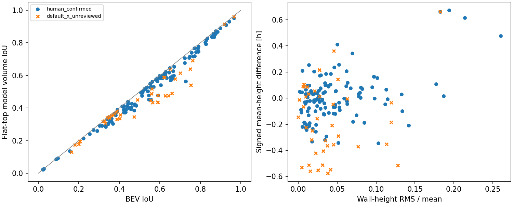
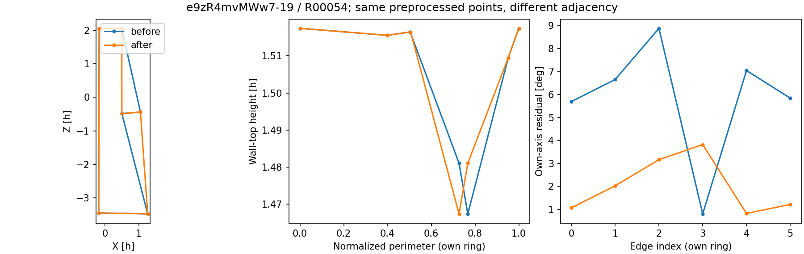
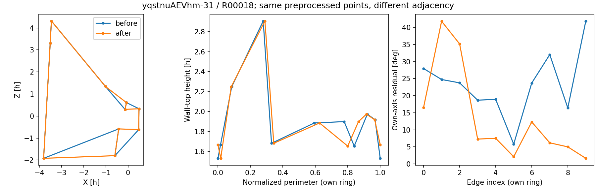

# 排序后的3D质量增量实验（2026-10-02）

本轮接续阶段2质量衡量研究。底面已有基线；新增墙体方向、沿边长积分的墙高诊断和水平顶面模型体积。没有拟合或修正原标注，没有人员分类、融合或候选生成。

## 样本与排序

沿用12图，扩展到这些图的全部195份作答。两种参考版本分别保留，共390行，其中117行缺参考。
排序状态：{'human_confirmed': 134, 'default_x_unreviewed': 48, 'unavailable': 13}。未人工确认的人员环按预处理共享x稳定升序；原始GT保留来源参考环。人工确认环保持原样。排除和受限场景保留作诊断，不恢复资格。
邻接改变17份，身份成功绑定17份；只在最终坐标上恢复旧邻接，不冒充历史坐标复算。既有15个有效比较的底面、边界和墙带逐字段核对通过：15个。

## 原始GT比较的描述统计

|作答层|记录数|模型体积可计算|BEV IoU中位数|体积IoU中位数|墙高相对RMS中位数|自身轴RMS中位数/度|
|---|---:|---:|---:|---:|---:|---:|
|human_confirmed|134|134|0.574524|0.546303|0.030462|7.017082|
|default_x_unreviewed|48|48|0.523000|0.435750|0.027483|1.966620|

各列按本指标可用作答计算，中位数差不是配对方法增益；完整状态和分母见CSV/JSON。该面板定向覆盖特殊情况，两个排序层不是随机分组，不能比较哪组人员更好，也不推断总体比例。

## 改序的空间影响

|图片|记录|绑定|旧环与新环BEV IoU|
|---|---|---|---:|
|e9zR4mvMWw7-19|R02444|ok|0.5849058103850158|
|e9zR4mvMWw7-19|R01884|ok|0.6780589780703594|
|e9zR4mvMWw7-19|R00377|ok|0.7065789845903229|
|e9zR4mvMWw7-19|R00565|ok|0.7412809513220378|
|e9zR4mvMWw7-19|R02122|ok|0.7618454325600059|
|e9zR4mvMWw7-19|R02463|ok|0.7580474868336905|
|e9zR4mvMWw7-19|R00225|ok|0.7539439823105152|
|e9zR4mvMWw7-19|R01783|ok|0.6780589780703594|
|e9zR4mvMWw7-19|R00054|ok|0.7602746660825231|
|e9zR4mvMWw7-19|R00509|ok|0.6358213421905449|
|e9zR4mvMWw7-19|R01329|ok|0.6600539908772167|
|yqstnuAEVhm-31|R00312|ok|0.5230451396952451|
|yqstnuAEVhm-31|R00018|ok|0.825055699983744|
|yqstnuAEVhm-31|R02451|ok|0.7892349578100896|
|yqstnuAEVhm-31|R01064|ok|0.5480899419750005|
|yqstnuAEVhm-31|R01349|ok|0.5480899419750005|
|yqstnuAEVhm-31|R01505|ok|0.5513582245595824|

## 本轮可以支持的发现

- 17份可比较改序中，17份相对原始GT的BEV IoU提高；增量范围0.057514–0.421657。这是两张定向图片的同坐标邻接对照，不是改序必然改善的一般证明。
- 182份原始GT可比较作答中，BEV IoU减模型体积IoU的配对差中位数0.022729、最大值0.212113。体积纳入高度后确实改变测量，但分数更低不证明更有效。
- 墙高整体偏差与内部高度起伏分别展示；底面、模型体积及自洽诊断不是同一个评价维度。当前数据不能据此选出最终质量权重。

改序图中每条曲线使用自身环序的边编号／归一化周长，横轴不是已建立的跨环墙面对应。

## 解释与边界

- 墙方向同时报告自身最佳轴与对应参考GT轴；低自洽残差不能证明接近GT。各版本GT轴只用于评价，不进入后续共识。
- 底面水平、墙面竖直由重建假设强制满足，不将其零残差计作质量证据。墙高是上下点结合固定相机高度推导的量。
- 水平顶面模型体积保留原底面，采用墙顶沿周长的平均高度；不是实测封闭体积。非平顶的信息必须同时看RMS、最大偏差及原高度数组。此模型不能表达顶面局部形状。
- 同高度时体积IoU退化为BEV IoU；不同高度下增加的是模型高度不一致信息，并非独立的新质量证据。体积IoU较低不代表评价更正确。
- 改序既改变区域，又改变边长和高度积分权重；即使各点高度不变，平均墙高也可能变化。不能把该变化解释为重新点击了顶点。
- 原始/人工GT分开，默认未审不冒充确认。近地平线、真实调平及停止范围解释限制保留；不自动判定人员错误。
- 本轮没有建立真实角点/整墙对应，因此没有新增真实点位RMSE或完整墙面距离。

## 复算与下一步

`python -B -m tools.thesis_main.analysis.layout_3d_quality_probe_20261002 --out analysis_results/layout_3d_quality_probe_20261002`

results.json保留逐项输入、资格、失败、参考版本与逐边结果；metrics.csv为摘要，order_comparisons.csv为改序对照。experiment_plan.json及field_contract.json说明口径。

先审阅指标分歧案例，再决定质量测量保留项；本轮不冻结总分、门限或体积方法。分片封顶、人员分类和人数曲线未启动。
