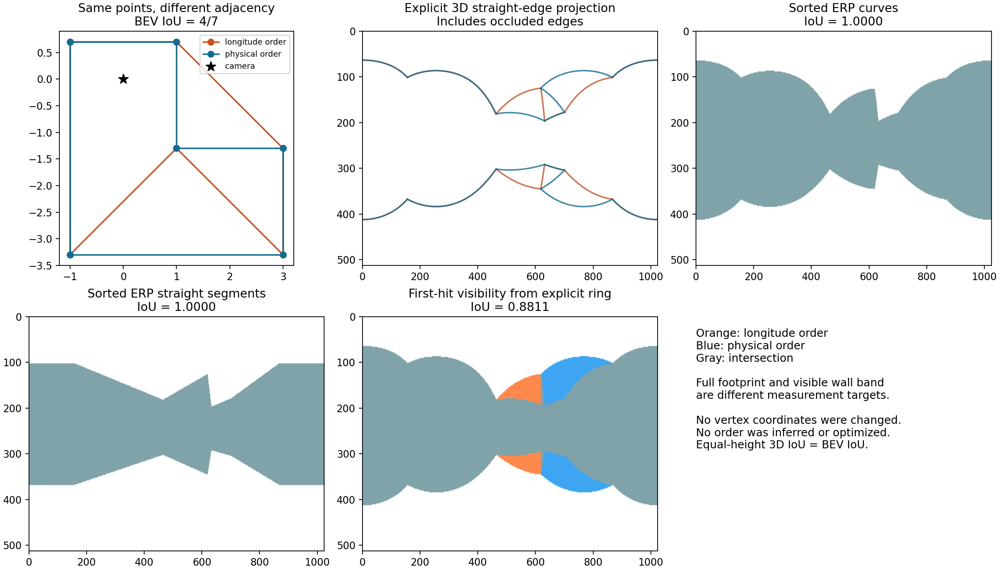
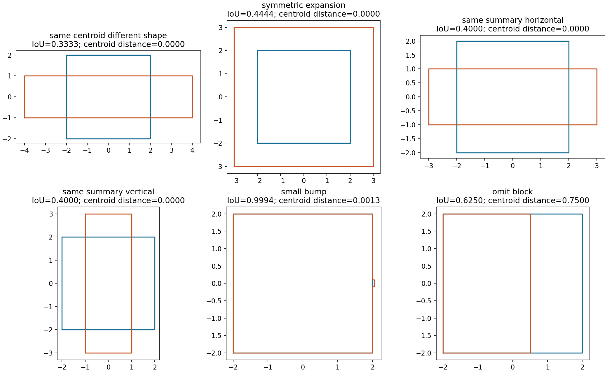
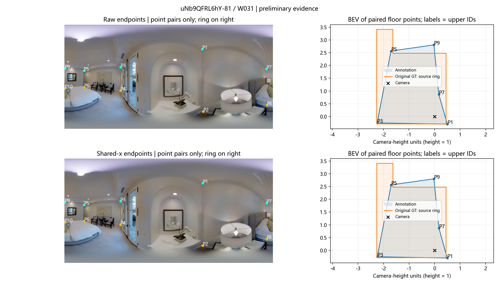
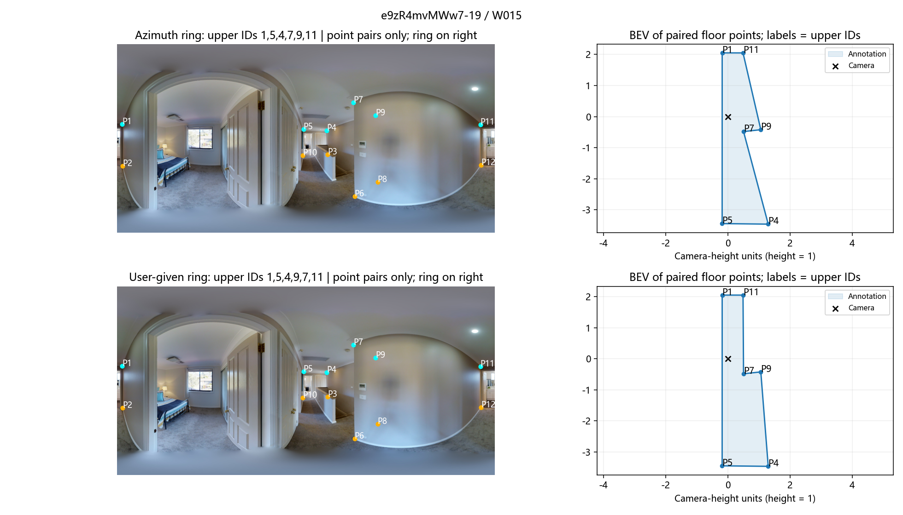
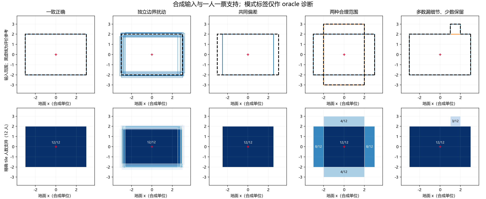
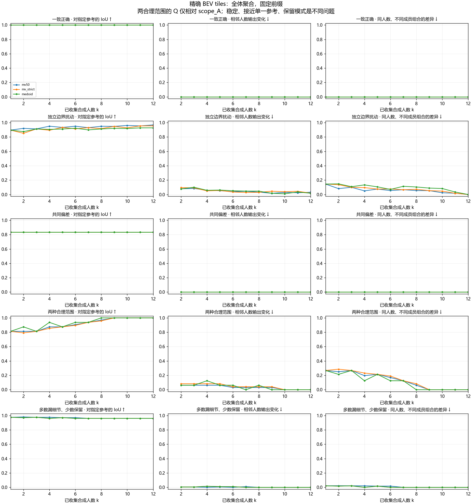
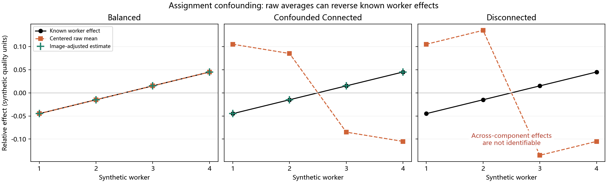

# 全景布局算法与数学初探（2026-09-26）

**结论：保留真实邻接的区域表示能揭示现有墙带丢失的差异；质心、IoU、RMSE 和几何残差各有不可辨识情况。** 本轮没有证实某个加权分数能普遍衡量人员质量，也没有建立最终多模式共识算法。

实际运行：13 个几何反例；5 类、12 名合成人员、8 个固定排列的共识实验；4 图／4 份有既有初审依据的真实候选；截图两份候选作答的两种指定连接；3 种人员—图片分配模拟。真实候选终审确认数仍为 0。

## 1. 邻接、曲线与三维 IoU

固定点位、只改变连接的 L 形反例，两种地面多边形都有效且包含相机：面积分别 10、12，交集 8，因此 BEV IoU=4/7。现有按 x 排序的曲线和直线墙带均给出 IoU=1；从显式墙环求最近射线交点的可见墙带 IoU=0.881056。

这不是“曲线不如直线”：当前 `pano_connect_points` 有空间直线投影依据。问题出在上游把显式邻接压成方位排序，以及完整占据范围与可见墙带本来就是不同测量对象。一般自由样条不能恢复丢掉的邻接。

普通语义分割的 IoU 只比较最终像素集合，本身没有“角点怎么连”的步骤。多边形标注通常先按给定边界顺序连直线并栅格化；逐像素掩膜则无需连点。全景 layout 的直线应首先在空间中定义，再投影到 ERP，不能直接照搬平面图像的直线填充。

本探针的理想几何：像素中心对应 `θ=2π((x+0.5)/W−0.5)`、`φ=π(0.5−(y+0.5)/H)`；相机已调平、地面平坦且相机高度为 h 时，地面角点的水平距离 `r=h/tan(−φ)`，平面坐标为 `r·(sinθ,−cosθ)`。竖直墙的地面直线写作 `n·P=d`，则该墙覆盖方位内 `r(θ)=d/[n·(sinθ,−cosθ)]`，墙底／墙顶曲线由 `atan2(−h,r)`／`atan2(Hroom−h,r)` 得到。这说明 ERP 弯曲来自投影模型；凹房间同一方位可能对应多条墙，最近可见墙与完整墙环须分开。

Skybox／立方体贴图也是像素到射线的表示变换。接入实际 Matterport 资产时应核对已有面序、旋转、拼接与相机约定；本轮仅验证仓库当前 ERP 投影及解析房间，不声称已重建原始拼接流程、消除拼接误差或恢复截图遮挡处的真实尺寸。



共同地面、共享尺度、恒定房高时：`交集体积 = 地面交集面积 × min(Ha,Hb)`，再除以并集体积。同高时体积 IoU 严格等于 BEV IoU；仅增加三维名称不会增加信息。只改顶高 2.7→3.4 时，BEV IoU=1，棱柱 IoU=0.794118，才体现高度信息。真实非平顶场景未强行使用此体积模型。

空间线段自身没有二维面积／三维体积。连线差异用有序区域及边界距离描述，不能直接套普通体积 IoU。本轮边界距离使用每个边界 512 个等弧长样点，最大距离明确为数值近似；没有把 Shapely 的顶点离散 Hausdorff 当连续边界真值。

## 2. 质心、加权分数与局部误差

若在区域 A 中删除 R、增加 D，面积质心变化为：

`c(B)−c(A) = [|D|(c(D)−c(A)) − |R|(c(R)−c(A))] / |B|`。

因此增删区域可以抵消；同质心不能证明范围相同。参考正方形为 [-2,2]²，横矩形 [-3,3]×[-1,1] 与竖矩形 [-1,1]×[-3,3] 的错误位置不同，但各自面积 12、交集 8、并集 20、IoU=0.4、质心均为 (0,0)。所有试验 λ 的 `Eλ=(1−IoU)+λ·dc/√参考面积` 均为 0.6。任何只读取这两个相同摘要的函数都不能区分它们。

这里的质心是区域面积质心，不是角点坐标的算术平均。准确共线增点不改变区域面积质心，却可能改变角点均值；“点多了质心是否变化”必须先说明采用哪种定义。



| 合成案例 | BEV IoU | BEV 质心距离 | 棱柱 IoU | 旧曲线墙带 IoU |
|---|---:|---:|---:|---:|
| 同点异邻接 L 形 | 0.571429 | 0.603692 | 0.571429 | 1.000000 |
| 同质心异形 | 0.333333 | 0.000000 | 0.333333 | 0.655934 |
| 对称扩张 | 0.444444 | 0.000000 | 0.444444 | 0.710000 |
| 横矩形局部差异 | 0.400000 | 0.000000 | 0.400000 | 0.678885 |
| 竖矩形局部差异 | 0.400000 | 0.000000 | 0.400000 | 0.678885 |
| 准确共线增点 | 1.000000 | 0.000000 | 1.000000 | 1.000000 |
| 循环换起点 | 1.000000 | 0.000000 | 1.000000 | 1.000000 |
| 反向遍历 | 1.000000 | 0.000000 | 1.000000 | 1.000000 |
| 小凸起 | 0.999375 | 0.001265 | 0.999375 | 0.999643 |
| 整块范围遗漏 | 0.625000 | 0.750000 | 0.625000 | 0.712446 |
| 只改顶高 | 1.000000 | 0.000000 | 0.794118 | 0.863531 |
| 已知对应角点的小变形 | 0.984888 | 0.011587 | 0.984888 | 0.994013 |
| 自交输入 | 不可计算／未定义 | 不可计算／未定义 | 不可计算／未定义 | 1.000000 |

所有长度使用共同相机高度 1；没有分别对齐、缩放每个房间。无效多边形返回不可计算，未自动修复或替换成 0 分。

ERP 接缝反例中，两区域共同循环平移后 IoU 始终为 1/3，普通 ERP 质心距离却由 64 变为 448 像素；圆周差保持 −64 像素，球面方向差保持约 0.392499 弧度。圆周／球面方向又可能因对称抵消而未定义，因此同时输出集中度，不把方向向量称作地面物理质心。

权重网格固定为 λ∈{0,0.25,0.5,1,2}。ERP 用固定图像对角线归一化，BEV 用参考面积平方根，球面方向使用角距离／π。全部结果保留在 JSON；没有根据真实案例挑选最佳权重。

RMSE 只使用合成生成器明确给出的角点身份对应，新增／未匹配点单独计数。同点异连接可能点位 RMSE=0，但区域 IoU<1；尺寸错误的矩形仍能有接近零的 Manhattan 方向残差。真实作答与 GT 缺少角点身份对应，本轮不按数组下标硬算点 RMSE，而报告边界距离与已有几何诊断。

实际反例：L 形两环的已知对应点 RMSE=0.000000，但 BEV IoU=4/7；准确共线增点的匹配点 RMSE=0，另外记录 1 个未匹配点。只改顶高时，地面 RMSE=0、顶点 RMSE=0.700000。方向残差针对每个布局拟合一个共同 Manhattan 朝向，不预先假定全景图的 0° 就是墙轴。矩形对称扩张前后均为零方向残差，仍不能证明位置和范围正确。

短边与地平线试验仅量化误差传播：相同位置噪声对短边方向影响更大；接近地平线时深度对像素变化更敏感。本轮没有据此冻结角度阈值、放宽规则或人员排除规则。

精确 180° 中间点在同高、共面、无额外语义的墙段中可几何简化，但冗余表示不等于标错；近 180° 也可能是真实微小转折。循环首尾邻接应一起处理，本轮不执行删点。

## 3. 真实案例：范围不同与细节缺漏继续分开

评论清单包含 95 图、240 份作答。连同既有初审及截图身份，共 252 份逐坐标核对原始导出；历史封存导出明确单列来源层级。评论中 234 份没有现成顺序证据、4 份已有未决、2 份属于初审候选。没有把他人评论移到所选作答上。

下表仅是条件几何对照，使用 shared-x 视图与原始 GT。四份候选都有既有“无需调整”初审依据，仍待用户终审；只有两例具有本探针使用的 GT 来源环依据。其余 BEV 留空，不以机器可计算替代邻接依据。

| 图片／作答 | ERP IoU | ERP 质心距离 px | 条件 BEV IoU |
|---|---:|---:|---:|
| S9hNv5qa7GM-08 / W037 | 0.880715 | 6.358512 | 0.833834 |
| VFuaQ6m2Qom-04 / W032 | 0.938039 | 3.116532 | 不可计算／未定义 |
| q9vSo1VnCiC-16 / W033 | 0.906545 | 1.894030 | 不可计算／未定义 |
| uNb9QFRL6hY-81 / W031 | 0.948696 | 3.448461 | 0.707339 |

ERP 与 BEV 的测量域和既有像素约定不同，上述数值差不能全部归因于单一算法步骤。本面板原始／修订 GT 入口实际指向相同参考，结果相同，不能据此声称已验证实质 GT 修订的影响。简单对照及双重问题样本不足，本轮没有开展新排序审查来补足配额。



你给出的 e9zR4mvMWw7-19 截图匹配 W015、W021 两个近乎相同的候选，不能仅凭截图唯一认定人员。分别比较 `1→5→4→7→9→11` 与你给出的 `1→5→4→9→7→11`，未保存为修序裁决：

| 作答／视图 | 两种环的 BEV IoU | 两种环的旧 ERP IoU | ERP 质心距离 px |
|---|---:|---:|---:|
| W015 / raw | 0.760637 | 不可计算／未定义 | 不可计算／未定义 |
| W015 / shared_x | 0.758047 | 1.000000 | 0.000000 |
| W021 / raw | 0.760637 | 不可计算／未定义 | 不可计算／未定义 |
| W021 / shared_x | 0.760275 | 1.000000 | 0.000000 |

原始上下 x 不同的输入被旧墙带明确拒绝，表中 raw 不可计算不代表错误标注。shared-x 之后，同一份点位的两种环被旧墙带压成相同区域；保留邻接的 BEV 则区分了两者。用户环的非星形可见性标记不等于多边形无效，也不构成本轮新的真假裁决。



预处理还有一个实测影响：这两份作答仅 P5 上点不同、下点完全相同，原始地面区域完全相同；共享 x 后上点差异会传给对应下点，地面 IoU 变成约 0.989。平均 x 是可研究的几何修正，并非对空间范围绝对中性的操作，故原始／修正两视图应继续并列。

## 4. 共识形成：稳定、正确与模式保留

合成输入每类 12 名人员，固定 seed=20260926、8 个无放回进入排列。BEV 在每个当前前缀重新构造精确叠加 tiles，比较 ≥50% MV、>50% MV、真实 medoid；ERP 比较上述三种及已有 EM／greedy 适配。聚合接口不读取 GT，参考只用于评价。后两种不是 Lee 算法完整复现。



| 合成情景 | k=1 的平均 BEV MV IoU | k=12 的 BEV MV IoU | k=12 的 ERP MV IoU |
|---|---:|---:|---:|
| 一致正确 | 1.000000 | 1.000000 | 1.000000 |
| 独立边界扰动 | 0.896074 | 0.967804 | 0.974425 |
| 共同偏差 | 0.833333 | 0.833333 | 0.940789 |
| 两种合理范围（此列参考 A） | 0.812500 | 1.000000 | 1.000000 |
| 9/12 漏掉真实细节 | 0.975000 | 0.960000 | 0.986888 |

共同偏差的 BEV IoU 始终为 5/6，人数增加时输出变化为 0；因此稳定不等于正确。多数漏细节时，投票稳定保留遗漏，而少数细节模式相对已知真值为 1。独立扰动场景整体有所改善，但中间并不单调；8 个排列只是算法行为例证，不是人群推断或真实收敛人数估计。

同人数的成员组合差异在 k=12 必然为 0，因为各排列此时包含完全相同的 12 人；这一端点不能作为“已证明收敛”的证据。8 人支持可以构成强的群体一致模式，但是否几何正确仍需单独判断；2—3 人是否足以称为共识也取决于总人数、分配和支持稳定性，本轮不冻结人数门槛。

两个合理范围均为四角、面积 24，但互不包含、彼此 IoU=0.5。只看点数最大／最小会遗漏这种差异。B 相对参考 A 得分 0.5，相对 B 的合理参考得分 1；不能把语义范围选择全部归为人员定位差。

全体、最大模式、各模式均已计算。模式身份来自合成生成器，明确是 oracle 诊断，证明“保留模式可能避免遗漏”的机制，不证明现实中的自动分簇已解决。各模式在前缀未出现时不输出；最大模式平票取当前前缀最先出现者，medoid 平票取最小合成人员 ID，均不使用 GT。



[ERP 五方法曲线](consensus/erp_three_curves.png) · [各模式保留对照](consensus/oracle_mode_routes.png)。完整记录空输出、分量和孔洞；聚合区域未再拟合成“合法房间”。本批未出现空输出、多连通分量或孔洞，相关最小反例另在测试覆盖。

## 5. 人员与图片效应

在明确给定的无噪声加性模型 `q=0.6+人员效应+图片效应` 下，只改变分配关系，原始均分的人员排序相关可从 +1 变成 −1。同图差分及两向效应调整在连通设计中恢复已知效应；不连通设计不能识别跨组人员差异，程序返回不可识别，没有用任意参照组补造排名。



精确恢复依赖本例的模型假设，不能外推为真实数据已拆解成功。每人每图一次观测不能完全拆开交互与同人随机波动；图片主效应也不能直接命名为数据不确定性。

## 6. 当前决策与后续边界

- 有依据的完整区域比较优先研究保留邻接的 BEV；可见墙带独立保留，二者不混作同一空间真值。
- 质心保留为位置分布诊断，尚不进入固定加权质量分；RMSE、边界差和自身几何残差分栏。
- 共识至少同时报告参考一致性、人数稳定性、成员组合差异与模式支持；共同错误和少数合理解释都要能被保留研究。
- HoHoNet 当前推断在一般多边形无效／不足四角时回退 cuboid；最终点少、正交不能直接证明图片简单。本轮未重跑模型或做难度分级。
- 二次复核、真实连接与合理参考确认后，才进行更大真实面板、权重外建筑校准、真实多人共识及人员画像；排序筛选继续暂缓。

## 7. 复算、来源与交付检查

```powershell
D:/anaconda/python.exe -m tools.thesis_main.analysis.explore_layout_metrics_20260926
D:/anaconda/python.exe -m pytest tests/test_explore_layout_metrics_20260926.py tests/test_layout_metric_probe_20260926.py tests/test_layout_consensus_probe_20260926.py tests/test_layout_real_case_probe_20260926.py tests/test_consensus_region_20260923.py tests/test_panorama_studio.py -q -p no:cacheprovider
```

输入身份与可用性见 [真实案例记录](real/real_case_probe.json)；[几何结果](geometry/geometry_results.json)、[共识逐前缀结果](consensus/results.json)、[人员效应模拟](effects/results.json)、[清单](MANIFEST.json)、[验证记录](VALIDATION.json)。

新增一个总入口、三个独立探针及四个最小测试文件；复用现有投影、几何和共识核心，未修改正式算法。目录索引登记的是探索产物，不替代当前合同。未修改原始导出、GT、二审页面／裁决、正式协议或人员排除；未进行全量排序和新筛选。

未运行全仓库测试：本次是独立小规模实验，相关几何、共识、真实来源和字段检查已纳入定向验证。正式研究图已目视检查并保留；临时测试目录和截图的清理状态见验证记录。

原始方法来源：[Lee 等，2018](https://ceur-ws.org/Vol-2173/paper10.pdf)；[Bi-Layout](https://arxiv.org/html/2404.09993v1)；[HorizonNet 投影实现](https://github.com/sunset1995/HorizonNet/blob/master/misc/panostretch.py)。Lee 的最大簇路线不自动适合保留所有合理范围；本轮没有使用缺失技术报告中的未核实细节冒充完整复现。
