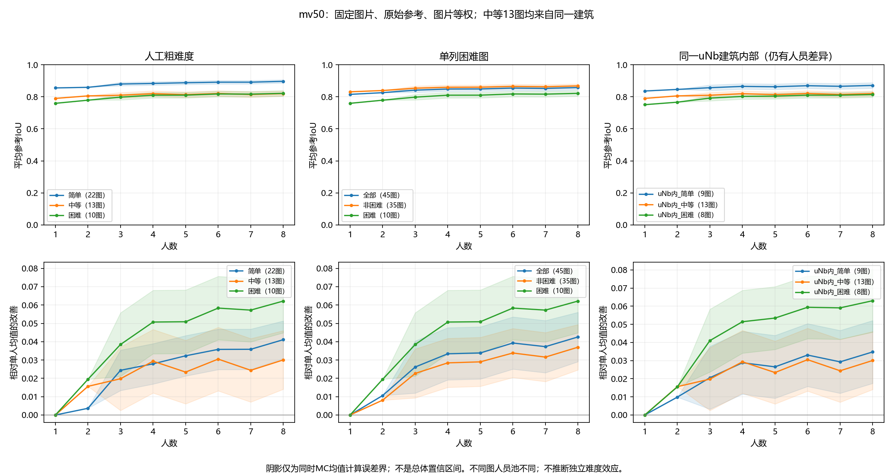
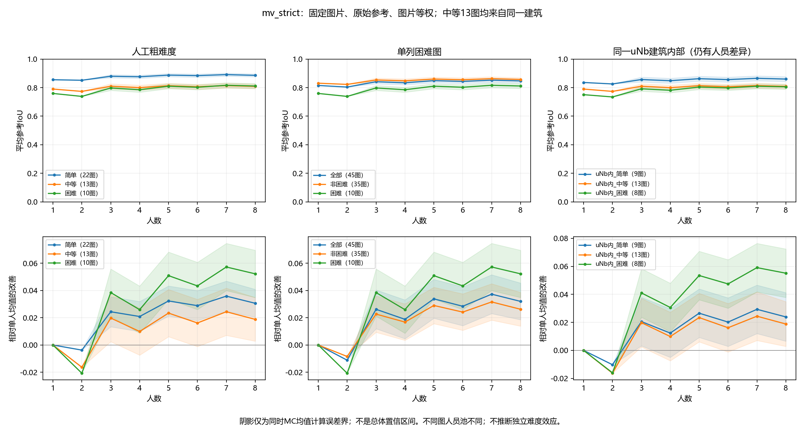
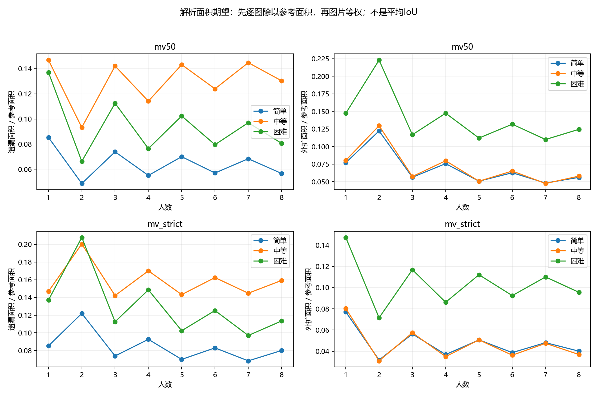

# S3-A：45图的粗难度与人数曲线

2026-10-03。合同 `consensus_research_20260923_v1`。本轮只实施已批准计划的第2部分：固定45图、1—8人、BEV与等权Lee tile融合。人员质量矩阵、分类、模型难度和三维增量均未在本轮开展。

**当前可以讲：简单组平均更接近固定GT，但困难组从单人到8人的增益点估计更大；不能把结果概括成“困难图一定改善更慢”。** 增益的组间差异仍须考虑计算误差，建筑与人员构成也没有被完全控制。本轮没有证明最佳人数、融合稳定速度或独立的难度效应。

## 1. 实际输入、方法与计算精度

沿用[S2预选名单](../research_panel_inventory_20261003/next_panels.json)，简单22图、中等13图、困难10图；每个k都使用同一45图。

- 固定输入保留45图全部724份作答：Manual 715份、Semi 9份。677份来自25位不同人员的Manual独立主候选参与本轮；38份其他Manual记录和9份Semi保留在输入，未恢复资格或混入投票。
- 每图保留完整候选池，N为8—24；从其真实不同人员中均匀抽取k人，不预先截取8人。677份参与者BEV均可计算，没有计算中删人。
- 原始参考覆盖45图；另有2份修订参考。共771个作答/参考对象完成当前bundle与S2身份、资格、顺序/状态绑定；757份可用坐标逐点与预处理来源索引完全一致，14份无坐标记录保持不可用且未参与本轮。记录见[source_binding.json](source_binding.json)。
- 输入已经预处理；确认环保留，其余使用共享x默认排序，原始GT保留参考环。没有重配、改点、拟合正交或修复多边形。
- MV50取支持率≥50%的tile；严格多数取>50%。GT只参与评价，切tile和投票不读取GT。全员tile仅作为离线积分细分，代表性子集另用当前成员重新切tile核对。
- N≤9的k点枚举；大组在1、2、N−2、N−1、N中落入1—8范围的点枚举，其余使用计算前固定的16384个独立均匀排列。两种规则和参考共用排列，重复成员集按出现频次保留。

共752个参考均值：288个精确值、464个MC均值。Hoeffding与union bound给出全部464个MC均值的**95%同时计算误差界±0.017319**，小于预定0.02计算分辨率。它不是人员/图片总体置信区间，也不是实际重要性阈值。设计在计算前落盘：[preflight.json](preflight.json)、[design.json](design.json)。

组内图片等权，组均值误差界取逐图界平均，不假设各图独立。增益减去同图、同规则、同参考的精确单人均值，所以该增益的MC界保持对应均值的界。比较两个组的增益，须同时考虑两边误差，不能只套一个点的界。

## 2. 主要结果：质量水平与增人收益不同

以下为原始GT、图片等权，8人列是组合均值，不是任意一组8人的保证。

| 粗难度 | 图数 | 单人平均IoU | MV50：8人 | MV50：增益 | 严格多数：8人 | 严格多数：增益 |
|---|---:|---:|---:|---:|---:|---:|
| 简单 | 22 | 0.8553 | 0.8964 | +0.0411 | 0.8859 | +0.0306 |
| 中等 | 13 | 0.7899 | 0.8200 | +0.0301 | 0.8087 | +0.0188 |
| 困难 | 10 | 0.7592 | 0.8214 | +0.0622 | 0.8114 | +0.0522 |

8人时，各组均值/增益的保守MC界分别约±0.01023、±0.01599、±0.01732。

简单组的单人起点和8人质量水平较高。困难组两种规则的增益点估计均最大，但不能据此直接宣布困难图“收敛更快”：起点不同，组间增益误差范围也有重叠。中等与困难在8人时的均值十分接近，不能把细小差异当成可靠排序，更不能为了符合预想调整标签。





两种规则在奇数人数得到相同结果，本轮全部奇数点核对差值为0；偶数差异包含平票处理的机械影响。MV50奇→偶只能扩张、偶→奇只能收缩，严格多数相反；IoU变化方向仍取决于增删区域与参考的关系。因此保留锯齿，不强制拟合单调曲线。

### 单列困难图之后

| 图片群体 | 图数 | 单人平均IoU | MV50：8人 | MV50：增益 | 严格多数：8人 |
|---|---:|---:|---:|---:|---:|
| 全部 | 45 | 0.8150 | 0.8576 | +0.0426 | 0.8470 |
| 非困难 | 35 | 0.8310 | 0.8680 | +0.0370 | 0.8572 |
| 困难 | 10 | 0.7592 | 0.8214 | +0.0622 | 0.8114 |

非困难组平均更接近参考，但从单人到8人的增益点估计小于全部组。当前支持的是“移出困难图后，所研究群体的平均质量水平更高”，不支持据此宣称算法改进，或剩余图已经更快达到稳定。被移出的10图完整单列。

### 同一建筑内部

45图有30图来自uNb9QFRL6hY：简单9、中等13、困难8。该建筑内MV50从单人到8人的均值分别为0.8360→0.8708、0.7899→0.8200、0.7507→0.8137，仍出现简单组水平较高、困难组增益点估计较大的描述。

这减少了跨建筑差异的一部分，但不能消除人员池、房间结构和任务分配差异。特别是全部13张中等图均来自该建筑，没有证据把这栋建筑的中等组推广到其他建筑。本轮不进行总体显著性检验。

## 3. 面积解释、下降个例与参考敏感性

遗漏/外扩用各图的解析面积期望除以该图参考面积后，再对图片等权平均；原始h²数值也保留。**这些量不是平均IoU，不能将期望交面积与期望并面积的比值冒充平均IoU。**

MV50困难组的平均遗漏比例由0.1370降至0.0806，外扩由0.1473降至0.1245；简单组分别由0.0853降至0.0566、0.0770降至0.0561。严格多数8人通常更保守：在本面板各组中，遗漏更多、外扩更少，不代表所有图片的IoU都按同一方向改变。



**uNb9QFRL6hY-67保留为反向个例。** 它的已有标签为中等，15人池中单人平均IoU为0.2957，8人MV50降至0.2055、严格多数降至0.1246。平均遗漏比例从0.6801升至0.7924/0.8749，同时外扩下降。这个固定参考下，增加人数的投票缩减了覆盖，不能称为质量改善。该发现不证明GT或人员谁错；本轮未做原图视觉裁决，也不按这条曲线重标难度或删除图片。

按8人相对单人的增益是否超过其MC界判断，MV50有38图正向、1图负向、6图在当前计算精度下方向未分开；严格多数为36/2/7。这只描述固定池计算结果，不是人群显著性检验或人员分类。

双参考只在uNb9QFRL6hY-45、uNb9QFRL6hY-65这同一2图配对：8人MV50原始/修订均值为0.8561/0.8888，严格多数为0.8610/0.9097。不能将修订版2图均值与原始版45图均值直接比较，也不由更高IoU判断参考视觉正确或选择投票规则。原始两版逐图值均在[image_curves.csv](image_curves.csv)。

逐图曲线：[第1页](per_image_1.png)、[第2页](per_image_2.png)、[第3页](per_image_3.png)、[第4页](per_image_4.png)、[第5页](per_image_5.png)。

## 4. 可以怎样写进论文，下一步做什么

本轮可使用的描述是：**在固定BEV表示、等权投票和当前人工粗难度分组下，简单组具有较高的参考一致性；增加人数对各组平均有帮助，但改善幅度与初始质量并不等价，困难组并未呈现必然更慢的改善，且个别图片出现参考一致性下降。** 这属于当前图片与人员池的描述，尚未证明图片难度的独立作用。

本轮已按计划完成第2部分。后续沿用批准的顺序：在24人共同完成的10图上建立IoU与面积质心分项矩阵，检查同图差异和跨图稳定性，再决定是否能支持人员分类。人员画像必须避开后续组合实验的目标建筑。不因为本轮曲线已经完成就宣称融合稳定性也已验证；若要讨论稳定速度，应另补成员/相邻融合变化的计算精度。

模型3D异常、d_model与BiLayout双输出逐项后续研究；本轮没有把它们并入难度定义。分簇、合理空间候选和同房预测不作为当前前置条件。

## 5. 复算、验证和边界

[固定输入](input.json)保留坐标、来源索引、顺序、所有作答资格及参考版本；[原始均值](curves.csv)、[逐图增益与面积](image_curves.csv)、[分组摘要](group_curves.csv)、[字段合同](field_contract.json)、[完整排列](orders.npz)和[人员映射](rosters.json)可追溯结果。

```powershell
# 固定数值输入复算，不重新接入原始数据
python -B -m tools.thesis_main.analysis.lee_difficulty_20261003 --input analysis_results/lee_difficulty_20261003/input.json --out analysis_results/lee_difficulty_recomputed
# 完整来源接入＋计算（本轮已执行；原始导出不修改）
python -B -m tools.thesis_main.analysis.lee_difficulty_20261003
python -B -m pytest tests/test_lee_difficulty_20261003.py tests/test_lee_tile_precision_20261003.py tests/test_lee_tile_stage1_20261002.py tests/test_research_panel_inventory_20261003.py tests/test_consensus_contract_20260923.py -q -p no:cacheprovider
```

- 先失败测试后实现；相关17项测试通过，覆盖固定k范围、条件隔离、精确投票、重复身份/缺几何、GT隔离、面积期望、固定图片组与MC误差传播。
- 当前合同JSON生成Markdown检查通过，68处本地文档/图表引用检查通过；8张科学图已直接查看，标题、图例与数据含义一致。
- 752行结果有限、IoU位于[0,1]；各分组成员跨k保持一致。全员积分与当前成员重切tile的最大面积差为4.20×10⁻¹⁵ h²。
- 保留2条`divide by zero encountered in symmetric_difference`警告，分别来自uNb-40、uNb-72的几何等价核验；未发现保存结果非有限或超出核验容差。不声称零警告或完成跨环境复现。[警告](warnings.json)、[几何核验](validation.json)、[验收与环境](acceptance.json)。
- 直接检查科学图表，无临时截图。未做新视觉审核、人员分类、总体显著性检验、全仓测试或跨环境复现，因为它们不属于本轮交付。
- 历史12图与16排列结果不覆盖；规范资格、GT裁决、原始数据和Label Studio运营不改变。合同阶段说明、统计计划、推进台账及地图/索引同步；仅本地提交，云端由用户自行上传。仓库原有其他未提交工作保持原状。
