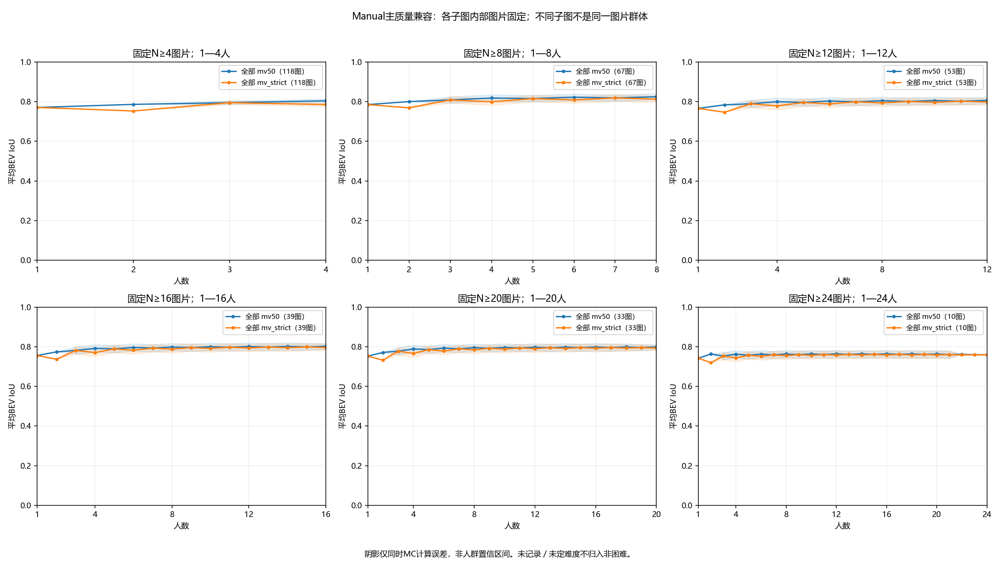
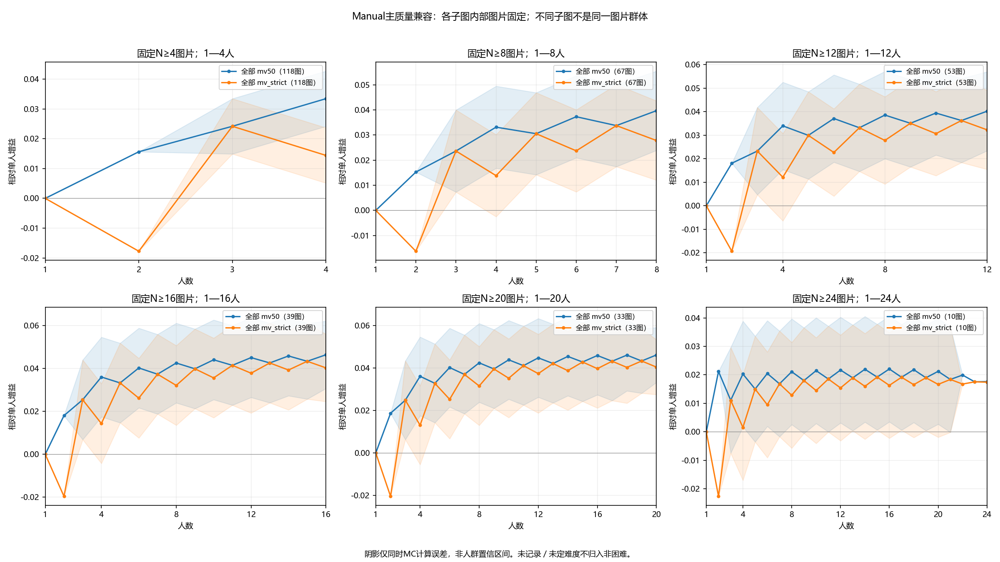
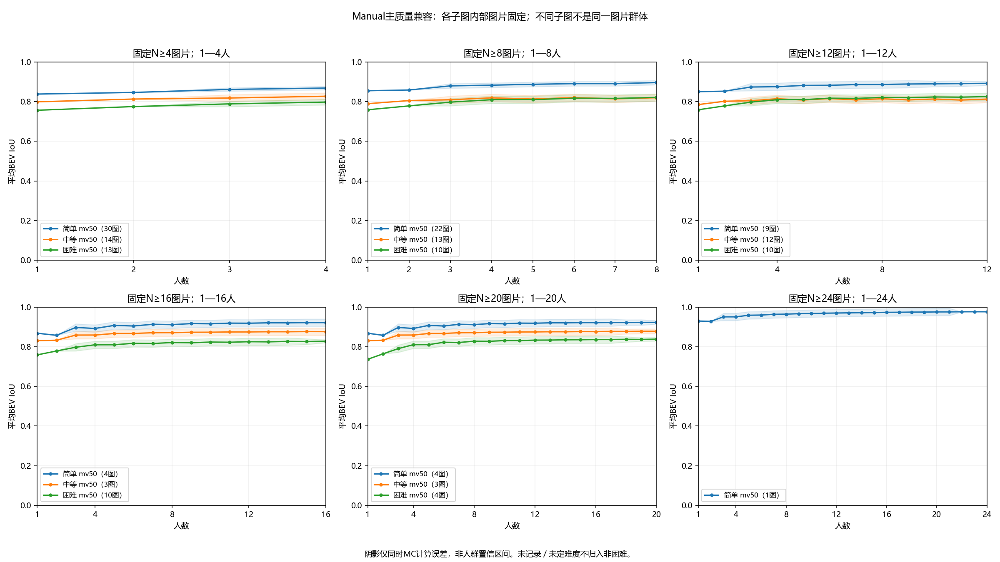

# 扩图与高人数分析：136图，逐图1—N，最多24人

2026-10-03。合同 `consensus_research_20260923_v1`。本轮执行用户追加的“增加图数与每图人数”，继续使用BEV底面、Lee tile等权投票和固定GT评价。原45图结果不覆盖。

**确实存在几十张高标注量图片，已纳入更长人数曲线。** 当前主分析有53张至少12人、39张至少16人、33张至少20人。固定33张高人数图上，MV50平均IoU从单人0.7529升至8人0.7953、20人0.7990；后段增益点估计较小，但当前精度不能证明8人足够。全员投票也不保证更接近GT：136图中，MV50有22图比单人平均更差。

## 1. 扩大了什么，哪些资料仍然保留

从S2全量盘点按已有Manual主质量兼容池筛选N≥2，不以难度是否已标、IoU高低或曲线好坏选图。137张尝试图片中136张整池BEV可计算，来自22栋建筑；1496份独立作答、25位人员参与。每图候选池N为2—24，逐图计算完整1—N。

- 136图全部1680份记录保留在分析输入，1496份进入当前条件与资格的投票，其他记录未恢复资格或混入投票。
- 加上失败图片，[来源输入](source_input.json)保留137图的1706份作答与149份参考。1855个对象绑定当前bundle及S2；1801份坐标逐点匹配预处理来源索引，54份不可用坐标状态保留。没有重做共享x、改点、改确认环或新增人工裁决。
- `rPc6DW4iMge-22`有24份独立候选，其中R01424坐标越过声明图像边界；整池保持不可计算，未删去这一人变成23人成功池。[完整选择台账](selection_ledger.csv)保留所有S2条件／资格池，[预计算计划](preflight.json)单列该失败。
- 原始参考覆盖136图；已有修订参考覆盖12图，只在相同图片的双参考组中配对。不将12图修订均值与136图原始均值直接相比。
- Semi中还有17个至少20人的主质量兼容池，但本轮保持条件分开，没有用Semi或OOS补足Manual人数。其他探索层也保留在台账，未恢复到人员主质量分析。

因此，“136图”是本轮可计算曲线的范围，不是完整数据只有136图；259图、3152份全量来源仍保留。

## 2. 同一条曲线必须使用同一批图片

逐图可以算到其N。跨图均值则预先固定人数窗口和图片集合：

| 共同人数范围 | 固定图片数 | 简单 | 中等 | 困难 | 未定／未记录 |
|---|---:|---:|---:|---:|---:|
| 1—4 | 118 | 30 | 14 | 13 | 61 |
| 1—8 | 67 | 22 | 13 | 10 | 22 |
| 1—12 | 53 | 9 | 12 | 10 | 22 |
| 1—16 | 39 | 4 | 3 | 10 | 22 |
| 1—20 | 33 | 4 | 3 | 4 | 22 |
| 1—24 | 10 | 1 | 0 | 0 | 9 |

另保存136图共同1—2人的结果。每个窗口内图片等权、各k图片不变；不同窗口之间不能接成一条人数曲线。例如1—8的67图与1—20的33图不同，均值较低不能解释为人数增加导致下降。

缺标签图片可以研究人数曲线，但不归为简单或非困难。三档粗难度的1—4人比较从原45图扩至57图；更长窗口的三档样本会减少。全部136图含简单30、中等14、困难13、未定1、未记录78。20人面板有22图缺明确三档标签，24人面板9/10图未记录难度，这是后续粗标签补充的优先范围，而不是自动生成标签的理由。

名单和分组见[固定面板](fixed_panels.json)、[固定面板逐点摘要](fixed_panel_curves.csv)。

## 3. 保持原算法，重新计算全范围误差预算

每个tile每人一票，MV50为≥50%，严格多数为>50%。GT仅评价。N≤9全枚举，大组k=1、2、N−2、N−1、N枚举，其余固定16384个独立均匀排列；重复子集保留频次，同图两规则／参考共用排列。全员tile仅用于离线积分细分，并核对当前成员重切tile的等价性。

3438个参考均值中1460个精确、1978个MC。Hoeffding界加union bound给出全部1978个MC均值的**95%同时计算误差界约±0.018553**，在运行前已确定，小于既定0.02分辨率。它不是人员或图片总体置信区间。

组界取逐图界平均；相对单人的增益减去精确单人均值，不额外扩大界。比较8人与20人时，两端都可能有抽样误差，保守界取两端之和。完整排列、身份映射与计算设计均保留。奇偶锯齿不平滑：MV50奇→偶扩张、偶→奇收缩，严格多数相反；这属于规则机制。

原45图的全部752个参考均值与本轮重算逐项一致，最大绝对差为0。新旧MC界不同是同时控制的均值数量增加，不是原均值改变。

## 4. 人数增加后的变化

以下每行是不同的固定图片面板，原始GT、图片等权；每行内部可比较，不横跨行解释人数效应。

| 面板 | 图数 | 单人均值 | MV50窗口末端 | 严格多数窗口末端 |
|---|---:|---:|---:|---:|
| N≥4，观察到4人 | 118 | 0.7708 | 0.8043 | 0.7852 |
| N≥8，观察到8人 | 67 | 0.7852 | 0.8249 | 0.8130 |
| N≥12，观察到12人 | 53 | 0.7661 | 0.8063 | 0.7984 |
| N≥16，观察到16人 | 39 | 0.7561 | 0.8025 | 0.7964 |
| N≥20，观察到20人 | 33 | 0.7529 | 0.7990 | 0.7933 |
| N=24，观察到24人 | 10 | 0.7422 | 0.7599 | 0.7597 |



在同一33图面板内，MV50的1／4／8／12／16／20人均值为0.7529／0.7890／0.7953／0.7977／0.7988／0.7990。单人到8人的增益约0.04246，8到20人约0.00372。严格多数的8到20人增益点估计约0.00889。

这可以描述为“当前固定池点估计的主要改善出现在前段，后段变化较小”。但33图的8与20人均值MC界分别约0.01855和0.01293，差值保守界约±0.03148，尚不足以判定这段小增益的方向或平台，更不支持足够人数或融合稳定速度结论。



10张24人图里，MV50的8人均值约0.7633，全员约0.7599；这个小回落也不能用当前MC精度判定。全员点计算精确、人员集合唯一，并不代表结果正确或总体不确定性为零。

## 5. 多数投票存在明确反向个例

逐图全员与单人均值都能精算。在当前136个固定人员池中，MV50有113图上升、22图下降、1图不变；严格多数为110／25／1。这里比较的是每图全员结果与该图所有单人的平均，不意味着该图每条进入顺序均下降，也不是人群显著性检验。

| 图片 | N | 单人平均IoU | 全员MV50 IoU | 差值 |
|---|---:|---:|---:|---:|
| uNb9QFRL6hY-67 | 15 | 0.2957 | 0.1093 | −0.1864 |
| UwV83HsGsw3-09 | 24 | 0.3291 | 0.1861 | −0.1430 |
| b8cTxDM8gDG-18 | 6 | 0.5018 | 0.4054 | −0.0964 |

这些结果说明等权多数可能强化共同偏离参考的区域选择；尚未看原图裁定GT、规则或人员谁错。保留个例，不因此删人、删图、重标难度或调整投票规则。逐图原始值与遗漏／外扩面积诊断见[image_curves.csv](image_curves.csv)，全员和单人点的MC界均为0。

## 6. 粗难度与论文故事线

57张明确标签图的1—4人MV50均值分别为：简单0.8384→0.8687、中等0.7992→0.8273、困难0.7567→0.7980。固定12人窗口的31张标签图则为简单0.8506→0.8924、中等0.7854→0.8129、困难0.7592→0.8256。



可继续讲“粗难度与参考一致性水平存在描述性对应；增加人数的改善幅度不等于起点水平，困难组不必改善更慢”。不能把两行不同面板当作同一组从4增加到12人的效果。1—4人中等组仅新增一张其他建筑图片；8人及以上的中等组仍全部来自uNb，难度与建筑／人员池混杂未消除。24人面板只有1张简单标签图，不能据此比较三档。

本轮补强A线的覆盖与人数长度。下一步仍优先在同样24人共同完成的10张Manual图上建立IoU和面积质心矩阵，检查同图人员差异、跨图稳定性和建筑留出，再决定人员分类及类型组合。刚完成的全员不改善案例可帮助提出问题，但不能用目标图曲线倒过来给参与者分类。

如果进一步讨论“多少人以后变化小”，应单独为同人数成员差异和增人变化补精度；参考IoU曲线的后段平缓不能代替这些量。模型线索与3D分项继续逐个推进，本轮未混入人员权重或精细难度模型。

## 7. 复算、验证与交付

```powershell
# 用本轮冻结来源与盘点复算到新目录；不重新接入上游
python -B -m tools.thesis_main.analysis.lee_expanded_20261003 --input analysis_results/lee_expanded_20261003/source_input.json --out analysis_results/lee_expanded_recomputed
# 默认入口接入当前bundle；已有结果目录拒绝覆盖
python -B -m tools.thesis_main.analysis.lee_expanded_20261003 --out analysis_results/lee_expanded_from_current
python -B -m pytest tests/test_lee_expanded_20261003.py tests/test_lee_difficulty_20261003.py tests/test_lee_tile_precision_20261003.py tests/test_lee_tile_stage1_20261002.py tests/test_research_panel_inventory_20261003.py tests/test_consensus_contract_20260923.py -q -p no:cacheprovider
```

- 复用既有Lee与精算／抽样核心，仅为来源绑定增加指定图片参数，并新增固定窗口汇总。先有失败测试再实现；相关19项测试通过，合同生成及引用检查通过。
- 5条几何核验RuntimeWarning保留：B6-47、uNb-40、uNb-72各1条，yqst-06两条。保存结果有限、IoU在[0,1]，当前成员与全员细分基底的最大对称差约4.20×10⁻¹⁵ h²；不宣称零警告或跨环境验证。[警告](warnings.json)、[几何核验](validation.json)、[验收](acceptance.json)。
- 原45图752个参考均值原值复现；完整失败池、未标难度、条件分层和所有逐图人数保留。[字段合同](field_contract.json)说明图片等权、误差传播与失败分母。
- 图表直接检查，科学图是正式交付，无临时截图。136图逐图曲线共12页：[第1页](per_image_01.png)、[第12页](per_image_12.png)，其余同目录顺序编号。
- 当前合同、统计计划、执行SOP、研究方向、状态及索引同步。未做全仓测试、跨环境复现、原图视觉裁决、人员分类或稳定性检验；这些不是本轮扩图交付。原始数据、既有资格与历史结果不改写，仅本地提交，未推送云端；无关未提交工作保留。
