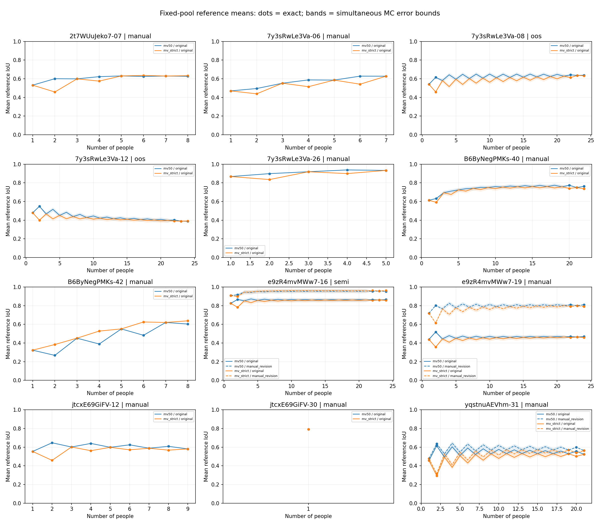

# 参考人数曲线精度补强与研究进度

2026-10-03。研究主线和下一步见[推进台账](../../docs/thesis_main/研究推进台账_20261003.md)，复算与证据来源见[研究入口](../../research/lee_tile_precision_20261003/README.md)。

## 已完成的数值工作

继续使用原12图195份作答、15份参考版本。177份独立候选来自24位人员，其余18份按既有资格保留覆盖。没有扩大图片、改变人员、排序、GT或几何。

- 6个N≤9组全枚举，其余6组枚举k=1、2、N−2、N−1、N；合计4554个成员集合，对应166个method/reference/k精确均值。
- 大组中间人数每组固定16384个独立均匀排列，得到326个MC均值；共492条参考均值曲线记录。
- 对所有MC均值同时使用95%计算误差界，半宽约0.017005，达到预定0.02均值分辨率。不根据曲线结果增加或减少抽样次数。
- 492条期望融合面积、参考交集、遗漏、外扩均用超几何尾概率解析求得；这些面积量不替代平均IoU。
- 保存完整排列、人员序号、种子、字段合同与原始人员分歧。单人组只展示点，不伪造增长曲线。

点为精确枚举；阴影为MC均值同时误差界。阴影不是人员组合的分布带，也不是人群总体置信区间。两条均值之差的保守计算界可取两端半宽之和；不能因每个均值误差小于0.02而认为任意差值也精确到0.02。

## 保留与修正的观察

| 固定池与规则 | 原16排列 | 本轮结果 | 含义 |
|---|---:|---:|---|
| 7y3sRwLe3Va-12，MV50，2人 | 0.640655 | 0.548886（精确） | 原抽样高估，已修正 |
| 2t7WUuJeko7-07，严格多数，2人 | 0.547016 | 0.457619（精确） | 原抽样高估，已修正 |
| jtcxE69GiFV-12，严格多数，2人 | 0.378121 | 0.458266（精确） | 原抽样低估，已修正 |
| 7y3sRwLe3Va-12，MV50，单人→全员 | 0.494059→0.388328 | 0.479262→0.388328（精确端点） | 固定参考均值下降保留，但它属于OOS探索层 |
| e9zR4mvMWw7-19，同一24人MV50对两版参考 | 原始0.469380；修订0.810395 | 不变（精确） | 参考版本改变解释，不能选高分版本当真值 |

7y3sRwLe3Va-12的MV50在k=6约0.484660、k=12约0.433636；这两个均值带上述计算界。不能把所有微小局部起伏都称为稳定趋势。MV50奇→偶仅扩张、偶→奇仅收缩；严格多数相反，IoU变化方向还依赖增删区域的位置。

## 验证与数值边界

- 新的4项测试先因缺实现失败，之后与原直接相关测试共同运行。覆盖离线细分与每个当前子集的一致性、均值与面积期望区别、GT隔离、重复人/缺几何、单人边界、误差设计与嵌套警告保留。
- 最终相关测试14项通过；当前合同JSON/Markdown一致性检查通过。测试命令见研究入口。
- 166精确均值与dot归档表最大差约4.44e−16；492项解析面积的最大差约1.07e−14 h²。对照来源保留，非从外部表抄出结果。
- 每组代表性子集用旧函数重新仅切当前成员的tile；最大形状对称差约1.01e−15 h²，并检查直接IoU与积分一致。
- 本轮2条 `divide by zero encountered in symmetric_difference` 出现在等价性核验；返回面积均有限并通过界限检查，完整组上下文见warnings.json。未隐藏为无警告通过，未声称解决原运行全部97条警告。
- 运行环境沿用本地原依赖组合。未重建dot的两套跨环境实验，未跑全仓测试；本轮不涉及运营、模型训练或原始采集。
- 图已直接查看；没有生成临时截图。原10/2结果不覆盖。

## 当前不应声称已完成的内容

本轮没有新的人员分类、类型比例实验、难度效应检验或完整layout总分。0.02只是均值计算分辨率；不是“足够人数”或质量有效性的界值。高人数固定池压缩仍存在。

旧成员Jaccard、增人Jaccard和p10/p90只有原16排列探索精度，本轮不为它们背书。`raw_disagreement.csv`是全池原始作答的面积分歧，不可改名为融合不确定性曲线。没有原图视觉裁决或GT重审。

下一步从完整数据包盘点粗难度标签、参考适用性、真人数与共同图片，形成A/B两线各自可比的面板。之后先做已有粗难度与曲线的描述，并在共同可靠图片上逐步建立人员画像；不把交叉效应模型设为前置。
