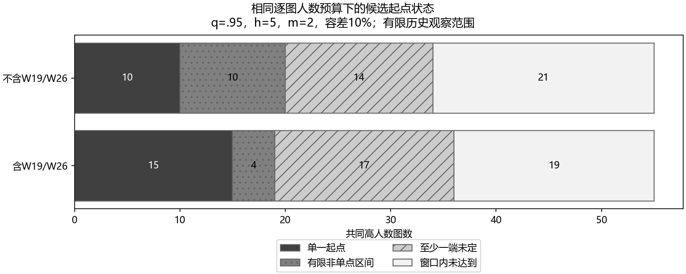
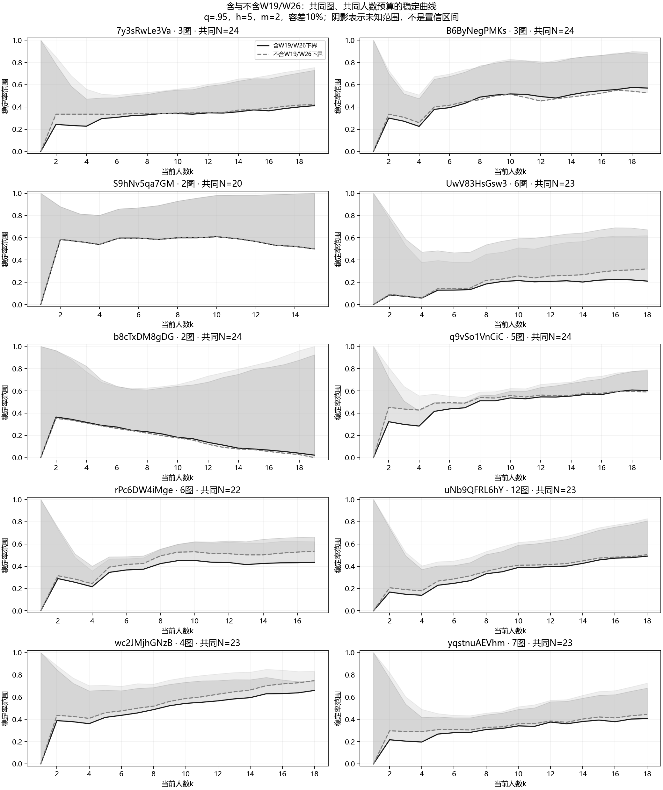
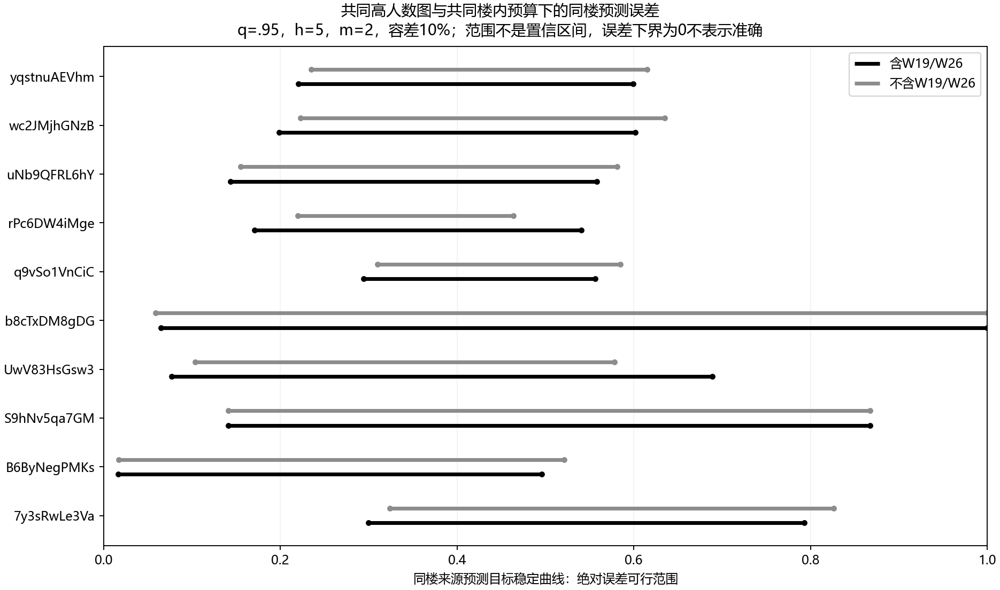
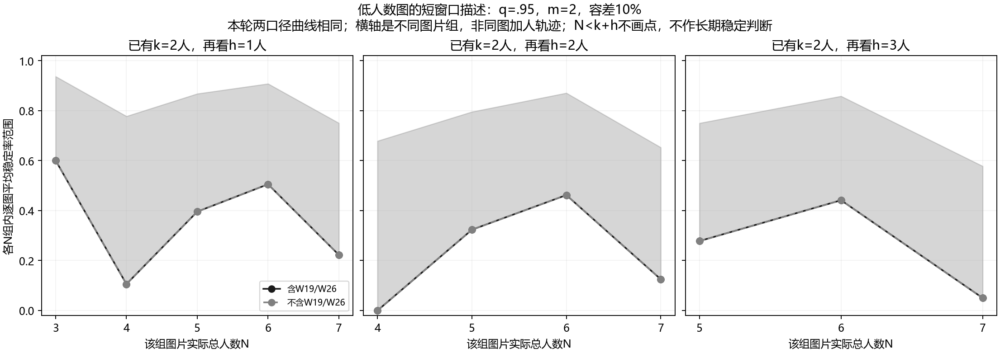

# 相似场景标注稳定性分析

更新：2026年9月9日。**并列计算包含W19/W26与排除这两人的情况，不预设主次。** 两组共同应用逐份确认的修复，另分别计算不补点版本。当前结果在 `revised/`；原 `geometry/`、`replay/`、`transfer/` 保留为修复前快照。方法入口为[统一SOP](../../docs/thesis_main/相似场景标注稳定性分析SOP.md)。

## 1. 分析问题与数据

问题是：**已有相似场景的标注，能否帮助估计另一张图大概需要多少人，标注结果才逐渐稳定？** 本研究当前直接将同一building内的图片作为相似场景分组；同楼留图就是本轮的相似场景预测检验，不以另行确认同室或同类房间为前提。每张图独立分簇，不要求源图和目标图出现相同具体类别；稳定地形成几个簇也允许算稳定。

所有阶段统一使用无辅助手工作答，包括已核实没有辅助的历史oos。Semi包含初始化影响，单独保留。旧阶段资格与人员排除标记仅用于追溯，不作为本探索的阶段准入规则。

原始入口保留214图、22楼、26人、2501份canonical响应。2513份版本记录中的额外12次修订不增加独立响应。当前累计8份删指定点、2份补指定点、4份暂时排除、1份旧确认歧义排除；30份空点和5份坐标异常保持状态。原始文件、坐标和点序不回写。

| 当前范围 | 包含W19/W26 | 排除W19/W26 |
|---|---:|---:|
| 历史图像库存 | 214 | 214 |
| 有可用无辅助响应的图 | 196 | 196 |
| 参与的历史人员 | 26 | 24 |
| 可用无辅助响应 | 1887 | 1843 |
| 高标注图（每图至少16人） | 55 | 55 |
| 高标注图的响应 | 1333 | 1289 |
| 低标注图（每图1–15人） | 141 | 141 |
| 低标注图的响应 | 554 | 554 |
| 至少能形成一个后续1人窗口的图 | 176 | 176 |
| q不可评价响应／全部可用响应 | 15／1887 | 11／1843 |
| q不可评价响应／高标注部分 | 13／1333 | 9／1289 |

第二种口径额外去除W19的38份和W26的6份，共44份。38张高标注图的人数变化：32张少1人、6张少2人；其他图不变。141张低标注图的身份、响应和两组回放结果完全相同。其他人员没有因旧实验资格被整体排除；已确认的个别异常响应仍按清单处理。

同图同人没有重复计数，同一个人会出现在多图中。逐图身份及人数见[库存对照](revised/comparison/image_support_comparison.csv)、[人数分布](revised/comparison/people_count_distribution.csv)。

## 2. 怎样计算“逐渐稳定”

**分簇门槛不是人数门槛。** 有效点数不同必须分簇。点数相同时比较几何，q取0.975、0.95、0.925、0.90、0.85、0.80；q越低允许的几何差异越大，它不是可信概率。另用无序球面点集OSPA对照：截断角距30度、同簇门槛6度，同样要求点数相等。

q需要上下点配对和边界表示。旧实验未保存最终修改后的墙面连接顺序，所以q可计算不等于已确认布局含义。缺失q保持未知，不填0，不将这类响应删除后把剩余子集称作整张图。放宽q不能修复漏点或不适用的几何表示。

每图复用200条全局人员顺序，依次加入第1、2、3……人；每个人数前缀独立分簇。相对于已有k人，逐一检查随后h=1、2、3、5人的各前缀，候选稳定同时要求：

1. 旧成员同簇关系的变化比例不超过容差。
2. 按后续分区比较前k人与后续前缀的簇比例，总变差不超过容差。
3. 没有簇相对于k从不足m人支持跨到至少m人；k时至少已有一个达到m人支持的簇。

m取1、2、3，变化容差取5%、10%、20%。低支持簇没有从成员和比例计算中删除。支持跨越也可能来自原单例获得支持或重新分区，不能全部叫作新语义类别。簇数大于1不直接阻止稳定。

所需分区不唯一、搜索截断、含q不可评价响应或前缀支持不足时记未知。稳定下界=确定稳定次数÷200，上界=(稳定+未知)÷200。**这是未知状态的范围，不是置信区间。**

人数摘要使用80%排列达标，要求从该k开始，之后所有保存节点持续达标。上下界给相同有限起点时列单一候选人数；不同但都有限时列区间；保守端未过线时列上限未定；连上界也没持续过线时列观察范围内未达到。没有足够后续响应的图单列“无窗口”。这些是事后摘要，不是看到k份即可停止采集的规则。

两组既保存各自全部人数结果，也按同图较小的总人数重新截断并计算摘要。少掉末尾1–2人导致的短观察窗口不被当作稳定改善。共同人数控制观察长度，仍不能把人员组成差异解释成个人的因果效应。

## 3. 高标注图的分簇与人数

q=0.95时，55图完整分区情况为：包含两人有38图唯一、5图不唯一、12图含不可评价响应；排除两人有41图唯一、5图不唯一、9图含不可评价响应。“唯一”指当前规则下分区唯一，不代表正确布局或人数已稳定。

下表使用**同图共同人数范围、后续5人、m=2、10%容差、80%排列达标**。每格四项依次为：单一人数／有限区间／上限未定／未达到，每行分母均为55图。

| 几何配置 | 包含两人 | 排除两人 |
|---|---|---|
| q=0.975 | 8／4／30／13 | 7／6／28／14 |
| q=0.950 | 15／4／17／19 | 10／10／14／21 |
| q=0.925 | 15／3／17／20 | 10／9／14／22 |
| q=0.900 | 13／5／14／23 | 13／9／11／22 |
| q=0.850 | 12／6／12／25 | 14／9／9／23 |
| q=0.800 | 12／6／12／25 | 14／9／9／23 |
| OSPA≤6° | 12／2／13／28 | 10／6／12／27 |

q=0.95时，能给有限候选人数或区间的分别为19/55和20/55。单一人数减少与有限区间增加同时出现，不能只选一个计数评价人员口径。此表也没有提供仅凭“更早稳定”选定最优q的依据。



小人数例子：`S9hNv5qa7GM_bd9faec23bb3462c94a5fbc6c0a3d5cf`共有20人，两组均为[1,2]。k=1尚无m=2支持，下界不能判稳定；保守起点为2。因此该区间不等于“完全没有人数信息”，也不意味着1份即可停止。

`uNb9QFRL6hY`的12张高标注图各自计算，部分结果如下。参数同上；完整12图见[人数对照](revised/comparison/common_onset_comparison.csv)。

| 图像后缀 | 共同总人数 | 包含两人 | 排除两人 |
|---|---:|---|---|
| `1096f195d3294cefa462add5ab0c342e` | 23 | 5 | 5 |
| `d02f87bbb0414146a7a15070110a0384` | 24 | 7 | 5 |
| `bcce4f23c12744c782c0b49b24a0331a` | 24 | 8 | 8 |
| `c1ebb8b34eb846ba9b5ce23b30b299a7` | 24 | 9 | 8 |
| `07a43087f1e54e3f828851d8e457a283` | 24 | 17 | 15 |
| `978d7a8eb0794936bd8fd092306e1dc5` | 24 | 保守端未定 | 保守端未定 |

`07a430…`的完整池分别有25人和24人，簇人数为[16,6,1,1,1]和[16,6,1,1]；上表的17／15则在两侧共同24人范围内求得。它得到候选人数时没有被要求只剩一个簇。上述各图的差异是跨图预测需要检验的内容，没有用目标结果预选“相似”源图。

## 4. 同building的跨图预测

已完成同楼留图。55张高标注图中，10楼各有至少2图，共50图进入楼内留图；另5张单独高标注图可以进入楼外基线。

每楼枚举非空源图与其互补目标图，共4404种有向划分。`uNb9QFRL6hY`的12图有4094种，包括2/10、4/8、6/6；6图楼包含2/4、3/3。每个人员口径、每种人数预算下保存7配置×4404=30828条预测记录。重排、重复划分和目标出现次数都不是新增独立样本。

源图的稳定率曲线逐图等权平均，预测目标图自己的曲线；目标响应只用于评价。楼外基线匹配源图数量和可观察人数，每种规模最多固定取50组，组合不足则枚举。两个人员口径的共同预算比较还使用相同楼外来源身份。

本节的共同总人数取该楼全部高标注图、两个人员口径的最小N；上节则是每张图两口径的较小N。例如uNb的楼级预算为23，上一节`07a430…`的逐图预算为24，二者用途不同。

误差是预测与目标稳定率区间之间的绝对差范围，再按节点、目标图及划分平均。以下为q=0.95、后续5人、m=2、10%容差的共同预算结果。**数值是0–1的稳定率误差，不是“相差几个人”。**

| building | 图数 | 共同总人数 | 包含两人：同楼／楼外误差 | 排除两人：同楼／楼外误差 |
|---|---:|---:|---|---|
| 7y3sRwLe3Va | 3 | 24 | [0.300,0.793]／[0.200,0.647] | [0.324,0.826]／[0.232,0.645] |
| B6ByNegPMKs | 3 | 24 | [0.017,0.496]／[0.119,0.580] | [0.017,0.521]／[0.134,0.574] |
| S9hNv5qa7GM | 2 | 20 | [0.141,0.867]／[0.197,0.727] | [0.141,0.867]／[0.199,0.711] |
| UwV83HsGsw3 | 6 | 23 | [0.077,0.689]／[0.106,0.632] | [0.104,0.578]／[0.137,0.594] |
| b8cTxDM8gDG | 2 | 24 | [0.065,1.000]／[0.106,0.761] | [0.059,1.000]／[0.105,0.762] |
| q9vSo1VnCiC | 5 | 24 | [0.294,0.557]／[0.192,0.558] | [0.310,0.585]／[0.222,0.556] |
| rPc6DW4iMge | 6 | 22 | [0.171,0.540]／[0.141,0.549] | [0.220,0.464]／[0.171,0.507] |
| uNb9QFRL6hY | 12 | 23 | [0.144,0.558]／[0.134,0.555] | [0.155,0.581]／[0.157,0.551] |
| wc2JMjhGNzB | 4 | 23 | [0.199,0.602]／[0.172,0.587] | [0.223,0.635]／[0.209,0.608] |
| yqstnuAEVhm | 7 | 23 | [0.221,0.599]／[0.190,0.595] | [0.235,0.615]／[0.213,0.591] |

两组各有70个“楼×配置”汇总，同楼与楼外误差范围全部重叠。不补点版本中，各自全人数预算的70组也全部重叠。目前这些范围没有确认同楼预测优于或劣于楼外；重叠也不是等效性证明。只取误差下界会把未知误认为预测准确。

人数误差已另存，只在源预测与目标都给出单一候选人数的子集中可计算，同时报告分母和未定状态。详见[共同预算汇总](revised/comparison/common_transfer_summary.csv)中的 `N_identified_pairs`、`N_MAE_identified`；重复配对数不是独立图数。





## 5. 低标注图与短窗口复核

141张低标注图中，1人20张、2人23张、3人10张、4人9张、5人54张、6人23张、7人2张。两种人员口径完全相同。下表为q=0.95、m=2、10%容差、80%排列达标；不同h不混合排名。

| 后续窗口h | 有窗口的图 | 无足够后续窗口 | 单一人数 | 有限区间 | 保守端未定 | 未达到 |
|---|---:|---:|---:|---:|---:|---:|
| 1人 | 121 | 20 | 10 | 32 | 33 | 46 |
| 2人 | 98 | 43 | 0 | 25 | 18 | 55 |
| 3人 | 88 | 53 | 0 | 25 | 23 | 40 |



另外用55张高标注图复核早期状态：同图、同次排列、同一k，比较h=1/2/3与h=5。k取2/3/4，短窗观察总人数k+h≤7；q=0.95、0.925、OSPA并列。每口径297000组配对，保留稳定／变化／未知的3×3计数。

例如q=0.95，已有4人，再加入1人后判稳定的排列，把观察扩大到随后5人：

| 口径 | 原短窗稳定次数（条件分母） | 延长后仍稳定 | 延长后变化 | 延长后未知 |
|---|---:|---:|---:|---:|
| 包含两人 | 5997 | 2278（38.0%） | 3463（57.7%） | 256（4.3%） |
| 排除两人 | 6296 | 2878（45.7%） | 3187（50.6%） | 231（3.7%） |

每行来自55图×200排列的11000次回放，其中先判短窗稳定的才进入表中分母。未知没有并入变化。h5包含短窗口，所以这是同一历史序列的延长检查，不是独立新样本，也不是141张低标注图的预测正确率。原表：[包含两人](revised/with_workers/short_window_check/summary.csv)、[排除两人](revised/without_workers/short_window_check/summary.csv)。

## 6. 几何审查与补点敏感性

<a id="geometry-audit"></a>

此前55图有26份q不可评价响应。已逐份查看，9条用户判断为：①②④⑧⑨删指定点；③原样保留；⑤⑥补对应下点；⑦整份暂排。另将W26三份只有1或2点的明显不完整响应暂排。两份28点是搜索预算不足，修复共享搜索实现后恢复，无须修改坐标。

配对实现改为按连通分量搜索，目标、候选条件、全图歧义判据和原点序快速路径保留。两份28点的最优成本20.99198463695501、次优31.535099180069608，与独立诊断一致，各需2312个预算节点。其他未经确认的奇数点不自动修复。

两份补点保留原有上点，追加经用户看图确认的下点，记录参照同图他人的派生来源。**它借用了完整历史池信息，不能当作原标注者独立提供的点或无信息泄漏的前缀证据。** 两个人员口径均另算不补点版本，恢复两份原9／11点响应，不删其上点，也不整份删除。

| 几何视图 | 可用响应 | q不可评价 |
|---|---:|---:|
| 包含两人，采用确认补点 | 1887 | 15 |
| 包含两人，不补点 | 1887 | 17 |
| 排除两人，采用确认补点 | 1843 | 11 |
| 排除两人，不补点 | 1843 | 13 |

两张补点图均重算全部7配置和h1/2/3/5；其余194图的几何与成对指标逐值相同后复用曲线，来源见各 `no_imputation/replay/REUSE_QA.json`。这不是重新跑了196图。

q=0.95、h5、m2、10%容差下，两张补点图在两个人员口径、有无补点时均未确定保守人数上限。补点减少不可评价状态，但没有把它们变成已确定稳定人数的例子。OSPA下也没有从未定／未达到变成一个已确定的稳定人数。完整变化见[补点图人数](revised/comparison/imputation_affected_image_onsets.csv)、[补点图分簇](revised/comparison/imputation_affected_q_partitions.csv)。

精确身份、索引、坐标和原话见[用户决定](geometry_audit/USER_DECISIONS.json)、[补点参照](geometry_audit/ADD_POINT_PROPOSALS.json)。[原26份诊断](geometry_audit/records.json)的坐标与失败原因是修复前快照；当前状态以reviewed计算视图为准。没有新增3D审查。

## 7. 输出、复现与限制

| 入口 | 粒度与用途 |
|---|---|
| [审查后计算视图](../confirmed_point_calculation_view_20260909_v1/reviewed/calculation_view.jsonl.gz) | 2501条canonical，原始／有效点、处理和补点来源 |
| `revised/with_workers/`、`revised/without_workers/` | 并列口径，各有geometry、replay、transfer、short_window_check和no_imputation |
| [共同人数曲线](revised/comparison/common_budget_curves.csv.gz) | 每图×配置×h×m×容差×k；两组状态、上下界和差范围 |
| [各自人数](revised/comparison/own_budget_onsets.csv)、[共同人数](revised/comparison/common_budget_onsets.csv) | 每图×参数×人员口径；空值表示未给出该字段的有限人数，结合状态和两端读取 |
| [状态分母](revised/comparison/onset_state_summary.csv) | 分高／低人数群体，单列无窗口图与四种人数状态 |
| [共同预算预测](revised/comparison/common_transfer_summary.csv) | 楼×配置×源图数×口径；误差界与人数误差分母 |
| [几何回读](revised/GEOMETRY_READBACK.json) | 2501份原始身份／坐标、四套几何及同点数门 |
| [回放回读](revised/REPLAY_READBACK.json) | 全量缓存分区、窗口聚合及首末排列独立公式核对 |
| [汇总检查](revised/comparison/QA.json) | 节点覆盖、共同预算、身份、复用来源与4图实际阅读 |
| [交付检查](revised/DELIVERY_CHECKS.json) | 实际命令、数量、测试、文件字段和文档链接 |

两组分别保存7914200／7667800条窗口记录、356139／345051条聚合曲线。行数大来自排列与参数，不是独立样本多。20张单人图保留库存和成员，不生成后续窗口。

复现顺序：以用户决定生成reviewed计算视图；用 `analyze_q_thresholds_20260909` 的 `--input --out --min-workers 1` 生成几何，第二口径额外传 `--exclude-workers 19 26`；不补点额外传 `--no-imputation`。用 `replay_multibuilding_stability_20260909` 的 `--geometry-dir --out --lookaheads 1 2 3 5` 回放，不补点仅用 `--image-ids` 指定两张受影响图。用 `transfer_multibuilding_stability_20260909` 的 `--inventory --curves --out` 执行高人数留图。最后运行：

```powershell
.venv/Scripts/python.exe -m tools.thesis_main.analysis.review_multibuilding_thresholds_20260909 --paired-root analysis_results/multibuilding_threshold_stability_20260909_v1/revised
```

完整实际参数和短窗复核命令保存在交付检查。修复共享配对实现及探索脚本没有改变正式Paper A方法合同、人员资格或实验派发，也没有改写原始导出。

提交前37项相关测试通过；独立回读核对3185868份缓存分区、15582000个窗口与701190条曲线，并在首末排列独立重算55668个窗口。4张当前统计图已实际查看。未运行无关全仓库测试；本地提交记录以Git历史为准，本轮未上传远端。

本轮未进行新人员验证、两类模型拟合、最终q选择或正式停止规则验证。按当前“同一building即相似场景分组”的定义，相似场景预测与楼外预测的误差范围仍重叠，尚未确认预测优势；这也不是等效性或不存在规律的证明。现有数据已完成该定义下的初步留图检验，后续继续沿用building分组，进一步确定稳定判据与新实验的每图人数。
