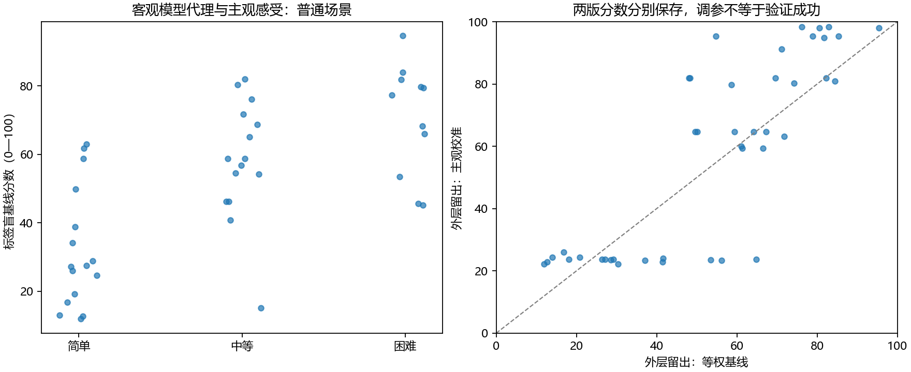

# 图片客观难度评分：首轮实算

2026-10-09。用户要求先探究客观标准，再与主观感受对比调参。本轮独立计算标签盲基线，随后完成按建筑内外层留出的主观校准。评分仅为可复现的模型代理候选，不宣称已识别图片固有难度。

## 评分标准与覆盖

统一259图库存：实际读取259图，完整评分156图；普通场景完整136图，其中主观三档42图。缺特征不补零，不用不一样的特征组合混排。

特征按预设正方向取经验中秩百分位；仅完整特征共同面板等权平均得到0—100分。正方向和等权都是待验证假设，不是已经证明的难度规律。reference.json冻结参照集和原始数值，以便新图按相同参照计算。分数高表示这些代理信号较强，不等于人一定难标。

| 特征 | 定义 |
|---|---|
|hohonet_offline_pair_count|HoHoNet ep300离线重放原数组中的上下点对数，未经新的人为修正；不是历史实际预标注暴露点数。|
|d_model_feat_static|历史global图像描述符经冻结reference PCA与scale变换后，到reference描述符5近邻的平均欧氏距离；图像分布偏离。|
|bilayout_floor_gap|同一BiLayout模型enclosed/extended头，按源点序、相机高度归一化声明底面之间的1-IoU；只接floor_status=computable。|

## 与主观感受对比及调参

主观标签未参与基线。校准只用普通场景；外层目标建筑标签和特征均不参与训练参照或选权重。内层留建筑选非负少量权重，保留每折名单。标签映射0/0.5/1用于校准损失，是工作约定，不说明等级天然等距。

标签来源：{'analysis_results/candidate_selection_review_20260913_v2/用户审查原始记录.json': 24, 'resolved_image_traits': 15, 'analysis_results/difficulty_full_20261007/updated/human_review.json': 3}。9/13审查台将难度解释为对歧义和共识稳定过程的主观预期；后续标签也是人类主观判断。因此本轮检验的是对历史主观三档的匹配，不是认证固有人类执行难度。

| 外层留出结果 | 有标签图数 | 建筑数 | Spearman | 序对一致率 | 建筑等权MSE |
|---|---:|---:|---:|---:|---:|
|baseline_score|42|14|0.6567|0.8193|0.1122|
|calibrated_score|42|14|0.8197|0.9191|0.0646|
|hohonet_offline_pair_count|42|14|0.8197|0.9191|0.0646|
|d_model_feat_static|42|14|0.5299|0.7418|0.1703|
|bilayout_floor_gap|42|14|0.1923|0.5998|0.1978|

本轮校准的建筑等权损失低于等权基线；仍需结合秩关系及后续验证，不以一项下降认证评分。

全普通面板的内层留建筑选权为[1.0, 0.0, 0.0]，特征顺序见上表。calibrated_reference.json冻结此主观校准候选；它已经使用标签，不能改称独立标签盲客观基线。若只偏好点数，说明这批标签下其它代理没有增加校准收益，不证明真实难度只由点数决定。

## 与既有实际任务结果连接

以下只复用普通Manual、质量兼容、原GT的Lee区域结果。同一人数窗口内图片固定，分数未由这些结果调参；不同窗口不拼接。相关关系不识别独立图片效应。D不是1−IoU。

|规则|人数窗口|结果量|图数|建筑数|Spearman|
|---|---:|---|---:|---:|---:|
|mv50|8|D1|19|7|0.6632|
|mv50|8|D_limit|19|7|0.5895|
|mv50|8|V_limit|19|7|0.3544|
|mv50|8|gain_1_limit|19|7|0.2316|
|mv50|8|gain_4_limit|19|7|0.0860|
|mv50|16|D1|16|7|0.7176|
|mv50|16|D_limit|16|7|0.6824|
|mv50|16|V_limit|16|7|0.2324|
|mv50|16|gain_1_limit|16|7|0.3265|
|mv50|16|gain_4_limit|16|7|0.0235|
|mv50|20|D1|13|6|0.7198|
|mv50|20|D_limit|13|6|0.7308|
|mv50|20|V_limit|13|6|0.4088|
|mv50|20|gain_1_limit|13|6|0.4121|
|mv50|20|gain_4_limit|13|6|-0.1484|
|mv_strict|8|D1|19|7|0.6632|
|mv_strict|8|D_limit|19|7|0.6070|
|mv_strict|8|V_limit|19|7|0.3211|
|mv_strict|8|gain_1_limit|19|7|0.0807|
|mv_strict|8|gain_4_limit|19|7|0.3246|
|mv_strict|16|D1|16|7|0.7176|
|mv_strict|16|D_limit|16|7|0.6794|
|mv_strict|16|V_limit|16|7|0.2353|
|mv_strict|16|gain_1_limit|16|7|0.2059|
|mv_strict|16|gain_4_limit|16|7|0.4412|
|mv_strict|20|D1|13|6|0.7198|
|mv_strict|20|D_limit|13|6|0.7418|
|mv_strict|20|V_limit|13|6|0.3757|
|mv_strict|20|gain_1_limit|13|6|0.3681|
|mv_strict|20|gain_4_limit|13|6|0.4780|
|raw_answers|0|raw_pairwise_union|16|7|0.5912|

本轮与参考差异水平及部分原作答分歧有关；后段改善量的关系随投票规则、人数窗口变化，没有一致支持高分图增人后收敛更慢。gain为起点D减终点D，正值表示参考差异下降；它受起始误差影响，不等于达到同一目标所需人数。

## 科学边界与后续判断

- 点对数受模型后处理与四角回退影响，只是表达复杂度代理；实际回退证据未知时不推断正常或遮挡。
- d_model保持历史特征距离含义；BiLayout差异保持已核查表示定义。两者不是GT或独立人员票。
- 范围参考差、定位、细节遗漏及任务可标性分别解释；低范围误差不能认证简单，远离GT不能直接归因难度。
- OOS、门洞与未定状态保留，未纳入普通场景主观校准；分数对这些场景仍是模型代理。
- 多次人数抽组不是新增图片；表内相关、序对数和折数不作为独立证据数量。部分标签来自事后审核，不能宣称盲标验证。
- 特征缺失及模型版本覆盖会选择样本；当前分数不能外推到全部259图。
- 上游静态特征库、PCA及模型checkpoint没有按本轮每折重新拟合；留建筑评价只隔离本轮归一化和主观调参，不能宣称全链条新建筑独立验证。
- 本轮没有自动划分简单／中等／困难，也没有从主观标签推导真值；评分方向、等权及特征有效性仍是待检验标准。
- 下一步围绕分数与人工判断显著不一致的图核对真实结构、遗漏与回退证据，区分特征无效和主观口径不同；不按目标GT或主观意见逐图改分。

## 文件与复算

`features_and_scores.csv`保存全图库存、原特征、来源、单轴百分位、基线、主观标签与全数据拟合的校准候选；`reference.json`冻结无标签参照，`calibrated_reference.json`冻结主观校准候选；`holdout_predictions.json/csv`保存外层预测、权重和训练建筑；`response_comparison.csv`与`response_metrics.csv`保留人数对照；`field_contract.json`固定公式和边界。全库标签盲基线、全普通校准候选和外层留出基线的归一化参照不同，数值不能混用。

方法依据：调参和性能评价分开，参见[Cawley与Talbot关于模型选择偏差](https://www.jmlr.org/papers/v11/cawley10a.html)；预处理仅在训练侧拟合，参见[交叉验证文档](https://scikit-learn.org/stable/modules/cross_validation.html#data-transformation-with-held-out-data)。本轮分组单位依据仓库统计计划使用建筑。

复算：`.venv/Scripts/python.exe -m tools.thesis_main.analysis.difficulty_score_20261009`。未重建研究输入、运行模型或改源标签、GT、人员资格、融合规则。图为保留的科研产物；本轮没有临时截图。

