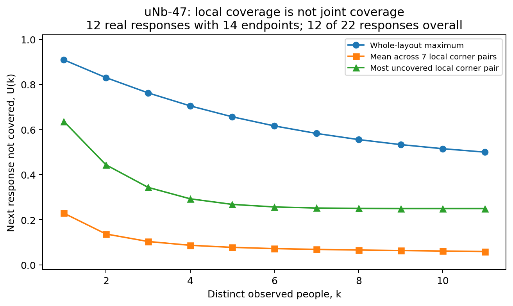
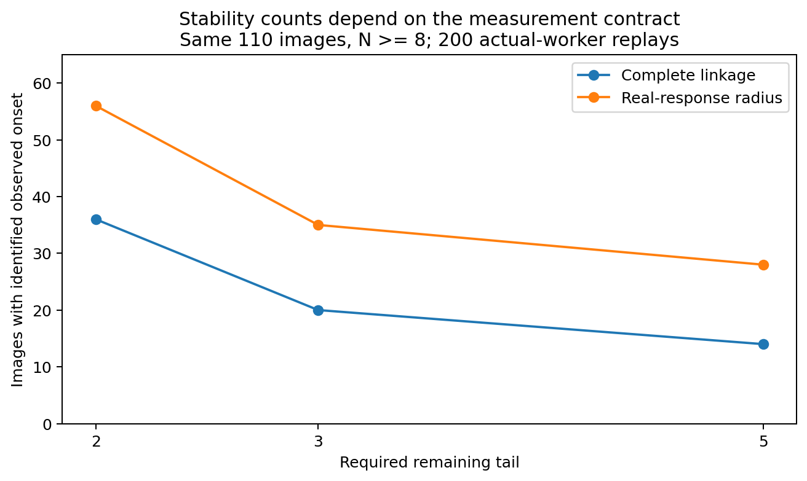
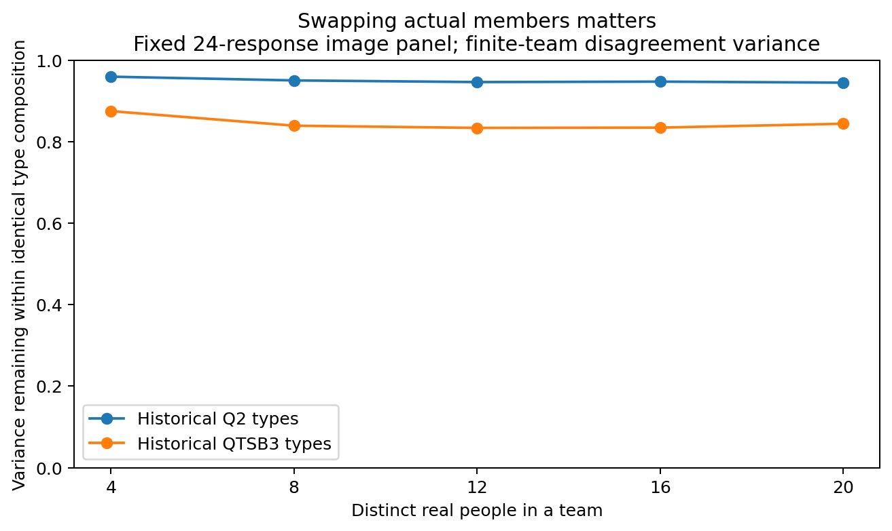
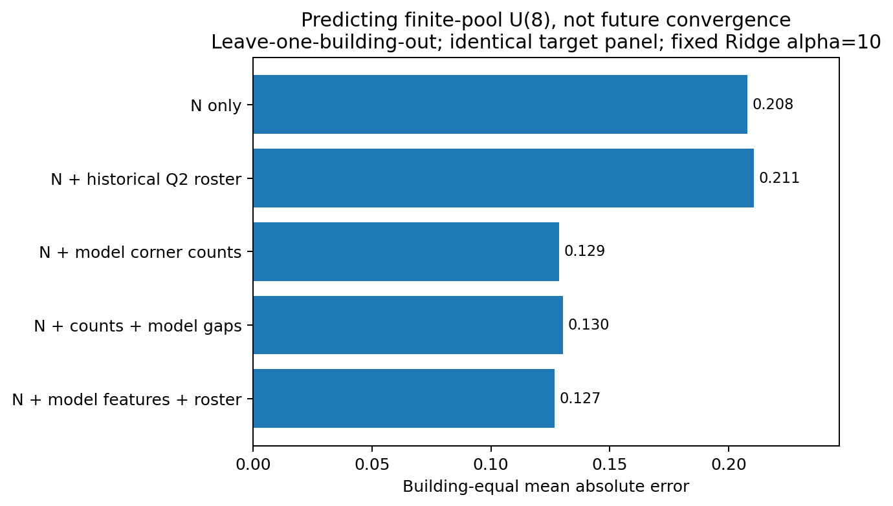
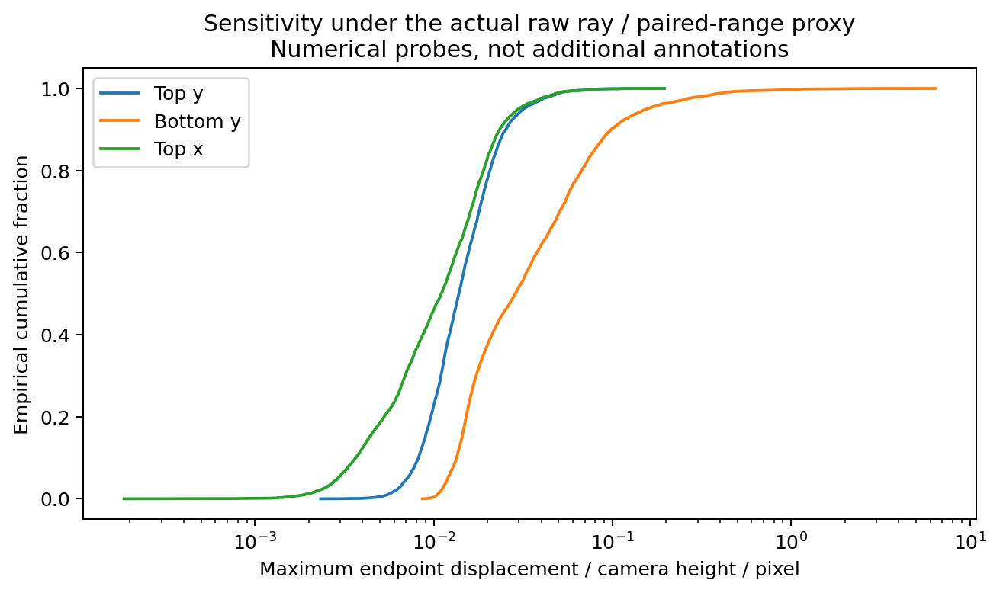

# 真人全景布局标注不确定性：终审数据的独立诊断与迁移检验

**研究日期：2026-09-21｜版本：independent_diagnosis_v1**  
**源仓库：Sparkling-Flames/3D_Manhattan_label｜指定分支：codex/pro-research-20260921**  
**计算输入固定于提交：`ce43b2883f63ec1538cffdfe5feca8e2b24518dc`**

## 核心判断

**目前“不理想”的结果，不能简单解释为真人标注太差、人员分类不够好，或同房之间没有关系。更准确的诊断是：研究同时混合了完整表达的严格一致、局部几何差异、少数表达的发现、分布份额变化和有限观察尾段；这些对象对方法及样本结构的要求不同。**

本轮实际计算支持以下判断。

**第一，测量规则实质影响结果，但尚不能把不稳定按百分比分成“真歧义”和“算法错误”。** 19,196个作答对中，7,748对首先因有效点数不同而被严格整图距离分开。同点数且超过25.6像素的3,879对中，1,654对只涉及一个角对超阈值。因此，“整图不同”经常不是“各局部都不同”。但点数不同可能来自真实结构、遗漏、范围或冗余细分，不能直接算成算法伪差异。

**第二，局部表达与整图组合需要分开研究，但“局部已稳定”不能泛化到全库。** uNb-47的14点子池包含12名真人，观察8人后，平均局部未覆盖概率约6.6%，整图未覆盖概率约55.6%；一些局部角对确实满足本轮持续稳定规则，而整图不满足。不过，72个可计算的同点数子池中，按本轮探索性诊断界限出现这种强烈平均局部／整图反差的只有1个，没有一个达到“所有局部都低未覆盖而整图高未覆盖”。

**第三，当前人员类别不能解释多数实际成员波动。** 留一建筑评价下，当前连续画像对“相对同图其他人的几何分歧程度”的均方误差改善约1.00%，建筑重采样区间跨零。既有六种离散分法及连续历史画像也没有显示稳健改善。固定图片和8人规模后，相同配比内换真人仍保留约84%—95%的团队分歧方差，取决于所用分类。这不是人员无差异，而是“类别标签不能替代具体人”。

**第四，同房条件关联得到部分支持，稳定起点人数迁移则证据不足。** 在已有“物理同房且研究可比”记录的21张目标图、5个房间组、5栋建筑上，同房来源预测有限池U(5)的平均绝对误差为0.061，其他建筑基线为0.287。但U(8)的严格可比数据只剩9张图、2个房间组、2栋建筑，不能据此声称普遍有效。使用完整链接、尾段3人的起点规则时，没有源、目标同时可判定的预测配对。

**第五，模型预标注的结构特征值得继续，但不是“预测收敛人数已经成功”。** 在同一目标面板、整栋建筑留出的检验中，仅用实际观察人数N预测U(8)，平均绝对误差0.208；加入模型角数后为0.129，加入模型角数与模型间差异后为0.130。人员配比没有显示同等增量。该结果受限于冻结特征的来源、有限历史池目标和本轮探索性分析，尚未构成新图、新人的前瞻验证。

**优先投入建议：先明确局部事件与完整表达的关系、完成少量具体对应／语义核查，再补齐跨建筑的共同人员同房对照。不要继续以“更早收敛”筛选距离、类别或人员。**

---

## 1. 输入、证据优先级与复算状态

### 1.1 本轮采用的依据

已读取资料入口、资料包中两份SOP、人员分类续研说明、用户要求核对清单、研究交接文档，以及`导师交流原文.txt`。导师讨论中的早期“12—15人”“20人”“某个子类收敛”属于历史讨论，不当作本轮必须证实的结论。最后明确的实验方式是：**按人独立采集，随后排列组合已有真实作答，不为每种组合重新采集。**

概念材料《标注不确定性.md》《不确定性文献调研.md》的相关框架作为背景阅读；其中AI整理的文献结论不自动升级为已核实事实。本报告实际使用的外部方法论依据见第12节，均另查原始论文或官方书目信息。实际数据处置以最新用户确认和包内有来源的审核记录为准。

本批独立作答的人工确认不再重审。7272版本、两份补点及三份上下对应沿用已生效处置，没有重新修改原始点、恢复旧版本或新增人员排除。

### 1.2 数据分母

| 数据层 | 本轮数量 | 用途和边界 |
|---|---:|---|
| 本批实收／新增纳入／完整绑定 | 651／636／635 | 新增数据验收，不等于全部历史规模 |
| 无辅助手工描述池 | 241图、2,481份 | 包含有研究价值但不满足某些几何计算条件的记录 |
| 可完整绑定的无辅助描述记录 | 2,448份 | 不把几何可算误称为独立预测合格 |
| 不借用他人点位的独立计算池 | 240图、2,444份 | 25名真人、22栋建筑；本轮主体分析 |
| 其中历史OOS来源记录 | 9图、212份 | 保留；来源通道不等于已裁定的语义真OOS |
| 历史冻结时间分析子集 | 143图、1,426份 | 23人、20栋建筑；未使用新增未冻结时间 |

2,448到2,444的差异涉及4份借用点位的修正记录，包含历史记录及本次新增补点，不混入独立预测。2,481到2,448的差异保留在资格表，不把这些记录悄悄删掉后宣称完整描述池都已形成几何共识。原480份必做均已提交，W006补交已经纳入。

每张图实际人数为1—24，并非每图25人。至少有2／4／8／12／15／20／24人的图分别为219／188／110／85／78／54／30张。21张图只有一份独立可算作答，能描述表达，不能计算人际分歧。随着要求观察更多人，可研究图片、房间和建筑会减少；不同人数曲线不能不注明面板变化。

证据：`results/validation.json`、`image_metrics.csv`、`eligibility_reconstructed.csv.gz`、`oos_retention_summary.json`；原始验收在源包`analysis_results/new_manual_reviewed_20260921/`。

### 1.3 独立复算结果，不掩盖失败

原入口`--verify`在本环境中**没有逐字通过**：距离JSON出现5,176个标量浮点差异，最大绝对误差为`5.684341886080802e-14`像素。独立核查确认，资格、分母、分簇、成员、统计和解析后的作答完全一致；距离差异均在`rtol=1e-12, atol=1e-10`以内。建议把浮点比较改为声明容差的比较，而不是将跨平台最后几位差异解释为数据链断裂。

原始两套测试合计4项通过；新增研究测试12项通过。新增测试包括真人唯一性、禁用借点视图、无放回覆盖公式的穷举校验、固定集合分区顺序不变、完整链接／代表半径的不同合同、前缀比较与原实现一致、目标建筑隔离、方差分解恒等式、时间来源和模型特征哈希。新测试第一次运行曾因历史模块依赖未打包的`lib.misc`而失败；改为抽取并执行原文件中纯函数的AST后通过，第一次失败日志仍保留，未伪造源模块全部依赖均已可用。

代码没有改写原始标注。为取得二进制包，指定分支上新增了一项只读导出工作流，提交为`609ebaf7255cab009067cc379cf0b6bcfcd43abf`；其检查并导出的是此前固定提交的源包。本报告及新结果交付在独立目录和ZIP中，**没有宣称已将分析结果推送回仓库**。

---

## 2. 本轮究竟测量什么

### 2.1 严格整图距离

主对照继续使用源实现：上下端点绑定、固定横向起点对应、同有效点数硬门、1024×512全景像素坐标中取最大端点欧氏距离；横向差使用周期最短距离。不同有效点数的距离用不可相容哨兵值表示；哨兵不参与连续距离均值。

这个距离回答的是：**在这套对应及点数合同下，两份完整表达是否每个端点都足够接近？** 它不直接回答是否表达同一主空间、是否都合理、是否只有局部遗漏，或3D预览误差有多大。25.6像素是工作探针，不是已经人工校准的语义等价阈值。

### 2.2 分歧程度与表达覆盖

本轮新增不依赖硬分簇的两个描述量。

**成对分歧G：** 从一张图的N份真人作答中取两份，严格距离超过25.6像素的比例。它仍继承点数门和对应规则，但不再附加“算法必须形成一个互斥分区”的要求。

**有限池下一份作答未覆盖概率U(k)：** 从已有N名真人中随机留出一人，再从其他N−1人中无放回观察k人；留出作答与这k人都不相近的概率。设第j份作答在其余人中有d_j个阈值内邻居，则精确计算为：

```text
U(k) = (1/N) Σ_j C(N−1−d_j, k) / C(N−1, k),  0 ≤ k < N
```

组合数不可能时该项为零，k≥N为不可计算，不补成零。这里的随机对象只是**从固定真实池选择身份与次序**，不是生成新标注或复制真人。已用小规模穷举验证公式。

U(k)与分布份额稳定不是一回事：可能所有局部形式已经出现，但组合／份额仍变化；也可能总体主模式很稳定，但下一人仍有较大概率属于当前未覆盖的稀少表达。U(k)只描述有限历史池，不能直接当作未来新人的风险、语义正确性或停止采集保证。

### 2.3 研究中的三类“不知道”

应区分：一是没有足够尾段观察，二是有尾段但重复支持不足使规则不可判，三是有足够信息而在指定规则下确实未达标。它们都不能写成“永不收敛”。同样，8份作答在当前容差内都一致，可报告“截至8人观察到一致”，不必强制再补5人才能承认这个有限观察事实；但这不证明第9人或新人群必然同意。

本轮的尾段分析只用于诊断**持续起点的定义及可识别性**，不推翻SOP对低人数实际共识的承认，也不把统一人数截断设成所有图片的资格门槛。

---

## 3. 不稳定的测量来源：哪些已量化，哪些尚不能归因

### 3.1 点数门的作用很大，但“作用大”不等于“错误多”

在19,196个作答对中：7,748对有效点数不同，占40.36%；其余11,448对可做固定逐角对应。不同点数的7,748对中，有1,163对在允许局部部分对应的诊断下至少80%的角对仍能在容差内匹配。

因此，点数硬门适合作为“严格完整表达是否相同”的一层记录，不适合独占“人们是否对同一空间有共同理解”的定义。不同点数可能表示额外墙段、遗漏、范围延伸、过细划分，也可能是操作问题，必须保留局部存在／缺失状态。

**不能把40.36%叫作“算法制造的不稳定占比”。** 本轮没有把全库点数差异逐一作语义裁决，这些类别也不是互斥的可加因果份额。

### 3.2 最大值汇总容易被少量局部差异控制

同点数且固定距离超阈值的3,879对中：

| 诊断 | 作答对数 | 占这3,879对的比例 |
|---|---:|---:|
| 只有一个端点超过容差 | 1,038 | 26.76% |
| 只有一个上下绑定角对超过容差 | 1,654 | 42.64% |
| 至少80%的角对相近，但整图距离仍超阈值 | 445 | 11.47% |

前两行存在包含关系，不能相加。端点最大值由bottom一侧控制2,024对、top一侧控制1,855对，两者接近；不能据此给所有bottom额外权重。

最大值不是计算错误：当任务要求完整形状的每一处都满足容差时，它有明确意义。但用于解释不确定性时，应同时报告超阈值的角对个数、位置、局部连续偏差和未匹配部分。把最大值直接替换成均值会隐藏小范围但语义重要的错误，本轮没有这样替换后宣称收敛改善。

### 3.3 跨作答对应：已确认反例有效，但不能夸大成全局解释

uNb-21已确认的W006／W013作答对，采用用户确认的`[1,2,4,3,5,6]`对应后，最大端点距离由92.5673降到14.4356像素。它证明当前默认对应确实存在有来源的失败案例。本轮保留默认矩阵作基线，并单列该已确认对应的敏感性；不要求用户再次审核已关闭事项。

全库同点数的固定远距作答对中，允许保持环序的循环移位可使3对跨入容差；再允许自由一一对应，另外15对跨入容差。合计18／3,879，约0.46%。其中自由对应可能改变墙面连接语义，不能将所有18对都当作应修正，更不能把“最小距离”当作真对应。

结论是：**对应问题必须优先消除其已确认影响，但当前计数不支持把大部分不稳定都归咎于固定起点对应。** 尚有阈值附近的局部对应或不同点数对应问题未完成语义量化；18对只表示这项特定探针的跨阈值敏感性，不是所有对应错误的总数。

### 3.4 完整链接与真实代表半径不是同一判据

在相同25.6像素距离下，完整链接要求簇内所有作答两两相容；真实代表半径要求簇内作答都接近某个真实代表，不必互相接近。

本轮完整链接将1,864个阈值内近邻对分到不同簇，没有把超阈值对放入同簇。真实代表半径只分开103个近邻对，但把766个彼此超阈值的作答对放入同簇。这不是一方必然正确，而是分区合同不同。代表半径的单簇不能自动解释为“全体两两一致”。

在相同的110张N≥8图片上，容差12.8／25.6／51.2像素下，完整链接中位簇数为9.5／6／4，代表半径为8／5／4。两种算法的单人表达比例和单簇图数也明显变化。所有容差结果均保留，没有用产生最多稳定图的参数作为最终方案。

证据：`pair_diagnostics.csv.gz`、`measurement_summary.json`、`current_memberships.csv`、`uNb21_endpoint_before_after.json`；实现`01_measurements.py`。

---

## 4. 局部意见与整图组合：有实例，但不应扩大结论

uNb-47共有22份独立可算作答，其中14个端点、7个角对的子池有12人。只在这个同点数子池内，使用固定对应，对各角对分别计算局部距离，并与整图最大值并列。

观察8人后的精确有限池结果是：整图U(8)=0.5556；7个局部角对平均U(8)=0.0662，最大局部U(8)=0.2505。各局部值为0、0.2505、0、0、0.0833、0.1288、0.0005。



进一步对相同12名真人作200条无放回次序重放，尾段3人、份额／成员变化阈值0.1且不设簇数上限时：完整链接的局部角对1、3、5有可识别的观察内持续起点，其他局部未达标；整图未达标。代表半径下局部1、3、4、5可识别，7为有界未知，2、6未达标，整图仍未达标。这里局部编号是算法固定对应中的角对编号，不是已经逐一确认的语义墙角名。

这说明“若干局部持续稳定，而完整组合仍变化”确实存在；但不能改写成“所有局部已经稳定”。在全部72个可计算U(8)的同点数子池中，仅此一例满足“平均局部U≤0.2且整图U≥0.5”，没有子池满足“最大局部U≤0.2且整图U≥0.5”。阈值仅是本轮诊断切片，不是开发选择的真值。

局部低未覆盖还不能推出局部份额稳定；本节因此额外执行了实际前缀稳定重放，而不只看漂亮的覆盖曲线。子池外的10份不同点数作答没有消失，完整22人结果仍在主体分析中。

**更合适的局部方案**是把已核实对应的局部角／墙事件作为节点，分别保留存在与缺失、连续位置、多种局部表达，以及节点之间的墙邻接关系；完整表达仍保留为联合观测。局部边际稳定不推出联合分布稳定，也不能把各局部的多数选项拼成一个从未有人画过的“真人标注”。本轮只做了候选局部诊断，没有宣称完成这套通用语义事件模型。

证据：`local_vs_joint.csv`、`uNb47_local_stage_case.json`、`uNb47_local_coverage_curve.csv`；实现`06_synthesis_checks.py`。

---

## 5. 持续稳定：尾段、重复支持与份额变化的影响

### 5.1 实际重放方法

对25名已有真人生成200条固定随机种子的全局随机顺序，逐图取其中实际有作答者；每个前缀都**重新分簇**，不是从全池簇号倒推。在每条序列上，从候选起点k开始，检查直到N−h的所有后续锚点，并比较锚点与其后已有前缀；h取2／3／5作尾段敏感性。

主诊断保留原比较机制：成员关系变化、份额变化、尚未重复支持的模式后来获得重复支持，以及前缀无重复支持时的未知。另比较簇数及单人比例上限、以及去掉“新获重复支持模式”限制的敏感性。几何簇和单人响应始终保留，“至少两人”只用于重复支持事件，不作为保留数据的门槛。

对每个k，L(k)为确认稳定的重放比例，U_stab(k)为稳定加未知的比例。二者达到0.8的最早k给出可能起点和保守起点；相等记可识别，不相等保留有界／仅可能状态。这里U_stab与第2节的覆盖U(k)不是同一变量。

### 5.2 相同图片面板的结果

以下固定同一110张N≥8图片、变化阈值0.1，不设簇数和单人占比上限：

| 方法 | 尾段2人：起点可识别 | 尾段3人：起点可识别 | 尾段5人：起点可识别 |
|---|---:|---:|---:|
| 完整链接 | 36／110 | 20／110 | 14／110 |
| 真实代表半径 | 56／110 | 35／110 | 28／110 |

在尾段3人的完整链接结果中，86张在该规则下未达标，4张仅有可能起点；代表半径对应71张未达标、4张仅可能。不能把这些类别合并写成成功，也不能全部称为“只有未知”。

若增加“至多3簇且单人响应占比不超过10%”，尾段3人可识别数量变为完整链接10、代表半径26。这个限制可能排斥稳定的多种表达；不是只靠增加人数就能修复的统计不足。去掉新获重复支持模式限制可增加可识别数，但同时改变了所承认的“稳定”，本轮未按数量选择它。



### 5.3 主要违反条件并不只有“没有两人支持”

在k=8、N≥9的92张图上，先按每图200次序求比例再平均，完整链接在随后观察中出现成员关系超限、份额超限、新获重复支持模式的比例分别约21.2%、90.7%、72.5%；无重复支持约8.1%。代表半径对应约9.7%、79.6%、53.6%和8.1%。这些条件重叠，不能相加，也不是因果贡献率。

这表明当前难以达标主要不是所有图都因“没人重复”而不可判；份额变化、新模式支持及所需持续窗口共同构成严格要求。类别占比是否必须几乎不再变化、少数表达获得第二次支持是否一律重置稳定，应该由研究目标决定，而不是由希望得到多少稳定图决定。

### 5.4 次序影响的是发现路径，不是既有答案本身

固定最终人员集合后，两种分簇结果均通过了身份顺序不变测试。换顺序改变的是较早看到谁、何时遇到少数表达，以及观察内稳定起点，不是已经独立收集的答案被后到者改变。

例如7y-12的23名真人，在完整链接、尾段3人、无簇数上限的200种次序中，只有26.5%的次序出现观察内稳定起点；仅在出现起点的次序中，10%／50%／90%分位为19／20／20人。不能只报告这个条件中位数20人而忽略其余73.5%的次序，也不能称“进入顺序导致人改变标注”。

本轮200条次序只是数值积分精度，不是200个独立实验。0.8附近的点态Wilson检查显示，完整链接有3张、代表半径有1张图的末端重放概率区间跨过0.8。它是随机重放概率的数值精度检查，不是对未来人群的置信保证，也不是整条曲线的同时置信区间。

### 5.5 两个不能忽视的数学问题

对于固定离散分箱，一次增加一份作答的总变差距离为`TV(p_n,p_(n+1))=(1−p_n(新作答所属箱))/(n+1)`，至多`1/(n+1)`。因此n≥9时，一步变化天然不超过0.1；仅凭一步曲线变平就称稳定，会部分测量分母变大，而非新的实质规律。当前比较所有后续前缀比这个简单判据更严格，但仍受有限观察终点影响。

一些已达一致的图片回顾性起点为2，含义是“在这次已见完整历史中，从2开始满足该规则”，不是预先看到两份就能保证未来。对25名以上或全新人员，本轮没有真实人头支持，不作经验外推。

证据：`replay_onsets.csv`、`replay_curves.json`、`replay_reasons.csv.gz`、`order_variability.csv`、`permutation_MC_precision.csv`；实现`02_replay.py`。

---

## 6. 人员类别、连续画像、真实成员与图片交互

### 6.1 当前比较的目标及隔离方式

本轮人员解释目标不是认真程度或正确率，而是每名真人在同图中与其他人的严格几何分歧比例，再减去该图均值。这样问的是：**一个人在其他建筑上形成的历史画像，能否预测其在目标建筑上相对于同图人群更容易／更不容易出现不同表达？**

评价包含188张N≥4图片、2,350份作答、25人、21栋建筑。目标建筑的任何标注均不用于该折人员画像、类别效应、标准化或模型拟合。当前连续画像使用其他建筑的同图中心化行为、建筑均衡汇总和固定收缩，证据不足者保持未分类／零增量预测；不把未分类从评价中删除。

既有分类复用了打包的留建筑名单和对应来源，检验Q_2、Q_3、QT_2、QT_3、QTSB_3、TRI_3六种配置，同时检验历史连续画像及本轮连续／离散对照。它不是穷尽全部历史四块信息的15种组合，也不是重新证明旧质量标签的语义正确性。未将Q直接称作“认真／不认真”。

### 6.2 留建筑预测没有显示稳健的类别优势

以同图中心化零预测为基线，均方误差改善如下，正数为改善：

| 人员表示 | 相对均方误差改善 |
|---|---:|
| 本轮连续画像，固定收缩 | +1.00% |
| 本轮按画像正负离散化 | −1.14% |
| 历史Q二分／三分 | −0.02%／−1.96% |
| 历史QT二分／三分 | −1.22%／−0.96% |
| 历史QTSB三分／三轴三分 | +0.25%／+0.14% |
| 历史连续QTSB画像 | +0.43% |

本轮连续画像绝对误差改善的条件建筑重采样95%区间为[−0.001485，0.001737]，跨零；其他配置也未显示稳健正改善。不能依据约1%的点估计宣布连续画像胜出，更不能宣布人员分类完全没有价值。这个否定结论针对的是当前跨建筑“相对几何分歧”目标；它不直接否定旧质量、时间、规则执行或某些特定场景中的个人倾向。

**另一个较窄的目标有正向信号：** 对“相对同图人群的点数分歧”，本轮连续画像的相对均方误差改善为6.99%，绝对改善的条件建筑重采样95%区间为[0.000359，0.004062]；正负离散化改善4.86%，但区间跨零。人员倾向可能更容易在具体的结构表达维度上复现，而不是预测整图严格距离。不过，这仍是探索性、多目标比较中的有限池结果；点数差异不等于错误，没有因此筛掉任何人员，也没有把连续画像确定为最终方案。

图间均值与图内个体差异的描述分解中，约77.3%的“作答分歧比例”方差来自图间均值差异，点数分歧对应75.5%。这是图片等权的观察性分解，不是随机分派下的因果方差成分；图内残差也混合了图片×人员交互、样本量、界面／协议和测量差异。

### 6.3 同配比换真人仍留下大量变动

固定图片、团队人数，实际取不重复真人组合。总可行组合≤2,000时穷举，否则抽2,000个唯一无放回团队；共463个图片×人数面板，人数取4／8／12／16／20中本图可支持的值。未声称穷举所有组合或排列。

团队结果Y是该团队内作答对的分歧比例，按实际类别配比分桶。使用有限组合面板上的恒等式：

```text
Var(Y) = Var(E[Y | 类别配比]) + E[Var(Y | 类别配比)]
```

第二项就是相同配比内换具体成员仍保留的方差。按存在团队变动的图片等权平均：

| 分类 | 4人团队 | 8人团队 | 12人团队 |
|---|---:|---:|---:|
| 历史Q二分：同配比内保留方差比例 | 90.1% | 94.7% | 94.3% |
| 历史QTSB三分：同配比内保留方差比例 | 78.2% | 84.3% | 84.2% |

8人面板共92张，其中87张的团队分歧存在变动；没有变动的图不参与方差比例均值，但数量保留。不同人数主表的图片面板不同，下图改为固定24人图片面板显示，避免把分母变化伪装为人数效应。



8人面板中，同配比内部10%—90%团队分歧跨度的跨图中位数，Q二分为0.250，QTSB三分约0.220。极值案例也保留，但不作为典型效应：q9-09中，同样“类别1一人＋类别2七人”的抽样团队，分歧比例可以从0到0.9643，具体名单见`same_composition_member_examples.csv`。这是诊断类别内差异的已观察极端对照，不是推荐最低分歧团队，更不是质量排序。

上述组合大量重叠；它们不是独立被试。原始组间方差比例还可能因类别／配比桶过多而偏乐观，已同时保存自由度调整值。因此不按表中哪个分类“解释率更高”直接确定最终类别数。

### 6.4 新人员迁移尚未验证

留建筑评价回答“已有历史的同一批人能否迁移到新建筑”，不回答从未见过的新人的行为。完全没有历史信息的新成员不存在可凭空得到的个体画像；有独立校准任务时，才可评估“校准后新成员”的迁移。本轮没有完成留人员与留建筑的双重冷启动验证，也没有重新启动虚拟标注者生成。Geva等人的原始研究说明为什么人员隔离必须另做[文献3]，但不能代替本任务的实证。

证据：`worker_prediction_summary.json`、`worker_lobo_profiles.csv`、`worker_lobo_predictions.csv.gz`、`team_composition_variance.csv.gz`、`team_panels.csv`。

---

## 7. 同房关联为何有时成立、有时失败

### 7.1 只使用已有空间审核，不按结果重新选“相似图”

使用源注册表中有物理同房支持的直接关系，另列已有`comparable_for_prediction`标记。不会因为A与B、B与C同组就额外把未核实的A—C关系当作新的直接预测证据。关系连通组只用于依赖分块。相似性没有使用目标分簇或稳定曲线重新定义。

预测时同房来源不读取目标图标注；对照采用其他建筑的历史，并先按房间组、再按建筑均衡汇总。目标图只要满足相应人数要求且有来源，就进入分母；目标起点未知不删除。以下U(k)评估要求源、目标均有至少k+3份作答，是本项匹配诊断的观察预算，不是全研究的资格门。

### 7.2 有关联，但关联强度随问题和可比条件变化

| 预测对象／来源 | 目标图／房间组／建筑 | 同房或同类型MAE | 其他建筑基线MAE |
|---|---:|---:|---:|
| 成对分歧G，物理同房 | 109／31／15 | 0.2213 | 0.3436 |
| U(5)，物理同房 | 64／15／9 | 0.1695 | 0.3416 |
| U(5)，同房且已有可比确认 | 21／5／5 | 0.0612 | 0.2870 |
| U(8)，物理同房 | 48／10／6 | 0.2383 | 0.2966 |
| U(8)，同房且已有可比确认 | 9／2／2 | 0.0666 | 0.1589 |
| 成对分歧G，同主空间粗类、其他建筑 | 170／95／20 | 0.3253 | 0.3085 |

严格可比U(5)的MAE改善为0.2258，条件建筑重采样95%区间[0.1078，0.3395]；宽口径U(8)改善区间[−0.1560，0.1929]跨零，严格可比U(8)也跨零且只有两栋建筑。表中的21或109张图不是同等数量的独立房间实验。

**因此，人工视觉上觉得同房有关系，不应被当前失败的起点预测否定。** 本轮数据确实出现条件性关联，尤其是已有可比关系的较低预算覆盖目标。但它尚不足以支持所有同房视角具有相同分歧曲线，或相同稳定起点。

同主空间粗类的其他房间平均值，在G、U(5)、U(8)上均比其他建筑总体基线更差。这否定的是“只凭当前主空间粗类求均值”的具体预测法，不是否定一切结构／视觉相似性。卧室、厨房等功能名称可能对范围边界、遮挡和交界结构的信息不足；需要可检验的细粒度结构条件，而不是继续反复改大类名称。

### 7.3 q9-02／13：不能把已知范围不同误用为一般同房反例

两图可匹配到完全相同的23名真人。在相同人员条件下，U(8)分别为0和0.8667，反差很大。但是，源人工台账G145已经记录“主视觉空间不同”“范围存在明显差异”，不是本轮看到预测失败后新增的解释。历史用户文字也指出q9-13位于两个区域中间、标注结果差异很大。

因此，这一例有力反驳“物理同房就足以无条件预测”，却不能用于否定“同房且主空间／范围可比”的假说。用户对参考GT的历史质疑保留为审核证据，不在这里自动判定GT错误，也不据此改写标签。

### 7.4 匹配真实人员后，视角间差异没有普遍消失

U(8)的共同人员对照覆盖127个重叠视角对、9个房间组、6栋建筑。先房间后建筑平均，视角间绝对差异从各图完整池的0.2475降到完全相同真人池的0.2402，减少约0.0074。个别建筑会增加而不是减少。

这说明对这个特定量，人员身份不匹配并不是能够解释全部视角差异的充分原因。它不等于人员构成对所有指标都不重要，也没有把视角、范围、人数和协议的因果贡献完全识别出来。已经匹配的23人q9反例尤其清楚地保留了范围差异。

### 7.5 持续起点人数迁移仍不具备足够可评分支持

使用不设簇数上限、变化阈值0.1的起点规则，源图曲线只在共同有观察支持的k上汇总；源和目标各自保留原生观察终点，没有虚构更长尾段。

完整链接、尾段3人：宽口径64张目标中，源、目标都无可识别起点51张，仅目标可识别11张，仅源可识别2张，**两者均可识别为0**。严格可比21张目标也为0。代表半径、尾段3人，只有3张目标两端都可识别，且来自同一栋建筑；条件MAE为3人，但不能将其当作整体预测准确度。尾段5人的两种方法都没有足够两端可识别的配对来报告普遍人数精度。

本轮因此没有交付“同房稳定人数预测已成功”的结论。更合适的是先报告在真实人数预算下可以预测的分歧程度和未覆盖曲线，再把持续起点作为带未知／未达标状态的更强终点。不能以移除未知目标换取一个好看的MAE。

证据：`room_inventory.csv`、`room_scene_predictions.csv`、`room_scene_summary.json`、`same_room_identical_workers.csv`、`q9_preexisting_range_review.json`、`same_room_onset_transfer_summary.json`。

---

## 8. 图片结构、模型预标注、点数与时间

### 8.1 模型结构特征显示可继续检验的增量信息

使用包内冻结的模型图像特征：Bi-Layout enclosed／extended和HOHONET角数，以及模型之间的差异。采用固定Ridge参数、整栋建筑留出、训练折内填补／标准化，不使用目标人工点数或目标人工分歧作为输入。模型特征原CSV的SHA256为`03af6cc5f2a6cf7cb8c6f41b53bd884b26ac92d447ffeec13d6070348cc3c007`。

进一步控制实际观察人数N，并在同一64张图、15栋建筑的U(8)面板比较：

| 预测输入 | 建筑等权MAE |
|---|---:|
| 仅实际N | 0.2080 |
| N＋历史Q二分人员配比 | 0.2106 |
| N＋模型角数 | 0.1288 |
| N＋模型角数＋模型间差异 | 0.1304 |
| N＋模型特征＋人员配比 | 0.1267 |

`N＋角数＋模型差异`相对仅N的MAE改善区间为[0.0412，0.1126]。并非每个目标／特征集合都支持改善：U(5)只加模型角数的改善区间跨零；增加人员配比也不稳定有益。全部配置已保存，不按表中最低误差选择并宣传“最佳模型”。



这里N是已观察数据池规模，属于对有限池结果的条件性诊断。它不是标注前已知的未来有效样本数。模型特征生产链没有在本轮从网络权重和原始预测全量重建；本轮验证了冻结CSV、来源说明及评价隔离，但未完成预训练数据暴露审计，不能称作完全外部验证。由于分析方案是在本数据上探索，建筑留出也不能消除所有研究者选择偏差。

Bi-Layout论文支持把不同范围的候选输出作为图像歧义线索[文献4]，不证明其两头等价于两类真人，更不证明模型间差异就是实际多种合理标法的真实数量。当前信号值得独立验证，尚不应当成为删图或缩减人员的决策规则。

### 8.2 时间信号在同图控制后变弱

只使用历史有效且完整的冻结active time，共1,426份作答。对数时间与有效点数、整图分歧、点数分歧的Spearman相关分别约0.239、0.293、0.246；去除各图平均差异后，分别约0.113、0.123、0.064。

耗时更长与分歧更大在原始层面有联系，但大量差异与图片条件相关。不能据此说“做得慢的人更差”或“时间长意味着认真”。本批新时间未冻结，完全未用；没有对时间作因果结论，也未将新增未冻结字段混入画像。

本轮没有新做DINO嵌入的完整留出增量评价，也没有重训图像网络。这些方向未完成，不以“图像特征分析”概括成已全部验证。

证据：`model_N_roster_controls_summary.json`、`model_N_roster_controls.csv`、`model_feature_lobo_predictions.csv`、`time_summary.json`、`frozen_time_panel.csv`。

---

## 9. top y、bottom y、x、配对和墙环在3D中的实际作用

### 9.1 三种实现不能混称为同一种预览

本轮检查源包的实际几何和查看器代码，发现至少三种机制。

**Panorama Studio原始射线／配对距离代理。** 以相机高度为单位，bottom射线与水平地面相交，得到水平距离；top保留自身方位和仰角，但使用其配对bottom给出的水平距离推得天花端点。top深度不是独立观测。设bottom向下俯角β，水平距离r满足`r/h=cot(β)`；top上仰角α给出顶点相对高度`r·tan(α)`。错误半球或近地平线情况会被标记，而不是无条件用任意夹紧值当作原始几何。

**旧vis_3d.html的projectCornersForViewer。** 使用相机高度1.6，对一对端点采用共同x，同时对上下角度作夹紧；上下端点共享平面位置。它会去掉部分原始top／bottom x差异，与Studio的原始代理不等价。本轮抽出原JS函数，用Node实际执行12,781个角对输入，和显式Python公式比较，最大数值差为`3.55e-15`。这个测试验证投影函数，不等于完成所有上游共同x取值逻辑或浏览器WebGL显示验收。

**更早ls_3d_logic.js的示意预览。** 使用固定圆柱半径和线性高度缩放，不是相机射线与真实地面的同一几何模型。不能拿该预览中的尺寸解释物理误差。

此外，Studio的规整化拟合还使用Manhattan主方向、墙轴分配、闭合多边形和共同天花高度，属于带约束的展示／估计。它与原始点重投影不是一个数据层。

### 9.2 坐标影响不对称，但本轮不据此改权重

独立池2,444份作答包含12,781个角对。8,804个角对的上下x并非完全相同，其中7,135个相差超过1像素。因而“把上下点强行放在共同x上”不是对所有输入都没有影响。

在原始射线／配对距离代理中做±1像素数值扰动，记录两个端点中较大的3D位移；单位为“相机高度／像素”：

| 坐标 | 中位敏感度 | 90%分位 | 99%分位 |
|---|---:|---:|---:|
| top x | 0.0110 | 0.0234 | 0.0512 |
| top y | 0.0138 | 0.0253 | 0.0513 |
| bottom x | 0.0110 | 0.0234 | 0.0512 |
| bottom y | 0.0286 | 0.0983 | 0.4350 |



在有效角对中，bottom y敏感度高于top y约99.79%。这是**当前代理、相机高度归一化、双端点最大位移定义**下的结果；接近地平线时深度对β变化很敏感。它不证明bottom在所有语义判断中更重要，也不意味着应把2D距离乘上某个统一bottom权重。

绑定错误会使top借用错误bottom的距离；墙连接顺序错误会改变哪些角之间生成墙面。两者即使不显著改变一组无序点的位置，也可能改变墙环与3D结构。因此，自由点匹配降低2D距离，并不能保证墙连接保持正确。

### 9.3 规整化可以压低差异，但不构成正确性证明

按每栋建筑的作答ID哈希选择两份，再加入uNb-21已确认案例，两者合计46份、22栋建筑；选择不依赖拟合成功与否。实际Manhattan拟合39份成功、7份被阻止：相机可见性未解决3份、墙轴分配歧义2份，其余为重复／零边或无效平面轮廓。

39份成功案例的平均角度残差中位数约1.63°，最大单端点残差可达20.02°。共同墙高和正交约束会按构造减少某些波动，却可能改变原始表达。应同时保存原始点、原始射线代理、规整化结果和残差，不能用规整化后看起来相近推断真人原本一致。

本轮没有对全库3D正确性作视觉裁决，也未建立新的独立GT质量评分。规整化成功率不是标注合格率；对GT的距离仍应称作对指定参考的偏离，除非该参考的正确性和范围已独立审核。

证据：`ray_derivative_probes.csv.gz`、`geometry_summary.json`、`regularization_mechanism_panel.csv`、`regularization_mechanism_inputs_outputs.json`、`js_projector_validation.json`；实现`05_geometry_time.py`、`08_panels_and_renderer.py`。

---

## 10. 少量人工语义问题与最值得补的数据

### 10.1 只提出具体局部问题，不重开已确认的独立性／配对事项

以下为本轮算法筛出的追加核查候选，完整canonical ID、原点号、候选对应及计算依据见`manual_semantic_case_queue.csv`。先查既有审核是否已覆盖同一对同一问题；有原确认时直接沿用，不重复要求视觉裁决。

| 图片与人员 | 已计算的诊断 | 需要的最小语义判断 |
|---|---|---|
| yqst-31，W002／W021 | 10角对；固定最大距离108.39，候选自由对应24.19像素 | 候选交换前两角对是否仍指同一物理墙角，并保持墙邻接？只裁定此对 |
| yqst-25，W028／W002 | 6角对；固定94.52，候选对应21.81像素 | 交换第4／5角对是编号问题还是改变结构连接？ |
| uNb-47，W001／W010 | 7角对，只有1个角对超阈值；最大66.50像素 | 指定局部是同一角的位置偏移、局部遗漏，还是范围不同？ |
| 7y-08，W032／W031 | 11与10角对，10／11可局部匹配 | 未匹配部分是遗漏、真实额外墙段、范围或冗余细分？ |
| rPc-06，W035／W021 | 9与10角对，9／10可局部匹配 | 同上，保持少数表达，不以点数多寡判对错 |

uNb-21另保留为已关闭的确认对照，不再询问。上表不是总体错误率估计样本，也不是认定这些人作答有错。只有这些问题的回答，才允许把“数值可重新对应／局部重合”升级成有语义来源的改进。

### 10.2 不需要重新收集所有配比，先补共同人员的可比视角

当前缺口不是原480份未完成，而是足够多人且共同人员匹配的严格可比同房组集中于少数建筑。目标若设为“同房两图各有共同12名已有真人的首次独立作答”，可用于U(8)加保留后续观察的匹配诊断。

按25名现有人员的实际作答覆盖，仅最小化缺失的人图格数、不看质量、分歧或类别；同时查原始记录及历史暴露台账，排除“没有独立可算记录、但已有该图暴露”的人图格。这个检查只约束未来首次补采资格，不重开本批已经确认的独立性。计算出：

| 已有可比组 | 两图当前人数 | 当前共同人数 | 达共同12人的最少新增首次作答 |
|---|---:|---:|---:|
| S9h-06／15，G047 | 10／20 | 9 | 3份 |
| yqst-02／26，G237 | 8／24 | 8 | 4份 |
| wc2-22／29，G205 | 8／8 | 8 | 8份 |

合计最少15份真实首次人图作答，可在现有严格共同人员对照之外增加三栋建筑。已有7y-08／12共同23人，无需为达到12人再采；uNb-48／72共同10人，额外2份可补到12人，但不增加新的建筑。

该表是几何覆盖意义上的最小数量，前提是对应已有人员愿意且能够参与；未自动派发任务，不保证现实招募成本最小。原完整人群数据仍保留，共同12人只是辅助匹配面板。**12不是收敛阈值，也不是普遍足够的样本量。** 如果要检验15人以上的持续过程，需要更长共同尾段，具体共同16／20人的增量成本也已写入`optional_new_common_panel_costs.csv`，不能从12人面板虚构外推。

### 10.3 新人的验证应另外组织

如后续招到新人，使用与目标图／建筑分离的少量校准任务描述其倾向，随后一次性采集目标图；旧人和新人按同样规则评价。把“完全无历史新人”和“有独立校准的新人”分成不同任务。不要用目标图最终表现给新人分型，再宣称分型预测了目标表现；也不需要让同一人反复为AABC、ABCD等配比作答。

---

## 11. 结论边界及下一轮研究表述

建议将主问题更精确地表述为：

> **在给定图像与可核实空间关系、给定真实人员池及观察预算下，局部表达、完整表达及其支持份额何时获得观察内稳定；这些关系在可比视角、其他房间和经独立校准的新成员上能否保持？**

这不缩减原研究为“只看容易收敛的图”，而是将原本混在一起的对象明确化。整体应并列保留：点数／范围与局部存在缺失；局部连续位置波动；完整表达和墙连接；单人及新获重复支持的表达；份额与分区变化；对独立参考的兼容性。一个量不能代替全部。

本轮证据强弱顺序是：**数据链和数值复算可信；测量规则及局部／整图差异确有实质影响；人员类别的当前跨建筑增量弱；条件同房关联及模型结构特征有继续验证价值；普遍稳定人数、未来新人和全库语义正确性的主张不受当前证据支持。**

不能完成的归因是：真实多种合理表达占多少、遗漏／差错占多少、每一类在3D中的真实损失占多少。缺的不是再抽几千条重放顺序，而是具有明确范围、局部对应和参考来源的语义证据。没有同一人的受控重复作答，也不能把跨图残差当作该人的纯随机不稳定性。

本轮没有：重训生成式标注者；验证新人的冷启动预测；全量重建DINO与模型特征；对所有图作新的原图视觉裁决；冻结新增时间；建立新的独立GT或证明标注质量上限；推送本轮结果代码到GitHub。这些边界不影响已交付数值诊断的可复核性，但限制更强的外推主张。

下一轮优先级是**小规模语义验证＋共同人员的跨建筑可比视角对照**，而不是继续调整类别数、单人占比和像素阈值以增加成功曲线。先在上述少量候选上固定可解释的局部事件表示及读出指标，再在未用于开发的图／建筑上比较预测增量；失败的同房、分类和模型结果应继续保留。

---

## 12. 方法论原始文献：使用范围与官方全文

以下文献用于约束研究解释，不替代本报告的数据计算。没有文献为本项目的25.6像素、80%重放门槛或2／3／5人尾段提供已经成立的统一标准。

**文献1**　Peter Welinder, Steve Branson, Serge Belongie, Pietro Perona. 2010. **The Multidimensional Wisdom of Crowds.** *Advances in Neural Information Processing Systems 23.*  
[官方PDF](https://proceedings.neurips.cc/paper_files/paper/2010/file/0f9cafd014db7a619ddb4276af0d692c-Paper.pdf)。作者顺序按PDF首页；官网书目元数据最后两位顺序与PDF不同。该文为图像与标注者的多维属性建模提供依据，不证明本数据可按固定认真程度分类，也不证明现有类别足以预测布局分布。

**文献2**　Aida Mostafazadeh Davani, Mark Díaz, Vinodkumar Prabhakaran. 2022. **Dealing with Disagreements: Looking Beyond the Majority Vote in Subjective Annotations.** *Transactions of the Association for Computational Linguistics*, 10:92–110. DOI:10.1162/tacl_a_00449.  
[官方PDF](https://aclanthology.org/2022.tacl-1.6.pdf)。该文支持直接建模多人判断而非仅取多数票；其主观分类实证不表示所有几何分歧都是合理答案，本任务仍需把协议错误、遗漏和空间表达区别处理。

**文献3**　Mor Geva, Yoav Goldberg, Jonathan Berant. 2019. **Are We Modeling the Task or the Annotator? An Investigation of Annotator Bias in Natural Language Understanding Datasets.** *Proceedings of EMNLP-IJCNLP 2019*, pp.1161–1166. DOI:10.18653/v1/D19-1107.  
[官方PDF](https://aclanthology.org/D19-1107.pdf)。它说明为什么人员身份可能被学习，以及评价未见人员必须与已见人员分开；它不替代本研究尚未完成的新人检验。

**文献4**　Yu-Ju Tsai, Jin-Cheng Jhang, Jingjing Zheng, Wei Wang, Albert Y. C. Chen, Min Sun, Cheng-Hao Kuo, Ming-Hsuan Yang. 2024. **No More Ambiguity in 360° Room Layout via Bi-Layout Estimation.** *Proceedings of the IEEE/CVF Conference on Computer Vision and Pattern Recognition*, pp.28056–28065.  
[CVF官方论文页](https://openaccess.thecvf.com/content/CVPR2024/html/Tsai_No_More_Ambiguity_in_360deg_Room_Layout_via_Bi-Layout_Estimation_CVPR_2024_paper.html)；[作者提交的arXiv PDF](https://arxiv.org/pdf/2404.09993)。CVF条目的作者、会议和页码已核查；CVF直接页面／PDF在本环境访问返回403，因此提供可核查的arXiv版本入口，不声称已下载CVF全文。该文区分不同范围的候选布局，支持本研究的结构候选思路，不支持把两头输出等同两类真人。

---

## 附录：交付物导航

`README.md`提供离线复算命令；`code/run_all.py`可在安装依赖后重跑八组分析和测试；`code/figures.py`生成五张诊断图。`results/`保存逐图、逐对、逐人、组合和次序明细，以及所有负结果、未达标和未知状态。`evidence/`保存源文件路径、哈希和本轮关键依据副本。完整包中的`source_snapshot.zip`是原始交接ZIP，不是另行改写的数据集。

**重现范围：** 实际分析均已执行；源距离的最后几位浮点差异已说明。完整新分析可从冻结包运行，但冻结模型特征的上游神经网络推理、全库视觉裁决及历史未打包模块的完整研究不属于这次可复算承诺。
