# 统计现象与图像证据案例卡

前3/5份均为固定种子无放回抽取的模拟前缀，不是历史真实提交顺序；最严重案例为事后压力测试。统计选例，不是随机发生率估计；可见描述为AI初查，最终裁定全部待人工。双头Bi仅有归档距离，未伪造其叠图。白/黑线由真实角点按仓库panostretch投影连接；数值仍使用线性墙面带代理，图形与统计度量不应混为同一曲线。

## C01 高分歧、稳定代表与前5人低估

`B6ByNegPMKs_75327de9719945aa8b893a6404667884`，P1 semi，N=26，D=0.262410。

走道两侧及中部为玻璃隔断，磨砂部分遮住另一侧的下部结构；远处走道与近处墙体转折同时可见。

需区分真实玻璃围护、门洞和透过玻璃看到的相邻空间；不得因透明就继续扩展。

本题是corner_drift合成trap初始化，不是自然模型随机出错；本例抽取的前5份在线性墙面带度量下与初始化相同，但不据此推断注意力或盲从。

人工待判：实际初始化、early5和剩余几何的差别；统计模式不自动是合理多解。

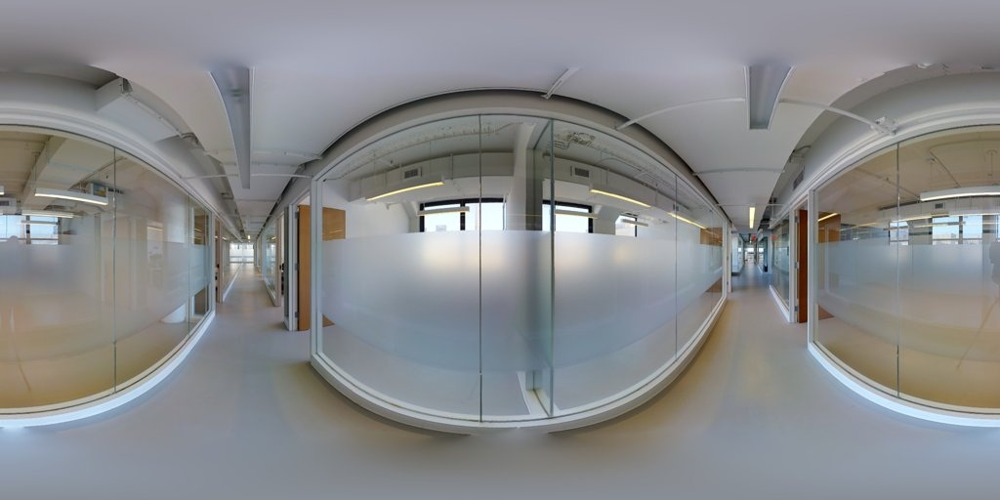

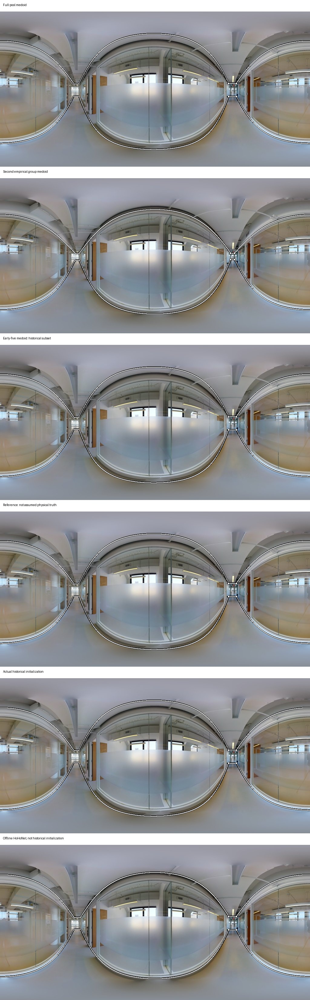

## C02 独立Manual的早期低估反例

`yqstnuAEVhm_26b2e92ccd314a2da1a4fc8dfc6e6f56`，C1 manual，N=23，D=0.215693。

近景可见打开的玻璃门和门框，一侧是狭长木地板走道，另一侧可见带栏杆的楼梯口及相邻门洞。

相机接近连接位置；不能只凭材质变化判断空间结束，需核实相机所在单元与门框闭合。

图中确有楼梯口，不等于当前目标一定含楼梯井。所示10角点候选有多段穿过可见墙面或门扇中部，首先需核查几何及范围错误，不能直接命名合理替代解。

人工待判：near-door闭合与跨入相邻区域的差异属于范围违规、可识别性不足还是参考选择，需要人工裁定。

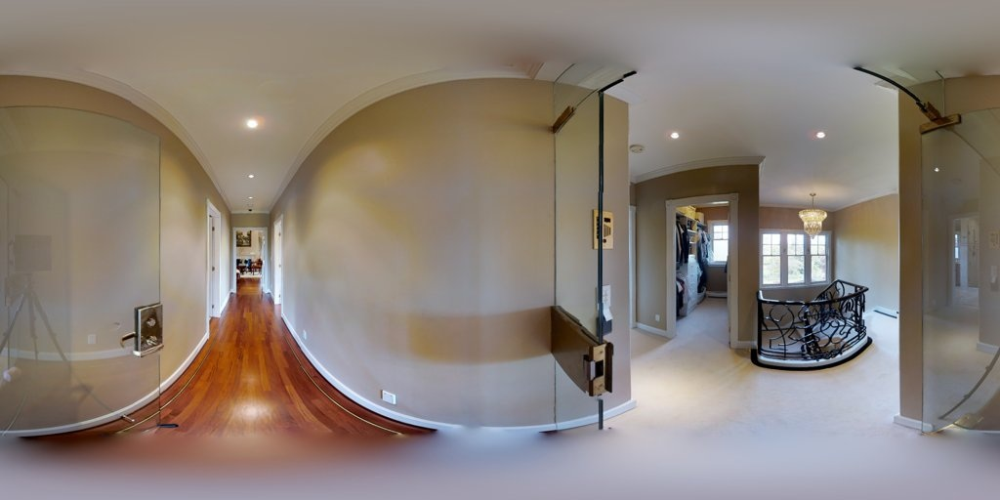

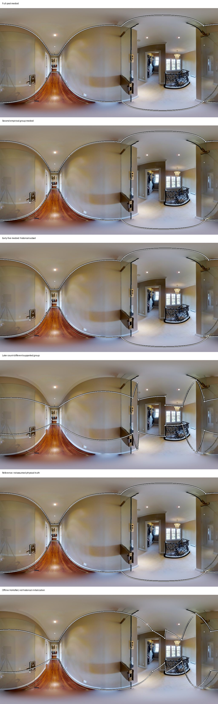

## C03 W1角点倾向的跨建筑对照A

`B6ByNegPMKs_e26e2cb761894264a4a34b1046701f6b`，C1 manual，N=5，D=0.304754。

可见不止一处墙体折返、走道延续和中央突出墙体；红色楼梯门关闭，顶部可见管线与灯具。

关闭门不授权进入门后楼梯空间；墙体折返应与设备、管线分别判断。

与C04同一工人均偏多角点，但本图参考相对距离优于同图平均；不能把多角点统称错误。

人工待判：检查新增点对应真实围护折返还是点操作冗余，不能由参考距离单独判真实性。

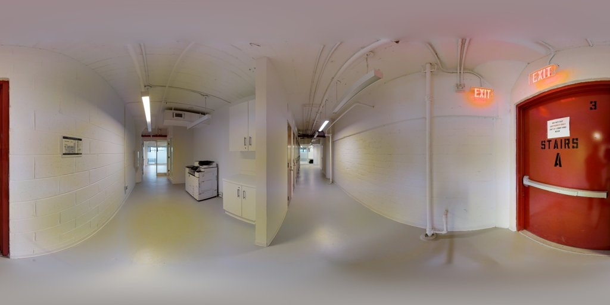

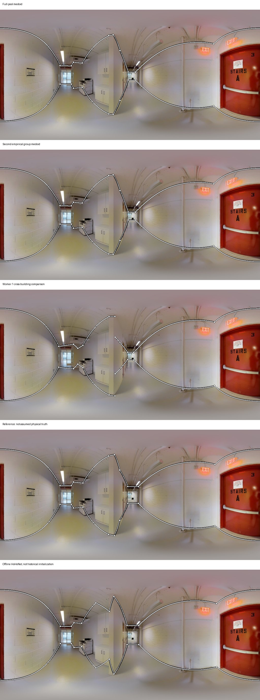

## C04 W1角点倾向的跨建筑对照B

`yqstnuAEVhm_9de98503fd994452b627cdcc7a7d47b2`，C1 manual，N=23，D=0.120934。

近景有打开的玻璃门、门框和大窗；两侧连通到摆放沙发等家具的区域，窗帘和柜体局部遮挡墙角。

应依据门框和围护关系确认当前结构单元，不能依据地板或家具功能区自动切分。

与C03同人同方向的角点偏多，在此图却有更大的参考相对距离；这只是反对将复杂度直接等同质量。

人工待判：需核对W1具体边界延伸位置、遮挡推断和参考版本，不作人格或能力裁决。

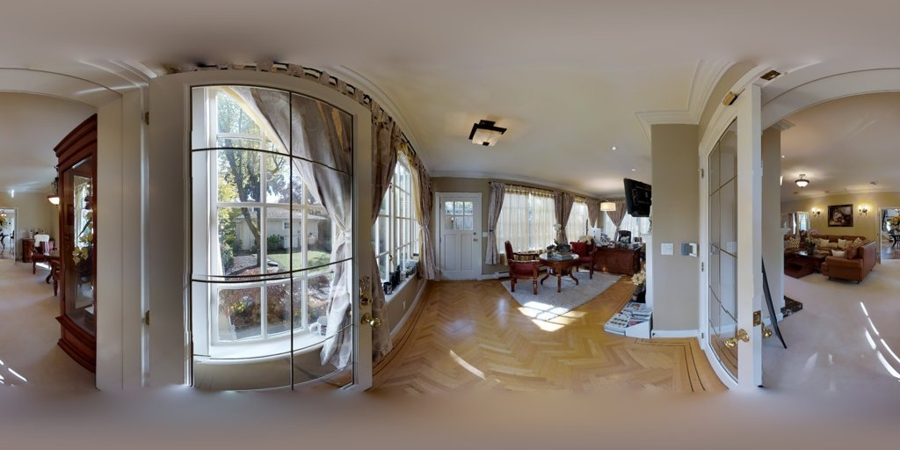

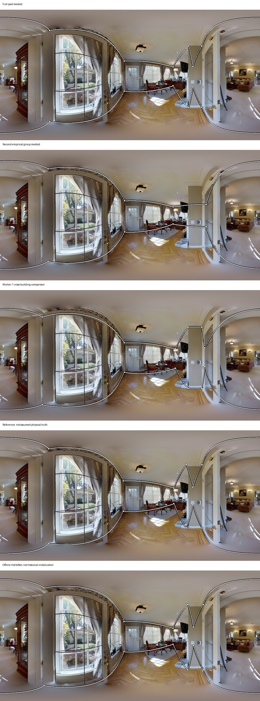

## C05 Bi差异大而这5名人工相对一致

`wc2JMjhGNzB_ec04ef10a0664e94878aa2d0f1720c2f`，C1 manual，N=5，D=0.064573。

相机位于浴室门、衣橱入口、窄窗以及两侧较大房间之间；浴室有清楚木门框和不同地面，衣橱中可见搁架。

门洞后浴室与衣橱、左右连通空间不应未经当前目标规则判断就合并。

Bi两头差异来自归档机器距离，本轮未取得双头原始几何，因此不凭该数定位Bi具体多画哪条边。

人工待判：人工只有5名，不能升级为高密度总体一致；需核验当前闭合位置及Bi原始输出。

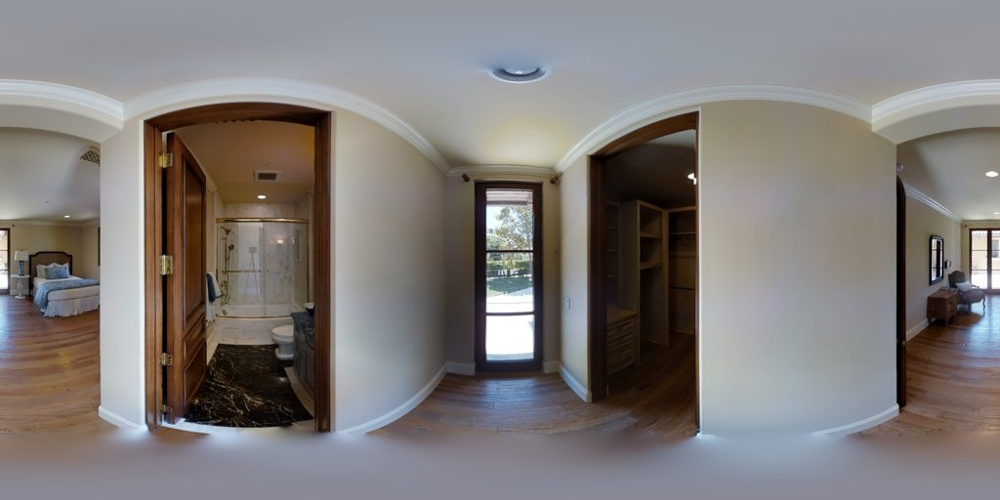

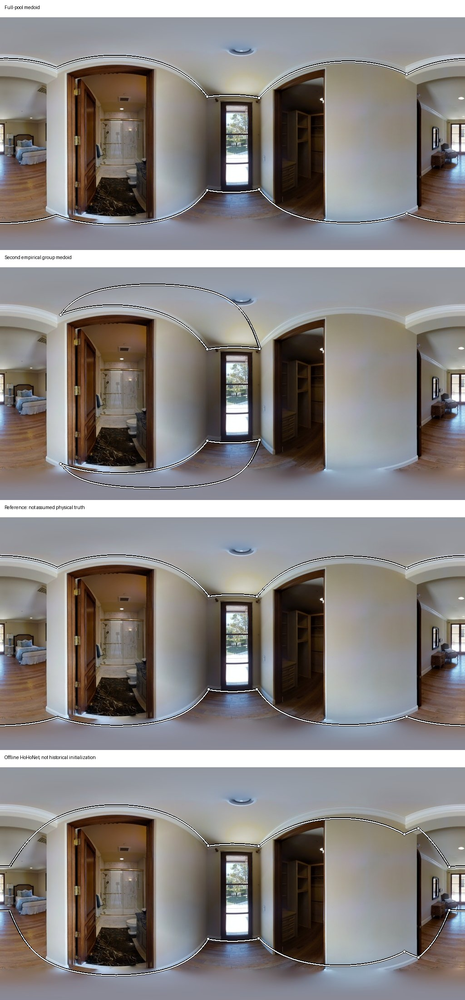

## C06 人和HoHo相近但与参考不同

`q9vSo1VnCiC_dc320b1236f741a98303db9f89bc68a2`，C1 manual，N=5，D=0.040761。

左侧清晰门框通向带搁架的狭长衣橱；中部桌椅遮住部分下墙，右侧可见另一门及相邻有木梁的空间。

需要分别识别近门框、衣橱内部和相邻空间的围护；家具、镜面不当作主墙。

人机接近并不能推翻参考，也不能证明共享错误；保留当前public reference来源，未自动改GT。

人工待判：叠图中参考在右侧门洞附近向相邻空间更深处延展，人工代表和HoHo更靠近近端门框；这由人工最终判断为参考问题、范围偏差或几何错误。

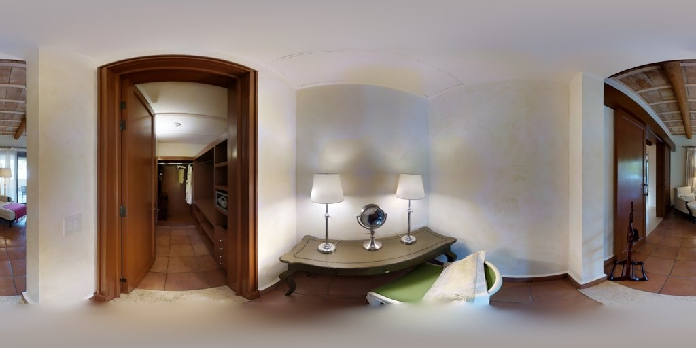

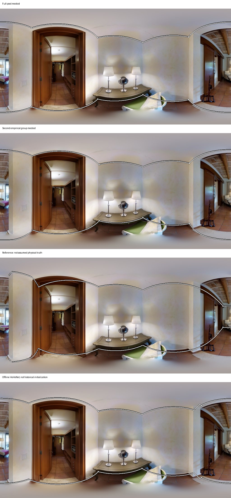

## C07 反例：有玻璃镜面，但人机仍较一致

`UwV83HsGsw3_bc29294428a647038f70e0ea31ea8972`，C1 manual，N=23，D=0.044188。

浴室有透明淋浴隔断、台盆上方镜子、马桶和打开的门，门后可见办公空间。

淋浴玻璃和镜子并不自动形成新的主围护边界，开放门框可作为核实当前闭合的位置。

本图23份几何整体分歧较低且模型差异小；反对把玻璃或镜面本身当作高不确定性充分条件。

人工待判：保持人工最终判断为空；低平均距离仍不证明全部细节正确。

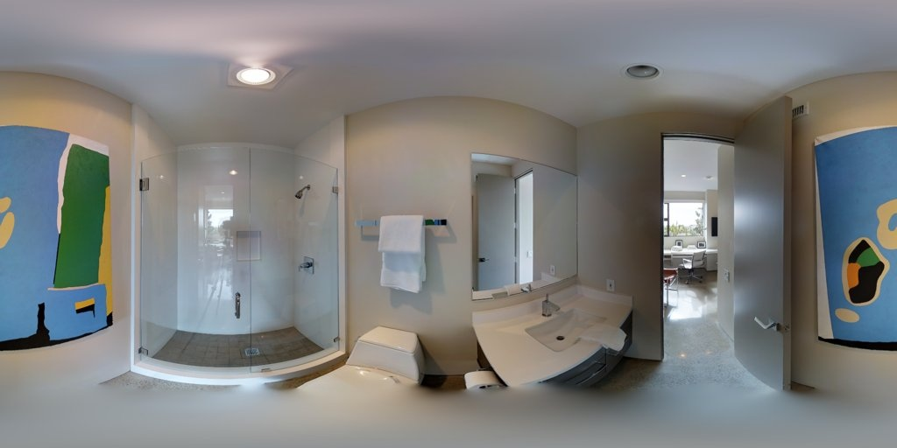

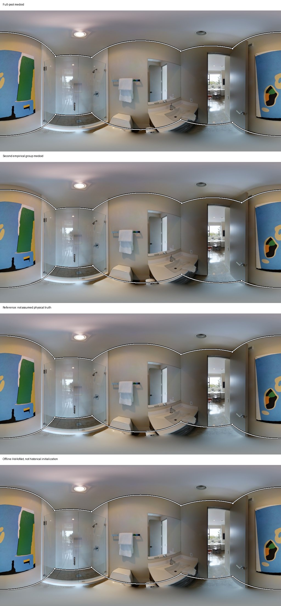