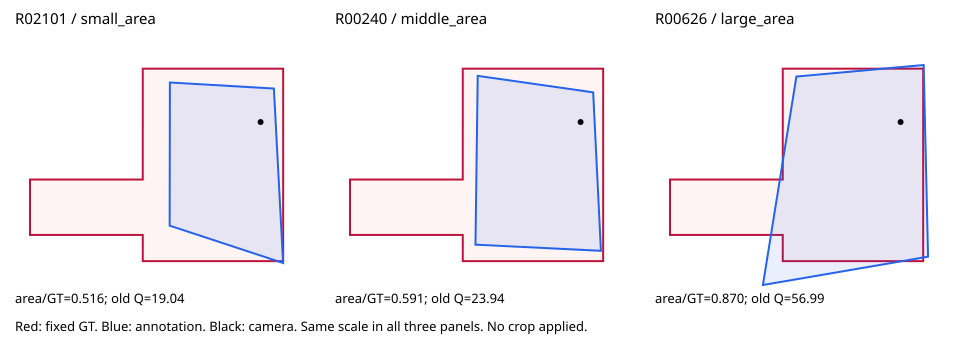
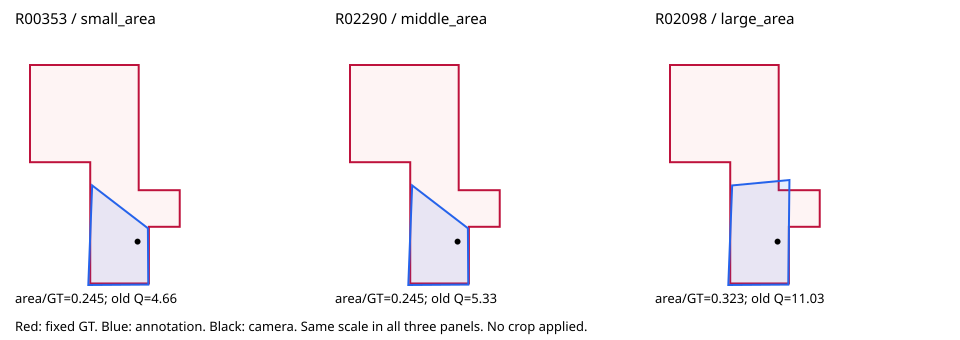
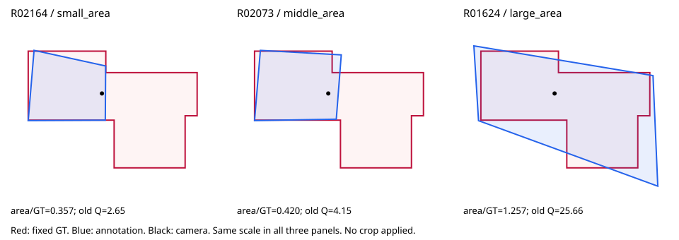

# 范围质量：先审这3张

2026-10-10（悉尼）。基于 main `3db905eb7cfd63c6055039dae621bb173bf75ac7`。这是一轮**裁剪是否适用的最小人工试审**，不是已经认定小空间合理，更没有生成新GT或新质量分。

## 你现在只需做什么

先看下面3张的照片和大小范围对照。每张只回答：

1. 小空间是否可以作为本任务允许的独立目标？填“允许／不允许／不确定”。
2. 若允许，指出在哪里停止和封口，可用照片描述、圈图或点号；如果高度/顶部边界也需要另定，请写明。暂时不用逐点重画。

结果填入 [3张复核表](human_review_first3.csv) 的 `human_range_decision`、`human_closure_location`、`human_note`，或直接回复图片编号。先确认目标边界，后续才能制作固定裁剪参考并研究评分。**现在不要求决定最终公式，也不按每份作答取最高GT分。**

## 1. e9zR4mvMWw7-17：已指出的主体与侧分支

[照片与全部底面对照](../image_difficulty_full_review_20261010/all_cards/e9zR4mvMWw7-17.jpg)



- 6位筛查人员。旧Q中位数24.99，3份同时满足既有“自身规整＋较多未覆盖GT且少量越界”代理；它不能替代真实质量判断。
- 较小例R02101面积/GT=0.516；中间例R00240=0.591；较大例R00626=0.870。
- **这张不能当作“大空间少数人已完全标对”的证据。** 即使较大例仍未覆盖20.8%的GT，另有约9.0%的自身面积落在GT外。
- 请确认：侧方楼梯/通道分支是否可以不纳入？如果可以，主体在哪里封口？

## 2. e9zR4mvMWw7-09：旧规整性筛选会漏掉的范围候选

[照片与全部底面对照](../image_difficulty_full_review_20261010/all_cards/e9zR4mvMWw7-09.jpg)



- 6位筛查人员，面积仅为GT的约24.5%至32.3%，旧Q中位数5.57。
- 仅2份达到既有规整代理，因此未进旧16张基准候选，也未进31张宽松候选；逐图复核却提示相机附近主体与远端连通区域的范围问题。
- 3份底面坐标完全相同；旧筛查已保留几何去重敏感性。这不证明抄袭，也不能把相同底面当作额外独立语义证据。这里按排序选取3份记录，其中两份底面相同，不宣称3种独立空间模式。
- 请确认：是否允许只标相机附近主体？若允许，餐厨相连开口的停止边在哪里？

## 3. b8cTxDM8gDG-18：检验大小范围共存

[照片与全部底面对照](../image_difficulty_full_review_20261010/all_cards/b8cTxDM8gDG-18.jpg)



- 6位筛查人员：4份面积/GT为0.357–0.442，另2份为0.996和1.257。这是几何分布描述，尚未认定两个合理目标。
- 较大例R01624覆盖约95.7%的GT，但约23.9%的自身面积越出GT；它不是“大空间正确答案”的替身。另一较大例R01139仍有约14.4%的GT未覆盖。
- 0份同时通过既有“范围＋规整”代理。**即使批准小目标，也不能预设裁剪之后质量就好。** 这张用于分开“目标大小”和“目标内实现错误”。
- 请确认：小主体是否允许独立标注，和大目标是否应并存？如果允许，指出侧向分支的封口位置。

三幅新图只重画当前正式点位得到的底面，红色为固定GT、蓝色为人员标注、黑点为相机，各图内部同尺度；不是新GT、不是实际测量三维，也不是修改原图。标题的small/middle/large仅按底面面积排序，未用Q挑例子。表中Q全部是2026-10-09旧基线。

## 其余候选为什么先不要求你全审

[24张完整对照清单](candidate_reconciliation_24.csv)保留旧16张算法候选与13张视觉范围候选的**并集24张、交集5张**。不能把16与13相加当29张，也不能把交集5张当已确证真值。首轮3张是为回答不同问题而选的试审，并不代表已排除其余21张。

|去向|张数|本轮处理|
|---|---:|---|
|首轮目标/封口裁定|3|上面3张|
|玻璃或混合问题对照|4|pRb-02、uNb-67、rPc-06、jtc-18。保留低分和小范围证据，依当前简化边界先按固定GT；没有自动要求玻璃内外另做GT，也未从审计中抹去。|
|既有暂停|2|q9-29、uNb-32，不恢复资格；q9-29的当前正式质量gate仍为hold_scene_or_reference。|
|向GT外扩张/混合|2|wc2-26、yq-31，不能用“在GT内裁小”统一解决。|
|同空间深度对照|2|uNb-54、uNb-79。旧筛查命中，但照片与底面并未支持明确另选小空间；用于防止把深度误差洗成裁剪。|
|其他几何/目标待辨|11|保留原注释及大小例子，后续按首轮裁定再缩小；不提前认可裁剪。|

上述去向是本轮工作排序，不是新的标注资格或语义真值。玻璃类如果后来确认同时存在与玻璃无关的大分支截取，应重新按共同范围问题处理，不能永久豁免筛查。

## 算法哪里需要补足

1. 当前联合检索要求“范围信号＋规整代理”同时成立。它会漏掉e9-09和b8-18这类有范围疑点、但几何也不够规整的图。**建议将范围筛查作为候选召回，规整性另列解释；是否采纳和具体阈值尚未定。** 本轮先用既有两条证据的并集补漏，未修改算法阈值或评分。
2. 大/小目标是否成立、封口位置和顶界，须由人工确定。不能把多数人的轮廓直接当裁剪GT，更不能逐份迎合作答。
3. 即使采用不同固定目标，仍须保留原大GT覆盖与目标内误差。是否形成两套参考或另种更简单评价，交由后续研究比较；本轮未定案。
4. x8-09的非正交规整性研究另走适用性检验，不混进范围裁剪队列。x8-01及wc2-14质量参考暂缓，未恢复。不能把本轮未动评分理解成同意正交先验误罚。

## 本次真正核验的内容

- 最新main新增`3db905e`修正14份环序效果分类：3份改变邻接、11份保留x配对候选。复查代码与测试，既有9项针对性测试通过；未把这次分类修正说成重跑Q。
- 旧范围筛查的2368条manual/oos去重人员记录，其身份和正式当前点阵逐一匹配；14份新复核记录不在这2368条内，因此其几何修复未污染本次沿用的筛查坐标。
- 两清单并集的24图、283份筛查记录，从当前正式点阵重新投影，独立重算面积比、GT未覆盖比例、标注越界比例，与冻结值的绝对差均不超过1e-7。
- **2368是筛查来源人口，不是当前正式质量合资格总数。** 它包含既有场景/参考暂停与OOS探索；逐图当前gate分布已另列，不能把它直接送入正式工人评分。
- 24图照片/聚合底面证据卡已逐张复看；不是逐份语义盲审，未生成裁剪坐标或人工分。
- 本轮开始查询“质量校准分析”对话时，最新可见内容为10月9日18:39 UTC提交的研究请求，未读取到此次新Pro答复。本轮结论来自仓库与已有数据，不能冒称对Pro新方案完成审查。

新增4项筛查交接测试与上述9项合计13项通过；覆盖按面积选例而非按Q、玻璃/暂停/越界对照分流、清单集合及人工字段留空、地平线非法输入拒绝。全仓库测试未跑。

源文件SHA、数量与边界见[validation.json](validation.json)，每图原GT及例子原点见[record_evidence.json](record_evidence.json)。旧Q与全部历史文件保留；未运行全库新Q、人员画像、融合或人数曲线。

## 复现

先按[研究资料入口](../../research/quality_scope_handoff_20261010/README.md)恢复并解压数值核心。

```bash
python -m tools.thesis_main.analysis.prepare_quality_scope_review_20261010 --source-root /path/to/quality_research_20261009
python -m pytest -q tests/test_quality_scope_human_review_20261010.py tests/test_quality_review_input_20261010.py tests/test_consolidate_research_input.py
```

依赖沿用仓库环境的numpy、shapely。脚本只读当前正式输入和冻结证据，输出独立目录；默认不会读取或采用用户填表内容。首次补齐稀疏检出的109行审核CSV后测试才通过，属于本次检出缺文件，不是把源数据丢失或访问失败当几何错误。
