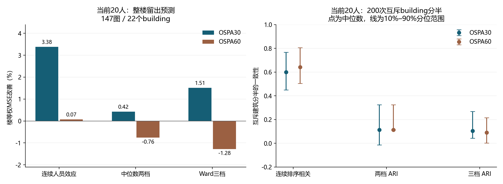
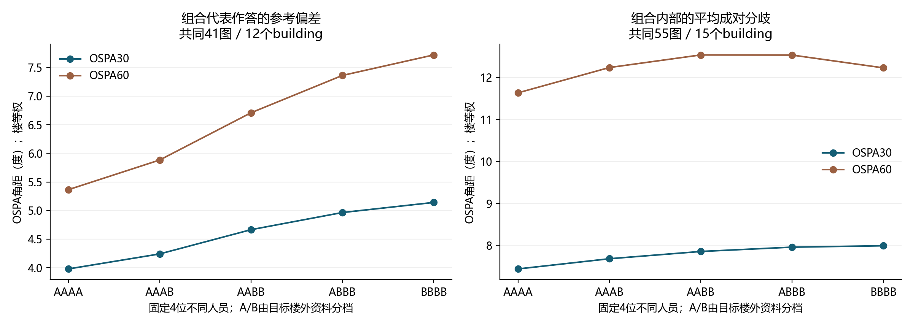
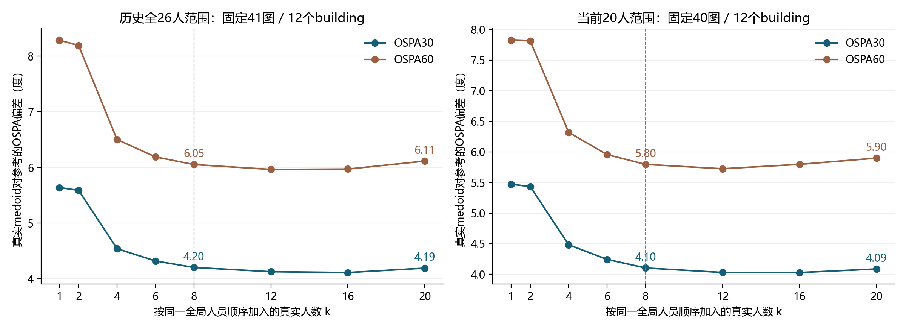

# 人员差异、跨building复现与真实人员组合验证

2026-09-09。本报告使用已确认补点、删点及单条响应排除后的计算视图，重新计算人员参考偏差并验证真实人员组合。分析为回顾性探索，不修改原始标注、人员资格、正式分发或方法合同。

## 结果摘要

按人采集后，抽取不同真实人员在同一图片上的作答组成 AA、AB、BB 或 AAAA、AAAB、AABB、ABBB、BBBB，数据和计算均可执行。本次已在目标building之外确定分档，再枚举目标图的真实人员组合。重复同一人的修订版本没有进入人数。

当前20人的连续人员效应在整楼留出中的楼等权误差改善为 OSPA30 **3.38%**、OSPA60 **0.067%**；中位数两档为 **0.42% / −0.76%**，Ward三档为 **1.51% / −1.28%**。200次互斥building分半中，连续排序相关中位数为 **0.598 / 0.642**，两档调整兰德指数（ARI）均为 **0.113**，三档为 **0.104 / 0.091**。连续差异和离散类别具有不同的复现程度。

在当前20人、固定4人且五种配比都有支持的共同41图、12个building上，内部距离选出的真实代表作答，其参考偏差从 AAAA 到 BBBB 为 **3.98→5.14°（OSPA30）**、**5.36→7.72°（OSPA60）**。两参数均有11/12个building呈现 AAAA 低于 BBBB，B6ByNegPMKs 呈相反方向。这是给定历史人员和操作性分档的组合结果，未验证“认真/粗心”等心理或行为类型，也未验证新人员的类别归属或20人后的持续稳定。

## 1. 输入、参考和人员范围

| 层级 | 响应 | 图片 | building | 处理 |
|---|---:|---:|---:|---|
| canonical源记录 | 2501 | 214 | 22 | 修订谱系共2513条，修订不重复计人 |
| reviewed无辅助可计算响应 | 1887 | 196 | 22 | 26人；无同图同人重复；几何分歧入口 |
| 可使用本轮唯一参考计偏差 | 1484 | 167 | 22 | 820条/38图用既有人工参考；664条/129图暂按GT |
| 参考暂不可评 | 403 | 29 | — | 176条Manual及227条旧OOS；保留分歧分析，不赋最差分 |
| 留楼可比较相对人员偏差 | 1464 | 147 | 22 | 全26人；20张单人图不进入同图相对效应验证 |
| 当前20人：参考可评分 | 1267 | 167 | 22 | 对应留楼验证1247条、147图 |

原始18份导出由既有 `prepare_confirmed_point_calculation_view_20260909.build` 重新读取，在临时目录重建计算视图后与已保存 reviewed 视图核对。身份、原坐标、有效坐标、人工动作及排除决定一致。5条记录仅存在 `application_status` 的“待执行/已执行”历史注记差异，身份列于 `QA.json`；没有用该注记差异修改坐标。

2条响应带已确认补点，仍各计1位原作答人，补出的点没有变成新增人员。相对较早点视图，本轮6条可评分响应的OSPA30或60发生变化，见 `reviewed_metric_changes.csv`。本子分析使用 reviewed 主口径，没有另行重跑“撤回补点”的完整人员分类。

参考选择沿用已核验账本：已确认修订或人工参考优先，其余暂按GT；既有范围疑问、OOS或参考未决不强行用单一参考计分。重新核对了账本380张参考与4个来源文件中的坐标。几何参考的一致核对不等于新的盲审；OSPA只评价无序球面端点集的匹配及点数差，不判定墙体连接和所有语义解释。

三个固定人员范围均完整报告：全26人；只排除W19/W26的24人；当前20人。排除口径不是根据本轮效果择优选择。无辅助响应包括历史不同阶段，任务效应吸收图像共同差异；人员随阶段、学习或图像类型变化的效应没有被认定为恒定人格属性。过程独立性沿用现有采集与核查口径，单靠几何坐标不能重新证明全过程无人交流。

## 2. 画像与分类的验证设计

人员得分由“参考偏差＝图像效应＋人员效应＋残差”计算；只使用有至少两位可比较人员的图像，人员—任务图连通性显式检查。每次整栋building留出，在其余building重新拟合人员效应、确定切点或聚类并计算组均值。目标楼的作答不进入分档。

比较三种表示：连续人员效应；按训练效应中位数分两档；一维效应Ward聚类切三档。A/B/C依训练偏差均值从小到大排序。**A表示相对给定参考偏差较低，B较高；三档时C最高。** 字母没有认真、粗心、保守、激进等既定含义；指定切两档或三档本身不证明天然存在相应类别。

验证在留出图内使用同一可预测人员集合、同一图内中心化的相对偏差。误差改善＝1−模型MSE/不区分人员基线MSE。楼等权先对每楼响应求均值，再跨楼均值；不是正确率，也不是收敛人数改善。全量名单仅供解释，不替代每个训练折自己的名单。

此外对22个building做200次互斥11/11分半，分别拟合两边的人员效应与分档，比较同一人员的排序和类别。当前20人及24人口径每次均覆盖全部人员；全26人口径165次共同覆盖26人，35次共同覆盖25人。200次分法仍复用同一批人和楼，不是200个独立实验。ARI对任意类别编号置换不敏感，1表示完全一致，接近0表示接近随机划分期望；它与排序相关的数值不可当作同一准确率。

### 跨building预测

下表均为楼等权MSE改善（%），括号内顺序为OSPA30 / OSPA60。

| 人员范围 | 连续效应 | 中位数两档 | Ward三档 |
|---|---:|---:|---:|
| 全26人 | 12.24 / 7.68 | −2.02 / −5.38 | 6.78 / 5.28 |
| 排除W19/W26的24人 | 4.88 / 0.96 | 2.95 / 0.63 | 0.17 / −2.43 |
| 当前20人 | 3.38 / 0.067 | 0.42 / −0.76 | 1.51 / −1.28 |

当前20人中，连续效应分别改善10/22和9/22个building；平均收益不代表每栋均改善。OSPA30当前20人的基线楼等权MSE为9.780，连续模型为9.449，中位数两档为9.739；完整逐楼结果保留在机器表。

### 互斥building分半的复现

| 人员范围 | 连续排序相关中位数 | 两档ARI中位数 | 三档ARI中位数 |
|---|---:|---:|---:|
| 全26人 | 0.718 / 0.717 | 0.260 / 0.260 | 0.285 / 0.247 |
| 排除W19/W26的24人 | 0.675 / 0.694 | 0.216 / 0.216 | 0.128 / 0.106 |
| 当前20人 | 0.598 / 0.642 | 0.113 / 0.113 | 0.104 / 0.091 |

当前20人中位数两档在200次分半的成员同档比例中位数为70%；Ward三档为60%/55%。删一楼时当前20人两档始终同档者为17/20、15/20，而互斥分半一致性更低；删一楼训练集高度重叠，不能将前一个数字称为独立重复验证通过率。



### 当前20人的全量候选成员

| OSPA30中位数两档 | 人数 | 人员 |
|---|---:|---|
| A：参考相对偏差较低半组 | 10 | W1、W2、W6、W8、W11、W15、W17、W28、W31、W33 |
| B：参考相对偏差较高半组 | 10 | W10、W12、W13、W29、W30、W32、W34、W35、W36、W37 |

OSPA60仅W10和W31对调。分档以训练内中位数为界，边界人员换档不等于行为本身改变。当前20人的Ward三档人数为1/10/9（30°）和1/14/5（60°），最低偏差档均仅W2；与此前混合Manual/Semi资料中的6/12/2三档含义和成员不同，不可混用。

## 3. 真实人员组合：同图、同人数、训练外分类

对每张目标图枚举所有互不重复的真实人员子集，2人比较AA、AB、BB，4人比较AAAA、AAAB、AABB、ABBB、BBBB。三档另检查ABC/AABC覆盖并在共同支持处比较AABC、ABBC、ABCC。字母次数是不同人员数，例如AABC必须有两位不同的A类作答人。

每种配比在图内对所有实际组合等权平均；比较配比时只使用每个配比都有该指标的共同图集合，再先图后楼、楼等权汇总。不同组合大量共享人员，因此没有把组合数用于独立样本量、普通t检验或显著性声明。本轮没有为每个配比增加采集，也没有复制响应来填补人数。

| 当前20人两档 | 参考指标共同覆盖 | 分歧指标共同覆盖 |
|---|---:|---:|
| AA / AB / BB，OSPA30分档 | 91图 / 20楼 | 109图 / 20楼 |
| AA / AB / BB，OSPA60分档 | 84图 / 17楼 | 102图 / 18楼 |
| 五种4人配比，两参数 | 41图 / 12楼 | 55图 / 15楼 |

参考不可评的图仍可计算工人间分歧，因而两种分母不同；两个表中的均值不直接相减。三种人员范围的4人共同覆盖均为上述41图和55图，具体成员和组均值各自重新拟合。

### 四人组合的参考偏差与分歧

代表作答按组合内部OSPA总距离最小选择，即medoid，输出仍是一位实际人员的原作答计算视图；出现并列时，对全部并列代表的参考偏差均权平均。参考答案不进入代表选择。组合单人平均偏差同时保存，但其随配比的线性变化包含加权平均的算术结构，不能当成额外协同效应。

| 当前20人、训练外中位数两档 | AAAA | AAAB | AABB | ABBB | BBBB |
|---|---:|---:|---:|---:|---:|
| 代表参考偏差，OSPA30；41图/12楼 | 3.98 | 4.24 | 4.67 | 4.97 | 5.14 |
| 代表参考偏差，OSPA60；41图/12楼 | 5.36 | 5.88 | 6.71 | 7.36 | 7.72 |
| 平均成对分歧，OSPA30；55图/15楼 | 7.44 | 7.68 | 7.86 | 7.96 | 7.99 |
| 平均成对分歧，OSPA60；55图/15楼 | 11.63 | 12.24 | 12.54 | 12.53 | 12.23 |

单位为度，楼等权。两种参考偏差下，11/12楼AAAA低于BBBB；B6ByNegPMKs相反，OSPA30为4.28对2.68，OSPA60为4.82对2.34。成对分歧中AAAA低于BBBB的楼为10/15、11/15；OSPA60的AABB整体分歧高于两端。组合的代表偏差、内部一致性与所保留的多种解释因此需要分开陈述。



### 三档的真实人员覆盖

以下使用每个目标楼以外的折内Ward三档，不使用全量标签评价。

| 人员范围 | OSPA30：ABC / AABC可组成图 | OSPA60：ABC / AABC可组成图 | AABC、ABBC、ABCC同时有支持图 |
|---|---:|---:|---:|
| 全26人 | 38 / 38 | 38 / 38 | 5 / 5 |
| 排除W19/W26的24人 | 87 / 49 | 100 / 64 | 49 / 48 |
| 当前20人 | 68 / 0 | 71 / 0 | 0 / 0 |

当前20人全部44个“指标×留楼折”的A档都只有W2，不能构成AABC。可组成ABC不意味着可以改变所有类型的人数比例。中位数两档各10人，也不能提供某一档增加到20位不同人员的历史曲线。新增人员是否落入相同档位，仍需要独立校准与验证；这里没有给新人员附会历史标签。

## 4. 多簇、至少两人支持和q敏感性

本轮组合几何严格使用**有效点数不同必属不同簇**的硬门；比较同点数的布局时复用v5最大团完整枚举的分区逻辑。非唯一、搜索截断或必要几何不可评保持未知，不强制挑一个分区。受支持簇至少有两位不同人员；单例仍保留为观察到的个体响应，不自动升级为新受支持簇。

4人出现2+2两个受支持簇是允许结果，没有因存在多簇直接计为失败。但本表只刻画组合当下的结构，没有后续人数序列，因此不把它命名为“已进入持续稳定阶段”。持续稳定的完整历史检验由主报告另行报告。

当前20人、OSPA30两档、55图/15楼、q=.95，4人组合中两个受支持簇的楼等权比例为：AAAA 4.11%、AAAB 3.72%、AABB 4.65%、ABBB 3.26%、BBBB 4.76%。未知比例分别为3.46%、4.46%、5.43%、6.40%、7.30%。这些比例以全部组合为分母，未知没有算成失败或成功；条件于唯一分区的受支持簇均值另存字段。

q=.975、.95、.90以及带相同点数硬门的OSPA30≤6°均计算。以AABB为例：

| 几何配置 | 两个受支持簇 | 没有受支持簇 | 分区或几何未知 |
|---|---:|---:|---:|
| q=.975 | 3.94% | 17.92% | 8.53% |
| q=.950 | 4.65% | 11.90% | 5.43% |
| q=.900 | 4.97% | 9.35% | 4.43% |
| OSPA30≤6°，相同点数硬门 | 4.00% | 18.63% | 3.53% |

阈值变化影响的是观测的几何结构及可判定比例。本子分析未根据上述结果选择最优q，也没有通过增加同簇率证明某阈值更符合真实语义。平均参考偏差、medoid参考偏差和平均OSPA成对分歧不使用q，其在不同q配置下重复列出仅用于与簇结果对齐，不是四次独立证据。

## 5. 解释边界

“每人独立作答后重组”的数据复用目标已在历史数据中实现：作答一次即可用于多种比例的离线组合。这里的组合是统计重组，未包含人员看到他人结果后交流、说服、复核或修改的互动效应。

操作性分档不要求预先证明人格类型，但报告其效果时需明确档位定义、训练资料和适用人群。本次数据支持在给定分档下计算既有人员的配比差异；对当前20人，跨独立building资料的类别复现仍低，无法据此确认两种或三种稳定自然类型。高偏差也可能来自范围解释或参考问题，不能直接归因为粗心。

本轮没有把Semi的修改幅度并入Manual档位。此前“Manual表现＋Semi额外修改残余”属于另一个二维候选；本轮没有重跑完整Semi初始化链及细档验证，因此未生成新的四细类名单，也未把先前四档直接沿用成已验证分类。

本轮4人配比结果不回答“哪一种类型在8人左右开始并一直稳定到20多人”。它提供该后续问题所需的独立人员身份、训练外标签、同图共同覆盖及小规模组合的实算入口。多种类型与多人配比的可用范围由不同真实人员数和共同标注覆盖限制。

## 6. 辅助分析：代表作答的参考偏差随人数变化

在参考可评、确实有至少20份不同真实人员作答的图像上，沿同一200个全局人员顺序，分别取k=1、2、4、6、8、12、16、20。在每个前缀仅用内部OSPA选择真实medoid，然后与参考比较；参考答案不参与代表选择。全26人范围可评价41图、12楼；当前20人范围40图、12楼，每图均恰有20位当前人员。

每个范围内所有k使用完全相同图片、相同顺序和相同指标，先对200顺序均值，再图内、楼内及楼等权汇总。两种范围的图片数不同，不能用范围间差值直接解释排除人员的因果效果。k=2时两位作答在对称距离下必为并列medoid，本轮均权计分；k=1和2之间很小的差值还包含有限200顺序的不均衡，不是两人一定优于一人的独立证据。

| 人员范围与距离 | 1人 | 4人 | 8人 | 12人 | 16人 | 20人 | 8→20偏差减少 |
|---|---:|---:|---:|---:|---:|---:|---:|
| 全26人范围，OSPA30 | 5.639 | 4.539 | 4.202 | 4.126 | 4.111 | 4.190 | +0.012 |
| 全26人范围，OSPA60 | 8.289 | 6.502 | 6.052 | 5.965 | 5.971 | 6.114 | −0.062 |
| 当前20人，OSPA30 | 5.474 | 4.481 | 4.104 | 4.030 | 4.029 | 4.087 | +0.016 |
| 当前20人，OSPA60 | 7.827 | 6.320 | 5.796 | 5.726 | 5.797 | 5.899 | −0.102 |

单位为度，楼等权；“偏差减少”为8人值减20人值，正值表示改善。8→20阶段的平均变化远小于1→8变化，并非所有图片都改善：全26人范围OSPA30为21/41图改善、20/41图变差，OSPA60为22/41图改善、19/41图变差；两参数均只有5/12楼改善。当前20人分别24/40和25/40图改善，两参数均8/12楼改善；少数图变化幅度使OSPA60总体均值略升。



该结果测量的是选定代表相对本轮参考的有限样本变化，没有证明8人后不再出现新的受支持簇，也没有证明参考质量达到理论上限。分布持续稳定、代表作答的参考偏差及新增少数解释的覆盖是不同结果；本表不将它们相互替代。全部20人图的k=20代表偏差在不同顺序下保持不变，已作为一致性检查；真实20人不足的图没有补出第20人。

## 7. 文件、字段与复现

| 文件 | 主键或单位 | 内容 |
|---|---|---|
| `METHOD.json` / `QA.json` | 本次研究 | 配置、参考来源、原始点重建核对及覆盖 |
| `response_measurements.csv.gz` | canonical响应 | 1887条无辅助响应、参考是否可评、OSPA及reviewed/imputed状态 |
| `reviewed_metric_changes.csv` | canonical响应 | 相对较早点视图改变的6条参考度量 |
| `full_members.csv` | 人员范围×指标×分组法×人员 | 全量解释性名单、连续效应及支持 |
| `fold_members.csv` | 同上＋留出building | 用于实际验证与组合的训练外标签；`training_buildings`显式保留 |
| `classification_predictions.csv.gz` | 人员范围×指标×分组法×响应 | 留楼相对目标、连续/分组预测及同一基线误差 |
| `classification_summary.csv` / `classification_by_building.csv` | 配置／配置×building | 响应等权及楼等权误差、逐楼反例 |
| `membership_stability.csv` | 配置×人员 | 删一楼同档比例、标签变化范围；非独立复现率 |
| `disjoint_half_stability.csv` | 人员范围×指标×分半编号 | 1200个重复分半结果、双方building、共有人员数、相关及ARI |
| `combination_coverage.csv` | 人员范围×指标×分组法×图×人数 | A/B/C真实人员数、未知标签、同图各配比支持 |
| `combination_by_image.csv.gz` | 同上＋配比＋几何配置 | 24716条图内组合均值；`combinations`是可重组组合数，非独立样本量 |
| `combination_summary.csv` / `combination_by_building.csv` | 配置×人数×指标结果×配比／另加楼 | 各结果各自的共同图/楼分母与均值 |
| `OUTPUT_CHECKS.json` / `tests.log` | 本次检验 | schema、概率守恒、6179条组合数/均值闭式核对及测试 |
| `worker_validation.png` / `worker_combinations.png` | 科学图 | 机器表生成，2400像素宽，已检查中文和布局 |
| `quality_prefix_by_image.csv` / `quality_prefix_replicates.csv.gz` | 人员范围×指标×图×k／另加排列 | 固定图集合的medoid参考偏差、200排列分布；排列分位数不是置信区间 |
| `quality_prefix_summary.csv` / `quality_8_to_20_summary.csv` | 人员范围×指标×k／8→20配对 | 图等权、楼等权均值及改善/变差的图楼数 |
| `quality_8_to_20_by_image.csv` / `quality_prefix_coverage.csv` | 人员范围×指标×图／覆盖 | 每图实际人数、8→20差值和同排列比较 |
| `quality_prefix.png` / `QUALITY_PREFIX_QA.json` | 科学图与检查 | 20人共同支持、顺序耦合、并列medoid及全前缀顺序不变性 |
| `building_stage_code_review.json` | 只读交叉审查 | 4图×2配置×2人员口径×200顺序的阶段逻辑及已保存结果独立核对 |

组合字段：`reference_mean`为组合内个人参考偏差均值；`medoid_reference_mean`为按组合内部距离选择代表后对参考计分，所有并列代表均权；`medoid_tie_fraction`为存在多位并列代表的组合比例；`pairwise_mean`为不含对角线的无序人员对OSPA均值；`point_count_mismatch`为点数不同的人员对比例；`unknown_fraction`为几何或分区未知的组合比例；`supported_clusters_conditional`只在可唯一分区组合内平均；`multi_supported_fraction`、`single_supported_fraction`、`no_supported_fraction`分别为至少两个、一个、零个m=2受支持簇的组合比例，三者与unknown之和为1。后三个“支持”字段不是持续稳定概率。

复现：

```powershell
.venv/Scripts/python.exe -m tools.thesis_main.analysis.validate_worker_reuse_20260909
.venv/Scripts/python.exe -m pytest tests/test_validate_worker_reuse_20260909.py tests/test_worker_reference_feasibility_20260909.py tests/test_prepare_confirmed_point_calculation_view_20260909.py -q
```

10项测试通过，覆盖目标楼隔离、不同真实人员子集、人员顺序投影、点数硬门、m2、非唯一分区保留、medoid并列、公平共同图分母及既有点复核函数。6179条不同图内配置的组合数与平均参考偏差另用组合数公式及组均值公式核对；全部一致。q的成对量复用最新revised几何产物，核对其全量身份和有效点数，本子分析没有再次从坐标重算q。没有运行Label Studio、active-time或模型训练测试，因为相应代码和数据未修改。

来源为 [reviewed计算视图](../../confirmed_point_calculation_view_20260909_v1/reviewed/)、[最新成对几何](../../multibuilding_threshold_stability_20260909_v1/revised/with_workers/geometry/)、[参考选择账本](../../worker_reference_feasibility_20260909_v1/reference_ledger.jsonl)。结果由本包脚本重算，无使用缺失的第二轮外部报告包数值。
