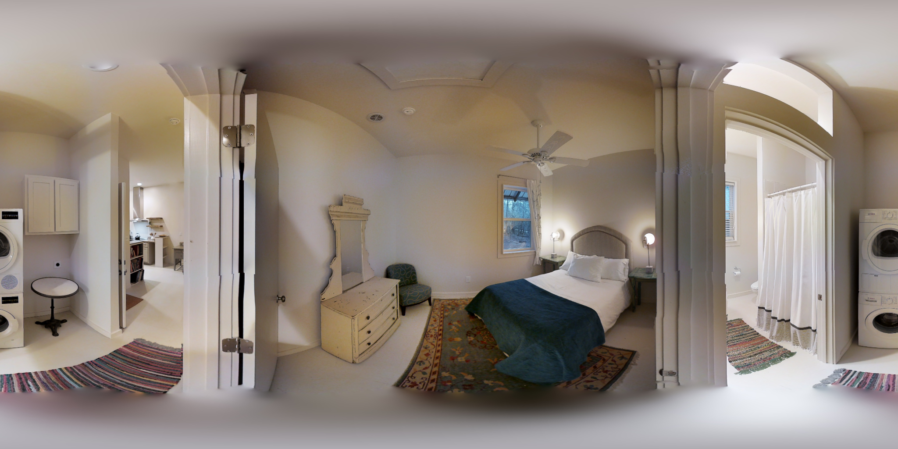
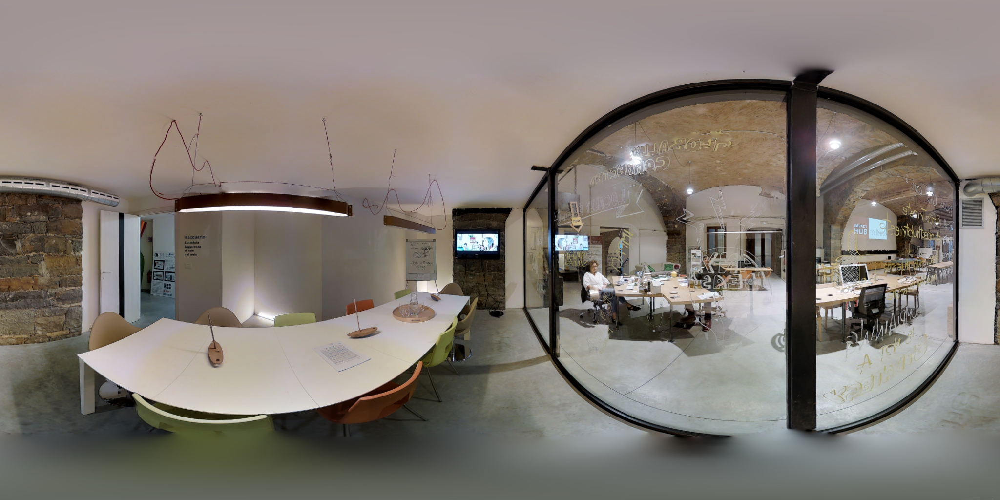

# valid/test原始全景图：房间与场景的探索性初分

日期：2026-09-10。状态：AI目视初分，最终由用户分类。入口：[可筛选、填写和导出的核对页](图片初分核对.html)。

用户提交分类后，新增[争议图片复核](争议图片复核.html)及[复核报告](用户分类复核说明.md)。用户已澄清：旧称“门槛”实际指相机位于同一门洞内、两个空间的交界处。该项与功能粗类独立。后续复核按此含义，旧文中的广义交界候选不自动转换成门洞确认。

## 最新结果：重新看图后的粗分类

用户明确要求重新分类后，已对40页联系表中的648张图逐图重新判断：主智能体复核前20页301张，一个协作智能体复核后20页347张；主智能体另外放大检查Z6MFQCViBuw第3图、b8cTxDM8gDG第13图、jtcxE69GiFV第22图。其余图本轮为缩略图复核，不能称为全分辨率精审。

这次粗类来自新的逐图判断，不是按旧细标签机械映射；共82张与上一次映射得到的粗组不同。全部仍是AI初分，不覆盖用户记录或确认房间身份，不代表已证明这些类别能预测稳定阶段。

| 当前粗类别 | 图片数 |
|---|---:|
| 卧室 | 162 |
| 卫浴 | 117 |
| 起居与休闲 | 71 |
| 厨房与用餐 | 53 |
| 通行与连接 | 122 |
| 工作与学习 | 27 |
| 储藏与家务辅助 | 45 |
| 特殊用途，暂不合并分析 | 11 |
| 复合／待定 | 40 |
| 合计 | 648 |

分类对象是图片呈现的主要空间用途，不是标注者应该选取的布局范围。看见邻室不自动改成复合；卧室中的书桌不自动改成办公室；空置房间不单凭形状猜卧室。家庭健身、影音、儿童活动并入起居休闲；护理/按摩床不作为普通卧室证据，保留特殊用途。开放多功能均显著或无法确定用途时保留复合／待定。展陈环境的家具只支持暂定功能外观，不证明实际居住用途。

例如：jh4fc5c5qoQ第9图重新归卧室；jtcxE69GiFV第22图放大后可辨卧室主体，也归卧室；uNb第24图按通行连接空间归类，门洞拍摄位置仍独立待核对。没有用收敛人数、质量或工人标注决定类型。

页面默认展示全部building，按新粗类别聚集，再按楼和候选组排序；粗类别下拉带图数，旧细标签与同房线索折叠保留。AI数据schema为`scene_image_exploration_v3`；用户填写schema仍为v2，存储键保持不变。新增`coarse_review_basis`、`coarse_review_note`、`coarse_original_rechecked`记录本轮依据，`legacy_mapped_coarse_type`保留旧映射便于比较。不得把同房候选组默认视为已确认房间。

逐图判断记录：[前20页301图](coarse_recheck_part1.json)、[后20页347图](coarse_recheck_part2.json)。各building的codes严格按本次楼内图号排列；生成器从原图目录重新列库存，检查楼覆盖、编码和逐楼数量，缺失时失败，不用旧标签补齐。两个文件为派生目视复核记录，不是原始标注真源。已检查两处文档索引，仍使用原核对页入口，无需为支撑JSON单独登记。

以下保留前两轮探索过程；数量、粗类及schema以本节最新结果为准。

本轮验证：4项定向测试通过，包含逐图重新判断覆盖完整性、非法编码/缺失覆盖拒绝及用户字段保持。浏览器检查默认648图、卧室162图、uNb88图、82张与旧映射不同、旧用户记录保留、门洞筛选和648行导出均通过；无页面脚本错误，截图已目视检查。`browser_qa.json`为本轮验证记录，`git diff --check`通过。没有运行稳定性预测或修改正式方法合同。

## 上轮修订记录：粗功能组与门洞位置分开

当前门槛定义收紧为：**相机位于门洞中间、门两侧空间的交界处进行全景拍摄**。仅靠近门口、远处有门或能看见邻室都不足以确认。以下第一遍31张较明确候选、87张可能候选及6张放大复查记录均基于旧的宽泛交界定义，仅供重新核对；本轮没有重新逐图确认新定义，因此新定义已复核数为0，不代表不存在这种情况。

页面新增粗功能组筛选，依据已有AI细标签映射：卧室152、卫浴113、起居与休闲64、厨房与用餐41、通行与连接125、工作与学习34、储藏与家务辅助40，另有特殊用途16及复合／待定63。细标签与原候选组保留，用户填写不自动接受粗组。特殊用途和待定是浏览容器，不作为内部同质的预测类别。这是探索用的简化，不是文献标准或预测有效性的证据。

字段增补与版本：AI输出为 `scene_image_exploration_v2`，用户导出为 `scene_user_review_v2`；目录名仍沿用v1以保持链接和浏览器存储位置。

| 字段 | 当前含义 |
|---|---|
| ai_coarse_type | 从旧AI细标签映射的粗功能组，非用户确认 |
| ai_doorway | 全部not_reviewed；尚未按新定义逐图核对 |
| ai_boundary / user_boundary | 旧宽泛交界判断，保留且不得转换为新定义结果 |
| user_doorway | 空白／确认／疑似／否／无法判断；确认指相机在门洞中间 |
| user_artifact | 空白／明显异常／疑似异常／未见明显异常／无法判断；描述可见成像现象，不推断原因 |

成像异常关注明显拼接错位、结构断裂或局部异常拉伸；正常全景投影形变不自动计为异常。门洞位置、成像异常、标注表现分开记录，不能用“分歧很大”反向判定门洞位置。旧用户房间、类型、备注和交界判断仍通过原浏览器存储键读取并导出；新增字段初始为空。新页面实时统计全库用户填写及确认图数，不能把确认图数当作独立房间数；请定期导出。

后续研究先保留全部图，再比较同房间的门洞与室内位置；不足时比较同类型其他房间，并记录房间和building的重复结构。排除确认门洞图的结果作为辅助分析，疑似和无法判断分别报告，不能默认视为否。新标注收集前固定分类解释，不按稳定性结果反复调整类型。尚未执行这些统计检验。

本轮验证：3项定向测试通过；浏览器验证旧房间/备注/交界判断保留且不自动转换、两个新字段刷新后保留及导出、门洞确认筛选、648行导出、卧室粗组152图筛选与原图加载，未出现页面脚本错误。已目视检查更新后的page_qa.png。browser_qa.json已更新为本轮证据；下文首次版本的浏览器检查仅为历史记录。已检查两处文档索引，入口和用途仍正确，无需新增目录或调整链接。原始图像、标注及正式方法合同未修改。

## 本次做了什么

对 `data/mp3d_layout/valid/img` 的190张图、`data/mp3d_layout/test/img` 的458张图，共648张、25栋building，按楼制作40页联系表，并逐图进行第一遍缩略图目视判断。额外放大复查6张原图；没有把其余642张说成已逐张放大精查。

先记录楼内疑似同房间/局部场景，再跨楼汇总可见功能类型；门槛/交界属性独立于功能类型。判断输入为原始图像、文件身份及用户此前确认的uNb房间记录。本次没有使用标注点数、GT、稳定人数、质量分数或模型难度来选择类别，也没有运行预测实验。此前讨论中已看过部分uNb标注，不能追溯声称整个分类完全盲法。

## 覆盖与未定

| 项目 | 第一遍结果 |
|---|---:|
| 原图 | 648 |
| building | 25 |
| AI候选同房/局部场景组 | 145 |
| 纳入候选组的图 | 476 |
| 暂未配对的图 | 172 |
| 门槛/交界：较明确候选 | 31 |
| 门槛/交界：可能，待确认 | 87 |
| 门槛/交界：未见明确线索 | 530 |
| 额外放大复查原图 | 6 |
| 用户此前已确认房间身份的图 | 5（r1三张、r2两张） |

**145不能当作物理房间总数；172张未配对也不能当作172个独立房间。** 同一AI组可能需要拆分，不同AI组可能需要合并；开放空间、卫浴内马桶隔间、走廊段和交界位置尤其如此。没有跨组独立性的保证。

候选组大小：2张的66组，3张的33组，4张的21组，5张的13组，6张的6组，7张的2组，9张的1组，12张的2组，13张的1组。46组有至少4张图，但仍须用户核对，不能据此宣布已经获得46个独立多视点房间。

## 初步类型：用于浏览，不是已经验证的研究分类

| 可见功能/场景描述 | 图数 |
|---|---:|
| 卧室陈设 | 152 |
| 卫浴/卫生间 | 113 |
| 走廊/通行段 | 75 |
| 起居/会客区 | 58 |
| 复合或交界空间，暂不单选功能 | 49 |
| 衣帽/洗衣/储物，待细分 | 40 |
| 门厅/前室 | 35 |
| 餐厅/用餐区 | 25 |
| 书房/办公区 | 25 |
| 厨房 | 16 |
| 楼梯/夹层平台 | 15 |
| 空置或功能未定 | 14 |
| 会议区 | 9 |
| 按摩/护理陈设 | 8 |
| 运动健身 | 5 |
| 影音休闲 | 3 |
| 儿童活动区 | 3 |
| 车库 | 2 |
| 半室外/露台 | 1 |

这些名称只帮助快速找到相似图片。历史展陈中的床/会客家具不证明当前实际用途，衣帽/洗衣/储物也没有被证明能作为统一预测类型。小类别可暂留，不为凑样本而随意合并。功能、空间组织和门槛属性不要求压缩成一个互斥标签。

## 第一遍旧门槛/交界候选怎样判断（仅保留历史依据）

本次关注相机是否紧邻分隔两个空间的门洞、门框或墙端；近处边框包围视点、门两侧区域同时展开、地面或空间分隔关系可见时，列为较明确候选。仅从图片不能测出相机距门槛多少厘米，“较明确”仍是探索判断。

仅有远处门洞、能看见其他房间、存在镜面反射、能透过玻璃看见邻区，均不足以单独判断相机拍在门槛。开放客餐厨没有明确门槛时，可保留复合空间描述。楼梯平台也不自动属于门槛。

530张“未见明确线索”不能直接组成已确认非门槛对照组。后续如检验门槛与分歧的关系，需要用户确认候选，并复核非门槛对照，避免漏检导致错分。

下列6图已额外放大复查，记录也保存在逐图JSON中：

| building及本次楼内编号 | 判断与依据 |
|---|---|
| 2t7WUuJeko7 · 07 | 较明确候选；近处深木门框两侧为卫浴和过道 |
| jh4fc5c5qoQ · 09 | 较明确候选；卧室两侧近门框展开，背面为洗衣区及卫浴入口 |
| pRbA3pwrgk9 · 11 | 较明确候选；主卫、卧室及衣帽间入口紧邻相机 |
| uNb9QFRL6hY · 24 | 较明确候选；近木门框之间同时呈现卫浴、走道与台阶 |
| B6ByNegPMKs · 01 | 较明确候选；办公室玻璃门与走道交界 |
| ZMojNkEp431 · 01 | 未见明确门槛位置；相机在会议桌旁，透过玻璃可见邻近办公区 |

例：jh4fc5c5qoQ第09图的门口交界候选。

对照例：ZMojNkEp431第01图，多区可见但不能仅凭玻璃另一侧有办公区认定为门槛。

“门槛导致标注分歧更大”“门槛导致更晚稳定”“门槛导致参考质量更低”是三个待检验问题。本次只提出图像候选，不给它们赋高风险标签。允许的多种空间解释可以产生分歧，分歧本身不直接证明质量较差。

## uNb已有用户确认的保留方式

本次楼内编号按全部88张原图文件名排序，与此前12张高人数核对图的编号不同，必须用完整image_id连接。

- r1：此前图03/04/06，对应本次21/25/47，身份沿用用户确认。
- r2：此前图02/11，对应本次08/65，身份沿用用户确认。
- r2附近额外主卧图只作为AI扩展候选，未自动赋予用户确认。
- uNb第35/39/46/62/75图与r1卫浴装修相似，暂不强行并组，优先核对窗外、门位及柜体关系。

用户既有依据：`C:/Users/ASUS/Downloads/uNb_我的核对记录.json`及当前对话对r1/r2“已确认同房”的明确说明。原用户文件未修改。

## 填写方式及字段约定

在核对页选择building，再看同组候选，点击图片可放大。先检查是否同一物理房间/场景，再决定跨楼类型；可暂留空白，不必立即定全类别。门槛属性单独判断，不要求整组一致。

| 字段 | 约定 |
|---|---|
| image_id / path / building / split | 原图身份与相对仓库路径；完整ID连接，不能只用图号 |
| number | 本次楼内文件名排序后的1起始编号；不是此前核对表图号 |
| ai_group | 楼内AI候选组；空字符串表示未配对，非确认单独房间 |
| ai_type / ai_boundary | AI细功能标签与旧宽泛交界候选；新字段以本轮修订为准 |
| group_evidence / building_note / image_note | 同组依据、楼级歧义及逐图补充观察 |
| review_basis | 本次全部为contact_sheet_visual_first_pass |
| original_image_rechecked | 是否在第一遍后另外打开原图放大查看 |
| ai_status | 全部为provisional_not_user_confirmed |
| prior_user_room | 仅五张既有确认图为r1/r2，其余为空 |
| user_room | 用户填写的楼内房间/场景ID；与building共同定义身份 |
| user_type | 用户自定跨楼类型，初始全部为空 |
| user_boundary | 旧版用户交界判断，仅保留历史值；新填写使用user_doorway |
| user_status / user_note | 本图复核状态与备注；初始未复核，不因AI有标签而自动确认 |

当前schema版本见本轮修订。导出包含全部648张图及用户字段，不把AI建议填成用户结论。空白不是否定。当前浏览器自动保存，建议每次结束导出“室内图片_我的分类.json”；文件可交回继续整理。换浏览器不会自动共享本地记录。

## 文件与复现

- [逐图结构化初分](image_classification.json)：648条，包含完整身份、AI候选与用户空白字段。
- [AI目视判断记录](ai_visual_judgments.json)：按building保存目视分组与观察，是探索产物，不是标注真源。
- [原图库存](inventory.json)、[数量摘要](summary.json)、[40页联系表索引](contact_sheets/index.json)。
- 生成器：`tools/thesis_main/analysis/build_scene_image_exploration.py`；从原图目录重新列库存并校验初分覆盖，不把生成库存当原始数据真源。
- 再生成页面：`.venv/Scripts/python.exe tools/thesis_main/analysis/build_scene_image_exploration.py`；加`--contact-sheets`重建联系表。
- 定向测试：`.venv/Scripts/python.exe -m pytest tests/test_scene_image_exploration.py -q`。

本次验证：3项定向测试通过；648个原图路径、40页联系表及本说明原有8个本地引用均存在；`git diff --check`通过。浏览器实测uNb显示88图、r1筛选显示3图、较明确交界筛选显示31图，原图放大、本地保存后刷新及648行JSON导出通过，未出现页面脚本错误，见[browser_qa.json](browser_qa.json)。界面截图已目视检查。未运行无关的正式分析/Label Studio测试，因为本次没有改动这些实现。

原图、原始标注、正式方法合同及正式SOP未改。两处文档索引已登记本探索入口；本文和逐图JSON均不构成正式房间GT、正式类别协议或预测有效性的证据。下一步是用户核对组身份及候选类别，再连接标注覆盖；当前没有按预测结果筛类。
