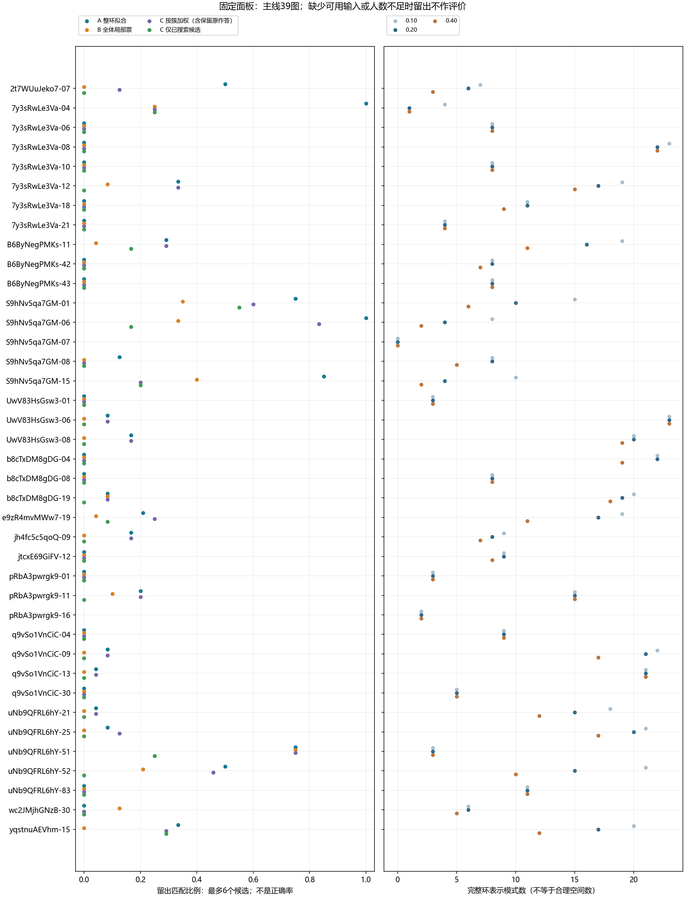
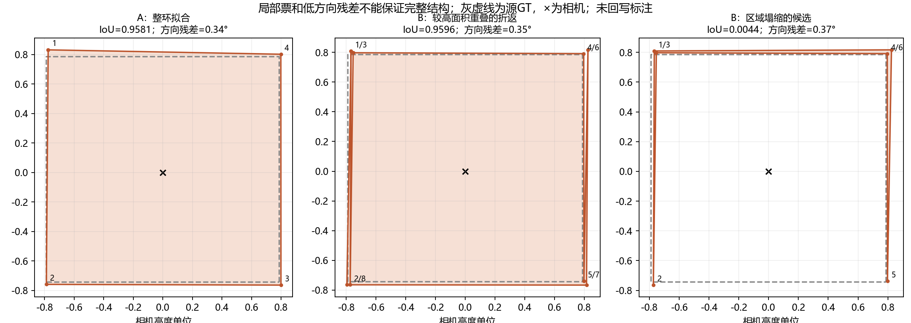

# 多结构共识与人员质量：40图本地探索

**本轮实现三个原型：A保留整环支持的分模式拟合；B最少／最多点起步的实际局部增删；C全体点池、按簇差异加权的增删。**

这是开发面板上的条件实验。没有独立确认每张图的允许范围，也没有恢复未审的真实邻接，因此不能把输出数量称为“已证明的合理共识数量”。

[查看全部图片、俯视与三维线框](index.html) · [机器结果](results.json) · [原始来源核验](input_panel.json) · [六图只读视觉观察](visual_notes.json) · [验证记录](VALIDATION.json)

## 1. 人员质量、分簇与共识为何相似，但不能混同

| 研究 | 研究对象与问题 | 当前方法和输出 |
|---|---|---|
| 分簇 | 同图有哪些相似的结构表达？ | 输出分组、成员和差异位置；相似不等于正确。 |
| 共识 | 多人信息能否形成一个或多个可复现布局？ | 输出实际布局候选、完整／局部支持和留出复现；需要检查拼接是否合法。 |
| 人员质量 | 可比图片、同一允许解释下，谁更准确／稳定？ | 跨图定位误差、系统偏差与重复性；不能用簇大小或与单一GT的距离直接替代能力。 |

旧页面复用的历史分簇采用 shared-x、同点数硬门、周期 ERP 最大端点距离 25.6 px；比较 complete-linkage 与直径约束的二次亲近度全局 MILP，后者不是 Affinity Propagation，也不是 IoU 聚类。历史结果只在当前有效点匹配时复用。本轮没有重写旧分簇或更新人工裁决。

新整环路线使用共同相机高度单位下的对应角点距离。它确实以分簇作为上游，再估计簇内代表，因此看起来相近；但分组和估计新坐标仍是不同步骤。局部增删路线另行实现，不借用分簇结果当目标。人员质量本轮不产生新排名。

## 2. IoU＋质心与不确定性

IoU＋质心可测与指定参考的差异，不能从单一 GT 自动区分合理范围选择与实际标错。质心、RMSE 或更复杂的加权函数均不能补齐未定义的参考集合。若同一组“8人选A、4人选B”的观测既能由两个合理范围解释，也能由一组人共同误解解释，仅靠这些标注无法唯一辨认两种机制。

应先区分范围模式选择，再研究模式内定位。一个可说明辨识条件的模型为 `误差(w,i,m,r)=人员项(w)+图片/模式项(i,m)+人员×图片项(w,i)+重复操作项(w,i,r)`。图片和人员需要交叉且连通；同人同图间隔重复才有助于进一步拆分交互与随机操作波动。一次观测无法完全拆开后两项。图片平均效应不是直接测得的数据不确定性，人员平均效应也不是模型的 epistemic uncertainty。

语义分割同样可能有多种合理答案；[Probabilistic U-Net](https://arxiv.org/abs/1806.05034)研究的是合理分割及其出现频率的分布。[Lee 等](https://ceur-ws.org/Vol-2173/paper10.pdf)也区分语义歧义、语义错误和边界不精确；其最大簇路线不等于保留所有合理 layout。[Welinder 等](https://proceedings.neurips.cc/paper_files/paper/2010/hash/0f9cafd014db7a619ddb4276af0d692c-Abstract.html)将人员能力、偏差和图片因素分别建模。

## 3. 实际算法与尚未解决的部分

**A：整环约束路线。** 同点数完整环以循环换起点／反向等价匹配，不改变邻接、不平移缩放对齐；complete-linkage 后用中位数和软 Manhattan 项拟合，高度一致性权重低于方向项。短边连续降低方向约束权重，近180°只诊断。每个候选重新统计全训练集的点支持、真实相邻边支持及整环支持。最少／最多点到已观察目标的动态规划增删是受限重建路径，不能把它说成自动发现未知拓扑。

原分簇成员互斥；拟合后的候选支持重新查询全部训练者，因此支持集合可以重叠，不能把各候选人数相加。C的“至少3人启动搜索”使用原分簇成员数，不能与拟合候选整环支持数混用。

**B：实际局部增删路线。** 从最少／最多点原环独立起步，依据其他人员给定环里的连续短链提出插入；依据有票支持的跨边或精确共线证据提出删除。按局部支持及弱几何项做有限束搜索；候选生成不使用 A 的整环目标。没有完整环支持的新拼接保留警告，不升级为合理真值。每次最多2步、束宽3、连续短链长度和提案数量另有限制，机器结果保留截断情况。B目前只生成地面结构，未推断新增点的高度；完整3D高度项仅在A中验证。这是明确受限原型，不是完整拓扑空间最优解。

**C：全点池、按簇加权。** 整理全部训练者的点位、来源和原连边；针对每个训练簇，以其原环为骨架，使用整个点池中的连续链做局部增删。簇内权重1，簇外原始权重 `0.25·exp(−D/0.20)`，D为双向最近点均距加点数差惩罚；簇外总权重再限制为簇内的0.25倍。另跑簇外权重为0的硬分簇对照。权重和不叫作人数，原始整数支持单独保留。少于3人的簇保留原候选并明确未搜索；这是计算和证据限制，不把它们判成错误。这个上限有意保护少数，保护成功本身不能证明少数正确。

三条路线均不把 IoU、质心或目标 GT 放入构造参数。去掉这些参数不等于不需要位置匹配：同样正交但位置不同的房间必须能区分。默认角点容差0.20，相机高度为1；敏感性为0.10/0.20/0.40，局部支持阈值为0.35/0.50/0.65，未根据 GT 选最佳值。3票和5票仅为描述分档，不是正式共识资格门槛。

A仍对点数敏感：同空间的共线冗余点也可能分出不同表示模式；远处深度敏感、未审点序和整环最大距离门限也可能碎裂模式。B/C可能漏掉需要超过两步恢复的结构，局部多数还可能拼出无人整体认可的组合。C继承原分簇误差，且仍未生成高度。所有失败保留，不能把所有小簇叫作新合理空间。

## 4. 面板、分母与留出

事前纳入全部33张既有门洞/OOS暂缓图片，加入B6ByNegPMKs-11、e9zR4mvMWw7-19、wc2JMjhGNzB-30，以及4张低点数对照，共40图。门洞/OOS标记是既有复核意见；低点数不等于已确认简单。没有根据本次算法输出或GT分数换图。

605份accepted作答逐份核验原始导出：377 manual、192 oos、36 semi。另40份历史排除只作库存记录。586份可投影条件环、19份不可用，均保留在分母；17份缺已有配对，2份已有点修订不进入本次raw来源拟合。

Manual/OOS合并探索涉及39图，569份库存、550份可计算。Semi单列；B6ByNegPMKs-22为全Semi图；S9hNv5qa7GM-07主线四份均缺既有配对，不能静默剔除。

每图固定4次约75%训练/25%留出人员划分，整个候选生成仅用训练者。留出者不能建立角点池、模式或影响参数。同一人不能同时进入训练与测试；多次划分不是新增独立人员或建筑。表中覆盖率的分母仅为可投影输入中的留出人员，19份适配器不可用不进入该比例、另报缺失；覆盖率是这些留出作答能匹配任一候选的比例，不代表候选正确率；输出更多候选可能提高覆盖，须同时看候选数量及零支持输出。

## 5. 全部主线结果

A/B/C全部候选覆盖可能受输出数量影响。因此下表统一按训练集整环支持排序、仅去掉完全相同环、最多保留6个候选再评留出者。未用测试者或GT选候选；实际候选不足6时不补造。完整不限数量结果在机器记录。

C额外区分全部保留候选与确实经过簇条件搜索的候选，防止保留原始少数作答带来的覆盖被误称为“新共识生成成功”。

| 图 | 库存/可算 | A候选数 | A≥3票 / ≥5票 | A留出≤6 | B留出≤6 | C全部≤6 | C已搜索≤6 | C候选/零整环支持 |
|---|---:|---:|---:|---:|---:|---:|---:|---:|
| 2t7WUuJeko7-07 | 8/8 | 6 | 2/1 | 0.500 | 0.000 | 0.125 | 0.000 | 11/4 |
| 7y3sRwLe3Va-04 | 24/24 | 1 | 1/1 | 1.000 | 0.250 | 0.250 | 0.250 | 6/6 |
| 7y3sRwLe3Va-06 | 8/8 | 8 | 0/0 | 0.000 | 0.000 | 0.000 | 0.000 | 8/0 |
| 7y3sRwLe3Va-08 | 24/24 | 22 | 0/0 | 0.000 | 0.000 | 0.000 | 0.000 | 24/0 |
| 7y3sRwLe3Va-10 | 8/8 | 8 | 0/0 | 0.000 | 0.000 | 0.000 | 0.000 | 8/0 |
| 7y3sRwLe3Va-12 | 24/23 | 17 | 3/0 | 0.333 | 0.083 | 0.333 | 0.000 | 24/6 |
| 7y3sRwLe3Va-18 | 11/11 | 11 | 0/0 | 0.000 | 0.000 | 0.000 | 0.000 | 11/0 |
| 7y3sRwLe3Va-21 | 5/4 | 4 | 0/0 | 0.000 | 0.000 | 0.000 | 0.000 | 4/0 |
| B6ByNegPMKs-11 | 24/24 | 16 | 4/3 | 0.292 | 0.042 | 0.292 | 0.167 | 27/10 |
| B6ByNegPMKs-42 | 8/8 | 8 | 0/0 | 0.000 | 0.000 | 0.000 | 0.000 | 8/0 |
| B6ByNegPMKs-43 | 8/8 | 8 | 0/0 | 0.000 | 0.000 | 0.000 | 0.000 | 8/0 |
| S9hNv5qa7GM-01 | 20/19 | 10 | 4/4 | 0.750 | 0.350 | 0.600 | 0.550 | 23/10 |
| S9hNv5qa7GM-06 | 10/10 | 4 | 4/1 | 1.000 | 0.333 | 0.833 | 0.167 | 11/6 |
| S9hNv5qa7GM-07 | 4/0 | 0 | 0/0 | 不可评价 | 不可评价 | 不可评价 | 不可评价 | 0/0 |
| S9hNv5qa7GM-08 | 8/8 | 8 | 0/0 | 0.125 | 0.000 | 0.000 | 0.000 | 8/0 |
| S9hNv5qa7GM-15 | 20/20 | 4 | 3/3 | 0.850 | 0.400 | 0.200 | 0.200 | 15/12 |
| UwV83HsGsw3-01 | 4/3 | 3 | 0/0 | 0.000 | 0.000 | 0.000 | 0.000 | 3/0 |
| UwV83HsGsw3-06 | 24/24 | 23 | 0/0 | 0.083 | 0.000 | 0.083 | 0.000 | 24/0 |
| UwV83HsGsw3-08 | 24/22 | 20 | 0/0 | 0.167 | 0.000 | 0.167 | 0.000 | 22/0 |
| b8cTxDM8gDG-04 | 24/24 | 22 | 0/0 | 0.000 | 0.000 | 0.000 | 0.000 | 24/0 |
| b8cTxDM8gDG-08 | 8/8 | 8 | 0/0 | 0.000 | 0.000 | 0.000 | 0.000 | 8/0 |
| b8cTxDM8gDG-19 | 24/23 | 19 | 1/0 | 0.083 | 0.083 | 0.083 | 0.000 | 26/4 |
| e9zR4mvMWw7-19 | 24/24 | 17 | 1/0 | 0.208 | 0.042 | 0.250 | 0.083 | 21/0 |
| jh4fc5c5qoQ-09 | 9/9 | 8 | 0/0 | 0.167 | 0.000 | 0.167 | 0.000 | 9/0 |
| jtcxE69GiFV-12 | 9/9 | 9 | 0/0 | 0.000 | 0.000 | 0.000 | 0.000 | 9/0 |
| pRbA3pwrgk9-01 | 3/3 | 3 | 0/0 | 0.000 | 0.000 | 0.000 | 0.000 | 3/0 |
| pRbA3pwrgk9-11 | 20/17 | 15 | 0/0 | 0.200 | 0.100 | 0.200 | 0.000 | 17/0 |
| pRbA3pwrgk9-16 | 2/2 | 2 | 0/0 | 不可评价 | 不可评价 | 不可评价 | 不可评价 | 2/0 |
| q9vSo1VnCiC-04 | 9/9 | 9 | 0/0 | 0.000 | 0.000 | 0.000 | 0.000 | 9/0 |
| q9vSo1VnCiC-09 | 24/24 | 21 | 1/0 | 0.083 | 0.000 | 0.083 | 0.000 | 23/0 |
| q9vSo1VnCiC-13 | 24/23 | 21 | 0/0 | 0.042 | 0.000 | 0.042 | 0.000 | 23/0 |
| q9vSo1VnCiC-30 | 5/5 | 5 | 0/0 | 0.000 | 0.000 | 0.000 | 0.000 | 5/0 |
| uNb9QFRL6hY-21 | 24/21 | 15 | 0/0 | 0.042 | 0.000 | 0.042 | 0.000 | 21/0 |
| uNb9QFRL6hY-25 | 23/23 | 20 | 0/0 | 0.083 | 0.000 | 0.125 | 0.000 | 22/0 |
| uNb9QFRL6hY-51 | 6/6 | 3 | 1/0 | 0.750 | 0.750 | 0.750 | 0.250 | 4/0 |
| uNb9QFRL6hY-52 | 24/23 | 15 | 6/1 | 0.500 | 0.208 | 0.458 | 0.000 | 28/12 |
| uNb9QFRL6hY-83 | 11/11 | 11 | 0/0 | 0.000 | 0.000 | 0.000 | 0.000 | 11/0 |
| wc2JMjhGNzB-30 | 6/6 | 6 | 0/0 | 0.000 | 0.125 | 0.000 | 0.000 | 6/0 |
| yqstnuAEVhm-15 | 24/24 | 17 | 2/1 | 0.333 | 0.000 | 0.292 | 0.292 | 19/0 |

可做留出的主线图片有37张。按图片等权的描述性平均覆盖为：A=20.5%，B=7.5%，C全部候选=14.5%，C仅已搜索候选=5.3%。这不是准确率，也不是外建筑验证。当前原型尚不能据此声称生成了几种可靠合理的房间共识；C也未显示出普遍优于A的复现结果。



**一个实质性失败：**低点数对照7y3sRwLe3Va-04在默认完整环门限下24人可合为一组，但局部增删会反复借用同一房间其他边的路径，拼成窄条或近重叠折返。其方向残差仍可很小、局部票仍高。图中既展示高IoU但多余折返的候选，也展示空间范围塌缩的候选。仅有点/边边际票与Manhattan自洽并不足以保护完整结构。

失败图是在计算后按原GT一致性的高低选取用于诊断展示，不参与算法选解、调参或总体准确率估计。



这里的“零整环支持”严格指当前点数与对应门限下无匹配，不能一概解释为没有人会接受该空间。新增冗余点或一个人都没完整画准的正确融合也可能零匹配。因此一方面要防混合结构，另一方面也不能把“必须有人完整标过”作为正确性的充分必要条件。


每图详单、各容差、几何/高度消融、每次留出成员及真实局部增删轨迹均在 cases/ 的压缩JSON中。既有 GT 仅在拟合完成后计算条件参考一致性；6份修订GT没有确认配对，明确不可评价。MV基线只对有效多边形子集计算，记录所用人数；未与包含无效环的路线冒充相同分母准确率比较。

门洞/OOS并不逻辑上阻止群体共识。但暂时无稳定输出可能来自范围歧义、模型不适用、人员不足、匹配门限或未审连接，不能从本次某个算法失败推导“这张图不可能有共识”。同理，稳定且正交的输出也可能遗漏真正结构。

## 6. 尽量少人工的 human-in-the-loop

人工可以从逐份人员打分，转为按图片审范围定义、参考冲突和少量随机对照。审核时先盲化人员身份、支持人数和算法名称，对照原图及可用的扫描／相邻视点证据；保留审核者分歧和unknown。不能把所有观测簇追加为合理GT，或为使算法通过而改参考。

优先自动执行：来源核验、投影和几何诊断、跨人员留出、重复标注一致性、参考版本敏感性、局部支持与完整结构冲突检查。人工集中于新模式、任务范围冲突和表示失败，另外保留随机抽审以发现未被报警覆盖的错误。候选生成者与独立合理性评价分开。

如果完全不进行独立合理性核验，也没有扫描等外部证据，研究仍可以客观报告群体解释、可复现性及条件一致性；但人员绝对准确性与“合理共识”应标为未知。客观性来自可复算、预先规则、独立证据和公开不确定，而不是把主观判断藏进算法阈值。

## 7. 边界与复算

当前只做离线探索。没有新排除人员、没有改原始点、GT或正式合同；全量排序与风险筛选继续搁置。需要已确认范围与连接、同人重复及外建筑数据，才能进一步验证人员质量和对新图片的泛化。

```powershell
D:/anaconda/python.exe -m tools.thesis_main.analysis.structural_consensus_panel_20260926
D:/anaconda/python.exe -m tools.thesis_main.analysis.run_structural_consensus_20260926
```

新增源文件：structural_consensus_20260926.py、local_structure_edits_20260926.py、structural_consensus_panel_20260926.py、run_structural_consensus_20260926.py；对应tests各一份。验证命令与通过数量见VALIDATION.json。目录地图与README仅登记探索入口；未运行全仓库测试，因为未修改正式运行核心。
