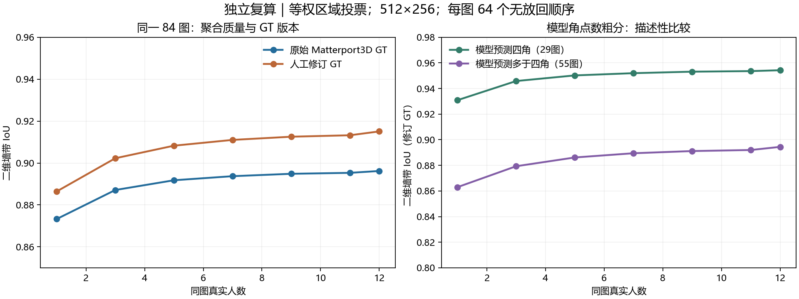

# 导师新方向的独立判断与 GT 敏感性复算

2026-09-22。性质：探索研究，不修改正式 Paper A 合同、人员资格或采集安排。

**我的判断：这条研究路线可以成立，核心应是“图片条件与人员构成如何影响多人区域聚合的准确性和稳定性”。IoU 是评价工具，共识是聚合操作，分簇是可选的分歧分析；它们不是必须依次执行的一套算法。现有数据支持继续研究聚合收益和模型难度信号，但不足以宣称已经分离了两种固有不确定性，或确定了普遍的收敛人数。**

本次先由两个独立子任务审查论文和研究设计，另一个核查原始 GT；论文和设计子任务未读 Pro 包。我从本地真人导出绑定重新构建计算输入，另写最小复算，没有调用 Pro 的共识、权重或人员拟合代码。Pro 包随后仅作为待核查的已有探索，不以其选定方法和结论为研究前提。

## 2026-09-23 用户澄清与预处理核验

**IoU＋质心的研究定位：**这是用户与导师提出的GT参照人员质量度量，目的在于研究人员造成的不确定性；不是要求复现指定共识论文，也不是默认拿来做人员间分簇。此前反复强调其不是论文公式偏离了讨论重点。落实时，先获得每人每图的质量指标，再调整图片差异，估计人员表现；逐份GT偏差同时包含图片和人员影响，不能未经图片调整就称作纯人员效应。指标合成系数与人员投票权重仍是两个不同参数，不预设各占一半。

**纳入BiLayout双输出差异作为候选范围歧义信号：**同图enclosed与extended区域差异可用`1-IoU(enclosed, extended)`连续衡量，另记角点数差及局部差异位置。差异应按已明确的区域表示计算，不以浮点坐标是否完全相同二分难易，不用GT选择更有利的双头差异。BiLayout原论文确实讨论用双输出差异识别歧义区域，适合作为本方向依据；当前将它纳入研究方案，尚未重跑其与真人曲线的关联。[原论文官方页面](https://openaccess.thecvf.com/content/CVPR2024/html/Tsai_No_More_Ambiguity_in_360deg_Room_Layout_via_Bi-Layout_Estimation_CVPR_2024_paper.html)

本地历史双头manifest覆盖648图，646图status=ok、2图degenerate；当前241图的两份预测文件全部存在，其中239图ok、2图degenerate。退化项保留状态，不把它当作确定的范围歧义，也不删除该图的真人记录。双头一致只说明模型给出了相近解释，不能排除共同错误或模型没有显露歧义。双头差异更直接指向范围选择歧义，HoHoNet角数/几何异常可作为另一组结构与模型处理难度特征；不将它们机械合成单一难度总分。

**Pro预处理直接核查：**读取交付包`code/00_reprocess.py`和`inputs/annotations.json.gz`。2481份保留描述记录，2448份有上下绑定并生成共享x；逐份验证了周期中点公式与y坐标保留。无借点独立计算池2444份与本地`shared_x_reanalysis_20260922/pointsets.json.gz`逐点最大差为0。没有0.2触发阈值，没有对不同人取均值，原始点仍保留。

本轮Pro额外使用的明确人工错误名单只有`new_95_3654_7089_W037`与`new_95_3654_7259_W034`，均为B6ByNegPMKs-42的既有“两个都错”裁决，未整人删除W037。其共享x地面可计算视图2398份，进一步单平面检查2397份，再去这两份为2395份；这组计数混合了几何计算适用性与已有人工排除，不能称作全面人工清洗后的唯一数据集。

因此，共享x已实际完成；不能确认已完成“全体作答明显错误”的逐份筛查。接下来应保持原始记录、共享x处理版、逐份审核状态三层，只有明确错误裁决进入通用排除；无法使用某种3D计算的记录留作该指标的不可评价状态，不自动排除出二维、不确定性或难图研究。本轮仅补充研究说明与只读核验，没有新增排除或改动坐标/资格。

## 1. 先回答讨论中的两个分歧

**IoU 和质心本身不要求知道点的保存顺序。** 当输入已经是区域 mask 时，它们只依赖哪些位置属于区域。你没有保存三维连接顺序，不妨碍开展二维区域分析。

我最初检查顺序，是因为试算了俯视地面多边形：从角点构造地面区域时，邻接关系会影响面积。这是一个需要明确声明的表示选择，不应被当作你和导师已经决定的主方法。因此本次后来增加了不依赖地面环序的全景二维墙带计算；地面结果只作为另一种表示的敏感性结果。

**模型出错可以直接定义为“该模型处理困难”，也可以作为真人标注难度的候选信号。** 你提出的方向值得保留。需要研究的是这个信号怎样对应真人的起点质量、聚合质量和所需人数；不能在分析前把这些关系直接定义为必然成立。

你说的“默认连接会自交，需要考虑墙后遮挡并调整角点连接”可以成为结构重建困难的证据。但需要区别：确有遮挡/凹形结构导致的连接困难、模型坐标错误、导出列表不是连接顺序。三者都可能需要额外处理，却不是同一种图片成因。困难图片保留在研究中，不能为了得到漂亮曲线直接删掉。

## 2. 最重要的前提：我们到底在比较哪一种区域

| 区域定义 | 可以回答什么 | 主要局限 |
|---|---|---|
| 全景二维墙带：上、下边界之间的区域 | 各人的上下边界是否覆盖相近范围；是否更接近参考 | 不充分描述墙角数量、墙与墙之间的结构、遮挡后邻接关系 |
| 俯视地面区域 | 地面范围、面积和位置是否准确 | 需要明确的地面连接关系；不能评价 top y 的全部错误 |
| 完整三维布局 | 同时研究形状、高度和拓扑 | 需要更多几何与遮挡约定，不是当前二维聚合的必要条件 |

本次二维操作定义为：已经绑定的上下角对共享周期平均 x；在经度方向做周期线性插值，得到上下包络，再栅格化包络之间的墙带。该定义复用仓库既有二维布局指标的插值约定。它对输入点对列表的排列不敏感，但仍需要上下角色及绑定；它不是重新人工标注的可见墙面语义分割真值。

这件事比选择一个复杂共识算法更优先：**如果两份标注只是多画/少画一个共线角点，围成的区域可能完全相同，IoU=1、质心差=0；这两个指标都不会发现结构差异。** 若论文同时关心结构解释，必须另报结构或局部边界指标，不能声称区域分数覆盖了完整布局质量。

对全景图还有一个特殊问题：普通横坐标平均会受到接缝位置影响。二维质心至少应使用周期横坐标；当墙带在整圈经度上接近均匀时，水平圆均值的方向本身不稳定。理想的整圈矩形墙带甚至没有唯一的水平圆质心方向。本次保存圆均值集中程度，不把缺乏方向性解释为人员质量差。

**因此我建议先分别报告 IoU、位置偏差、必要的结构错误，再检验质心是否提供额外信息。** 质心是面积质心，不是图片中心或角点算术平均。即使在地面区域，同心大小方形的质心也一样：面积扩大四倍时，IoU可降到0.25，而质心差仍为0。

## 3. GT 敏感性：已经实际计算了什么

直接使用：

- 原始 Matterport3D：`data/mp3d_layout/test/label_cor` 458图与 `valid/label_cor` 190图。
- 人工修订：`export_label/groudTruth.json`。独立核对出30张实质修改，其中21张改变点对数量，9张同数量坐标改变。
- 修订版本只替换这30张，其他图继续用原始 GT，避免把存储舍入和纯排列变化混入修订效果。
- 未采用 HoHoNet/no-occ GT，也未用 P1 final-gold 自动覆盖这两版参照。

当前描述池为2481份、241图、25人、22栋建筑；其中22张修订图涉及416份描述作答。沿用既有绑定与独立性规则后，2444份无借点作答逐份回查原始导出。二维主计算有2405份、238图；其中22张修订图保留409份可评价作答。缺失和不可定义项列在审计表，没有补零。具体筛选见README。

固定同一84张、15栋建筑、每图至少12名可计算人员的面板，固定人员子集和抽样顺序，先生成共识，再分别换两套 GT 评分。单人值是该图全部可用单人的精确平均；多人值采用64个真实人员无放回顺序。顺序次数不当作独立样本数。

**二维墙带、等权区域投票，最终分辨率512×256：**

| GT版本 | 单人 | 11人 | 12人 | 单人→12人变化 |
|---|---:|---:|---:|---:|
| 原始Matterport3D | 0.8733 | 0.8953 | 0.8962 | +0.0229 |
| 人工修订版本 | 0.8864 | 0.9132 | 0.9151 | +0.0287 |

“聚合平均有收益”的方向在两版 GT 下都保留。但原始版本只有75/84图的12人均值优于单人均值，修订版本为76/84图；不能说每图加人都更好，也不能由这张表推出12人已经足够。

投票采用论文明确写出的“至少50%”。偶数票会包含平票区域，所以11→12的小跃升不能全解释为额外一人的收益；11人的奇数结果同样支持总体改善。64次重放只是有限历史人员池中的近似积分，并非未来新人的独立验证。本次没有据这些曲线给出显著性或停止阈值。

在面板中GT实际修改的16张图上，12人IoU为原始GT **0.8291**、修订GT **0.9283**；单人→12人增益分别为 **0.0187** 和 **0.0487**。因此，GT修改对局部结论的影响明显大于总体平均给人的印象。

在全部2405份二维可比作答上，换成修订GT的平均IoU变化为 **+0.01119**；仅看修改图中的409份，为 **+0.06580**。这说明评价确实依赖参考版本，不证明哪套参照天然正确。

图片效应调整后的25人人员误差排序，两套GT之间Spearman相关为 **0.9485**，最大移动 **6名**。这是描述性连续分数敏感性，不是稳定人员类型或正式资格判定。整体排序相关较高，仍不足以保证某个分类边界两侧的人员不会换类。

分辨率检查：同一作答在512×256与1024×512下的IoU平均绝对差为0.000928，最大为0.02233。个别边界敏感作答仍需看高分辨率数值；这里不据千分位差异挑选最佳算法。该检查覆盖逐份作答，未在1024×512上重跑全部聚合轨迹。

地面支路另存四种参照：原始/修订GT × 源序/角度包络。源序可计算的共同12人面板76图上，原始GT为0.7540→0.8005，修订GT为0.7647→0.8146。这些数值不能与上表直接比较，图片面板和区域含义均不同。30张人工修订GT中，16张当前列表不能直接作为地面环使用（15张环自交、1张相邻上下配对错位）；这不表示人工点位错误，也不影响已完成的二维分析。源序有效同样不等于三维拓扑已经人工确认。

**若以后用GT学习人员权重，还需第二层敏感性：**原始/修订GT分别训练权重，再交叉用两版GT评价，形成2×2比较。当前等权基线只需替换评价GT，已经完成；本次没有冒称完成了尚未建立的GT加权系统的敏感性。

## 4. 人员与图片的混杂可以怎样拆，哪里拆不了

给每个人直接平均IoU不能解决混杂：一个人可能恰好分到更多难图。GT只是统一参照，不会自动消除图片分配差异。

可以先建图片×人员的误差矩阵，缺失保持缺失，并拟合一个最简单的交叉模型：

`损失 = 总体水平 + 图片效应 + 人员效应 + 剩余项`。

本次描述数据的人员—图片二部图连通，所以在加性假设及标识约束下，有条件估计平均人员与图片效应。这不是“完全无法分开”。本次排序敏感性使用此类无调参的描述性固定效应拟合；未把它当作未见建筑的预测准确率。

但2481份对应2481个唯一人员×图片单元，没有同人同图重复测量。因此剩余项中的“此人特别不擅长这种图”“此次偶发走神”“未记录条件”不能唯一分开。图片效应也只是这套规则与当前人群下的困难程度，不是图像不可改变的固有噪声。GT范围不合适也会制造看似普遍的图片困难。

联合建模人员能力与任务难度有既有研究先例，但其假设与当前连续布局误差并不相同，不能直接把模型名字当成识别保证。[Whitehill等，2009](https://papers.nips.cc/paper/2009/hash/f899139df5e1059396431415e770c6dd-Abstract.html)

**当前可以诚实做“调整图片差异后的人员质量，以及调整人员构成后的图片难度”。** 只有坚持研究同一个人的随机波动，才需要跨时段重复子集；导师按人独立采集、事后组合的主安排可以继续，不必为每种组合重新实验。

人员类型先不急于定为认真/粗心：几何结果只能直接支持相对参照的质量差异，不能证明人的动机。优先用连续分数；在其他建筑上验证其稳定性后，再形成有解释力的分组。W022目前只有2图、1栋建筑，不能给出稳定类型。当前未分类不等于数据不能参与等权聚合。

## 5. 共识、分簇、IoU/质心分别负责什么

| 对象 | 计算 | 作用 |
|---|---|---|
| 一个人与GT | IoU、位置偏差及结构指标 | 记录该人该图的相对误差；经图片调整后研究人员差异 |
| 同图两个人 | 区域相似度矩阵 | 描述分歧，必要时发现多种表达模式 |
| 多个人的区域 | 每个位置的票数/概率与聚合mask | 形成共识结果 |
| 聚合区域与GT | 随人数变化的质量 | 检验增加人员是否改善准确性 |

指定论文采用区域叠加的tile、投票/EM/greedy，并讨论基于人员间IoU的谱聚类后保留最大簇；没有给出IoU加质心公式。其读取GT的full-information上界也与可部署的无GT聚合分开。[Lee等，2018原文](https://ceur-ws.org/Vol-2173/paper10.pdf)

因此至少有三种不同的“权重”：IoU与质心的指标组合系数、不同人员的投票权重、区域属于目标的概率。前一个分数的构造不会自动给出后两个算法。

**分簇应放在“是否存在多个稳定结构解释”的问题下，不能成为计算共识的通行证。** 最大簇可能是共同错误；少数簇也可能对应正确范围。若只保留最大簇，结果研究对象会变成被算法筛选后的那部分人，必须同时报告被丢掉多少人及其差异。

当不同范围均可接受时，还要先区分合理歧义与错误；多种合理回答并不自然等于低能力。[Jin等，2018](https://proceedings.mlr.press/v95/jin18a.html)

## 6. “收敛”建议拆成三条可检验曲线

1. **准确性**：当前聚合与GT的距离。
2. **结果稳定性**：加人以后聚合mask改变多少。
3. **人员构成敏感性**：同样人数、不同成员组合产生多大差异。

三者可以相反。全体人一致犯错时，结果十分稳定，但不接近GT；有限池无放回重放到了最后，所有顺序使用同一批人，顺序间差异必然消失，这本身不是发现了标注质量上限。

“不显著改善”也不能证明已经到平台。更合适的后续问题是：在观测人数范围内，再增加一组人带来的平均改善是否小于事先定义的实际重要差值，同时组合差异是否足够小？未达到门槛与观察人数不够必须分开保留。

当前多人累加是对不同人员作答的聚合，不是同一人多轮修订，也不是模型反复学习。论文应直接写清楚是哪一种过程。

同房预测先考虑预测固定人数下的质量Q(k)或达到某精度的概率。“预测最少需要几个人”更难，因为不少图尚未观察到达标。房间/建筑分组隔离训练与验证；不能靠持续加数据直到显著来决定路线。若它对简单基线没有稳定的增量，可以按导师意见暂缓。

## 7. 图片难度：你的模型粗分思路有当前数据支持

我直接读取本地冻结的HoHoNet预测TXT。当前84图面板的描述性结果如下，均为修订GT与同一墙带指标：

| 模型输出 | 图片数 | 单人质量 | 12人聚合质量 |
|---|---:|---:|---:|
| 四角 | 29 | 0.9309 | 0.9543 |
| 多于四角 | 55 | 0.8630 | 0.8944 |

模型自身IoU与真人12人聚合IoU的图片间Spearman相关：原始GT下0.6566，修订GT下0.5581。**这支持把模型表现/结构复杂度作为候选难度信号继续验证。** 这是同批图片上的描述关系，未调整所有人员分配差异，也未完成新建筑预测；两者共用GT，参考本身的变化也能影响相关。

还应注意：多角组从单人到12人的绝对增益约0.0314，四角组约0.0234。多角组最终更差，却不意味着它的绝对上升幅度更小。因此“难图曲线慢”最好操作为达到同一精度更晚或观测范围内仍达不到，而不是先规定曲线斜率更小。

HoHoNet代码中确实存在一般布局无效后退回cuboid的逻辑，见`lib/model/modality/layout.py`。所以最终四角结果可能是简化退回，不能仅凭四角输出断言结构真的简单。本次未从逐图日志恢复fallback标记，未将任何具体四角图臆判为退回结果。

建议保留连续、可审计的候选特征：模型角点数、预测几何是否可用、是否确认发生退回、是否需要改变默认连接才能解释结构。再检验它们对人类质量曲线的预测。模型与GT误差可以用于离线验证这个关系，但在无GT的新图上不能直接获得，应另检验只需模型输出就能计算的特征。

把疑难图单列有价值；同时保留全体和分层曲线。剩余图片更好不等于聚合算法变好，只说明研究对象发生了变化。非曼哈顿图究竟是难例还是任务范围外样本，也必须以实际标注任务定义区别。

## 8. 预处理与人员组合的边界

上下角对取共享x是合理、可复算的几何规范化；跨全景接缝应取周期中点。它只约束同人同角对，不平均不同人员，也不自动改变y、点数和结构含义。它会消去一类原始误差，建议保留原始/规范化两版用于诊断，不能一概叫确定纠错。

明显无关对象、空白、越界等可以按具体作答处理；少数意见、IoU低或标注者叫W037都不是自动删除理由。如果要研究低质量成员怎样影响AABC，先删除他们所有低质量答案，就改变了研究问题。本次只沿用既有明确裁决的2份错误排除，没有新增整人排除；几何不可评价在各指标自己的审计表中保留，未解释为同一种人员错误。

ABCD/AABC的组合可以直接使用已采集的独立作答。有效比较需固定同图、同人数、同预处理和聚合器；两个A应来自不同真人；分类依据不能使用目标图的评价GT。尽量在同一种比例下轮换具体成员，区分“类型比例”与“恰好某个人”的作用。几万种重组合不是几万独立被试。

## 9. 我建议的研究推进顺序

**第一步：明确区域质量的适用范围。** 用二维区域先研究上下边界与范围；结构差异另列，不因IoU已经高就忽略。地面/三维支路有其价值，但不把补存三维顺序设为二维研究的门槛。

**第二步：以等权聚合作为固定基线，报告准确性、稳定性和构成敏感性。** 原始/修订GT贯穿所有主要结论，固定图片面板与人员抽样。当前84图结果支持这一基线值得继续研究。

**第三步：在目标建筑之外估计人员质量。** 先连续分数，验证可迁移性后再讨论类别。用同图同人数比较成员构成，不为了凑ABCD强制划类。

**第四步：只检验有明确增量问题的方法。** 等权对GT校准人员加权；IoU校准对IoU+质心校准；必要时再比较聚类前处理。调参在训练建筑内部完成。若质心或分簇没有稳定增量，保留否定结果即可。

**第五步：检验模型难度信号能否在留出建筑预测质量曲线。** 当前角点数关系是探索证据，不能从同一批曲线后见选出难图，再宣布难图确实难。同房预测放在此后，作为能否增加信息的可选问题。

这条顺序保留导师“按人采集、离线模拟人员组合”的要求，也把你的困难图片想法转化为可检验的问题。当前不需要为了每种人员配比重新做实验；若后续补采集，应优先补交叉覆盖和未见人员/建筑的验证，而不是只增加重采样次数。

## 10. 对 Pro 探索的采用边界与本轮验证

Pro可以提供算法候选，不能替代研究问题和区域定义。其参考登记混合updated import、validation import和P1 final-gold，不等于本次要求的原始MP3D/人工修订双版本对照。其“质心没有增量”“固定两簇更差”等数值只属于它所用表示、权重映射、面板和参考组合；本次未逐项复现其15个算法，既不直接接纳，也不据此否定质心/聚类的所有可能实现。指定短文所引用技术报告本次无法获取完整正文，未冒称精确复现其EM或greedy细节。

本次完成：原始导出核验2444份；独立等权/代表作答地面支路；二维等权支路；GT与区域表示敏感性；描述性人员排序敏感性；直接模型输出的难度诊断；分辨率检查。全部计算命令和字段见README。

相关测试6项通过。检查包括区域面积复原、GT替换不改变投票、质心漏检同中心形变反例、误差恒等式、二维输入排列不变性、周期质心和既有终审/共享x规则；全部个人分数和曲线均通过有限数及IoU范围检查。地面计算曾出现一次Shapely交集浮点警告，上述面积与数值检查通过；未通过缓冲或自动修环掩盖几何问题。

未运行全仓测试，因为没有改正式协议与其他生产工具；未做新人工语义/遮挡裁决、未给GT可靠性重新盖章、未重跑HoHoNet、未完成新样本泛化检验。原始标注、GT和既有工作区修改均未覆盖。正式方法合同边界保持不变。论文检查的临时截图已清理；本目录PNG是交付用数据图，不是临时截图。
