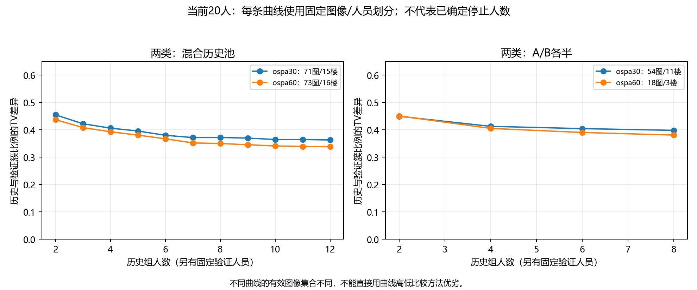

# 两类、三类人员：面向收敛问题的初步探索

2026-09-09。**目前更适合把当前20人的两类方案作为人数增长曲线的主探索，三类保留为敏感性和组合示例。现有回放出现边际变化变小的现象，但没有证明某人数已经收敛，也没有确定质量上限或最终人员类型。**

这里的“主探索”是数据可行性建议，非论文或实验定稿。全部旧阶段与条件继续合并；全26人与当前20人都计算，未按旧资格剔除人员。

## 导师的问题与本轮目标

导师最新书面对话将ABCD解释为人员类型，并提出按人采集，再后处理组合成ABCD、AABC等人群，不为每种组合重新实验。此前还要求讨论多轮标注的瓶颈及不同场景下的含义。

因此，本轮检验的是：暂定类型确定后，能否保持人员组成规则，增加历史人员，再对照另一批固定人员？不能只展示一个ABC三人组合，就认为已具备研究该组合收敛的资料。

区分三个问题：

1. 参考偏差能否形成可重复的人员类型：沿用前一轮楼外训练，不在目标楼重新按结果分型。
2. 类型内或混合人群随人数增长，响应分布能否更稳定：本轮主要探索。
3. 稳定结果是否正确、是否可迁移到新人：本轮没有完成证明。GT不确定时保留分歧分析，参考质量不计分。

## 数据与隔离

- 总入口2501条canonical；已确认计算视图中2465条可计算无序点集，覆盖214图。36条点集不可计算保留在来源视图，不填0距离。
- 人员类型仍从2027条参考可计分响应形成的2025个人—图单元学习。目标楼之外拟合连续工人参考偏差，再用Ward形成2或3组。OSPA30和OSPA60分别训练与回放。
- **目标楼内的分歧回放扩大到2465条可计算点集**，包括无法确定GT的图；这解释了为何图数从参考分析的184增加到214。不是以GT不可信为由删除分歧资料。
- 每个目标楼、每次排列，在每一类型内部按人数的2/3分历史组，其余固定作验证；同楼同人跨图保持角色。单人类型没有历史组人员。历史与验证不重叠。
- 每个配置20次固定随机排列，是有限旧资料的回放，不是20次新增实验。类型训练可用验证人员在其他楼的作答，所以不是完全未见新人的验证。
- 两组同人同图存在不同条件作答，每次回放随机取一份原响应；该次各方法共用同一选择。不平均坐标，不把同人两份作答算成两个人。
- A/B/C仅按训练参考偏差由小到大编号，不是已经证明的认真/粗心类型。不同楼外训练得到的成员可能不同。

## 组合和人数

纯A/B/C分别在同类型验证人员上检验；AB、AAB、ABC、AABC同时要求历史及验证组按相应比例取人，不用其他类型替补。ALL使用全部可用历史人员和固定验证人员，不保证每类型等比例。

保持比例增长：AB人数为2、4、6…；AAB/ABC为3、6、9…；AABC为4、8、12…。纯类型与ALL从2人开始逐人增加。各方法的验证人数与有效图可能不同，不能把不同曲线高低直接当作方法优劣。

当前20人，在主参数OSPA30/6°下：

| 分型 | 组合 | 至少一个可用回放的图/楼 | 可用回放中最大历史人数 |
|---|---|---|---:|
| 2类 | A | 84图/16楼 | 7 |
| 2类 | B | 124图/18楼 | 10 |
| 2类 | AB | 117图/18楼 | 12 |
| 2类 | AAB | 83图/16楼 | 9 |
| 2类 | ALL | 161图/20楼 | 13 |
| 3类 | A | 65图/15楼 | 4 |
| 3类 | B | 107图/17楼 | 8 |
| 3类 | C | 20图/1楼 | 6 |
| 3类 | ABC | 65图/15楼 | **3** |
| 3类 | AABC | 62图/15楼 | **4** |

这里“有回放”要求历史与验证各至少2名不同人员；还没要求所有几何分簇与TV可计算。大人数端点的覆盖远小于表中总图数。

**三类ABC只有一个人数点3，AABC只有一个人数点4，无法画保持比例的增长曲线。** OSPA60同样只有3和4。此前不留出人员时有更多ABC覆盖；固定另一批验证人员后，支持进一步减少是预期的数据约束。

三类C看似能取6人，仅来自 `uNb9QFRL6hY` 这一楼：其楼外训练把类型人数变成1/10/9，而其他楼通常约5–7/11–13/2。它不是“原来的两人C类增加到了九人”。OSPA60下纯C没有历史和验证均至少2人的支持。不能把这条局部曲线称为同一稳定C类型的收敛证据。

全部26人的类型也不自动更适合混合收敛：主参数下两类主要是24/2，AB最多取4名历史人员；三类ABC仍最多3人、AABC最多4人。历史上的两人小类型保留分析，但它没有提供更长类型混合曲线。

## 收敛指标及边界

复用无序球面点集距离和既有最大团分区枚举，阈值6°；保留分区不唯一，不为得到曲线强选一个分区。OSPA60为距离参数敏感性；本轮没有全面扫描分簇阈值。

- **固定历史簇的TV差异**：仅用完整选定历史组定义簇，固定验证响应的簇归属，再观察历史前缀的簇比例与验证比例之差。可保持多个簇，不要求最大簇占比趋于1。
- **每个人数点独立分簇**：每个前缀仅用当时已有人员重新分簇，保留簇数量、非唯一状态、验证未覆盖/多重兼容比例。
- **参考偏差辅助项**：从当前前缀选择点集距离medoid；并列时平均所有并列代表的参考偏差，不按GT好坏挑代表。无可靠参考或任何并列代表不可计分则留空。

固定历史簇的比例回放使用了完整历史池的信息，是回顾性分布恢复，不是在线发现未来结构。`prefix_to_full_history_tv`在全部历史人员进入后按定义为0，不能作为收敛证据。每个前缀重分簇是独立的补充检查；仅簇数相同也不保证簇的几何解释相同。

验证可兼容多个历史簇时TV留空；不把歧义强塞进一个簇。验证未被任何历史簇覆盖则进入outside类别。完整历史taxonomy的outside比例沿曲线固定，不能将它解释成逐步发现新结构的动态指标；另报前缀自己的outside/ambiguous。

## 固定样本的实际曲线

每条曲线固定同一批图及人员排列，只保留整条TV路径有值的回放。先在图内平均排列，再在楼内平均图，最后楼等权。有效与不支持记录全部另存，不随n更换样本后比较曲线。

当前20人，两类，主参数：

| 组合与固定观察范围 | 图/楼 | 起点TV | 终点TV | 最后一步变化 |
|---|---|---:|---:|---:|
| ALL，2→12人 | 71图/15楼 | 0.4547 | 0.3627 | 11→12：−0.0015 |
| AB，2→8人 | 54图/11楼 | 0.4493 | 0.3979 | 6→8：−0.0064 |
| B，2→8人 | 60图/15楼 | 0.4711 | 0.3743 | 7→8：−0.0036 |
| A，2→4人 | 54图/11楼 | 0.3716 | 0.3610 | 3→4：−0.0037 |

可以描述为：这些固定有限样本中，部分曲线后段变化较小，且验证分布差异仍然存在。**不能据此宣布8人或12人已收敛。** 残余TV同时可能包含验证组人数有限、人员组成、未覆盖结构和度量影响，不等于已经识别出图像固有不可约不确定性。

敏感性结果：ALL在OSPA60下2→12人的TV为0.4370→0.3380（73图/16楼）；AB的2→8为0.4506→0.3806，但只剩18图/3楼，主参数则为54图/11楼。曲线走势相近不代表适用范围稳健。

AB的2→12主参数只剩13图/1楼，不能外推成多场景12人规律。每种配置的完整支持范围见CSV。



图中每条线各自固定样本；不同线仍可能来自不同图，不能用纵坐标高低推断组合优劣。均值曲线没有置信区间，不是显著性检验。

多个簇没有被排除：当前20人、两类ALL、历史12人的1460个回放记录中，1243个前缀有唯一分区，其中941个保留至少2簇。这些是重复回放记录数，不是941张图，也不是已经证明941次稳定多簇收敛。实现测试另验证“两个持久簇、最大簇占比0.5、历史与验证分布一致”不会被强迫归为一个答案。

## 下一步怎样贴近导师主线

1. 暂以当前20人的两类方案推进人数曲线探索，三类保留对照，暂不固定人员类型或合格门槛。两类也不是已经得到稳定行为标签。
2. 优先核对楼外分型变化大的楼与边界人员，确定候选类型有没有可解释的行为差别；不能为了凑各类人数修改定义。尤其要解释 `uNb9QFRL6hY` 留出后的大变化。
3. 后续评价“是否收敛”需同时看分布恢复、簇组成/几何位置及参考偏差；允许稳定多簇，不以“所有人一致”作为唯一目标，也不把稳定当正确。
4. 若继续人数比较，使用每个待比较组合共同支持的同图、同人数资料，必要时单列无法支持的类型。当前各方法曲线不是公平的横向优劣比赛。
5. 导师提出的新人员数据应保留为后续验证：在查看新人结果前锁定候选类型定义、判定方法和待验证的曲线性质。按人收集后复用组合，无需为每一种AB/AAB再独立安排一次任务。本轮未确定需要招募多少人或最终停止人数。

给导师可汇报：

> 我把人员类型和后续人数收敛一起检查了。当前20人暂分两类后，已有数据能做AB等组合的人数增长回放；分三类时小类型人数不足，留出验证后ABC只能做3人、AABC只能做4人，还不能看增长曲线。两类的一些固定样本曲线后段变缓，但仍有多簇及验证差异，所以暂不说几个人已收敛。下一步我想先确认类型定义，再按人收集验证数据，后处理复用不同人员组合。

## 产物、字段与复现

入口 `tools/thesis_main/analysis/explore_type_convergence_20260909.py`；复用上一轮参考分型、已确认点集计算视图及既有分簇函数。未改原始导出、点序、资格、正式合同或其他任务正在修改的几何代码。无新增依赖、未上传。

```powershell
.venv/Scripts/python.exe -m tools.thesis_main.analysis.explore_type_convergence_20260909
.venv/Scripts/python.exe -m tools.thesis_main.analysis.explore_type_convergence_20260909 --summarize
.venv/Scripts/python.exe -m pytest tests/test_explore_type_convergence_20260909.py tests/test_worker_reference_feasibility_20260909.py tests/test_prepare_confirmed_point_calculation_view_20260909.py -q
```

- `PLAN.json`：20次排列、2/3历史份额、组合和度量边界。仅20次用于初探，不把重采样次数当新增人或精度保证。
- `fold_profiles.csv`：每楼外训练的类型、人员和训练楼清单。
- `coverage.csv.gz`：188320个配置/图/排列/方法支持记录，完整历史与验证人员及canonical IDs，`history_lt2`/`validation_lt2`不删除。
- `curves.csv.gz`：362345个人数点记录；`k`为人员类型数，**`n`才是历史人数**，`replicate`是回放排列编号。
- `support_summary.csv`：可回放图/楼、最大历史人数；这些不等于TV全部可计算。
- `fixed_panel_summary.csv` / `fixed_panel_curves.csv`：固定观察终点 `horizon` 的共同样本，支持划分数与TV有效划分数分别列出。
- `fixed_panel_curves.png`：已实际查看的独立图表。
- `QA.json` / `VERIFICATION.json`：数据覆盖、人员隔离及计算检查。

`full_partition_status`与`prefix_partition_status`分别属于完整历史taxonomy及当前前缀；`distribution_tv`为固定taxonomy下历史与验证比例差；`prefix_clusters`只在唯一分区时记录；所有缺失保留，不当成0。`medoid_reference_error`是候选代表相对参考的点集偏差，不是3D IoU或整体标注正确率。固定面板中的该辅助列可能只覆盖参考可用图，使用时必须另外列其参考支持数，不能套用TV的图数。

9项相关测试通过，包括人员隔离、组合比例、重复人拒绝和稳定双簇样例；已回读检查输出身份关系。未运行不相关界面测试，因为没有修改界面。索引及项目地图同步新入口。
