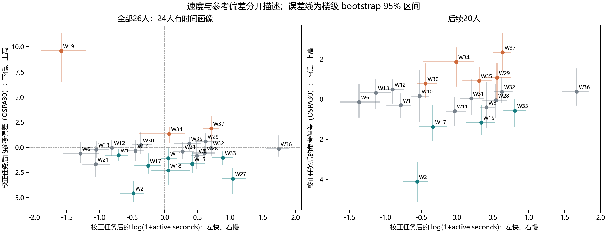

# 工人粗分类：速度与参考执行偏差的独立验证（2026-09-10）

**结论：现有数据支持把“相对标注速度”作为可解释的行为轴；速度不能替代参考偏差，尚未证明速度子类能收敛。跨阶段结果不一致，不能把快慢当作永久人员属性。**

## 1. 分类目的与本轮定位

交流原文要求以人为单位独立采集，再按人员类型和人数比例离线组合；“认真／不认真”是例子，没有规定必须采用这两个心理标签。可复用的是已有独立标注，不要求每种组合重新采集。理想结果还包括具体子类的分歧分布达到稳定阶段。

本轮只验证可解释的候选行为轴，不根据目标图的收敛结果反过来选人。速度、参考执行偏差、类内收敛是三个不同问题。上一轮参考偏差粗类的收敛结果不能自动移植到速度分组。

## 2. 数据与日志审计

- 延用上一轮已从原始标注和人工复核重建的1887条无辅助标注，包含26人、196图。排除2条补点记录后保留1885条；未补时间、未用lead_time。全部26人均留在人员表，W14、W26没有合格时间画像。
- 按各阶段原规则重算：P1的1128条、C2-B的160条、C2-A-RP两批各40条可用时间，以及C1全部780条时间上下文，数值／状态均与底座一致。C1冻结日志与active_logs/c1的26份文件逐事件一致；字节差异不代表事件差异。上述审计数量包括本轮未使用的Semi等记录。
- P1、C2-B和第一批C2-A-RP沿用历史project–task–worker日志规则；C1使用其owner-valid会话规则；第二批C2-A-RP使用该阶段专门的累计会话规则。规则可重放不等于各阶段测量制度完全等价。
- 审计发现W1、W18部分日志有统一增加20／25／30秒的记录。已标记任务身份，并在主解释中排除受影响行；不直接减去估计值来伪造原始观测。状态干净的1582条中排除82条，剩1500条。后续20人从1373条排除30条，剩1343条。原时间规则版本、缺失／覆盖不足／协议偏离均保留。
- “无已知人工加秒”是在来源审计后增加的解释限制，不是事前预注册假说。历史调整版本和包含覆盖不足／协议偏离的版本作为敏感性并列保留。

## 3. 怎样计算

速度使用 log(1+active seconds)，拟合人员效应＋原始图片/阶段/条件上下文截距；先消除任务差异再比较人员。0是本队列人员等权平均的相对基准，不是固定秒数门槛。参考偏差另用OSPA30，低表示较接近当前可评分参考，不能直接解释为完全遵守规则或真实质量。

每次留出整栋building，训练只使用其他楼，再预测这些已知人员在留出图片中相对同图人员平均值的偏离。目标图的参考结果和时间不参与训练。报告的是相对偏离的MSE改善，**不是分类准确率，也不是新图片绝对需要多少秒的预测**。单人上下文无法提供同图人员对比，不进入该验证；因此1500／1343条中实际验证1461／1304条。

速度—偏差关联仅在同一批同时有两种观测的响应上计算。用速度预测偏差时，速度画像和速度—偏差映射系数均只在训练楼拟合；不使用测试图自身耗时。最终人员表的参考轴则独立使用全部可评分参考标注，**缺时间不导致质量证据被排除**。

互斥分半：以building为单位随机分两半，重复100次，每半独立拟合人员效应。bootstrap：按building有放回重采样500次，报告95%百分位区间，图不当作完全独立人员样本。人员不足3栋或有效拟合不足80%不分类；区间跨0保留未分明。未作多重检验校正，标签只供探索。

## 4. 核心结果

| 队列 | 速度预测MSE改善 | 同响应面板的参考偏差预测改善 | 仅凭速度画像预测参考偏差 | 速度分半秩相关中位数 |
|---|---:|---:|---:|---:|
| 全部26人（时间可用24人） | +49.36% | +17.58% | -0.61% | 0.977 |
| 后续20人 | +47.24% | +5.58% | +0.42% | 0.973 |

正数表示优于不使用人员差异的基线，负数表示更差。各building等权。结果表明速度差异可复现，但速度对参考偏差的预测增益接近0；不能由“标得快”推断“粗心”。全部人群与20人群的参考偏差可预测性明显不同，不能只用26人结果代表后续20人。

同响应面板内人员速度效应与参考偏差效应的Spearman为全部人群0.124、20人群0.325；正方向是较慢伴随较高偏差，不是较快伴随较高偏差。这是描述性相关，不能解释成慢导致错误，也没有稳定的样本外预测收益。

点数净增减倾向的留楼预测改善分别为−2.44%和−1.30%。所以目前也不足以用“稳定少标／稳定多标”作为普遍粗类。点数净差并不等于人工确认的漏标或多标，不能这样命名。

### 跨阶段转移检验

| 队列 | 训练→测试 | 可验证人员 | 验证响应 | 速度预测MSE改善（楼等权） |
|---|---|---:|---:|---:|
| all26 | P1→C1 | 17 | 466 | +41.15% |
| all26 | C1→C2-B | 19 | 141 | -48.19% |
| all26 | C1→C2-A-RP | 19 | 41 | -9.44% |
| current20 | P1→C1 | 16 | 439 | +41.36% |
| current20 | C1→C2-B | 19 | 141 | -48.09% |
| current20 | C1→C2-A-RP | 19 | 41 | -9.81% |

P1→C1支持早期速度对后续相近流程的预测；C1→C2-B和C1→C2-A-RP不支持直接转移。目标阶段人数覆盖、每图重叠、任务与时间规则都不同，现有数据不能确定是哪项导致失败。C1→C2-B按记录加权为小幅正收益、按楼等权却为负，更不能只挑有利权重汇报。因此混合历史数据的分半稳定性不等于未来阶段稳定性。

## 5. 目前可以怎样分

建议保存两个独立轴：**相对较快／相对较慢／速度未分明**，以及**参考偏差较低／较高／未分明**。前两类是行为描述，中间状态是证据状态，不是第三种人格。不要先聚类再凭直觉命名，不强制分成固定人数。快慢可以服务时间成本研究，执行偏差服务参考符合程度研究；交叉标签可以解释个体，现有证据不支持宣称已经发现四个天然人群。

下表使用全部合格时间建立速度轴，参考轴使用全部可评分标注（包括缺时间者）；与只用于关联分析的同响应面板不同。两轴都相对于各自队列平均，不能跨队列把相同标签当成相同绝对阈值。

| 队列 | 速度状态 | 人员 |
|---|---|---|
| all26 | 较快 | W1、W2、W6、W10、W12、W13、W17、W19、W21、W30 |
| all26 | 较慢 | W8、W15、W27、W28、W29、W31、W32、W33、W35、W36、W37 |
| all26 | 未分明 | W11、W18、W34 |
| all26 | 无合格时间 | W14、W26 |
| current20 | 较快 | W1、W2、W6、W10、W12、W13、W17、W30 |
| current20 | 较慢 | W8、W15、W28、W29、W31、W32、W33、W35、W36、W37 |
| current20 | 未分明 | W11、W34 |
| current20 | 无合格时间 | 无 |

横向速度和纵向参考偏差分别使用各自可用证据；参考效应以OSPA30的角距离度数表示，不是错误率。误差线是条件于当前已知人员的楼级区间，未证明可推广到新人。W14、W26没有速度坐标，仍保留在下表。

### 逐人可解释画像

| 队列 | 人员 | 当前描述 | 速度响应数 | 参考响应数 |
|---|---|---|---:|---:|
| all26 | W1 | 较快／参考偏差较低 | 47 | 60 |
| all26 | W2 | 较快／参考偏差较低 | 68 | 53 |
| all26 | W6 | 较快／参考偏差未分明 | 77 | 61 |
| all26 | W8 | 较慢／参考偏差未分明 | 77 | 59 |
| all26 | W10 | 较快／参考偏差未分明 | 77 | 61 |
| all26 | W11 | 速度未分明／参考偏差较低 | 75 | 62 |
| all26 | W12 | 较快／参考偏差未分明 | 38 | 57 |
| all26 | W13 | 较快／参考偏差未分明 | 77 | 59 |
| all26 | W14 | 无合格时间／参考偏差未分明 | 0 | 53 |
| all26 | W15 | 较慢／参考偏差较低 | 79 | 63 |
| all26 | W17 | 较快／参考偏差较低 | 73 | 57 |
| all26 | W18 | 速度未分明／参考偏差较低 | 14 | 53 |
| all26 | W19 | 较快／参考偏差较高 | 38 | 27 |
| all26 | W21 | 较快／参考偏差未分明 | 39 | 28 |
| all26 | W26 | 无合格时间／参考偏差未分明 | 0 | 3 |
| all26 | W27 | 较慢／参考偏差较低 | 66 | 53 |
| all26 | W28 | 较慢／参考偏差未分明 | 76 | 58 |
| all26 | W29 | 较慢／参考偏差未分明 | 75 | 58 |
| all26 | W30 | 较快／参考偏差未分明 | 76 | 61 |
| all26 | W31 | 较慢／参考偏差未分明 | 31 | 68 |
| all26 | W32 | 较慢／参考偏差未分明 | 79 | 65 |
| all26 | W33 | 较慢／参考偏差较低 | 78 | 63 |
| all26 | W34 | 速度未分明／参考偏差较高 | 12 | 79 |
| all26 | W35 | 较慢／参考偏差未分明 | 38 | 59 |
| all26 | W36 | 较慢／参考偏差未分明 | 74 | 62 |
| all26 | W37 | 较慢／参考偏差较高 | 77 | 61 |
| current20 | W1 | 较快／参考偏差未分明 | 47 | 60 |
| current20 | W2 | 较快／参考偏差较低 | 68 | 53 |
| current20 | W6 | 较快／参考偏差未分明 | 77 | 61 |
| current20 | W8 | 较慢／参考偏差未分明 | 77 | 59 |
| current20 | W10 | 较快／参考偏差未分明 | 77 | 61 |
| current20 | W11 | 速度未分明／参考偏差未分明 | 75 | 62 |
| current20 | W12 | 较快／参考偏差未分明 | 38 | 57 |
| current20 | W13 | 较快／参考偏差未分明 | 77 | 59 |
| current20 | W15 | 较慢／参考偏差较低 | 79 | 63 |
| current20 | W17 | 较快／参考偏差较低 | 73 | 57 |
| current20 | W28 | 较慢／参考偏差未分明 | 76 | 58 |
| current20 | W29 | 较慢／参考偏差较高 | 75 | 58 |
| current20 | W30 | 较快／参考偏差较高 | 76 | 61 |
| current20 | W31 | 较慢／参考偏差未分明 | 31 | 68 |
| current20 | W32 | 较慢／参考偏差未分明 | 79 | 65 |
| current20 | W33 | 较慢／参考偏差较低 | 78 | 63 |
| current20 | W34 | 速度未分明／参考偏差较高 | 12 | 79 |
| current20 | W35 | 较慢／参考偏差较高 | 38 | 59 |
| current20 | W36 | 较慢／参考偏差未分明 | 74 | 62 |
| current20 | W37 | 较慢／参考偏差较高 | 77 | 61 |

这些是候选描述，不是正式人员资格或最终分类。例如20人中W2／W17较快且参考偏差较低，W15／W33较慢且参考偏差较低；W30较快且偏差较高，W29／W35／W37较慢且偏差较高。四种组合均能出现，所以快慢与执行偏差应独立。个别人员区间清楚不等于整个偏差分类已通过跨图复现。

若要使用“粗心”一词，还需要规则明确的独立复核证据，例如可见边界漏标、明确配对错误，以及其重复发生情况。当前点集参考偏差不能区分规则理解差异、空间范围选择、操作错误和注意不足；不从耗时推断动机。

## 6. 与后续新增标注及子类收敛的关系

可以把速度作为候选分组因素，但暂不据此宣称某类会收敛。后续在同一版本与流程下，让人员独立完成共同校准图，冻结速度及参考执行画像，再对独立目标图抽取A、B、AAB等真实人员组合。人数保持可比，重复无放回抽取，允许稳定多簇，保留单例新增标法与有限观察窗口。必须比较类内稳定阶段与同人数随机混合人群；类别定义和停止人数不能使用同一批目标标注。

当前20人的较快8人、较慢10人；按既有至少保留5名未来标注的规则，单类完整验证的候选起点最多只能到k=3或k=5。这不能检验“该类在k≈8稳定”。未分明者不能为了凑人数强塞进某类；需补充能被同一独立校准规则归类的人员，或明确只验证更小k的阶段。

## 7. 交付、字段与复现

- `joined_evidence.csv.gz`：1887条逐响应连接，保留原时间状态、规则、来源、人工加秒标记、原始条件、人工补点标记与参考可评分状态。`clean_timing`只表示历史来源状态通过；本轮主解释另要求`known_manual_time_shift=false`。
- `coverage.csv`：两队列逐人覆盖；其`clean_time_rows`仍是排除已知加秒前的历史状态覆盖。实际主解释人数／响应见`worker_axes.csv`和`validation.csv`。
- `profiles.csv`：每队列、敏感性版本、面板和指标的人员效应／95%区间／支持数／拟合状态。`all_timed`只验证速度，`paired`同时要求时间和参考；后者不用于排除人员质量证据。
- `validation.csv`：留楼预测的行数、人员、上下文、楼数及记录等权／楼等权MSE改善；`heldout_predictions.csv.gz`保留逐响应目标、预测、基线和误差；`ospa30_from_speed`只用训练的时间画像预测偏差。
- `half_stability.csv`：100次互斥楼分半的成员秩相关、强制中位数二分ARI、两半楼清单。ARI仅诊断中位数分组，不代表区间分类本身已验证。
- `associations.csv`与`interpretable_members.csv`：同响应面板的关联及两轴描述；`worker_axes.csv`是最终完整人员表，参考轴不受时间缺失限制。`effect/lower/upper`后缀time/error区分两轴；`label`的low/high/uncertain/unavailable为相对低、高、未分明、不可用。
- `stage_transfer.csv`：早期阶段训练、后期阶段验证，仍排除目标整楼；该分析与混合阶段留楼结果分开。`SOURCE_AUDIT.json`记录原日志重放；`PLAN.json`记录分析定义及来源审计后的限制。

运行：`.venv/Scripts/python.exe -m tools.thesis_main.analysis.worker_behavior_time_20260910`。所有输出仅用于本次历史探索，不修改原始导出、日志、正式三轴、人员资格、派发或路由。代码复用现有任务效应消除、楼级bootstrap及留楼预测函数。地图与索引只增加探索入口。测试及交付状态另见`VERIFICATION.json`。
