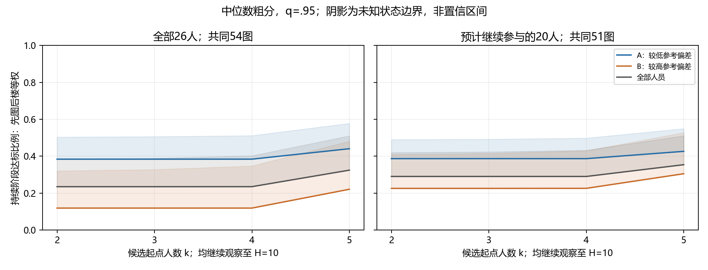

# 粗类验证：全部26人与预计继续参与的20人

2026年9月10日。**已发现部分图像上的类内持续稳定案例，以及较低参考偏差组更易稳定的描述性趋势；当前20人尚未形成足够稳健的两种人员类型。** 本轮完成重新拟合、留楼验证、互斥分半及按当前规则的人数回放。不能把这些结果表述为某类人员在所有图上均会收敛，也没有新人员验证。

## 1. 本次检验及数据

粗分仅使用无辅助作答，跨旧阶段合并，包括已确认无辅助的历史oos；Semi不进入本轮。所有26人均保留，预计继续参与的20人另行拟合，未用旧资格排除全部人口径。参考为已有人工复核优先，其余允许评价的图暂信GT；存在已知参考／范围疑问者不用于单一参考计分，但保留分歧分析。

原始2501条canonical及人工决定重新构建并核对。最新视图有1887份可用无辅助作答；其中两份补点参照了他人作答，主口径暂不作为独立信息使用，剩1885份、196图、22楼、26人。当前20人有1602份。1482份具有本轮可用参考，403份无可用唯一参考。

单人图不能评价同图人员的相对表现，因此留楼分类预测实际使用：全26人1462份、当前20人1245份，均覆盖147图、22楼。低人数图仍在库存；至少7名同类人员才能容纳本轮k≥2及后续5人的持续阶段检验。全体回放可计算57／56图，粗类中位数分组各55图；不能用总库存数替代可检验分母。

本包“主口径”只指此次历史探索，不是Paper A正式主分析。未修改原始导出、正式合同、人员资格、派发或停止规则。

## 2. 如何分粗类与防止循环论证

先控制图像差异，估计各人的参考执行偏差，再比较两种预设方式：中位数两档（median2）与一维Ward两组（ward2）。A为训练参考偏差较低组，B较高。OSPA30／60是两种距离参数，不是人员合格阈值。

目标building的所有标注从人员效应、分界及组均值训练中排除，再预测目标楼相对参考偏差、回放目标图的类内响应。building在这里是验证分隔单位，不是人员类型。全量名单仅用于解释，回放始终使用各目标楼对应的训练外名单。没有按目标图的稳定性挑选人员或改变分界。

另用200次互斥building分半检查分类复现，不用高度重叠的删楼训练一致率代替独立分半。不同划分及人员排列不增加独立人员／房间数量。中位数分档可以作为操作性分组，不要求证明天然两团，但仍须验证其含义与用途。

## 3. 粗类能否在留出图上复现

下面是楼等权平方误差相对“不区分人员”基线的改善。正值表示改善，非正确率；不报告确认性显著性。

| 人员口径 | 方法 | OSPA30 | OSPA60 |
|---|---|---:|---:|
| 全26人 | 连续人员效应 | +12.18% | +7.61% |
| 全26人 | 中位数两档 | −2.02% | −5.38% |
| 全26人 | Ward两组 | +8.26% | +7.16% |
| 当前20人 | 连续人员效应 | +3.29% | −0.03% |
| 当前20人 | 中位数两档 | +0.43% | −0.74% |
| 当前20人 | Ward两组 | +0.37% | −3.81% |

| 全量拟合 | 中位数人数 | Ward人数 |
|---|---|---|
| 全26人，两参数 | 13／13 | 24／2 |
| 当前20人，OSPA30 | 10／10 | 1／19 |
| 当前20人，OSPA60 | 10／10 | 15／5 |

全26人的Ward小组为W19、W26；这两人未在当前20人中。当前20人OSPA30的单人A组为W2。全量人数不是每个目标楼的固定人数：例如当前20人OSPA30的Ward A在各图最多6人，仍无本轮所需的7人观察支持。

互斥分半复现中位数：

| 人员口径 | 连续排序相关，30／60 | 中位数ARI，30／60 | Ward ARI，30／60 |
|---|---|---|---|
| 全26人 | .717／.712 | .239／.260 | .619／.619 |
| 当前20人 | .596／.636 | .113／.113 | .022／.047 |

ARI是分组一致性指标，不是准确率。删一楼时当前20人的中位数档位有17／15人始终不变，但互斥分半复现较弱；不能只用前一个数字宣布类型稳定。

仅用已有人工参考时，目标缩小为38图、11楼；全26人818份、当前20人664份。Ward改善分别为+17.06%／+16.25%与+3.25%／+3.96%，中位数两档分别为+3.72%／+6.53%与+0.92%／+2.98%。这支持继续核查清楚参考上的差异，但分半类别复现仍较弱。由于目标图和响应也变化，不能把两种参考口径的差值解释为GT导致的因果效应。

补充纳入两份补点后，分类结论方向基本不变；完整结果在`including_imputed/`。本轮未按人工参考子集重跑全部收敛曲线，不声称类内稳定对参考选择已经全面稳健。

## 4. 当前规则下的类内持续稳定

每图、每类投影同一批200条全局人员顺序，无放回逐人加入。每个前缀重新独立分簇；有效点数不同必分簇。主几何q=.95，并以硬点数OSPA30／60≤6°对照。q无效、分区非唯一或搜索截断均保留未知。

候选起点k≥2，之后至少观察5名人员，故只能评价k≤H−5。每个起点与其后每个人数一直比较至H：成员关系变化与份额TV均≤.10，不出现从不足2人变成至少2人的新支持簇，并且k时已有两人支持簇；从k开始的后续合法起点也都须满足。稳定多簇允许，单例参与变化计算。达标率的未知边界为stable/200至(stable+unknown)/200，80%过线提取起点；边界不是置信区间。

下表为OSPA30人员粗分、q=.95分簇，各图用尽该类实际可用人数的结果。不同H不能据此直接比较哪个人群更好。

| 人员／中位数粗类 | 可检验图 | H范围 | 起点可识别 | 不确定 | 合法起点域内未达到 |
|---|---:|---|---:|---:|---:|
| 全26人 A | 55 | 9–13 | 24 | 2 | 29 |
| 全26人 B | 55 | 10–13 | 9 | 4 | 42 |
| 当前20人 A | 55 | 9–10 | 19 | 1 | 35 |
| 当前20人 B | 55 | 9–10 | 9 | 3 | 43 |

改用硬点数OSPA30几何时，上述可识别数分别为17、8、15、7；改用OSPA60分型和OSPA60几何时为16、9、14、8。因此存在局部稳定案例，但数量依赖几何判据，不能只展示最有利配置。

“未达到”仅表示当前合法起点域内未过80%线。例如10名同类人员只能检验起点2–5，不能否定约8人开始稳定的可能，也不能因为末端没变化就将10人定义成稳定。当前20人的可识别粗类案例在本配置提取的起点以2人为主，这只适用于这些图与有限观察，不能推广为该类普遍2人足够。

中位数两档在上述可识别起点的达标排列均为一个受支持簇；不能称为已验证多簇的类型收敛。全26人的Ward A在57图中20图可识别，其中4图有达标多簇排列，但该A组覆盖24人，结果接近完整人员池；两人的B组无法检验人数增长。当前20人Ward组别及支持对参数敏感，不宜据某条曲线固定为两种行为类型。

## 5. 同图同人数比较

A、B、ALL均取10人并观察至H=10，比较k=5的持续阶段。仅用三者均支持的共同图片，先图内汇总，再楼内、最后楼等权；未知图不从分母中删除。OSPA30粗分、q=.95结果：

| 人员口径 | 共同图／楼 | A达标比例边界 | B达标比例边界 | ALL达标比例边界 |
|---|---|---|---|---|
| 全26人 | 54／14 | .440–.578 | .221–.481 | .324–.510 |
| 当前20人 | 51／14 | .426–.549 | .305–.528 | .354–.511 |

A有更高的已确认达标比例，但主配置的未知边界重叠，不能据此宣布A相对ALL的稳定性优势已被完全识别。OSPA几何也呈类似方向；各配置完整范围见`matched_stage_comparison.csv`。单一配置界限是否重叠也不是统计显著性检验，当前没有对新人员推断。



图中横轴是候选起点k，观察终点始终为10；不同人口径的共同图集合不同，不能将左右差值解释为删除六人的因果效果。实线是已确认达标比例，阴影至可能达标比例，仅反映未知状态。

## 6. 对“具体人群子类能收敛”的判断

已推进到的证据：在目标楼之外定义的较低参考偏差粗组，在部分留出图上满足当前持续阶段规则，同人数对照也显示值得继续检验的方向。它比只展示均值曲线后段变平更直接。

尚未完成的证据：规则执行的具体行为解释、当前20人稳定的类别边界、独立新人复现，以及这些类别在更多图上的稳定起点预测。参考偏差小仍不能自动解释为规则执行好；没有唯一清楚参考的范围选择不能直接计成执行错误。统计稳定和参考质量分别评价。

因此保留粗类探索，同时保留连续人员分数。下一步优先在已有明确参考／范围的校准图上，把明确漏标、多标与点位执行问题同合理范围差异区分，再固定校准规则接新人员；不为得到两种规模均衡的人群改分界，也暂不增加Semi细类。

## 7. 输出字段与复现

- `PLAN.json`：执行前确定的两个人员口径、分型、阈值和观察范围。
- `SOURCE_QA.json`、`measurements.csv.gz`、`pairs.csv.gz`：原始来源重建核对及本轮中间缓存。q沿用已有计算，核对身份／有效点数，不声称全部重新计算q；原始导出与人工决定仍是真源。
- `primary/`、`human_reference_only/`、`including_imputed/`：各自的全量／留楼成员、预测、分半稳定性与汇总。`layer_building_mse_gain`为相对零人员效应的楼等权误差改善；`continuous_building_mse_gain`为连续效应对照。全量成员不能代替留楼成员。
- `support.csv`：图×人口径×分型距离×粗分方法×A/B/ALL，`n`为不同真实人员数；`worker_ids`保留名单，`insufficient_horizon`指n<7，不是已判不稳定。无起点的组合仍在此表。
- `stage_curves.csv.gz`：上述键再加`config/horizon/k`；三状态计数之和固定200。`lower/upper`为未知边界；`stable_multi`至少两个簇各有两人，`stable_single`一个受支持簇，二者之和等于stable。
- `onsets.csv`：逐图逐类每个观察终点的possible／conservative／identified人数及status；候选域从2开始，缺失不是零。
- `stage_summary.csv`：`each_arm_full_N`是各类各图实际全人数，`fixed_H`是固定终点；前者的H可不同，不用于直接横向排名。
- `matched_stage_comparison.csv`：同图同H同k的A/B/ALL边界均值与实际共同图／楼数；没有共同支持则不产生均值，覆盖仍见support。
- `VERIFICATION.json`：数值、隔离、回放核对记录。当前均为探索性输出，不生成正式worker tier。

```powershell
.venv/Scripts/python.exe -m tools.thesis_main.analysis.validate_worker_coarse_20260910
.venv/Scripts/python.exe -m pytest tests/test_validate_worker_coarse_20260910.py tests/test_validate_worker_reuse_20260909.py tests/test_validate_building_stages_20260909.py -q
```

15项相关测试通过。独立回读24种分类配置的预测误差、42184条阶段节点与6252条起点记录；另以未缓存路径重算2图×2几何×200顺序，12个聚合节点逐状态一致。检查全部目标工人具有训练画像、目标building未进入训练、三状态守恒、硬点数、两人支持、多簇允许及未来新支持打破稳定。图片已实际查看；未运行无关Label Studio／前端测试。本包新增一个分析入口及测试，README与项目地图同步，正式协议边界未改。
