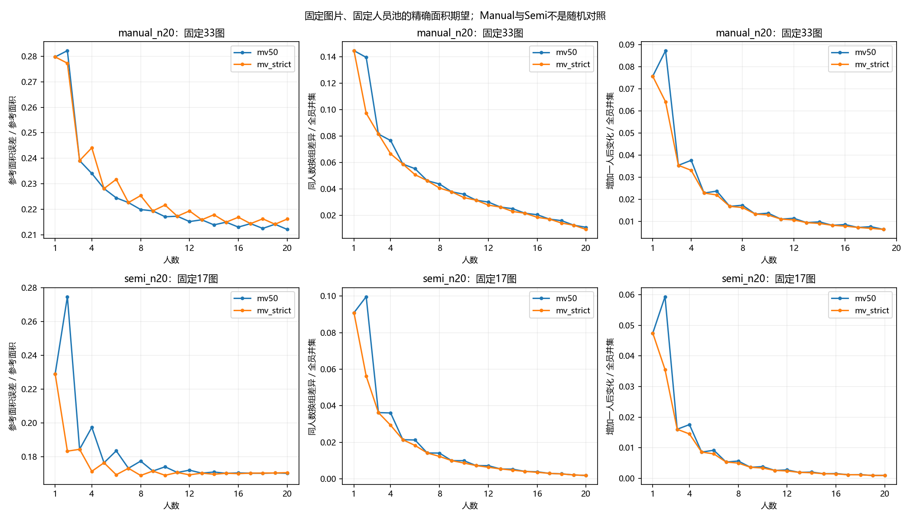
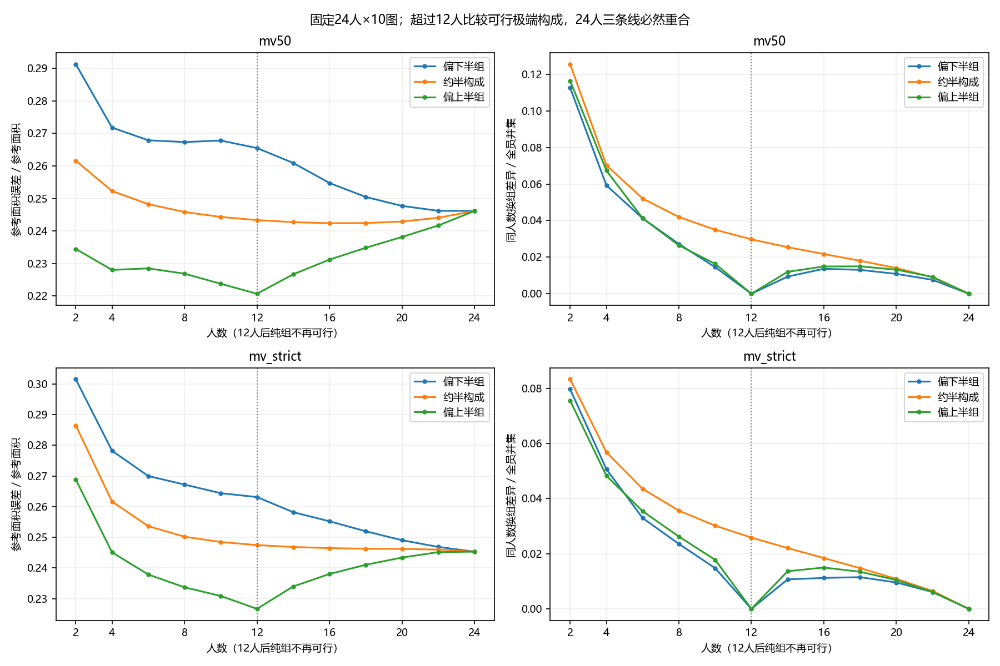

# 人员与人数推进：高人数实算结论

2026-10-06。**这次没有停在8人：已计算39张Manual图和18张Semi图，每图1到全部可用人数，最高24人；Manual还计算了不同人数下的人员构成。** 有限池概率复用现成算法，结果是面积的解析期望，没有枚举海量团队或重跑旧全库IoU。

主要发现是：增加人数继续减少换人的波动，但参考改善逐渐有限；楼外校准的人员构成仍能带来平均收益，却不是每图都有效。这比继续细化“多少人后看起来稳定”更值得推进。

## 1. 这次实际用了哪些高人数图片

| 条件／面板 | 固定图数 | 建筑数 | 可比较人数 |
|---|---:|---:|---|
| Manual主质量，N≥16 | 39 | 12 | 固定面板1—16，逐图继续至N |
| 其中N≥20 | 33 | 11 | 同一批图1—20 |
| 其中共同24人面板 | 10 | 8 | 同一批图1—24 |
| Semi主质量，N≥16 | 18 | 10 | 固定面板1—16，逐图继续至N |
| 其中N≥20 | 17 | — | 同一批图1—20 |
| 其中N=24 | 13 | — | 同一批图1—24 |

这些是嵌套面板，不能把行数相加。N≥16的Manual主质量候选实际40图；`rPc6DW4iMge-22`因R01424现有几何不可用保留整池失败，所以可计算39图。另13个Manual高人数组不属于现有主质量口径，仍列在[覆盖表](coverage.csv)，没有因为参考分数不好而临时排除，也没有把它们称为无人标注。

本轮新增9762行逐图／人数／政策／参考状态，它们不是9762个独立样本。Manual与Semi分开，没有把不同图片、不同采集条件当随机对照。

## 2. 增加人数主要继续减少波动，不能保证一直更接近参考

固定33张N≥20的Manual图，原GT、MV50、图片等权：

| 随机团队人数 | 参考面积误差／参考面积 | 同人数换组差异／全员并集 |
|---|---:|---:|
| 4 | 0.23405 | 0.07666 |
| 8 | 0.21991 | 0.04377 |
| 12 | 0.21519 | 0.03011 |
| 16 | 0.21303 | 0.02055 |
| 20 | 0.21211 | 0.01103 |

“参考面积误差”是期望遗漏面积加外扩面积，再除以固定参考面积，**不是1−IoU**。换组差异是两次独立抽取同人数团队后，输出区域对称差的期望；允许两次抽组共享成员。两列分母不同，不比较其绝对大小。

8→20人，参考面积误差只减少约0.00780，而换组差异下降约75%。逐图参考误差25图改善、8图变差。严格多数也有26图改善、7图变差。说明平均增人收益存在，但不能宣布“每图越多人越好”。

旧IoU结果在同33图上的MV50均值，8人0.79532、20人0.79904；这里只重汇总既有结果，未获得新的IoU精度，小差异不作新确证。本轮能精确讨论的是上表面积期望。

Semi的17张N≥20图也表现为换组差异持续下降；但严格多数的参考面积误差从8人0.16900变为20人0.17066，略微变差。两条件的图片／范围与初始化不同，这不是Semi优于或劣于Manual的因果证据。

## 3. 人员构成值得研究，有时比单纯加人数更有收益

分组沿用已有24人×10图的参考IoU画像；目标建筑全部排除后，校准人员分成上、下半。新建筑使用全部十张校准图。这里的“上半”是这套校准条件下的相对组，不是永久能力标签。

同33图、8人、原GT、MV50：

| 团队 | 参考面积误差／参考面积 |
|---|---:|
| 8名下半组成员 | 0.23705 |
| 4上半＋4下半 | 0.21975 |
| 8名上半组成员 | 0.19842 |
| 随机20人（作为人数对照） | 0.21211 |

上半8人相对下半8人，26图改善、7图变差；严格多数为24图改善、9图变差。上半8人相对随机20人，MV50平均误差少约0.01369，但仅21图更好、12图更差；严格多数为24图更好、9图更差。

因此现阶段支持“人员构成能带来增量解释，值得与人数一起研究”，不支持“8个好工人普遍胜过20个人”，也没有计入取得人员校准资料的成本。

参考敏感性没有把方向全部推翻：33图改用修订优先画像后，上半8人相对下半8人的MV50平均差仍为−0.03179；同9张双参考图上，原GT校准的平均差在原GT下为−0.05101、手工修订参考下为−0.06259。两版本分别报告，不挑有利版本。

## 4. 已向共同十图之外推进，但外推不是处处成立

本轮包含**17张、4栋完全在校准建筑之外的图**。这是现有数据上的迁移开发分析，未宣称从未看过的盲测。偏上半／偏下半均取各图可行的极端构成，实际人数见逐图结果。

8人MV50下，偏上半相对偏下半的平均参考误差变化为：图片等权−0.02410，建筑等权−0.01864；17图中11图改善、6图变差。严格多数为12图改善、5图变差。

| 校准集外建筑 | 图数 | 8人MV50：偏上半减偏下半的误差 |
|---|---:|---:|
| B6ByNegPMKs | 3 | −0.04523 |
| S9hNv5qa7GM | 1 | +0.00773 |
| VFuaQ6m2Qom | 1 | −0.01482 |
| uNb9QFRL6hY | 12 | −0.02225 |

负值表示偏上半更好。uNb占12/17，故建筑等权值得保留；它没有消除平均收益，但减小了幅度。单图建筑也不足以刻画该建筑全部情况。

下一步最有区分力的是解释这些反向图与受益图的区别，而不是继续把相同十图算得更密。[逐图效应表](image_effects.csv)已并列既有人审难度、范围／细节标记、静态模型描述和历史BiLayout墙带差异。缺失没有填零，未拟合新难度分数。

## 5. 大人数曲线揭示了一个容易误读的“稳定”

共同24人面板每个校准半组只有12人。抽满该半组的12人时，纯组只有一个可选团队，换组波动必为零；超过12人又必须加入另一半，波动可以重新上升。抽满24人时，全池也只有一个团队，所有构成线必然合拢。

这些现象是**有限人员池与构成约束的结果**，不是找到了12人或24人的自然停止点。曲线中“上半12人优于24人全员”还同时改变了人员构成，不能单独归因于人数。

新增结果分别保留了换组、增一人后重新投票、与下一位未入组人员作答的差异。固定面板中若有图已用尽人员，增一人／下一人的汇总直接留空，不悄悄缩小图片分母。

## 6. 对后续研究的取舍

1. **不把“最佳人数”作为本轮结论。** 当前证据更适合表述人数增加的边际收益、具体人员构成的收益及反例。
2. **继续人员构成，但不急着冻结类型。** 楼外Q画像已显示平均增量；优先用少量正反案例解释失效，再判断已有T／S／B等子类是否能提供额外解释，不重做泛化分类网格。
3. **等待Pro的质量解释结果再扩人员分项。** 本轮结论仅针对声明底面的参考面积；上边界、局部细节或合理不同空间可能改变“更好”的解释，不由本轮BEV结果替它们裁决。

## 实现与检查

- [工具](../../tools/thesis_main/analysis/worker_count_composition_20261006.py)复用现有tile积分与有限池概率代码；[关键测试](../../tests/test_worker_count_composition_20261006.py)覆盖小池枚举、参考并集外面积、整栋隔离、大人数可行构成、固定面板不缩分母。
- 与既有人员测试合计8项通过。既有四人换组量的168个对应结果保持一致；没有重跑原四人几何或全库点方法。无需全仓库测试。
- 两张图已查看，文字和轴可读。未生成临时截图；保留的是交付用科研图。
- `design.json`在计算前写入；新字段见[field_contract.json](field_contract.json)。当前合同、源标注、资格和GT未改。地图与入口增加本轮结果链接。
- [完整结果报告](REPORT.md)、[固定面板汇总](summary.csv)、[逐图结果](per_image.csv)、[逐图效应](image_effects.csv)和[积分基底](integration_bases.npz)可直接供后续复用；后续无需从零重算这57图。
