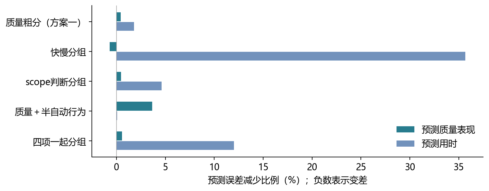
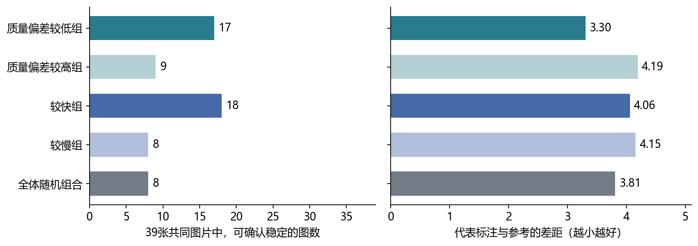

> 最新纠正：本文只记录固定二分的历史结果，不能据此排除多组分类。按中位数均分仅保留为历史对照；研究目标是验证具体可解释子类能否收敛，不要求均分或所有子类同时收敛。

# 人员分类：四类信息的探索结果

2026年9月10日｜质量、时间、半自动行为、scope判断｜后续方案仍为候选

本轮比较了四类信息的15种组合，并保留方案一的质量粗分作为对照。结论是：复杂组合没有显示出稳定、全面的优势。质量粗分可以继续作为主线；快慢分组值得保留为独立对照；scope和半自动行为暂时更多用于解释人员差异。

| 方向 | 这次发现 | 目前怎样使用 |
|---|---|---|
| 质量粗分 | 在共同图片上，较低偏差组的稳定表现和代表结果都有积极迹象；但换图后，部分人员仍会换组。 | 保留为主线候选；不称为已经固定的人员类型。 |
| 快慢分组 | 换一批图片后较容易得到相似分组；较快组也有稳定迹象，但稳定后的结果未更接近参考。 | 保留为对照；不把快慢当作品质高低。 |
| scope判断 | 能解释部分人员是否容易误判不可标图，但可用的不可标图只有9张。 | 保留为规则判断证据，暂不单独冻结人员类型。 |
| 半自动行为及多项组合 | 部分组合更能预测修改幅度；没有证明能同时改善人员归类、质量和稳定阶段。 | 保留结果与行为解释，不强行增加类别。 |

这不是证明方案一最好，也不是要求只保留一个指标。更稳妥的下一步是用少量、含义清楚的粗类继续验证，允许新增数据推翻当前判断。

本轮没有按“哪条收敛曲线最好看”反选人员。各项分类先使用其他楼的记录建立，再检查目标楼的真实标注；这些结果仍来自历史探索，尚无新增人员的独立验证。

# 1  四类信息到底测了什么

| 信息 | 本轮具体测量 | 解释范围 |
|---|---|---|
| 质量 | 无初始轮廓时，最终点集与可评分参考的差距。 | 是参考偏差，不等于已经逐条确认的规则违规。 |
| 时间 | 无初始轮廓时的合格操作日志，考虑不同任务的耗时差异。 | 是相对快慢，不等于认真程度。 |
| scope判断 | 把可标图判为不可标、把不可标图判为可标，两种错误分开看。 | 是规则适用范围判断，不包括所有边界细节的执行。 |
| 半自动行为 | 初始到最终改动多少，以及与参考相比净改善多少。 | 修改大不一定好；净改善在同一道任务内也与最终偏差有关，并非全新独立能力。 |

本轮与上一轮三指标报告不同：质量和时间来自无辅助标注，半自动行为单独提供修改信息；不再要求同一份半自动记录同时具备时间。因此，后续20人均有足够资料参加本轮四类信息的完整比较，不能直接把两轮百分比当成同条件结果。

| 人员范围 | 达到数据要求的人数 | 需要注意 |
|---|---|---|
| 后续20人 | 四类信息共同覆盖20人。 | 每次预测前，都重新检查用于分类的历史资料是否足够。 |
| 全部26人 | 四类信息共同覆盖24人。 | W14、W26缺少本轮合格时间；W26可用于质量计算的记录仅3份，未达到6份要求。 |
| 只用scope或半自动行为 | 全部范围均可覆盖26人。 | 不能把较大覆盖与24人的公平比较混为一谈。 |

分类前，每个测量方向至少需要6份记录、覆盖3栋楼。四类信息各占相同的总权重，避免scope或半自动因为各有两个数值就自动占更大比重。只尝试两类；若自动分组只分出一个人，则记录为不采用该次分类。另保留按质量排序从中间分开的方案一。

# 2  怎样检验，怎样读数字

例如要预测某人在甲楼的表现，就先只看他在其他楼的历史记录。分类和预测完成后，再用甲楼的实际标注检查。甲楼的质量、时间、scope和半自动结果，都不参与这次人员分类。

预测检查的是同一道任务中一个人的相对表现，不是只凭类型就预测绝对秒数或一张图的绝对误差。下面“+20%”表示相对不区分人员的做法，预测误差减少20%；不是正确率20%。各楼在总结果中占相同分量。

| 后续20人：同条件比较 | 质量预测改善 | 用时预测改善 | 修改幅度预测改善 |
|---|---|---|---|
| 质量粗分（方案一） | +0.43% | +1.80% | +7.41% |
| 快慢分组 | -0.71% | +35.69% | +0.09% |
| scope判断分组 | +0.46% | +4.62% | -0.27% |
| 质量＋半自动行为 | +3.66% | +0.06% | +23.53% |
| 四项一起分组 | +0.55% | +12.00% | +3.44% |

质量＋半自动行为对质量预测改善3.66%，高于质量粗分的0.43%；但按楼重新抽样后，前者相对“不分人”的改善范围约为−0.12%至7.99%，尚不足以确认稳定优势。这些范围仅反映已算出预测的楼间变化，没有消除尝试多种方案带来的选择偏差。

快慢分组主要提高用时预测，对质量预测没有改善。四项一起分组也没有在所有目标上更好。所有组合均有完整结果留存，未只保留表现较好的方法。

# 3  scope：补上了规则判断的直接证据

本轮从原始导出重新读取每个人填写的scope，再与最终裁定逐条核对。无辅助条件共1,013份记录；主分析暂不使用后来出现争议的两张图，剩余961份，并另算保留它们的结果。不可标图为9张，可标图为28张。

| 后续20人：全量资料下的scope分组 | 人数 | 可标图误判为不可标 | 不可标图误判为可标 |
|---|---|---|---|
| 候选组1 | 7 | 16.3% | 12.7% |
| 候选组2 | 13 | 20.3% | 59.0% |

这是每个人错误比例先计算、再组内平均的描述。这两个候选组在识别不可标图方面差异较明显；但不能只凭全量资料上的差异就宣布类型已经成立。

关键限制是只有9张不可标图。如果把图片分成互不重叠的两批，两边都要求每人至少6份记录，就无法同时满足。因此，按原要求没有一次能够完整比较scope分组是否重复出现。

为了解样本限制的影响，额外做了较宽松的检查：每半至少3份记录、2栋楼。100次中有68次可以比较，分组一致程度中位数约−0.014；1表示完全相同，0附近表示与随机对应接近。这个补充结果也没有显示出稳定分型，不能替代原要求下的验证。

scope仍然有价值：它能说明具体判断错误，不必只依赖与参考轮廓的距离。当前更适合保留两种错误记录，并检查它们是否在更多明确裁定的图片上重复出现。错误判断不自动等于故意不执行规则。

# 4  换一批图片，人员会不会换组

把楼随机分成互不重叠的两批，分别给同一批人员分类，重复100次。这里检查的是人员分组是否重复，不是标法是否收敛。

| 分组方法 | 能够比较的次数 | 一致程度中位数 |
|---|---|---|
| 质量粗分（方案一） | 100/100 | 0.113 |
| 快慢分组 | 100/100 | 0.789 |
| scope判断分组 | 0/100 | 资料不足，不能估计 |
| 质量＋半自动行为 | 80/100 | 0.244 |
| 四项一起分组 | 0/100 | 资料不足，不能估计 |

一致程度1表示两次完全相同，0附近表示与随机对应接近。各方法用自己的可用资料检查，因此还要看能够比较的次数，不能把无法比较当作成功。

快慢分组在这项检查中最容易重复得到。方案一的质量粗分虽然每次都能进行，但边界附近的人员会换组。它仍可作为按历史表现分档的实验办法，却不能称为天然固定的两类人。

质量＋半自动行为的一致程度约0.244，80次能比较；未显示出足够强的名单稳定性。增加信息并没有自动解决分类不稳定的问题。

其他检查也显示条件依赖：换一种质量距离设置后，质量＋半自动的质量预测改善为2.30%；四项组合为1.55%。去掉构造错误的初始标注后，四项组合的质量预测改善变为−1.08%。较强的历史速度重复性，也不等于已经证明跨任务阶段或新人员仍然成立。

# 5  同类人的标法是否进入稳定阶段

公平比较使用同样39张有可评分参考的图片，来自12栋楼；质量粗分、快慢分组和全体随机组合，都取8名不同人员。检查从第3人开始，标法及其比例能否持续稳定到第8人。

| 8人组合 | 可确认进入稳定阶段 | 尚无法明确判断 | 第3人及以前未达标 |
|---|---|---|---|
| 质量偏差较低组 | 17/39 | 1 | 21 |
| 质量偏差较高组 | 9/39 | 1 | 29 |
| 较快组 | 18/39 | 0 | 21 |
| 较慢组 | 8/39 | 0 | 31 |
| 全体随机组合 | 8/39 | 0 | 31 |

每张图使用200个随机人员顺序，每次无放回抽取。至少80%的顺序明确达到稳定要求，才记入“可确认”。第三列的未达标只针对这次允许检查的起点范围，不表示到第8人仍在变化，更不表示以后永远不会稳定。

稳定允许有多种标法。点数不同必须分开，一种新标法至少得到两人支持才算受支持的新簇；单人标法仍保留。检查还包括原有标法成员关系和人数比例是否明显变化。

“17张”与“18张”的差别很小，不能据此宣布快慢分组更优。两种分法都比随机组合出现更多可确认的图片，但这是历史有限人员池中的探索结果，还没有新人员验证。

若要判断大约第8人开始稳定，按本轮要求还需往后至少观察5人，即同一张图需要至少13名该类人员。当前全量质量粗分为10／10人，快慢分组为8／12人，不能据本表判断第8人的稳定起点。

# 6  稳定以后，结果是否更接近参考

| 8人组合 | 代表标注与参考的差距 |
|---|---|
| 质量偏差较低组 | 3.30 |
| 质量偏差较高组 | 4.19 |
| 较快组 | 4.06 |
| 较慢组 | 4.15 |
| 全体随机组合 | 3.81 |

每次先只根据组内标注之间的距离，选出最具代表性的一份；若并列则平均计分。选取时不看参考答案，之后才与参考比较。分数越小，表示与参考更接近；它不是人工确认的正确率。

质量偏差较低组为3.30，全体随机组合为3.81，较快组为4.06。较快组的稳定图片略多，但代表结果没有更接近参考。因此，快慢分组可以是有意义的人群描述，却不能替代质量判断。

换另一种标法距离重新检查时，同样39张图中，质量较低偏差组的已确认稳定比例下界约41.6%，较快组37.4%，随机组合36.6%。绝对数值随标法判据变化，不能只挑较有利的设置。

# 7  全部人员范围的结果与覆盖限制

全部名册是26人，但四类信息同时可用的共同人员为24人。下面是在这24人的共同记录上比较，不能直接称为26人全部完成四项分类。

| 方法 | 质量预测改善 | 用时预测改善 |
|---|---|---|
| 质量粗分（方案一） | +2.12% | +0.29% |
| 快慢分组 | -0.18% | +36.54% |
| scope判断分组 | -0.42% | +3.32% |
| 质量＋半自动行为 | +0.00% | +0.00% |
| 四项一起分组 | +0.00% | +0.00% |

质量＋半自动、四项组合在这一共同人员范围内经常产生单人小组，按事先规则不采用分类，预测退回不区分人员。所以表中的0%表示分类没有被采用，不表示这些人完全没有差异。

W26仅有3份可用于这次质量计算的记录，未满足6份要求；W14、W26缺少合格时间。这也会改变早期报告中由极少数人员形成的小组，不能把不同覆盖范围的分类结果直接拼接。

全部范围和后续人群的结果共同表明：复杂组合的效果依赖人员组成，当前没有理由用它全面替换质量粗分。每个方法原本能覆盖多少人、每次训练是否采用分类，都保留在结果表中。

收敛回放覆盖57张至少有7份无辅助标注的图片；其中43张有可评分参考。报告的39张是质量粗分与快慢分组同时具备比较人数、又有可评分参考的共同图片。另保留全部图片以及明确裁定为可标图片的结果，避免把不可标图上的一致性推广为正常任务表现。

# 8  当前保留的候选与下一步

质量粗分继续作为主线候选，快慢分组作为独立对照；不把二者再交叉切成四个小类。scope与半自动行为保留为解释和补充指标，新增资料后再检查是否值得加入分类。

| 全量历史资料下的候选描述 | 人数 | 人员编号 |
|---|---|---|
| 较低参考偏差 | 10 | W1、W2、W6、W8、W11、W15、W17、W28、W31、W33 |
| 较高参考偏差 | 10 | W10、W12、W13、W29、W30、W32、W34、W35、W36、W37 |
| 较快 | 8 | W1、W2、W6、W10、W12、W13、W17、W30 |
| 较慢 | 12 | W8、W11、W15、W28、W29、W31、W32、W33、W34、W35、W36、W37 |

这份名单只是用全部历史资料得到的描述。前面的预测与稳定性检验都重新排除了目标楼资料，实际组员可能不同；不能拿本表直接宣称每个人已被固定归类。

后续采集可先用一批明确规则和参考的图了解新人员，再按事先固定的办法归类，最后用另一批图检查标法是否稳定。每人独立标注的结果仍可组合为纯类或混合人群，不必为每种比例重新组织标注。

需要补充的关键证据包括：scope在更多明确不可标图上的表现、边界人员换图后是否仍属于同一档，以及同类人数增加后早期稳定是否仍能保持。不能只补到曲线看起来稳定就停止，也不能根据目标图的标法反过来修改人员类型。

本轮只作历史探索，不修改正式人员资格、任务分发、原始标注、最终裁定或方法合同。技术结果、全部组合、来源核对和可运行命令见同目录说明文件。

# 附录  全部组合的比较结果

以下均为后续20人共同记录上的误差改善。自动质量二分与方案一按质量排序从中间分档，是不同的分组办法。其他指标、全部人员范围及各项检查版本保留在同目录数据表。

| 方法 | 质量预测 | 用时预测 | 修改幅度预测 |
|---|---|---|---|
| 半自动行为分组 | +3.42% | +3.16% | +9.04% |
| 质量自动二分 | -0.32% | +0.36% | +1.96% |
| 质量＋半自动行为 | +3.66% | +0.06% | +23.53% |
| 质量＋scope | -2.68% | +0.01% | +4.64% |
| 质量＋scope＋半自动行为 | +3.19% | -0.17% | +22.73% |
| 质量＋时间 | -3.04% | +23.58% | +4.89% |
| 质量＋时间＋半自动行为 | +0.06% | +12.59% | +3.06% |
| 质量＋时间＋scope | +0.13% | +20.28% | +2.76% |
| 四项一起分组 | +0.55% | +12.00% | +3.44% |
| 质量粗分（方案一） | +0.43% | +1.80% | +7.41% |
| scope判断分组 | +0.46% | +4.62% | -0.27% |
| scope＋半自动行为 | +3.53% | +0.05% | +22.07% |
| 快慢分组 | -0.71% | +35.69% | +0.09% |
| 时间＋半自动行为 | +0.21% | +35.31% | +4.30% |
| 时间＋scope | +0.44% | +22.33% | +0.74% |
| 时间＋scope＋半自动行为 | +1.13% | +29.15% | +5.61% |

没有一行可以仅凭单个最大的百分比认定为最佳方案。还需同时考虑分类是否重复、人数是否足够、标法是否稳定，以及稳定后的参考差距。所有数值均为历史探索。

# 附录：全部组合的预测结果

以下均为后续20人共同记录上的误差改善。自动质量二分与按中间位置分档的方案一是不同办法。

| 方法 | 质量 | 用时 | 修改幅度 | 半自动净改善 | 误拒可标图 | 误收不可标图 |
|---|---|---|---|---|---|---|
| 半自动行为分组 | +3.42% | +3.16% | +9.04% | -0.54% | +0.91% | +1.93% |
| 质量自动二分 | -0.32% | +0.36% | +1.96% | +0.83% | +0.34% | +0.27% |
| 质量＋半自动行为 | +3.66% | +0.06% | +23.53% | +7.53% | +1.69% | +1.05% |
| 质量＋scope | -2.68% | +0.01% | +4.64% | +0.62% | +8.36% | +0.55% |
| 质量＋scope＋半自动行为 | +3.19% | -0.17% | +22.73% | +7.66% | +4.08% | +0.04% |
| 质量＋时间 | -3.04% | +23.58% | +4.89% | +1.40% | -1.02% | -1.75% |
| 质量＋时间＋半自动行为 | +0.06% | +12.59% | +3.06% | +10.29% | +0.61% | -0.34% |
| 质量＋时间＋scope | +0.13% | +20.28% | +2.76% | -1.54% | +8.93% | -5.88% |
| 四项一起分组 | +0.55% | +12.00% | +3.44% | +10.37% | +3.68% | +0.81% |
| 质量粗分（方案一） | +0.43% | +1.80% | +7.41% | +0.72% | +4.41% | +1.08% |
| scope判断分组 | +0.46% | +4.62% | -0.27% | +0.23% | +5.87% | +2.68% |
| scope＋半自动行为 | +3.53% | +0.05% | +22.07% | +6.39% | +1.61% | -0.48% |
| 快慢分组 | -0.71% | +35.69% | +0.09% | -0.30% | -0.11% | -0.32% |
| 时间＋半自动行为 | +0.21% | +35.31% | +4.30% | -1.07% | -0.17% | +0.49% |
| 时间＋scope | +0.44% | +22.33% | +0.74% | -0.42% | +9.74% | -6.55% |
| 时间＋scope＋半自动行为 | +1.13% | +29.15% | +5.61% | -1.31% | +3.91% | -0.09% |

# 复现与结果表

`python -m tools.thesis_main.analysis.worker_four_block_exploration_20260910 prepare`：重核原始点、参考、初始化、时间、scope与最终裁定。
`screen`：15组合和质量中位数对照；`diagnostics`：人员行为解释和楼间变动范围；`replay`：逐前缀重分簇；`stage_subsets`：同图同人数汇总；`stage_quality`：代表结果评分。

`validation.csv`每行是版本×人员范围×共同/原覆盖×方法×评价方向；正值表示预测误差改善。`members.csv`为全量候选，`fold_members.csv.gz`为排除目标楼后的实际候选。`label=0`为拒绝分类，不是一种人员类型。
`half_stability.csv`区分原6份/3楼要求和补充3份/2楼检查；`stage_curves.csv.gz`每行包含图片、人员范围、方法、组合、距离、观察终点及候选起点；lower/upper来自未知状态，不是置信区间。
`stage_onsets.csv`区分可确认进入阶段、观察起点范围内未达标、无法判定；earliest_possible与earliest_confirmed允许给出范围，不要求是完全相同的人数。
`stage_quality.csv`是组内代表的参考偏差；`readable_same39_comparison.csv`对应报告共同39张图。`cross_method_stage_comparison*.csv`在每对方法共同图片上比较，不能直接比较不同图片集合的平均值。

来源核对：6份P1原始导出与快照内容一致；61份scope裁定回连人工精标原导出，唯一scope变化696已与原有修订记录核对；两张后来有争议的图单独保留。有效时间重查原始日志，未用lead_time补值。

统计边界：按楼隔离全部分类输入；本轮是已知人员跨图片的历史探索。楼级重抽样区间不重新拟合、不校正多方案选择，不当作新人员或正式验证。200个顺序不增加独立样本量。标法图的快捷计算与原程序做过真实子集及随机图等价检查。