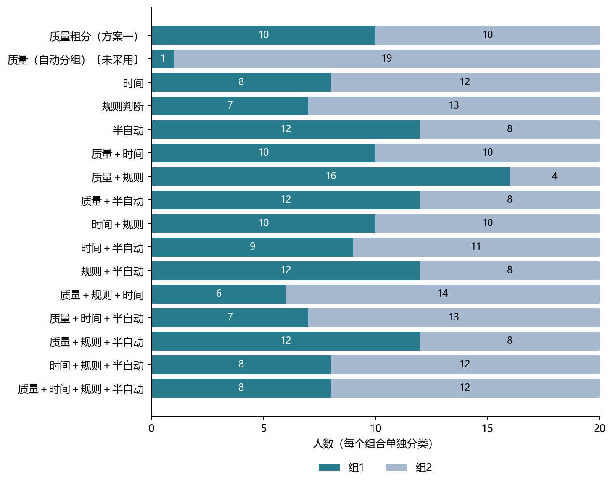

> 最新纠正：本文只记录固定二分的历史结果，不能据此排除多组分类。按中位数均分仅保留为历史对照；研究目标是验证具体可解释子类能否收敛，不要求均分或所有子类同时收敛。

# 人员分类方案与各组人数

2026年9月10日修订｜先比较方案，再查看分组、名单与验证证据｜本报告不选定最终方案

要回答的问题：用哪些历史表现给人员分类？每组有多少人、有什么可解释的差异？换一批图片后还能否得到相似分组？同类人员独立标注后，标法是否能进入稳定阶段？

方案一：只按质量粗分。根据无辅助标注与最终参考的差距给人员排序，从中间分成两档。后续20人分为10人和10人；全部26人中25人资料足够，分为13人和12人，1人暂不能分。这里测的是参考质量，不是直接认定认真或粗心。

方案二：选择若干指标，联合分类。候选信息为质量、时间、规则判断和半自动行为。例如质量＋半自动、质量＋时间、质量＋规则、质量＋规则＋时间；每个组合都单独重新给人员分组。

本轮共检查4种单项、6种双项、4种三项、1种四项，共15种指标组合，另加方案一作对照。方案二不是一个已经选定的组合，也不是把四项全部加入就算完成。

两种方案都先尝试分为两组。这是本轮的小样本探索设定，尚未证明人员天然只有两类，也没有系统比较三类、四类。具体结果见后面的完整人数表。

# 两版方案的优势与不足

方案一的优势：含义直接，容易向新人员应用；按中间位置分档能保留相对均衡的人数，便于继续收集同类标注。

方案一的不足：两档是人为切分的历史表现，不代表两种固定人格；中间附近的人员换一批图后容易换档。与参考接近也不能代替逐条规则执行检查。

方案二的优势：可以描述更具体的行为，例如偏差较低且较快，或修改较多且净改善较多；能够检验规则判断或半自动信息是否提供额外帮助。

方案二的不足：加入指标可能改变人员名单并形成很小的组；指标可能互相重复，规则资料也有限。某项预测更好，不意味着标法更容易稳定。

目前仍有三件不同的事需要分别检查：第一，分组能不能解释；第二，换图片后同一个人会不会频繁换组；第三，组内人数增加后标法是否稳定。不能用其中一项替代另外两项。

本报告保留全部组合，先展示人数、名单和组平均差异，再给验证结果。不依据一条有利曲线宣布某个组合最好。

# 四个指标的具体含义与分法

| 信息 | 这次实际使用的内容 |
|---|---|
| 质量 | 无辅助最终标注与可评分参考的偏差；越低表示越接近参考。 |
| 时间 | 无辅助标注的合格有效操作时间；比较同任务条件下的相对快慢。 |
| 规则判断 | scope与最终裁定比较：误拒可标图、误收不可标图，两种错误分别记录。 |
| 半自动 | 初始轮廓到最终轮廓的修改幅度，以及相对参考的净改善。 |

“规则”目前只覆盖能否标注的范围判断，不覆盖所有布局细则。“半自动”不是是否使用工具的二元标签，而是使用初始轮廓后的行为表现；本轮也没有把半自动用时再作为第五个指标。

联合分组的做法：先考虑不同任务本身的差异，再统一各指标的尺度，按人员表现的相似程度自动分为两组。每个大项占相同总权重；规则和半自动虽然各有两个数值，也不会因此获得双倍权重。

例如“质量＋时间”只用这两项一起分组，不用规则和半自动决定名单；“质量＋规则＋时间”则只用这三项。这里没有先把每项分成高低档再交叉成四类或八类，那是另一种尚未运行的方法。

每个所选测量方向至少需要6份记录、覆盖3栋楼。若自动分组产生单人组，本轮记为未采用；后文仍列出原始人数，不能把未采用写成不存在差异。

# 后续20人：所有指标组合的人数

以下使用每种组合自身所需的资料；人数来自全部历史资料下的一次分类。前一列／后一列依次对应后文组1／组2，同一组号在不同组合中不代表同一种人。

| 所用指标 | 资料足够人数 | 组1／组2人数 | 资料不足人数 |
|---|---|---|---|
| 质量粗分（方案一） | 20 | 10／10 | 0 |
| 质量（自动分组） | 20 | 1／19（单人组，未采用） | 0 |
| 时间 | 20 | 8／12 | 0 |
| 规则判断 | 20 | 7／13 | 0 |
| 半自动 | 20 | 12／8 | 0 |
| 质量＋时间 | 20 | 10／10 | 0 |
| 质量＋规则 | 20 | 16／4 | 0 |
| 质量＋半自动 | 20 | 12／8 | 0 |
| 时间＋规则 | 20 | 10／10 | 0 |
| 时间＋半自动 | 20 | 9／11 | 0 |
| 规则＋半自动 | 20 | 12／8 | 0 |
| 质量＋规则＋时间 | 20 | 6／14 | 0 |
| 质量＋时间＋半自动 | 20 | 7／13 | 0 |
| 质量＋规则＋半自动 | 20 | 12／8 | 0 |
| 时间＋规则＋半自动 | 20 | 8／12 | 0 |
| 质量＋时间＋规则＋半自动 | 20 | 8／12 | 0 |

“单人组，未采用”保留自动分组的原始人数，但不将它作为已成立的人群子类。总人数＝两组人数之和＋资料不足人数。

# 全部26人：所有指标组合的人数

以下使用每种组合自身所需的资料；人数来自全部历史资料下的一次分类。前一列／后一列依次对应后文组1／组2，同一组号在不同组合中不代表同一种人。

| 所用指标 | 资料足够人数 | 组1／组2人数 | 资料不足人数 |
|---|---|---|---|
| 质量粗分（方案一） | 25 | 13／12 | 1 |
| 质量（自动分组） | 25 | 24／1（单人组，未采用） | 1 |
| 时间 | 24 | 10／14 | 2 |
| 规则判断 | 26 | 10／16 | 0 |
| 半自动 | 26 | 5／21 | 0 |
| 质量＋时间 | 24 | 23／1（单人组，未采用） | 2 |
| 质量＋规则 | 25 | 24／1（单人组，未采用） | 1 |
| 质量＋半自动 | 25 | 24／1（单人组，未采用） | 1 |
| 时间＋规则 | 24 | 9／15 | 2 |
| 时间＋半自动 | 24 | 11／13 | 2 |
| 规则＋半自动 | 26 | 21／5 | 0 |
| 质量＋规则＋时间 | 24 | 23／1（单人组，未采用） | 2 |
| 质量＋时间＋半自动 | 24 | 23／1（单人组，未采用） | 2 |
| 质量＋规则＋半自动 | 25 | 24／1（单人组，未采用） | 1 |
| 时间＋规则＋半自动 | 24 | 12／12 | 2 |
| 质量＋时间＋规则＋半自动 | 24 | 23／1（单人组，未采用） | 2 |

“单人组，未采用”保留自动分组的原始人数，但不将它作为已成立的人群子类。总人数＝两组人数之和＋资料不足人数。

# 人数分配的直观比较

同为20人，不同指标组合可以得到12／8、16／4、6／14等不同人数。人数比较均衡只说明便于继续采集，不能证明分组更有意义或更容易收敛。

# 组合详情｜质量粗分（方案一）

使用信息：质量粗分（方案一）。以下是全量历史资料下的候选名单；不是已经冻结的人员身份。

后续20人：10／10；资料不足：无。

| 组别／人数 | 成员编号 |
|---|---|
| 组1／10人 | W1、W2、W6、W8、W11、W15、W17、W28、W31、W33 |
| 组2／10人 | W10、W12、W13、W29、W30、W32、W34、W35、W36、W37 |

组1平均表现：偏差较低。

组2平均表现：偏差较高。

全部26人：13／12；资料不足：W26。

| 组别／人数 | 成员编号 |
|---|---|
| 组1／13人 | W1、W2、W6、W8、W10、W11、W15、W17、W18、W21、W27、W28、W33 |
| 组2／12人 | W12、W13、W14、W19、W29、W30、W31、W32、W34、W35、W36、W37 |

组1平均表现：偏差较低。

组2平均表现：偏差较高。

上述“较高／较低／较快”等仅比较本组合的两个组平均值，不表示组内每个人都满足同一特征，也不表示差异已经通过独立验证。不同范围重新分类，名单及含义可能改变。

# 组合详情｜质量＋半自动

使用信息：质量＋半自动。以下是全量历史资料下的候选名单；不是已经冻结的人员身份。

后续20人：12／8；资料不足：无。

| 组别／人数 | 成员编号 |
|---|---|
| 组1／12人 | W2、W6、W8、W10、W11、W13、W15、W17、W28、W32、W33、W36 |
| 组2／8人 | W1、W12、W29、W30、W31、W34、W35、W37 |

组1平均表现：偏差较低、修改较少、净改善较多。

组2平均表现：偏差较高、修改较多、净改善较少。

全部26人：24／1（单人组，未采用）；资料不足：W26。

| 组别／人数 | 成员编号 |
|---|---|
| 组1／24人 | W1、W2、W6、W8、W10、W11、W12、W13、W14、W15、W17、W18、W21、W27、W28、W29、W30、W31、W32、W33、W34、W35、W36、W37 |
| 组2／1人 | W19 |

该结果因单人组而未采用。这里列名单用于查看自动算法分出了什么，不把单个人的表现称为已验证的一类。

上述“较高／较低／较快”等仅比较本组合的两个组平均值，不表示组内每个人都满足同一特征，也不表示差异已经通过独立验证。不同范围重新分类，名单及含义可能改变。

# 组合详情｜质量＋时间

使用信息：质量＋时间。以下是全量历史资料下的候选名单；不是已经冻结的人员身份。

后续20人：10／10；资料不足：无。

| 组别／人数 | 成员编号 |
|---|---|
| 组1／10人 | W1、W2、W6、W10、W11、W12、W13、W15、W17、W30 |
| 组2／10人 | W8、W28、W29、W31、W32、W33、W34、W35、W36、W37 |

组1平均表现：偏差较低、较快。

组2平均表现：偏差较高、较慢。

全部26人：23／1（单人组，未采用）；资料不足：W14、W26。

| 组别／人数 | 成员编号 |
|---|---|
| 组1／23人 | W1、W2、W6、W8、W10、W11、W12、W13、W15、W17、W18、W21、W27、W28、W29、W30、W31、W32、W33、W34、W35、W36、W37 |
| 组2／1人 | W19 |

该结果因单人组而未采用。这里列名单用于查看自动算法分出了什么，不把单个人的表现称为已验证的一类。

上述“较高／较低／较快”等仅比较本组合的两个组平均值，不表示组内每个人都满足同一特征，也不表示差异已经通过独立验证。不同范围重新分类，名单及含义可能改变。

# 组合详情｜质量＋规则

使用信息：质量＋规则。以下是全量历史资料下的候选名单；不是已经冻结的人员身份。

后续20人：16／4；资料不足：无。

| 组别／人数 | 成员编号 |
|---|---|
| 组1／16人 | W1、W2、W6、W8、W10、W11、W12、W13、W15、W17、W28、W31、W32、W33、W35、W36 |
| 组2／4人 | W29、W30、W34、W37 |

组1平均表现：偏差较低、较少误拒可标图、较少误收不可标图。

组2平均表现：偏差较高、较多误拒可标图、较多误收不可标图。

全部26人：24／1（单人组，未采用）；资料不足：W26。

| 组别／人数 | 成员编号 |
|---|---|
| 组1／24人 | W1、W2、W6、W8、W10、W11、W12、W13、W14、W15、W17、W18、W21、W27、W28、W29、W30、W31、W32、W33、W34、W35、W36、W37 |
| 组2／1人 | W19 |

该结果因单人组而未采用。这里列名单用于查看自动算法分出了什么，不把单个人的表现称为已验证的一类。

上述“较高／较低／较快”等仅比较本组合的两个组平均值，不表示组内每个人都满足同一特征，也不表示差异已经通过独立验证。不同范围重新分类，名单及含义可能改变。

# 组合详情｜质量＋规则＋时间

使用信息：质量＋规则＋时间。以下是全量历史资料下的候选名单；不是已经冻结的人员身份。

后续20人：6／14；资料不足：无。

| 组别／人数 | 成员编号 |
|---|---|
| 组1／6人 | W1、W2、W6、W10、W12、W13 |
| 组2／14人 | W8、W11、W15、W17、W28、W29、W30、W31、W32、W33、W34、W35、W36、W37 |

组1平均表现：偏差较低、较快、较少误拒可标图、较少误收不可标图。

组2平均表现：偏差较高、较慢、较多误拒可标图、较多误收不可标图。

全部26人：23／1（单人组，未采用）；资料不足：W14、W26。

| 组别／人数 | 成员编号 |
|---|---|
| 组1／23人 | W1、W2、W6、W8、W10、W11、W12、W13、W15、W17、W18、W21、W27、W28、W29、W30、W31、W32、W33、W34、W35、W36、W37 |
| 组2／1人 | W19 |

该结果因单人组而未采用。这里列名单用于查看自动算法分出了什么，不把单个人的表现称为已验证的一类。

上述“较高／较低／较快”等仅比较本组合的两个组平均值，不表示组内每个人都满足同一特征，也不表示差异已经通过独立验证。不同范围重新分类，名单及含义可能改变。

# 组合详情｜质量＋时间＋半自动

使用信息：质量＋时间＋半自动。以下是全量历史资料下的候选名单；不是已经冻结的人员身份。

后续20人：7／13；资料不足：无。

| 组别／人数 | 成员编号 |
|---|---|
| 组1／7人 | W2、W8、W15、W17、W28、W33、W36 |
| 组2／13人 | W1、W6、W10、W11、W12、W13、W29、W30、W31、W32、W34、W35、W37 |

组1平均表现：偏差较低、较慢、修改较少、净改善较多。

组2平均表现：偏差较高、较快、修改较多、净改善较少。

全部26人：23／1（单人组，未采用）；资料不足：W14、W26。

| 组别／人数 | 成员编号 |
|---|---|
| 组1／23人 | W1、W2、W6、W8、W10、W11、W12、W13、W15、W17、W18、W21、W27、W28、W29、W30、W31、W32、W33、W34、W35、W36、W37 |
| 组2／1人 | W19 |

该结果因单人组而未采用。这里列名单用于查看自动算法分出了什么，不把单个人的表现称为已验证的一类。

上述“较高／较低／较快”等仅比较本组合的两个组平均值，不表示组内每个人都满足同一特征，也不表示差异已经通过独立验证。不同范围重新分类，名单及含义可能改变。

# 组合详情｜质量＋规则＋半自动

使用信息：质量＋规则＋半自动。以下是全量历史资料下的候选名单；不是已经冻结的人员身份。

后续20人：12／8；资料不足：无。

| 组别／人数 | 成员编号 |
|---|---|
| 组1／12人 | W2、W6、W8、W10、W11、W13、W15、W17、W28、W32、W33、W36 |
| 组2／8人 | W1、W12、W29、W30、W31、W34、W35、W37 |

组1平均表现：偏差较低、较少误拒可标图、较少误收不可标图、修改较少、净改善较多。

组2平均表现：偏差较高、较多误拒可标图、较多误收不可标图、修改较多、净改善较少。

全部26人：24／1（单人组，未采用）；资料不足：W26。

| 组别／人数 | 成员编号 |
|---|---|
| 组1／24人 | W1、W2、W6、W8、W10、W11、W12、W13、W14、W15、W17、W18、W21、W27、W28、W29、W30、W31、W32、W33、W34、W35、W36、W37 |
| 组2／1人 | W19 |

该结果因单人组而未采用。这里列名单用于查看自动算法分出了什么，不把单个人的表现称为已验证的一类。

上述“较高／较低／较快”等仅比较本组合的两个组平均值，不表示组内每个人都满足同一特征，也不表示差异已经通过独立验证。不同范围重新分类，名单及含义可能改变。

# 组合详情｜质量＋时间＋规则＋半自动

使用信息：质量＋时间＋规则＋半自动。以下是全量历史资料下的候选名单；不是已经冻结的人员身份。

后续20人：8／12；资料不足：无。

| 组别／人数 | 成员编号 |
|---|---|
| 组1／8人 | W2、W8、W15、W17、W28、W32、W33、W36 |
| 组2／12人 | W1、W6、W10、W11、W12、W13、W29、W30、W31、W34、W35、W37 |

组1平均表现：偏差较低、较慢、较少误拒可标图、较少误收不可标图、修改较少、净改善较多。

组2平均表现：偏差较高、较快、较多误拒可标图、较多误收不可标图、修改较多、净改善较少。

全部26人：23／1（单人组，未采用）；资料不足：W14、W26。

| 组别／人数 | 成员编号 |
|---|---|
| 组1／23人 | W1、W2、W6、W8、W10、W11、W12、W13、W15、W17、W18、W21、W27、W28、W29、W30、W31、W32、W33、W34、W35、W36、W37 |
| 组2／1人 | W19 |

该结果因单人组而未采用。这里列名单用于查看自动算法分出了什么，不把单个人的表现称为已验证的一类。

上述“较高／较低／较快”等仅比较本组合的两个组平均值，不表示组内每个人都满足同一特征，也不表示差异已经通过独立验证。不同范围重新分类，名单及含义可能改变。

# 组合详情｜时间

使用信息：时间。以下是全量历史资料下的候选名单；不是已经冻结的人员身份。

后续20人：8／12；资料不足：无。

| 组别／人数 | 成员编号 |
|---|---|
| 组1／8人 | W1、W2、W6、W10、W12、W13、W17、W30 |
| 组2／12人 | W8、W11、W15、W28、W29、W31、W32、W33、W34、W35、W36、W37 |

组1平均表现：较快。

组2平均表现：较慢。

全部26人：10／14；资料不足：W14、W26。

| 组别／人数 | 成员编号 |
|---|---|
| 组1／10人 | W1、W2、W6、W10、W12、W13、W17、W19、W21、W30 |
| 组2／14人 | W8、W11、W15、W18、W27、W28、W29、W31、W32、W33、W34、W35、W36、W37 |

组1平均表现：较快。

组2平均表现：较慢。

上述“较高／较低／较快”等仅比较本组合的两个组平均值，不表示组内每个人都满足同一特征，也不表示差异已经通过独立验证。不同范围重新分类，名单及含义可能改变。

# 组合详情｜规则判断

使用信息：规则判断。以下是全量历史资料下的候选名单；不是已经冻结的人员身份。

后续20人：7／13；资料不足：无。

| 组别／人数 | 成员编号 |
|---|---|
| 组1／7人 | W1、W2、W11、W32、W33、W35、W36 |
| 组2／13人 | W6、W8、W10、W12、W13、W15、W17、W28、W29、W30、W31、W34、W37 |

组1平均表现：较少误拒可标图、较少误收不可标图。

组2平均表现：较多误拒可标图、较多误收不可标图。

全部26人：10／16；资料不足：无。

| 组别／人数 | 成员编号 |
|---|---|
| 组1／10人 | W1、W2、W11、W14、W19、W27、W32、W33、W35、W36 |
| 组2／16人 | W6、W8、W10、W12、W13、W15、W17、W18、W21、W26、W28、W29、W30、W31、W34、W37 |

组1平均表现：较少误拒可标图、较少误收不可标图。

组2平均表现：较多误拒可标图、较多误收不可标图。

上述“较高／较低／较快”等仅比较本组合的两个组平均值，不表示组内每个人都满足同一特征，也不表示差异已经通过独立验证。不同范围重新分类，名单及含义可能改变。

# 组合详情｜半自动

使用信息：半自动。以下是全量历史资料下的候选名单；不是已经冻结的人员身份。

后续20人：12／8；资料不足：无。

| 组别／人数 | 成员编号 |
|---|---|
| 组1／12人 | W2、W6、W8、W10、W11、W13、W15、W17、W28、W32、W33、W36 |
| 组2／8人 | W1、W12、W29、W30、W31、W34、W35、W37 |

组1平均表现：修改较少、净改善较多。

组2平均表现：修改较多、净改善较少。

全部26人：5／21；资料不足：无。

| 组别／人数 | 成员编号 |
|---|---|
| 组1／5人 | W6、W11、W19、W21、W26 |
| 组2／21人 | W1、W2、W8、W10、W12、W13、W14、W15、W17、W18、W27、W28、W29、W30、W31、W32、W33、W34、W35、W36、W37 |

组1平均表现：修改较少、净改善较少。

组2平均表现：修改较多、净改善较多。

上述“较高／较低／较快”等仅比较本组合的两个组平均值，不表示组内每个人都满足同一特征，也不表示差异已经通过独立验证。不同范围重新分类，名单及含义可能改变。

# 组合详情｜时间＋规则

使用信息：时间＋规则。以下是全量历史资料下的候选名单；不是已经冻结的人员身份。

后续20人：10／10；资料不足：无。

| 组别／人数 | 成员编号 |
|---|---|
| 组1／10人 | W1、W2、W6、W8、W10、W12、W13、W17、W31、W34 |
| 组2／10人 | W11、W15、W28、W29、W30、W32、W33、W35、W36、W37 |

组1平均表现：较快、较少误拒可标图、较多误收不可标图。

组2平均表现：较慢、较多误拒可标图、较少误收不可标图。

全部26人：9／15；资料不足：W14、W26。

| 组别／人数 | 成员编号 |
|---|---|
| 组1／9人 | W1、W2、W6、W10、W12、W13、W17、W19、W21 |
| 组2／15人 | W8、W11、W15、W18、W27、W28、W29、W30、W31、W32、W33、W34、W35、W36、W37 |

组1平均表现：较快、较少误拒可标图、较少误收不可标图。

组2平均表现：较慢、较多误拒可标图、较多误收不可标图。

上述“较高／较低／较快”等仅比较本组合的两个组平均值，不表示组内每个人都满足同一特征，也不表示差异已经通过独立验证。不同范围重新分类，名单及含义可能改变。

# 组合详情｜时间＋半自动

使用信息：时间＋半自动。以下是全量历史资料下的候选名单；不是已经冻结的人员身份。

后续20人：9／11；资料不足：无。

| 组别／人数 | 成员编号 |
|---|---|
| 组1／9人 | W1、W2、W6、W10、W11、W12、W13、W17、W30 |
| 组2／11人 | W8、W15、W28、W29、W31、W32、W33、W34、W35、W36、W37 |

组1平均表现：较快、修改较少、净改善较少。

组2平均表现：较慢、修改较多、净改善较多。

全部26人：11／13；资料不足：W14、W26。

| 组别／人数 | 成员编号 |
|---|---|
| 组1／11人 | W1、W2、W6、W10、W11、W12、W13、W17、W19、W21、W30 |
| 组2／13人 | W8、W15、W18、W27、W28、W29、W31、W32、W33、W34、W35、W36、W37 |

组1平均表现：较快、修改较少、净改善较少。

组2平均表现：较慢、修改较多、净改善较多。

上述“较高／较低／较快”等仅比较本组合的两个组平均值，不表示组内每个人都满足同一特征，也不表示差异已经通过独立验证。不同范围重新分类，名单及含义可能改变。

# 组合详情｜规则＋半自动

使用信息：规则＋半自动。以下是全量历史资料下的候选名单；不是已经冻结的人员身份。

后续20人：12／8；资料不足：无。

| 组别／人数 | 成员编号 |
|---|---|
| 组1／12人 | W2、W6、W8、W10、W11、W13、W15、W17、W28、W32、W33、W36 |
| 组2／8人 | W1、W12、W29、W30、W31、W34、W35、W37 |

组1平均表现：较少误拒可标图、较少误收不可标图、修改较少、净改善较多。

组2平均表现：较多误拒可标图、较多误收不可标图、修改较多、净改善较少。

全部26人：21／5；资料不足：无。

| 组别／人数 | 成员编号 |
|---|---|
| 组1／21人 | W1、W2、W8、W10、W12、W13、W14、W15、W17、W18、W27、W28、W29、W30、W31、W32、W33、W34、W35、W36、W37 |
| 组2／5人 | W6、W11、W19、W21、W26 |

组1平均表现：较少误拒可标图、较多误收不可标图、修改较多、净改善较多。

组2平均表现：较多误拒可标图、较少误收不可标图、修改较少、净改善较少。

上述“较高／较低／较快”等仅比较本组合的两个组平均值，不表示组内每个人都满足同一特征，也不表示差异已经通过独立验证。不同范围重新分类，名单及含义可能改变。

# 组合详情｜时间＋规则＋半自动

使用信息：时间＋规则＋半自动。以下是全量历史资料下的候选名单；不是已经冻结的人员身份。

后续20人：8／12；资料不足：无。

| 组别／人数 | 成员编号 |
|---|---|
| 组1／8人 | W1、W2、W6、W10、W11、W12、W13、W17 |
| 组2／12人 | W8、W15、W28、W29、W30、W31、W32、W33、W34、W35、W36、W37 |

组1平均表现：较快、较少误拒可标图、较少误收不可标图、修改较少、净改善较少。

组2平均表现：较慢、较多误拒可标图、较多误收不可标图、修改较多、净改善较多。

全部26人：12／12；资料不足：W14、W26。

| 组别／人数 | 成员编号 |
|---|---|
| 组1／12人 | W1、W2、W6、W10、W11、W12、W13、W17、W19、W21、W31、W34 |
| 组2／12人 | W8、W15、W18、W27、W28、W29、W30、W32、W33、W35、W36、W37 |

组1平均表现：较快、较少误拒可标图、较多误收不可标图、修改较少、净改善较少。

组2平均表现：较慢、较多误拒可标图、较少误收不可标图、修改较多、净改善较多。

上述“较高／较低／较快”等仅比较本组合的两个组平均值，不表示组内每个人都满足同一特征，也不表示差异已经通过独立验证。不同范围重新分类，名单及含义可能改变。

# 组合详情｜质量（自动分组）

使用信息：质量（自动分组）。以下是全量历史资料下的候选名单；不是已经冻结的人员身份。

后续20人：1／19（单人组，未采用）；资料不足：无。

| 组别／人数 | 成员编号 |
|---|---|
| 组1／1人 | W2 |
| 组2／19人 | W1、W6、W8、W10、W11、W12、W13、W15、W17、W28、W29、W30、W31、W32、W33、W34、W35、W36、W37 |

该结果因单人组而未采用。这里列名单用于查看自动算法分出了什么，不把单个人的表现称为已验证的一类。

全部26人：24／1（单人组，未采用）；资料不足：W26。

| 组别／人数 | 成员编号 |
|---|---|
| 组1／24人 | W1、W2、W6、W8、W10、W11、W12、W13、W14、W15、W17、W18、W21、W27、W28、W29、W30、W31、W32、W33、W34、W35、W36、W37 |
| 组2／1人 | W19 |

该结果因单人组而未采用。这里列名单用于查看自动算法分出了什么，不把单个人的表现称为已验证的一类。

上述“较高／较低／较快”等仅比较本组合的两个组平均值，不表示组内每个人都满足同一特征，也不表示差异已经通过独立验证。不同范围重新分类，名单及含义可能改变。

# 验证数据一：换图片后，分组是否相似

把楼分成互不重叠的两批，分别给同一批人分类，重复100次。每一批仍要求至少6份记录、3栋楼；资料不足或分出单人组时，不记为有效比较。

| 后续20人：方法 | 可以比较的次数 | 分组一致程度 |
|---|---|---|
| 质量粗分（方案一） | 100/100 | 0.113 |
| 质量（自动分组） | 45/100 | 0.081 |
| 时间 | 100/100 | 0.789 |
| 规则判断 | 0/100 | 不能估计 |
| 半自动 | 84/100 | -0.046 |
| 质量＋时间 | 99/100 | 0.299 |
| 质量＋规则 | 0/100 | 不能估计 |
| 质量＋半自动 | 80/100 | 0.244 |
| 时间＋规则 | 0/100 | 不能估计 |
| 时间＋半自动 | 89/100 | 0.789 |
| 规则＋半自动 | 0/100 | 不能估计 |
| 质量＋规则＋时间 | 0/100 | 不能估计 |
| 质量＋时间＋半自动 | 86/100 | 0.086 |
| 质量＋规则＋半自动 | 0/100 | 不能估计 |
| 时间＋规则＋半自动 | 0/100 | 不能估计 |
| 质量＋时间＋规则＋半自动 | 0/100 | 不能估计 |

一致程度为1表示两次分组完全相同，0附近表示与随机对应接近。规则判断包含的不可标图只有9张，拆成两批后无法两边都达到6份要求，因此相关组合的“不能估计”不等于分类失败。

这项检查评价人员名单能否重复，不是标法收敛。较宽松的scope补充检查也未显示稳定名单，具体数值保留在上一轮分析文件中。

# 验证数据二：分类能否帮助预测表现

预测甲楼表现时，只用其他楼的历史记录给人员分类，再与甲楼的实际表现比较。每次都重新分类，所以本页数据不能理解为前面固定名单的考试成绩。

| 后续20人：方法 | 质量预测改善 | 用时预测改善 | 修改幅度预测改善 |
|---|---|---|---|
| 质量粗分（方案一） | +0.43% | +1.80% | +7.41% |
| 质量（自动分组） | -0.32% | +0.36% | +1.96% |
| 时间 | -0.71% | +35.69% | +0.09% |
| 规则判断 | +0.46% | +4.62% | -0.27% |
| 半自动 | +3.42% | +3.16% | +9.04% |
| 质量＋时间 | -3.04% | +23.58% | +4.89% |
| 质量＋规则 | -2.68% | +0.01% | +4.64% |
| 质量＋半自动 | +3.66% | +0.06% | +23.53% |
| 时间＋规则 | +0.44% | +22.33% | +0.74% |
| 时间＋半自动 | +0.21% | +35.31% | +4.30% |
| 规则＋半自动 | +3.53% | +0.05% | +22.07% |
| 质量＋规则＋时间 | +0.13% | +20.28% | +2.76% |
| 质量＋时间＋半自动 | +0.06% | +12.59% | +3.06% |
| 质量＋规则＋半自动 | +3.19% | -0.17% | +22.73% |
| 时间＋规则＋半自动 | +1.13% | +29.15% | +5.61% |
| 质量＋时间＋规则＋半自动 | +0.55% | +12.00% | +3.44% |

正数表示相对不区分人员，预测误差减少；负数表示变差，不是正确率。每一列内各方法使用相同目标记录。这里展示的是20人的公平比较；全部26人的公平比较只能共同覆盖24人，与前面各组合自身的覆盖人数不同。

质量＋半自动对质量预测改善3.66%，但楼间重抽样的改善范围仍包含零。这是探索结果，不能仅据最大百分比确定方案，也不能由预测分数推断组内标法已收敛。

# 验证数据三：每种组合的标法稳定性

后续20人范围；每组取8人，从第3人持续观察到第8人。每种方法内部只比较组1、组2和全体都够人数的同一批图片，且图片必须有可评分参考。各方法的图片数不同，因此本表不能直接排优劣。

| 分类指标 | 可比较图数 | 组1稳定比例 | 组2稳定比例 | 全体稳定比例 |
|---|---|---|---|---|
| 质量粗分（方案一） | 41 | 47.8—65.8% | 33.9—49.8% | 39.7—58.9% |
| 质量（自动分组） | 0 | 人数不足 | 人数不足 | 人数不足 |
| 时间 | 39 | 48.9—64.0% | 37.9—53.1% | 41.6—58.5% |
| 规则判断 | 16 | 31.5—55.1% | 38.5—60.1% | 30.7—55.4% |
| 半自动 | 20 | 34.8—50.2% | 25.2—38.3% | 34.6—52.6% |
| 质量＋时间 | 11 | 36.4—60.1% | 12.8—40.4% | 20.2—48.7% |
| 质量＋规则 | 3 | 0.0—40.0% | 10.7—28.7% | 12.0—38.8% |
| 质量＋半自动 | 41 | 40.2—55.2% | 33.6—50.5% | 39.7—58.9% |
| 时间＋规则 | 35 | 36.8—56.4% | 29.4—47.2% | 33.7—53.4% |
| 时间＋半自动 | 41 | 47.4—64.0% | 34.6—52.6% | 39.7—58.9% |
| 规则＋半自动 | 29 | 43.8—57.5% | 34.8—45.6% | 42.8—59.0% |
| 质量＋规则＋时间 | 25 | 49.2—66.2% | 43.4—63.1% | 41.2—60.2% |
| 质量＋时间＋半自动 | 24 | 37.7—51.8% | 29.2—48.2% | 34.3—52.8% |
| 质量＋规则＋半自动 | 26 | 44.3—57.3% | 33.8—46.8% | 42.9—57.4% |
| 时间＋规则＋半自动 | 40 | 47.5—62.9% | 35.3—53.5% | 40.1—58.5% |
| 质量＋时间＋规则＋半自动 | 40 | 40.9—58.2% | 38.5—54.9% | 40.1—58.5% |

比例来自每张图200个顺序的回放，先按图、再按楼平均。区间下端仅计算明确稳定的顺序，上端把无法判断的顺序也包括在内；这是未知状态带来的范围，不是统计置信区间。

分类时始终不用目标楼的记录，因此每张图对应的人员名单可能不同；这里不是前面全量名单固定不变的回放。没有可比较图片只表示本次8人条件下证据不足，不表示该组永远不能稳定。

# 验证数据四：同一批图片上的具体比较

人员分类确定后，才进行标注回放。这一步才涉及随机抽取人员顺序，与前面的15种指标组合是两件事。每次8名不同人员，同样39张图片，使用200个随机顺序。

| 人员组合 | 达到本次稳定判据的图数 | 代表标注参考偏差 |
|---|---|---|
| 质量偏差较低组 | 17/39 | 3.30 |
| 质量偏差较高组 | 9/39 | 4.19 |
| 较快组 | 18/39 | 4.06 |
| 较慢组 | 8/39 | 4.15 |
| 全体随机组合 | 8/39 | 3.81 |

判据允许稳定形成多个簇，点数不同必须分簇，每个受支持簇至少2人。表中检查从第2或第3人开始，到第8人是否持续稳定，至少80%的排列明确达标。未达标不是永远不收敛。

这里只展示质量粗分与时间分组在共同39张图上的可比实例，不能代替全部指标组合的收敛比较。全部组合的回放已计算，但各组合每张图可用的组内人数不同，不能把不同图片、不同人数的结果拼成一个优劣排名。

例如质量＋规则的较小组全量只有4人，无法用这份固定名单观察该类到第8人的稳定性。若希望判断大约第8人开始稳定，并继续观察至少5人，同一张图需至少13名该类人员。200次排列不会增加真实人数。

当前结论保持开放：人数、平均特征、名单重复性和标法稳定性是四类证据。方案一可保留为对照，其他组合继续作为候选；尚不能确认哪一套分类最符合子类收敛的要求。

# 复核说明

源实验、全部敏感性与回放结果均保留在上一级目录。本次重组报告，不重跑或改变原分类、预测与收敛判据。
`classification_inventory.json`每行为一个人员范围×指标组合×候选组；包含人数、名单、资料不足名单、是否采用、状态、组平均指标与描述。所有自动单人组从原人员指标重建，仅作未采用结果的审计。
复现：`python tools/thesis_main/analysis/build_worker_four_block_report_20260910.py --revised`；使用Word运行环境追加`--docx`生成文档。
说明：方案二探索的是选择哪些指标联合分类，未系统比较不同组数、指标权重或逐项高低档交叉分类。组平均描述不等于每个人都符合，也不说明差异已获独立验证。