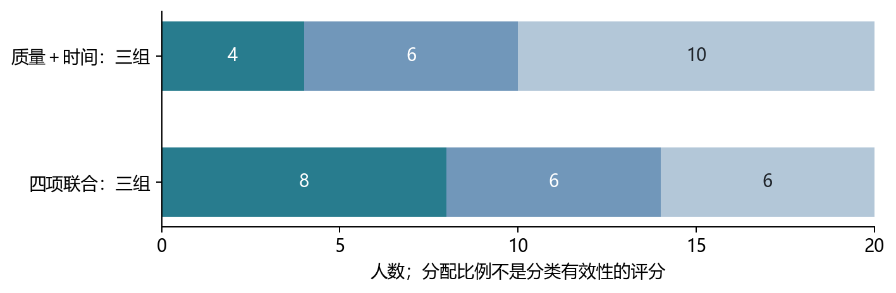

# 人员分类与具体子类稳定性

2026年9月10日｜更新探索规则后的历史验证｜不固定组数，不强行均分，不预选最终方案

方案一：用单项表现形成候选子类。质量、时间、规则判断、半自动行为各自探索分组及组数。原先按质量中位数切为10／10人的方法仅作历史对照，不作为本版应退回的方案。

方案二：用若干表现联合形成候选子类。例如质量＋时间、质量＋半自动、质量＋规则，以及三项、四项组合；每个组合都重新分类，并检查不同组数。

本版的判断目标是：能否识别至少一个含义清楚、换图后仍能重复识别的人群子类，其独立标注能进入稳定阶段。人数均匀不算优点；其他子类人数不足，也不否定这个子类。

单项方案较容易解释，但可能忽略其他行为差异。联合方案能够刻画更具体的行为，但加入信息和增加组数也可能使名单更不稳定。两者均须用数据验证，不能只看分组是否整齐或哪条曲线更早变平。

本轮已经从“人员够不够”推进到逐子类真实回放。结果仍是历史人员池内的探索，不能称为新增人员已验证，也不能证明某类在所有图片上永久收敛。

# 这次实际检查了什么

| 项目 | 本轮执行内容 |
|---|---|
| 指标组合 | 四个信息块的全部15种非空组合；大项总权重相同。 |
| 组数 | 从2组至可分类人数的一半；后续20人探索2—10组，全部范围随资料支持调整。 |
| 人员范围 | 全部26人与后续20人分开，共303套分类配置；没有各组人数相等的配额。 |
| 具体子类 | 每个子类独立检查名单重复性、目标图人数、稳定阶段及代表标注的参考偏差。 |
| 反复抽取 | 每图200条全局人员顺序；不同方法下相同人员子集复用计算，不增加独立证据。 |
| 目标隔离 | 分类时排除目标楼的质量、时间、scope及半自动记录；目标图仅在分类之后评价。 |

质量是最终点集与参考的偏差，时间是无辅助有效操作时间，规则目前只覆盖scope适用范围误判，半自动是修改幅度与参考净改善。不能将scope等同所有规则执行，也不能把快慢解释成认真程度。

实际运行仍使用Ward算法，探索的是指标组合与组数；没有穷尽其他聚类算法或权重。单人组原样保留，只能提示特殊表现，不能由一个人证明一种人群类型。资料不足的人保持未定。

# 后续20人：各组合分了多少人

各数字为一组人数。以下展示2—5组，全部探索组数和名单保留在数据附录。包含1人的组照列，不因此删除其他组，也不认定单人类型已成立。

| 分类指标 | 人数 | 2组 | 3组 | 4组 | 5组 |
|---|---|---|---|---|---|
| 质量 | 20 | 1／19 | 1／10／9 | 1／10／7／2 | 1／5／5／7／2 |
| 时间 | 20 | 8／12 | 8／11／1 | 2／6／11／1 | 2／6／6／5／1 |
| 规则判断判断 | 20 | 7／13 | 9／7／4 | 9／7／3／1 | 2／7／7／3／1 |
| 半自动行为 | 20 | 12／8 | 2／10／8 | 2／10／3／5 | 2／9／1／3／5 |
| 质量＋时间 | 20 | 10／10 | 4／6／10 | 1／3／6／10 | 1／3／8／6／2 |
| 质量＋规则判断 | 20 | 16／4 | 1／15／4 | 1／9／6／4 | 1／9／6／2／2 |
| 质量＋半自动行为 | 20 | 12／8 | 1／11／8 | 1／2／9／8 | 1／2／9／6／2 |
| 时间＋规则判断 | 20 | 10／10 | 7／3／10 | 7／1／3／9 | 7／1／3／8／1 |
| 时间＋半自动行为 | 20 | 9／11 | 9／5／6 | 2／7／5／6 | 2／7／5／5／1 |
| 规则判断＋半自动行为 | 20 | 12／8 | 10／2／8 | 6／10／2／2 | 2／10／2／4／2 |
| 质量＋时间＋规则判断 | 20 | 6／14 | 1／5／14 | 1／11／5／3 | 1／8／5／3／3 |
| 质量＋时间＋半自动行为 | 20 | 7／13 | 7／7／6 | 1／6／7／6 | 1／6／2／5／6 |
| 质量＋规则判断＋半自动行为 | 20 | 12／8 | 1／11／8 | 1／2／9／8 | 1／2／9／5／3 |
| 时间＋规则判断＋半自动行为 | 20 | 8／12 | 8／6／6 | 8／2／4／6 | 7／1／2／4／6 |
| 质量＋时间＋规则＋半自动 | 20 | 8／12 | 8／6／6 | 1／7／6／6 | 1／7／6／2／4 |

同一组号只在同一分类办法内按首项指标排序；不同组数、不同目标楼的组1不保证同一批人。这里是全部历史资料下的名单摘要，后面的验证每次重新排除目标楼。

# 全部26人：各组合分了多少人

各数字为一组人数。以下展示2—5组，全部探索组数和名单保留在数据附录。包含1人的组照列，不因此删除其他组，也不认定单人类型已成立。

| 分类指标 | 人数 | 2组 | 3组 | 4组 | 5组 |
|---|---|---|---|---|---|
| 质量 | 25 | 24／1 | 6／18／1 | 6／16／2／1 | 2／4／16／2／1 |
| 时间 | 24 | 10／14 | 10／13／1 | 4／6／13／1 | 4／6／7／6／1 |
| 规则判断判断 | 26 | 10／16 | 11／10／5 | 11／10／4／1 | 2／9／10／4／1 |
| 半自动行为 | 26 | 5／21 | 5／13／8 | 4／1／13／8 | 2／2／1／13／8 |
| 质量＋时间 | 24 | 23／1 | 11／12／1 | 4／7／12／1 | 4／6／7／6／1 |
| 质量＋规则判断 | 25 | 24／1 | 21／3／1 | 9／12／3／1 | 2／12／7／3／1 |
| 质量＋半自动行为 | 25 | 24／1 | 16／8／1 | 13／3／8／1 | 5／3／8／8／1 |
| 时间＋规则判断 | 24 | 9／15 | 9／4／11 | 9／1／4／10 | 9／1／4／8／2 |
| 时间＋半自动行为 | 24 | 11／13 | 4／7／13 | 4／7／5／8 | 3／7／1／5／8 |
| 规则判断＋半自动行为 | 26 | 21／5 | 13／5／8 | 13／6／5／2 | 2／13／4／5／2 |
| 质量＋时间＋规则判断 | 24 | 23／1 | 12／11／1 | 12／8／3／1 | 7／8／5／3／1 |
| 质量＋时间＋半自动行为 | 24 | 23／1 | 12／11／1 | 9／3／11／1 | 9／3／6／5／1 |
| 质量＋规则判断＋半自动行为 | 25 | 24／1 | 16／8／1 | 13／3／8／1 | 13／3／6／2／1 |
| 时间＋规则判断＋半自动行为 | 24 | 12／12 | 4／8／12 | 4／8／4／8 | 4／6／2／4／8 |
| 质量＋时间＋规则＋半自动 | 24 | 23／1 | 8／15／1 | 9／8／6／1 | 9／8／2／4／1 |

同一组号只在同一分类办法内按首项指标排序；不同组数、不同目标楼的组1不保证同一批人。这里是全部历史资料下的名单摘要，后面的验证每次重新排除目标楼。

# 三组例子：人数与含义分开判断

质量＋时间三组：组1为4人，平均参考偏差最低；组2为6人，平均操作最快；组3为10人，平均用时较长、参考偏差较高。这里能描述不同表现，但仍需检验这些人换图后是否保持在同一类。

四项联合三组：组1为8人，平均参考偏差较低、净改善较多；组2为6人，平均操作较快、修改较少；组3为6人，平均参考偏差及两种scope误判较高、修改较多。组平均不代表每个人都完全符合。

8／6／6接近均分并不支持分类更好。三组人数较少也不自动否定分类；它限制的是当前能观察多长的组内人数过程。

# 候选名单｜时间，2组

| 组别／人数 | 成员 |
|---|---|
| 组1／8人 | W1、W2、W6、W10、W12、W13、W17、W30 |
| 组2／12人 | W8、W11、W15、W28、W29、W31、W32、W33、W34、W35、W36、W37 |

| 所用指标 | 组1平均 | 组2平均 |
|---|---|---|
| 用时 | -0.756 | +0.504 |

数值是考虑任务差异后的人员效应均值，零是模型内的相对中心。用时采用log(1+秒数)，不是表中的数值秒；scope不是绝对正确率，偏差也不是人工逐条确认的规则错误数。只在同一行比较组间表现。

这份全量候选名单仅用于说明分出了什么人。验证目标楼时会重新分类，不能拿本表直接声称固定这些成员已经通过全部验证。

# 候选名单｜质量＋时间，3组

| 组别／人数 | 成员 |
|---|---|
| 组1／4人 | W2、W11、W15、W17 |
| 组2／6人 | W1、W6、W10、W12、W13、W30 |
| 组3／10人 | W8、W28、W29、W31、W32、W33、W34、W35、W36、W37 |

| 所用指标 | 组1平均 | 组2平均 | 组3平均 |
|---|---|---|---|
| 参考偏差 | -1.749 | +0.246 | +0.552 |
| 用时 | -0.153 | -0.857 | +0.575 |

数值是考虑任务差异后的人员效应均值，零是模型内的相对中心。用时采用log(1+秒数)，不是表中的数值秒；scope不是绝对正确率，偏差也不是人工逐条确认的规则错误数。只在同一行比较组间表现。

这份全量候选名单仅用于说明分出了什么人。验证目标楼时会重新分类，不能拿本表直接声称固定这些成员已经通过全部验证。

# 候选名单｜质量＋时间＋规则＋半自动，3组

| 组别／人数 | 成员 |
|---|---|
| 组1／8人 | W2、W8、W15、W17、W28、W32、W33、W36 |
| 组2／6人 | W1、W6、W10、W11、W12、W13 |
| 组3／6人 | W29、W30、W31、W34、W35、W37 |

| 所用指标 | 组1平均 | 组2平均 | 组3平均 |
|---|---|---|---|
| 参考偏差 | -0.841 | -0.021 | +1.142 |
| 用时 | +0.427 | -0.789 | +0.219 |
| 误拒可标图 | -0.051 | -0.070 | +0.138 |
| 误收不可标图 | -0.108 | -0.020 | +0.165 |
| 修改幅度 | -0.555 | -1.176 | +1.916 |
| 净改善 | +1.260 | -0.805 | -0.876 |

数值是考虑任务差异后的人员效应均值，零是模型内的相对中心。用时采用log(1+秒数)，不是表中的数值秒；scope不是绝对正确率，偏差也不是人工逐条确认的规则错误数。只在同一行比较组间表现。

这份全量候选名单仅用于说明分出了什么人。验证目标楼时会重新分类，不能拿本表直接声称固定这些成员已经通过全部验证。

# 具体子类换图片后，人员是否相似

将楼分成互不重叠的两批，各自分类，重复100次。每个所选测量方向仍要求至少6份记录、3栋楼。按训练资料中的明确行为对应，例如两边各取平均操作最快的一组，再比较共有人员中的名单。

| 子类 | 全量人数 | 可比较次数 | 两边均≥2人 | 名单重合程度 |
|---|---|---|---|---|
| 时间／较快组 | 8 | 100/100 | 100/100 | 0.889 |
| 时间／较慢组 | 12 | 100/100 | 100/100 | 0.909 |
| 质量＋时间／参考偏差最低组 | 4 | 100/100 | 33/100 | 0.200 |
| 质量＋时间／最快组 | 6 | 100/100 | 92/100 | 0.714 |
| 质量＋时间／最慢组 | 10 | 100/100 | 100/100 | 0.583 |
| 质量＋时间＋规则＋半自动／参考偏差最低组 | 8 | 0/100 | 0/100 | 资料不足 |
| 质量＋时间＋规则＋半自动／最快组 | 6 | 0/100 | 0/100 | 资料不足 |
| 质量＋时间＋规则＋半自动／净改善最高组 | 8 | 0/100 | 0/100 | 资料不足 |

名单重合程度＝两边共同成员数／至少在一边属于该组的人数。1表示相同，0表示无共同成员；大组随机选人也容易重合，因此另保留相同组大小随机选人的期望和扣除该期望后的数值，不能单凭原始重合比例判断。

四项联合包含的不可标scope图只有9张，不能分成两批各至少6张，所以主要求下无法检验。降低到每半3份、2楼只是补充诊断，不能当作主要求已通过。

# 较宽松的补充检查

| 子类 | 可比较次数 | 名单重合程度 | 扣除随机重合后 |
|---|---|---|---|
| 时间／较快组 | 100/100 | 0.882 | 0.839 |
| 时间／较慢组 | 100/100 | 0.917 | 0.858 |
| 质量＋时间／参考偏差最低组 | 100/100 | 0.200 | 0.123 |
| 质量＋时间／最快组 | 100/100 | 0.683 | 0.609 |
| 质量＋时间／最慢组 | 100/100 | 0.564 | 0.392 |
| 质量＋时间＋规则＋半自动／参考偏差最低组 | 69/100 | 0.167 | 0.014 |
| 质量＋时间＋规则＋半自动／最快组 | 69/100 | 0.571 | 0.460 |
| 质量＋时间＋规则＋半自动／净改善最高组 | 69/100 | 0.429 | 0.248 |

本页每半至少3份记录、2栋楼，单独展示。扣除随机重合后的1表示完全一致，0附近表示接近同样组大小随机选人的水平，负数表示低于这个水平；不是准确率。

同一套三分类中，有的组可以较容易再次识别，有的组会明显换人。因此不能只用整套分类的一个分数，代替对具体子类的检查。

指标与组数试过很多种；这里的例子延续前面讨论，不能仅根据某个最高数值命名最终人群类型。全部子类的结果均保留。

# 具体子类稳定性｜每次8人

后续20人范围。检查从第3人开始，持续观察到第8人；每张图200个顺序，至少80%明确稳定才计入达标。只列有可评分参考的图。

| 子类 | 全量人数 | 该类达标/可比较图 | 随机达标/同图 | 参考偏差：该类/随机 |
|---|---|---|---|---|
| 时间／较快组 | 8 | 18/39 | 8/39 | 4.06／3.81 |
| 时间／较慢组 | 12 | 8/41 | 8/41 | 4.59／4.28 |
| 质量＋时间／参考偏差最低组 | 4 | 3/7 | 3/7 | 2.62／2.36 |
| 质量＋时间／最快组 | 6 | 人数不足 | — | — |
| 质量＋时间／最慢组 | 10 | 5/34 | 5/34 | 4.97／4.92 |
| 质量＋时间＋规则＋半自动／参考偏差最低组 | 8 | 16/40 | 8/40 | 3.59／4.10 |
| 质量＋时间＋规则＋半自动／最快组 | 6 | 7/17 | 2/17 | 3.73／4.55 |
| 质量＋时间＋规则＋半自动／净改善最高组 | 8 | 10/24 | 7/24 | 3.23／3.55 |

每行内部使用同样图片、同样人数；不要求其他子类够人数。不同列举子类的图片集合可能不同，不可直接按达标数量排优劣。人数不足不等于不能收敛。

具名子类按训练资料的行为含义对应，不靠组号硬连。全量人数与每张目标图可用人数可能不同。某组同时是参考偏差最低组和净改善最高组时，它们是同一组的两个描述，不是独立发现。

稳定允许单簇或多簇；点数不同必分簇，受支持簇至少2人。稳定多簇至少需4人才能在起点形成，因此8人终点下只允许第2—3人起点的检验，不能确认多簇稳定起点。后面的10人及更长观察才有机会检验。

# 具体子类稳定性｜每次10人

后续20人范围。检查从第5人开始，持续观察到第10人；每张图200个顺序，至少80%明确稳定才计入达标。只列有可评分参考的图。

| 子类 | 全量人数 | 该类达标/可比较图 | 随机达标/同图 | 参考偏差：该类/随机 |
|---|---|---|---|---|
| 时间／较快组 | 8 | 人数不足 | — | — |
| 时间／较慢组 | 12 | 8/41 | 12/41 | 4.44／4.21 |
| 质量＋时间／参考偏差最低组 | 4 | 人数不足 | — | — |
| 质量＋时间／最快组 | 6 | 人数不足 | — | — |
| 质量＋时间／最慢组 | 10 | 5/34 | 9/34 | 4.89／4.84 |
| 质量＋时间＋规则＋半自动／参考偏差最低组 | 8 | 0/1 | 0/1 | 2.80／5.82 |
| 质量＋时间＋规则＋半自动／最快组 | 6 | 0/1 | 0/1 | 2.80／5.82 |
| 质量＋时间＋规则＋半自动／净改善最高组 | 8 | 人数不足 | — | — |

每行内部使用同样图片、同样人数；不要求其他子类够人数。不同列举子类的图片集合可能不同，不可直接按达标数量排优劣。人数不足不等于不能收敛。

具名子类按训练资料的行为含义对应，不靠组号硬连。全量人数与每张目标图可用人数可能不同。某组同时是参考偏差最低组和净改善最高组时，它们是同一组的两个描述，不是独立发现。

稳定允许单簇或多簇；点数不同必分簇，受支持簇至少2人。稳定多簇至少需4人才能在起点形成，因此8人终点下只允许第2—3人起点的检验，不能确认多簇稳定起点。后面的10人及更长观察才有机会检验。

# 具体子类稳定性｜每次13人

后续20人范围。检查从第8人开始，持续观察到第13人；每张图200个顺序，至少80%明确稳定才计入达标。只列有可评分参考的图。

| 子类 | 全量人数 | 该类达标/可比较图 | 随机达标/同图 | 参考偏差：该类/随机 |
|---|---|---|---|---|
| 时间／较快组 | 8 | 人数不足 | — | — |
| 时间／较慢组 | 12 | 人数不足 | — | — |
| 质量＋时间／参考偏差最低组 | 4 | 人数不足 | — | — |
| 质量＋时间／最快组 | 6 | 人数不足 | — | — |
| 质量＋时间／最慢组 | 10 | 10/23 | 8/23 | 4.76／4.83 |
| 质量＋时间＋规则＋半自动／参考偏差最低组 | 8 | 人数不足 | — | — |
| 质量＋时间＋规则＋半自动／最快组 | 6 | 人数不足 | — | — |
| 质量＋时间＋规则＋半自动／净改善最高组 | 8 | 人数不足 | — | — |

每行内部使用同样图片、同样人数；不要求其他子类够人数。不同列举子类的图片集合可能不同，不可直接按达标数量排优劣。人数不足不等于不能收敛。

具名子类按训练资料的行为含义对应，不靠组号硬连。全量人数与每张目标图可用人数可能不同。某组同时是参考偏差最低组和净改善最高组时，它们是同一组的两个描述，不是独立发现。

稳定允许单簇或多簇；点数不同必分簇，受支持簇至少2人。稳定多簇至少需4人才能在起点形成，因此8人终点下只允许第2—3人起点的检验，不能确认多簇稳定起点。后面的10人及更长观察才有机会检验。

# 稳定形成多个簇：已保留并实际检验

q=.95下，在有可评分参考的图片中，4张图出现某个人员子集至少80%的顺序处于稳定多簇阶段。相同人员子集被多种描述引用，不算多次独立发现。

| 图片 | 范围／分类指标 | 观察终点／候选起点 | 稳定多簇顺序数 |
|---|---|---|---|
| 4b983544 | 全部／半自动行为 | 21人／16人 | 166/200 |
| 1f149025 | 全部／半自动行为 | 21人／15人 | 162/200 |
| 07a43087 | 全部／半自动行为 | 21人／16人 | 162/200 |
| dda6efcb | 全部／半自动行为 | 21人／16人 | 168/200 |

每图仅列保存顺序中的第一个符合条件的例子，全部记录另存；这些例子用于说明确实允许并检测到了稳定多簇，不能用来反向决定分类办法或证明某个人群类型普遍收敛。

这些结果来自较长的可用人数观察。不能把只有8人的子类回放没有确认多簇，解释成该类必然只有一种标法；从第2或第3人开始检查时，本来就不足以形成两个各有2人支持的簇。

# 覆盖：没有只保留表现好的子类

| 范围 | 指标组合 | 各组数下的候选组总数 | 至少一图够回放人数 |
|---|---|---|---|
| 全部26人 | 质量 | 77 | 24 |
| 全部26人 | 时间 | 77 | 13 |
| 全部26人 | 规则判断判断 | 90 | 16 |
| 全部26人 | 半自动行为 | 90 | 25 |
| 全部26人 | 质量＋时间 | 77 | 17 |
| 全部26人 | 质量＋规则判断 | 77 | 23 |
| 全部26人 | 质量＋半自动行为 | 77 | 21 |
| 全部26人 | 时间＋规则判断 | 77 | 17 |
| 全部26人 | 时间＋半自动行为 | 77 | 19 |
| 全部26人 | 规则判断＋半自动行为 | 90 | 34 |
| 全部26人 | 质量＋时间＋规则判断 | 77 | 24 |
| 全部26人 | 质量＋时间＋半自动行为 | 77 | 15 |
| 全部26人 | 质量＋规则判断＋半自动行为 | 77 | 26 |
| 全部26人 | 时间＋规则判断＋半自动行为 | 77 | 16 |
| 全部26人 | 质量＋时间＋规则＋半自动 | 77 | 18 |

这里统计的是分类配置下的候选组，不是独立发现的人群类型。一个人员子集可在不同指标或组数下重复出现；不能把这些次数当作独立证据。

# 覆盖：后续20人的全部组合

| 范围 | 指标组合 | 候选组总数 | 至少一图够回放人数 |
|---|---|---|---|
| 后续20人 | 质量 | 54 | 13 |
| 后续20人 | 时间 | 54 | 6 |
| 后续20人 | 规则判断判断 | 54 | 12 |
| 后续20人 | 半自动行为 | 54 | 17 |
| 后续20人 | 质量＋时间 | 54 | 16 |
| 后续20人 | 质量＋规则判断 | 54 | 17 |
| 后续20人 | 质量＋半自动行为 | 54 | 13 |
| 后续20人 | 时间＋规则判断 | 54 | 14 |
| 后续20人 | 时间＋半自动行为 | 54 | 10 |
| 后续20人 | 规则判断＋半自动行为 | 54 | 18 |
| 后续20人 | 质量＋时间＋规则判断 | 54 | 14 |
| 后续20人 | 质量＋时间＋半自动行为 | 54 | 13 |
| 后续20人 | 质量＋规则判断＋半自动行为 | 54 | 14 |
| 后续20人 | 时间＋规则判断＋半自动行为 | 54 | 11 |
| 后续20人 | 质量＋时间＋规则＋半自动 | 54 | 12 |

本轮回放涉及57张至少7份无辅助记录的图。实际重复的图内人员子集只有5448个，已共享计算；不足7人的具体子类均保留为人数不足。

主展示之外，所有子类都保存q=.95及OSPA30≤6的稳定性结果；分别保留全部图、可评分参考图及明确裁定可标图。所有组数的结果可复核，未按较早稳定挑选类别。

# 当前结论与新增人员如何使用

已经完成的工作是：15种指标组合与不同组数的分类、逐子类名单重复性、各子类真实标注回放、同图同人数随机对照，以及代表标注的参考偏差。不是仅检查人数够不够，也没有预设必须回到质量中位数二分。

分类解释和收敛仍需分开。时间组有较强的名单重复证据；某些联合分类可描述不同质量、速度或修改表现，但一张全量名单不能证明这种类型在新人员中仍成立。scope相关分类尤其受到可用明确裁定图片数量限制。

具体子类在部分图片上进入有限观察内的稳定阶段，不等于它对所有图片都稳定，更不等于结果正确。代表偏差需要一起看。未知状态给出的上下界不是置信区间；本轮没有对大量方案选择作最终统计确认。

下一批人员应先独立完成校准图，再按事先固定的行为判据归类，并在另一批图片上验证。允许某些人员暂未归类；不为凑人数移动人员。若某个子类有明确含义但人数不够，可有针对性地补充同类证据。

每人独立标注一次，后处理再组合A、B、AAB等比例；同一人不能重复冒充多人。具体子类的单独验证优先，不要求所有类型同时收敛。不修改正式资格、任务分发或原始标注。

# 全部结果与复现

[所有组数的成员与平均表现](../group_count_extension/组数与成员附录.md)。各组数、人数、重复性原表均保留在上一层group_count_extension目录。
`classification_availability.csv`完整列出每张至少7份响应图×全部分类配置，区分训练资料无法形成分类；`coverage.csv.gz`进一步列出能分类时各子类实际不同人员数和不足状态。`pool_members.csv.gz`标识每图唯一人员子集，避免把重复子集当独立证据。
`scenarios.csv.gz`连接具体子类与同图同人数基线；`pool_curves.csv.gz`保留每个唯一子集的固定H与合法起点k，三状态相加为200。`pool_quality.csv.gz`是组内选代表后再与参考比较的分数。
`paired_curves.csv.gz`等不带named前缀的文件按组号留作审计；具名子类使用`named_role_map.csv.gz`按每个所用轴高／低的明确训练特征对应，全部方向均保留。`named_paired_curves.csv.gz`是逐图对照；`named_subtype_summary.csv`先按图再按楼汇总；`named_onsets.csv.gz`给出起点。不同覆盖不能直接排名。
主探索输入来自上一轮已审计的原始响应、参考、日志及成对距离。分类始终排除目标楼。方法按本仓库相似场景标注稳定性分析SOP第9节执行；本次不写入正式方法合同。
复现：`python -m tools.thesis_main.analysis.worker_group_count_exploration_20260910 --subtype-repeatability`及`--named-repeatability`；`python -m tools.thesis_main.analysis.worker_subtype_stages_20260910 replay`；`summarize`；`named`；`report`。