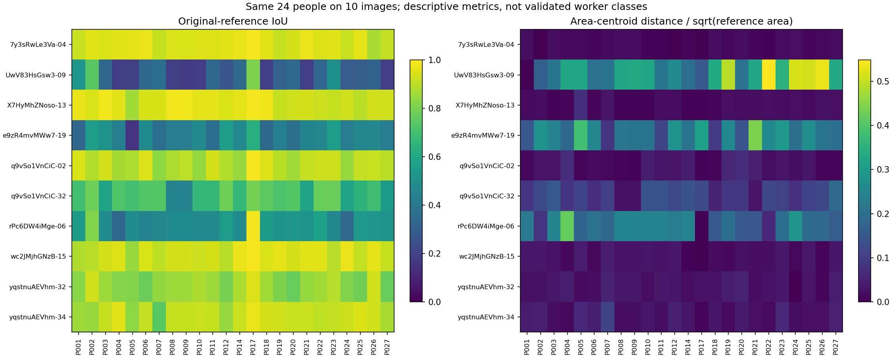
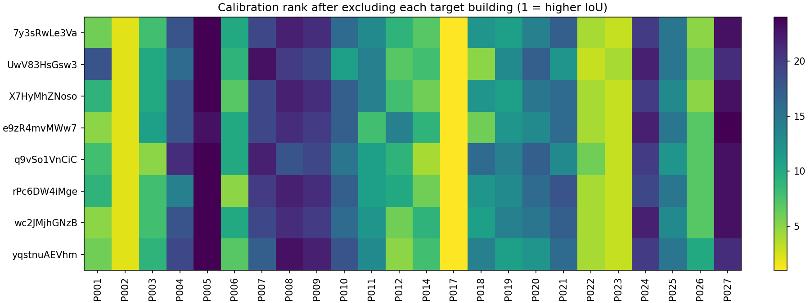
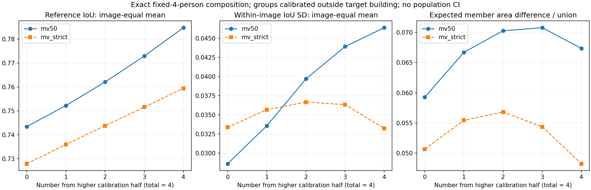

# 共同图片上的人员画像与固定4人构成：基础研究

2026-10-03；合同 `consensus_research_20260923_v1`。接续[136图人数扩展](../lee_expanded_20261003/REPORT.md)，本轮完成S3-B画像及S4固定人数的探索。**已有证据支持继续研究人员构成；尚未建立可推广的人员类型、完整质量总分或人数停止规则。**

## 1．输入与实际完成范围

采用S2按覆盖预选的同样24人×10张Manual图，8栋建筑，240份独立候选。仅1图有明确简单标签，9图未记录难度，这个共同块不能承担三档难度比较。不是从本轮质量分数中挑选图片。

从当前统一输入重新绑定：274对象＝260人员记录＋14参考。240份候选与14参考坐标均精确匹配来源索引；另20份不可用的非候选记录完整保留，没有补点或减少候选分母。此共同块240份均可计算，不代表全库无失败；扩图阶段的24人失败整池仍保留在其原报告中。

沿用已预处理点对、确认环及默认共享x顺序。BEV是声明地面足迹；相机高度单位h=1，面积h²，不逐份对齐或缩放。原始GT为共同主参照，4图另有修订GT。OOS、难标门洞及存疑参考不因本轮重新取得人员评价资格。

本轮交付：

- 逐作答IoU、面积质心距离及标准化距离；原GT240行＋修订GT96行。
- 人员×图片矩阵、连续人员画像、整栋建筑留出的校准表现与分组变化。
- 既有λ网格的排名敏感性；没有拟合或选择最佳权重。
- 固定4人，每图穷举C(24,4)=10626个真实不同成员集合；两种等权Lee规则、原始及可用修订参考。
- 同构成更换成员后的IoU离散度，以及不依赖GT的融合区域差异。

## 2．人员质量分项怎样计算

IoU沿用BEV区域交并比。质心采用区域面积中心，不是角点均值，也不是图片画布中心。保存原值 `centroid_distance_h` 和 `centroid_normalized = distance / sqrt(reference_area)`。各图相机坐标中的dx/dz逐答保留，不跨图平均成一个世界方向。

`worker_profiles.csv`按共同10图等权给出IoU均值、中位数、跨图SD与平均质心距离；另保存减去同图全员均值后的IoU均值和SD。这能描述同图相对表现，**不能把剩余跨图变化全部解释为个人不稳定**：每人每图只有一次作答，人图交互和随机波动仍混在一起。

在24人的原GT画像上，平均 `(1-IoU)` 与平均标准化质心距离的Spearman相关为 **0.3226**。两指标提供的人员排序并不一致；这本身既不证明质心更有效，也不证明它无用。

沿用既有 `Dλ=(1-IoU)+λ×标准化质心距离`，λ为0、0.25、0.5、1、2。在每个外建筑校准集上分别重算名次，相对纯IoU的最大绝对名次变动依次为 **0、5、6、10、14**。这是权重敏感性，不能依据“哪个排名更合理”选最终λ；本轮分组和融合均不使用该合成分数。



## 3．整栋建筑留出后，人员区分有多稳

对每个目标建筑，先移除该建筑全部图片，用其余7栋建筑的8或9张图、原GT平均IoU校准24人。按校准均值分为上半12人和下半12人；切点并列时程序报错，不按人员编号任意切开。本轮没有切点并列。

这里的“上半／下半”仅指**当前留出折的相对校准组**。不是跨场景稳定的高低能力标签，不写回资格或正式worker tier。目标建筑GT只用于评价，不进入其分组。

- 8人始终位于上半，7人始终位于下半，**9人会换组**。
- 校准排名与目标建筑实际IoU排名的Spearman为 **0.0379—0.5745**；其中一些目标建筑只有1图。留出折的训练集重叠，不能把8折当8个完全独立实验。
- 将校准集从图片等权改为建筑等权，排名相关为0.9748—0.9896；但192个人员×留出折中仍有 **10个组别改变**。高整体相关不保证临界分组稳定。

说明存在可追踪的连续人员差异，但10图不足以冻结可靠分类。共同图片减少了分配到不同难度图片的混杂，没有自动消除全部图片与人员交互。



## 4．固定4人，构成与具体成员分别发生什么变化

对每个目标图，使用其外建筑校准组，穷举上半人数为0、1、2、3、4的所有4人集合。对应集合数为495、2640、4356、2640、495，总计10626。每种构成内部集合等权；构成间不按集合数混成一个不透明均值。全员tile仅用作离线积分细分，票数只读当前4人，GT不参加投票。

10图图片等权、原GT、原GT校准：

| 上半＋下半人数 | MV50平均IoU | 严格多数平均IoU | MV50平均图内IoU SD | MV50成员区域差异／并集 |
|---|---:|---:|---:|---:|
| 0＋4 | 0.7435 | 0.7280 | 0.0286 | 0.0593 |
| 1＋3 | 0.7523 | 0.7360 | 0.0336 | 0.0667 |
| 2＋2 | 0.7621 | 0.7439 | 0.0397 | 0.0703 |
| 3＋1 | 0.7729 | 0.7516 | 0.0439 | 0.0708 |
| 4＋0 | 0.7848 | 0.7595 | 0.0464 | 0.0674 |

**平均参考一致性随上半人数提高，但不等于更换成员后的波动更小。** MV50全上半相对全下半，9图提高、1图下降；严格多数为7图提高、3图下降。不能把10图均值的上升写成每张图都改善。

IoU SD、p10/p90是同图同构成所有成员集合的分布；表中SD是逐图SD的平均，不是均值标准误或总体置信区间。

另一个稳定性量是：同图同构成独立抽两组成员，允许两次恰好相同，计算融合区域对称差面积的期望。每个积分区域被该构成选中的精确比例为q，其期望贡献为 `2×area×q×(1−q)`。求和后除以该图全24人区域并集面积。这个分母在各构成间固定，但大范围作答可能影响它的尺度。**它不是平均1−IoU，也不是增加一个人的变化量；不据此宣称稳定速度已解决。**

以上均为固定池穷举，没有Monte Carlo均值误差；仍存在样本代表性、参考有效性与几何假设的不确定性。四人结果不能替代不同人数下的构成实验。



## 5．参考版本敏感性

两种校准政策分别报告：`original`是10图均用原GT；`revised_where_available`明确为4图使用修订GT、6图仍用原GT，不冒充完整修订真值。两种政策都先留出整个目标建筑，再计算画像和分组。

全10图画像两政策的IoU排名相关为0.9209，192个人员×留出折中有22个组别改变，说明参考版本对部分人员区分有实质影响。

只在同样4张双参考图、保留原GT校准分组时，MV50全下半→全上半的均值：原GT为0.5715→0.6320，修订GT为0.6840→0.7643。修订版下仍有构成对应，但分值水平明显改变。不要把原GT的10图均值与修订GT的4图均值直接比较。

完整交叉结果在 `composition_summary.csv`：同时保留两种校准政策与两种目标参考，避免把“分组变化”和“评价参考变化”混成一件事。没有原图的Pro只能审查算法与数值，不能裁决哪版GT视觉上正确。

## 6．验证与复现

- 23项相关测试通过，含目标建筑所有行隔离、面积质心反例、两种投票、精确构成计数、独立几何下成员区域差异，以及失败/重复人员不静默删除。
- 用冻结输入重放：14个CSV逐字节相同、NPZ的30个数组逐元素相同；临时重放目录已清理。
- 实际数据另外选择每图0／2／4位上半成员各一个集合，用当前子集重新切tile核对84个参考IoU，最大差 `1.11e-15`，此项无警告。
- 28个精确k=4参考均值对照前轮抽样结果，最大差0.001420，全部位于前轮计算误差界内；旧结果不覆盖。
- 全员细分与代表性当前子集重建区域最大对称差约 `5.37e-16 h²`。
- 保留2条 `e9zR4mvMWw7-19` 几何核验 `symmetric_difference` 警告；没有宣称零警告或跨环境全部通过。未运行全仓库测试；本轮未修改采集、viewer、原始导出、清洗裁决或三维算法。

复现入口：

```text
python -B -m tools.thesis_main.analysis.worker_profiles_20261003 --input analysis_results/worker_profiles_20261003/input.json --out analysis_results/worker_profiles_replay
```

必须使用新输出目录。固定输入连同 `block.json`、`source_binding.json`提供重放；来自源数据的重新绑定需本地完整统一输入。字段和NPZ映射见 `field_contract.json`、`rosters.json`。依赖沿用仓库环境，不新增库。

## 7．接下来的研究目标

现在A线有更多图片与更高人数，B线有共同图片上的人员分项、外建筑敏感性和固定人数真实构成证据。论文可按“图片/人数的粗对应→共同图片人员差异→构成与具体成员影响→两线联系”推进；不能提前给两线编造统一解释。

Pro优先独立判断：这些人员差异是否可靠、质心是否具有可解释的增量价值、构成带来的参考改善与成员波动应怎样解释，以及下一轮哪项分析最能消除当前疑问。方法不预先限定，不要求正结果。后续再扩展人数与构成、建立有依据的人员类型并联系图片困难；本共同块9图无难度标签，因此两线联系尚未完成。

边界、顶部、高度、墙面残差及适用条件下体积仍有研究位置；本轮没有验证其增量效度，也没有把它们删除或作为人员组合的前置关口。分簇、合理空间候选和同房预测继续保留独立研究位置。
