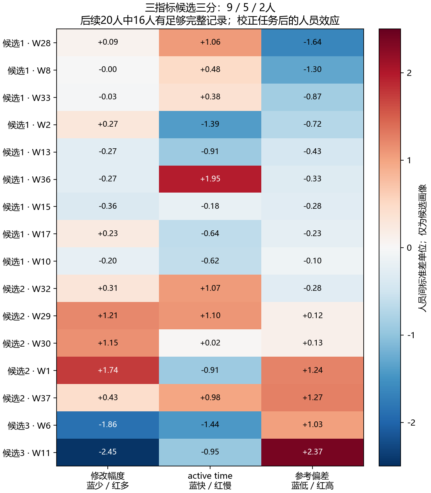

# 规则执行粗依据与修改幅度—时间—质量三指标验证

2026-09-10。**规则执行表现可以继续作为粗依据，但应优先使用有复核来源的参考及连续画像。三指标能形成有行为解释的候选组；目前没有证据表明它稳定优于简单分类，也未证明类内收敛。**

## 一、两条探索分别回答什么

A线：纯Manual的参考执行表现能否跨图复现，并形成可用粗类。B线：同一批Semi响应的修改幅度、active time、最终参考质量，能否组成更有解释力、可复现的人员分类。两线都分别检查全部26人和后续20人。

“修改幅度”明确限定为真实预标注→最终响应的无序球面点集距离。纯Manual没有可比初始轮廓，不填成0修改。时间使用合格日志的log(1+seconds)，不补lead_time。所谓质量是最终响应到可评分参考的OSPA偏差，越低越接近参考，不能直接称为真实正确率、规则合规率或认真程度。

## 二、数据和可复现规则

- Manual从最新人工点处理视图及原始导出重新核验，1887条中排除2条补点记录；可评分参考保持复核优先、未决不评分。
- Semi全部574条、43图、26人重新连接真实初始化和最新有效点。68项导入文件×图像匹配通过；W13的一条9→8点人工处理已纳入，1条修改／最终偏差数值更新。另4条未经确认的奇数点仍按当前计算视图保留，不能把点集可算当作建筑结构合法。
- 时间复用并重跑上一轮各阶段原日志审计。排除lead_time回填、覆盖不足、协议偏离和已知人工加秒身份；441条Semi有合格时间，413条同时有修改、时间、可评分参考。后续20人有336条三指标完整响应。
- 分类的训练支持下限固定为至少6条完整响应、至少3个building。全26人实际20人达到三指标支持，后续20人实际16人达到支持。单次留楼后重新检查支持，不能先用全部目标数据决定训练资格。
- 对同一预标注上下文先消除任务截距，估计人员三轴效应；只在训练人员内标准化为等权三个轴，再尝试Ward二分／三分。不用测试楼选择标准化参数、类别数或组均值。
- 对照为只用质量二分、修改＋质量二分、时间＋质量二分、三指标二分／三分，以及保留每个人连续效应。所有模型使用同一完整响应面板、同一批可预测人员。不同距离或初始化范围是敏感性分析，不是随机化干预。
- 每类至少2人；若训练切分产生单人类，明确拒绝该折分类，类别预测退回不区分人员的基线，记录abstention，不把单人类偷偷合并。这个阈值约束人员分类，与单图“至少两人支持标法簇”是两件事。
- 整楼留出检验其他楼上已知人员的相对表现；不是新人预测或绝对秒数预测。另重复100次互斥楼分半，两半完全独立估计效应和分类；ARI不受类别编号置换影响。不可分类的重复计数保留，不当成成功。

## 三、A线：规则执行作为粗依据

首先拆分点位匹配偏差、相对参考的点数不足量及点数超出量，不把相对点数不足直接称为已确认漏标。二者无法识别局部多标与漏标相互抵消，匹配距离也不是逐墙拓扑审计。

以下是连续人员效应的楼等权预测误差改善，正数为优于不区分人员；不是分类准确率：

| 人群 | 参考范围 | OSPA30综合偏差 | OSPA60综合偏差 | 点位偏差 | 点数不足 | 点数超出 |
|---|---|---:|---:|---:|---:|---:|
| all26 | all_reference | +12.18% | +7.61% | +16.90% | +1.61% | -1.98% |
| all26 | reviewed_reference | +24.35% | +22.55% | +19.99% | +5.14% | +1.82% |
| current20 | all_reference | +3.29% | -0.03% | +1.17% | +1.67% | -1.97% |
| current20 | reviewed_reference | +8.40% | +8.79% | -0.47% | +6.01% | -0.63% |

后续20人在有复核来源参考上的OSPA预测改善约8.4%／8.8%，高于混合参考的3.3%／约0%。这支持优先整理参考明确的校准图。但它仍是连续差异信号，不足以确认天然高／低执行类型。此处“有复核来源”不等于每图每处边界均已由用户确认无歧义。

把点位、点数不足、点数超出合并后尝试二分：后续20人在混合参考上为7／13人，在有复核来源参考上为18／2人；后者小组为W34、W37。该二分对综合偏差的留楼预测改善只有2.47%，互斥分半ARI中位数0.155（91/100次能比较）；混合参考分半ARI中位数−0.009。分为三类也没有稳定优势。

全部人群的多指标Ward经常切出单人异常组，因此被明确拒绝；拒绝时的0收益表示未采用分类，不表示这些人完全没有差异。后续20人没有理由为了凑成均衡比例强行划档。

在有复核来源参考上，同时查看OSPA30/60的楼级bootstrap区间，当前较低偏差核心候选为W2、W15、W17、W33；较高偏差核心候选为W34、W35、W37。其余人的方向或边界证据较弱。这是全量资料下的保守候选描述，**尚未单独验证这份核心名单的类内收敛或跨图分类稳定性**。W12在OSPA30下较高、OSPA60下未分明，不能为了人数把它强并入高偏差类。

同时回读50条人工原文：多数是图像、范围、参考或显示顺序层面的判断，尚无覆盖所有工人/图片的逐条“违反哪条规则”标签。V16有明确W37标错的意见，但不能由一图推断永久粗心。还发现旧V38账本的gt_inaccurate与原文“gt标的最对”不一致；该图本轮无Manual响应、未进入此线估计，已在独立审计表指出，未悄悄改写原账本。

## 四、B线：三指标分类的实际结果

### 后续20人的同面板比较

主要结果使用OSPA30、全部初始化；16人、325条可留楼验证响应。336条完整响应与325条验证响应之差来自训练支持及同图可比人员要求，不是按质量高低筛选。

| 方法 | 修改幅度预测改善 | 时间预测改善 | 最终参考偏差预测改善 |
|---|---:|---:|---:|
| 只用质量二分 | +0.84% | +7.94% | +13.59% |
| 修改＋质量二分 | +21.16% | +13.74% | +6.03% |
| 时间＋质量二分 | +0.61% | +40.76% | +0.80% |
| 三指标二分 | +21.16% | +13.74% | +6.03% |
| 三指标三分 | +22.40% | +24.62% | +4.92% |
| 保留人员连续三轴 | +27.71% | +52.47% | +13.37% |

三指标二分与“修改＋质量二分”在主要验证中的逐响应预测完全相同，加入时间没有形成额外收益。三指标三分改善了时间预测，但参考偏差预测稍差；不能把三个不同单位的收益随意相加，宣称总体更好。全部人群实际20人的三指标二分对修改／时间／参考偏差分别改善15.66%／28.93%／7.78%，连续画像分别为22.67%／62.88%／14.44%。

### 候选成员及其含义

- 后续20人的三指标二分为14／2人，小组是W6、W11。描述宜为“较强保留预标注倾向，当前完整面板上耗时较短、最终参考偏差较高”；不能叫“粗心”，也不意味着另外14人都是准确修正者。
- 三分为9／5／2人。它把其余人再拆分，组内速度与质量仍有明显差异。全26人的可用20人分别得到16／4及6／10／4，并非所有26人已被成功分类。

| 三指标三分候选组 | 后续20人中的实际成员 |
|---|---|
| 1 | W2、W8、W10、W13、W15、W17、W28、W33、W36 |
| 2 | W1、W29、W30、W32、W37 |
| 3 | W6、W11 |

颜色是当前16名可用人员内标准化的任务校正效应，红色分别表示多改、较慢、偏差较高，三列不共享“好坏”方向。灰缺失未补入图片；W12、W31、W34、W35保留在覆盖表。

解释小组时补看原始行为：在本次完整面板中，W11有20/21条几何未改，W6有17/21条未改。自然trap子集各6图，W11的6条均未改、没有参考偏差改善；W6有4条未改、2条改善。自然control和部分C1初始化本来很接近参考，保留也可能合理。这里的改善是点集参考距离减少，不是新的人工正确性裁决。以上是候选组形成后的描述性核对，不冒充独立验证。

### 分类稳定性与敏感性

| 人群/范围 | 距离 | 分组 | 可比较重复/100 | 分半ARI中位数 |
|---|---|---|---:|---:|
| all26 | all | ospa30 | triad2 | 87 | 0.592 |
| all26 | all | ospa30 | triad3 | 79 | 0.235 |
| all26 | all | ospa60 | triad2 | 84 | 0.606 |
| all26 | all | ospa60 | triad3 | 79 | 0.337 |
| current20 | all | ospa30 | triad2 | 85 | 0.107 |
| current20 | all | ospa30 | triad3 | 77 | 0.200 |
| current20 | all | ospa60 | triad2 | 81 | 0.461 |
| current20 | all | ospa60 | triad3 | 71 | 0.526 |
| current20 | reviewed_reference | ospa30 | triad2 | 29 | 0.461 |
| current20 | reviewed_reference | ospa30 | triad3 | 29 | 0.077 |
| current20 | without_synthetic | ospa30 | triad2 | 63 | 0.005 |
| current20 | without_synthetic | ospa30 | triad3 | 50 | 0.145 |

全部人群的OSPA30二分具有一定复现性（ARI中位数0.592，87次可比较）；后续20人只有0.107，三分0.200。换成OSPA60时后续20人提高至0.461／0.526，但可比较次数为81／71，说明结论依赖距离定义和样本支持。不能只挑最有利的一种。

去掉合成初始化后，后续20人的三指标二分变成5／11人，分半ARI中位数约0.005（63次可比较），对最终参考偏差的预测改善为−8.88%；三分为−9.47%。仅有复核来源参考时二分的ARI中位数虽为0.461，但仅29次可比较，另外71次没有满足分组比较要求，不能报告成稳定成功。

因此，这条线支持保留具体的修改行为候选；尚不支持在任何初始化上套用同一组人员类型。初始参考偏差与最终参考偏差的差值是改善量，同图初始化固定时它与最终偏差仅差常数，不能再作为第四个独立质量轴。

## 五、能否连接回Manual规则执行与类内收敛

额外检验：只在目标楼之外用Semi三指标分组，再用训练Manual估计组均值，预测留出楼Manual偏差。后续20人实际16人的二分／三分改善仅0.34%／3.48%，小于同面板Manual连续人员效应的7.63%；全部人群实际20人的二分／三分均为负。Semi行为类型不能直接当作Manual能力类型。

人数上，W6/W11两人组无法研究从k=2开始再增加若干人后的稳定阶段。三分中的5人组按此前保留5名未来支持者的规则也没有合法起点。14人组虽然有更长的有限池观察窗口，但其分类本身尚未充分复现，不能先看目标图是否收敛再挑组。

建议继续以“规则执行表现”为粗依据，先把独立可评分校准图和逐条执行问题证据整理扎实；三指标作为Semi条件下的连续行为画像及候选类型补充。近期最具体的可验证行为是“是否保留明确有偏差的初始化、是否修正”，比直接命名认真／粗心更贴近现有证据。后续采集不必为A、AB、AAB分别重做，但人员分类校准与目标图必须分开。

## 六、完整覆盖

| 人群 | 人员 | Semi记录 | 合格时间 | 三指标完整记录 |
|---|---|---:|---:|---:|
| all26 | W1 | 25 | 23 | 22 |
| all26 | W2 | 23 | 23 | 22 |
| all26 | W6 | 22 | 22 | 21 |
| all26 | W8 | 22 | 21 | 18 |
| all26 | W10 | 23 | 22 | 20 |
| all26 | W11 | 22 | 22 | 21 |
| all26 | W12 | 22 | 4 | 3 |
| all26 | W13 | 23 | 23 | 22 |
| all26 | W14 | 22 | 0 | 0 |
| all26 | W15 | 22 | 22 | 19 |
| all26 | W17 | 22 | 22 | 21 |
| all26 | W18 | 22 | 22 | 21 |
| all26 | W19 | 18 | 18 | 17 |
| all26 | W21 | 18 | 18 | 17 |
| all26 | W26 | 18 | 0 | 0 |
| all26 | W27 | 23 | 23 | 22 |
| all26 | W28 | 23 | 23 | 22 |
| all26 | W29 | 23 | 23 | 22 |
| all26 | W30 | 23 | 13 | 12 |
| all26 | W31 | 23 | 4 | 4 |
| all26 | W32 | 23 | 23 | 22 |
| all26 | W33 | 22 | 22 | 21 |
| all26 | W34 | 24 | 0 | 0 |
| all26 | W35 | 22 | 4 | 3 |
| all26 | W36 | 22 | 22 | 21 |
| all26 | W37 | 22 | 22 | 20 |
| current20 | W1 | 25 | 23 | 22 |
| current20 | W2 | 23 | 23 | 22 |
| current20 | W6 | 22 | 22 | 21 |
| current20 | W8 | 22 | 21 | 18 |
| current20 | W10 | 23 | 22 | 20 |
| current20 | W11 | 22 | 22 | 21 |
| current20 | W12 | 22 | 4 | 3 |
| current20 | W13 | 23 | 23 | 22 |
| current20 | W15 | 22 | 22 | 19 |
| current20 | W17 | 22 | 22 | 21 |
| current20 | W28 | 23 | 23 | 22 |
| current20 | W29 | 23 | 23 | 22 |
| current20 | W30 | 23 | 13 | 12 |
| current20 | W31 | 23 | 4 | 4 |
| current20 | W32 | 23 | 23 | 22 |
| current20 | W33 | 22 | 22 | 21 |
| current20 | W34 | 24 | 0 | 0 |
| current20 | W35 | 22 | 4 | 3 |
| current20 | W36 | 22 | 22 | 21 |
| current20 | W37 | 22 | 22 | 20 |

后续20人中W12／W31／W35分别只有3／4／3条完整记录，W34为0；这些人有其他质量或修改证据，不表示无能力或不认真。若后续沿用三指标探索，应优先补共同校准图的合格时间和真实初始—最终记录；最低6条/3楼只是本轮可估计门槛，并非充分样本量保证。

## 七、复现、字段和验证边界

运行：`.venv/Scripts/python.exe -m tools.thesis_main.analysis.worker_rule_triad_20260910`。

- `manual.csv.gz`、`semi.csv.gz`：逐响应计算输入副本，原始来源、人工处理、参考状态和时间状态仍保留；不是原始数据真源。`semi_metric_changes.csv`记录旧→最新计算差异。
- `members.csv`：cohort×experiment×scope×metric×model×worker；label=0表示分类拒绝，不能当作一个正常类型。rows/buildings为训练支持；各轴值为校正任务后的人员效应。
- `fold_members.csv.gz`：另有heldout_building、training_buildings与status，保存每折训练归类。`predictions.csv.gz`的axis是评估目标，target是同图中心化结果；baseline/continuous/layer_sqerr为三个对照误差。
- `validation.csv`：按楼等权MSE计算continuous_gain和group_gain，abstention_rows是分类拒绝但仍计入相同评估面板的行数。不同scope的响应集合变化，不作因果比较。
- `half_stability.csv`：两半楼清单、状态、共有人员、ARI；不可比较时ARI为空，不能填0或删除后不报告分母。
- `coarse_profiles.csv`、`coarse_validation.csv`：参考执行各代理轴的500次楼级bootstrap区间、支持和留楼验证；个别清楚的区间不等于完整分类稳定。
- `manual_transfer.csv`及其逐响应文件：Semi分型到Manual表现的独立楼迁移；`candidate_behavior_examples.csv`是候选人员的描述性解释，不是另一套训练外结果。
- `SOURCE_QA.json`和`SOURCE_AUDIT.json`：原始标注、真实初始化、参考坐标、原日志重放检查；`human_rule_evidence_audit.csv`是既有人工原文的只读整理，不新增逐人错误判决。
- `PLAN.json`记录门槛、标准化、模型与留出规则；本次是多配置探索，没有做显著性主张、因果主张、新人外推或类内收敛证明。测试及输出核验见`VERIFICATION.json`。

所有改动局限于探索脚本、测试、结果与索引；原始导出、日志、正式人员资格、三轴合同、派发和路由未改。
