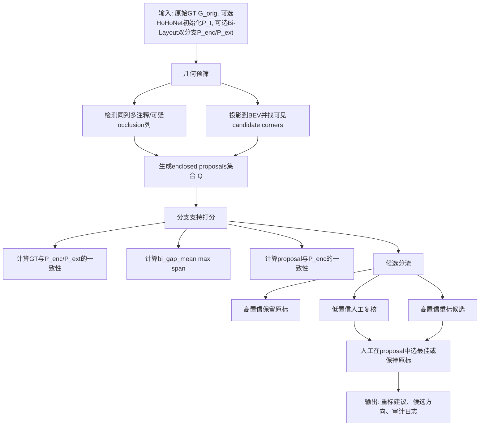
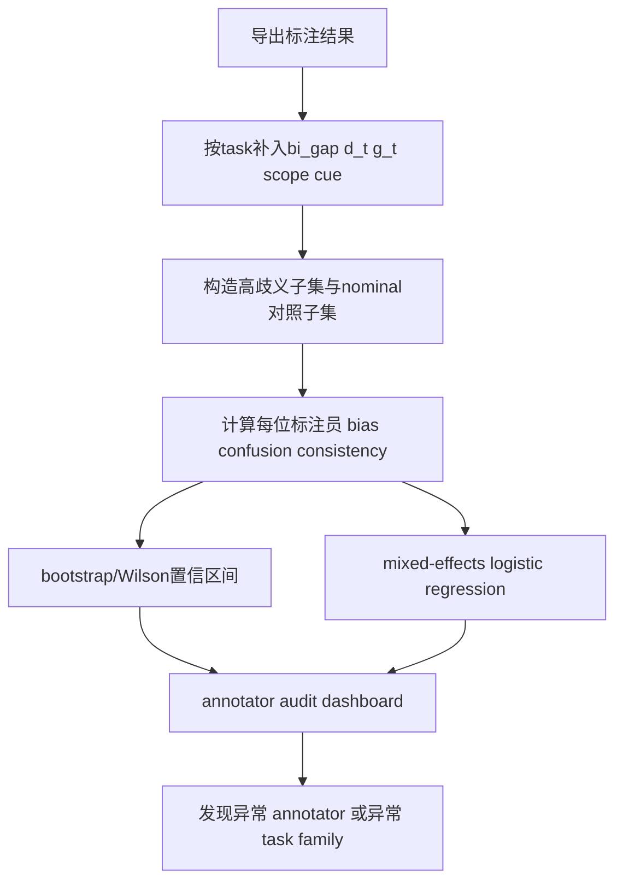
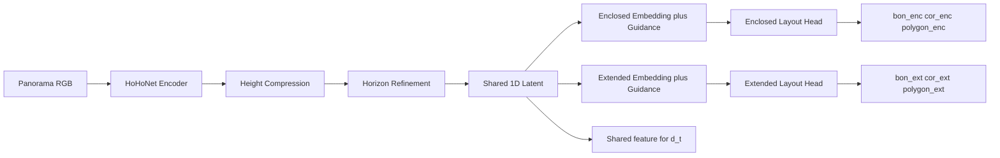

# 基于 Bi-Layout 与现有 HoHoNet 标注链的 OOS 与歧义治理评估报告

## Executive Summary

已使用的连接器清单：**GitHub、Hugging Face**。检索顺序为：先通过 GitHub 连接器审查你指定的 `Sparkling-Flames/3D_Manhattan_label` 仓库，确认当前主链、HoHoNet 实现、Label Studio 标注链路、`d_t/g_t` 现状；再通过 Hugging Face 连接器确认作者已发布 `Bi_Layout` 模型与数据；随后补充阅读 **Bi-Layout 论文原文、补充材料、作者项目页与官方 GitHub README**，并对 HorizonNet、HoHoNet、LGT-Net、AtlantaNet、ZInD 等相关文献进行交叉核对。你这个问题里必须学习的关键信息点有五个：当前项目中 `g_t/d_t` 的真实职责边界、Bi-Layout 是否提供可复现的自动分流算法、Bi-Layout 的“歧义检测”究竟检测了什么、Sparkling-Flames 仓库里 HoHoNet 当前可改造到什么程度、以及现有 Label Studio 界面与运行链路能否承载“人工谨慎判断提示”。fileciteturn54file0L3-L3 fileciteturn53file0L3-L3 fileciteturn42file0L3-L3 fileciteturn63file0L3-L3 citeturn12view0turn11view0turn5view0

从严格审稿人的角度，最核心的结论有四条。第一，**Bi-Layout 论文并没有给出一个“把原始混合 GT 全自动分成 enclosed vs extended”的纯自动分类算法**；它给出的是一个**半自动重标注流程**，并明确写出“选择最佳 proposal”这一步需要人工决策，而且 MatterportLayout 仅有 **15%** 标签被重新标成 enclosed。换言之，你不能把这篇论文理解成“已经解决了 GT 自动分流”；它解决的是**双解建模**与**候选重标注支持**，不是完全免人工的 GT 判别。citeturn11view0turn13view4turn12view0

第二，**Bi-Layout 可以作为你的“scope cue / ambiguity cue”，但不能直接替代 OOS scope gate**。论文里的 ambiguity detection，本质上是用两条分支预测之间的逐列差异来定位**开口/边界歧义区域**；作者在 ZInD 上把“GT 两类标注相差超过 2 px”定义为歧义真值列、把“预测两分支相差超过 10 px”定义为歧义列，报告 Precision 0.82、Recall 0.71。这说明它对“opening-induced ambiguity”有实证价值，但**并没有证明它能稳定识别 split-level、多地面/多天花、开放边界证据不足、非单房间语义越界等你定义的 OOS 类型**。因此，把 Bi-Layout 用作“需要人工谨慎判断”的提示器是合理的；把它宣传成“自动 OOS 检测器”则证据不足。citeturn14view0turn12view0

第三，**把现有 HoHoNet 改成双输出是可行的，但要区分“最小可行改造”和“忠实复现 Bi-Layout”**。在你仓库里，HoHoNet 目前仍是非常典型的“共享 trunk + 单 layout modality”组织：`lib/model/hohonet.py` 负责共享特征提取，`lib/model/modality/layout.py` 是单个 `LayoutEstimator` 头，`lib/dataset/dataset_layout.py` 只加载单份 `label_cor`，配置文件也只声明一个布局头。这意味着**最小双头版**很容易做，但**忠实实现 Bi-Layout 的“global context embeddings + guided cross-attention + shared feature guidance module”**则属于中高成本改造，且当前仓库的“纯净主链”本身已明确把旧 HoHoNet 训练/推理链列为“默认不属于正式入口”，所以你大概率需要补一条新的训练入口，而不是只改 YAML。fileciteturn56file0L3-L3 fileciteturn57file0L3-L3 fileciteturn58file0L3-L3 fileciteturn59file0L3-L3 fileciteturn54file0L3-L3

第四，**你当前项目里“g_t 捕捉结构性失败，d_t 捕捉特征空间偏移，scope gate 捕捉 OOS validity，manual audit 做富集验证”的降级方案，在方法论上依然成立；Bi-Layout 最合适的位置不是替换它们，而是新增一个独立的 `scope cue` 通道。**这点非常关键，因为你仓库自己的 Stage-3 文件已经把 `d_t` 明确成 feature-space shift，把 `g_t` 定位成 prediction-side structural diagnostics，而且 `compute_g_t_diagnostics.py` 也把它标成 exploratory dry-run、禁止直接用于 split 或 formal routing。若你把 Bi-Layout cues 硬塞进 `g_t`，会模糊“结构失败”和“语义超范围”的边界，削弱你最初想要的可解释分离。保守、可维护的做法是：`g_t` 保持结构诊断，`d_t` 保持分布偏移，Bi-Layout 另起一组 `scope cue` 字段，最后由人工审计验证其 enrichment。fileciteturn53file0L3-L3 fileciteturn55file0L3-L3

我对四个问题的总评是：**问题一可强力支持“论文没有全自动分流算法”；问题二可支持“可做 annotator bias audit，但前提是有 per-annotator ID 和重复任务”；问题三可支持“技术上能改，但 full Bi-Layout 不是小改动”；问题四可支持“界面谨慎提示非常可行，而且比直接做自动 OOS 判定更稳妥”。**相反，以下主张目前**不能被强力支持**：Bi-Layout 已能自动识别你定义的 split-level OOS；仅凭双分支差异即可可靠分离模型结构失败与样本超范围；以及“只要上了双输出，就能减少绝大多数 OOS 误路由”。这些都需要你自己的 calibration 与 held-out 验证。citeturn14view0turn11view0turn12view0

## 假设与未指定项

下表把你要求显式列出的假设与我在评估中必须补充的未指定项一起列出。凡“未指定”的地方，我都按**最保守实施前提**处理。

| 项目 | 当前状态 | 为什么关键 | 对结论的影响 |
|---|---|---|---|
| 是否可访问完整原始 GT | 未指定 | 决定能否离线重跑 GT 分流/重标候选算法 | 若不可访问，只能做预测驱动的候选筛查，不能做完整历史重标 |
| 是否有 per-annotator ID | 未指定 | 决定能否做 annotator bias、time drift、consistency audit | 若没有，只能做 pooled 审计，不能做画像 |
| 是否有 annotator 时间顺序或批次信息 | 未指定 | 决定能否做 consistency over time / learning effect | 若没有，时间漂移分析失效 |
| 是否允许修改标注界面 | 未指定 | 决定能否上线谨慎提示、overlay、日志采样 | 若不允许，只能做离线审计，不能做在线干预 |
| 标注预算与人工复核上限 | 未指定 | 决定 triage 阈值偏 precision 还是 recall | 预算低时必须高精度候选筛查 |
| 是否可引入新模型推理链 | 未指定 | 决定是“离线用官方 Bi-Layout 跑提示”还是“改造本地 HoHoNet” | 若不能加新链，只能做最小双头或离线分析 |
| 是否允许新增训练脚本 | 未指定 | 你仓库 clean map 未把旧训练链作为正式入口 | 若不允许，需要把改造限定在离线推理与界面提示 |
| 是否可获取 ZInD raw/visible 配对标签用于预训练 | 未指定 | 直接影响双输出模型可学性 | 无 ZInD 预训练时，MatterportLayout 小数据更难稳定 |
| 是否已有每个任务的 HoHoNet 初始化输出 `P_t` | 大概率有，但未完全指定 | 决定 `g_t` 与 branch alignment 的在线计算方式 | 若没有，需先补导出链 |
| scope gate 是否允许新增字段 | 未指定 | 决定 `scope cue` 是否能进入 formal routing contract | 若不允许，则只能先做 audit-only 辅助信号 |

必须额外指出一条与你项目强相关的仓库事实：当前 clean map 已明确把仓库现役主链定义为 `import_json -> Label Studio -> export_label -> analysis_results` 及其审计脚本，而“原始 HoHoNet 训练/推理旧链”被列为**默认不属于纯净地图主入口**。这会直接提高“在现仓库内做 full Bi-Layout 训练改造”的工程门槛。fileciteturn54file0L3-L3

## enclosed 与 extended 的自动分离

结论先行：**论文没有提供一个可直接复现的、纯自动的 enclosed vs extended GT 分类器。**它提供的是一个**半自动 relabeling pipeline**：先从原始 annotation 中识别 occlusion 部分，再投影到 BEV、找可见 candidate corners、生成多个 proposals，最后由人工在 proposals 中挑选“最能分开不同房间”的那一个；补充材料明确写出这一步是“the only step that needs a human decision”。主文又明确写出 MatterportLayout 只重标了全数据集约 **15%** 的标签，用于 enclosed branch。这个证据足以排除“论文已经解决 GT 全自动分流”的说法。citeturn11view0turn13view4turn12view0

同时也要避免另一个误读：**Bi-Layout 的 ambiguity detection 不是 GT 分类器。**它检测的是“两个分支在逐列边界上差得很大”的区域，实证对象主要是 opening-induced ambiguity。作者把 ZInD 中两类 GT 相差超过 2 px 的列定义为歧义真值列，把两分支预测相差超过 10 px 的列定义为检测结果，并在该设置下得到 Precision 0.82、Recall 0.71。这个结果只能支撑“它能当歧义区域提示信号”，不能支撑“它已能自动把样本整体分箱为 enclosed 或 extended，更不能支撑 split-level OOS 检测”。citeturn14view0

从你的项目目标看，我建议把这个问题拆成两个子目标。**子目标 A 是“重标候选筛选”**，即尽可能高精度地找出“值得人工复核”的样本；**子目标 B 是“候选方向判定”**，即在候选样本上判断更像 enclosed 还是更像 extended。前者优先 precision，后者优先 ranking。审稿人不会接受你宣称“全自动替代人工”，但会接受你宣称“将人工复核负担压缩到高风险候选池”。citeturn11view0turn14view0

下面给出我认为最稳妥的**混合式自动筛选/打分流程**。它把论文的半自动 proposal 思路、Bi-Layout 分支差异信号、你现有 `g_t/d_t` 框架分开处理，并把“是否需要人工复核”与“复核后可能偏向哪一类标签”区分开来。



这个流程的核心不是“自动给出最终真值”，而是输出三类东西：`relabel_candidate_score`、`preferred_type_score`、`manual_review_priority`。这三者更适合你的项目治理目标，也更容易在审稿时防守。

### 推荐伪代码

```python
def screen_enclosed_extended_candidate(
    G_orig,
    P_init=None,
    P_enc=None,
    P_ext=None,
    has_full_original_gt=True,
):
    # Step 1: geometry pre-screen from original annotation
    occ_cols = detect_occlusion_columns(G_orig)           # same-column > 2 annotations or BEV self-overlap cues
    bev = project_to_bev(G_orig)
    visible_corners = find_visible_candidate_corners(bev, occ_cols)
    proposals = generate_enclosed_proposals(bev, visible_corners)

    # Step 2: branch disagreement cues
    bi_gap = None
    if P_enc is not None and P_ext is not None:
        gap_px = abs(boundary_y(P_enc) - boundary_y(P_ext))
        bi_gap = {
            "mean": gap_px.mean(),
            "max": gap_px.max(),
            "span": (gap_px > 10).mean(),   # 10 px follows Bi-Layout paper
        }

    # Step 3: scoring
    score_keep = 0.0
    score_relabel = 0.0
    score_enclosed = 0.0
    score_extended = 0.0

    if P_enc is not None and P_ext is not None:
        score_enclosed += sim(G_orig, P_enc)
        score_extended += sim(G_orig, P_ext)
        score_relabel += w_gap * bi_gap["span"] + w_max * bi_gap["max"]

    for q in proposals:
        s_q = 0.0
        if P_enc is not None:
            s_q += w_qenc * sim(q, P_enc)
        if P_ext is not None:
            s_q -= w_qext * sim(q, P_ext)
        s_q += w_geom * proposal_geometry_quality(q)
        q.rank_score = s_q

    best_q = max(proposals, key=lambda x: x.rank_score, default=None)

    # Step 4: triage logic
    if bi_gap is None and len(proposals) == 0:
        decision = "keep_original_low_signal"
    elif bi_gap and bi_gap["span"] >= TAU_SPAN_HI and bi_gap["max"] >= TAU_MAX_HI and best_q is not None:
        decision = "manual_review_high_priority"
    elif best_q is not None and best_q.rank_score >= TAU_Q_STRICT:
        decision = "relabel_candidate_enclosed"
    else:
        decision = "manual_review_medium_priority"

    return {
        "decision": decision,
        "best_proposal": best_q,
        "bi_gap_mean": bi_gap["mean"] if bi_gap else None,
        "bi_gap_max": bi_gap["max"] if bi_gap else None,
        "bi_gap_span": bi_gap["span"] if bi_gap else None,
        "preferred_type_score": score_enclosed - score_extended,
        "relabel_candidate_score": max(best_q.rank_score if best_q else 0.0, score_relabel),
    }
```

上面唯一直接继承自论文的硬阈值是 **10 px** 列差异定义；其余阈值是我基于论文信号形式和你的项目目标给出的**初始部署值**，必须在 calibration split 上冻结后再用。citeturn14view0

### 阈值建议与人工复核比例

如果你当前最优先的是**降低人工成本且避免误杀 nominal**，我建议先上三档策略，而不是一步到位做 hard classifier。

| 策略 | 触发条件 | 目标 | 预计 Precision | 预计 Recall | 建议人工复核比例 | 主要风险 |
|---|---|---|---|---|---|---|
| 高精度候选池 | `bi_gap_span >= 0.08` 且 `bi_gap_max >= 18`，或 proposal 分数极高 | 只抓最像 opening ambiguity / 需重标样本 | 高 | 低到中 | 5%–12% | 漏掉弱歧义样本 |
| 平衡型候选池 | `bi_gap_span >= 0.04` 且 `bi_gap_max >= 14`，或几何预筛命中 + 中等 proposal 分数 | 作为默认重标候选集 | 中到高 | 中 | 12%–25% | 误报增加，需要更强人工审计 |
| 高召回预警池 | `bi_gap_span >= 0.02` 或 `bi_gap_max >= 10`，并合并几何可疑样本 | 尽量不漏掉难例 | 中或偏低 | 高 | 25%–40% | 对标注预算压力大，false positive 显著 |

这里的 `bi_gap_span` 定义为 `gap_px > 10` 的列比例，`bi_gap_max` 为最大逐列边界差异，`proposal 分数` 是上面伪代码中的 `best_q.rank_score`。这些数值不是论文直接报告的 scene-level threshold，而是把论文的**column ambiguity threshold**外推成 triage 规则，因此**必须先在一个人工标定集上校准**。citeturn14view0

### 我对问题一的最终判断

从审稿人的强弱证据标准看：

- **可强力支持**：论文没有全自动 enclosed/extended 分类器；它给的是半自动 relabeling 与双分支推断。citeturn11view0turn13view4
- **需要额外实验才能支持**：你的项目中能否把它变成高精度重标候选筛选器。  
- **不能支持**：仅凭当前论文结果，就宣称能自动分离你定义的 split-level / 多平面 / 证据不足 OOS。  

## 标注者歧义检测与画像

结论先行：**可以做，但只能做“行为画像”，不能做“能力本质判断”；并且前提是你必须有 per-annotator ID、任务时间顺序、以及一定量的重复或仲裁样本。**如果这些元数据缺失，那么 Bi-Layout 最多只能作为 pooled audit 的 task difficulty proxy，而不能支撑 annotator-level bias inference。这个前提在你当前需求里仍是“未指定”。citeturn12view0turn14view0

为什么 Bi-Layout 对 annotator audit 有价值？因为它给你提供了一个比“单分支初始化质量”更接近**语义歧义强度**的变量：两分支差异越大，说明样本越接近“annotation policy matters”的区域。换句话说，Bi-Layout 不是直接给 annotator 画像，而是给你一个**task-side ambiguity covariate**，从而把“标注员偏向 enclosed 还是 extended”的问题从主观猜测变成条件化统计问题。citeturn12view0turn14view0

我建议至少计算以下六类指标：

| 指标 | 定义 | 推荐用途 | 最低数据要求 |
|---|---|---|---|
| `annotator_extended_bias` | 在高 `bi_gap` 任务上，标注结果更接近 extended 的比例 | 判断是否系统性偏向“跨开口扩张” | 每人 ≥ 50 个高歧义任务 |
| `annotator_enclosed_bias` | 同上，偏向 enclosed 的比例 | 判断是否过度保守截断 | 每人 ≥ 50 个高歧义任务 |
| `confusion_rate` | 与仲裁结果或多数共识不一致的比例 | 测量实际风险 | 每人 ≥ 100 个可比任务更稳 |
| `time_drift` | Bias 的滚动均值或 CUSUM 变化 | 识别学习效应、疲劳、规范漂移 | 需有时间戳或批次顺序 |
| `initializer_dependence` | 最终标注与初始化/某分支更接近的条件概率 | 识别是否过度依赖预标注 | 需保存初始化与双分支输出 |
| `consistency_retest` | 重复任务的自我一致率 | 比 IAA 更直接地刻画个人稳定性 | 需有重复插入任务 |

统计方法上，我不建议只用简单平均数。更稳妥的是三层分析。第一层，用 **Wilson 区间**或 cluster bootstrap 给每个 annotator 的二项比例加置信区间；第二层，用**分层混合效应 logistic regression** 建模 `Pr(choose_extended)`，固定效应至少包括 `bi_gap_span`、`scope type`、`difficulty`、`model_issue`、`d_t`、`g_t bucket`，随机效应放 annotator 和 task；第三层，用 **Gwet’s AC1 / Fleiss’ kappa / Krippendorff’s alpha** 做 IAA，对高歧义子集和 nominal 子集分别报。对成对重复任务，可用 McNemar 或配对 bootstrap。这里真正重要的不是“某个人错多少”，而是“在相同任务风险条件下，该 annotator 是否表现出系统性方向偏差”。fileciteturn53file0L3-L3 fileciteturn63file0L3-L3

关于样本量，我给一个保守的工程准则而不是伪精确 power analysis。如果你想让某个 annotator 的 “偏向 extended 的概率” 置信区间半宽大致落在 ±0.10 附近，需要大约 **100 个左右的高歧义任务**；如果想收紧到 ±0.05，通常要到 **300–400 个高歧义任务**。因此，在人手不多的标注项目里，**annotator profiling 不应该对所有人都做重统计**，而应先对高工作量 annotators 做正式画像，对低工作量 annotators 只做粗粒度 flag。这个建议是按二项比例近似推导得到的保守工程量级，不是论文直接报告值。

把它整合到审计流程时，我建议用下面这条链路。先离线计算 task-side ambiguity bucket，再在分析链里乘上 annotator 维度。



可视化上，不需要复杂前端。最有价值的是四张图：**annotator bias funnel plot**、**按月份或批次的 control chart**、**高歧义任务 confusion heatmap**、**scope × annotator 的分层马赛克图**。如果你只能做一张图，我会优先 funnel plot，因为它最能同时表达样本量与偏差方向。

### 我对问题二的最终判断

- **可支持**：Bi-Layout 适合作为 annotator ambiguity audit 的 task-side covariate。  
- **需要额外数据才能支持**：完整 annotator profiling，尤其是 bias over time、self-consistency、initializer dependence。  
- **不能支持**：在没有 per-annotator ID 或没有重复/仲裁样本时，还宣称“能描摹标注者画像”。  

## HoHoNet 双输出改造

结论先行：**可以改，但我不建议直接把“论文级 Bi-Layout”与“仓库级最小可行工程”混为一谈。**你至少有两条路线。

第一条路线是**最小双头版**：保留现有 HoHoNet 共享 trunk，只在共享 latent 后面复制一个 layout head，分别输出 `enc/ext`。这条线工程成本较低，能够尽快给出 `bi_gap_*` 和 branch disagreement 信号，但从审稿角度只能称为 **Bi-Layout-inspired dual-head HoHoNet**，不能称为对 Tsai et al. 2024 的忠实复现。第二条路线是**轻量 guidance 版**：在共享 1D feature 之后加入两组 layout-type embeddings 和 branch-aware guidance block，再接两个 head。这条线才更接近论文思想，但工程成本、训练不稳定性和数据需求明显更高。fileciteturn56file0L3-L3 fileciteturn57file0L3-L3 citeturn12view0turn14view0turn11view0

你仓库当前 HoHoNet 相关实现的关键信息是明确的：`lib/model/hohonet.py` 把 encoder、height compression、horizon refinement、shared latent 和 modality 解耦；`LayoutEstimator` 在 `lib/model/modality/layout.py` 里仍是单头 `bon/cor` 预测；`dataset_layout.py` 只读取单一 `label_cor/*.txt`；配置文件也只声明一个 `LayoutEstimator`。此外，`compute_dt_score.py` 的主 embedding backend 仍固定为 `hohonet.shared_pre_head_gapw_l2`，说明如果你保持 `extract_feat()` 接口不变，`d_t` 链路可以继续工作。fileciteturn56file0L3-L3 fileciteturn57file0L3-L3 fileciteturn58file0L3-L3 fileciteturn42file0L3-L3

### 推荐架构



这张图有一个刻意保留的设计点：**`d_t` 继续从 shared feature 提取，而不是改成某个 branch-specific feature**。原因很简单：你项目当前已经把 `d_t` 冻结成 feature-space shift proxy，如果你让它随着 branch 设计摇摆，后面的风险解释会变得更差。fileciteturn42file0L3-L3 fileciteturn53file0L3-L3

### 建议修改的文件与模块

| 路径 | 当前状态 | 建议动作 | 目的 | 风险 |
|---|---|---|---|---|
| `lib/model/hohonet.py` | 已存在，负责 shared trunk | 小改或不改接口；允许 modality 返回双分支 | 保持 `extract_feat()` 与 `d_t` 兼容 | 低 |
| `lib/model/modality/layout.py` | 单头 `LayoutEstimator` | 保留不动，新增 `bilayout.py` 更稳 | 避免破坏现有单头路径 | 低 |
| `lib/model/modality/bilayout.py` | **建议新增** | 实现 `BiLayoutEstimator` | 双输出核心 | 中 |
| `lib/model/modality/__init__.py` | **未检查到具体文件，视为未指定** | 暴露新类 | 配置可实例化 | 低 |
| `lib/dataset/dataset_layout.py` | 只支持单 `label_cor` | 新增 `dataset_bilayout.py` 或扩展支持 `label_cor_enclosed/extended` | 训练双标签 | 中 |
| `config/mp3d_layout/*.yaml` | 单头配置 | 新增 `HOHO_bilayout_*.yaml` | 声明双头训练 | 低 |
| 训练入口脚本 | **clean map 未把旧训练链列为正式入口** | **建议新增 `tools/train_bilayout.py` 或恢复未指定旧训练脚本** | 可复现实验 | 中到高 |
| `tools/compute_dt_score.py` | 已固定 shared feature backend | 不改主路径；可选增加 secondary backend | 保持风险链稳定 | 低 |
| `tools/prepare_labelstudio_docker.py` | 生成 LS 导入 JSON | 增加 branch 输出与 `bi_gap_*` 元数据写入 | 供界面提示使用 | 低 |
| `tools/label_studio_view_config.xml` | 已有 scope/difficulty/model_issue UI | 增加 caution card 与 overlay 开关 | 在线提示 | 低 |
| `tools/official/ls_userscript_annotator.js` | 正式标注脚本 | 增加提示卡交互与点击日志 | A/B 测试与行为记录 | 中 |

这些路径之所以可信，不是我猜的，而是仓库 clean map 已把 `tools/prepare_labelstudio_docker.py`、`tools/label_studio_view_config.xml`、`tools/official/ls_userscript_annotator.js`、`tools/compute_dt_score.py`、`tools/compute_g_t_diagnostics.py` 与相关测试明确列为现役主链或仍有效测试。fileciteturn54file0L3-L3

### 参数量与工程成本估算

如果你做的是**最小双头版**，在当前 `LayoutEstimator` 里，单个 one-conv 头只包含一个 `Conv1d(emb_dim->2)` 和一个 `Conv1d(emb_dim->1)`；在你当前 `emb_dim=256`、`last_ks=1` 的配置下，额外复制一套 head 带来的参数量几乎可以忽略，量级不到 **0.01M**。这条路线最大的成本不在模型参数，而在**双标签数据管线、损失路由、推理导出以及评估脚本**。fileciteturn57file0L3-L3 fileciteturn59file0L3-L3

如果你做的是**轻量 guidance 版**，我建议不要一上来照搬论文的 full-size 设计。Bi-Layout 论文使用了更重的 guidance module，并在 LGT-Net 骨架上报告了参数量对比：两模型 272M、两 transformer 203M、作者最终模型 102M、两头变体 136M；补充材料还说明 full-size model 与 reduced-channel model 之间存在明显的性能/参数 trade-off。对你当前 HoHoNet 分支，更实际的做法是先试 **D=256、2–4 层 guidance**。按标准 transformer 层参数量粗估，这一版新增参数大致在 **2.6M–5.2M** 区间；若直接做 full paper-style 8 层且提高通道维，新增参数和延迟都会明显上升。这里的具体数值是基于 transformer 参数公式与论文模型规模趋势做的工程估算，不是作者直接报告值。citeturn14view0turn11view0turn12view0

### 训练数据、损失、初始化与命令

从数据角度，Bi-Layout 论文最重要的启发有两条。第一，**MatterportLayout 本身没有完整双标签**，作者靠半自动 relabeling 得到一部分 enclosed 标签；第二，**ZInD 天然有 raw/visible 两类标签**，作者直接把它们对应到 enclosed/extended，并展示了预训练对 MatterportLayout 有增益。这个结论对你极其重要：如果你没有可用的 ZInD 双标签预训练数据，又没有额外 relabel 预算，那么 full 双输出网络很容易学成“两个头输出差不多”。citeturn11view0turn13view4

损失设计上，我建议分两级。  
其一，**最小双头版**直接复用当前 `LayoutEstimator` 的 `bon/cor` 损失，对两个头分别做 `L_enc + L_ext`。  
其二，**guidance 版**在此基础上再加入一个**防塌缩正则**，但只在“已知双标签差异明显”的样本上启用，以免强迫所有样本都产生分叉。对于只有单标签的样本，最保守的策略是**只监督已知分支，另一分支权重降到 0 或极低**；若你仿论文那样把未重标样本同时喂给 enclosed branch，也必须明确承认那是 noisy supervision，而不是 clean paired supervision。fileciteturn57file0L3-L3 citeturn13view4

初始化策略建议如下：先加载当前 HoHoNet 单头 checkpoint 到 shared trunk；新加 branch heads 与 embeddings 随机初始化；前 5–10 个 epoch 可冻结 encoder 只训新头和 guidance，再整体解冻。这样做的原因是当前仓库 `compute_dt_score.py` 与其他链路已经绑定 shared feature 抽取逻辑，先尽量不动 shared trunk 的分布更稳。fileciteturn42file0L3-L3

命令层面必须明确一点：**我没有在 clean map 中看到当前正式可用的 HoHoNet 训练入口脚本**，因此下面是“新增脚本建议”，不是“仓库现成命令”。如果你新建训练/推理脚本，我建议至少做到：

```bash
python tools/train_bilayout.py \
  --cfg config/mp3d_layout/HOHO_bilayout_aug_resnet34.yaml \
  --pretrain ckpt/hohonet_single_head.pth

python tools/infer_bilayout.py \
  --cfg config/mp3d_layout/HOHO_bilayout_aug_resnet34.yaml \
  --pth ckpt/hoho_bilayout_best.pth \
  --branch both \
  --save-json output/bilayout_predictions.json
```

之所以不直接给出现成命令，是因为 clean map 把旧 HoHoNet 训练/推理链明确排除在正式入口之外；你仓库当前能明确定位的是模型定义、数据集定义、配置与分析链，而不是可立即运行的训练入口。fileciteturn54file0L3-L3

### 我对问题三的最终判断

- **可强力支持**：技术上可以把现有 HoHoNet 改成双输出。  
- **可支持但需保守表述**：最小双头版能较快产生 branch disagreement cues。  
- **需要额外实验**：full Bi-Layout-style guidance 在你仓库里是否值得其复杂度。  
- **不能支持**：把双头改造说成“小改动”或“只改一个 head 就等价于论文方法”。  

## 人工谨慎判断提示

结论先行：**非常可行，而且比你现在就试图做“自动 OOS 判定”更符合审稿标准。**你仓库现有界面已经具备三个关键条件：  
其一，`label_studio_view_config.xml` 已经有单独的 `scope / difficulty / model_issue` 分区；  
其二，`prepare_labelstudio_docker.py` 本来就在写入 LS 任务 JSON，可自然扩展任务级元数据；  
其三，`tools/official/ls_userscript_annotator.js` 与 active-log 链已经存在，适合记录提示卡是否被展开、是否切换 overlays、是否触发二次审核。fileciteturn63file0L3-L3 fileciteturn61file0L3-L3 fileciteturn54file0L3-L3

但我建议你坚持一个原则：**提示必须是 decision support，而不是 pre-fill decision。**也就是说，你可以在界面中显示“此样本可能存在开口/边界歧义或模型输出分歧较大”，但不要自动替 annotator 选 `scope=oos_open_boundary` 或 `scope=normal`。否则你会把一个本来用于提升审慎度的机制，变成新的锚定偏差来源。

### 推荐交互设计

我建议在当前左侧“范围判定”卡片之上，加一个非阻塞式 caution card，内容包括：

- 一行摘要：**“需谨慎判断：双分支边界差异较大 / 结构诊断异常 / 分布偏移较高”**
- 三个 reason chips：如 `bi_gap_span=0.09`、`d_t>tau_d`、`g_bucket=soft_prediction_complexity`
- 一个 overlay 开关：显示 `enclosed` 与 `extended` 两条候选边界
- 一个 3D 预览切换：在 `vis_3d` 中切换两条 branch
- 一个“加入二审队列”按钮，仅记日志，不改变当前标签
- 一个“忽略提示继续”按钮，也记日志

在交互上，提示默认展开，但**不能强制 annotator 读完才能继续**；唯一可以做成 hard gate 的，是“高风险任务需要 second review”，而不是“高风险任务必须改成某个 scope”。

### 候选字段及初始阈值建议

以下字段最合理，其中只有 `10 px` 的列差异阈值直接来自 Bi-Layout 论文；其余 scene-level 路由阈值是面向你项目的**初始部署建议**，必须在 calibration split 冻结后才可正式使用。citeturn14view0

| 字段 | 定义 | 初始建议阈值 | 路由建议 |
|---|---|---|---|
| `bi_gap_mean` | 两 branch 逐列边界差异均值 | `>= 6 px` 触发中风险 | 显示 caution 卡 |
| `bi_gap_max` | 最大逐列边界差异 | `>= 18 px` 触发高风险 | 强烈建议二审 |
| `bi_gap_span` | `gap_px > 10` 的列比例 | `>= 0.04` 中风险；`>= 0.08` 高风险 | 影响 audit 抽样率 |
| `hohonet_branch_alignment` | 当前初始化 `P_t` 与更近 branch 的相似度减去与另一 branch 的相似度 | `<= 0.15` 说明“初始化方向不稳定” | 叠加 caution |
| `d_t_flag` | `d_t > tau_d` | 使用已冻结阈值 | 作为 feature-shift 提醒，不直接判 OOS |
| `g_bucket` | 当前 dry-run `g_t` 分桶 | `hard_prediction_failure` 或 `render_or_prediction_missing` | 走结构性人工复核 |
| `scope_cue_level` | 综合规则输出 `low / medium / high` | 见下 | 驱动在线提示与抽审 |

一个我认为足够保守的综合规则如下：

- **High**：`g_bucket in {hard_prediction_failure, render_or_prediction_missing}`，或 `d_t > tau_d`，或 `bi_gap_span >= 0.08 and bi_gap_max >= 18`
- **Medium**：`bi_gap_span >= 0.04`，或 `bi_gap_mean >= 6`，或 `hohonet_branch_alignment <= 0.15`
- **Low**：其余样本

这里最重要的批评点是：**不要把 `scope_cue_level` 写回 `g_t`。**它应当是新的一组字段，建议新增脚本如 `tools/compute_bi_layout_scope_cues.py` 专门产出，避免污染 `g_t` 的“结构诊断”语义。你仓库现有 Stage-3 文档和 `compute_g_t_diagnostics.py` 都强调 `g_t` 与 `d_t` 的职责边界，这一点不该被打破。fileciteturn53file0L3-L3 fileciteturn55file0L3-L3

### 审计样本率与路由策略

我建议的审计强度如下：

| 风险层级 | 在线行为 | 二审/仲裁建议 | 随机审计率 |
|---|---|---|---|
| Low | 不提示或弱提示 | 无强制二审 | 5% base audit |
| Medium | 显示 caution 卡与 overlays | 15%–20% 进入二审 | 15%–20% |
| High | 显示高亮提示；允许一键加入二审队列 | 30%–50% 做二审，若预算充足可更高 | 30%–50% |

如果预算非常紧，只保留两层也可以：**5% 全局 random audit + 40% high-risk audit**。这会牺牲一部分中风险覆盖，但更符合现实资源约束。

### A/B 验证设计

A/B 设计上，我不建议按 task 单独随机到同一 annotator 的同一会话里。原因是提示机制会产生学习效应，单 task 随机容易污染对照组。更稳妥的是**按 annotator-day、annotator-batch 或 project-batch 做 cluster randomization**。A 组为现有界面，B 组为“谨慎提示”界面。

主要评价指标建议如下：

- `enrichment`：被提示样本中，后续进入二审/重标/仲裁的比例是否显著更高
- `relabel_rate`：最终相对初始化或首轮结果发生修改的比例
- `IAA_change`：高风险子集上的 IAA 是否提升
- `scope_conflict_rate`：scope 相关冲突是否下降
- `annotation_time_delta`：提示是否带来不可接受的时延
- `false_alarm_burden`：被提示但最终证明容易且稳定的比例

统计上，用 **mixed-effects logistic regression** 或 **cluster bootstrap** 最稳。若样本量不大，可做 batch-level permutation test。必须强调：**阈值冻结在 calibration 之后，A/B 期间不能再调。**这符合你仓库 Stage-3 文档中“不得用 Main/Test/Validation 结果回调 admission、`tau_d`、routing freeze 或 stop rules”的约束。fileciteturn53file0L3-L3

### 我对问题四的最终判断

- **可强力支持**：界面谨慎提示在你现有链路里工程上完全可行。  
- **可支持**：它有望提升高风险样本的审慎程度与富集率。  
- **需要额外实验**：它是否能显著提升 IAA，且不会造成过高 false-alarm burden。  
- **不能支持**：把在线提示当作自动 OOS 判决器。  

## 风险局限、实验计划与工程优先级

先说最重要的风险判断。

**第一，Bi-Layout 与 OOS 不是同一个问题。**Bi-Layout 论文最强的证据围绕 opening ambiguity、mixed annotation policy 和双解建模；而你的 `oos_split_level / oos_open_boundary / oos_insufficient / oos_geometry` 是更高一层的**任务范围合法性**问题。前者能给后者提供 useful cues，不能替后者下最终定义。这个边界如果不写清楚，审稿人会认为你把“标注歧义”“结构失败”“分布外”三类现象混成一个桶。citeturn12view0turn14view0turn19view0turn7search1

**第二，当前主流 panorama room layout 文献本来就依赖强结构假设。**HorizonNet 直接把任务表述成每列边界/角点的一维表示，并明确说其目标是 Manhattan room layout；Bi-Layout 也在 related work 里总结 prior methods 通常沿用 Manhattan 风格单布局预测，只是自己用双分支解决 annotation ambiguity；AtlantaNet 虽然放宽到 Atlanta World，但依然围绕“水平地/顶 + 垂直墙”的房间包络，而不是多平面错层语义。你当前想分离的 split-level、多地面、多天花、跨房间 scope，本质上已经开始逼近“scene scope understanding”，而不再只是“single-room envelope fitting”。所以，不要把任何单房间 layout model 当成完备 scope gate。citeturn19view0turn12view0turn7search1

**第三，你仓库里 `g_t` 与 `d_t` 的治理边界已经写得相当清楚，不要回头破坏它。**Stage-3 文件把 `d_t` 定义为 calibration-only reference pool 上的 HoHoNet shared feature KNN 距离，把 `g_t` 定义为 prediction-side structural diagnostics，并明确禁止用 post-labeling 字段当 pre-annotation split truth；`compute_g_t_diagnostics.py` 还进一步把自己的输出标成 `dry_run_only/not_thesis_facing_artifact/do_not_use_for_split=true`。从审稿角度看，这种分层本身就是你的方法优势，不应该因为引入 Bi-Layout 就被打散。fileciteturn53file0L3-L3 fileciteturn42file0L3-L3 fileciteturn55file0L3-L3

### 实验与验证计划

我建议把验证分成四个包，且严格遵守你仓库已有的 freeze 原则：**Pilot / PreScreen / Calibration / Main 分离；阈值只在 calibration 上定；Main 只做最终验证，不回调规则。**fileciteturn53file0L3-L3

**实验包 A：重标候选筛选验证**  
目标是验证问题一的候选筛选流程。  
做法是先人工抽取一批 **300–500** 个样本，覆盖高 `bi_gap`、中 `bi_gap` 与 nominal 对照；由资深标注员给出“保持原标 / enclosed 重标候选 / extended 候选 / 无法判定 / OOS”的 adjudicated label。前半用于阈值校准，后半用于冻结后评估。指标包括：candidate precision、candidate recall、需复核样本富集率、单位人工成本下发现的 relabel 数、误路由率。统计上做 Wilson CI 或 cluster bootstrap，cluster 可按 house/scan。  

**实验包 B：annotator ambiguity audit**  
前提是必须拿到 per-annotator ID。对高歧义任务做重复分配或双审，评估每位 annotator 的方向性偏差、时间漂移与一致性。指标包括：extended_bias、confusion_rate、self-consistency、IAA 分层结果。统计上做 mixed-effects logistic regression 和 bootstrap。  

**实验包 C：双输出模型改造验证**  
至少比三组：单头 HoHoNet baseline、最小双头 HoHoNet、guidance 版 HoHoNet。若条件允许，可再加“官方 Bi-Layout 离线跑出的提示分数”作为 upper-bound cue。评价指标包括：单 GT 上的 2D/3D IoU、双标签数据上的 paired-branch IoU、disambiguate metric、ambiguity-column precision/recall、推理延迟、参数量、以及 `bi_gap` 对人工复核的 enrichment。Bi-Layout 论文自己已经表明 disambiguate metric 与 subset evaluation 对 ambiguity 更敏感，这一点你应当沿用。citeturn14view0turn12view0

**实验包 D：在线谨慎提示 A/B**  
按 batch cluster randomization 做现网对照。主要看 enrichment、relabel_rate、IAA_change、annotation_time_delta 与 false_alarm_burden。阈值一旦冻结，在整个 A/B 周期不再调整。

### 工程步骤清单与优先级

| 优先级 | 任务 | 预期收益 | 风险 | 是否建议立即做 |
|---|---|---|---|---|
| P0 | 新增离线 `scope cue` 脚本，计算 `bi_gap_mean/max/span` 与 branch support | 快速验证 Bi-Layout 是否能富集歧义样本 | 低 | 是 |
| P0 | 修改 `prepare_labelstudio_docker.py`，把 `scope cue` 写入任务 JSON | 为界面提示做准备 | 低 | 是 |
| P0 | 修改 `label_studio_view_config.xml` 与 `ls_userscript_annotator.js`，上线非阻塞 caution 卡 | 成本低，验证价值高 | 低到中 | 是 |
| P1 | 建立人工 adjudication 小样本集，冻结 triage 阈值 | 让后续所有主张可证伪 | 中 | 是 |
| P1 | 做 annotator-level ambiguity audit | 验证“谁在高歧义任务上系统性偏某一侧” | 中 | 若有 annotator ID 则做 |
| P2 | 实现最小双头 HoHoNet | 快速产出内生 `bi_gap` | 中 | 是，但不要一开始就 full guidance |
| P3 | 实现 guidance 版 HoHoNet 并做 ZInD 预训练 | 可能提升分支可分性 | 中到高 | 取决于预算与数据 |
| P3 | 把 `scope cue` 纳入 formal routing contract | 只有在 enrichment 经验证后才合理 | 高 | 现在不建议 |
| P4 | 把 Bi-Layout cue 与 `d_t/g_t` 做联合任务风险模型 | 需要足够验证样本支撑 | 高 | 现在不建议 |

### 开放问题与局限

当前仍然无法被确定支持的问题有四个。  
其一，你是否能访问足够多的原始 GT 与双审数据。  
其二，你是否有 per-annotator ID 和批次时间序列。  
其三，你是否允许在当前 clean map 之外补一条新的训练脚本。  
其四，最关键的一条：**你对 OOS 的业务定义，有多大比例真正是“opening ambiguity”驱动，而不是“split-level / evidence insufficiency / non-Manhattan main room”驱动。**如果答案是后者占大头，那么 Bi-Layout 只能是辅助 cue，绝不是主方案。

最终建议非常明确：**先把 Bi-Layout 当作 `scope cue` 和重标候选富集器，而不是自动 OOS 分类器；先上线离线 cue 与界面提示，再决定是否值得做 full 双输出 HoHoNet。**这一路线最符合你当前项目的证据成熟度，也最容易在审稿时站得住。