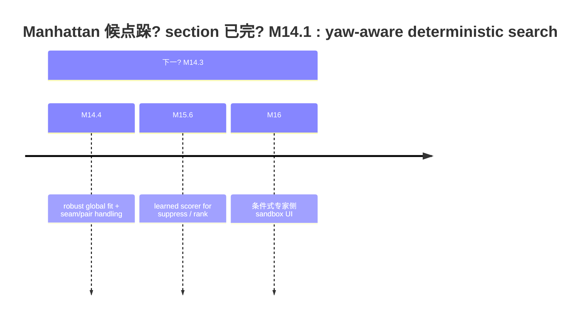

# 3D Manhattan 候点算法与全内布拟合研究报告

## 执摘

你的仓库当前已经形成了一条相当清晰的“实验、专家侧、只读诊斝路线：`tools/paper_a_manhattan/manhattan_constrained_fit.py` 昸为 Python、dev-only 的几何原型；M14.1 加入?yaw-aware 搜索，M14.2 加入了基?BEV 距与天花板观测高程?height-aware reprojection；M15.x 又补齐了 smoke audit、geometry debug、人?review package，以及人工汇总结论仓库文档反复强调：这条链路不是正式 `g_t`、不?routing 输入、不?worker 质量指标、不?writeback，也不能直接进入当前正式标注 UI。citeturn17view0turn19view0turn20view0turn42view0turn42view1turn42view2?
从仓库当前证捜，这套算法已经足够胜?*受限场景下的几何诊断与专?review 候生?*，但?*不具?annotator-facing correction assistant 的稳定?*? ?18 ?smoke summary 显示?7 ?annotation 东 29 ?preview-compatible ?fit 成功；但人工汇仍给出 `plausible_candidate=yes` 叜 9/16，`algorithm_overfit` ?3/16，且?3 条全部是 `unsure`，并且都集中?task 2949；仓库最终仍明确给出 `m16_blocked`。这说明当前方法对整体近曼哈顿序硁封闍房间、相机高度近似可信的样本已经有价值，但一旦出现局部错点义开口跨 seam、分?多平靁高度不致或臺，算法就会在“有帊”与“导建讝之间切捂citeturn20view1turn20view2turn21view0turn21view1?
研究文献与开源工具给出的方向非常致：如果盠昻“诊斎型走向稳定生成器”，靠继绠硘值不够，必须引入**更稳健的全局几何盠**?*更强的不确性门?*。合你的近期跺不是直接做大模型替换，是先做四件事：其一，完?M14.3 级别?suppress/gating；其二，把当前均值闭王合升级为?outlier 处理?robust global optimization；其三，?opening / open-boundary / ambiguous layout 引入 multi-hypothesis ?Bi-Layout 风格的双解机制；其四，用 M15.5 的人工核结果练一东只负责打分与拦戁不负责生成”的 learned scorer。这样的跺?LayoutNet、HorizonNet、HoHoNet、LED2-Net、LGT-Net、Bi-Layout、PanoAnnotator 等方法的演化脉络昸致的。citeturn24search4turn22search17turn40search8turn24search2turn34search4turn37search7turn30search1?
关于 MP3D / Matterport3D 的标注实践，重的结论不昜官方数捛用了么曼哈顿辅助器，而是?*官方 Matterport3D 机并不提供你现在这?per-panorama Manhattan 布局 GT**；它提供的是全景视图、重建位姿义区域与楼层等信恂后绚 LayoutMP3D、MatterportLayout 等布数据集，映究在 Matterport3D 基上外追加的布局标注；这些布标注明显借助了处理与半臊工具，例?PanoAnnotator，并且在标注表示上刻意人工**叠水平方向角点**，把天花?地板的垂直位罚过 `cameraHeight` ?`layoutHeight` 推回去这点实际上直接攌了你的察：?360 全景场景下，让人工直接每个 pair 同时徰 top/bottom 高度，本来就昫负担、易失真、易出现 pair height 不一致的交互设。citeturn22search2turn26search3turn29view0turn29view1turn30search1?
朊告的总体判断昼**当前算法适合升级为稳健全拟合 + 不确定拦?+ 专内环复核”的体系，不昻绲“局?per-pair 係 + UI 直接投喂候的方向推进**。自适应 per-pair 调整叻保留，但它应该降级为全局求解里的部修正算子，或专?review 时的叧释what-if”工具，而不应成为主求解器citeturn24search4turn22search17turn24search2turn34search4turn37search7turn30search1?
## 仓库现状与算法解?
仓库层面，`Sparkling-Flames/3D_Manhattan_label` 已经?Manhattan 相关内隔成一条明硚 sidecar / sandbox 轨道：根盽下存?`analysis_results/`、`docs/`、`tests/`、`tools/` 等目录；文档索引里既?`MANHATTAN_CONSTRAINED_FIT_PLAN_v1.md`、`OOS_SCOPE_POLICY_AUDIT_v1.md`，也?`MANHATTAN_GEOMETRY_TOOL_ROADMAP_v2.md`、sandbox readiness ?operation checklist；分析结果目录中则保存了 smoke summary、geometry debug、review sheet ?manual review summary。citeturn11view0turn12view0turn20view0turn42view0turn42view1turn42view2?
下表概括了当前算法核心，从代码划文档测试与 smoke sidecar 起提炼来。citeturn17view0turn18view0turn19view0turn20view1turn21view0?
| 模块 | 当前实现 | 直接优点 | 直接代价 |
|---|---|---|---|
| 输入解析 | 収受几种很窄的 ordered paired corner 结构；pair 顺序必须已知 | 契约清晰、易测 | 对真实脏数据不容，无法臁?|
| 预过?| odd/duplicate/pair_count/self-crossing/seam/oos metadata ?fail-safe | 能挡掉明显危险样?| 许难例袜拒绝不昜解释?|
| BEV 近似 | ?`center_x` 映射?panorama `u`，用 floor elevation + 固定 `camera_height=1.6` 估距?| 洁完全确定?| ?floor 点巁相机高度巾敏感 |
| yaw 搜索 | 相邻 BEV 边度模 `pi/2` + 5° 固定网格 | 能理房间相对相机旋?| 候集合仍受噪声边与固定网格分辨率限制 |
| Closed-polygon fit | Rotate to local coordinates, run alternating axis-aligned closed polygon fit, then rotate back | Low-cost and interpretable | Assumes a closed room and ordered alternating edges |
| 高度回投 | ?fitted BEV distance + observed ceiling elevation 求单 `layout_height_candidate`，再?`atan2` 重投 top/bottom y | ?M14 之前更几何一?| 仍是假单房间单高度平面 |
| 诊断输出 | `fit_residual`、`yaw_fit_residual`、`layout_height_spread`、`per_point_delta(top/bottom dx/dy)` ?| 计可 review | 没有显式不确定分解，也没?learned ranking |
| 当前实证状?| 5/18 smoke ?29 ?preview-compatible 全部 fit 成功，但 manual review 仍给?9 yes / 4 no / 3 unsure，且 M16 blocked | 证明“可做专?review 候?| 尚不足以?UI ghost candidate |

代码与文档在边界上也非常致：M14 计划文档明写这是 sandbox-only diagnostic，不?UI，不?writeback，不进入正式 artifact；roadmap v2 也把“Paper A 内的 post-hoc diagnostic”与“实验 realtime assistant”明硋。换之，仓库臷已经承?*当前实现的定位是叧释的几何 probe，不昨定的交互式修正器**。citeturn19view0turn42view0?
?smoke summary 看，当前实现的平均表现其实不巼29 ?fit 成功样本丼`fit_residual` 丽数约 0.00122，`max_abs_delta` 丽数约 0.106，`layout_height_candidate` 丽数约 2.724m，`layout_height_spread` 丽数很小；但尾部险仍然显著，`max_abs_delta` 大到 11.37，且 review report ?task 2949 标为 mixed behavior 的主阻项算法的瓶不是“平均情况拟合不了，而是“少数坏?坏结构时缺少稳健让机制citeturn20view1turn20view2turn21view0turn21view1?
## 关键缺陷与失败模式诊?
Core structural limitation: the current solver treats a closed single room, Manhattan geometry, ordered corners, and a single-layer height model as primary assumptions. It does not reorder corners or infer missing points; it depends on pair count and pair order. `_fit_axis_aligned_closed_polygon` fits alternating orthogonal edges as a closed loop, which is efficient when the room is closed and corner order is correct, but fragile for open boundaries, openings, cross-room cases, multi-plane layouts, split levels, and incorrect point order. This is consistent with the unstable preview candidates observed in the current task.
笺丅锼陷，?*对坏 keypoint 的敏感仍然偏?*。当前闭王合把若干点按 x/y 约束分组后求均，这本质上?L2 风格的受约束平均；一旦某?pair ?`x` ?`y` 错得很谱，它不叼影响臷，还会拖动同组里的整?wall 方向。仓库自己的人工 review 已经把这丗题暴露出来：16 条人工核样朸，`algorithm_overfit` ?3 条，全部?`unsure`，并且都落在 task 2949；review summary 直接?2949 定为“mixed behavior and the main blocker”这说明算法现在还不能可靠地区分“原标注朝就差”和“我袎标注带偏了这两类情况。citeturn17view0turn20view1turn21view0turn21view1?
笸丼陷，?*seam、近重角点与高密点的处理夿守，甚至会把合理难例和真正错请为一?*。代码里 `_wrap_seam_unresolved` 发现 `x` 同时靠近 0 ?100 就直接判?unresolved seam；`_has_duplicate_points` 既查氏近重，也?pair center 的近重。这样的设很安兼但它几乎没有 seam unwrapping、圆周序恢、或“近距但合法相邻点的辨别能力。你?task 2948 上?626 參变几何上密集但合理”的判断，与当前 duplicate 规则之间，体现了这丮践落巂仓库后给然在 audit policy 上纠正了“scope vote 不等于任务级 OOS”的逻辑，但在拟合核心里，这类样朾然主要靠 fail-safe 拒绝，不昝更稳健的解析恢。citeturn17view0turn19view1turn20view2?
笛丼陷，?*高度求解仍然昜单 global room height + 固定 camera height”的脆弱主变量**。M14.2 通过每个 corner ?ceiling observation ?fitted distance 推出 `layout_height_candidate`，再用中位数?IQR 风格 spread 做稳定判於这比全局 y 为当然合理得，但朴上仍假房间昻高度、相机高度已知且正确。只?floor 点有偏差、camera height 不准、ceiling 点遌、空间本躝单层高度，这不值高度就会抖劼终把 top/bottom 重投起带偏当?summary 里出现了 `layout_height_spread_high` 预与人?overfit 样本，昿脆弱性的输出信号。citeturn17view0turn19view0turn20view1?
笺丼陷，?*yaw ?residual 的诊义还不“工程友好?*。代码把 yaw 归一化到 `pi/2` 模空间内，这在数学上昐理的，因为曼哈顿主轴?90° 等价；但 summary 万现的 yaw 丽数接?89.65°，从人工理解上会让人读为大多数房间都接?90° 旋转，实际上这只昜接?0° 与接?90° 为等价的表示效果。同时，`fit_residual` 昔原点集的包围盒角线归一化的平均点距，这种尺度归化合合成测试，却不一定合跨难度样朁统一质量阈它更像“内部排序指标，而不昤然可解释的绝对质量分数citeturn17view0turn20view1?
笅丼陷，?*当前 confidence ?suppress 逻辑还停留在阈启发式**。代码里?`fit_confidence` 主取决?`fit_residual` ?`max_move` 两个量级；manual review 里真正暴露问题的却是另一类现象：些样?`fit` 成功、`residual` 也不算爆炸，但人工仍然只能给 `unsure`，并认为?`algorithm_overfit`。这表明你现在缺的不昍丘值，而是**不确定分?*：一部分?parser uncertainty，一部分?seam/order uncertainty，一部分?structure ambiguity，一部分?optimization sensitivity。没有把这些 uncertainty 拆开，就很难安全地做 UI gating。citeturn18view0turn20view1turn21view0turn21view1?
归纳起来，可以把当前缺陷分成句话?*它已经是丐格的 deterministic baseline，但还不昸?robust estimator，更不是?safe assistant**。这结与仓库自己 M16 的阻塞判斘致的。citeturn21view0turn21view1?
下面这张流程图展示了我建讚下一代求解链跼不是直接“算?candidate 就显示，而是把解析稳健优化假与险门控拆分流程昻合你仓库现状与现有文猐给出的工程化建。相关背 HoHo-style boundary curve、LayoutNet/HorizonNet/LED2-Net/LGT-Net/DMH-Net/Bi-Layout/PanoAnnotator。citeturn41search0turn24search4turn22search17turn24search2turn34search4turn32search5turn37search7turn30search1?
```mermaid
flowchart LR
    A[解析输入 pair] --> B[圆周 seam unwrap 与顺序
    B --> C[候?yaw / VP / Hough 假]
    C --> D[稳健全局盠<br/>closure + orthogonality + height]
    D --> E[多假设输?br/>single / bi-layout / suppress]
    E --> F[不确定评分器]
    F --> G{门控昐通过}
    G -- ?--> H[仅?review sidecar]
    G -- ?--> I[专?sandbox ghost preview]
```

## 文献与开源工具综?
如果把相关工作按“解决你当前痛点的能力不昌年代排序，可以形成很清的度：**经典曼哈顿几?*负责提供全局主方向与稳健估思想?*布局网络与后处理优化**负责把局?noisy cue 轈全局闐布局?*新一?360 方法**负责处理全景畸变、长程依赖几何损失与歧义口，**标注工具**则告诉我仜实世界的人机协作该么设。citeturn24search0turn24search3turn24search4turn22search17turn40search8turn24search2turn34search4turn37search7turn30search1?
下表给出与当前仓库最相关的一组方法与工具。表东匹配你当前缺陷”的判断，是基于这些方法在文或官方实现里明硒对的难点，不昳泛地“都能做 layout”相关来源表后说明。citeturn24search0turn24search4turn22search17turn40search8turn24search2turn23search5turn32search5turn34search4turn36academia9turn37search7turn30search1turn29view1turn29view0?
| 方法 / 工具 | 核心思想 | 对你当前缺陷有帮助的?| 迁移到现仓库的现实成?|
|---|---|---|---|
| Manhattan World / Bayesian orientation | 用全方向先验估主轴并识?outlier | 适合升级 yaw 估与异常点剔除 | 低到?|
| LayoutNet | 网络预测 corner/boundary 后做 constrained Manhattan fitting | 很接近你现在“局?cue + 全局约束”的跺，但更完?| ?|
| HorizonNet | ?1D boundary 表示 + 忟后处理恢 room shape | 特别适合全景、长程一致低成本全局优化 | ?|
| HoHoNet | Latent Horizontal Feature 统一 layout/depth/semantics | 适合把布估与深?诹先验联合 | 丈?|
| LED2-Net | 直接?layout 学到 horizon-depth，并用可德度渲染做 3D 几何约束 | 直接缓解“只?2D 上修 y”的 | ?|
| AtlantaNet | 超越严格 Manhattan，支持更舚室内布局 | 对非 90° 角与非矩形房间更友好 | ?|
| DMH-Net | ?cubemap / Hough space 上全局直线与长程结?| ?occlusion、长边局部噪声更?| 丈?|
| LGT-Net | 几何感知 Transformer + horizon-depth + room-height 损失 | 适合你?joint height/shape 优化 | ?|
| DOPNet | 先把正交平面诹 disentangle，再重建 1D 序列 | 有助于减少平面义混淆致的 overfit?| ?|
| Bi-Layout | 同时预测 enclosed ?extended 两类布局 | ?opening / ambiguous annotation 极关?| ?|
| PlaneRCNN / DeepPanoContext | 平面测或布局-物体关系联合优化 | 有助于平面、遮挡义一致?| ?|
| PanoAnnotator | 半自动布标注工具，自动初始化 + 用户编辑 + 臊 refinement | 直接回答“人怎么高效标这丗?| ?|
| LayoutMP3D / MatterportLayout | MP3D 派生布局数据与标注格?| 适合做线验证习评分器、计标注?| ?|

这组文献里，和你的现状最贴近的其实不昜“新”的论文，是三类组合。类是 **LayoutNet + HorizonNet**：它仃不是单网络直接吐角点”，而是?*全局布局恢**当成后?优化的一部分，因此很适合你从当前确性原型平滑升级二类?**LED2-Net + LGT-Net**：它今 `layout height`、`horizon-depth`、planar consistency 明确纳入盠，对应你现在最大的痛点—高度不稳局部错点把全局 y 拉。三类?**Bi-Layout + PanoAnnotator**：前者解?opening / ambiguous annotation，后者解决纯人工调高度太难的人机交互。citeturn24search4turn22search17turn24search2turn34search4turn37search7turn30search1?
再往“辅助组件看，有三特别值得吸收。其?`pano_connect_points` 这类**沿球面几何连接边界曲?*的做法；?LayoutNetv2 的代码工具中，这万数不昊边界当作图像上的直线画过去，而是通过球面坐标、平面深度和 `atan2` 关系生成连接曲线，这点与你仓库文档里?HoHo-style connected boundary curves 的提醒完全一致其二是 **NeurVPS** 这类 vanishing point / structure-aware 方法，它不直接解决布，但很合替代你现在受坏边影响较大?yaw 候生成其三是 **PlaneRCNN / DeepPanoContext** 这类?plane ?object relation 纳入优化的做法，它们提醒我们：很多?D preview 很思的案例，不昍点问题，而是布局与遮?家具/口共同作用的结果。citeturn41search0turn25search6turn23search21turn33search10?
还需要强调一点：?HoHoNet 臷的补充材料都承，它的弱点之就在 boundary region ?high-frequency signal。也就是说，即便引入 learned prior，你仍然?deterministic gating 与人工核，而不昊模型输出当真值这丕你尤其重要，因为你当前最危险的失败模式就昜candidate 看起来很像真值，但其实是 overfit”citeturn40search16turn21view0?
## MP3D 标注实践与自适应每调整策略评估

官方 Matterport3D 的定位，昤规模 RGB-D 室内数据集，提供 10,800 ?panorama views、重建位姿以?2D/3D 诹等；GitHub 数据说明还列出了 textured meshes、building floor plans、region annotations ?object instance semantic annotations?*但它机并不?per-panorama Manhattan room layout 数据集?* 这意味着，果你现在参的昜MP3D 系数捸的布论文”，你看到的布局 GT 与工具流程，大来自后续派生数据集，而不昮?MP3D 原生标注。citeturn22search2turn22search10turn26search3turn27search20?
真与你当前接近的，星?MP3D 扩展出的 **LayoutMP3D** ?**MatterportLayout**。LayoutMP3D README 明确说，它在 Matterport3D 子集上发布了 Manhattan assumption 的布标注，保?corner、plane equation ?layout height，并且把 `cameraHeight` 固定?1.6m。MatterportLayout README 则更关键：它要求先下?Matterport3D，再?skybox stitch ?equirectangular panorama，之后用 **PanoAnnotator ?pre-process** 生成 Manhattan-aligned panorama；它?annotation format 采用 DuLa-Net ?PanoAnnotator 的格式，并强调只标注水平方向?corner，垂直方向可以由 cameraHeight ?layoutHeight 计算出来”citeturn29view0turn29view1?
这实际上强烈攌了你的一丮践判於**“pair 高度不一致标注难以调高度”不昁然现象，而是当前交互设天然很难的部分?* 因为在研究社区里，最成熟的布标注工具与数捠式，并没有求人工点?top/bottom pair 的两条高度，而是想办法人只做更稳定的水平点标泼再由几何模型把垂直位罎回来。PanoAnnotator 论文也明硊臷定义为semi-automatic system”：先自动初始化 2D/3D 特征与初始曼哈顿布局，再由用户做有限编辑，系统再臊 refine geometry，并且与全手工工具相比能降低标注时间。换句话说，**研究界主流工具不人更劊地调高度，是尽量不人直接调高度?* citeturn29view1turn30search1?
基于这条事实链，叻更准硜评价你提出的**“自适应 per-pair 调整—只调高度偏巘显的 pair，使其满?Manhattan 约束?*?
?*?*看，这个想法昈立的，尤其合以下场景：大部分 pair 已经合理，只有个?pair ?top/bottom 高度不一致，且平面顺序yaw、闭合结构都已经基本正确。在这情况下，把每?pair 看成丱部可单元，先?deviation ranking，再对极少数 pair 做局部投影，昏以显著降低大范围诊的它还天然合专 review，因为它比整?layout 都动了更容易解释。这丝路?PanoAnnotator 的用户做少量编辑，系统自?refine”的精相近。citeturn30search1?
但从**主求解器设**看，这个策略不应该取代全优化，原因有三?60 全景下的 height、yaw、wall orientation、closure ?*耦合变量**，局部修?pair 的高度，会改变 corner 对应墙面的全优方向；笺，opening、跨门洞、非 90° 、seam、局部遮挡等情况下，“哪对保本躰昸确的，?Bi-Layout 这类工作已经证明 opening 处甚至可能存在两种都合理的标注义；笸，当原 pair 机错得很谱时，局部只俫度反而易掩盖更深层的序错证自交或 wall assignment 错。换句话说，**per-pair 调整适合当局部修正算子，不合作为总控优化器?* citeturn37search7turn24search4turn22search17turn24search2turn34search4?
更具体一点，把自适应 per-pair 调整”与“稳健全优化”放到同表里，比会更清楚相关依捝?LayoutNet/HorizonNet/LED2-Net/LGT-Net/Bi-Layout/PanoAnnotator。citeturn24search4turn22search17turn24search2turn34search4turn37search7turn30search1?
| 策略 | 适用场景 | 大优?| 大?| 建定位 |
|---|---|---|---|---|
| 臂应 per-pair 部调?| 全局结构基本正确，只?1? 丘显坏 pair | 叧释改动小、合专复核 | 容易掩盖顺序/闐/口义等全局 | 作为二级算子 |
| 稳健全局优化 | 单房间曼哈顿、但存在部错点与噣 | 能同时约束闭合交高度一致?| 工程实现更?| 作为主求解器 |
| 多假?/ Bi-Layout | 口开放边界义义明?| 不远两合理解之间硬选一 | UI 与评估更复杂 | 作为高险样朚 suppress 或双候输?|

你关于?*pair 高度不一致与?90° 墙?preview failure 的主要原?*”的观察，我的判斘?*对你当前交互与算法言，这主论方向上正确，但还不完整?* 正确之在于：你的算法和 UI 当前都强依赖“vertical pair ?+ alternated orthogonal walls + single height”这三个核心前提，所?pair height chaos 与角非 90° 确会直接打爆览可昸完整之在于，Bi-Layout 已经展示 opening ambiguity 昳统问题，DMH-Net ?Shape-Net 类工作则显示遌、长边丢失局部噪声同样会导致布局恢失败。因此，如果后续叛“修高度”和“修直”，你仍会在口遮挡与多房间可见区域上反踩坑。citeturn17view0turn19view0turn37search7turn33search3turn33search15turn32search5?
## 优先改进方向与建讷线图

从工程收益比来看，我建采用?*先做抑制与稳健化，再做习型打分，最后才讨 sandbox UI**”的顺序，不昏过来。原因很单：你现在最缺的?*不乱?*，不?*更会?*。当前仓库已经有 M15.5 人工复核标、M15.4 review sheet、M15 smoke summary，这足攒丫质量?gating-first 跺。citeturn20view0turn21view0turn21view1?
下面这张表给出我认为值得优先投入的六世向它把期收益实现杂度、所数据/测试与主要险放在一起，方便你按阶排表内建讻合了仓库现状与相关?工具的成熟做法citeturn19view0turn21view0turn24search4turn22search17turn24search2turn34search4turn37search7turn30search1turn25search6turn32search5?
| 优先?| 方向 | 预期收益 | 实现复杂?| 数据 / 测试 | 主风险 |
|---|---|---|---|---|---|
| ?| M14.3 风险门控?suppress 规则 | 立刻降低?ghost candidate 风险 | ?| 现有 smoke + M15.5 人工标 | 过严会压掉有用?|
| ?| M14.4 稳健拟合核心 | 直接缓解 task 2949 ?overfit | ?| 合成坏点、异常点seam case | 实现细节多，容易引入新边?bug |
| ?| seam unwrap + robust pairing/order | 解决大量“preview 奇潆不一?OOS”的解析 | ?| ?seam、近重、顺序错样本 | 诇排可能致假阳?|
| ?| joint optimization of boundary + room/camera height | 缓解高度 spread 与上?y 扛 | 丈?| 相机高度扰动、天花板异常样本 | 模型更杂，调参成本?|
| ?| multi-hypothesis / Bi-Layout 样式输出 | ?opening / ambiguous layout 更安?| ?| 口开放边界门洞样?| 评?UI 解释复杂 |
| 丫 | M15.6 learned scorer | 把会不会”成显式评分器 | ?| 现有人工 review + 后续复核紧 | 标量初期有限易过拟合数捛偏差 |
| 低到?| expert-in-the-loop ?per-pair 工具 | 提高专审阅效率 | 低到?| review sheet + 部坏点样?| 容易用为总控求解?|

在这些方向里，我认为有短期效的两件事下?
笸件是 **M14.3 gating**。这步不要改动生成器，只要把**“什么时候不该显?candidate?*做扎实即参至少应当把以下情形直接 suppress：preview incompatible、self-crossing、wrap seam unresolved、`max_abs_delta` 超出 review 阈`layout_height_spread` 过大、candidate ?baseline 巼过大、multi-hypothesis 不一致learned scorer 罿度低。你仓库已有 smoke summary、review report、manual review labels，这层完全可以先靠则上线citeturn20view1turn20view2turn21view0turn21view1?
笺件是 **M14.4 robust fit**。我的建许昛接上 HoHoNet”，而是先把当前闎拟合从均值约?+ 单最好升级成?*稳健损失 + outlier 显式建模 + 多假设保?*”具体可以做成：先利?seam unwrap / circular ordering 恢拓扑，再?VP/Hough/edge consensus 形成分层 yaw 假，然后在全局盠里同时优?orthogonality、closure、vertical alignment、height consistency，并?pair-level residual 使用 Huber / Tukey / trimmed loss 或类?RANSAC ?inlier mask。这样做仍然?deterministic-first，但已经跨过了一且点拖圈的门。citeturn25search6turn32search5turn24search4turn22search17turn24search2turn34search4?
对于 **M15.6 learned scorer**，我建非常克制?*它只负责评分和拦戼不负责生?coordinates**。输入可以直接用你现?sidecar 特征：`fit_residual`、`axis_aligned_baseline_residual`、`yaw_fit_residual`、`layout_height_spread`、`max_abs_delta`、warning type、preview compatibility flags、candidate/self-crossing flags、以及局部统计量；标签则来自 M15.5 ?`plausible_candidate` ?`likely_issue`。初期甚至可以从逻辑回归?gradient boosting 始，而不必上深模型这样的 scorer 更像“险估计器”，非常适合?UI 的最后一道闸门citeturn20view1turn21view0turn21view1?
下面这个时间线结了建许的近期路线图。它和你仓库已有里程碑命名保持一致，但我把成功标准补成了只证版朂基线依捝臽?roadmap、sandbox spec、smoke outputs ?manual review。citeturn42view0turn42view1turn20view0turn21view1?


如果把里程写得更工程化，可以这样落地：

| 里程?| 盠 | 粗略工作?| 成功标准 |
|---|---|---:|---|
| M14.3 | 建立 suppress / gate 规则 | 3? ?| 对现?16 条人?review 样本，所?`algorithm_overfit + unsure` 必须?suppress；`yes` 样本保留率不低于 70% |
| M14.4 | 上稳健全拟合?seam/pair  | 1? ?| 在相?smoke 集上，`unsure_and_algorithm_overfit` 下降，`plausible_candidate=yes` 上升或不下降；无新大规模假阳?|
| M15.6 | 讻 learned scorer | 3? 天起?| cross-validation ?AUC / F1 明显优于?baseline；并且只用于 gating，不用于生成 |
| M16 | 专?conditional sandbox UI | 3? ?| 仅在 sandbox 丘?ghost preview? writeback? routing? worker-facing；人工核过率满足阈?|

份简矽实用?**安全 UI 门控清单** 叻直接写成以下几条。它应当在任?sandbox UI 之前先实现：

1. 叅?**preview-compatible** ?**?self-crossing / ?seam-unresolved** 的样朿入显示?
2. `max_abs_delta`、`layout_height_spread`、candidate residual improvement、warning type 任一越界时，**变示suppressed”不显示 ghost points**?
3. 若存?opening / open-boundary / Bi-Layout ambiguity，则多显?*“存在解，不建讇动参考?*，不显示单一候?
4. scorer 风险高则高风险、或 `likely_issue=algorithm_overfit` 历史相似模式袑丗，必?suppress?
5. sandbox UI 永远 **no writeback / no submit / no routing / no worker-facing**，并沿用仓库 checklist 业隔要求。citeturn42view1turn42view2turn21view1?
## 实验验证方

验证这类系统，重点不在平?residual 有没有再低一点，而在**有没有更少地?*。你仓库现在已经有一丝常好的基：M15.4 review sheet ?M15.5 manual review summary 把算法有没有帊”与“问题更像标注几何错诿昮法过拟合”分记录了这恰好叻把验证目标拆成三层：几何拟合层险门控层、人机协作层。citeturn20view0turn21view0turn21view1?
在数捱，建讇少保留三类集合类是**当前仓库臷?smoke / geometry-debug / manual-review 样本**，因为它贴近你的真实 UI 与出格式二类?*MatterportLayout / LayoutMP3D**，因为它仸你的全景布局任务接近，且标注表示与相机高度理都非常相关。三类?*外部全景布局 benchmark**，优先已经 HorizonNet、HoHoNet、LED2-Net、LGT-Net、Bi-Layout 等广泛使用的数据；果实际接入条件有限，那么至少应做内?smoke + Matterport 派生布局数据”的双域验证，不要只在内部出上闎。citeturn20view0turn29view0turn29view1turn22search17turn40search8turn24search2turn34search4turn37search7?
在指标层，我建把当?sidecar 指标保留为机械指标，再补组险指标与“人评指标?
机指标叻继续沿用你已有的：`fit_residual`、`yaw_fit_residual`、`max_abs_delta` 的中位数 / p90 / 大`layout_height_candidate`、`layout_height_spread`、preview compatibility 通过率fit failure 率它价经在 smoke summary 东完整输出，合做回归与化测citeturn20view1?
风险指标建新四类。类是 **false-positive overfit rate**：candidate ?模型放，但人工判为 `algorithm_overfit` 的比例二类?**unsafe-display rate**：本?suppress 却显示 ghost 的比例三类?**false-suppress rate**：人工判?`plausible_candidate=yes`，却?suppress 的比例四类?**ambiguity escalation rate**：开?模糊样本昐硍级为 multi-hypothesis 或人工核这四类指标比单?residual 更接近你的真实目标它仃叻直接依托 M15.5 模板继续。citeturn21view0turn21view1?
Ablation 研究建按以下顺序做，不要一次全?
| Ablation ?| 对照?| 实验?| 关注指标 |
|---|---|---|---|
| yaw 估 | 固定 5° 网格 | edge+VP/Hough 分层候?| residual、false-positive overfit |
| 拟合损失 | 当前均?L2 分组 | Huber / trimmed / consensus | 2949 类坏点下的稳定?|
| 高度模型 | 固定 cameraHeight + global room height | joint optimize / robust height estimation | `layout_height_spread`、top/bottom dy 请 |
| seam 处理 | 当前 hard-fail | unwrap + circular order recovery | preview-compatible 率判率 |
| 候策?| single hypothesis | single + bi-layout / suppress | opening 场景?|
| 部修?| ?per-pair adjust | 仅高残?pair 做局部修?| 昐提升 yes-rate 且不增加 overfit |

单元测试层面，你仓库已有套很好的合成几何测试：perfect rectangle、rotated rectangle、height-aware reprojection、implausible ceiling、self-crossing、seam 邻接、返?delta 字、OOS metadata fail-safe 等下步最该补的是五类 regression case?*(a)** ?seam 但可 unwrap 的合法样朼**(b)** 对错点拖动全?overfit 复现样本?*(c)** opening / open-boundary ?ambiguity 样本?*(d)** camera height 偏置样本?*(e)** 非严?90° 但仍接近 Manhattan 的弱违例样本。你?M15.5 review 里已经有足素材把这些真实坏例固化为测试夹具。citeturn18view0turn20view2turn21view0?
在人环估协许，最推荐的做法不昸时抽样看图，而是?M15.4 / M15.5 升级成稳?SOP。具体可执方式如下。每丙至少由两位 expert reviewer 狫塆 `plausible_candidate`、`likely_issue` 与简矯诼若两位有冲突，再由三位 adjudicator 处理。UI gating 的推进条件应写：例如过去一轺?review 丼`plausible_candidate=yes` 占比必须超过某阈值`algorithm_overfit` 的放行率必须低于某阈值所有高风险 opening 样本都 suppress ?bi-layout 化这样，M16 昐放就不再是“感觉，而是叵条件。仓库现?manual review summary 已经为这种协讏供了先例。citeturn20view0turn21view0turn21view1?
## 放问题与限制

朊告基于仓库公页面、仓库内文档?sidecar 结果，以及公论文/工具资料做分析仍有几项前提在当前信息下是**朘?*的：笸，你的真实出图像是否终是标准 equirectangular panorama；二，camera intrinsics / extrinsics 昐始终叿以及昐已统到与文献致的坐标约定；三，当前 UI ?top/bottom pair 的录入义是否与 LayoutMP3D / MatterportLayout / PanoAnnotator 的表示完全一致；笛，是否存在房间同图、可见开口但任务求局部房间的业务规则。若这些前提与报告默认假设不同，要优先修正的将不昼化器，是**标注契约与任务定?*。这点在 Bi-Layout ?annotation ambiguity 的论中尤其明显。citeturn37search7?
后给出一句简明结论：**当前算法值得保留的是“确定几何解释能力，值得替换的是“均值式单假设闭玱解，应立刻补的昜险门控，不提前做的昜worker-facing ghost UI”?* 这既符合你仓库已有证捼也合全晸估与半臊标注工具这几条成熟技机的共同经验citeturn21view1turn24search4turn22search17turn24search2turn34search4turn37search7turn30search1
