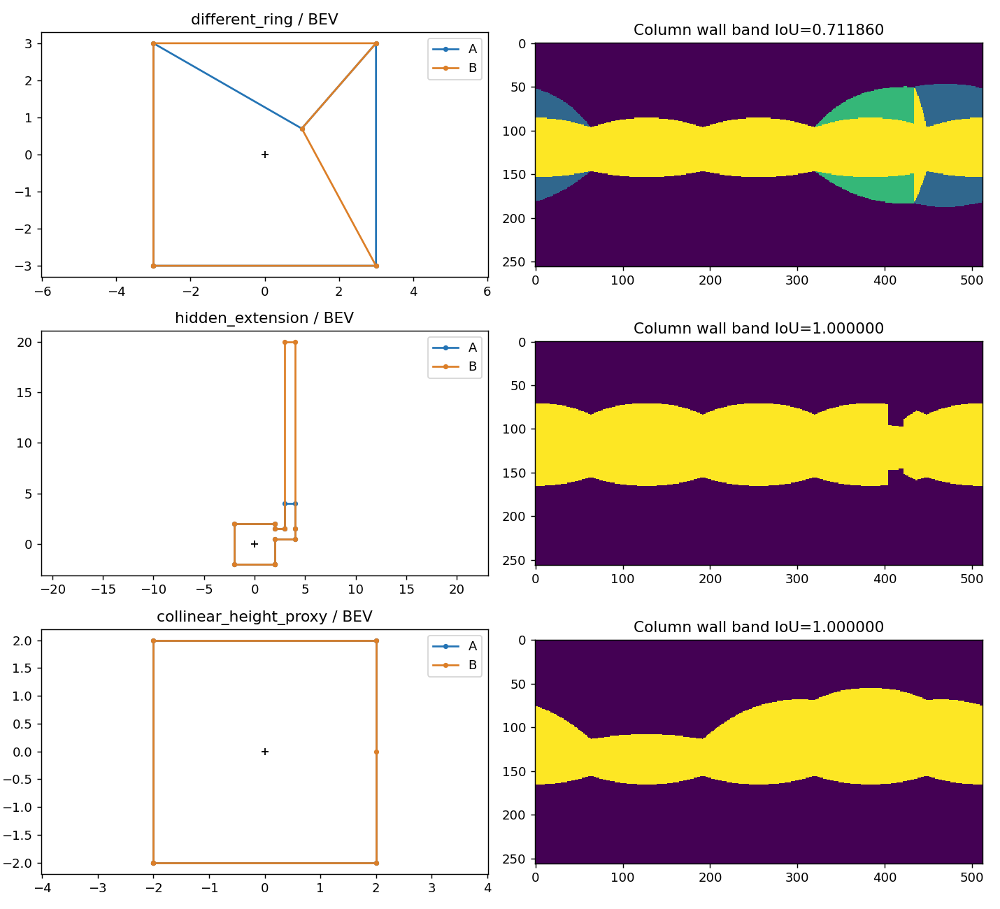
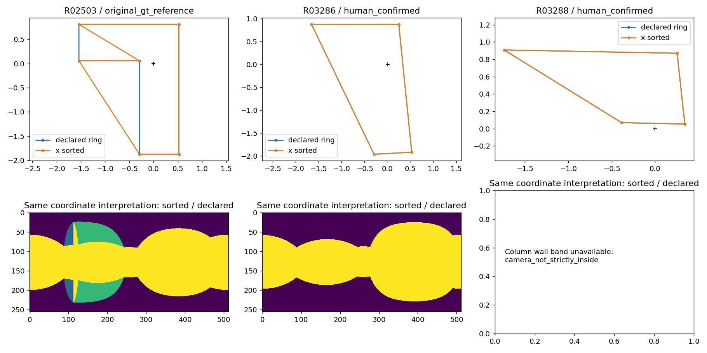

<!-- PAPER_A_MACHINE_STATUS: supporting -->
# 布局连线与表示：阶段1实现及清点

2026-09-30。依据当前研究方向及合同 `consensus_research_20260923_v1`，本轮只接入声明环表示、坐标敏感性和可计算性清点。没有运行人员评分、聚类、共识、候选搜索或权重选择，没有修改标注、配对、环序、资格或历史结果。

完整输入经 [manifest](../../analysis_results/research_input_20260929/manifest.json) 和 `load_current_bundle()` 校验读取，随后复用公开投影的身份别名和既有场景/审核字段。全部3441个对象，包括3152份人员、259份原始GT和30份人工修订GT；人员分母27人、259图，另有2图仅作人工GT参考。全量清点证明表示是否可计算，不证明环序、空间范围或视觉内容正确。

## 坐标追溯：已确认与未确认

| 环节 | 代码证据和已确认行为 | 仍未确认的事项 |
|---|---|---|
| 人员原导出 | `review_reconciliation_audit_20260925.verify_raw` 核对身份、1024×512、`image_rotation=0`；`x=百分比×1024/100`，`y=百分比×512/100`，没有半像素移动 | 浏览器百分比相对图像连续边界还是整数像素中心的标定含义；UI旋转0不证明相机重力已调平 |
| 原始GT | `build_order_gt_screened_20260928` 和 `order_review_20260928` 直接 `np.loadtxt(data/mp3d_layout/.../label_cor/*.txt)`，没有统一加减0.5 | 生成这些TXT的上游投影、取整和原点；不能仅凭整数/小数坐标猜测 |
| 人工GT | `materialize_model_gt_threshold_screen._read_test_gt` 从百分比乘10.24/5.12；源为 `export_label/groudTruth.json` | 与原始GT是否存在同一像素phase，不能无证据统一移动 |
| 当前预处理 | `apply_pairing_preprocessing_20260929` 沿用已确认改点及点身份，原始点初始化后，`shared_x` 取配对x的周期最短弧中点，y不变；`ordered_layout` 只按已接收排列建立独立数组视图 | 共享x不是相机调平，也不重新证明上下角色/视觉配对 |
| 旧墙带及训练坐标 | `lib.misc.panostretch.coorx2u/coory2v` 用 `(x+0.5)/W`、`(y+0.5)/H`；`wall_mask` 原默认和resize中心换算保留 | 这是kernel的已知输入约定，不是全部采集来源的实测标定 |
| 已审核重建/viewer | `geometry.pixel_ray` 原默认为连续 `x/W`、`y/H`；轴向为+Y向上，前向−Z，x=W/2看−Z，x增大经度增大。`studio.js` 纹理shader相同；`vis_3d.html` 也用连续坐标 | `vis_3d.html` 有显示用俯仰clamp、CAM_H=1.6；本轮计算不使用它的clamp，不把显示值解释为实测尺度 |
| 输出栅格与接缝 | 墙带射线固定采样 `(列+0.5)/W`、`(行+0.5)/H`；x按W周期，x=0与W同方向；整数列yaw平移通过循环移位检查 | 拼接接缝的实际场景朝向、局部warp及非中心成像误差 |
| skybox→当前ERP | 仓库layout链消费已经生成的ERP图及TXT。检索当前 `tools/`、`lib/` 和 `data/mp3d_layout/` 未找到六面skybox转换实现、逐图旋转/标定记录或原始六面资产。`lib/misc/pano_lsd_align.py` 是ERP旋转工具，layout读取链未调用它；实际调用位于独立depth数据链 | **未接通实际skybox→ERP生成链**：面序、面旋转、像素采样、重力旋转、拼接方式仍未知。不能以目录外的其他模型转换器或函数存在代替本数据的来源证据 |

当前合同 `representation.coordinate_frame` 仍写“像素中心”，viewer/公开基线的实现却为连续坐标。本轮明确保留该待判断差异：完整清点的声明足迹和列式墙带采用**连续坐标探索候选**，旧排序墙带同时报告continuous和pixel_center。没有把候选改成新规范，没有给全部GT/人员回写0.5，也没有单独拟合朝向、尺度或原点。

`pixel_ray/project_pixel/analyze` 新增显式 `coordinate_convention`，默认仍为continuous；`wall_mask` 默认仍为pixel_center。continuous只在传入旧kernel的局部数组副本减0.5，抵消kernel原有偏移；这不是改标注。几何单位为共同相机离地高度1，不称米。

接缝往返修正：`project_pixel` 的pixel_center横坐标先取W周期模、再减0.5，输出规范区间为 `[-0.5,W-0.5)`；`normalize` 仍接受 `[-0.5,W-0.5]`，右端点作为同一接缝的输入别名保留。没有放宽输入校验，continuous默认输出仍为 `[0,W)`。

## 表示及失败边界

- `declared_footprint` / `bev_range_iou`：底点与声明闭环的BEV范围。合法相机外足迹仍可计算；完整输入通过校验时，top错误半球、近地平线等几何失败与底点足迹分开判断。
- `declared_column_wall_band` / `declared_column_wall_band_iou`：按声明底环取最近正射线交点，在对应墙边上线性插值墙顶，再生成列式墙带。相机必须严格在内部，可见核外的合法凹环仍可计算。它不宣称一般未知屋顶的真实可见墙面。
- `legacy_x_envelope_continuous/pixel_center`：明确是x排序包络对照。任意换邻接不修复；同经度不同深度的声明点保留，旧包络不能容纳时明确失败。
- `historical_vertex_median_prism_proxy`：`research_round` 仅在显式 `--include-legacy-proxy` 时输出。没有屋顶观测就没有真实封闭体积指标；顶点中位墙高不能作本轮空间主分数。

输入拒绝与几何失败不同：数组及全体坐标先通过完整记录校验。即使底点合法，top越界或非有限值也会使整个输入被拒绝，BEV和墙带均为N/A；例如仅将合成记录的 `points[0][1]` 设为−1或NaN。上面的表示分离不适用于非法输入，本轮不新增补救逻辑或放宽校验。

`polygon_valid`、`camera_relation`（inside/outside/boundary/unavailable）、`camera_in_visible_kernel`、`wall_top_available`、`ring_confirmed/order_status`及每种表示的status/reason分别保存。未得到有效底点时，几何和可见核状态为null；“不可计算”不填IoU=0。原有 `surface_valid` 和合并issues保留供历史消费者，但新清点不拿它代替全部表示资格。

源点/点对索引、标签、共线点和原邻接保留。循环起点、反向环与真实共线细分等价；其他合法排列可以定义另一个区域，自交明确拒绝。闭环只是当前数组的表示模型，输出 `scope_closure_status` 不冒充人工验证；屋顶状态为 `not_observed_not_assumed`。本轮没有新增全量 `physical_wall/scope_cut` 人工前置要求。

原有0.5°地平线guard、1e−7短边guard、面积guard继续作为数值条件，不作为人员质量阈值。相机边界判定新增仅用于射线往返舍入误差的1e−12相对尺度容差。近于这些数值条件的对象须单独解释，不自动删点或淘汰人员。

## 全量表示清点

输出：[逐对象](../../analysis_results/layout_foundation_20260930/records.csv)、[分层分母及失败原因](../../analysis_results/layout_foundation_20260930/strata.csv)、[摘要](../../analysis_results/layout_foundation_20260930/summary.json)、[字段合同](../../analysis_results/layout_foundation_20260930/field_contract.json)。512×256栅格。`strata.csv` 分开 `population=annotations/all_objects`；同人可出现在多个场景，不能跨行累加人数或跨维度累加记录。

| 人员记录分层 | 人数 | 记录分母 | BEV可计算 | 列式墙带可计算 |
|---|---:|---:|---:|---:|
| 全部人员 | 27 | 3152 | 3007 | 2955 |
| 已确认环 | 24 | 1265 | 1264 | 1232 |
| 默认未审环 | 27 | 1887 | 1743 | 1723 |
| 清洗保留 | 25 | 2923 | 2917 | 2879 |
| 保留待定 | 7 | 11 | 11 | 11 |
| 审核排除 | 17 | 85 | 79 | 65 |
| 历史未纳入 | 12 | 133 | 0 | 0 |
| 上游主质量候选 | 25 | 2030 | 2029 | 2024 |
| OOS已确认 | 26 | 378 | 349 | 331 |
| OOS明确非OOS | 27 | 194 | 185 | 185 |
| OOS未记录 | 27 | 2578 | 2471 | 2437 |
| OOS待定 | 2 | 2 | 2 | 2 |
| 门洞可标 | 26 | 35 | 33 | 32 |
| 门洞难标 | 26 | 205 | 189 | 168 |
| 门洞明确无 | 27 | 199 | 190 | 190 |
| 门洞未记录 | 27 | 2713 | 2595 | 2565 |

OOS与门洞可重叠；未记录不是否定。范围/细节已有人员标记分别18/15份，其余仅标识“没有记录的标记”，不推断不存在。全部3441对象中BEV可计算3296，列式墙带3244，旧排序包络两种坐标解释均3240；原始GT和人工GT的BEV/列式墙带各为259/30份可计算，旧包络原始GT257份可计算。

人员BEV的145份失败：143份当前输入没有完整配对坐标（其中133份历史未纳入），1份越界，1份仅两对点。列式墙带额外52份失败：45份相机在声明区域外，7份墙顶错误半球。全量简单足迹中相机外45份、相机内3251份；可计算墙带中296份相机不在可见核。所有这些是表示诊断，未升级为人员错误。

异常追溯：`R01424 / rPc6DW4iMge-22` 为上游保留记录，底点y=3897.2824，明显超出512；原值保留并明确拒绝。`R01879 / uNb9QFRL6hY-68` 为已有审核排除记录，仅4个端点。没有补点、改坐标或恢复资格。完整原因和别名见逐对象CSV，内部身份仍只在原本地manifest中。

## 代表数值与图

| 受控案例（共同坐标、512×256） | BEV范围IoU | 列式墙带IoU | 历史中位高度代理 |
|---|---:|---:|---:|
| 同点、不同合法邻接 | 0.641667 | 0.711860 | 0.641667 |
| 转弯后的隐藏扩展 | 0.561644 | 1 | 0.561644 |
| 同一斜平顶实体增加共线点 | 1 | 1 | 0.714286 |



左列为共同相机坐标的足迹，黑色+为相机；右列紫色为均未覆盖、蓝色为仅A、绿色为仅B、黄色为共同墙带。面积/深度变化没有各自缩放。隐藏扩展的投影相同不等于完整范围相同；共线细分没有改变实体，历史代理却受顶点密度影响。

真实样例控制变量：[real_factorial.csv](../../analysis_results/layout_foundation_20260930/real_factorial.csv)。`R02503` 为原始GT参考环，**未人工确认**：同continuous输入下排序与声明墙带IoU=0.842130；只改输入phase，排序C/P IoU=0.995257，声明C/P=0.996265。已确认星形记录 `R03286` 同一坐标解释下排序与声明逐像素一致；仅phase变化IoU=0.996244。`R03288` 为已确认的合法相机外足迹，整圈内部墙带不可用。



图中只证明给定输入环的表示差异，不裁定哪条边符合照片。15份选样另与仓库冻结源码核验：全部原raw字段精确一致，13份旧默认墙带逐像素一致，2份不可用原因一致；12份星形记录在C/P各自约定下旧包络与声明墙带均一致。见 [选样兼容性](../../analysis_results/layout_foundation_20260930/selected_legacy_compatibility.json)。该选样核验不是全量几何正确性验证。

`synthetic_mesh_wall_mask` 选择性吸收Pro首交核，只对已知合成实体且显式给出屋顶三角形时执行：平顶矩形/非星形正例与列式结果一致；交替高低屋顶负例有明显屋顶首交遮挡差异。未将真实输入任意封顶。

## 改动及验证

- `panorama_studio/geometry.py`：显式坐标入口、底点独立重建、足迹/相机/可见核状态；历史raw字段和默认数学保留。
- `consensus_region_20260923.py`：旧墙带的显式坐标约定，默认不变。
- `layout_metric_probe_20260926.py`：独立命名BEV范围IoU、双向覆盖、面积差与面积质心距离，不附总分/体积代理。
- `research_round_20260929.py`：复用上述状态，新增列式墙带名，旧 `visible_wall_mask` 导入名保留；新运行输出schema为 `research_round_baseline_v2`，历史代理显式选择。此轮没有运行其研究算法。
- `summarize_research_round_20260929.py`：历史v1报告只接收v1，遇v2报错，避免沿用“可见/质量”的旧解释。历史输出仍原字节保留；历史复算源码仍在公开冻结包。
- `layout_foundation_20260930.py` 与对应测试：全量清点、少量图和已核验合成反例/网格对照，不复制legacy_main/explicit_main/重建适配器。

复杂逻辑先建立失败测试再实现；相关测试44项通过（把RuntimeWarning作为错误，最终无警告）。命令：

```powershell
& D:/anaconda/python.exe -B -X utf8 -m pytest tests/test_layout_foundation_20260930.py tests/test_panorama_studio.py tests/test_research_round_20260929.py tests/test_consensus_region_20260923.py tests/test_layout_metric_probe_20260926.py tests/test_current_research_input.py tests/test_consolidate_research_input.py -q -p no:cacheprovider -W error::RuntimeWarning
& D:/anaconda/python.exe -B -X utf8 -m tools.thesis_main.analysis.layout_foundation_20260930 --out analysis_results/layout_foundation_20260930 --width 512
& D:/anaconda/python.exe -B -X utf8 -m tools.thesis_main.analysis.render_paper_a_method_contract --check
```

本轮只测试所触及几何/输入链；未运行整库、Paper B、LS运营或浏览器测试，因为这些代码/UI未改。输出字段和schema有定向测试与独立字段合同。检查并最小同步地图/文档索引；不把探索结果升格为正式方法。没有浏览器截图或截图临时文件，保留的PNG是交付科学图。

`.gitignore` 仅新增本说明文档的精确允许项，使它能进入本地diff审查；不放开整个文档目录。工作区原有改动完整保留，本轮没有commit、清理或发布。

阶段1审查修正：先以接缝往返及再输入测试复现失败，再调整pixel_center投影公式；覆盖128/1024宽度、接缝两侧及边界。三份相关测试文件合计35项通过（RuntimeWarning作为错误），另通过合同渲染和 `git diff --check`。复现命令：`python -B -m pytest tests/test_layout_foundation_20260930.py tests/test_panorama_studio.py tests/test_research_round_20260929.py -q -p no:cacheprovider -W error::RuntimeWarning`。已删除重复的文档允许项，并补清非法top输入会连同BEV拒绝的边界。既有清点仍为3152人员、BEV3007、墙带2955：`inspect_panel` 的重建使用continuous且 `compute_fit=False`，不调用 `project_pixel`，旧包络入口也未改；因此未重跑全量清点或研究算法，已有CSV/摘要保留。

仍需研究判断：实际ERP来源、GT/人员phase与重力调平标定；未审环的视觉依据；停止边作为实墙还是范围截断；上边界不齐来自标注偏差还是真实屋顶；近地平线深度敏感性。`r=c·cot(α)`，`dr/dα=−c/sin²α`；即使完全合法，近地平线也会放大输入误差。本清点有效底点的最小俯角约1.8043°，没有设置新阈值。安全下一步是原图/来源核验和受控指标敏感性研究，暂不冻结质量权重。
